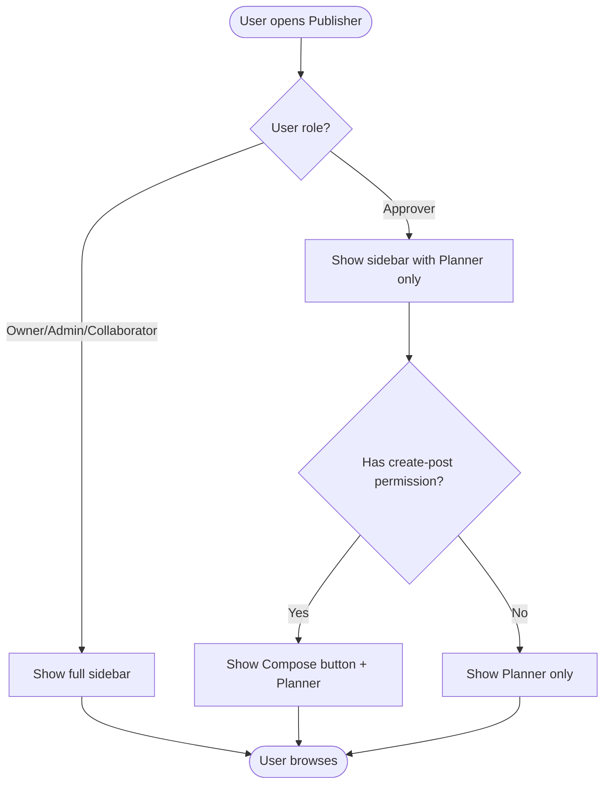
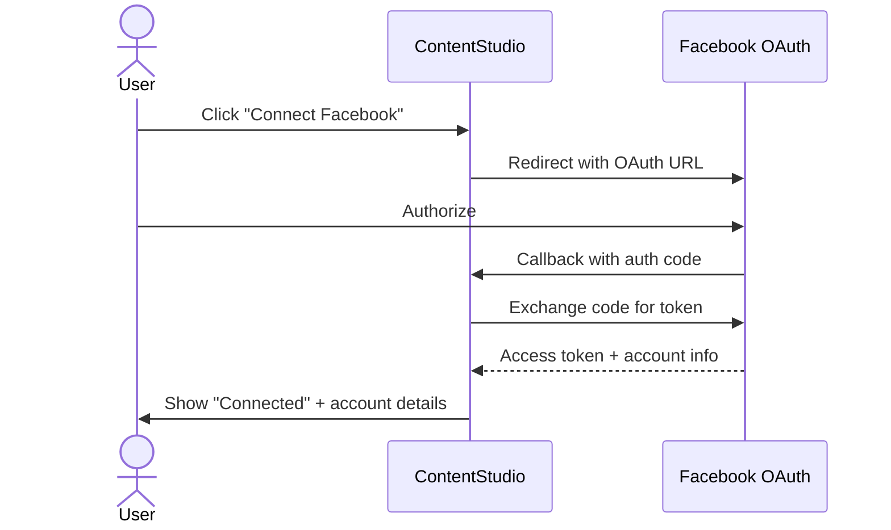
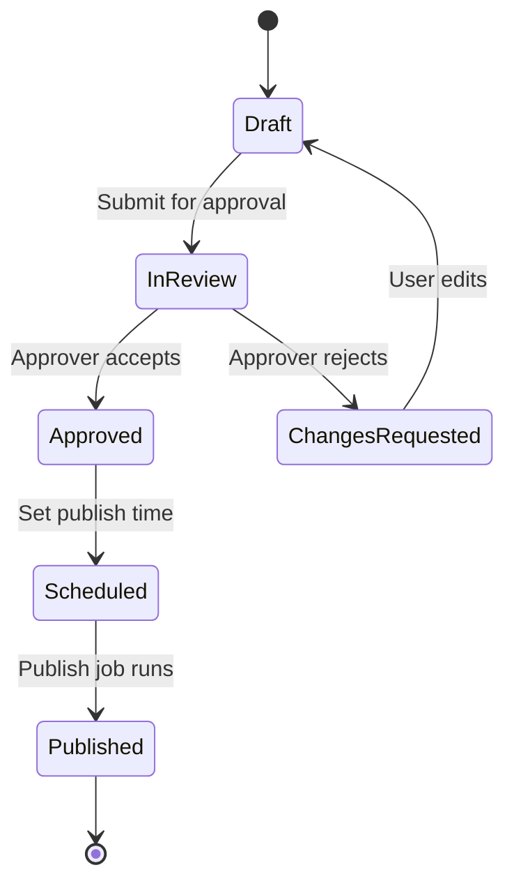

# Feature Pipeline: Research → PRD → Epic → Shortcut → [Implement FE]

You are a product automation pipeline for **ContentStudio** (https://contentstudio.io), a social media management platform. The user is a Product Owner. You will guide a feature from idea to Shortcut stories with review gates at each step.

## Input

The user provides: **$ARGUMENTS**

This should contain:
- **Feature name** (required)
- **Description** (required) — what the feature is, why we want it, any initial context
- **Specific competitors** (optional) — competitors to research beyond the default list
- **Additional context** (optional) — constraints, target users, related features, etc.

If the user only provides a name with no description, ask them to provide a brief description before starting the pipeline.

## Configuration

- **Shortcut config:** Read `.claude/shortcut-config.json` for all Shortcut API IDs (workflows, states, groups, custom fields, projects, miscellaneous epic, iterations)
- **PRD template:** Read `docs/PRD Feature Template.md`
- **Story template:** Read `docs/Shortcut story template.md`
- **Story guidelines:** Read `docs/story-guidelines.md` — **MANDATORY.** Every story must comply with all rules in this file. Read it before writing any stories.
- **UI components catalog:** Read `docs/ui-components.md` — **MANDATORY before writing FE stories.** Only reference components that exist in this catalog. Flag any gaps.
- **Output directory:** `docs/features/<feature-name-slug>/` (create it)

## Pipeline Steps

Execute these steps **sequentially**, with a **review gate after each step**. Do NOT proceed to the next step until the user explicitly approves.

---

### STEP 1: Research (Parallel)

Launch **two subagents in parallel** using the Task tool:

**Subagent A — Competitor & Industry Research** (subagent_type: "general-purpose")
- Use WebSearch to research the feature concept
- Search for how each competitor implements this feature (use default_competitors from config + any the user specified)
- For each competitor, search: "[competitor] [feature name] feature"
- Also search: "[feature name] best practices", "[feature name] UX patterns", "best [feature name] tools 2026"
- Compile a structured report with:
  - **What is this feature?** — definition, why users want it
  - **Competitor Analysis Table** — columns: Competitor | Has Feature? | Key Capabilities | Pricing Tier | UX Approach | Unique Differentiator
  - **Common Patterns** — what most competitors do similarly
  - **Differentiators** — unique approaches worth considering
  - **User Expectations** — what users expect as table stakes vs. delighters
  - **Recommended Approach for ContentStudio** — synthesis of findings

**Subagent B — Codebase Analysis** (subagent_type: "Explore", thoroughness: "medium")
- Search `contentstudio-backend/` for: related models, controllers, services, routes
- Search `contentstudio-frontend/` for: related modules, components, composables, routes
- **If the feature involves mobile/iOS/Android:** Also search `contentstudio-ios-v2/` (Swift) and `contentstudio-android-v2/` (Kotlin) for: related view controllers/activities, models, services, API clients, screens
- Be token-efficient: use Grep to find files, then Read only the specific sections needed — don't read entire large files
- Compile a concise report:
  - **Existing Related Code** — what we already have (with file paths)
  - **Reusable Components/Services** — what can be leveraged
  - **Integration Points** — where the new feature would plug in
  - **Technical Considerations** — database, API, queue, caching implications
  - **Mobile Impact** (if applicable) — existing mobile screens/flows affected, what the iOS/Android apps currently support for this area

**After both complete**, combine into `docs/features/<slug>/01-research.md` and present a summary to the user.

**Create a Shortcut Doc** for the research:
```bash
curl -s -X POST -H "Content-Type: application/json" -H "Shortcut-Token: [token]" \
  "https://api.app.shortcut.com/api/v3/documents" \
  -d '{"title": "[Feature Name] — Research", "content": "[full research markdown]", "content_format": "markdown"}'
```
Save the returned `id` (UUID) — it will be linked to the epic in Step 5.

**🔒 REVIEW GATE:** Ask the user:
- "Here's the research summary. Any competitors I missed? Any corrections? Should I dig deeper into anything? Reply 'approved' to continue to workflow design."

---

### STEP 2: Workflow Design

Based on approved research, create `docs/features/<slug>/02-workflow.md` containing:

1. **Feature Placement** — where in ContentStudio's UI this feature lives (navigation, entry points)
2. **Workflow Diagram (Overview)** — one mermaid diagram at the top showing the high-level user journey through this feature (see "Diagram requirements" below)
3. **User Flow** — numbered step-by-step happy path
4. **Alternative Flows** — error states, edge cases
5. **Key Design Decisions** — present 2-3 options where trade-offs exist, with your recommendation and rationale
6. **Integration with Existing Features** — how it connects to composer, planner, analytics, etc.
7. **Trackable Actions (Usermaven candidates)** — list user actions in this feature that should emit Usermaven events (e.g., addon purchase, first connection, AI generation success, settings change indicating commitment). For each, propose a candidate event name (snake_case, action-completed) and trigger. Skip the section if the feature is a pure refactor / copy change / UI gating change with no new trackable actions. (See guidelines section 19 for what counts as trackable.)
8. **Scope Recommendation** — what to include in v1 vs. defer to v2

#### Diagram requirements

Every `02-workflow.md` must include **at least one mermaid diagram** placed near the top (right after Feature Placement) that captures the feature's high-level user journey. Add **per-flow diagrams** inside individual flow sections only when they meaningfully add clarity beyond the numbered steps — don't force a diagram on every trivial flow.

**Pick the diagram type that matches what the feature actually is:**

| Feature shape | Use | Mermaid type |
|---|---|---|
| Branching user flow with decisions ("if X, do A, else B") — most product features | **Flowchart** | `flowchart TD` |
| Multi-system / multi-actor interaction over time — OAuth flows, webhook fan-outs, MCP tool → API → polling, third-party integrations | **Sequence diagram** | `sequenceDiagram` |
| Discrete states with rules for transitions — approval workflows, post lifecycle, account connection states | **State diagram** | `stateDiagram-v2` |

Mixing types within one doc is fine and often correct — e.g. an overview flowchart at the top, plus a sequence diagram inside the OAuth flow section, plus a state diagram for the approval-status transitions.

**Diagram conventions:**
- Use plain English labels (no class/method names) — workflow diagrams are user-POV, same as story workflows
- Keep nodes ≤ ~12 for the overview diagram. If you can't fit it, the flow is too detailed for the overview — split it into per-section diagrams
- For sequence diagrams, name actors by their role (User, ContentStudio, Facebook OAuth, etc.) — not by service/file names
- Always wrap the diagram in a fenced code block with the `mermaid` language tag so GitHub / Shortcut renders it

**Example — flowchart for a branching user flow:**



**Example — sequence diagram for an OAuth integration:**



**Example — state diagram for a status-driven feature:**



Present the workflow (with diagram) to the user.

**🔒 REVIEW GATE:** Ask the user:
- "Here's the proposed workflow with diagram. Any changes to the flow? Diagram capture the right shape? Disagree with any decisions? Reply 'approved' to continue to PRD."

---

### STEP 3: PRD

Using the approved research + workflow, fill in the PRD template (`docs/PRD Feature Template.md`) completely:

- Fill **every section** of the template — no placeholders, no TBDs (except genuinely open questions in section 9)
- User stories should come directly from the workflow
- Requirements should be prioritized P0/P1/P2
- Risks should be grounded in the competitor research and codebase analysis
- Dependencies should reference specific existing code from the codebase analysis
- **Analytics Events (§3.1):** Populate from the "Trackable Actions" identified in Step 2's workflow doc. For each event, specify name, trigger, payload, and what metric we measure with it. Before naming a new event, search `contentstudio-frontend/src/` for `userMaven.track(` to check if a matching event name already exists — reuse it. Skip the section (or write *"None"*) for pure refactors / copy-only changes / UI gating changes. (See guidelines section 19.)

Save as `docs/features/<slug>/03-prd.md` and present it.

**Create a Shortcut Doc** for the PRD:
```bash
curl -s -X POST -H "Content-Type: application/json" -H "Shortcut-Token: [token]" \
  "https://api.app.shortcut.com/api/v3/documents" \
  -d '{"title": "[Feature Name] — PRD", "content": "[full PRD markdown]", "content_format": "markdown"}'
```
Save the returned `id` (UUID) — it will be linked to the epic in Step 5.

**🔒 REVIEW GATE:** Ask the user:
- "Here's the complete PRD. Review each section. Any changes needed? Reply 'approved' to continue to epic & stories."

---

### STEP 4: Epic + Stories

Based on the approved PRD, create:

**Epic:**
- Title: clear, concise feature name
- Description: 2-3 paragraph summary from PRD overview + goals

**Stories:** Break the PRD requirements into implementable stories. **You MUST read `docs/story-guidelines.md` before writing any stories and follow every rule in it.**

For each story, use the Shortcut story template (`docs/Shortcut story template.md`):

- **Description:** User value — who, what, why — with context from the PRD. Strictly user-POV. **No file paths, class names, or implementation details in core sections** — those go in Implementation references at the end.
- **Workflow:** Step-by-step flow **written from the user's POV** — describe what the user does and sees, not technical implementation (no JWT/Redis/cache mechanics, no DB collection names). (See guidelines section 4)
- **Acceptance criteria:** Testable checkboxes describing **observable behavior**. No implementation prescriptions — AC describes *what* the user / API / system does, not *how* the dev should write it. (See guidelines section 7)
- **Mock-ups:** "See PRD section 7" or "N/A — backend only"
- **Impact on existing data:** What existing data/schemas are affected
- **Impact on other products:** Cross-feature impacts
- **Dependencies:** Reference other stories **by their full title**, never by number. (See guidelines section 2)
- **Global quality checklist:** All unchecked — this is for devs. Mark N/A items with a reason. No dark mode, no RTL. (See guidelines sections 3 and 8)
- **Implementation references** (optional, trailing section): When research surfaced useful pointers — codebase entry points, patterns to follow, suggested names, gotchas — bundle them in a final section after the quality checklist. Lead with: *"Pointers from research — not a contract. Engineering may choose a different approach."* Omit entirely if nothing useful surfaced. (See guidelines section 18)

**Frontend/UI story requirements (guidelines section 5):**
Every FE story MUST specify the actual UI copy for ALL of these elements:
- Modal titles, descriptions, CTA button labels, learn-more icon placement
- Form field labels, placeholders, helper text, validation error messages
- Toggle/option labels with tooltips (plain language, example-driven, layman-friendly)
- Info icon (`ℹ`) hover content
- Empty states (headline, subtext, CTA), error states, loading states (guidelines section 10)

**Analytics events (guidelines section 19):**
Any FE (or BE) story that introduces a trackable user action listed in PRD §3.1 must include the Usermaven event(s) as **testable AC items**:
- `- [ ] When the user [does X], a `[event_name]` Usermaven event fires with `[payload]`
- Event name + payload **must match the PRD §3.1 spec exactly**. If the spec needs to change while writing the story, update the PRD too — don't let the two drift.
- Most events are FE-dispatched. For server-side actions (subscription renewals, async job completions), put the AC in the BE story instead.

Write all tooltips and labels as if for a **non-technical user who has never used a social media management tool**. Include concrete examples in tooltips so the user understands instantly without thinking twice.

**Story splitting (guidelines section 6):**
- Prefix titles: `[BE]` for backend, `[FE]` for frontend, `[Design]` for design, `[iOS]` for iOS, `[Android]` for Android
- ALL UI copy lives in the FE story, never in BE stories
- BE stories cover: API endpoints, data models, validation, business logic, jobs, events
- **Create mobile stories** when the change impacts iOS/Android apps (guidelines section 15)

**Platform constraints (guidelines section 3):**
- No dark mode references — ContentStudio has no dark mode
- No RTL language references — not supported
- Mobile apps have no AI features — AI is web-only

**Shortcut field rules (guidelines sections 1, 11-14):**
- **Always use the "New Feature Template"** — pass `story_template_id` from config (guidelines section 1)
- **No estimates** — leave the estimate field empty. Devs estimate during sprint planning.
- **No labels** — don't add labels to stories.
- **Always assign a project** — Web App, Mobile, Chrome App, etc. (from config → `projects`)
- Stories created via `/feature` get their own epic (created in Step 5), not the miscellaneous epic.

For each story, also determine:
- **Group assignment:** Backend, Frontend, Full Stack, Design, etc.
- **Skill Set:** Frontend, Backend, Product, Design
- **Product Area:** Map to the appropriate product area from config
- **Project:** Web App for BE/FE, Mobile for iOS/Android, etc.
- **Priority:** Based on PRD priority (P0 = High, P1 = Medium, P2 = Low)
- **Story type:** "feature" for new functionality, "chore" for technical work

Save as `docs/features/<slug>/04-epic-and-stories.md` and present the full list.

**🔒 REVIEW GATE:** Ask the user:
- "Here are the epic and [N] stories. Review each story. Want to add/remove/modify any? Adjust priorities or assignments? Reply 'approved' to push to Shortcut."

---

### STEP 5: Push to Shortcut

Read the Shortcut config from `.claude/shortcut-config.json`.

Before pushing, determine the correct iteration:
- Fetch current iterations via: `curl -s -H "Shortcut-Token: [token]" "https://api.app.shortcut.com/api/v3/iterations"`
- Find the next upcoming iteration (status: "unstarted" with nearest start_date)
- Confirm with the user which iteration to use

**Create the Epic:**
```bash
curl -s -X POST -H "Content-Type: application/json" -H "Shortcut-Token: [token]" \
  "https://api.app.shortcut.com/api/v3/epics" \
  -d '{"name": "[epic title]", "description": "[epic description]", "epic_state_id": 500000002}'
```

**Link the Research and PRD docs to the Epic:**

After creating the epic, link both Shortcut Docs (created in Steps 1 and 3) to the epic:
```bash
# Link Research doc
curl -s -X PUT -H "Content-Type: application/json" -H "Shortcut-Token: [token]" \
  "https://api.app.shortcut.com/api/v3/documents/[research_doc_id]/epics/[epic_id]"

# Link PRD doc
curl -s -X PUT -H "Content-Type: application/json" -H "Shortcut-Token: [token]" \
  "https://api.app.shortcut.com/api/v3/documents/[prd_doc_id]/epics/[epic_id]"
```
These PUT requests return 204 No Content on success. The docs will appear in the epic's "Docs" section in Shortcut.

**Create each Story** (linked to the epic):
```bash
curl -s -X POST -H "Content-Type: application/json" -H "Shortcut-Token: [token]" \
  "https://api.app.shortcut.com/api/v3/stories" \
  -d '{
    "name": "[story title]",
    "story_template_id": "[New Feature Template id from config]",
    "description": "[story description in markdown]",
    "story_type": "feature",
    "workflow_state_id": [ready_for_dev state id],
    "epic_id": [epic id from above],
    "project_id": [project id — web_app for BE/FE, mobile for iOS/Android],
    "iteration_id": [iteration id],
    "group_id": "[group id]",
    "custom_fields": [
      {"field_id": "[priority field id]", "value_id": "[priority value id]"},
      {"field_id": "[product area field id]", "value_id": "[product area value id]"},
      {"field_id": "[skill set field id]", "value_id": "[skill set value id]"}
    ]
  }'
```

**After creating each story, add the template checklist tasks.** The `story_template_id` field does NOT auto-create tasks via API — you must create them manually:
```bash
curl -s -X POST -H "Content-Type: application/json" -H "Shortcut-Token: [token]" \
  "https://api.app.shortcut.com/api/v3/stories/[story_id]/tasks" \
  -d '{"description": "[task description]", "complete": false}'
```

The "New Feature Template" includes these 5 checklist tasks (create all 5 for every story):
1. `Mobile responsiveness tested (frontend only, N/A for backend-only stories)`
2. `Multilingual support verified (frontend + backend, translations available or fallback handled)`
3. `UI theming supported (default + white-label, design library components are being used)`
4. `White-label domains impact reviewed`
5. `Cross-product impact assessed (web, mobile apps, Chrome extension)`

**Key rules for the Shortcut payload:**
- **No `estimate`** — leave it out entirely. Devs estimate during sprint planning.
- **No `labels`** — leave it out entirely.
- **Always include `project_id`** — map from config: BE/FE → `web_app`, mobile → `mobile`, etc.
- **Always include `epic_id`** — use the epic created in Step 5.

**IMPORTANT:** Save the output file to disk first, then use it. On Windows, use `D:/code/CS/` paths and write JSON to file before passing to curl via `--data @file`.

After creating everything, compile all Shortcut links into `docs/features/<slug>/05-shortcut-links.md`:
```
# Shortcut Links — [Feature Name]

## Epic
- [Epic Title](https://app.shortcut.com/contentstudio-team/epic/[id])

## Docs (linked to epic)
- [[Feature Name] — Research](https://app.shortcut.com/contentstudio-team/doc/[doc-id]) — Research & Competitor Analysis
- [[Feature Name] — PRD](https://app.shortcut.com/contentstudio-team/doc/[doc-id]) — Product Requirements Document

## Stories
- [[BE] Create CRUD API for link-in-bio pages](https://app.shortcut.com/contentstudio-team/story/[id]) — Backend — Web App
- [[FE] Build link-in-bio page editor with live preview](https://app.shortcut.com/contentstudio-team/story/[id]) — Frontend — Web App
- [[iOS] Add link-in-bio page viewer](https://app.shortcut.com/contentstudio-team/story/[id]) — Mobile — Mobile
...
```

Present all links to the user.

After presenting links, ask: **"Would you like me to implement the [FE] stories now? Reply 'implement' to start, or 'done' to finish the pipeline here."**

If the user replies 'done' or skips, the pipeline ends here. If they reply 'implement', proceed to Step 6.

---

### STEP 6: Implement FE Stories (Optional)

**This step only runs if the user explicitly opts in.** It implements **only `[FE]` stories** — all other story types (`[BE]`, `[Design]`, `[iOS]`, `[Android]`) are skipped.

#### 6a. Setup

**Read the frontend coding standards:** Read `contentstudio-frontend/CLAUDE.md` — **MANDATORY.** Follow every rule: `<script setup lang="ts">`, Composition API, `@contentstudio/ui` component props (no Tailwind overrides), CSS variable theming, i18n for all user-facing strings, API URLs in `api-utils.js`, `proxy` for HTTP, etc.

**Read the UI component catalog:** Read `docs/ui-components.md` to know which components are available.

**Prepare the branch** in the `contentstudio-frontend/` directory:
```bash
cd contentstudio-frontend
git checkout develop
git pull origin develop
git checkout -b feature/<feature-slug>
```

Branch naming: `feature/<feature-slug>` (e.g., `feature/link-in-bio-editor`). Since multiple FE stories share one branch, use the feature slug — not a single story's sc-ID. Individual story IDs go in commit messages for Shortcut auto-linking.

Ask the user: **"Which branch should I create the PR against? (default: `develop`)"**

**🔒 REVIEW GATE:** Present the implementation plan:
- List all `[FE]` stories to be implemented, in order
- For each: files to create/modify, components to use
- Confirm the branch name and PR target

Wait for user approval before writing any code.

#### 6b. Implement Each FE Story

For each `[FE]` story (in dependency order):

1. **Read the story** from the docs output (`04-epic-and-stories.md`) to get the full spec — workflow, UI copy, acceptance criteria, component references
2. **Implement the code** in `contentstudio-frontend/`:
   - Follow `contentstudio-frontend/CLAUDE.md` strictly
   - Use `<script setup lang="ts">` for all new components
   - Use `@contentstudio/ui` components via props/variants — never override styles with Tailwind
   - Use CSS variables for theming (`text-primary-cs-500`, `bg-primary-cs-50`, etc.)
   - All user-facing strings via `$t()` / `t()` — add keys to **all locale directories** under `src/locales/`
   - API URLs in `src/config/api-utils.js`, HTTP via `proxy`
   - Composables in `src/composables/` for reusable logic
   - Place components in the appropriate module directory (`src/modules/<feature>/components/`)
3. **Commit per story** with the Shortcut story ID:
   ```bash
   git add <specific files>
   git commit -m "[sc-{story-id}] {story title — brief description of changes}"
   ```
   This links the commit to the Shortcut story automatically.

**After implementing all FE stories**, update the remaining non-FE stories' descriptions (if any `[BE]` stories exist) by adding a note at the top:
> **Note:** Frontend implementation is complete (see PR: [link]). This story covers backend integration and testing with the implemented frontend.

#### 6c. Create PR

**🔒 REVIEW GATE:** Before creating the PR, present a summary:
- Branch name and target branch
- List of commits (one per story)
- Files changed summary
- Any concerns or areas that need attention

Wait for user approval.

Then:
```bash
cd contentstudio-frontend
git push origin feature/<feature-slug>
```

Create a PR using `gh pr create`:
- **Title:** Feature name (e.g., `Link in Bio — Frontend Implementation`)
- **Base branch:** As confirmed by user (default: `develop`)
- **Body:** Include:
  - Link to the Shortcut epic
  - List of implemented stories with Shortcut links
  - Summary of changes per story
  - Files modified

```bash
gh pr create --repo d4interactive/contentstudio-frontend \
  --title "[Feature] <feature name>" \
  --base <target-branch> \
  --body "$(cat <<'EOF'
## Shortcut Epic
- [<Epic Title>](https://app.shortcut.com/contentstudio-team/epic/<id>)

## Implemented Stories
- [<Story Title>](https://app.shortcut.com/contentstudio-team/story/<id>) — <brief summary>
...

## Changes
<summary of what was built per story>

## Files Modified
<list of key files>

🤖 Generated with [Claude Code](https://claude.com/claude-code)
EOF
)"
```

Save the PR URL to `docs/features/<slug>/06-implementation.md` along with the branch name, commits, and files changed.

Present the PR link to the user.

---

## Important Rules

1. **Never skip a review gate.** Always wait for explicit approval before proceeding.
2. **Use AskUserQuestion** for review gates — present a summary and ask for approval.
3. **Save all outputs to disk** in `docs/features/<slug>/` so there's a paper trail.
4. **Use the exact templates** from `docs/` — don't invent your own format.
5. **For Shortcut API calls on Windows:** Write JSON payloads to a temp file first, then use `curl --data @filename`. Use `-o` to save responses to files, then read them with node.
6. **Parallel research only in Step 1.** All other steps are sequential.
7. **Be specific, not generic.** Every PRD section, every story, every acceptance criterion should be specific to ContentStudio and this feature — not boilerplate.
8. **Reference the codebase.** When describing where something plugs in, reference actual file paths from the codebase analysis.
9. **Create Shortcut Docs and link to epic.** The Research doc (Step 1) and PRD doc (Step 3) must be created as Shortcut Documents via the API and linked to the epic in Step 5. This keeps all feature context accessible directly from the epic in Shortcut.
10. **Implementation is optional and FE-only.** Step 6 only runs if the user explicitly opts in. Only `[FE]` stories are implemented — `[BE]`, `[Design]`, `[iOS]`, `[Android]` are left for their respective teams.
11. **Follow `contentstudio-frontend/CLAUDE.md` during implementation.** All coding standards (TypeScript, Composition API, i18n, theming, `@contentstudio/ui` usage) must be followed exactly.
12. **One branch, one commit per story.** All FE stories share a single branch. Each story gets its own commit with `[sc-{id}]` in the message for Shortcut auto-linking.
13. **Always ask PR target branch.** Don't assume `develop` — confirm with the user.
