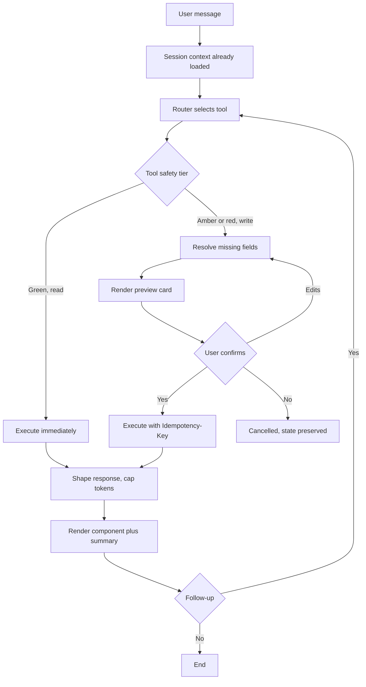

# **PRD: AI Chat Tool Layer — Full Workspace Control**

**Author:** Ghulam Jaffar
**Last Updated:** 2026-07-28
**Status:** Draft
**Target Release:** TBD

**Scope note:** this PRD specifies the tool layer and what it must cover. It assumes a separate, prior piece of work that unifies the four AI-operable surfaces behind a single tool-definition source — see §2 and §11. That architecture is a prerequisite, not part of this scope.

**Grounding:** all counts and existing-capability claims verified against live source on 2026-07-28. See [As-Built Baseline](https://app.helpin.ai/share/fff3d91449a0c4f64f84ac5eadc98f9d).

---

## **1. Overview**

ContentStudio's AI chat can already talk, generate images and video, and run 14 platform operations: list workspaces, accounts, posts, labels, campaigns, categories and team members, and schedule, delete, approve or comment on posts. What it cannot reach is most of the product. Of 159 public API endpoints, **127 have no chat tool** — all 99 analytics endpoints and all 28 inbox endpoints, plus media, account connections and the write paths on organisation objects.

This project completes the tool layer so a user can run ContentStudio by describing what they want. It is deliberately not a new capability build: every tool is a thin wrapper over an endpoint that already exists and is already permission-checked. The same tool layer then powers Agents and Skills without a second implementation.

---

## **2. Problem Statement**

**What problem are we solving?**

The chat looks like an operator and behaves like one for a narrow slice of publishing. Outside that slice it fails in the most damaging way available to a conversational product: it answers plausibly without acting, or it cannot answer at all.

Two concrete holes dominate:

- **Analytics is entirely unreachable.** 99 endpoints, and 86 per-metric narrative agents already written and running behind the analytics dashboards, none of it exposed to chat. "How did my profiles do last week" is the single most common question a social media manager asks a tool of this kind, and the chat cannot answer it.
- **Inbox is entirely unreachable.** 28 endpoints went live and no chat tool consumes them. "Any new messages" and "reply to the comments on my post" both fail.

Two structural problems make this worse than a missing-features list:

- **Tool definitions are duplicated across four surfaces** — the chat's Operations agent, the Laravel php-mcp server in the backend, the npm `contentstudio-mcp` package, and the CLI. A capability added in one does not appear in the others. Resolving this is a prerequisite to the work in this PRD, not an aside: adding tools before it lands means adding them up to four times.
- **Two response envelopes are in play.** The shipping `_envelope()` in `mcp_tools.py` and the proposed `{ok, summary, data, render}` shape in the tool catalog. Building more tools before this is settled multiplies the migration.

**Who has this problem?**

Every chat user, which today is a small fraction of active workspaces precisely because the chat cannot finish most jobs. The sharpest pain is on agencies and multi-account workspaces, where the per-account shape of the analytics API makes even a manual answer slow.

**What happens if we don't solve it?**

Competitors have shipped this. Vista Social's Ask Vista markets a single chat surface covering publishing, inbox, reporting, media generation, agents and skills, and it works well in testing. Our position is unusually strong underneath — a Feedly-class Discover engine, 86 analytics insight agents, a live inbox service — and unusually weak at the surface, because none of it is conversationally reachable. The gap is presentation, not capability, which makes it both cheaper to close and more embarrassing to leave open.

---

## **3. Goals & Success Metrics**

| Goal | Metric | Target | How We'll Measure |
| ----- | ----- | ----- | ----- |
| Primary: chat can complete real jobs | Task completion without user rephrasing | > 80% | Langfuse traces + session review |
| Primary: the model picks the right tool | Tool-selection accuracy, correct tool first attempt | > 92% | Langfuse traces, labelled sample |
| Coverage | Public API endpoints reachable via a chat tool | > 90% of non-deprecated endpoints | Tool registry audit vs `routes/api/v1.php` |
| Trust | Confirmation rejection rate, user says no to a preview | < 10% | Workflow state telemetry |
| Adoption | Active workspaces using chat weekly | 25% | Usermaven |
| Responsiveness | Median time to result, read queries | < 4s | APM |
| Responsiveness | Median time to result, publish workflow | < 20s | APM |
| Guard rail | Failed or errored tool calls | < 2% | Sentry + tool telemetry |
| Guard rail | Unintended writes, user reports an action they did not authorise | 0 | Support tickets |

**Confirmation rejection rate is the metric to watch.** It is the only one that distinguishes "the AI understood the user" from "the AI managed to call something."

### **3.1 Analytics Events (Usermaven)**

Search `contentstudio-frontend/src/` for `userMaven.track(` before implementing — reuse existing names where the action already has one, particularly around AI generation which is already tracked.

| Event Name | Trigger | Payload | What we measure with it |
| ----- | ----- | ----- | ----- |
| `ai_chat_tool_invoked` | A chat tool call completes, success or failure | `{ tool_name, domain, status, duration_ms }` | Coverage in practice, which tools users actually reach for, failure hotspots |
| `ai_chat_task_completed` | A multi-step workflow reaches `complete` | `{ domain, tool_count, had_confirmation }` | Task completion rate, workflow depth |
| `ai_chat_confirmation_rejected` | User rejects a preview at a confirmation step | `{ tool_name, workflow_step }` | The trust metric above, and where the AI guesses wrong |
| `ai_chat_post_scheduled` | A post is created through chat | `{ platform_count, publish_type, had_ai_media }` | Chat-attributed publishing volume, FE trigger |
| `ai_chat_inbox_replied` | An inbox reply is sent through chat | `{ element_type, platform }` | Inbox adoption, split by DM, comment and review |
| `ai_chat_analytics_queried` | An analytics tool returns | `{ metric, platform, account_count, was_composite }` | Whether the composites carry the load as designed |

FE fires all six. Payload names are `snake_case`, no PII, no account or workspace identifiers.

These become acceptance criteria in the FE stories. Story-level AC must match this spec exactly; if it changes, update both.

---

## **4. Target Users**

**Primary Persona: the working social media manager.** Runs 5 to 20 connected accounts across 3 or more platforms. Lives in the calendar and the inbox. Reports upward weekly or monthly. Not technical, does not know what an endpoint is, and judges the chat entirely on whether it finished the job. Wants to type "how did we do last week" and get an answer, not a chart-building exercise.

**Secondary Persona: the agency operator.** Manages many workspaces, one per client. Cares most about reporting and about not making mistakes on a client account. Their most valuable question — "which client had the best month" — is cross-workspace and stays out of scope here.

**Non-Users, explicitly out of scope:**

- **Developers wanting programmatic access.** They are served by the public API, CLI and MCP. Their needs shape the shared-architecture work, not this PRD.
- **Users wanting fully autonomous operation.** Every write in this scope is human-confirmed. Unattended action is Agents, and it is a separate decision with a separate risk profile.

---

## **5. User Stories / Jobs to Be Done**

| ID | As a... | I want to... | So that... | Priority |
| ----- | ----- | ----- | ----- | ----- |
| US-1 | Social media manager | ask how my accounts performed over a period and get a single answer | I don't open eight dashboards to answer one question | Must Have |
| US-2 | Social media manager | ask which account is doing best or worst | I know where to put effort, ranked fairly rather than by follower count | Must Have |
| US-3 | Social media manager | see what came into my inbox and reply from the chat | I clear engagement without switching context | Must Have |
| US-4 | Social media manager | reply to the audience comments on a specific published post | I can engage where a post is actually getting traction | Must Have |
| US-5 | Social media manager | change a scheduled post's caption or time by asking | I fix a mistake without deleting and rebuilding the post | Must Have |
| US-6 | Social media manager | be told my post breaks a platform rule before it is scheduled | I don't discover the failure hours later | Must Have |
| US-7 | Social media manager | use media I already uploaded, and have AI-generated media saved automatically | my assets are reusable rather than trapped in a transcript | Must Have |
| US-8 | Social media manager | connect a new social account from the chat | I finish onboarding where I started it | Should Have |
| US-9 | Social media manager | create and apply labels, campaigns and categories by asking | organisation doesn't require leaving the conversation | Should Have |
| US-10 | Agency operator | invite and manage team members from the chat | routine admin is one sentence | Should Have |
| US-11 | Social media manager | reply to a Google Business review | reputation management is not a separate errand | Should Have |
| US-12 | Social media manager | ask what is trending in my niche and turn it into a campaign | I stop starting from a blank page | Nice to Have |
| US-13 | Social media manager | know when a queued post will actually publish | the confirmation tells me the one fact I care about | Nice to Have |

---

## **6. Requirements**

Organised by domain, not by release. Priority is P0/P1/P2 as defined in the template.

### **6.1 Must Have (P0)**

**Foundation**

* **Single tool-definition source of truth.** A tool is defined once and is available to the chat, the hosted MCP server, the npm MCP server and the CLI. Do not add tools to a fourth place. This is the prerequisite architecture referenced in §2 and §11.
* **Resolve the response envelope** to one shape before any new tool is written. Either adopt the shipping `_envelope()` or migrate to the catalog's `{ok, summary, data, render, next_cursor, warnings}`. This is a Phase 0 blocker in the old plan and it is still the first thing to settle.
* **Error envelope carries a `suggested_tool`** so the model recovers in one turn instead of apologising. Requires structured `error_code` coverage on the API side — partly in place via `BaseApiController::localizedFlatError`, needs an audit.
* **Context bootstrap.** One cached, ~500-token block injected at session start: workspace id, name, timezone, first day of week; accounts with id, name, platform and connection status; labels, campaigns and categories as id plus name; user role and permissions; remaining AI credits; today's date in workspace timezone. Refresh on workspace switch and after any write that changes those lists. Replaces the scattered per-turn fetches happening today.
* **Permission filtering at the tool registry**, per user and per workspace, at session start. Never rely on system-prompt instructions to withhold a capability.
* **Safety tiers mapped onto the existing workflow state machine**, not bolted on as per-tool flags. Green auto-runs, amber previews and confirms, red requires explicit confirmation. The states already exist: `resolving`, `awaiting_accounts`, `awaiting_content`, `content_confirmation`, `awaiting_approvers`, `confirmation`, `complete`, `cancelled`.
* **Idempotency-Key on every write.** The chat retries. Without it a network blip publishes twice or double-sends a customer DM.
* **Tool responses are shaped, not proxied.** Cap roughly 2,000 tokens per result, top-N defaults, round numbers, strip nulls and empty arrays, attach a render directive so the UI draws a component instead of printing a table.
* **Metering.** Chat and agent tool calls count against the same meter as API and CLI usage.

**Analytics — the largest block of work**

* **Six parameterised tools**, not 99: `analytics_summary`, `analytics_trend`, `analytics_breakdown`, `analytics_top_posts`, `analytics_get_post`, `analytics_ai_insights`. The backend owns the `(platform, metric)` to endpoint mapping table. Full matrix in [Tool Catalog](https://app.helpin.ai/share/9a2e81a1a3ff56c267ca61d0c50e5217) §6.
* **Two composite tools that fan out server-side**: `analytics_workspace_overview` and `analytics_compare_accounts`. Every analytics endpoint takes a single `platform_id`, so without these the most common question in the product is 12 or more sequential calls.
* **`analytics_compare_accounts` returns normalised rates, not raw totals.** A 500k-follower account always wins on absolute engagement, which is never the question being asked.
* **Reuse the existing insight agents rather than re-deriving narratives.** 86 per-metric agents already produce the analytics insight text. The chat should consume them as input, not generate a competing second opinion on the same numbers.
* **Unsupported platform and metric combinations return a clean, specific error** naming what is available for that platform, so the model can offer the alternative in the same turn. Never an empty chart.

**Inbox**

* **Nine tools matching the live API shape**: `inbox_list_items`, `inbox_summary`, `inbox_get_thread`, `inbox_reply`, `inbox_triage`, `inbox_assign`, `inbox_tags`, `inbox_notes`, `inbox_moderate_comment`. Re-cut in [Tool Catalog](https://app.helpin.ai/share/9a2e81a1a3ff56c267ca61d0c50e5217) §8 against the real items/conversations/comments/reviews/tags structure.
* **`inbox_reply` covers all four reply targets**: DM, DM with media, post comment, and Google Business review.
* **Every reply previews before sending.** A message to a real customer cannot be unsent.

**Publishing completion**

* **`posts_update`.** Requires `PUT /posts/{post_id}`, which does not exist. Delete-and-recreate is not acceptable: it destroys the post id, approval history and internal comment thread.
* **`posts_validate`.** Requires a dry-run endpoint, which does not exist. Must return per-account pass or fail, the specific rule broken, warnings, and suggested fixes the AI can apply itself.
* **`media_list` and `media_upload`.** Every AI-generated asset lands in the media library automatically, or it exists only in the transcript and cannot be reused. This is also the audit trail for `is_aigc`.

### **6.2 Should Have (P1)**

* **Connections**: `platforms_list`, `accounts_connect` returning an OAuth URL rendered as a button, and `accounts_add_credentials` for Bluesky and Facebook Groups.
* **Organisation writes**: create, update and delete on labels and campaigns. Default the required `color` server-side from a palette rather than failing the call when the model omits it.
* **Team management**: invite, update role, remove. Admin only, always confirmed.
* **Workspace management**: create and update. Default or prompt for the required `logo` rather than failing silently.
* **`reviews_list`** paired with review reply, so reputation management is end to end.
* **Sentiment and intent fields on inbox items**, so triage does not re-analyse raw text on every run.
* **Server-side needs-reply filter** on inbox items, so the chat does not fetch the whole inbox to compute it.
* **Bulk inbox actions exposed.** The downstream service already accepts `element_ids[]`; the public route wraps a single id. A route-signature change, not new plumbing.
* **Best-time-to-post.** `active-users` exists for Facebook and Instagram only. Derive from `publishing-behaviour`, `performance-schedule` and our own post performance elsewhere, and label it clearly as an estimate. Never present a derived guess as platform data.
* **Queue and slot visibility**, so a queued-post confirmation can state when it will actually go out.

### **6.3 Nice to Have (P2)**

* **Discover and trending exposure.** The strategic differentiator, and currently unreachable. Open-web research already works through the existing Exa tools; our own curated index does not. Worth pulling ahead of its priority if the trending-topics-to-campaign journey is being marketed.
* **Content category writes**, so onboarding can set up a category structure conversationally.
* **Bulk post operations**: reschedule, label and campaign-assign across a filtered set.
* **Ads analytics.** Meta Ads and Google Ads insight agents exist internally with no public endpoints. A paid-media surface most competitors lack.
* **Media library completeness**: delete, and folder list and create, since `folder_id` is accepted on upload but not discoverable.
* **Account disconnect.** Connect and reconnect exist; nothing removes an account.
* **Publish diagnostics.** Structured reasons for failure beyond a status value.

### **6.4 Explicitly Out of Scope**

* **Agents and Skills.** This PRD builds the layer they consume. Both are separately specified in [Agents & Skills](https://app.helpin.ai/share/f4cb43a256cbad3ee529632028d38f30), and Skills in particular must be reconciled with the saved-prompts surface that already ships rather than built beside it.
* **Autonomous or unattended writes.** Every write is human-confirmed here.
* **Cross-workspace analytics.** "Which client had the best month" is a major agency ask and a distinct data-model problem.
* **Workspace deletion as a chat tool.** Irreversible, destroys everything, and nobody needs conversational convenience for it. Excluded from the registry deliberately.
* **New AI generation capability.** Image, video and caption generation already exist in chat and are unchanged by this work.
* **Blog publishing destinations.** Sunset.
* **Mobile.** The chat exists on mobile, but this tool layer targets web first. Mobile parity is a separate decision.

---

## **7. User Flow (High Level)**

Happy path, an analytics question that fans out:

1. User opens the chat and asks "how did we do last week"
2. Session context is already loaded, so no lookup turn is spent resolving the workspace or accounts
3. The model selects `analytics_workspace_overview` and passes a date range resolved in the workspace timezone
4. The backend fans out across every connected account, normalises metric names across platforms, and returns one shaped result
5. The chat renders a KPI grid with period-over-period change, and states the resolved date range back to the user
6. User follows up with "which one is worst", and `analytics_compare_accounts` ranks by rate rather than total
7. User says "draft something to fix Instagram", and the flow hands off to the existing caption and scheduling workflow, which previews and confirms before writing

Detailed per-domain flows and edge cases live in [Use Case Catalog](https://app.helpin.ai/share/03a7cf23c93af70ebde7a7410d4e6e5e), which covers roughly 70 scenarios with their tool chains.

---

## **8. Business Rules & Constraints**

| Rule ID | Rule | Rationale |
| ----- | ----- | ----- |
| BR-1 | `workspace_id` is never a model-supplied argument. Always injected from session context | The model must not be able to act on the wrong workspace by hallucinating an id. Already enforced today, must not regress |
| BR-2 | Permissions are filtered at the tool registry, never in the prompt | A prompt instruction is not an access control |
| BR-3 | Every write previews and confirms before executing. Batch writes confirm once, listing every affected item | An unconfirmed write to a customer's live calendar or inbox is unrecoverable |
| BR-4 | Confirmations name the object, never the id. "Delete the 3pm Instagram post about the summer sale?" | An id is not something a user can verify |
| BR-5 | Destructive tools are excluded from any agent's allowlist by intersection with a hard-coded non-destructive set | Agents run unattended. A red tool running unattended is a data-loss incident |
| BR-6 | `tiktok_options.is_aigc` is forced true server-side whenever media came from our own generation tools | A TikTok platform requirement, not a preference. Do not trust the model to remember it |
| BR-7 | Dates resolve in workspace timezone and are always stated back to the user in resolved form | "Friday" is ambiguous and mis-scheduling is highly visible |
| BR-8 | Credentials are collected through a secure UI input, never typed into the transcript, and never echoed back | Bluesky app passwords would otherwise persist in chat history |
| BR-9 | Audience comments and internal draft notes are separate tools with unmistakably different names | The endpoints differ by one path segment and mean opposite things. See the naming trap below |
| BR-10 | Analytics rate comparisons are normalised, never raw totals | Otherwise the largest account always wins and the ranking is useless |
| BR-11 | Derived estimates are labelled as estimates | Presenting a guess as platform data is a trust failure we cannot detect after the fact |
| BR-12 | An unsupported platform and metric combination returns a specific error naming the alternatives | Lets the model recover in the same turn instead of rendering an empty chart |

### **The naming trap engineering must not fall into**

`/api/v1/workspaces/{id}/posts/{post_id}/comments` is **internal team collaboration notes on a draft**, carrying `is_note` and `mentioned_users`.

`/api/v1/workspaces/{id}/inbox/posts/{post_id}/comments` is **audience comments on a published post**.

Both are live. The paths differ by a single `inbox/` segment and mean completely different things. When a user says "reply to the comments on my post" they mean the second one, every time. Tool names must be `posts_internal_notes` and `inbox_reply_to_comment`, and that naming must survive implementation review. Getting it wrong sends an internal draft note where a customer reply was intended.

---

## **9. Open Questions**

| Question | Options | Owner | Due Date | Decision |
| ----- | ----- | ----- | ----- | ----- |
| Which tool surfaces are in scope, and is the hosted php-mcp server deprecated? | Chat only / chat + npm MCP + CLI / all four kept in sync | CTO + Product | Before any tool is built | Pending — decided by the shared-architecture work |
| Which response envelope? | Keep shipping `_envelope()` / migrate to catalog shape | Tech Lead | Before any tool is built | Pending |
| Do we standardise on the existing overview agents' cross-platform metric mapping, or define a new one? | Adopt existing / define new | Product + Backend | Before analytics composites | Pending |
| Model choice and cost ceiling per tool-calling turn | — | Product + Tech Lead | — | Pending, affects metering directly |
| Chat home: AI Studio page first, or composer panel first? | AI Studio / composer / both | Product + Design | — | Recommend AI Studio first, composer once the tool layer is trusted |
| Do we support a short undo window on post creation instead of a confirmation dialog? | Yes / no / prototype | Product + Design | — | Worth prototyping. Cheaper than a dialog and feels better |
| Tool naming convention: keep the live `mcp_*` prefix or move to `domain_action`? | `mcp_*` / `domain_action` | Tech Lead | Before adding tools | Pending. `domain_action` clusters better in model attention |
| Is mobile in scope for the tool layer, or web first? | Web first / parity | Product | — | Pending |

---

## **10. Risks & Mitigations**

| Risk | Likelihood | Impact | Mitigation |
| ----- | ----- | ----- | ----- |
| Tool-selection accuracy degrades as the registry grows past ~40 tools | **High** | High | The whole point of collapsing 99 analytics endpoints into 6 tools. Hold the line on parameterised tools, measure selection accuracy continuously, and treat a new tool as a cost not a feature |
| The model writes to the wrong account or workspace | Medium | **Very High** | BR-1 and BR-2. `workspace_id` injected, permissions filtered at the registry, account ambiguity always renders a picker rather than guessing |
| A retry double-publishes or double-sends a DM | Medium | High | Idempotency-Key on every write, mandatory before any write tool ships |
| The model confuses internal draft notes with audience comments | **High** | Medium | BR-9 and the naming trap above. Distinct names, and a review gate on the naming |
| Building tools before the envelope and surface questions are settled | **High** | High | Both are gating open questions. Do not start tool work with them open |
| AI-written posts fail platform rules and users find out at publish time | High | Medium | `posts_validate` is P0 for exactly this. Until it exists, constrain generation and surface known limits in tool descriptions |
| Two different answers to the same analytics question, one from the insight agents and one from the chat model | Medium | Medium | Chat consumes the existing insight agents as input. Never present a competing second opinion on the same numbers |
| Cross-platform metric normalisation is read by clients and leadership and means different things per platform | Medium | High | Requires explicit product sign-off, not engineering judgement. Adopt the existing overview mapping rather than inventing a second |
| Analytics fan-out is slow enough that the headline question feels broken | Medium | High | Server-side composites, streamed progress past 3 seconds, and a latency target in section 3 |
| Scope sprawls because every gap looks small | High | Medium | Section 6.4 is deliberately explicit. Agents, Skills, cross-workspace and mobile are all out |

---

## **11. Dependencies**

**Internal**

* **Shared AI-surfaces architecture.** Owns the single tool-definition source, the shared auth model and the action contract across chat, the hosted MCP server, the npm MCP server and the CLI. Effectively a prerequisite: building tools before it lands means building them up to four times. **This is the piece that needs designing before this PRD can be executed.**
* **`contentstudio-ai-agents`** — the chat runtime. Adding an operation touches nine places; the checklist is in that repo's `CLAUDE.md`. Budget for it per tool.
* **`contentstudio-backend`** — all new endpoints, plus the structured-error and token-status audits.
* **`social-inbox-manager`** — sentiment and intent fields, and the needs-reply filter.
* **Analytics pipeline** — the public analytics endpoints proxy to it. Composite fan-out performance depends on it.
* **Design** — the render component set: post preview, KPI grid, chart, confirmation card, account picker, media grid, OAuth connect button, secure credential input. A `[Design]` story is required.
* **Metering and billing** — chat and agent calls counting against the same meter.

**External**

* Platform rules that `posts_validate` must encode, and their drift over time.
* OAuth flows for `accounts_connect`, which complete out of band and need a return path into the chat session.

**Blockers, must be resolved before work begins**

1. **The surface question** and **the envelope question**, both in section 9. Everything else compounds off them.
2. **`PUT /posts/{post_id}`** and **`POST /posts/validate`** do not exist. Both are P0 in section 6.1 and neither can be worked around.
3. **Idempotency-Key support** on write endpoints, before any write tool ships.
4. **Audit whether structured error codes and account token status** are already complete. Both may be partly done, and both are load-bearing for error recovery and for "which accounts need reconnecting."

---

## **12. Appendix**

* [Master Plan](https://app.helpin.ai/share/8b2f5e6ba684c119be24b9e9980b18bc) — strategy, architecture decisions, competitive read
* [Tool Catalog](https://app.helpin.ai/share/9a2e81a1a3ff56c267ca61d0c50e5217) — the tool spec, each mapped to endpoints, with an exists-today column
* [Use Case Catalog](https://app.helpin.ai/share/03a7cf23c93af70ebde7a7410d4e6e5e) — roughly 70 scenarios, tool chains, edge cases. The source for stories
* [Agents & Skills](https://app.helpin.ai/share/f4cb43a256cbad3ee529632028d38f30) — out of scope here, consumes this layer
* [API Gap Register](https://app.helpin.ai/share/fcecca058116a1870cb931c33d11e168) — every API gap, prioritised, with effort
* [As-Built Baseline](https://app.helpin.ai/share/fff3d91449a0c4f64f84ac5eadc98f9d) — verified current state. Wins any disagreement with the others
* `contentstudio-backend/routes/api/v1.php` — the authoritative endpoint list. The exported OpenAPI JSON is stale, showing 118 endpoints against the live 159
* `contentstudio-ai-agents/src/orchestration/mcp_tools.py` — the 14 live tools and the shipping response envelope
* `contentstudio-ai-agents/CLAUDE.md` — the workflow state machine, the intent-detection layer, and the nine-place checklist for adding an operation
* `contentstudio-backend/app/Mcp/Tools/` and `routes/mcp.php` — the hosted php-mcp server, 8 tools
* Competitive analysis: Vista Social "Ask Vista" — publishing, inbox, reporting, media generation, agents and skills in one chat surface. Worth copying: named agents, the saves-X-hours badge, live run status, describe-then-confirm-then-run creation. Worth beating: they have no content discovery engine

---

## **Changelog**

| Date | Author | Changes |
| ----- | ----- | ----- |
| 2026-07-28 | Ghulam Jaffar | Initial draft. Written against verified codebase state, structured by domain rather than release per request |
