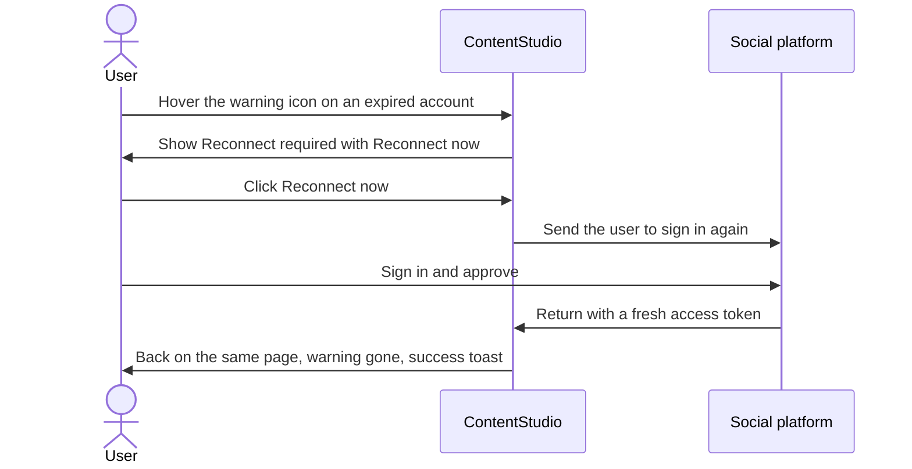
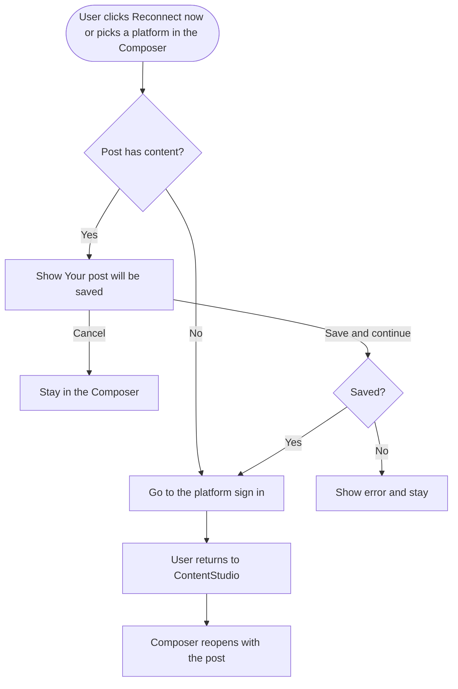

# Epic: Reconnect and connect accounts from wherever they're used

## Epic description

When an account's access token expires, ContentStudio tells the user in three different ways depending on where they look. The Composer says "The access token for this social account has been invalidated, please reconnect to continue posting." Analytics says "To view your updated data, you must reconnect your account." The Inbox and Planner say "Your Account Token is Expired." None of them offers a way to fix it. The user has to work out on their own that they need to go to Settings, find the account and press Reconnect there. Where a "Reconnect Now" button does exist, in most analytics banners it opens the generic Connect Social Accounts modal instead of reconnecting the account that is actually broken.

This epic makes an expired account say the same thing everywhere and fixes it in one click. Every flagged account gets the same **Reconnect required** message, written in plain words, with one sentence that changes per module to say what has stopped working there: posting in Composer, data in Analytics, comments and messages in Inbox. Next to it sits **Reconnect now**, which starts the reconnect for that exact account and brings the user back to the page they were on. A **Why did this happen?** link opens our help article in the in-app help widget.

The same idea applies to connecting new accounts. Every account picker gets the `+` and settings shortcuts the Label and Campaign dropdowns already have: `+` opens the Connect Social Accounts modal right there, and the gear goes to Settings > Social Accounts.

**Design canvas:** https://claude.ai/artifact/APzGjGQbTCJn8rYJ5EHtur

### Scope

In:

- One shared "Reconnect required" message with Reconnect now and a help link, on every account list that flags an expired account
- Banners, alerts and error messages about expired tokens rewritten to match, with their Reconnect now reconnecting the right account
- The Composer post is saved before the user leaves to connect or reconnect, and reopens when they come back
- `+` and settings shortcuts in the main account pickers: Composer, Planner filter, Schedule post modal, Analytics, Inbox filter, Automations
- The connect permission and the return address checked before the user is sent to the platform

Out:

- Settings > Social Accounts, which already has its own Reconnect action
- Threads and LinkedIn "extra analytics permission" prompts, which are a missing-permission case, not an expired token
- Small pickers where a connect shortcut is noise: first-comment and carousel dropdowns, planner bulk edit, AI chat account picker, team member access settings
- The mobile app
- Publish / Inbox / Analytics columns in the Connect Social Accounts modal. Designed on the canvas (row 3) and drafted, held back for a later epic

### Stories

1. `[Design] Design the Reconnect required message and the account picker shortcuts`
2. `[BE] Check connect permission and the return address before sending a user to a platform`
3. `[FE] Show "Reconnect required" with a Reconnect now button on every expired account`
4. `[FE] Save the Composer post before leaving to connect or reconnect an account`
5. `[FE] Rewrite expired-token banners and alerts to match, and reconnect the right account`
6. `[FE] Add connect and settings shortcuts to every account picker`

---

# [Design] Design the Reconnect required message and the account picker shortcuts

### Description

As a designer, I want to define the final visuals and interaction states for the new Reconnect required message and the `+` and settings shortcuts in account pickers, so that every build story in this epic works from one agreed reference and the same message looks the same in Composer, Analytics, Inbox, Planner and Automations.

The design canvas already covers the direction the PO approved. This story turns it into production design: final spacing, the component choices from our library, and the states the canvas only hints at.

---

### Workflow

1. Designer reviews the design canvas (link below) and the current screens: Composer account list, Analytics account dropdown, Inbox filter, Planner filter, and the Schedule post modal.
2. Designer finalises the **Reconnect required** popover: warning icon, heading, the module-specific sentence, the "Why did this happen?" link and the Reconnect now button, plus its loading state ("Opening Facebook...") and the version for users who aren't allowed to reconnect (no button, "Ask a workspace admin to reconnect it.").
3. Designer defines how the popover opens and stays open: it opens on hover or click of the warning icon and stays open while the pointer moves into it, so the button is reachable.
4. Designer settles one warning icon colour for every surface. Today some screens use orange and some red.
5. Designer produces the `+` and settings header for account pickers in both a narrow sidebar (Planner filter, Inbox filter) and a dropdown (Analytics, Schedule post modal), matching the Label and Campaign dropdowns.
6. Designer produces the banner treatment for Analytics and the header notification using the same heading and icon.
7. Designer confirms which pieces use existing library components and flags anything that isn't in the library.

---

### Acceptance criteria

- [ ] Final designs cover the Reconnect required popover in Composer, Analytics, Inbox, Planner filter, Schedule post modal and Automations, showing the module-specific sentence for each
- [ ] The popover has designed states for: default, Reconnect now loading, and no permission to reconnect
- [ ] The popover's open and close behaviour is specified, including that it stays open while the pointer is over it
- [ ] One warning icon colour is chosen and used on every surface
- [ ] The `+` and settings header is designed for sidebar pickers and dropdown pickers, with tooltips "Connect a new account" and "Manage accounts in Settings"
- [ ] Analytics banners and the header notification use the same heading and icon as the popover
- [ ] Every element is mapped to an existing `@contentstudio/ui` component, or flagged as a gap. Known gap: there is no standalone tooltip or popover component in `@contentstudio/ui`, so the popover needs either a library addition or the legacy `CstPopup`
- [ ] Designs are handed off to the FE stories in this epic

---

### Mock-ups:

Direction approved by the PO on the design canvas: https://claude.ai/artifact/APzGjGQbTCJn8rYJ5EHtur

- Row 1: Reconnect required in Composer, Analytics and Inbox
- Row 2: `+` and settings in the Planner filter and the Analytics dropdown
- Row 3 (the connect modal's capability columns) is not part of this epic

---

### Impact on existing data:

None.

---

### Impact on other products:

Web app only. The mobile app has its own reconnect flow and is out of scope. The Chrome extension doesn't show account lists with reconnect state.

---

### Dependencies:

None. Blocks every `[FE]` story in this epic.

---

### Global quality & compliance (wherever applicable)

- [ ] Mobile responsiveness (frontend only, N/A for backend-only stories)
- [ ] Multilingual support (frontend + backend, translations available or fallback handled)
- [ ] UI theming support (default + white-label, design library components are being used)
- [ ] White-label domains impact review
- [ ] Cross-product impact assessment (web, mobile apps, Chrome extension)
- [ ] Developer surfaces coverage — N/A, design only, nothing API-facing changes

---

# [BE] Check connect permission and the return address before sending a user to a platform

### Description

As a workspace owner, I want ContentStudio to refuse a connect or reconnect before it sends someone off to Facebook, LinkedIn or any other platform, when that person isn't allowed to connect accounts or the page they'd return to isn't ours, so that team members don't go through a whole sign-in only to be told at the end they had no permission, and so that a connect link can never be used to send someone to an outside website.

Today the permission check happens only when the user comes back from the platform, after they've already signed in there. And the address the user is sent back to is accepted as any text at all. This epic adds Reconnect now buttons and connect shortcuts across the whole app, and every one of them sends a return address, so both checks need to happen up front.

---

### Workflow

1. A team member without permission to connect accounts clicks Reconnect now on an expired account (the button is normally hidden for them, but a stale page or a direct request can still reach the server).
2. ContentStudio refuses straight away, before any redirect, and the user stays on the page with an error.
3. A team member with permission clicks Reconnect now in Analytics.
4. ContentStudio checks that the page it will send them back to is a ContentStudio page for their workspace, including a white-label domain.
5. The user signs in on the platform and lands back on the same Analytics page.
6. If a return address points anywhere else, ContentStudio ignores it and sends the user back to Settings > Social Accounts after they sign in.

---

### Acceptance criteria

- [ ] Starting a connect or reconnect is refused with a "no permission" error when the user can't connect accounts in that workspace (approvers, and collaborators without the add-social-accounts permission). No platform sign-in URL is returned
- [ ] The existing check when the user returns from the platform stays in place
- [ ] A return address is accepted only when it points to the ContentStudio app domain or the workspace's own white-label domain
- [ ] A return address pointing anywhere else is ignored, and the user is sent back to Settings > Social Accounts after signing in, the same fallback used today when no return address is given
- [ ] A return address that fails the check is logged, so we can see if it's being probed
- [ ] Reconnecting an account the user has no access to, for example one from another workspace, is refused
- [ ] Reconnecting an existing account still doesn't count against the plan's account limit (unchanged)
- [ ] The public API connect endpoint is unchanged. It already enforces the connect permission, and its return address is intentionally allowed to point to the API client's own app

---

### Mock-ups:

N/A, backend only.

---

### Impact on existing data:

None. No schema changes.

---

### Impact on other products:

The Settings > Social Accounts page, onboarding, EasyConnect and every new Reconnect now and `+` shortcut in this epic use the same endpoint, so all of them get the same checks. EasyConnect links run outside the workspace's normal session, so the return address rule must allow the EasyConnect page it already returns to.

---

### Dependencies:

None. Should ship before or with **[FE] Show "Reconnect required" with a Reconnect now button on every expired account** and **[FE] Add connect and settings shortcuts to every account picker**.

---

### Global quality & compliance (wherever applicable)

- [ ] Mobile responsiveness — N/A, backend only
- [ ] Multilingual support (frontend + backend, translations available or fallback handled)
- [ ] UI theming support — N/A, backend only
- [ ] White-label domains impact review
- [ ] Cross-product impact assessment (web, mobile apps, Chrome extension)
- [ ] Developer surfaces coverage — N/A, only the internal connect endpoint changes, the public API connect endpoint already enforces the permission and keeps its external return address

---

# [FE] Show "Reconnect required" with a Reconnect now button on every expired account

### Description

As a ContentStudio user, when one of my social accounts has an expired access token, I want every screen that shows that account to tell me the same thing in plain words, say what has stopped working on that screen, and let me reconnect it right there, so that I can fix it in one click without going to Settings to find it.

Today the same problem reads three different ways ("has been invalidated", "you must reconnect", "Your Account Token is Expired") and none of them gives the user a way to act. This story replaces all of them with one message and one action.

---

### Workflow

1. User is in the Composer and sees an orange warning icon next to "Chkumbalukha" in the account list.
2. User hovers the icon. A popover opens:
   - **Reconnect required**
   - "The access token for Chkumbalukha has expired, so we can't publish or schedule posts to it. Reconnect the account to keep posting."
   - A "Why did this happen?" link and a **Reconnect now** button
3. User moves the pointer into the popover. It stays open.
4. User clicks "Why did this happen?". The help article opens in the in-app help panel, the same way other help links open in the app.
5. User clicks **Reconnect now**. The button changes to "Opening Facebook..." and the user is taken to Facebook to sign in.
6. User signs in and approves. They land back on the same page, the warning icon is gone, and a toast says "Chkumbalukha is reconnected."
7. In Analytics and Inbox the flow is the same, only the middle sentence changes to say what's stopped working there.
8. A team member who isn't allowed to connect accounts sees the same popover, but instead of the button they read "Ask a workspace admin to reconnect it."

---

### Acceptance criteria

**Where it appears.** Every one of these shows the new popover on an expired account, replacing its current tooltip:

- [ ] Composer account list
- [ ] Automations account selection (RSS, Evergreen, Bulk CSV)
- [ ] Planner filter sidebar
- [ ] Schedule post / queue modal
- [ ] Planner Update Post modal
- [ ] Planner bulk edit
- [ ] Analytics single-account dropdown and the Overview multi-account select
- [ ] Inbox filter sidebar
- [ ] Dashboard social accounts card
- [ ] Settings > Content categories account list

**Copy.**

- [ ] Heading: "Reconnect required"
- [ ] Composer, Automations, Planner, Schedule post, Update Post, bulk edit and Content categories body: "The access token for {account name} has expired, so we can't publish or schedule posts to it. Reconnect the account to keep posting."
- [ ] Analytics body: "The access token for {account name} has expired, so its analytics have stopped updating. Reconnect the account to fetch the latest data."
- [ ] Inbox body: "The access token for {account name} has expired, so new comments and messages aren't coming in. Reconnect the account to fetch the latest updates."
- [ ] Dashboard body: "The access token for {account name} has expired. Reconnect the account so your posts, inbox and analytics keep working."
- [ ] Help link: "Why did this happen?" opens the Helpin article `how-to-refresh-token-expiry-723358d4` in the in-app help panel
- [ ] Button: "Reconnect now". While the redirect is starting: "Opening {Platform}..." (for example "Opening Facebook...") and the button is disabled
- [ ] No-permission version: no button, and a line under the body: "Ask a workspace admin to reconnect it."
- [ ] No em dashes anywhere in the copy

**Behaviour.**

- [ ] The popover opens on hover or click of the warning icon and stays open while the pointer is over the popover
- [ ] The warning icon is the same icon and colour on every surface above
- [ ] Reconnect now reconnects that exact account, not the generic Connect Social Accounts modal, and handles each platform the way Settings > Social Accounts already does (Facebook Page, Profile and Group, Instagram via Facebook or direct, X with a custom app, Bluesky's reconnect dialog, and so on)
- [ ] After signing in, the user lands back on the page they started from, with the same filters and selection
- [ ] On success the warning disappears without a page refresh and a toast shows "{account name} is reconnected."
- [ ] If the reconnect fails or is cancelled on the platform, the user is back on the same page with the toast "We couldn't reconnect {account name}. Please try again, or reconnect it from Settings > Social Accounts."
- [ ] Reconnect now is hidden for users without permission to connect accounts
- [ ] On white-label domains the "Why did this happen?" link is hidden, the rest of the popover is unchanged
- [ ] In the Composer, Reconnect now saves the post first, as described in **[FE] Save the Composer post before leaving to connect or reconnect an account**
- [ ] Expired accounts that are disabled for other reasons (X not allowed on the plan, Instagram Personal or Facebook Group with no mobile device) keep their current messages. Only the expired-token case changes
- [ ] When a reconnect started from this popover completes, a `connected_social_accounts` Usermaven event fires with `{ platform, process: 'reconnect', source }`, where `source` is `composer`, `automations`, `planner`, `schedule_modal`, `analytics`, `inbox`, `dashboard` or `content_categories`

---

### Mock-ups:

Design canvas, row 1: https://claude.ai/artifact/APzGjGQbTCJn8rYJ5EHtur. Final visuals come from **[Design] Design the Reconnect required message and the account picker shortcuts**.

---

### Impact on existing data:

None. The old tooltip locale keys are replaced by the new ones. Remove the old keys once nothing uses them.

---

### Impact on other products:

Web app only. The mobile app has its own reconnect flow. The Settings > Social Accounts page keeps its own Reconnect action.

---

### Dependencies:

- **[Design] Design the Reconnect required message and the account picker shortcuts**
- **[BE] Check connect permission and the return address before sending a user to a platform**
- **[FE] Save the Composer post before leaving to connect or reconnect an account** (for the Composer surface)

---

### Global quality & compliance (wherever applicable)

- [ ] Mobile responsiveness (frontend only, N/A for backend-only stories)
- [ ] Multilingual support (frontend + backend, translations available or fallback handled)
- [ ] UI theming support (default + white-label, design library components are being used)
- [ ] White-label domains impact review
- [ ] Cross-product impact assessment (web, mobile apps, Chrome extension)
- [ ] Developer surfaces coverage — N/A, no API changes, the reconnect uses the existing endpoint

---

# [FE] Save the Composer post before leaving to connect or reconnect an account

### Description

As a ContentStudio user writing a post, I want my post to be kept safe when I click Reconnect now or connect a new account from inside the Composer, so that I can fix an account mid-post and pick up exactly where I left off instead of losing what I wrote.

Connecting and reconnecting both send the user to the platform's own sign-in page, which leaves ContentStudio entirely. The Composer saves every 30 seconds, but anything written since the last save is lost today. The Label and Campaign settings shortcuts already solve this by saving and minimising the Composer first. This story does the same for connecting and reconnecting, and brings the post back when the user returns.

---

### Workflow

1. User is writing a post and notices one of the selected accounts needs reconnecting.
2. User clicks Reconnect now on that account.
3. A confirmation appears: **Your post will be saved**, "We'll save this post as a draft while you reconnect Chkumbalukha, then bring you straight back to it." with **Save and continue** and **Cancel**.
4. User clicks Save and continue. The post is saved and the user goes to the platform to sign in.
5. User signs in and comes back. The Composer reopens on the same post, with the reconnected account still selected and no warning on it.
6. The same happens when the user clicks `+` in the Composer's account list, picks a platform in the Connect Social Accounts modal, and comes back. The new account appears in the account list, ready to select.

---

### Acceptance criteria

- [ ] Clicking Reconnect now, or picking a platform in the Connect Social Accounts modal, while the Composer has unsaved content shows the confirmation before leaving
- [ ] Confirmation title: "Your post will be saved"
- [ ] Confirmation body for a reconnect: "We'll save this post as a draft while you reconnect {account name}, then bring you straight back to it."
- [ ] Confirmation body for a new connection: "We'll save this post as a draft while you connect {Platform}, then bring you straight back to it."
- [ ] Buttons: "Save and continue" (primary) and "Cancel"
- [ ] Cancel closes the confirmation and leaves the Composer exactly as it was
- [ ] Save and continue saves the post, then goes to the platform sign-in
- [ ] If saving fails, the user stays in the Composer and sees the error "We couldn't save your post, so we didn't leave the Composer. Please try again."
- [ ] When the Composer is empty, there's no confirmation and the user goes straight to sign in
- [ ] After returning, whether the connect succeeded, failed or was cancelled, the Composer reopens on the saved post with its content, media, selected accounts and schedule intact
- [ ] After a successful reconnect, the reconnected account is still selected and no longer shows a warning
- [ ] After a successful new connection, the new account shows in the Composer's account list, not selected
- [ ] Posts opened from an existing draft or scheduled post reopen as that same post, not a copy

---

### Mock-ups:

N/A. Uses the existing confirmation dialog pattern from the Label and Campaign settings shortcuts in the Composer (`Modal` or `Dialog` from `@contentstudio/ui`).

---

### Impact on existing data:

A post saved this way is an ordinary draft. If the user never comes back, it stays in their drafts like any other.

---

### Impact on other products:

Web app only.

---

### Dependencies:

- **[FE] Show "Reconnect required" with a Reconnect now button on every expired account** (the Reconnect now button in the Composer)
- **[FE] Add connect and settings shortcuts to every account picker** (the `+` in the Composer)

---

### Global quality & compliance (wherever applicable)

- [ ] Mobile responsiveness (frontend only, N/A for backend-only stories)
- [ ] Multilingual support (frontend + backend, translations available or fallback handled)
- [ ] UI theming support (default + white-label, design library components are being used)
- [ ] White-label domains impact review
- [ ] Cross-product impact assessment (web, mobile apps, Chrome extension)
- [ ] Developer surfaces coverage — N/A, no API changes

---

# [FE] Rewrite expired-token banners and alerts to match, and reconnect the right account

### Description

As a ContentStudio user, I want the banners, alerts and error messages about an expired account to use the same words as the account lists and to reconnect the account they're about, so that I'm never sent to a generic "connect an account" screen and left to find the broken one myself.

Today most Analytics banners say "Your {Platform} account token has expired!" and their "Reconnect Now" button opens the Connect Social Accounts modal, which starts a *new* connection. The header notification, the publish error and the Inbox send error each use their own wording, and one of them hardcodes our brand name.

---

### Workflow

1. User opens Facebook Analytics for a Page whose access token has expired.
2. A banner at the top reads **Reconnect required**: "The access token for Chkumbalukha has expired, so its analytics stopped updating on 21 Sep 2026. Reconnect the account to fetch the latest data." with **Reconnect now**.
3. User clicks Reconnect now, signs in on Facebook, and lands back on Facebook Analytics with fresh data loading.
4. On the Analytics Overview with three expired accounts, the banner says their analytics have stopped updating and offers **Review accounts**, which opens Settings > Social Accounts filtered to expired accounts.
5. User tries to publish a post to an expired account and sees an error that names the account and explains what to do.

---

### Acceptance criteria

**Analytics platform banners** (Facebook, Instagram, LinkedIn, Pinterest, Google Business Profile, YouTube, TikTok, Meta Ads, Google Ads):

- [ ] Heading "Reconnect required" and body "The access token for {account name} has expired, so its analytics stopped updating on {date}. Reconnect the account to fetch the latest data."
- [ ] Button "Reconnect now" reconnects that account directly, including Meta Ads and Google Ads, which today navigate to Settings
- [ ] Google Business Profile uses the same copy as the other platforms

**Analytics Overview alert:**

- [ ] One expired account: same heading, body and button as the platform banners
- [ ] More than one: heading "Reconnect required", body "The access tokens for {count} accounts have expired, so their analytics have stopped updating." and button "Review accounts", which opens Settings > Social Accounts filtered to expired accounts

**Header notification:**

- [ ] Title "Reconnect required" (replaces "Access Token Expired – Reconnect Required")
- [ ] One account: "The access token for {account name} has expired. Reconnect it so your posts, inbox and analytics keep working." with "Reconnect now", which reconnects that account
- [ ] More than one: "The access tokens for {count} accounts have expired. Reconnect them so your posts, inbox and analytics keep working." with "Review accounts", which opens Settings > Social Accounts filtered to expired accounts

**Publish error in the Composer:**

- [ ] "{account name} needs to be reconnected. Its access token has expired, so we can't publish to it. Reconnect it from the account list, or remove it from this post."
- [ ] The brand name "ContentStudio" no longer appears in this message

**Inbox send error:**

- [ ] "We couldn't send this because the access token for {account name} has expired. Reconnect the account and try again." with a "Reconnect now" link that reconnects that account

**Everywhere in this story:**

- [ ] After a successful reconnect the user is back on the same page and the banner or alert is gone without a refresh
- [ ] Reconnect now and Review accounts are hidden for users without permission to connect accounts. The message stays and adds "Ask a workspace admin to reconnect it."
- [ ] No em dashes in any of the copy
- [ ] When a reconnect started from one of these banners completes, a `connected_social_accounts` Usermaven event fires with `{ platform, process: 'reconnect', source }`, where `source` is `analytics_banner`, `header_notification` or `inbox_error`

---

### Mock-ups:

Design canvas: https://claude.ai/artifact/APzGjGQbTCJn8rYJ5EHtur. Banner treatment comes from **[Design] Design the Reconnect required message and the account picker shortcuts**.

---

### Impact on existing data:

None. Locale keys change.

---

### Impact on other products:

Web app only. The Threads and LinkedIn "extra analytics permission" prompts are a different case and are unchanged.

---

### Dependencies:

- **[Design] Design the Reconnect required message and the account picker shortcuts**
- **[FE] Show "Reconnect required" with a Reconnect now button on every expired account** (shares the reconnect-this-account behaviour)

---

### Global quality & compliance (wherever applicable)

- [ ] Mobile responsiveness (frontend only, N/A for backend-only stories)
- [ ] Multilingual support (frontend + backend, translations available or fallback handled)
- [ ] UI theming support (default + white-label, design library components are being used)
- [ ] White-label domains impact review
- [ ] Cross-product impact assessment (web, mobile apps, Chrome extension)
- [ ] Developer surfaces coverage — N/A, no API changes

---

# [FE] Add connect and settings shortcuts to every account picker

### Description

As a ContentStudio user, I want a `+` to connect a new account and a settings shortcut in every account list I pick from, the same way the Label and Campaign dropdowns already work, so that when the account I need isn't there I can add it on the spot instead of leaving what I'm doing to find Settings.

---

### Workflow

1. User opens the Analytics account dropdown and doesn't see the Instagram account they want to look at.
2. Next to the "Accounts" heading there's a `+`. Hovering it shows "Connect a new account."
3. User clicks it. The Connect Social Accounts modal opens on top of Analytics.
4. User connects Instagram and comes back to the same Analytics page, with the new account in the dropdown.
5. Next to the search box there's a gear. Hovering it shows "Manage accounts in Settings." Clicking it opens Settings > Social Accounts.
6. In the Composer, clicking the gear with an unsaved post first asks to save and minimise the post, exactly like the Label and Campaign gear does today.

---

### Acceptance criteria

**Where the shortcuts appear:**

- [ ] Composer account selection
- [ ] Planner filter sidebar ("Accounts Filter")
- [ ] Schedule post / queue modal account list
- [ ] Analytics single-account dropdown and the Overview multi-account select
- [ ] Inbox filter sidebar ("Social Platforms")
- [ ] Automations account selection (RSS, Evergreen, Bulk CSV)

**The `+`:**

- [ ] Sits right after the list's heading, as in the Label and Campaign dropdowns
- [ ] Tooltip: "Connect a new account"
- [ ] Opens the Connect Social Accounts modal on top of the current screen, without navigating away
- [ ] After connecting, the user is back on the same screen and the new account appears in that list without a refresh
- [ ] Shown only to users who can connect accounts. Hidden for approvers, and for collaborators without the add-social-accounts permission
- [ ] In the Composer, picking a platform saves the post first, as described in **[FE] Save the Composer post before leaving to connect or reconnect an account**

**The gear:**

- [ ] Sits at the right end of the list's header
- [ ] Tooltip: "Manage accounts in Settings"
- [ ] Opens Settings > Social Accounts
- [ ] Hidden for approvers, who can't open Settings
- [ ] In the Composer, it shows the existing Label and Campaign warning ("Unfinished Post is in the Composer!" / "Your post will be saved and minimized while you make changes in Settings…") before navigating

**Tracking:**

- [ ] When a connection started from one of these `+` shortcuts completes, a `connected_social_accounts` Usermaven event fires with `{ platform, process: 'connect', source }`, where `source` is `composer`, `planner`, `schedule_modal`, `analytics`, `inbox` or `automations`

---

### Mock-ups:

Design canvas, rows 1 and 2: https://claude.ai/artifact/APzGjGQbTCJn8rYJ5EHtur. Use `ActionIcon` from `@contentstudio/ui` for both shortcuts, with the same `CirclePlus` and `Settings` icons the Label dropdown uses.

---

### Impact on existing data:

None.

---

### Impact on other products:

Web app only. The existing "connect an account" buttons in empty states stay as they are.

---

### Dependencies:

- **[Design] Design the Reconnect required message and the account picker shortcuts**
- **[BE] Check connect permission and the return address before sending a user to a platform**

---

### Global quality & compliance (wherever applicable)

- [ ] Mobile responsiveness (frontend only, N/A for backend-only stories)
- [ ] Multilingual support (frontend + backend, translations available or fallback handled)
- [ ] UI theming support (default + white-label, design library components are being used)
- [ ] White-label domains impact review
- [ ] Cross-product impact assessment (web, mobile apps, Chrome extension)
- [ ] Developer surfaces coverage — N/A, no API changes

