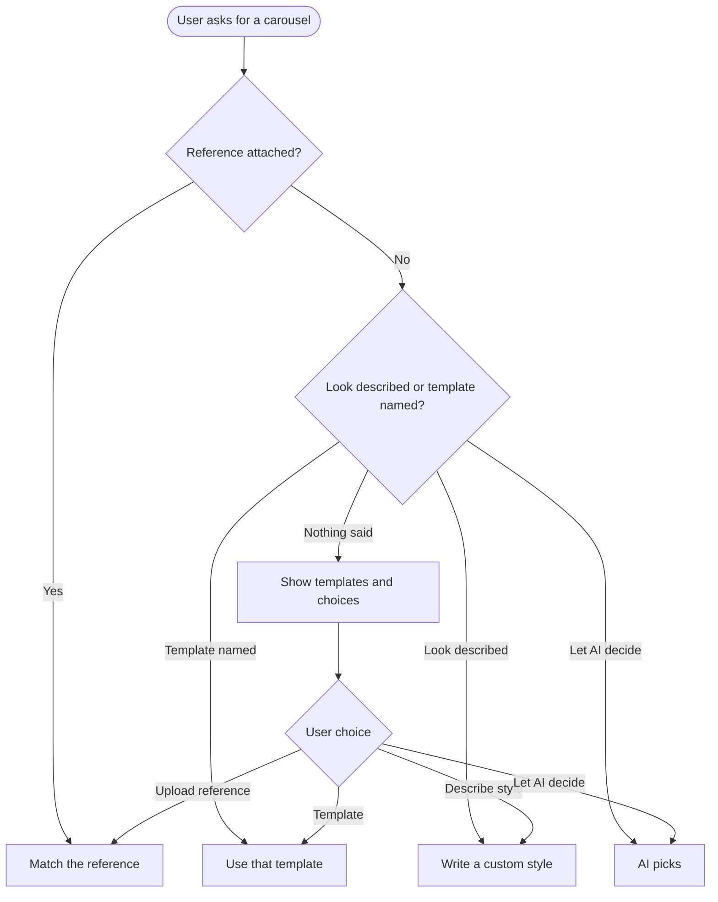

# Epic: AI Carousel 2.0: Carousel Maker and improvements

## Epic description

Users can already ask AI chat for a carousel and get one back. The team's feedback on it was good, and three gaps stood out.

**Waiting is blind.** While a carousel is being made, the chat shows a single "Building the slides" step and nothing else. All slides appear together at the very end, even though the first ones were ready long before. This epic shows the carousel slider from the start, with one skeleton slide for each slide in the plan, and fills each slide in the moment it's ready. The user can swipe through while the rest are still loading.

**Templates are invisible.** ContentStudio has nine carousel templates, plus a custom style the AI writes itself and a mode that copies an uploaded reference. The AI picks among them silently, so users never learn the choice exists. This epic makes the AI ask, when the user hasn't said how the carousel should look: it shows the template covers in a slider and offers four paths. The user can pick a template, upload a reference, let AI decide, or describe a custom style. If the prompt already describes the look, or a reference is attached, the AI goes straight ahead without asking.

**There's no dedicated place to make one.** Once the template picker exists, AI Studio gets a **Carousel Maker** tool next to its image and video tools. It has a prompt box, the template picker, a reference upload and the key options, and it drives the same carousel engine as chat.

### Scope

In:

- Slide-by-slide delivery from the carousel engine, with the slide count known before rendering starts
- Skeleton slides in the chat carousel slider, filled in as slides arrive
- Cover preview images for every library template
- The AI asks for a template choice when the look isn't specified, and skips the question when it is
- A template picker rendered inside the AI chat response
- A Carousel Maker tool in AI Studio

Out:

- New templates or changes to existing template designs
- Editing individual slides by hand (editing stays through the AI, as today)
- The mobile app. Mobile carousel handling is **[Flutter] Generate, review and schedule AI chat carousels in the mobile app** in the existing AI Carousel post generation epic

### Stories

1. `[Design] Design the live carousel preview, the template picker and the Carousel Maker tool`
2. `[BE] Send each carousel slide to the chat as soon as it is ready`
3. `[FE] Show skeleton slides in the AI chat carousel and fill each one in as it arrives`
4. `[BE] Ask for a carousel template before generating, with a cover preview for every template`
5. `[FE] Show the carousel template picker in the AI chat response`
6. `[FE] Add a Carousel Maker tool to AI Studio`

---

# [Design] Design the live carousel preview, the template picker and the Carousel Maker tool

### Description

As a designer, I want to define how a carousel looks while it is being generated, how the template choice is presented inside an AI chat answer, and how the Carousel Maker tool is laid out in AI Studio, so that devs build all three from one agreed reference and they feel like one feature.

---

### Workflow

1. Designer reviews the current carousel slider in AI chat and the AI Studio tool panels (image-to-image, image-to-video) as references.
2. Designer designs the loading carousel: the slider with skeleton slides, how a finished slide replaces its skeleton, and how the counter reads ("Slide 2 of 6", "3 of 6 ready").
3. Designer designs the template picker inside an AI chat answer: a slider of template covers with names and a short "best for" line, a selected state, and the four choices (use this template, upload a reference, let AI decide, describe a custom style).
4. Designer designs the picker after a choice is made, so the chat history shows what was picked.
5. Designer designs the Carousel Maker panel: prompt, template picker, reference upload, options (number of slides, size), the price and confirmation step, and the results area.
6. Designer defines empty, loading and error states for each.

---

### Acceptance criteria

- [ ] The loading carousel is designed with skeleton slides, a partly loaded state and a fully loaded state, with swipe arrows working throughout
- [ ] The template picker is designed inside an AI chat answer, including hover, selected and after-choice states
- [ ] The four template choices are laid out with their final copy
- [ ] The Carousel Maker panel is designed in AI Studio, including the options, confirmation with price, generating and results states
- [ ] Empty, loading and error states are designed for the picker and the Carousel Maker
- [ ] Every element is mapped to an existing `@contentstudio/ui` component, or flagged as a gap
- [ ] Designs are handed off to every `[FE]` story in this epic

---

### Mock-ups:

To be attached by the designer.

---

### Impact on existing data:

None.

---

### Impact on other products:

Web app. AI chat also exists in the mobile app. Designs should note what would carry over if mobile is added later.

---

### Dependencies:

None. Blocks every `[FE]` story in this epic.

---

### Global quality & compliance (wherever applicable)

- [ ] Mobile responsiveness (frontend only, N/A for backend-only stories)
- [ ] Multilingual support (frontend + backend, translations available or fallback handled)
- [ ] UI theming support (default + white-label, design library components are being used)
- [ ] White-label domains impact review
- [ ] Cross-product impact assessment (web, mobile apps, Chrome extension)
- [ ] Developer surfaces coverage: N/A, design only, nothing API-facing changes

---

# [BE] Send each carousel slide to the chat as soon as it is ready

### Description

As a ContentStudio user generating a carousel in AI chat, I want each slide to show up as soon as it's finished, and to know up front how many slides are coming, so that I can start reviewing the carousel straight away instead of waiting for the whole set.

Today the carousel engine makes all the slides and then sends them together at the end, so the chat has nothing to show but a single "Building the slides" step. This story makes the engine announce the number of slides when generation starts, then send each slide the moment it's rendered.

---

### Workflow

1. User confirms a 6-slide carousel in AI chat.
2. As soon as generation starts, the chat is told it will receive 6 slides, in order, so it can show 6 placeholders.
3. The cover slide is ready first and appears in the chat.
4. The other slides follow one by one as each finishes. They may finish out of order, and each one lands in its correct position.
5. When the last slide arrives, the carousel is complete, and the caption and the schedule options appear as today.

---

### Acceptance criteria

- [ ] When carousel generation starts, the chat stream carries the total number of slides before any slide is sent
- [ ] Each slide is sent to the chat as soon as it is rendered and stored, carrying its position in the carousel
- [ ] Slides that finish out of order still carry their correct position, so the chat can place them correctly
- [ ] This works for every carousel style: library templates, the custom style the AI writes, reference-matched carousels, and photo carousels
- [ ] Legibility fixes and the logo contrast plate are applied to each slide before it's sent, so a slide never changes after the user has seen it
- [ ] Progress for the carousel step reports slides done out of total (for example 3 of 6)
- [ ] If one slide fails, the others still arrive, and the failed position is reported as failed so the chat can show it and offer a retry. The user is only charged for what the existing pricing rules say
- [ ] The first slide reaches the chat noticeably earlier than the whole set does today. Before and after timings for a 6-slide and a 10-slide carousel are attached to the pull request
- [ ] The finished carousel (caption, slide order, what gets saved and scheduled) is identical to what's produced today
- [ ] Older chat clients that don't know about the slide count still show the finished carousel correctly

---

### Mock-ups:

None. Backend.

---

### Impact on existing data:

None. Saved carousels are unchanged.

---

### Impact on other products:

- **Carousel Maker in AI Studio** uses the same stream (see **[FE] Add a Carousel Maker tool to AI Studio**).
- **Mobile app:** AI chat exists there. It must keep showing the finished carousel correctly even though slides now arrive one by one.
- **MCP server and public API:** carousel generation through external agents returns the finished set as today.

---

### Dependencies:

None. Blocks **[FE] Show skeleton slides in the AI chat carousel and fill each one in as it arrives**.

---

### Global quality & compliance (wherever applicable)

- [ ] Mobile responsiveness: N/A, backend only
- [ ] Multilingual support (frontend + backend, translations available or fallback handled)
- [ ] UI theming support: N/A, backend only
- [ ] White-label domains impact review
- [ ] Cross-product impact assessment (web, mobile apps, Chrome extension)
- [ ] Developer surfaces coverage (any new or changed API is reflected in the public API, CLI, MCP server and automation apps, N/A when nothing API-facing changes)

---

# [FE] Show skeleton slides in the AI chat carousel and fill each one in as it arrives

### Description

As a ContentStudio user generating a carousel in AI chat, I want to see the carousel take shape slide by slide, with a placeholder for each slide that hasn't finished yet, so that I know how many slides are coming, can look at the ready ones immediately, and don't stare at a single "Building the slides" line.

---

### Workflow

1. User confirms a 6-slide carousel in AI chat.
2. Right away, the carousel slider appears in the answer with 6 skeleton slides and the counter "Slide 1 of 6".
3. The cover finishes first and replaces the first skeleton with a short fade.
4. User clicks the right arrow to look at slide 2, which is still a skeleton with a soft shimmer. They keep swiping through the rest.
5. Slides fill in one by one as they finish, each in its own position, even if they finish out of order.
6. When all 6 are in, the skeletons are gone, and the caption and the usual actions (schedule, edit, download) appear as today.

---

### Acceptance criteria

- [ ] As soon as generation starts, the carousel slider shows one skeleton slide for each slide in the plan
- [ ] Skeleton slides match the carousel's size (square or portrait) so nothing jumps when a real slide replaces one
- [ ] Each finished slide replaces the skeleton in its own position with a short fade, including when slides finish out of order
- [ ] The user can move between slides with the arrows at any time, whether the slides are finished or still skeletons
- [ ] The slide the user is looking at never jumps to another slide when a new slide arrives
- [ ] The counter reads "Slide {current} of {total}". While slides are still loading, a second line reads "{ready} of {total} ready"
- [ ] A slide that failed shows "This slide didn't generate." with a **Retry** button, while the other slides stay usable
- [ ] The caption and carousel actions appear only once every slide is in, as today
- [ ] Reopening a chat whose carousel finished shows the complete carousel with no skeletons
- [ ] Reloading the page mid-generation shows the slides that are already done plus skeletons for the rest
- [ ] Skeletons use the existing loading style (`Loader` / skeleton pattern). No hardcoded colours
- [ ] All copy comes from translation keys in every supported language

---

### Mock-ups:

From **[Design] Design the live carousel preview, the template picker and the Carousel Maker tool**.

---

### Impact on existing data:

None.

---

### Impact on other products:

- **AI Studio Carousel Maker** shows the same live preview.
- **Mobile app (Flutter):** handled by **[Flutter] Generate, review and schedule AI chat carousels in the mobile app**, which copes with slides arriving one at a time.

---

### Dependencies:

- **[BE] Send each carousel slide to the chat as soon as it is ready**
- **[Design] Design the live carousel preview, the template picker and the Carousel Maker tool**

---

### Global quality & compliance (wherever applicable)

- [ ] Mobile responsiveness (frontend only, N/A for backend-only stories)
- [ ] Multilingual support (frontend + backend, translations available or fallback handled)
- [ ] UI theming support (default + white-label, design library components are being used)
- [ ] White-label domains impact review
- [ ] Cross-product impact assessment (web, mobile apps, Chrome extension)
- [ ] Developer surfaces coverage: N/A, nothing API-facing changes

---

# [BE] Ask for a carousel template before generating, with a cover preview for every template

### Description

As a ContentStudio user asking AI chat for a carousel, I want to be shown the available looks and asked which one I want when I haven't said, so that the carousel matches my taste the first time, and I learn that templates and reference uploads exist.

Today the AI silently picks one of nine templates, or writes a custom style, and never tells the user. This story changes how the AI decides:

| What the user gave | What the AI does |
|---|---|
| Nothing about the look ("Make a carousel about our spring sale") | Asks, and shows the template covers plus the other choices |
| A named template ("use Dark Premium") | Uses it, no question |
| A description of the look ("minimal, black and gold, big serif titles") | Goes straight to a custom style, no question |
| A reference image attached | Matches the reference, no question |
| "You decide" / "surprise me" | Picks as today, no question |

It also creates a cover preview image for every library template, since none exist today, and gives the chat a list of the templates to show.

---

### Workflow

1. User types "Make a carousel about our spring sale" with no attachment.
2. The AI replies with a short question and the template picker, instead of starting.
3. User picks "Dark Premium". The AI plans the carousel with that template and continues to the usual confirmation with price.
4. Another time, the user types "Make a minimal black and gold carousel about our spring sale". The AI skips the question and writes a custom style.
5. Another time, the user attaches a screenshot of a carousel they like. The AI skips the question and matches it.

---

### Acceptance criteria

**Deciding whether to ask**

- [ ] When a carousel request says nothing about the look and has no reference attached, the AI asks for a choice before planning, and nothing is charged
- [ ] When the request names a template (by its name, in any capitalisation), that template is used without asking
- [ ] When the request describes the look (colours, mood, typography, "like a magazine"), the custom style is used without asking
- [ ] When an image is attached as a reference, the reference is matched without asking
- [ ] When the user says to let the AI decide, the AI picks as it does today without asking
- [ ] The AI asks at most once per carousel. Follow-up edits to the same carousel never ask again

**Offering the choice**

- [ ] The question is sent to the chat as a structured template picker (not only as text), listing every library template with: id, display name, a one-line "best for" description, its supported sizes, and its cover preview image
- [ ] The picker also carries the three other choices: upload a reference, let AI decide, describe a custom style
- [ ] The user's choice from the picker comes back as a structured answer and goes into planning exactly as if the user had typed it
- [ ] A typed answer ("the second one", "go with retro print") is understood as well

**Cover previews**

- [ ] Every library template has a cover preview image showing its cover layout with sample copy
- [ ] Previews are made once and stored, not per request, so the picker appears instantly
- [ ] Previews are regenerated automatically when a template's design changes
- [ ] Adding a new template needs no change beyond adding the template: it appears in the picker with its preview

**Carousel Maker**

- [ ] The same template list and the same structured choice are usable by **[FE] Add a Carousel Maker tool to AI Studio**, so both entry points offer the same templates

---

### Mock-ups:

None. Backend.

---

### Impact on existing data:

Stores one cover preview image per template. No user data changes.

---

### Impact on other products:

- **MCP server and public API:** external agents asking for a carousel currently get the AI's silent pick. They should keep working without being blocked by a question they can't answer, so the question is only asked in interactive chat, unless the PO wants the template list exposed there too.
- **Mobile app:** AI chat exists there. It must fall back to showing the question as plain text if it can't render the picker.

---

### Dependencies:

None. Blocks **[FE] Show the carousel template picker in the AI chat response** and **[FE] Add a Carousel Maker tool to AI Studio**.

---

### Global quality & compliance (wherever applicable)

- [ ] Mobile responsiveness: N/A, backend only
- [ ] Multilingual support (frontend + backend, translations available or fallback handled)
- [ ] UI theming support: N/A, backend only
- [ ] White-label domains impact review
- [ ] Cross-product impact assessment (web, mobile apps, Chrome extension)
- [ ] Developer surfaces coverage (any new or changed API is reflected in the public API, CLI, MCP server and automation apps, N/A when nothing API-facing changes)

---

# [FE] Show the carousel template picker in the AI chat response

### Description

As a ContentStudio user asking AI chat for a carousel, I want to swipe through the template covers right inside the AI's answer and pick one, or choose to upload a reference, let AI decide, or describe my own style, so that choosing a look is one click instead of guessing template names.

---

### Workflow

1. User types "Make a carousel about our spring sale".
2. The AI answers: **"How should your carousel look?"** with the text *"Pick a template below, upload a carousel you like as a reference, or let me choose."*
3. Under it, a slider shows the template covers one at a time, each with its name and a short line like "Best for bold announcements".
4. User swipes to "Dark Premium" and clicks **Use this template**.
5. The picker collapses to a short line, "Template: Dark Premium", and the AI continues to plan the carousel.
6. Alternatively, the user clicks **Upload a reference**, picks an image, and the AI continues by matching it.
7. Or the user clicks **Let AI decide** and the AI picks.
8. Or the user clicks **Describe a style**. The chat box is filled with "Make it look " and focused, so they can type something like "minimal, black and gold".

---

### Acceptance criteria

**Picker**

- [ ] When the AI asks for a carousel template, the answer shows the question text followed by the template picker
- [ ] The picker shows one template cover at a time in a slider with next and previous arrows (`ActionIcon`), reusing the carousel slider pattern already used for results
- [ ] Each cover shows the template name and its one-line "best for" text, plus a counter ("3 of 9")
- [ ] Covers are the plain template previews, the same for everyone. Under the slider a note reads: "These are layout previews. Your carousel will use your brand's colours and logo." When Brand is off, the note reads: "These are layout previews. Turn on Brand to use your colours and logo."
- [ ] Under the slider sit four actions (`Button` from `@contentstudio/ui`): **Use this template** (primary), **Upload a reference**, **Let AI decide**, **Describe a style**
- [ ] Covers load with a skeleton placeholder. If a cover image fails to load, the template name is still shown and the template can still be chosen

**Choices**

- [ ] **Use this template** sends the chosen template back to the AI, and planning continues with it
- [ ] **Upload a reference** opens the existing attachment picker. Once an image is attached, it is sent as the reference and planning continues
- [ ] **Let AI decide** sends that choice and planning continues
- [ ] **Describe a style** fills the chat box with "Make it look " and places the cursor at the end, without sending
- [ ] After a choice, the picker collapses to a one-line summary ("Template: Dark Premium", "Reference: uploaded image", "Style: chosen by AI" or "Style: your description") and can't be used again
- [ ] If the user ignores the picker and types an answer ("go with retro print"), the picker collapses the same way once the AI has understood the choice

**Copy**

- [ ] Question title: "How should your carousel look?"
- [ ] Question text: "Pick a template below, upload a carousel you like as a reference, or let me choose."
- [ ] Button tooltips: Upload a reference: "Attach an image of a carousel or post you like. The AI will match its colours, fonts and layout." Let AI decide: "The AI picks the template that best fits your topic." Describe a style: "Tell the AI the look you want, for example "minimal, black and gold, big serif titles"."
- [ ] All copy comes from translation keys in every supported language

**Tracking**

- [ ] Picking any of the four choices fires a `ai_carousel_template_chosen` Usermaven event with `{ choice, template_id }` (`choice` is `template`, `reference`, `ai_decides` or `custom`, and `template_id` is set only for `template`)

---

### Mock-ups:

From **[Design] Design the live carousel preview, the template picker and the Carousel Maker tool**.

---

### Impact on existing data:

None.

---

### Impact on other products:

- **Mobile app (Flutter):** not in scope. The question falls back to text there.

---

### Dependencies:

- **[BE] Ask for a carousel template before generating, with a cover preview for every template**
- **[Design] Design the live carousel preview, the template picker and the Carousel Maker tool**

---

### Global quality & compliance (wherever applicable)

- [ ] Mobile responsiveness (frontend only, N/A for backend-only stories)
- [ ] Multilingual support (frontend + backend, translations available or fallback handled)
- [ ] UI theming support (default + white-label, design library components are being used)
- [ ] White-label domains impact review
- [ ] Cross-product impact assessment (web, mobile apps, Chrome extension)
- [ ] Developer surfaces coverage: N/A, nothing API-facing changes

---

# [FE] Add a Carousel Maker tool to AI Studio

### Description

As a ContentStudio user who wants a carousel without chatting, I want a Carousel Maker tool in AI Studio where I type my topic, pick a template or upload a reference, set the number of slides and size, and generate, so that I can make carousels as directly as I make images and videos in AI Studio.

The tool uses the same carousel engine as AI chat, so the results, pricing and quality are the same. It's a form-first front door to it.

---

### Workflow

1. User opens AI Studio and sees **Carousel Maker** in the tools sidebar, with a "New" badge.
2. User clicks it. The panel shows:
   - **What's your carousel about?** (prompt)
   - **Look** (the template picker slider, with the Upload a reference, Let AI decide and Describe a style choices)
   - **Number of slides**
   - **Size** (Square or Portrait)
3. User types "5 tips for better LinkedIn headlines", picks "Clean Minimal", sets 6 slides and Portrait.
4. User clicks **Create carousel**. The panel shows the price and asks to confirm, as chat does.
5. User confirms. The results area shows the carousel slider with 6 skeleton slides that fill in as they're ready.
6. When it's done, the carousel is in the tool's results and in the Content Library. The user can schedule it, download it, or click **Continue in chat** to ask the AI for edits.

---

### Acceptance criteria

**Entry**

- [ ] **Carousel Maker** appears in the AI Studio tools sidebar in the images category, with a "New" badge for the usual new-feature window
- [ ] Opening it shows the Carousel Maker panel at its own address, so it can be linked to and bookmarked

**Form**

- [ ] Prompt field: label "What's your carousel about?", placeholder "For example: 5 tips for better LinkedIn headlines", required. Error if empty: "Tell us what the carousel is about."
- [ ] Look: the same template picker as AI chat, including its note that previews are layouts and the carousel will use the brand's colours and logo, with Use this template, Upload a reference, Let AI decide (default) and Describe a style. Describe a style shows a text field labelled "Describe the look" with placeholder "For example: minimal, black and gold, big serif titles"
- [ ] Reference upload accepts up to 2 images, matching what chat supports. Error beyond that: "You can add up to 2 reference images."
- [ ] Number of slides: a choice from the range the carousel engine supports, default 6, with helper text "Most carousels work best with 5 to 8 slides."
- [ ] Size: `SegmentedControl` with Square and Portrait, default Portrait, tooltip "Portrait (4:5) takes up more of the feed on Instagram and LinkedIn. Square (1:1) works everywhere."
- [ ] **Create carousel** (`Button`, primary) is disabled until the prompt is filled

**Generating**

- [ ] Clicking Create carousel shows the same price and confirmation as chat before anything is charged
- [ ] After confirming, the results area shows the live carousel with skeleton slides filling in, the same as in chat
- [ ] Errors show "We couldn't create your carousel. Please try again." with a **Try again** button, and the form keeps what the user entered

**Results**

- [ ] Finished carousels appear in the tool's results feed, newest first, like other AI Studio tools
- [ ] Every finished carousel is also saved to the Content Library, with its slides in order and its caption
- [ ] Each result offers the same actions as in chat (schedule, download, save), plus **Continue in chat**, which opens AI chat with this carousel so the user can ask for edits
- [ ] Empty state before the first carousel: headline "Make your first carousel", text "Describe a topic, pick a look, and AI designs a swipeable carousel ready to schedule."

**Tracking**

- [ ] Generating fires a `ai_carousel_generated` Usermaven event with `{ source: 'ai_studio', choice, slide_count }`. The same event with `source: 'chat'` should fire from chat so the two can be compared

**Copy**

- [ ] All copy comes from translation keys in every supported language

---

### Mock-ups:

From **[Design] Design the live carousel preview, the template picker and the Carousel Maker tool**.

---

### Impact on existing data:

Finished carousels are saved to the tool's results and to the Content Library. No other data changes.

---

### Impact on other products:

- **AI chat:** "Continue in chat" hands the carousel over to chat.
- **Content Library:** shows Carousel Maker carousels as one item with their slides in order.
- **Mobile app:** AI Studio is web-only. No mobile impact.

---

### Dependencies:

- **[BE] Ask for a carousel template before generating, with a cover preview for every template**
- **[BE] Send each carousel slide to the chat as soon as it is ready**
- **[FE] Show the carousel template picker in the AI chat response** (shares the picker)
- **[Design] Design the live carousel preview, the template picker and the Carousel Maker tool**

---

### Global quality & compliance (wherever applicable)

- [ ] Mobile responsiveness (frontend only, N/A for backend-only stories)
- [ ] Multilingual support (frontend + backend, translations available or fallback handled)
- [ ] UI theming support (default + white-label, design library components are being used)
- [ ] White-label domains impact review
- [ ] Cross-product impact assessment (web, mobile apps, Chrome extension)
- [ ] Developer surfaces coverage: N/A, reuses the existing carousel engine, nothing new API-facing
