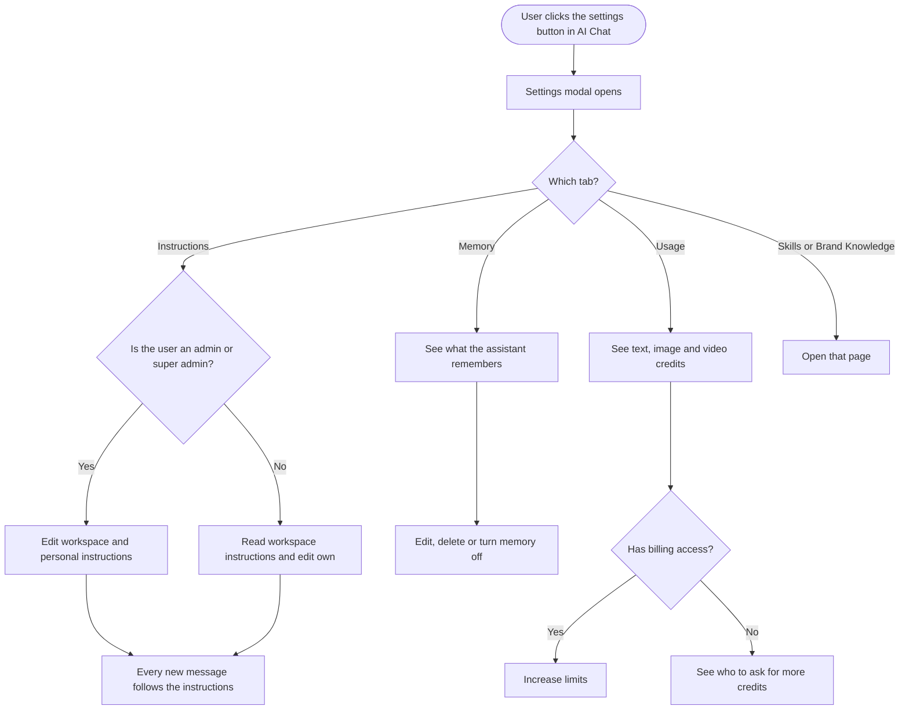
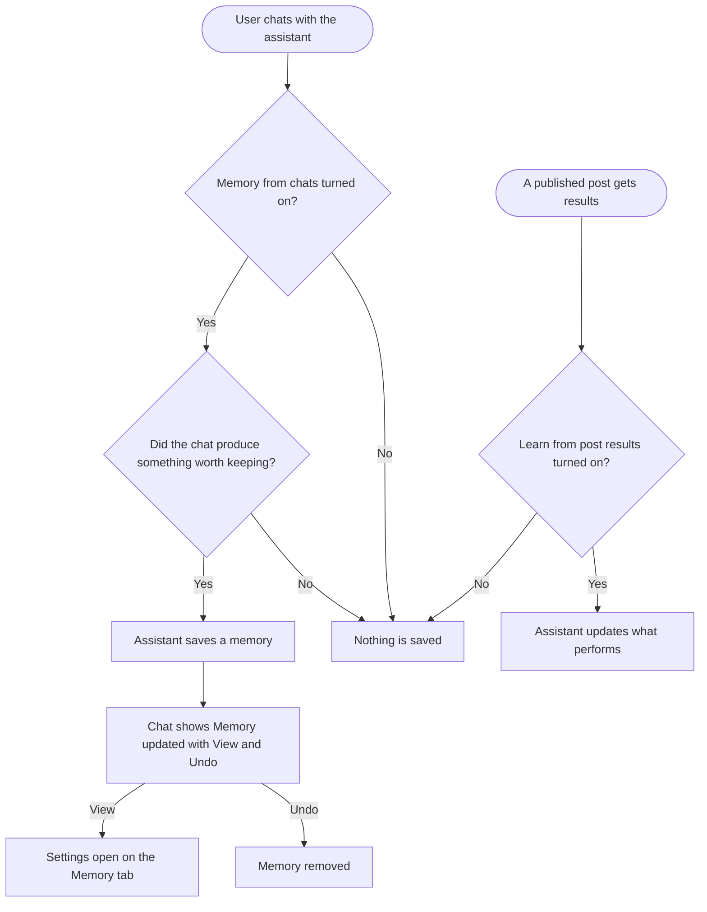

# 02 Workflow: AI Chat settings (Instructions, Memory, Usage)

**Date:** 2026-09-30
**Prototype:** https://claude.ai/artifact/Y81bvg35xMWjsWJVaj2MD2

**Decisions already made by the PO (2026-09-30):**
- The settings live in a modal opened from the AI Chat itself, the way ChatGPT and Claude do it, not on a separate settings page.
- Tabs: Instructions, Memory, Usage. Skills and Brand Knowledge appear as links in the same modal.
- The credits chip in the chat header is removed. Credit balances move to the Usage tab.
- Usage v1 shows the meters and reset date. The "Where credits went" breakdown comes later, once a per-activity usage record exists.
- Everyone in the workspace sees Usage. Only super admins and admins with billing access see the option to increase limits.
- Memory does not learn from the inbox in v1.
- Same feature on web and in the Flutter app.
- A Research ticket covers the technical approach for memory and instructions. Every other ticket is requirements and workflow only.
- The assistant keeps its current neutral naming. The rebrand is a separate track.

---

## 1. Feature placement

**Web, AI Studio → AI Chat (full page):**
- A **settings button** (gear icon) sits in the chat header, between Chat history and New Chat.
- The credits chip that sits there today is removed.

**Web, docked AI Chat** (the chat modal opened from other parts of the app):
- Same gear button in the same position.
- The credits chip is removed here too.

**Flutter app, AI assistant:**
- A settings icon in the assistant header.
- The credits pill is removed, and its information moves to the Usage tab.

**The modal itself:**
- **Left side:**
  - Under "Settings": Instructions, Memory, Usage.
  - Under "Customize": Skills and Brand Knowledge. Both are links with an arrow icon, and they open their existing pages.
- **Right side:** the selected tab.
- Opens on **Instructions** the first time, and on the last tab used after that.

**Who can open it:** everyone who can use AI Chat. Approvers can't open AI Studio today, and that doesn't change.

---

## 2. Workflow diagram (overview)

How memory gets written during normal use:

---

## 3. User flow (happy path)

### 3.1 Open settings
1. The user is in AI Chat and clicks the **settings** button in the header.
2. The **AI Chat settings** modal opens on the Instructions tab.
3. The user can switch tabs on the left, or close the modal with the X, a click outside it, or Esc.

### 3.2 Workspace instructions (admins and super admins)
1. On the Instructions tab, the admin sees **Workspace instructions**, a text box that applies to everyone in this workspace.
2. They type rules. For example: "Never use more than 3 hashtags. No emojis on LinkedIn. Save posts as drafts, never schedule without asking."
3. A counter shows characters used against the limit.
4. They click **Save**. A toast confirms: "Instructions saved. They apply to new messages from now on."
5. Below the box, "Last edited by [name] on [date]" updates.

### 3.3 Workspace instructions (collaborators)
1. A collaborator sees the same Workspace instructions, read-only.
2. A note says: "Set by your workspace admins."
3. If the box is empty, they see: "Your admins haven't added workspace instructions yet."

### 3.4 Personal instructions (everyone)
1. Below the workspace box, each user has **Your instructions**, which only affect their own chats.
2. Example: "I look after Instagram and TikTok, so start with those. Keep inbox replies under 40 words."
3. They click **Save** and see the same toast.

### 3.5 Instructions in use
1. The user starts or continues a chat. Every new message follows the workspace instructions, then the user's own.
2. If a personal instruction conflicts with a workspace one, the workspace instruction wins.
3. If an instruction conflicts with Brand Knowledge, the instruction wins. Brand Knowledge describes who you are, and instructions describe how the assistant should work.
4. An active skill decides what task to do. Instructions still apply while a skill runs.

### 3.6 Memory is saved during a chat
1. The user and the assistant agree on something worth keeping. For example: "We're stopping X from next week", or an approved October plan.
2. The assistant saves it and shows a small line under its reply: **"Memory updated"**, with **View** and **Undo**.
3. **Undo** removes that memory straight away. **View** opens settings on the Memory tab with the new memory highlighted.

### 3.7 Review memory
1. On the Memory tab, the user sees two switches and the list of memories.
2. Memories are grouped under **Workspace** (shared with the team) and **You** (only this user's preferences).
3. Workspace memories are sorted into categories: Plans, Decisions, What performs, Publishing habits.
4. Each row shows the memory, its source (From chat or From post results) and the date.

### 3.8 Edit or delete a memory
1. The user hovers a row and clicks **Edit** or **Delete**.
2. **Edit** turns the row into a text box with **Save** and **Cancel**. A memory someone edits by hand is never rewritten automatically.
3. **Delete** removes the row, and a toast offers **Undo** for a few seconds.
4. Admins and super admins can edit or delete any workspace memory. Collaborators can edit or delete memories that came from their own chats, and anything under You.

### 3.9 Tell the assistant what to change or forget
1. At the bottom of the Memory tab there's a box: "Tell the assistant what to change or forget".
2. The user types, for example: "Forget the Halloween plan, we cancelled it."
3. The assistant updates or removes the matching memories and confirms what it changed, in the list and in a toast.

### 3.10 Memory switches
1. **Remember from chats:** saves plans, decisions and preferences from chats.
2. **Learn from post results:** after posts go live, notes what performed well and what didn't.
3. Both switches are workspace-wide, and only admins and super admins can change them. Collaborators see their state.
4. Turning a switch off stops new memories from that source. Existing memories stay until someone deletes them, and the copy says so.
5. **Delete all memories** sits at the bottom, for admins and super admins, behind a confirmation.

### 3.11 Memory from post results
1. With "Learn from post results" on, the assistant looks at how published posts performed.
2. It keeps a short, up-to-date set of "What performs" memories. For example: "Reels get about 3x the reach of carousels on Instagram."
3. These refresh as new results come in and show "From post results" with the date of the last update.

### 3.12 Usage
1. On the Usage tab, the user sees three meters: **AI text credits**, **AI image credits** and **AI video credits**. Each one shows used against the limit, for example "41,200 / 100,000 words".
2. The reset date appears at the top: "Credits reset on Oct 1."
3. As a meter nears its limit, it shows a warning. When it's used up, it shows a clear notice.
4. Super admins and admins with billing access see **Increase limits**, which opens the existing Increase Limits dialog.
5. Everyone else sees: "Need more credits? Ask your workspace owner or an admin with billing access."

### 3.13 Skills and Brand Knowledge links
1. Clicking **Skills** or **Brand Knowledge** on the left closes the modal and opens that page (AI Studio → Skills, or Settings → Brand Knowledge).
2. In the Flutter app, these open the page in the web app.

### 3.14 Flutter app
1. The user taps the settings icon in the assistant header.
2. A full-screen settings page opens with the same three tabs.
3. Instructions, memory and usage are the same data as on the web, so there's nothing to set up twice.
4. Admin-only actions are hidden or read-only the same way they are on the web.

---

## 4. Alternative flows

| Case | What the user sees |
|---|---|
| Save fails | Inline error "We couldn't save your instructions. Check your connection and try again." Text stays in the box. |
| Instructions over the limit | Counter turns red, Save disabled, helper "Instructions can be up to 3,000 characters. Try shortening or combining rules." (1,500 for personal) |
| Unsaved changes when closing | Confirm "Discard changes?" with Discard and Keep editing |
| No memories yet | Empty state: headline "Nothing remembered yet", subtext explaining that memories appear as you plan, decide and publish with the assistant, plus an example |
| Memory switches both off | Banner on the Memory tab: "Memory is off. The assistant won't save anything new. Existing memories are still used until you delete them." |
| Memory list fails to load | "We couldn't load memories. Try again." with a Try again button |
| Memory limit reached | The assistant merges similar memories. If it still can't fit, the tab shows "Memory is full. Delete memories you no longer need so new ones can be saved." Entries edited by hand are never merged away. |
| Collaborator tries to delete a teammate's memory | Delete is not shown on that row. The tooltip says "Only admins can remove memories from other people's chats." |
| Credits used up | Meter shows "0 left" with the red state, plus the Increase limits button or the ask-your-admin line |
| Usage fails to load | "We couldn't load your credits. Try again." |
| White-label domain | Everything works the same with the agency's theme colours. No ContentStudio branding appears in the modal. |
| User switches workspace | The modal shows that workspace's instructions, memory and credits. Nothing carries across workspaces. |
| Member removed from workspace | Their personal instructions and You memories are deleted. Workspace memories from their chats stay, because they belong to the team. |
| Workspace deleted | All instructions and memories for it are deleted |

---

## 5. Key design decisions

### D1. Who memory belongs to
- **A. Shared by the workspace, plus a personal You section (recommended).** Team knowledge like plans, decisions and what performs belongs to the workspace, where everyone benefits. Personal preferences stay personal. This fits how ContentStudio already works (timezone and brand are set per workspace) and keeps agency clients apart.
- B. Personal only, like ChatGPT. Simpler, but a team member's plan is invisible to the colleague who continues it.
- C. Workspace only. Personal preferences leak onto the whole team.

### D2. How memories get saved
- **A. Automatic, with a visible "Memory updated" line and Undo (recommended).** This is the pattern ChatGPT and Claude users already know. Visible saving builds trust, and nothing is saved silently.
- B. The assistant asks before every save. Safer, but it interrupts the chat and people stop answering.
- C. Manual only, with a "Remember this" button. Low value, because few people use it.

### D3. Who can change workspace memory and switches
- **A. Admins and super admins manage everything. Collaborators manage what came from their own chats and their You section (recommended).** This matches existing permissions and keeps one person from wiping the team's context.
- B. Everyone can edit everything. Faster, but one mistaken "delete all" hurts the team.

### D4. Where instructions and memory apply in v1
- **A. AI Chat only, on web and in the app (recommended).** This is where the settings live, so the effect is easy to understand and test.
- B. Every AI feature, including Composer AI, AI Library and inbox auto-replies. More consistent, but a much bigger surface to test, and those features already have their own settings. This could come later.

### D5. Precedence between instructions and Brand Knowledge
- **A. Workspace instructions, then personal instructions. Instructions win a conflict with Brand Knowledge (recommended).** Instructions are rules a person wrote on purpose. Brand Knowledge is generated from sources and rebuilt on sync.
- B. Brand Knowledge wins. That would mean a rule like "no emojis" could be overridden by a regenerated voice profile.

---

## 6. Integration with existing features

- **AI Chat (web and app):** the settings button, the "Memory updated" line under replies, and instructions applied to every message.
- **Brand Knowledge:** stays the source of voice and brand facts. It is linked from the modal, and a helper line on the Instructions tab explains the difference.
- **Skills:** stay on their own page and are linked from the modal. A skill decides the task, and instructions still apply while it runs.
- **Billing:** the Usage tab uses the same credit balances the chip showed. Increase limits opens the existing Increase Limits dialog.
- **Publishing and Analytics:** published post results feed "What performs" memories when that switch is on.
- **Brand toggle in the chat composer:** unchanged.
- **Chrome extension:** check whether it shows the AI chat. If it does, it should get the same settings button.

---

## 7. Trackable actions (Usermaven candidates)

| Action | Candidate event | Trigger |
|---|---|---|
| Instructions saved | `ai_chat_instructions_saved` | User clicks Save on either instructions box and it succeeds. `{ scope: 'workspace' \| 'personal', is_first_save }` |
| Memory switch changed | `ai_chat_memory_setting_changed` | Admin turns a switch on or off. `{ setting: 'chats' \| 'post_results', enabled }` |
| Memory deleted | `ai_chat_memory_deleted` | Delete one, Undo on "Memory updated", or Delete all. `{ method: 'single' \| 'undo' \| 'all', category }` |
| Memory edited | `ai_chat_memory_edited` | User saves an edit to a memory. `{ category }` |
| Memory changed by asking | `ai_chat_memory_instructed` | User sends a request in "Tell the assistant what to change or forget". `{ changes_count }` |
| Increase limits clicked from Usage | Reuse `addons_limits_updated` (fires when the purchase completes), plus `ai_usage_increase_limits_clicked` `{ credit_type }` | Clicking Increase limits on the Usage tab |

Not tracked: opening the modal and switching tabs, which are view-only.

---

## 8. Scope recommendation

**v1:**
- Settings button and modal on web (both chat headers) and in the Flutter app. The credits chip and pill are removed.
- Instructions: workspace (admins edit) and personal. Applied to AI Chat.
- Memory:
  - saved automatically from chats, with the "Memory updated" line, View and Undo
  - Workspace and You sections, sorted into categories
  - edit, delete, and Delete all
  - both switches, including "Learn from post results"
  - the "Tell the assistant what to change or forget" box
  - memory deleted when a member is removed or a workspace is deleted
- Usage: three meters, the reset date, low and empty states, Increase limits for billing users, and the ask-your-admin line for everyone else.
- Links to Skills and Brand Knowledge.
- A Research ticket for the technical approach to memory and instructions.
- A Design ticket for the modal on web and in the app.

**v2:**
- The "Where credits went" breakdown, once a per-activity usage record exists (see the Usage visibility work).
- Memory from inbox patterns, off by default and turned on by an admin.
- Chatting without memory for a single conversation.
- Instructions and memory in other AI features: Composer AI, AI Library, inbox auto-replies.
- Instructions and memory on the public API, CLI and MCP server.
- A "Why this answer" view showing which instructions and memories were used.
