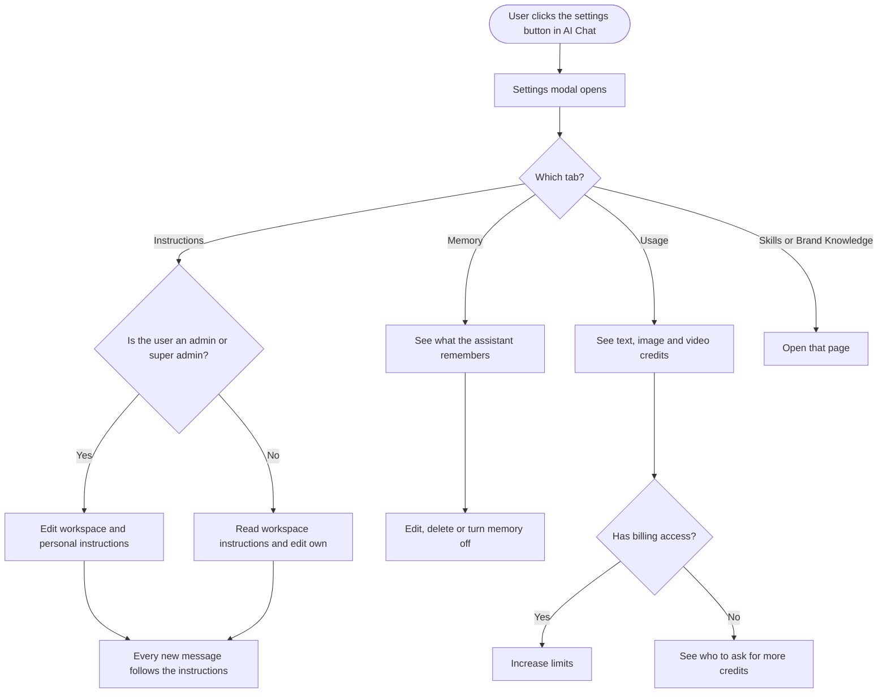

# **PRD: AI Chat settings (Instructions, Memory, Usage)**

**Author:** Ghulam Jaffar (Product Owner)
**Last Updated:** 2026-09-30
**Status:** Approved
**Target Release:** Q4 2026

---

## **1\. Overview**

AI Chat can already plan, write, generate, publish, read analytics and work the inbox. But it forgets everything when a chat ends, and there's nowhere to tell it how your team works. This feature adds a **settings modal inside AI Chat**, opened from a gear button in the chat header, on the web and in the Flutter app. It has three tabs:
- **Instructions:** rules the assistant follows in every chat. Admins set rules for the whole workspace, and each person can add their own.
- **Memory:** what the assistant remembers about the workspace, learned from chats and from post results. Users can see, edit and delete it.
- **Usage:** AI text, image and video credits, replacing today's credits chip.

Skills and Brand Knowledge are linked from the same modal, so every setting that shapes the assistant is in one place. This makes the assistant behave like a teammate who knows the workspace, rather than a chat that starts from zero each time.

**Prototype:** https://claude.ai/artifact/Y81bvg35xMWjsWJVaj2MD2

---

## **2\. Problem Statement**

**What problem are we solving?**

- **The assistant has no memory.** Every chat starts from zero. It re-fetches the calendar, analytics and inbox, and it doesn't know that the team approved an October plan yesterday, stopped posting to X, or that Reels outperform carousels for this brand. Users repeat context in every chat, and the answers are more generic than they should be.
- **There's no place for standing rules.** Brand Knowledge describes who the brand is, and it is regenerated whenever a source syncs, so rules a person types there can be overwritten. Teams have no always-on place for rules like "never schedule without asking", "no emojis on LinkedIn" or "max 3 hashtags". The only instructions field that exists today is per rule, inside inbox auto-replies.
- **Credits are hidden in a hover.** The credits chip in the chat header shows balances only in a tooltip, with no reset date, no low-balance warning and no route to more credits.

**Who has this problem?**

Every workspace that uses AI Chat on the web or in the Flutter app. It hurts most for:
- teams where several people plan and publish in the same workspace
- agencies managing many client workspaces, where each client has different rules

**What happens if we don't solve it?**

- The assistant stays a smart chat rather than a teammate, which undercuts the upcoming assistant launch, and that launch depends on this.
- Users compare us to ChatGPT and Claude, which both offer instructions and memory.
- No social media competitor offers visible memory yet, so this is a window to be first.
- Credit exhaustion keeps surprising users mid-task, which produces support tickets and lost upgrade moments.

---

## **3\. Goals & Success Metrics**

| Goal | Metric | Target | How We'll Measure |
| ----- | ----- | ----- | ----- |
| Primary: teams set up the assistant for how they work | Share of active AI Chat workspaces with saved workspace or personal instructions | 25% within 60 days of release | `ai_chat_instructions_saved` in Usermaven |
| Primary: memory is kept and trusted | Share of active AI Chat workspaces with at least 3 memories after 30 days, and memories deleted within a day of being saved | 40% of workspaces have 3+ memories. Under 15% of memories are removed via Undo or delete within 24 hours | Memory counts, plus `ai_chat_memory_deleted` with `method` |
| Secondary: credit visibility drives upgrades | Increase limits clicks from the Usage tab, and completed limit purchases from that path | Baseline in the first 30 days, then +20% over the chip's tooltip era | `ai_usage_increase_limits_clicked`, `addons_limits_updated` |
| Guard rail: no drop in chat quality | Thumbs-down rate on AI Chat replies | No increase above today's rate | Existing chat feedback |
| Guard rail: no cross-workspace leakage | Reports of one workspace's memory showing in another | Zero | Support tickets, QA |

### **3.1 Analytics Events (Usermaven)**

| Event Name | Trigger | Payload | What we measure with it |
| ----- | ----- | ----- | ----- |
| `ai_chat_instructions_saved` | FE: user clicks Save on the workspace or personal instructions and the save succeeds | `{ scope: 'workspace' \| 'personal', is_first_save: boolean, platform: 'web' \| 'app' }` | Instruction adoption, workspace vs personal split |
| `ai_chat_memory_setting_changed` | FE: an admin turns a memory switch on or off | `{ setting: 'chats' \| 'post_results', enabled: boolean }` | How many workspaces turn memory off, and which source |
| `ai_chat_memory_deleted` | FE: user deletes one memory, clicks Undo on "Memory updated", or confirms Delete all | `{ method: 'single' \| 'undo' \| 'all', category: 'plans' \| 'decisions' \| 'what_performs' \| 'publishing_habits' \| 'you' \| 'all' }` | Memory quality: an Undo right after saving means a bad memory |
| `ai_chat_memory_edited` | FE: user saves an edit to a memory | `{ category }` | How often memories need correcting |
| `ai_chat_memory_instructed` | FE: user sends a request in "Tell the assistant what to change or forget" and it completes | `{ changes_count: number }` | Use of the conversational memory control |
| `ai_usage_increase_limits_clicked` | FE: user clicks Increase limits on the Usage tab | `{ credit_type: 'text' \| 'image' \| 'video' \| 'general' }` | Upgrade intent from the Usage tab |
| `addons_limits_updated` (existing, reused) | FE: user completes the Increase Limits purchase | Existing payload | Completed purchases after coming from the Usage tab |

---

## **4\. Target Users**

**Primary Persona:**
**Social media manager in a team workspace.** Plans and publishes daily with AI Chat. Wants the assistant to remember the plan and the team's rules without repeating them. Not technical, and used to ChatGPT.

**Secondary Persona:**
**Agency admin or workspace owner.** Manages several client workspaces, each with its own rules. Sets workspace instructions once per client and keeps an eye on credit use. Owns billing and decides when to increase limits.

**Non-Users (explicitly out of scope):**
- Approvers. They can't open AI Studio today, and this doesn't change that.
- Developers using the public API, CLI or MCP server. Those surfaces come in a later version.
- Users of non-chat AI features (Composer AI, AI Library, inbox auto-replies). Instructions and memory don't reach those features in v1.

---

## **5\. User Stories / Jobs to Be Done**

| ID | As a... | I want to... | So that... | Priority |
| ----- | ----- | ----- | ----- | ----- |
| US-1 | Any AI Chat user | open AI Chat settings from the chat header | everything that shapes the assistant is in one place | Must Have |
| US-2 | Workspace admin | write rules the assistant follows for everyone in this workspace | the whole team gets consistent output without repeating rules | Must Have |
| US-3 | Collaborator | read the workspace rules and add my own | I know what the assistant follows and can tailor it to my work | Must Have |
| US-4 | Any AI Chat user | have the assistant remember plans, decisions and what performs | I don't have to repeat context in every chat | Must Have |
| US-5 | Any AI Chat user | see when something was remembered and undo it straight away | nothing is saved without me knowing | Must Have |
| US-6 | Any AI Chat user | see, edit and delete what the assistant remembers | I can fix wrong or outdated memories | Must Have |
| US-7 | Workspace admin | turn memory from chats or from post results on or off, and delete all memories | I control what the assistant keeps for my team or client | Must Have |
| US-8 | Any AI Chat user | tell the assistant in plain words what to change or forget | I can fix memory without hunting through a list | Should Have |
| US-9 | Any AI Chat user | see my text, image and video credits and when they reset | I'm never surprised by running out mid-task | Must Have |
| US-10 | Admin with billing access | increase limits from the Usage tab | I can top up the moment credits run low | Must Have |
| US-11 | Mobile user | get the same settings in the app | my instructions and memory work wherever I chat | Must Have |
| US-12 | Workspace admin | see where credits went by activity | I know what uses up our allowance | Nice to Have (v2) |

---

## **6\. Requirements**

### **6.1 Must Have (P0)**

- **Settings button and modal:**
  - A gear button in both web chat headers (AI Studio → AI Chat, and the docked AI Chat), placed between Chat history and New Chat.
  - It opens the AI Chat settings modal. The left side lists Instructions, Memory and Usage, plus Skills and Brand Knowledge as links out.
  - The modal opens on Instructions the first time, then on the last tab used.
- **Credits chip removed** from both web chat headers. **Credits pill removed** from the Flutter assistant header.
- **Workspace instructions:**
  - One text box per workspace, up to 3,000 characters.
  - Editable by super admins and admins. Read-only for collaborators, with "Set by your workspace admins".
  - Shows who last edited it and when.
- **Personal instructions:** one text box per user per workspace, up to 1,500 characters, editable by that user only.
- **Instructions applied** to every new AI Chat message on web and in the app.
  - Precedence: workspace instructions, then personal instructions. Instructions win a conflict with Brand Knowledge.
  - While a skill runs, the skill decides the task and instructions still apply.
  - Changes apply to the next message, including in an open chat.
- **Memory from chats:**
  - The assistant saves memories on its own when a chat produces a plan, a decision or a stated preference.
  - Each save shows "Memory updated" under the reply, with View and Undo.
- **Memory list:**
  - Grouped into Workspace and You. Workspace memories are sorted into Plans, Decisions, What performs and Publishing habits.
  - Each row shows the memory text, source (From chat or From post results) and date.
- **Memory management:**
  - Edit and Delete on each row, with Undo after deleting.
  - Super admins and admins can manage any workspace memory. Collaborators can manage memories from their own chats and everything under You.
  - Memories edited by hand are never rewritten automatically.
- **Memory switches:**
  - "Remember from chats" and "Learn from post results". Workspace-wide, changed by super admins and admins only.
  - Turning a switch off stops new memories from that source and keeps existing ones, and the copy says so.
- **Delete all memories:** super admins and admins only, behind a confirmation.
- **Memory from post results:** when switched on, the assistant keeps "What performs" memories up to date from the results of published posts.
- **Memory is scoped to one workspace.** It never appears in another workspace, including other client workspaces under the same agency account.
- **Memory is never written from inbox messages or comments in v1.**
- **Memory deletion:**
  - When a member is removed from a workspace, their You memories and personal instructions for that workspace are deleted.
  - When a workspace is deleted, all its instructions and memories are deleted.
- **Usage tab:**
  - Meters for AI text credits (words), AI image credits and AI video credits: used against the limit, the reset date, and a warning state as a meter nears its limit.
  - Everyone who can open AI Chat sees it.
- **Increase limits:**
  - Shown to super admins and admins with billing access. Opens the existing Increase Limits dialog.
  - Everyone else sees "Need more credits? Ask your workspace owner or an admin with billing access."
- **Flutter app:** the same settings, tabs, data and permissions, as a full-screen settings page. The Skills and Brand Knowledge links open the web app.
- **Analytics events** as listed in section 3.1.

### **6.2 Should Have (P1)**

- "Tell the assistant what to change or forget": a box on the Memory tab that updates or removes matching memories from a plain-language request, then confirms what changed.
- Memory limit handling: the assistant merges similar memories as the limit nears. If it can't, it shows "Memory is full" with guidance. Entries edited by hand are never merged away.
- A "Discard changes?" confirmation when closing the modal with unsaved instructions.
- The Chrome extension gets the same settings button, if it shows AI Chat.

### **6.3 Nice to Have (P2)**

- A "Where credits went" breakdown on the Usage tab. This needs the per-activity usage record from the Usage visibility work.
- A "Why this answer" view showing which instructions and memories a reply used.
- Chatting without memory for a single conversation.

### **6.4 Explicitly Out of Scope**

- The assistant rebrand (name, personality, logo, white-label renaming). That is a separate launch-planning track.
- Memory from inbox patterns. Deferred because inbox text is untrusted input.
- Applying instructions and memory to Composer AI, AI Library, inbox auto-replies or any other non-chat AI feature.
- Instructions and memory on the public API, CLI, MCP server or automation apps.
- Importing memory from ChatGPT or Claude.
- Changes to how credits are counted, priced or reset.

---

## **7\. User Flow (High Level)**

1. User opens AI Chat and clicks the settings button in the header.
2. The AI Chat settings modal opens on Instructions.
3. An admin writes workspace instructions and clicks Save. A collaborator reads them and writes their own.
4. The user chats, and every new message follows the instructions.
5. When the chat produces a plan or decision, the assistant saves a memory and shows "Memory updated" with View and Undo.
6. On the Memory tab, the user reviews, edits or deletes memories. Admins control the two switches and Delete all.
7. On the Usage tab, the user checks text, image and video credits and the reset date. Billing users can click Increase limits.
8. Skills and Brand Knowledge open their existing pages from the modal.
9. The same settings work in the Flutter app.

The Workflow doc also has a diagram of how memory gets written during normal use.

---

## **8\. Business Rules & Constraints**

| Rule ID | Rule | Rationale |
| ----- | ----- | ----- |
| BR-1 | Workspace instructions are up to 3,000 characters and personal instructions up to 1,500 | Keeps prompts focused and costs predictable |
| BR-2 | Only super admins and admins can edit workspace instructions, change the memory switches or delete all memories | Protects shared team context. Matches existing permissions |
| BR-3 | Collaborators can edit or delete only memories from their own chats and their own You memories | One person can't erase the team's context |
| BR-4 | When instructions conflict, workspace beats personal, and instructions beat Brand Knowledge | Rules a person wrote on purpose outrank generated voice. Admin rules outrank individual ones |
| BR-5 | Memory belongs to one workspace and is never shown or used in another | Agencies keep clients separate. Prevents leakage |
| BR-6 | Every memory saved from a chat is shown in that chat with View and Undo | Nothing is remembered silently |
| BR-7 | A memory edited by hand is never changed or merged automatically | Users stay in control of corrections |
| BR-8 | Turning a memory switch off stops new memories and keeps existing ones. Deleting is a separate action | Matches how people expect switches to behave, with the difference stated in the copy |
| BR-9 | No memory is written from inbox messages or comments in v1 | Inbox text comes from outside the team and could plant false memories |
| BR-10 | Increase limits is shown only to super admins and admins with billing access | Matches existing billing permissions |
| BR-11 | Removing a member deletes their personal instructions and You memories for that workspace. Deleting a workspace deletes all its instructions and memories | Data belongs to whoever owns it. Supports erasure requests |
| BR-12 | Instructions and memory apply to AI Chat only in v1, on web and in the app | Clear, testable scope |
| BR-13 | Approvers can't open the modal, because they have no AI Studio access | Unchanged access model |

---

## **9\. Open Questions**

| Question | Options | Owner | Due Date | Decision |
| ----- | ----- | ----- | ----- | ----- |
| How is memory stored, retrieved and kept within prompt limits, and how are instructions added to prompts? | Settled by the Research ticket | Dev lead (AI agents) | Before BE stories start | Pending |
| What data feeds "Learn from post results", and how often does it refresh? | Analytics results / published post metrics; daily / weekly | Dev lead + PO | With the Research ticket | Pending |
| How many memories can a workspace keep before merging kicks in? | Proposed in the Research ticket | Dev lead | With the Research ticket | Pending |
| Default state of the memory switches for existing workspaces | Both on / chats on, post results off / both off | PO | 2026-09-30 | Decided: both on, announced in the changelog |
| Does the Chrome extension show AI Chat, and does it get the settings button? | Yes / No | PO + FE lead | During design | Pending |
| When should the "Where credits went" breakdown ship? | After the Usage visibility ledger | PO | After the ledger lands | Deferred to v2 |

---

## **10\. Risks & Mitigations**

| Risk | Likelihood | Impact | Mitigation |
| ----- | ----- | ----- | ----- |
| The assistant remembers something wrong or out of date and repeats it | Medium | High | "Memory updated" with Undo on every save, source and date on each row, edit and delete, "Tell the assistant what to change or forget", and entries edited by hand never overwritten |
| A false memory gets planted through untrusted text | Low in v1 | High | No memory from inbox or comments (BR-9). The Research ticket must cover how memory treats outside text |
| One client's memory shows in another client's workspace | Low | High | Memory scoped to the workspace (BR-5), plus QA across workspaces under one account |
| Users think turning memory off deletes it | Medium | Medium | Copy under each switch and a banner when memory is off (BR-8) |
| Instructions make answers worse or conflict with Brand Knowledge | Medium | Medium | Clear precedence (BR-4), a helper line explaining the difference, and a thumbs-down guard rail metric |
| Longer prompts raise the text credits used per chat | Medium | Medium | Character limits (BR-1). The Research ticket sets a memory budget per message |
| Removing the credits chip hides balances from people used to it | Medium | Low | The Usage tab is one click away, with low-balance warnings and the changelog announcement |
| A collaborator deletes important shared memory | Low | Medium | Permissions (BR-3), Delete all for admins only, and Undo after deleting |
| Personal data about people ends up in shared memory | Low | Medium | Memories are about the workspace's work, not people. Delete and erasure rules (BR-11). The Research ticket to review |

---

## **11\. Dependencies**

- **Internal:**
  - AI Chat on the web (AI Studio full page and docked chat) and the Flutter AI assistant, where the settings button and "Memory updated" line go.
  - The AI agents platform, which applies instructions and memory to each message.
  - Workspace roles and permissions. A new "manage AI settings" permission is needed for super admins and admins.
  - Plan credits data (the same source the credits chip reads today) for the Usage meters.
  - The existing Increase Limits dialog in billing.
  - Brand Knowledge and Skills pages, for the links.
  - Published post results, for "Learn from post results".
  - Workspace deletion and member removal, which must now also clear instructions and memory.
  - The Usage visibility work, for the v2 "Where credits went" breakdown.
- **External:** none.
- **Blockers:** the Research ticket must settle the technical approach for memory and instructions before the memory backend work starts. The Design ticket must land before FE and Flutter build the modal.

---

## **12\. Appendix**

- Workflow and design decisions: the Workflow doc linked to this epic
- Research (competitors and codebase): the Research doc linked to this epic
- Clickable prototype: https://claude.ai/artifact/Y81bvg35xMWjsWJVaj2MD2
- Related work:
  - AI chat Skills, which are live
  - Brand Knowledge revamp (one brand per workspace)
  - Usage visibility, the per-activity usage record behind the v2 breakdown
  - The assistant rebrand and launch plan, a separate track
- Competitive notes:
  - No social media competitor offers visible, editable memory.
  - Vista Social has Skills, Agents and guidance rules.
  - Metricool has per-network instructions.
  - ChatGPT and Claude set the memory and instructions UX users expect.

---

## **Changelog**

| Date | Author | Changes |
| ----- | ----- | ----- |
| 2026-09-30 | Ghulam Jaffar | Initial draft from approved research and workflow |
| 2026-09-30 | Ghulam Jaffar | Approved. Memory switches default to on for existing workspaces |
