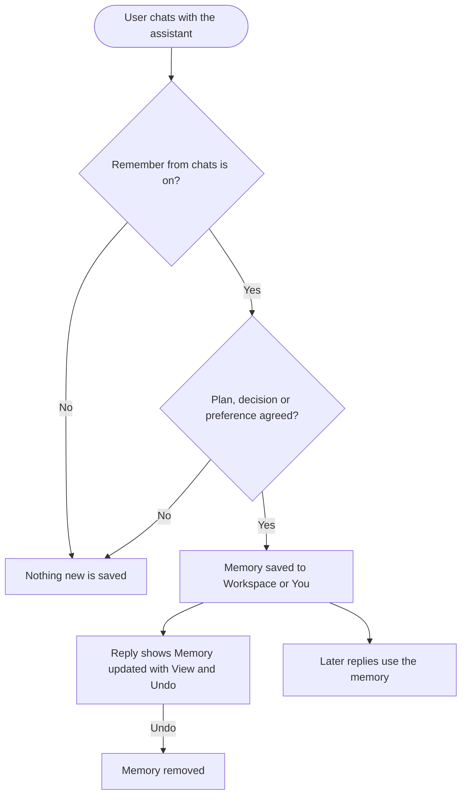
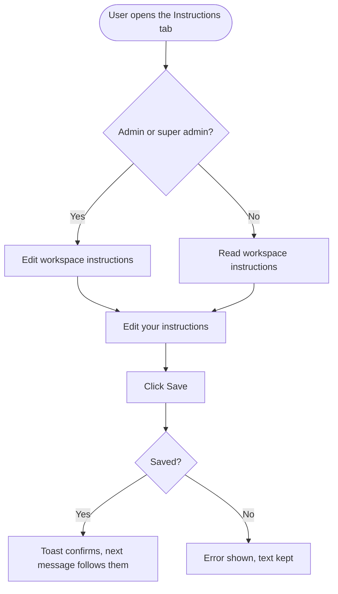
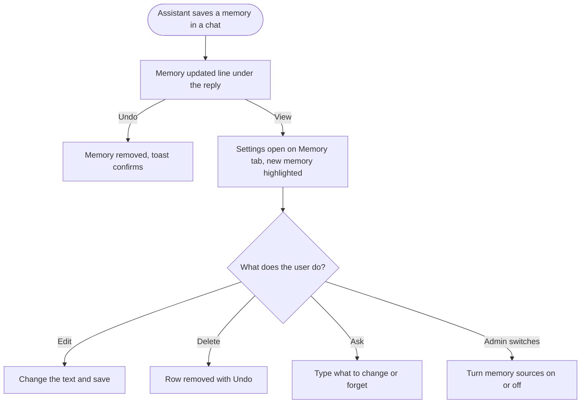

# Epic + stories: AI Chat settings (Instructions, Memory, Usage)

**Scope of this doc:** 1 epic and 10 stories (1 Research, 1 Design, 3 BE, 4 FE, 1 Flutter). Only the Research ticket goes into the technical approach. Every other story covers requirements and workflow, and the devs own the technical design.

**Prototype (link in every story):** https://claude.ai/artifact/Y81bvg35xMWjsWJVaj2MD2

---

## Epic: AI Chat settings: Instructions, Memory and Usage

AI Chat can plan, write, generate, publish, read analytics and work the inbox. But every chat starts from zero. The assistant doesn't remember the plan the team approved yesterday, that they stopped posting to X, or that Reels do better than carousels for this brand. There's also nowhere to give it standing rules like "never schedule without asking" or "no emojis on LinkedIn". Brand Knowledge describes who the brand is and is rebuilt whenever a source syncs, so it isn't the place for rules a person writes. Credits, meanwhile, are hidden in a tooltip on a small chip in the chat header.

This epic adds an **AI Chat settings** modal, opened from a gear button in the chat header on the web and in the Flutter app. It has three tabs:
- **Instructions:** rules the assistant follows in every chat. Admins set them for the whole workspace, and each person can add their own.
- **Memory:** what the assistant remembers about the workspace, learned from chats and from post results. Every save is shown in the chat with Undo, and memories can be edited or deleted.
- **Usage:** AI text, image and video credits with the reset date. It replaces the credits chip, and billing users can increase limits from it.

Skills and Brand Knowledge are linked from the same modal, so everything that shapes the assistant lives in one place. Memory is kept per workspace, so agency clients never see each other's context. It never learns from inbox messages in this version.

**Goals:**
- 25% of active AI Chat workspaces save instructions within 60 days.
- 40% of workspaces have 3 or more memories after 30 days.
- Under 15% of memories are undone or deleted within a day.
- No rise in thumbs-down replies, and no memory ever leaks between workspaces.

**Clickable prototype:** https://claude.ai/artifact/Y81bvg35xMWjsWJVaj2MD2

**Out of scope for this epic:**
- the assistant rebrand, which is a separate track
- memory from the inbox
- instructions and memory in non-chat AI features
- the public API, CLI and MCP server
- the "Where credits went" breakdown, which follows once a per-activity usage record exists

---

## [Research] Define how AI Chat stores and applies instructions and workspace memory

### Description:
As the engineering team, we want a clear, agreed technical approach for AI Chat instructions and workspace memory before we build them. That way the stories in this epic can be built without rework, and memory is safe, fast and affordable from day one.

The product requirements are settled, and this ticket settles the how. The output is a short written proposal that the backend, AI and frontend developers agree on, reviewed with the PO before the memory and instructions backend stories start.

### Workflow:
1. The developers read the product requirements in this epic (the Instructions, Memory and Usage stories) and the clickable prototype.
2. They look at how AI Chat builds each reply today, and at what memory support already exists on the AI platform, if any.
3. They answer the questions below in a written proposal.
4. They review the proposal with the PO, agree any trade-offs, and update the affected stories if a requirement can't be met as written.

**Questions the proposal must answer:**

**Instructions**
- How do workspace and personal instructions reach every AI Chat reply, including replies that resume after the user confirms a write action?
- How is the precedence rule enforced: workspace beats personal, and instructions beat Brand Knowledge on conflicts?
- How do instructions work alongside an active skill?
- Do the proposed limits (3,000 characters for workspace, 1,500 for personal) fit the prompt budget, and how much do they add to text credit use per message?

**Memory**
- Where is memory kept so that it belongs to one workspace, is shared by its members, and has a separate personal (You) part?
- How does the assistant decide something is worth remembering (a plan, a decision, a preference), and which category it goes in?
- How are memories picked for each reply (relevance, newest first) and kept within a per-message budget?
- How are duplicates and near-duplicates merged, and how many memories can a workspace keep before that happens? Entries edited by hand must never be merged or rewritten.
- What feeds "Learn from post results" (published post metrics or analytics results), and how often does it refresh?
- How does "Tell the assistant what to change or forget" find and change the right memories?
- How is memory protected from text that comes from outside the team? Inbox messages and comments are excluded in this version, and the proposal should show how that stays true.
- How is memory fully removed on delete, Delete all, member removal and workspace deletion, including any copies the AI platform keeps?

**Usage**
- Confirm the Usage tab meters can use the same credit data the credits chip uses today, including the reset date.
- Confirm what the per-activity usage record from the Usage visibility work needs to provide for the later "Where credits went" breakdown.

### Acceptance criteria:
- [ ] A written proposal answers every question above
- [ ] The proposal says where memory and instructions are kept, and how they are kept separate per workspace and per user
- [ ] The proposal gives a memory limit per workspace and a memory budget per message, with the expected effect on text credits
- [ ] The proposal names the source and refresh frequency for "Learn from post results"
- [ ] The proposal describes how every delete path fully removes memory, including copies held by the AI platform
- [ ] The proposal lists any requirement in this epic that can't be met as written, with an alternative
- [ ] The PO and the backend, AI and frontend leads have reviewed and agreed the proposal
- [ ] Any story changes that come out of it are made before the BE stories start

### Mock-ups:
N/A for research. The product behaviour is shown in the clickable prototype: https://claude.ai/artifact/Y81bvg35xMWjsWJVaj2MD2

### Impact on existing data:
None. This ticket produces a proposal only.

### Impact on other products:
The proposal covers AI Chat on the web and in the Flutter app. It should note anything that would later matter for other AI features, like Composer AI, AI Library and inbox auto-replies, without designing for them.

### Dependencies:
None. This ticket blocks **[BE] Save workspace and personal AI Chat instructions and apply them to every reply**, **[BE] Remember plans, decisions and preferences from AI Chat in workspace memory** and **[BE] Keep "What performs" memories up to date from post results**.

---

### Global quality & compliance (wherever applicable)

- [ ] Mobile responsiveness (N/A, research only)
- [ ] Multilingual support (N/A, research only)
- [ ] UI theming support (N/A, research only)
- [ ] White-label domains impact review
- [ ] Cross-product impact assessment (web, mobile apps, Chrome extension)
- [ ] Developer surfaces coverage (N/A, research only)

---

## [Design] Design the AI Chat settings modal for web and the mobile app

### Description:
As a ContentStudio user, I want AI Chat settings that feel familiar and easy to use, so I can set rules, check what the assistant remembers and see my credits without guessing where things are.

This design ticket covers the full settings experience on the web and in the Flutter app:
- the gear button in both web chat headers
- the modal and its three tabs
- the "Memory updated" line under chat replies
- the mobile settings page

The clickable prototype sets the direction. It follows the pattern users know from ChatGPT and Claude settings, and it is a starting point, not a final design.

### Workflow:
1. The designer reviews the prototype, the workflow and the UI copy in the FE stories of this epic.
2. The designer designs the web experience:
   - the gear button in the AI Studio chat header and in the docked AI Chat header, with the credits chip removed
   - the modal layout: tabs on the left, content on the right, and the Skills and Brand Knowledge links under "Customize"
   - the Instructions tab, for admin and collaborator views
   - the Memory tab: the switches, grouped list, row hover actions, inline editing, the "Tell the assistant what to change or forget" box and Delete all
   - the Usage tab: three meters with normal, low and used-up states, and the Increase limits button vs the ask-your-admin line
   - the "Memory updated" line under a chat reply, with View and Undo
   - empty, loading and error states for every tab
3. The designer designs the Flutter version: the settings icon in the assistant header, and a full-screen settings page with the same three tabs.
4. The designer checks every screen with a white-label theme colour applied.
5. The designer confirms which components exist in the design library, and flags any that don't (for example, a vertical tab list in the modal).

### Acceptance criteria:
- [ ] Designs cover every screen and state listed in the workflow above, on web and in the Flutter app
- [ ] Admin and collaborator versions are shown for the Instructions and Memory tabs
- [ ] The Usage tab is shown for a billing user and for a non-billing user
- [ ] The "Memory updated" line is designed inside a real chat reply, with View and Undo
- [ ] Every screen is shown with the default theme and with one white-label theme colour
- [ ] Designs use existing design-library components where they exist, and list any new component needed
- [ ] The final copy in the designs matches the FE stories, or the FE stories are updated to match
- [ ] The PO has approved the designs

### Mock-ups:
Clickable prototype: https://claude.ai/artifact/Y81bvg35xMWjsWJVaj2MD2

### Impact on existing data:
None.

### Impact on other products:
- Changes the header of AI Chat on the web and of the AI assistant in the Flutter app.
- The Chrome extension should get the same settings button, if it shows AI Chat.

### Dependencies:
None. Blocks all FE stories in this epic and **[Flutter] Add AI Chat settings with Instructions, Memory and Usage to the app**.

---

### Global quality & compliance (wherever applicable)

- [ ] Mobile responsiveness (web modal at smaller desktop widths, plus the Flutter page)
- [ ] Multilingual support (leave room for longer translated labels)
- [ ] UI theming support (default + white-label, design library components are being used)
- [ ] White-label domains impact review
- [ ] Cross-product impact assessment (web, mobile apps, Chrome extension)
- [ ] Developer surfaces coverage (N/A, design only)

---

## [BE] Save workspace and personal AI Chat instructions and apply them to every reply

### Description:
As a workspace admin, I want to save rules the assistant follows for everyone in my workspace. As any team member, I want to add my own rules. Together, these make AI Chat replies follow how our team works without anyone repeating it.

This story covers saving and reading both kinds of instructions, who is allowed to change them, and making sure every AI Chat reply follows them. That applies on the web and in the Flutter app, in new chats and in chats that are already open.

### Workflow:
1. An admin writes workspace instructions in AI Chat settings and saves them.
2. A team member writes personal instructions and saves them.
3. Anyone in the workspace opens the Instructions tab and sees the current workspace instructions, and their own personal instructions.
4. The next time anyone in the workspace sends a message in AI Chat, the reply follows the workspace instructions and that person's personal instructions.
5. If the two conflict, the reply follows the workspace instruction. If an instruction conflicts with Brand Knowledge, the reply follows the instruction.

### Acceptance criteria:
- [ ] Workspace instructions can be saved, read and cleared for a workspace
- [ ] Only super admins and admins of that workspace can save or clear workspace instructions. A collaborator's attempt is refused with a permission error
- [ ] Every member who can use AI Chat can read the workspace instructions
- [ ] The system records who last changed the workspace instructions and when, and returns both with the instructions
- [ ] Personal instructions can be saved, read and cleared by each user, separately for each workspace
- [ ] A user can never read or change another user's personal instructions
- [ ] Workspace instructions over 3,000 characters and personal instructions over 1,500 characters are refused with a clear validation error
- [ ] Empty instructions are allowed, and mean "no instructions"
- [ ] Every AI Chat reply, on web and in the app, follows the workspace instructions and the sender's personal instructions
- [ ] Saved changes take effect from the next message, including in a chat that is already open
- [ ] Replies that continue after the user confirms a write action (for example, "Yes, schedule it") still follow the instructions
- [ ] When a personal instruction conflicts with a workspace instruction, the reply follows the workspace instruction (QA check: workspace says "Write in British English", personal says "Write in American English", and the reply uses British spelling)
- [ ] When an instruction conflicts with Brand Knowledge, the reply follows the instruction (QA check: Brand Knowledge style uses emojis, the instruction says "No emojis", and the reply has no emojis)
- [ ] Instructions still apply while a skill is active
- [ ] Instructions never appear in another workspace's replies
- [ ] When a member is removed from a workspace, their personal instructions for that workspace are deleted
- [ ] When a workspace is deleted, its workspace instructions and all personal instructions for it are deleted
- [ ] Instruction text is not written into application logs
- [ ] When the user saves instructions, the `ai_chat_instructions_saved` Usermaven event can be fired by the client with `{ scope, is_first_save, platform }` (the save response tells the client whether this was the first save for that scope)

### Mock-ups:
N/A, backend only. Product behaviour: https://claude.ai/artifact/Y81bvg35xMWjsWJVaj2MD2

### Impact on existing data:
Adds new, empty instructions for every workspace and user. No existing data changes. Brand Knowledge and skills are untouched.

### Impact on other products:
- AI Chat on the web and in the Flutter app both read the same instructions.
- Composer AI, AI Library and inbox auto-replies are not affected in this version.

### Dependencies:
- **[Research] Define how AI Chat stores and applies instructions and workspace memory**

---

### Global quality & compliance (wherever applicable)

- [ ] Mobile responsiveness (N/A, backend only)
- [ ] Multilingual support (instructions are applied in whatever language the user writes, and validation errors are translatable)
- [ ] UI theming support (N/A, backend only)
- [ ] White-label domains impact review
- [ ] Cross-product impact assessment (web, mobile apps, Chrome extension)
- [ ] Developer surfaces coverage (N/A for v1. Exposing instructions on the public API, CLI and MCP server is deferred to a later version)

---

## [BE] Remember plans, decisions and preferences from AI Chat in workspace memory

### Description:
As an AI Chat user, I want the assistant to remember the plans, decisions and preferences we agree on, and to let me see, fix and remove what it remembers. Then I don't have to repeat context in every chat, and I can trust what it knows.

This story covers memory from chats:
- saving memories during a chat
- the notice in the chat when something is saved
- the memory list and its categories
- editing, deleting and Delete all
- the memory switches
- the "Tell the assistant what to change or forget" request
- who can change what
- using memories in replies
- removing memory when people or workspaces go

Memory from post results is its own story.

### Workflow:

1. A user agrees something with the assistant. For example: "Let's stop posting to X from next week", or they approve the October plan.
2. The assistant saves it as a memory. Team knowledge goes under Workspace, and personal preferences like "I like tables" go under You. The reply shows that a memory was saved.
3. The user can undo that save straight away.
4. In later chats, from any member of the workspace for Workspace memories, or from that user for You memories, the assistant uses what it remembers.
5. On the Memory tab, the user sees all memories with their category, source and date. They can edit or delete them, or ask the assistant in plain words to change or forget something.
6. Admins can switch memory from chats off, or delete all memories.

### Acceptance criteria:
**Saving**
- [ ] With "Remember from chats" on, the assistant saves a memory when a chat produces a plan, a decision or a stated preference
- [ ] Each memory has: the text, a scope (Workspace or You), a category (Plans, Decisions, What performs, Publishing habits, or none for You), a source (From chat or From post results), the date, and the chat it came from
- [ ] Every save made during a chat is reported with that reply, so the chat can show "Memory updated" with the memory text
- [ ] Undo on a just-saved memory removes it completely
- [ ] With "Remember from chats" off, no new memories are saved from chats, and existing memories are kept and still used
- [ ] No memory is ever created from inbox messages, comments or other text sent by people outside the workspace
- [ ] A memory is saved in one workspace only and is never used, listed or returned in any other workspace, including other workspaces under the same account

**Using**
- [ ] AI Chat replies on web and in the app use relevant Workspace memories and the sender's own You memories (QA check: after the chat that saved "Stopped posting to X on Sep 12", a new chat asking "Plan next week's posts" does not include X)
- [ ] You memories are only ever used in that user's own replies
- [ ] Memories are used within the per-message limit agreed in the Research ticket

**Managing**
- [ ] The memory list returns Workspace memories grouped by category, and the requesting user's You memories, each with source, date and whether the current user can edit it
- [ ] A memory's text can be edited. A memory edited by hand is marked as edited and is never changed, merged or removed automatically afterwards
- [ ] A memory can be deleted, and a deleted memory can be restored with Undo for a short time
- [ ] Super admins and admins can edit or delete any Workspace memory
- [ ] Collaborators can edit or delete Workspace memories that came from their own chats, and any of their own You memories. Other attempts are refused with a permission error
- [ ] Delete all removes every Workspace memory, and every member's You memories, in that workspace. Only super admins and admins can do it
- [ ] A plain-language request (for example, "Forget the Halloween plan, we cancelled it") changes or removes the matching memories and returns a list of what changed. It follows the same permission rules as editing and deleting by hand
- [ ] When a workspace reaches the memory limit, similar memories are merged. If that isn't enough, the response says memory is full and no new memory is saved

**Switches**
- [ ] "Remember from chats" and "Learn from post results" can be read by every member, and changed only by super admins and admins
- [ ] Both switches are on by default for new and existing workspaces

**Removal**
- [ ] When a member is removed from a workspace, their You memories for that workspace are deleted. Workspace memories from their chats stay
- [ ] When a workspace is deleted, all its memories and memory settings are deleted, including any copies held by the AI platform
- [ ] Deleted memories can no longer be used in any reply
- [ ] Memory text is not written into application logs

### Mock-ups:
N/A, backend only. Product behaviour: https://claude.ai/artifact/Y81bvg35xMWjsWJVaj2MD2

### Impact on existing data:
Adds new, empty memory for every workspace, with both switches on. Existing chats aren't read back to create memories. Memory starts from the first chat after release.

### Impact on other products:
- AI Chat on the web and in the Flutter app share the same memory.
- Inbox, Composer AI and AI Library are not affected in this version.

### Dependencies:
- **[Research] Define how AI Chat stores and applies instructions and workspace memory**

---

### Global quality & compliance (wherever applicable)

- [ ] Mobile responsiveness (N/A, backend only)
- [ ] Multilingual support (memories are saved in the language of the chat, and error messages are translatable)
- [ ] UI theming support (N/A, backend only)
- [ ] White-label domains impact review
- [ ] Cross-product impact assessment (web, mobile apps, Chrome extension)
- [ ] Developer surfaces coverage (N/A for v1. Exposing memory on the public API, CLI and MCP server is deferred to a later version)

---

## [BE] Keep "What performs" memories up to date from post results

### Description:
As an AI Chat user, I want the assistant to learn what works for my brand from how my published posts actually perform. Then its plans and suggestions lean towards what gets results, without me having to explain it.

When "Learn from post results" is on, the assistant keeps a short, current set of "What performs" memories for the workspace. For example: "Reels get about 3x the reach of carousels on Instagram", or "Posts on Tuesday evening get the most engagement."

### Workflow:
1. A workspace publishes posts, and their results come in.
2. With "Learn from post results" on, the assistant regularly reviews recent results for the workspace.
3. It adds or updates a few "What performs" memories that describe clear patterns, each marked "From post results" with the date of the last update.
4. When patterns change, it updates those memories so they stay current. Memories a person has edited are left alone.
5. In later chats, the assistant uses these memories when planning or suggesting posts.

### Acceptance criteria:
- [ ] With "Learn from post results" on, the workspace gets "What performs" memories based on its own published posts' results
- [ ] Each of these memories is short and plain, names the platform where relevant, and shows "From post results" with the date of the last update
- [ ] The memories refresh on the schedule agreed in the Research ticket, and update when a pattern changes
- [ ] The number of "What performs" memories stays small (the limit agreed in the Research ticket), and duplicates are not created
- [ ] A "What performs" memory edited by hand is never changed or removed by a refresh
- [ ] A deleted "What performs" memory is not immediately recreated with the same text by the next refresh
- [ ] Workspaces without enough published results get no "What performs" memories, rather than guesses
- [ ] With "Learn from post results" off, no new memories are added or updated from results, and existing ones are kept
- [ ] These memories use only the workspace's own results and never appear in another workspace
- [ ] AI Chat replies about planning or suggesting posts use these memories (QA check: with a "Reels outperform carousels" memory, asking "What should I post on Instagram this week?" favours Reels)

### Mock-ups:
N/A, backend only. Product behaviour: https://claude.ai/artifact/Y81bvg35xMWjsWJVaj2MD2

### Impact on existing data:
Adds "What performs" memories to workspaces that have published posts with results. Post and analytics data are only read, never changed.

### Impact on other products:
- Reads published post results, but doesn't change Publishing or Analytics.
- AI Chat on web and in the app uses the memories.

### Dependencies:
- **[Research] Define how AI Chat stores and applies instructions and workspace memory**
- **[BE] Remember plans, decisions and preferences from AI Chat in workspace memory**

---

### Global quality & compliance (wherever applicable)

- [ ] Mobile responsiveness (N/A, backend only)
- [ ] Multilingual support (memories are written in the workspace's main language)
- [ ] UI theming support (N/A, backend only)
- [ ] White-label domains impact review
- [ ] Cross-product impact assessment (web, mobile apps, Chrome extension)
- [ ] Developer surfaces coverage (N/A, nothing API-facing changes)

---

## [FE] Add the AI Chat settings button and modal, and remove the credits chip

### Description:
As an AI Chat user, I want one settings button in the chat header that opens everything that shapes the assistant, so I don't have to hunt across the app for instructions, memory, credits, skills and brand settings.

This story adds the gear button to both AI Chat headers on the web, removes the credits chip from both, and builds the settings modal shell. That means the left-hand tabs, the Skills and Brand Knowledge links, and opening and closing the modal. The content of each tab is in its own story.

### Workflow:
1. The user opens AI Chat, either from AI Studio → AI Chat or from the docked AI Chat.
2. In the header, between the Chat history button and **+ New Chat**, they see a settings (gear) button. The green credits chip that used to be there is gone.
3. They hover the button and see the tooltip "AI Chat settings".
4. They click it, and the **AI Chat settings** modal opens on Instructions (or on the tab they used last).
5. They click **Instructions**, **Memory** or **Usage** on the left to switch tabs.
6. They click **Skills** or **Brand Knowledge** under "Customize". The modal closes and that page opens.
7. They close the modal with the X, a click outside it, or Esc.

### Acceptance criteria:
**Header**
- [ ] A settings button appears in the AI Studio → AI Chat header and in the docked AI Chat header, between Chat history and + New Chat
- [ ] The button uses the `ActionIcon` component with the settings (gear) `Icon`, in the same style as the Chat history button
- [ ] Hovering the button shows the tooltip "AI Chat settings"
- [ ] The credits chip is removed from both headers
- [ ] Removing the chip doesn't change anything else about the header layout

**Modal**
- [ ] Clicking the button opens a `Modal` titled **"AI Chat settings"**, with the workspace name as subtext (for example, "Bloomville Home")
- [ ] A "Learn more" `?` icon next to the title opens the help article for AI Chat settings in a new tab
- [ ] The left side lists, under the section label **"Settings"**: **Instructions**, **Memory**, **Usage**
- [ ] Below that, under **"Customize"**: **Skills** and **Brand Knowledge**, each with an arrow icon showing they open another page
- [ ] The left-hand tab list uses the `Tabs` component. If `Tabs` doesn't support a vertical, left-side layout: *Requires new component variant: vertical tabs for a settings modal. Not confirmed in `@contentstudio/ui`, so it needs a library update, tracked with **[Design] Design the AI Chat settings modal for web and the mobile app**.*
- [ ] The modal opens on Instructions the first time, and on the last tab the user viewed after that (remembered per user in this browser)
- [ ] Clicking **Skills** closes the modal and opens AI Studio → Skills
- [ ] Clicking **Brand Knowledge** closes the modal and opens Settings → Brand Knowledge
- [ ] The modal closes with the X button (aria label "Close settings"), a click outside, or Esc
- [ ] Tabs can be reached and switched with the keyboard, and focus returns to the settings button when the modal closes
- [ ] Selected-tab styling uses theme classes (for example `bg-primary-cs-50`, `text-primary-cs-700`) so it follows white-label colours

**Access**
- [ ] Everyone who can use AI Chat can open the modal. Approvers still can't reach AI Studio, and nothing changes for them

### Mock-ups:
Clickable prototype: https://claude.ai/artifact/Y81bvg35xMWjsWJVaj2MD2. Final designs come from **[Design] Design the AI Chat settings modal for web and the mobile app**.

### Impact on existing data:
None.

### Impact on other products:
- The credits chip no longer appears in either AI Chat header, and balances move to the Usage tab.
- Any help articles or screenshots showing the chip need updating.
- Check whether the Chrome extension shows AI Chat. If it does, it gets the same button.

### Dependencies:
- **[Design] Design the AI Chat settings modal for web and the mobile app**

---

### Global quality & compliance (wherever applicable)

- [ ] Mobile responsiveness (frontend only, N/A for backend-only stories)
- [ ] Multilingual support (frontend + backend, translations available or fallback handled)
- [ ] UI theming support (default + white-label, design library components are being used)
- [ ] White-label domains impact review
- [ ] Cross-product impact assessment (web, mobile apps, Chrome extension)
- [ ] Developer surfaces coverage (N/A, frontend only)

---

## [FE] Build the Instructions tab in AI Chat settings

### Description:
As a workspace admin, I want to write rules the assistant follows for my whole team. As a team member, I want to see those rules and add my own. That way AI Chat works the way we do, without anyone repeating it in every chat.

### Workflow:

1. The user opens AI Chat settings. The Instructions tab shows first.
2. At the top: the title **"Instructions"** and a line explaining what instructions are.
3. **Workspace instructions:**
   - Admins and super admins see an editable box.
   - Collaborators see the same text, read-only, with "Set by your workspace admins".
4. **Your instructions:** everyone sees their own editable box.
5. The user types rules and clicks **Save instructions**. A toast confirms, and the next message they send follows the rules.
6. A helper line explains how instructions differ from Brand Knowledge, and links to it.

### Acceptance criteria:
**Header**
- [ ] Title: **"Instructions"**
- [ ] Subtext: "Rules the assistant follows in every chat, on the web and in the mobile app. Brand Knowledge covers who you are. Use instructions for how you want the assistant to work."

**Workspace instructions (admins and super admins)**
- [ ] Label: **"Workspace instructions"**, with a `Badge` "Admins can edit" and helper text "Applies to everyone in [workspace name]"
- [ ] Uses the `Textarea` component
- [ ] Placeholder: "Example: Never use more than 3 hashtags. No emojis on LinkedIn. Save posts as drafts and never schedule without asking. Write in British English."
- [ ] Info icon `ℹ` next to the label, with hover text: "These rules apply to every chat in this workspace, for every team member. Example: if you add 'Always add ?utm_source=social to links', every link the assistant writes will include it."
- [ ] Character counter below the box: "1,240 / 3,000"
- [ ] Below the counter: "Last edited by [name] on [date]" (hidden when never edited)

**Workspace instructions (collaborators)**
- [ ] Same label and text, shown read-only (the `Textarea` is disabled) with the note "Set by your workspace admins"
- [ ] When empty: "Your admins haven't added workspace instructions yet."

**Your instructions (everyone)**
- [ ] Label: **"Your instructions"**, with helper text "Only for you. Your teammates don't see these."
- [ ] Uses the `Textarea` component
- [ ] Placeholder: "Example: I look after Instagram and TikTok, so start with those. Keep inbox replies under 40 words."
- [ ] Info icon `ℹ` with hover text: "These add to the workspace instructions for your chats only. If they clash, the workspace instructions win. Example: if the workspace says British English and you ask for American English, the assistant uses British English."
- [ ] Character counter: "320 / 1,500"

**Helper line**
- [ ] An `Alert` (info) below the boxes: "If an instruction clashes with your Brand Knowledge, the assistant follows the instruction." with the link **"Open Brand Knowledge"**, which opens Settings → Brand Knowledge

**Saving**
- [ ] Buttons: **"Save instructions"** (`Button`, primary) and **"Cancel"** (`Button`, secondary). Save is disabled until something changes
- [ ] Cancel restores the last saved text
- [ ] On success, a toast (`CstToast`): "Instructions saved. They apply to new messages from now on."
- [ ] When a counter goes over its limit, it turns red and Save is disabled, with the helper "Workspace instructions can be up to 3,000 characters. Try shortening or combining rules." (or "Your instructions can be up to 1,500 characters. Try shortening or combining rules.")
- [ ] On failure, an inline `Alert` (error): "We couldn't save your instructions. Check your connection and try again." The typed text stays in the box
- [ ] Closing the modal or switching tabs with unsaved changes opens a `Dialog`: title "Discard changes?", text "You have unsaved instructions. If you leave now, they won't be saved.", buttons **"Keep editing"** (primary) and **"Discard"** (secondary)

**States**
- [ ] Loading: a `Loader` in place of the two boxes while instructions load
- [ ] Load error: `Alert` (error) "We couldn't load your instructions." with a **"Try again"** button
- [ ] Empty (nothing saved yet): both boxes empty with their placeholders. No extra empty-state screen is needed

**Analytics**
- [ ] When the user saves workspace or personal instructions and the save succeeds, an `ai_chat_instructions_saved` Usermaven event fires with `{ scope: 'workspace' | 'personal', is_first_save: boolean, platform: 'web' }`

### Mock-ups:
See PRD section 7 and the clickable prototype: https://claude.ai/artifact/Y81bvg35xMWjsWJVaj2MD2. Final designs come from **[Design] Design the AI Chat settings modal for web and the mobile app**.

### Impact on existing data:
None beyond saving the new instructions.

### Impact on other products:
- The same instructions are used by AI Chat in the Flutter app.
- Brand Knowledge is linked, but not changed.

### Dependencies:
- **[FE] Add the AI Chat settings button and modal, and remove the credits chip**
- **[BE] Save workspace and personal AI Chat instructions and apply them to every reply**

---

### Global quality & compliance (wherever applicable)

- [ ] Mobile responsiveness (frontend only, N/A for backend-only stories)
- [ ] Multilingual support (frontend + backend, translations available or fallback handled)
- [ ] UI theming support (default + white-label, design library components are being used)
- [ ] White-label domains impact review
- [ ] Cross-product impact assessment (web, mobile apps, Chrome extension)
- [ ] Developer surfaces coverage (N/A, frontend only)

---

## [FE] Build the Memory tab and the "Memory updated" line in AI Chat

### Description:
As an AI Chat user, I want to know when the assistant remembers something, and to see, fix or remove what it remembers. Then I can trust it with my team's plans and decisions, and I'm never surprised by what it knows.

This story covers two places:
- the **"Memory updated"** line under a chat reply
- the **Memory tab** in AI Chat settings: the switches, the memory list, edit and delete, "Tell the assistant what to change or forget", and Delete all

### Workflow:

1. During a chat, the assistant saves a memory. Under its reply, the user sees "Memory updated" with **View** and **Undo**.
2. **Undo** removes that memory. **View** opens AI Chat settings on the Memory tab, with the new memory highlighted.
3. On the Memory tab, the user sees two switches, then the memories under **Workspace** (grouped by category) and **You**.
4. They hover a row to **Edit** or **Delete** it.
5. They type in the box at the bottom to ask the assistant to change or forget something.
6. Admins can turn the switches off, or delete all memories.

### Acceptance criteria:
**"Memory updated" line in the chat**
- [ ] When a reply saved one or more memories, a line appears under that reply: an `Icon` (memory), the text **"Memory updated"**, and the ghost `Button`s **"View"** and **"Undo"**
- [ ] Hovering "Memory updated" shows what was saved, for example: "Remembered: Stopped posting to X on Sep 12"
- [ ] When several memories were saved, the line reads **"2 memories updated"**, and the hover lists them
- [ ] **Undo** removes those memories and replaces the line with "Memory removed" plus a toast "Removed from memory."
- [ ] **View** opens AI Chat settings on the Memory tab, with the new memory highlighted (`bg-primary-cs-50`) for a few seconds
- [ ] The line uses theme classes, so it follows white-label colours

**Tab header**
- [ ] Title: **"Memory"**
- [ ] Subtext: "What the assistant has learned about [workspace name]. It uses this so you don't have to repeat yourself in every chat. Your team shares workspace memories."

**Switches** (each a `Switch`)
- [ ] **"Remember from chats"**, subtext "Save plans, decisions and preferences from your chats."
  - Tooltip (`CstPopup`): "When you agree something with the assistant, like 'We're pausing X next month', it remembers it for future chats. You'll always see 'Memory updated' when this happens."
- [ ] **"Learn from post results"**, subtext "After posts go live, note what performed well and what didn't."
  - Tooltip: "The assistant looks at how your published posts did and remembers patterns. Example: 'Reels get about 3x the reach of carousels on Instagram.'"
- [ ] Only admins and super admins can change the switches. Collaborators see them disabled, with the tooltip "Only admins can change memory settings."
- [ ] When both switches are off, an `Alert` (info) shows at the top: "Memory is off. The assistant won't save anything new. Existing memories are still used until you delete them."
- [ ] When a switch is turned off, a toast confirms: "Turned off. Existing memories are kept. Delete them below if you don't want them used."

**Memory list**
- [ ] Section **"Workspace"**, with these category headings: **Plans**, **Decisions**, **What performs**, **Publishing habits**. Categories without memories are hidden
- [ ] Section **"You"**, with the helper "Only used in your chats"
- [ ] Each row (`ListItem`) shows the memory text, the source ("From chat" or "From post results"), the date ("Sep 26"), and "Edited" when a person has changed it
- [ ] Hovering a row shows `ActionIcon`s for **Edit** (pencil) and **Delete** (trash), with aria labels "Edit memory" and "Delete memory"
- [ ] Edit and Delete appear only on rows the user is allowed to change. On other rows, hovering shows: "Only admins can change memories from other people's chats."
- [ ] **Edit** turns the row into a `TextInput` with **"Save"** and **"Cancel"**. On save, a toast: "Memory updated." An empty memory can't be saved, and shows "A memory can't be empty. Delete it instead."
- [ ] **Delete** removes the row and shows a toast "Memory deleted." with **"Undo"** for 8 seconds

**Tell the assistant what to change or forget**
- [ ] A `TextInput` at the bottom with the placeholder "Tell the assistant what to change or forget" and a send `ActionIcon`
- [ ] Example hint below it: "Try: 'Forget the Halloween plan, we cancelled it' or 'We post 4 times a week on Instagram now.'"
- [ ] While it works, the send button shows a `Loader`
- [ ] When done, the changed rows are highlighted and a toast says what changed, for example: "Updated 1 memory and removed 1."
- [ ] If nothing matched: "I couldn't find a memory about that. Nothing was changed."

**Delete all**
- [ ] A text `Button` **"Delete all memories"** at the bottom, for admins and super admins only
- [ ] It opens a `Dialog`:
  - title: "Delete all memories?"
  - text: "This removes everything the assistant remembers about [workspace name], for your whole team. It can't be undone."
  - buttons: **"Delete all"** (danger) and **"Cancel"**
- [ ] On success: the list empties and a toast says "All memories deleted."

**States**
- [ ] Empty state: an illustration of a notebook, the headline **"Nothing remembered yet"**, and the subtext "As you plan, decide and publish with the assistant, it will remember the important things here. Example: 'October plan approved: 12 posts, Halloween sale Oct 24 to 31.'" plus the CTA **"Go to chat"**, which closes the modal
- [ ] Loading: `Loader` skeleton rows
- [ ] Load error: `Alert` (error) "We couldn't load memories." with **"Try again"**
- [ ] Memory full: `Alert` (warning) "Memory is full. Delete memories you no longer need so new ones can be saved."
- [ ] Any action that fails: toast "That didn't work. Please try again."

**Analytics**
- [ ] When an admin turns a switch on or off, an `ai_chat_memory_setting_changed` Usermaven event fires with `{ setting: 'chats' | 'post_results', enabled: boolean }`
- [ ] When the user deletes one memory, clicks Undo on "Memory updated", or confirms Delete all, an `ai_chat_memory_deleted` Usermaven event fires with `{ method: 'single' | 'undo' | 'all', category }`
- [ ] When the user saves an edit to a memory, an `ai_chat_memory_edited` Usermaven event fires with `{ category }`
- [ ] When a "Tell the assistant what to change or forget" request completes, an `ai_chat_memory_instructed` Usermaven event fires with `{ changes_count }`

### Mock-ups:
See PRD section 7 and the clickable prototype: https://claude.ai/artifact/Y81bvg35xMWjsWJVaj2MD2. Final designs come from **[Design] Design the AI Chat settings modal for web and the mobile app**.

### Impact on existing data:
None beyond the memories this feature creates.

### Impact on other products:
- The same memories appear in the Flutter app.
- The "Memory updated" line is added to AI Chat replies in both web chat views.

### Dependencies:
- **[FE] Add the AI Chat settings button and modal, and remove the credits chip**
- **[BE] Remember plans, decisions and preferences from AI Chat in workspace memory**
- **[BE] Keep "What performs" memories up to date from post results** (for "From post results" rows only)

---

### Global quality & compliance (wherever applicable)

- [ ] Mobile responsiveness (frontend only, N/A for backend-only stories)
- [ ] Multilingual support (frontend + backend, translations available or fallback handled)
- [ ] UI theming support (default + white-label, design library components are being used)
- [ ] White-label domains impact review
- [ ] Cross-product impact assessment (web, mobile apps, Chrome extension)
- [ ] Developer surfaces coverage (N/A, frontend only)

---

## [FE] Build the Usage tab in AI Chat settings

### Description:
As an AI Chat user, I want to see how many AI text, image and video credits my workspace has used and when they reset, so I'm never surprised by running out mid-task. As an admin with billing access, I want to add more from the same place.

This replaces the hover tooltip on the credits chip, which is removed from the chat header. The balances come from the same place the chip used. The "Where credits went" breakdown comes in a later version.

### Workflow:
1. The user opens AI Chat settings and clicks **Usage**.
2. They see the reset date and three meters: AI text credits, AI image credits and AI video credits. Each shows used against the limit.
3. A meter that is running low turns amber, and one that is used up turns red.
4. A super admin, or an admin with billing access, clicks **Increase limits**, and the existing Increase Limits dialog opens.
5. Everyone else sees who to ask for more credits.

### Acceptance criteria:
**Header**
- [ ] Title: **"Usage"**
- [ ] Subtext: "AI credits for [workspace name] this billing period. Credits reset on [date]." (for example, "Credits reset on Oct 1.")

**Meters** (each uses the `Progress` component)
- [ ] **"AI text credits"**, subtext "Words written in chats, captions and replies", value "41,200 / 100,000 words"
- [ ] **"AI image credits"**, subtext "Images generated and edited", value "86 / 150"
- [ ] **"AI video credits"**, subtext "Videos generated", value "33 / 40"
- [ ] Info icon `ℹ` next to "AI text credits": "Every word the assistant writes counts. Example: a 150-word caption uses 150 text credits."
- [ ] Values match what the removed credits chip showed for the same workspace
- [ ] At 80% used or more, the meter shows a warning colour and the text "Running low"
- [ ] At 100% used, the meter shows the error colour and the text "Used up. New AI requests of this type will be blocked until [reset date]."
- [ ] Meter colours use theme or semantic classes (for example, the normal state uses `bg-primary-cs-500`) and follow white-label colours
- [ ] The values refresh after each AI Chat reply, so they stay current while the modal is open

**Getting more credits**
- [ ] Super admins, and admins with billing access, see a card: the headline "Need more credits?", the text "Add credits so your team can keep creating.", and a `Button` (primary) **"Increase limits"**
- [ ] **Increase limits** opens the existing Increase Limits dialog
- [ ] When a meter is running low or used up, the card headline changes to match. For example: "Video credits are running low" and "7 left until Oct 1."
- [ ] Everyone else sees the line "Need more credits? Ask your workspace owner or an admin with billing access." with no button

**States**
- [ ] Loading: `Loader` placeholders for the three meters
- [ ] Error: `Alert` (error) "We couldn't load your credits." with **"Try again"**
- [ ] A credit type the plan doesn't include (limit 0) shows "Not included in your plan" in place of the meter. The Increase limits card still shows for billing users

**Analytics**
- [ ] When the user clicks **Increase limits** on the Usage tab, an `ai_usage_increase_limits_clicked` Usermaven event fires with `{ credit_type: 'text' | 'image' | 'video' | 'general' }` (the type shown as low, or 'general' if none is low)
- [ ] Completing a purchase in the Increase Limits dialog still fires the existing `addons_limits_updated` event

### Mock-ups:
See PRD section 7 and the clickable prototype: https://claude.ai/artifact/Y81bvg35xMWjsWJVaj2MD2. The "Where credits went" table in the prototype is for a later version and is not part of this story. Final designs come from **[Design] Design the AI Chat settings modal for web and the mobile app**.

### Impact on existing data:
None. This reads existing credit balances only.

### Impact on other products:
- Replaces the credits chip in both AI Chat headers.
- Uses the existing Increase Limits dialog from billing.
- The same balances appear in the Flutter app.

### Dependencies:
- **[FE] Add the AI Chat settings button and modal, and remove the credits chip**

---

### Global quality & compliance (wherever applicable)

- [ ] Mobile responsiveness (frontend only, N/A for backend-only stories)
- [ ] Multilingual support (frontend + backend, translations available or fallback handled)
- [ ] UI theming support (default + white-label, design library components are being used)
- [ ] White-label domains impact review
- [ ] Cross-product impact assessment (web, mobile apps, Chrome extension)
- [ ] Developer surfaces coverage (N/A, frontend only)

---

## [Flutter] Add AI Chat settings with Instructions, Memory and Usage to the app

### Description:
As a mobile user, I want the same AI Chat settings in the app as on the web, so my instructions, memory and credits work wherever I chat, and I don't have to set anything up twice.

This story adds a settings icon to the AI assistant header in the app. It opens a full-screen settings page with the same three tabs as the web, backed by the same data and permissions. The credits pill in the header is removed, and its information moves to the Usage tab.

### Workflow:
1. The user opens the AI assistant in the app.
2. In the header, they tap the settings icon. The credits pill that used to be there is gone.
3. A full-screen **AI Chat settings** page opens, with three tabs across the top: **Instructions**, **Memory**, **Usage**.
4. **Instructions:** they read the workspace instructions (and can edit them if they're an admin), edit their own, and tap **Save**.
5. **Memory:** they see the switches (editable only for admins) and the memory list. They can swipe or tap to edit or delete, type what to change or forget, and admins can delete all.
6. **Usage:** they see the three meters and the reset date. Billing users can tap **Increase limits**, which opens the web billing page. Everyone else sees who to ask.
7. Under the tabs, **Skills** and **Brand Knowledge** links open those pages in the web app.
8. In a chat, when the assistant saves a memory, a "Memory updated" line with **View** and **Undo** appears under the reply.

### Acceptance criteria:
- [ ] A settings icon appears in the AI assistant header. The credits pill is removed
- [ ] Tapping it opens a full-screen **"AI Chat settings"** page with a back button and the tabs **Instructions**, **Memory**, **Usage**
- [ ] All copy, limits, counters, validation messages, toasts, empty states, loading states and error states match the web stories:
  - **[FE] Build the Instructions tab in AI Chat settings**
  - **[FE] Build the Memory tab and the "Memory updated" line in AI Chat**
  - **[FE] Build the Usage tab in AI Chat settings**
- [ ] Permissions match the web:
  - collaborators see workspace instructions and the memory switches read-only
  - Delete all is shown only to admins and super admins
  - Increase limits is shown only to super admins and admins with billing access
- [ ] Instructions, memories, switches and credit balances are the same data the web shows. A change made in the app shows on the web and the other way round
- [ ] Deleting a memory shows a snackbar "Memory deleted." with **Undo**
- [ ] "Memory updated" with View and Undo appears under replies that saved a memory. View opens the settings page on the Memory tab
- [ ] **Increase limits**, **Skills** and **Brand Knowledge** open the matching page in the web app, in the in-app browser
- [ ] Leaving the Instructions tab with unsaved changes asks "Discard changes?", with **Keep editing** and **Discard**
- [ ] Credit meters update after each chat reply
- [ ] Text boxes stay above the keyboard while typing, and the page respects safe areas on devices with a notch
- [ ] Works the same on iOS and Android
- [ ] Usermaven events fire as on the web, with `platform: 'app'` on `ai_chat_instructions_saved`

### Mock-ups:
See PRD section 7 and the clickable prototype: https://claude.ai/artifact/Y81bvg35xMWjsWJVaj2MD2. Final mobile designs come from **[Design] Design the AI Chat settings modal for web and the mobile app**.

### Impact on existing data:
None.

### Impact on other products:
- Shares instructions, memory and credits with AI Chat on the web.
- Increase limits, Skills and Brand Knowledge open web pages.

### Dependencies:
- **[Design] Design the AI Chat settings modal for web and the mobile app**
- **[BE] Save workspace and personal AI Chat instructions and apply them to every reply**
- **[BE] Remember plans, decisions and preferences from AI Chat in workspace memory**

---

### Global quality & compliance (wherever applicable)

- [ ] Mobile responsiveness (phone and tablet sizes)
- [ ] Multilingual support (frontend + backend, translations available or fallback handled)
- [ ] UI theming support (default + white-label, design library components are being used)
- [ ] White-label domains impact review
- [ ] Cross-product impact assessment (web, mobile apps, Chrome extension)
- [ ] Developer surfaces coverage (N/A, app only)
