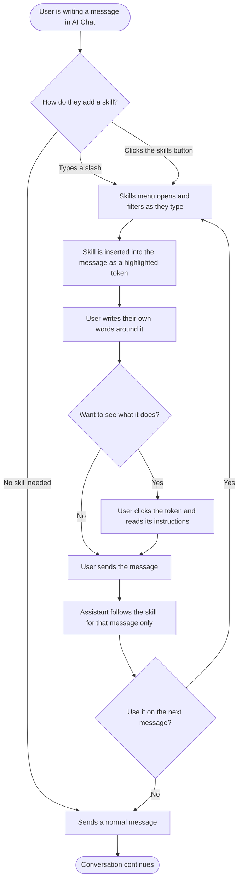
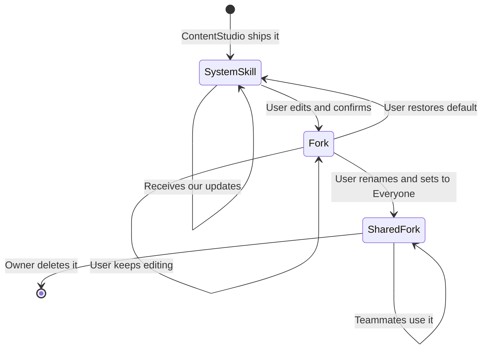

# 02 — Workflow: Skills in AI Chat

**Decisions locked from the research and PRD gates:**
- Custom prompts are **fully replaced** by Skills. Existing user custom prompts auto-migrate to personal skills (same name, same instructions, empty description). The seeded default-prompts list is **removed**.
- Per-user enable/disable only. No workspace-level admin hide.
- `posts_get(post_id)` and `analytics_post_metrics(post_id)` are **in scope**.
- The three inbox skills stay in the epic as its last phase. Inbox access itself is delivered separately.
- Import and export are **out of scope**.
- Skills is available on every plan tier. The Skills page lives in AI Studio only.

**Revised after review: a skill is part of the message, not a mode.**
The earlier design kept a skill attached above the chat box until the user removed it. That made it a mode, and modes are invisible right up until they surprise you. Every mature implementation, Claude and ChatGPT included, puts the slash command **into the text the user is writing**. So:
- Choosing a skill **inserts a highlighted token into the message itself**, wherever the cursor is.
- The user writes their own words around it. `Use /caption-polisher on this draft and keep it under 150 characters.`
- **The skill's scope is that message.** Sending it clears it. Using it again means inserting it again.
- **Clicking the token opens the skill's details**, so anyone can see what a skill actually does before or after they send.

---

## 1. Feature Placement

| Surface | Where | What it does |
|---|---|---|
| **Skills menu** | Inside the chat input, opened by typing `/` or by clicking the skills button | Fast recall. Filters skills by name and description, grouped System, Workspace and Mine. Choosing one inserts it into the message. |
| **Skills button** | The chat input toolbar, alongside the other tools, showing a slash icon | The visible way in, for people who never discover the `/` shortcut. Opens the same menu. |
| **Skill token** | Inline in the message text | A highlighted, clickable piece of the message showing the skill's slash command. |
| **Skill details modal** | Opened by clicking a skill token | Read-only view of the skill: its name, description and full instructions, so a user can see exactly what they are invoking. Offers Edit when they own it. |
| **Skills page** | AI Studio sidebar, a nav item directly under **AI Chat**, routed at `/:workspace/ai-studio/skills` | Full management: search, create, edit, fork, delete, enable/disable, set visibility. |

The mobile app gets a picker sheet and per message application rather than inline tokens, because its chat input is a plain text field with no rich text support. See section 6.

---

## 2. Workflow Diagram — Overview

---

## 3. User Flow — Happy Path

### 3.1 Using a skill in a message

1. The user is writing in the AI chat box and types `/`.
2. A menu opens above the input listing available skills, grouped **System**, **Workspace** and **Mine**, each row showing the slash command, the skill name and its one-line description.
3. The user keeps typing to filter. `/cap` narrows to `/caption-polisher`. Arrow keys move the selection, Enter or a click chooses it.
4. **The skill is inserted into the message as a highlighted token**, at the cursor. The message now reads `/caption-polisher `.
5. The user carries on typing around it, for example pasting a draft caption after it, or writing `Use /caption-polisher on this and keep it under 150 characters.`
6. The user sends. The assistant answers following that skill.
7. **The next message is a normal message.** The skill applied to the message it was written in and nothing further.
8. To use it again, the user inserts it again, either by typing `/` or from the skills button.

### 3.2 Finding a skill without knowing the shortcut

1. The user clicks the **skills button** in the chat input toolbar, marked with a slash icon and sitting with the other tools.
2. The same menu opens, unfiltered.
3. The user searches or scrolls, then chooses a skill.
4. The skill is inserted into the message at the cursor, exactly as if they had typed `/`.

### 3.3 Seeing what a skill actually does

1. The user hovers a skill token in their message and sees a tooltip explaining that this is a skill and that clicking shows what it does.
2. The user clicks the token.
3. A modal opens showing the skill's name, its description and its full instructions, rendered as formatted text.
4. If the user owns the skill, the modal offers **Edit**, which opens the skill editor.
5. The user closes the modal and their message is exactly as they left it.

This works on a token in a message already sent as well as one still being written, so a user can look back and see what produced an answer.

### 3.4 Creating a skill manually

1. The user opens **AI Studio → Skills** and clicks **New skill**.
2. The editor opens with fields for name, slash command, description, and instructions.
3. The slash command auto-derives from the name as the user types and stays editable.
4. The user writes instructions in markdown. A **Preview** toggle renders them as formatted text.
5. The user picks visibility, **Only me** or **Everyone**.
6. On save the skill appears under **Mine** or **Workspace** and is immediately available in the skills menu.

### 3.5 Creating a skill by talking to the assistant

1. In AI Chat the user inserts `/skill-creator` and describes the procedure they want, or asks the assistant to turn the current conversation into a reusable skill.
2. The assistant drafts a name, a description and a markdown instructions body.
3. **The draft opens in the skill editor rather than saving.** The user reviews, edits anything, sets visibility and saves.
4. If the user closes the editor without saving, nothing is created.

### 3.6 Editing a system skill — copy on write

1. The user opens a System skill and clicks **Edit**.
2. A notice explains that editing creates their own copy which stops receiving ContentStudio updates.
3. On confirm a fork is created, owned by the user, marked as based on a ContentStudio skill.
4. The original system skill remains in the list, untouched, and the fork takes precedence when the user types that slash command.
5. **Restore default** on the fork deletes it and returns the user to the original.
6. Setting a fork to **Everyone** requires renaming it first, so the workspace never ends up with several skills answering to the same slash command.

### 3.7 Enabling and disabling

1. On the Skills page each skill has a toggle.
2. Turning a skill off removes it from that user's skills menu but leaves it visible on the Skills page in an off state.
3. **The toggle is personal.** Turning off a Workspace or System skill never affects teammates.

---

## 4. Alternative Flows

### 4.1 When the menu opens, and when it does not

The menu opens when `/` is typed at the start of the input **or immediately after a space**. It does not open for a `/` typed inside a word, so a web address, a date or a fraction is never interrupted.

While the menu is open, **Enter chooses a skill instead of sending the message**. Escape closes the menu and leaves the typed `/` in place as ordinary text.

### 4.2 Editing around a token

- A token behaves as one unit. Backspace against it deletes the whole token rather than one character of it.
- Text can be typed before, after or around a token freely.
- Deleting a token leaves the rest of the message untouched, and the message sends as a normal message.

### 4.3 More than one skill in a message

Only one skill may be used per message. Two sets of instructions in one prompt produce incoherent output and there is no sane precedence between them.

If a skill is already in the message, choosing another **replaces the existing token in place** rather than adding a second, and a brief note explains that a message can use one skill at a time.

### 4.4 No skills match the filter

The menu shows a single row reading that nothing matches, with a **Create a skill** action that opens the editor pre-filled with what the user typed as the name.

### 4.5 Every skill is disabled

The menu shows an empty state explaining that all skills are turned off, with a link to the Skills page.

### 4.6 The skill in the message is deleted or disabled before sending

If the skill is removed while the message is still being written, the token is shown as unavailable on send, the message goes through as a plain message, and the user is told once.

### 4.7 Skill data is unavailable

Some skills depend on data the user has not connected. `/weekly-performance` with no analytics-capable account, or `/queue-snapshot` with nothing scheduled, must explain what is missing and what to connect. It must never invent numbers.

Two skills carry permanent coverage limits that belong in their instructions rather than in an error state:
- `/best-time-to-post` covers **Facebook and Instagram only**. Asked about another network, it says so.
- `/account-health` reports connection and cadence problems but **not publishing failure history**.

### 4.8 A skill fails partway

If a tool call fails mid-run, the assistant reports what it could not retrieve and returns whatever it did gather, rather than a bare error.

### 4.9 Validation

- Name is required, capped at 60 characters.
- Slash command is required, lowercase letters, numbers and hyphens only.
- Description is required for a **new** skill and for **any** skill set to Everyone, capped so list rows never truncate mid-word.
- Instructions are required and capped, with the remaining character count shown as the cap approaches.
- Migrated skills are the one exception: they arrive with an empty description and show a gentle prompt to add one. They are not blocked from use.

### 4.10 Renaming a skill's slash command

Changing the slash command warns that teammates using the old command will no longer find the skill.

---

## 5. Key Design Decisions

### D1 — A skill belongs to a message, not to a session

| Option | Trade-off |
|---|---|
| **A. The skill is inserted into the message text and applies to that message only (recommended, and the decision taken)** | Matches how Claude, ChatGPT and every other assistant handles slash commands. The user can see exactly which message used a skill, forever, by looking at the message. Nothing is hidden and nothing persists to surprise them. |
| B. A persistent chip above the input, cleared manually | Fewer keystrokes when running the same skill repeatedly, but it is a mode. Users forget it is on, then blame the assistant for behaving oddly. It also leaves no trace in the transcript of which message used what. |

**Decision: A.** The cost is real, since running the same skill five times means inserting it five times, and that is accepted.

### D2 — What happens to the migrated custom prompts that have no description

| Option | Trade-off |
|---|---|
| **A. Required for new and shared skills, optional for migrated ones (recommended)** | Migrated skills work immediately and show an "Add a description" hint. New and shared skills must have one. Keeps the quality bar without blocking anyone's existing prompts. |
| B. Required everywhere, force a fill-in on first use | Highest quality, worst first impression. A user's existing prompts become unusable until they do homework. |
| C. Optional everywhere | Simplest, but shared skills with blank descriptions are unusable for teammates and the menu degrades quickly. |

**Recommendation: A.**

### D3 — Slash command collisions

| Option | Trade-off |
|---|---|
| **A. Not globally unique. Precedence is mine, then workspace, then system. The menu shows an owner label where two rows share a command (recommended)** | Nobody is ever blocked from forking. The rule is one sentence and matches how users already think about overrides. |
| B. Globally unique per workspace | Predictable resolution, but the second person to fork `/hook-maker` is forced to invent a name they will not remember. |

**Recommendation: A**, combined with the rule that a fork must be renamed before it can be shared.

### D4 — How the skill reaches the assistant

| Option | Trade-off |
|---|---|
| **A. The skill instructions are injected as a dynamic block into every member agent, exactly as brand voice already is (recommended)** | Reuses a proven mechanism, no routing changes, and the skill applies whichever specialist the request lands on. |
| B. A skill declares which specialist it wants and pins routing | More precise for narrow skills, but a new field, new failure modes when the pin is wrong, and it fights the coordinator. **Defer.** |

**Recommendation: A.** The block must be placed at the end of the instruction list so prompt caching is not degraded.

### D5 — Skill instructions versus brand voice

**Decision:** brand voice wins on **tone and identity**, the skill wins on **method, structure and output shape**. This precedence is stated in the injected block itself and in the Skills page help text, so it is a product rule rather than a coin toss.

### D6 — What happens when we improve a system skill

**Decision: untouched system skills update silently, forked ones never do.**

- A user who has **never edited** a system skill is reading our record. We improve it, and they get the improvement on their next use with no notice and no action.
- A user who **has** edited it is reading their own fork, which is never touched.

There is no "an update is available" banner, no side-by-side comparison and no adopt-or-keep choice. The fork itself is the flag that says hands off. A version number is stored for support and audit only.

### D7 — Phasing the inbox skills

**Recommendation:** they stay in this epic as its final phase. The Skills platform, the migration and the backed skills ship first, and the inbox skills follow behind rather than being spun out and forgotten. Inbox access itself is delivered separately.

---

## 6. Integration with Existing Features

| Feature | Interaction |
|---|---|
| **Saved and custom prompts** | Fully replaced. Custom prompts migrate to personal skills. The seeded default prompt list is retired. The toolbar button that opened the prompts modal becomes the skills button. |
| **AI content library generate form** | Also opened the prompts modal. It has no chat input and no rich text, so it gets a skills modal where choosing a skill inserts that skill's instructions into the generation field. |
| **Image mentions in chat** | The chat input already has an `@` trigger for images. The `/` trigger sits beside it, and the two menus must never be open at once. |
| **Brand voice** | Complementary. Both can apply to the same message. Precedence per D5. |
| **AI Studio** | Gains a Skills nav item and a route, alongside AI Chat and the tool sections. |
| **Analytics** | Six skills read analytics. Coverage gaps must be stated inside the skills, not discovered by the user. |
| **Planner and publishing** | `/queue-snapshot`, `/content-plan` and `/prep-this-post` read scheduled posts. `/prep-this-post` needs the new full-post read. |
| **Workspaces** | Skills are workspace scoped. Switching workspace re-fetches the list. |
| **Social inbox** | Three skills depend on it. Phase 3. |
| **Mobile** | Picker sheet, per message application, enable and disable, rename and delete of own skills. No inline tokens, because the app has no rich text input. No instructions editor, forking or visibility. |

---

## 7. Trackable Actions — Usermaven candidates

| Event name | Trigger | Why we want it |
|---|---|---|
| `ai_skill_inserted` | A skill is inserted into a message from the menu | Adoption, and whether the typed shortcut or the button is doing the work |
| `ai_skill_message_sent` | A message containing a skill is sent | Real usage, as opposed to insert-and-delete. The core success metric |
| `ai_skill_details_viewed` | A user clicks a skill token to see what it does | Whether the transparency actually earns its build |
| `ai_skill_created` | A new skill is saved from the editor | Authoring adoption |
| `ai_skill_forked` | A user confirms editing a system skill | Which defaults do not fit as shipped |
| `ai_skill_deleted` | A skill is deleted | Churn within the library |
| `ai_skill_toggled` | A skill is enabled or disabled | Which defaults people turn off, which is how we prune the catalog |
| `ai_skill_visibility_changed` | Visibility is changed | Team sharing behaviour |

Payloads carry the skill's slash command, whether it is a system skill, and where the user came from. Exact names and payloads are specified in the PRD.

---

## 8. Scope Recommendation

### Phase 1 — Platform and migration
Data model, CRUD API with proper workspace authorization, the `/` trigger and the skills button, inline skill tokens, the skill details modal, the AI Studio Skills page, the skill editor, per-user enable and disable, visibility, copy-on-write forking, and the migration of existing custom prompts with retirement of the seeded defaults.

### Phase 2 — The catalog and two small tools, plus mobile
The sixteen default skills that have real backing data, including `/skill-creator`. Adds `posts_get(post_id)` and `analytics_post_metrics(post_id)`, which complete `/prep-this-post`, `/post-postmortem` and the full form of `/repurpose-this`. Mobile gets the picker sheet and light management.

### Phase 3 — Inbox
`/triage-inbox`, `/reply-to-this` and `/respond-to-review`, once the assistant has inbox access.

### Explicitly deferred
Auto-routing where the assistant picks a skill unprompted; per-skill activation modes; more than one skill per message; a skill pinning a specialist; skills on surfaces other than chat, though the data model carries the field from day one; writing skill instructions on mobile; workspace-level admin disable; importing and exporting skills; a shared skill library across workspaces; per-skill credit accounting.
