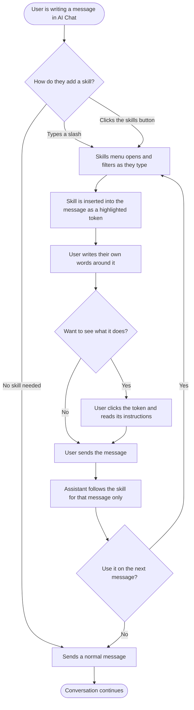

# PRD: Skills in AI Chat

**Author:** Product Team
**Last Updated:** 2026-09-07
**Status:** Draft
**Target Release:** Q4 2026

---

## 1. Overview

Skills are reusable, user-editable instruction sets that a user attaches to an AI chat message so the assistant performs a specific task the same way every time. A skill has a name, a slash command, a one-line description and a markdown instructions body. ContentStudio ships a curated catalog of default skills grounded in the user's own accounts, analytics and scheduled content. A user inserts one into the message they are writing, by typing a slash or clicking the skills button, and manages the whole library on a dedicated Skills page in AI Studio. They can create their own by filling in a form or by asking the assistant to build one, edit any skill including ours, share a skill with their workspace, and turn off the ones they do not use.

A skill lives inside the message it applies to. Choosing one inserts a highlighted token into the text, the user writes their own words around it, and the skill governs that message and nothing after it. Clicking the token shows the skill's full instructions, so what the assistant was told is never hidden.

Skills replaces the existing custom prompts feature entirely. Today, applying a saved prompt simply types text into the chat box for the user. A skill instead travels with the message as a first-class instruction the assistant follows, which is what makes a curated catalog possible at all.

---

## 2. Problem Statement

**What problem are we solving?**

AI chat output quality is almost entirely a function of prompt quality, and our users are paying that cost on every single message. A social media manager who wants a consistent weekly performance summary has to re-describe the format each time, and gets a slightly different answer each time. The workaround is a personal doc of copy-paste prompts, which is exactly what Sprout Social's own best-practice documentation instructs its customers to maintain — outside the product.

We already shipped a partial answer and it is not working. The custom prompts feature has three structural problems:

1. **A saved prompt is not a procedure, it is a paste.** The prompt body is inserted into the editor as user text and never reaches the assistant as an instruction. It cannot reference the user's data, cannot define an output shape, and cannot be improved by us after the fact.
2. **The seeded defaults are the wrong artifact.** Roughly 1,500 lines of bracket-placeholder templates across sixteen sections, none of which are grounded in ContentStudio data. They read as filler, not capability.
3. **There is no sharing.** Every custom prompt is implicitly private to its author, with no visibility field at all, so a team's best operator cannot pass their method to anyone.

There is a second, quieter problem: **most users do not know what our AI chat can do.** A blank text box communicates nothing. A slash menu of nineteen named, described capabilities is the fastest capability tour a chat interface can offer.

**Who has this problem?**

Every workspace using AI chat. It bites hardest for the two segments that matter most commercially: agencies running the same reporting and content motions across many client workspaces, and multi-seat teams where method consistency between operators is the entire value of having a shared tool.

**What happens if we don't solve it?**

Vista Social has already shipped this, with more than twenty built-in skills and slash-command invocation. They are marketing it as the reason their assistant produces expert output rather than generic output. No other competitor in our category has anything comparable, so the window to be second rather than fifth is open now. Meanwhile our own AI chat continues to under-deliver against its capability, because users cannot discover what it can do and cannot get consistent results from it when they do.

---

## 3. Goals & Success Metrics

| Goal | Metric | Target | How We'll Measure |
|---|---|---|---|
| Users actually use skills, not just see them | Share of AI chat messages sent with a skill in them | 25% of messages within 90 days of launch | `ai_skill_message_sent` against total chat sends |
| Skills reach beyond a curious minority | Workspaces that have sent at least one message containing a skill | 40% of AI-chat-active workspaces in 90 days | `ai_skill_message_sent` unique workspaces |
| Our defaults are good enough to use as shipped | Share of skill insertions that are system skills rather than user-authored | 70% or higher in the first 60 days | `ai_skill_inserted` payload `is_system` |
| Teams author and share their own methods | Workspaces with at least one skill set to Everyone | 15% of AI-chat-active workspaces in 90 days | `ai_skill_visibility_changed` |
| The catalog earns its slots | Every default skill used by at least 2% of active workspaces | No default below the floor at 90 days | `ai_skill_inserted` grouped by slash command |
| Guard rail: migration loses nothing | Users who had custom prompts and still use them as skills | 90% of pre-migration prompt users send a message using a migrated skill within 30 days | Migration cohort against `ai_skill_message_sent` |
| Guard rail: no chat latency regression | Median time to first token in AI chat | Within 5% of the pre-launch baseline | Existing chat latency monitoring |

### 3.1 Analytics Events (Usermaven)

No existing event covers any of these actions. A search of `contentstudio-frontend/src/` for `userMaven.track(` confirms there is no prompt or skill event today, so all events below are new.

| Event Name | Trigger | Payload | What we measure with it |
|---|---|---|---|
| `ai_skill_inserted` | FE. A skill is inserted into the message from the skills menu | `{ skill_slug, is_system, source }` where `source` is `slash` for the typed shortcut or `button` for the toolbar button | Adoption, and whether the shortcut or the button is doing the work |
| `ai_skill_message_sent` | FE. A chat message containing a skill is sent | `{ skill_slug, is_system }` | **The core success metric.** Real usage as opposed to insert-and-delete |
| `ai_skill_details_viewed` | FE. A user clicks a skill token to open its details | `{ skill_slug, is_system }` | Whether showing people what a skill does earns its build |
| `ai_skill_created` | FE. A new skill is saved from the editor for the first time | `{ skill_slug, is_private, authored_by }` where `authored_by` is `manual` or `assistant` | Authoring adoption, and which authoring path wins |
| `ai_skill_forked` | FE. A user confirms the copy-on-write dialog when editing a system skill | `{ skill_slug }` | Which of our defaults do not fit as shipped |
| `ai_skill_deleted` | FE. A skill is deleted from the Skills page | `{ skill_slug, is_fork }` | Churn inside the library |
| `ai_skill_toggled` | FE. A skill is enabled or disabled on the Skills page | `{ skill_slug, is_system, enabled }` | Which defaults people switch off, which is how we prune the catalog |
| `ai_skill_visibility_changed` | FE. Visibility is changed between Only me and Everyone | `{ skill_slug, is_private }` | Team sharing behaviour |

`skill_slug` is the slash command without the leading slash. No event carries the instructions body, the skill name as free text, or any user identifier beyond what Usermaven already attaches.

---

## 4. Target Users

**Primary Persona: the hands-on social media manager.**
Runs the day-to-day for one brand or a handful of accounts. Lives in the composer, the planner and the inbox. Uses AI chat but gets inconsistent results and has quietly stopped trusting it for anything that matters. Not technical, will never write anything resembling code, and will abandon a feature that asks them to. Wants the same good answer every Monday morning without re-explaining what a good answer looks like.

**Secondary Persona: the agency lead or team owner.**
Runs several client workspaces or a team of operators. Cares that everyone produces work to the same standard, and is the person who will author a skill and share it. This persona is why visibility exists at all. They are also the person most likely to fork one of our defaults so it matches their house style.

**Non-Users, explicitly out of scope:**
- **Mobile users writing skills.** Composing instructions is a keyboard task and the app has no voice input. Mobile users can pick and use a skill, turn skills on and off, and rename or delete their own, but not write the instructions, fork or share.
- **API and CLI consumers.** The public CLI and MCP agent-skills work is a separate concept for external agents. It shares the word and nothing else.
- **Developers wanting scripted or programmatic skills.** Instructions are plain markdown. No code, no variables, no conditionals.
- **Users wanting the assistant to pick a skill for them.** v1 is explicit selection only.
- **Users wanting to chain several skills in one message.** One skill per message.

---

## 5. User Stories / Jobs to Be Done

| ID | As a... | I want to... | So that... | Priority |
|---|---|---|---|---|
| US-1 | Social media manager | pick a skill by typing `/` in the chat box | I can find a capability without leaving what I was typing | Must Have |
| US-1b | Social media manager | find skills from a button in the chat toolbar | I can discover them without knowing the `/` shortcut exists | Must Have |
| US-2 | Social media manager | write my own words around the skill in the same message | I can tell the assistant what to apply it to and add my own constraints | Must Have |
| US-3 | Social media manager | click a skill in a message and see exactly what it tells the assistant | I can trust a skill before I use it, and understand an answer after | Must Have |
| US-4 | Social media manager | see at a glance which of my messages used a skill | I can tell what produced which answer when I scroll back | Must Have |
| US-5 | Social media manager | get useful skills on day one without writing any | the feature is valuable before I invest anything in it | Must Have |
| US-6 | Social media manager | write my own skill in plain language | I can capture a method I repeat constantly | Must Have |
| US-7 | Social media manager | ask the assistant to turn what we just did into a skill | I do not have to start from a blank text box | Must Have |
| US-8 | Social media manager | edit one of ContentStudio's skills to match how I work | the default is a starting point rather than a wall | Must Have |
| US-9 | Social media manager | get back the original after editing one of ContentStudio's skills | experimenting is safe | Must Have |
| US-10 | Agency lead | share a skill with everyone in the workspace | my team produces work to the same standard | Must Have |
| US-11 | Social media manager | turn off skills I never use | my slash menu stays short and usable | Must Have |
| US-12 | Social media manager | keep using the custom prompts I already wrote | upgrading costs me nothing | Must Have |
| US-14 | Social media manager | search my skills by name | I can find one when the library grows | Should Have |
| US-15 | Social media manager | preview a skill's instructions before I use it | I can trust a skill a teammate wrote | Should Have |
| US-16 | Team owner | see who last edited a shared skill | I know who changed the method | Nice to Have |

---

## 6. Requirements

### 6.1 Must Have (P0)

**Choosing and using a skill**
- Typing `/` at the start of the chat input or immediately after a space opens a skills menu above the input.
- A `/` typed inside a word does not open the menu, so web addresses, dates and fractions are never interrupted.
- The menu filters as the user types, matching on both name and description, and is fully keyboard navigable.
- The menu groups skills under System, Workspace and Mine, each row showing the slash command, name and description.
- A skills button in the chat input toolbar, marked with a slash icon, opens the same menu unfiltered.
- Choosing a skill inserts it into the message at the cursor as a highlighted token.
- The user can type their own text before, after and around the token.
- A token behaves as a single unit when editing, and deleting it leaves the rest of the message intact.
- Exactly one skill may be used per message. Choosing another replaces the token already in the message.
- **The skill applies to the message it is written in and to nothing after it.** Sending clears it.
- Clicking a token opens a read-only view of the skill: its name, description and full instructions.
- Hovering a token explains that it is a skill and that clicking shows what it does.
- The details view works on tokens in already-sent messages as well as in the message being written.
- The details view offers Edit when the user owns the skill.

**The catalog**
- ContentStudio ships a curated set of default system skills, enabled for every user by default.
- Default skills are grounded in the user's own workspace data where the data is reachable, and state their coverage limits in their own instructions where it is not.
- The default catalog is seeded idempotently. Re-running the seed never duplicates a skill.

**Managing**
- A Skills page in the AI Studio sidebar lists every skill available to the user with search and the same three groups.
- Each skill can be enabled or disabled. The setting is per-user and never affects teammates.
- A user can create a skill with a name, slash command, description and markdown instructions, and choose visibility of Only me or Everyone.
- The slash command auto-derives from the name and remains editable.
- The instructions field offers a preview that renders the markdown as formatted text.
- A user can edit and delete any skill they own.
- Editing a system skill creates a copy owned by the user, after a confirmation that explains what will happen. The original is untouched.
- A fork offers Restore default, which deletes the fork and returns the user to the original.
- A fork must be renamed before it can be set to Everyone.
- Skills belong to a workspace. Switching workspace re-fetches the list, and any skill token left in an unsent message is cleared.

**Authoring with the assistant**
- A `/skill-creator` skill lets a user describe a procedure, or ask that the current conversation be captured as a reusable skill.
- The assistant's draft opens in the skill editor for review. Nothing is ever saved without the user confirming.

**Replacing custom prompts**
- Existing user custom prompts migrate to personal skills, carrying the same name and the same instructions, with an empty description and Only me visibility.
- The seeded default prompts are retired and no longer shown anywhere.
- Every surface that opened the saved-prompts modal opens the skills modal instead, including the AI content library generate form.
- Migrated skills are usable immediately despite an empty description, and show a prompt to add one.

**Correctness and safety**
- Skills endpoints verify that the requesting user is a member of the workspace.
- A skill's instructions are length-capped and pass through the existing safety layer before reaching the assistant.
- A skill that lacks the data it needs explains what is missing rather than inventing an answer.

**Precedence**
- Brand voice governs tone and identity. A skill governs method, structure and output shape. A skill cannot override brand tone.

### 6.2 Should Have (P1)

- A created skill whose slash command already exists is saved with a numeric suffix and the user is told.
- Skill rows show who last edited a shared skill and when.
- The picker shows an owner label where two skills share a slash command.
- Empty states for no matching skills, no skills enabled, and an empty library.
- New agent tools `posts_get(post_id)` and `analytics_post_metrics(post_id)`, which complete `/prep-this-post`, `/post-postmortem` and the full form of `/repurpose-this`.

### 6.3 Nice to Have (P2)

- Sort the Skills page by most recently used.
- A usage count on each skill row.
- Duplicate an existing skill as a starting point for a new one.
- An archive state distinct from delete.

### 6.4 Explicitly Out of Scope

- **Auto-routing.** The assistant never picks a skill unprompted in v1. Explicit selection only.
- **More than one skill per message.** Two instruction sets in one prompt have no sane precedence between them.
- **A skill that stays active across messages.** A skill belongs to the message it is written in.
- **Per-skill activation modes.** No always-on skills, no glob or context matching.
- **A skill pinning a specialist agent.** The skill instructions reach every specialist equally.
- **Skills on surfaces other than chat.** The data model carries a surface field from day one, but composer, inbox and analytics are not consumers in v1.
- **Writing skills on mobile, and inline skill tokens on mobile.** The app's chat input is a plain text field with no rich text support, so it gets a picker sheet that applies a skill to the next message instead of an inline token. It also gets per user enable and disable, and rename and delete of the user's own skills. The instructions editor, forking and visibility stay on web.
- **Workspace-level admin disable.** Enable and disable is per-user only.
- **Import and export of skills.** A skill lives in the workspace it was created in. Moving one between workspaces is not supported.
- **A shared library across workspaces or a public marketplace.** Sharing stops at the workspace boundary.
- **Per-skill credit accounting.** Skills consume credits exactly as chat does today.
- **Variables, placeholders or conditional logic** inside instructions.
- **Skill run history or activity logs.**
- **Closing the pre-existing authorization gap on the legacy prompt endpoints.** Skills endpoints are built correctly; the old endpoints are not in scope.

---

## 7. User Flow (High Level)

1. The user is writing in the AI chat box and types `/`, or clicks the skills button in the toolbar.
2. The skills menu opens above the input, grouped and filterable.
3. The user types a few characters, arrows to the skill they want and presses Enter.
4. The skill is inserted into the message as a highlighted token at the cursor.
5. The user writes their own words around it, for example pasting a draft after it or adding a constraint.
6. If they want to check what it does, they click the token and read its instructions.
7. The user sends. The assistant responds following that skill.
8. The next message is a normal message. To use the skill again, the user inserts it again.

`02-workflow.md` also carries a state diagram covering the copy-on-write lifecycle of a system skill.

---

## 8. Business Rules & Constraints

| Rule ID | Rule | Rationale |
|---|---|---|
| BR-1 | Exactly one skill may be used per message. Choosing another replaces the token already in the message | Two instruction sets in one prompt produce incoherent output and there is no sane precedence between them |
| BR-2 | A skill applies to the message it is written in and to nothing after it. Sending clears it | A skill that stays on is a mode, and a mode is invisible until it surprises someone. Keeping the skill inside the message also leaves a permanent record of which message used what |
| BR-3 | The skills menu opens when `/` is typed at the start of the input or immediately after a space, never inside a word | A user typing a web address, a date or a fraction must never be interrupted by a menu |
| BR-4 | While the menu is open, Enter chooses a skill and does not send the message | Otherwise the message fires mid-selection |
| BR-4b | A skill token behaves as a single unit when editing. Backspace against it removes the whole token | Half a token is not a thing, and leaving a fragment of a command in the text would silently change what the user sends |
| BR-4c | Any skill token can be clicked to see the skill's name, description and full instructions, including in messages already sent | A user should never have to guess what the assistant was told, either before sending or when reading back an answer |
| BR-5 | Editing a system skill always creates a user-owned copy. System skills are never modified in place by a user | It is the only way we can keep improving the defaults after launch |
| BR-6 | A user who has not forked a system skill silently receives our updates to it. A fork is never updated by us | The fork is the user's declaration that they want their version. No prompts, no banners, no adopt-or-keep choice |
| BR-7 | A fork must be renamed before it can be set to Everyone | Otherwise several skills in one workspace answer to the same slash command |
| BR-8 | Slash commands are not globally unique. Resolution order is the user's own skill, then a workspace skill, then a system skill | Nobody is ever blocked from forking, and the rule matches how users already think about overrides |
| BR-9 | Enable and disable is per-user. It never affects another member of the workspace | One person tidying their menu must not remove a capability from the team |
| BR-10 | Brand voice governs tone and identity. A skill governs method, structure and output shape | Both inject instructions and they can disagree. A shared skill must not be able to take a whole team off-brand |
| BR-11 | Description is required for a new skill and for any skill set to Everyone. Migrated skills may have an empty one | Description is what makes the picker usable, but migration must not make anyone's existing prompt unusable |
| BR-12 | A skill's instructions are length-capped and pass the existing safety layer before reaching the assistant | A shared skill lets one member write text that lands in a teammate's assistant instructions |
| BR-13 | Skills are workspace-scoped. Switching workspace re-fetches the list and clears any skill token left in an unsent message | A skill referencing one workspace's accounts is meaningless in another |
| BR-14 | A skill whose data is unavailable explains what is missing and never fabricates figures | A confidently wrong analytics answer is worse than no answer |
| BR-15 | `/best-time-to-post` covers Facebook and Instagram only, and says so when asked about another network | The underlying data genuinely does not exist for other platforms |
| BR-16 | Every skills endpoint verifies workspace membership | The legacy prompt endpoints do not, and that gap must not be inherited |
| BR-17 | Deleting a skill that a teammate has already written into an unsent message takes effect on their next send, with a notice | A shared skill can disappear underneath someone mid-message |

---

## 9. Open Questions

| Question | Options | Owner | Due Date | Decision |
|---|---|---|---|---|
| Is Skills gated by plan, or available on every tier? | All tiers / paid only / a per-tier cap on custom skills | Product | Before Phase 1 build | **Decided: all tiers.** Skills is the discovery surface for AI chat, which is already paid for. Gating it undercuts the feature it exists to expose |
| What is the cap on custom skills per workspace, if any? | None / a soft cap with a warning / a hard cap | Product | Before Phase 1 build | Pending |
| What exactly is the instructions length cap? | 8 KB / 16 KB / other | Engineering | Before Phase 1 build | Pending |
| Do we rename the CLI and MCP agent-skills work to avoid the collision with this feature? | Rename that / rename this / accept the collision and separate them by context | Product | Before launch messaging | Pending |
| Does a skill that fans out to several tool calls need its own credit treatment? | Absorb it / meter it / cap tool calls per skill run | Product and Engineering | Before Phase 2 | Pending |
| Should the Skills page be reachable outside AI Studio, for instance from settings? | AI Studio only / also settings | Product | Before Phase 1 build | **Decided: AI Studio only.** One home, next to AI Chat where the feature is used. Skills are a working tool, not a configuration screen |

---

## 10. Risks & Mitigations

| Risk | Likelihood | Impact | Mitigation |
|---|---|---|---|
| Users cannot tell whether brand voice, a skill, or neither is driving the output. This is the single most-documented complaint about the equivalent feature in ChatGPT | High | High | State the precedence rule as product copy in the Skills page and the editor. Putting the skill inside the message removes most of this risk on its own, since the user can see in the transcript exactly which message used which skill, and click it to read what it said. Retire custom prompts rather than running a third overlapping primitive |
| A default skill answers confidently with data it cannot actually reach, for instance best times for LinkedIn | Medium | High | Every default skill was audited against the real toolkit inventory before being written. Coverage limits are written into the skill instructions themselves. Skills with no backing data at all are held to a later phase rather than shipped degraded |
| The library becomes unusable as it grows. Roughly 94% of custom GPTs were never published, and prompt libraries fail on findability rather than on creation | Medium | Medium | Cap the shipped catalog at nineteen. Search and grouping from day one. Per-user disable so people can prune their own menu. Usage counts tell us which defaults to retire |
| Migration loses someone's prompts, or the retired defaults are missed | Medium | High | Migrate custom prompts one-to-one with the same name and instructions. Do not delete the source collection. Track the migration cohort as an explicit guard-rail metric |
| A shared skill becomes a prompt-injection vector into every teammate's assistant | Low | High | Length cap, existing safety layer on the instructions, and description required before a skill can be shared so shared skills are at least deliberate |
| The skill instruction block degrades prompt caching and slows every chat turn | Medium | Medium | Append the block at the end of the instruction list where the brand voice block already sits. Median time to first token is an explicit guard-rail metric |
| The slash extension breaks the send key, so Enter fires a message while the menu is open | Medium | Medium | The existing mention extension already guards this interlock. The new extension must be added to the same check, and it needs an explicit test |
| Users expect a skill to stay on and are annoyed at re-inserting it for every message in a run | Medium | Low | This is the accepted cost of removing the mode. Insertion is two keystrokes and the most recently used skills sort to the top of the menu. Watch for it in the ratio of skill messages to total messages per session |
| Users edit a default, it stops matching our improvements, and quietly rots | Medium | Low | This is the accepted cost of forking. Restore default is always available, and usage counts surface defaults that everyone forks, which tells us the default is wrong |
| Vista Social extends their lead while we build | Medium | Medium | Phase 1 and 2 deliver the full user-facing feature. The inbox trio is the only piece behind their catalog and it follows immediately |

---

## 11. Dependencies

**Internal**
- The AI chat input and its TipTap editor, which gains a second trigger extension alongside the existing mention handling.
- The chat payload contract between the web app, the backend and the agent service, which gains one identifier.
- The agent service's dynamic instruction substitution, the same mechanism brand voice already uses.
- The existing agent toolkits, which back fifteen of the eighteen data-dependent default skills. The nineteenth, the skill creator, needs no data of its own.
- The existing safety layer in the agent service for the instructions body.
- AI Studio's shell and sidebar, which gain a nav item and a route.
- The composer template visibility pattern, reused for Only me and Everyone.
- Brand knowledge and brand voice, which several default skills lean on.

**External**
- None. No third-party API, no platform capability and no vendor dependency. Platform coverage limits inside individual skills come from data we already hold or do not hold.

**Blockers**
- The instructions length cap and the plan-gating decision are needed before Phase 1 build starts, both listed in section 9.
- Phase 3 is blocked on a new inbox toolkit and a specialist agent to carry it, which is scoped inside this epic rather than assumed.

---

## 12. Appendix

- **Research and competitive analysis:** `01-research.md` in this folder, covering ten social media management tools and eleven adjacent AI products, plus the full codebase analysis and the toolkit audit of all eighteen data-dependent default skills.
- **Workflow and diagrams:** `02-workflow.md` in this folder.
- **Default skill definitions:** the companion dev-reference doc in this folder, carrying the full title, description and instructions body for every default skill.
- **Designs:** to be produced against the design story in this epic.
- **Related work:** the public CLI and MCP agent-skills effort, which shares the word and nothing else, and the AI surfaces architecture effort, which is why the data model carries a surface field in v1.

---

## Changelog

| Date | Author | Changes |
|---|---|---|
| 2026-09-07 | Product Team | Initial draft from approved research and workflow |
