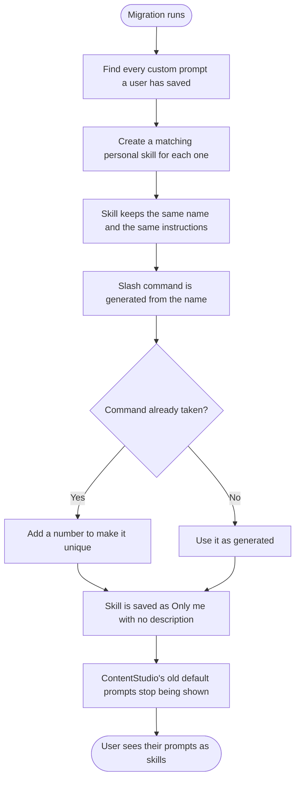
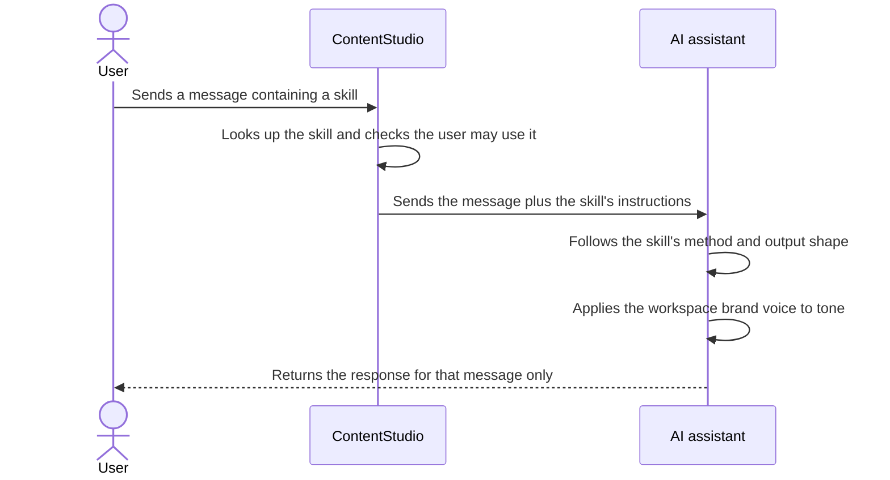
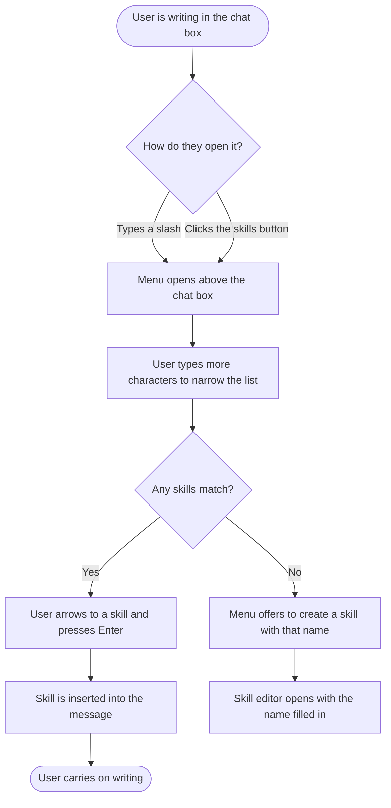
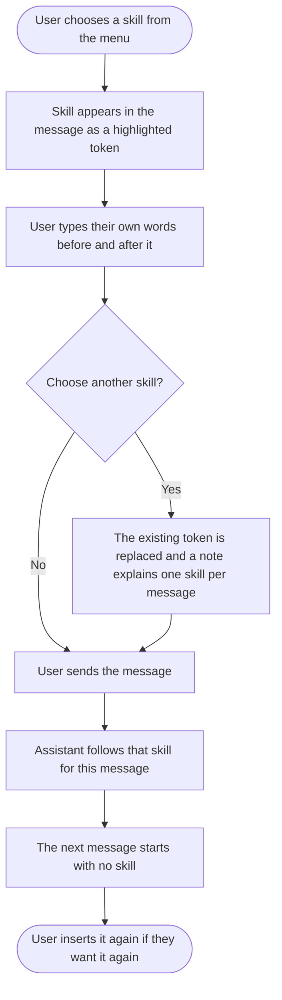
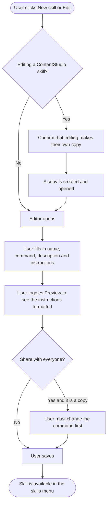
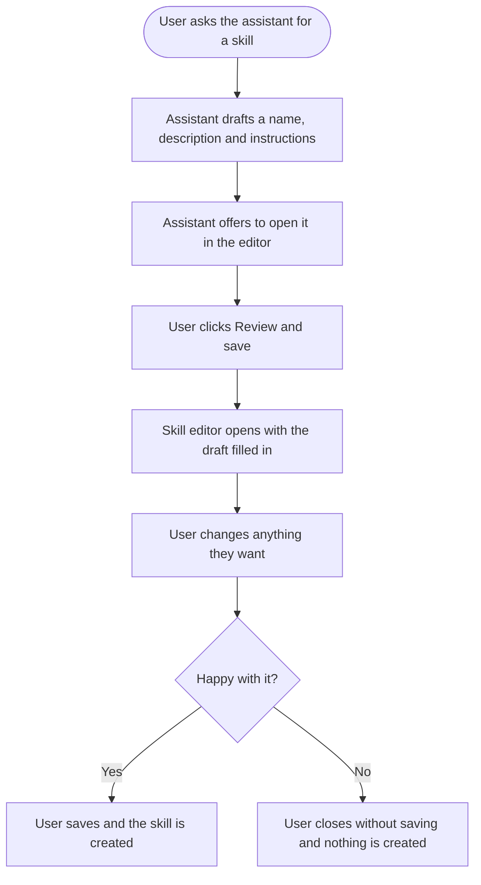
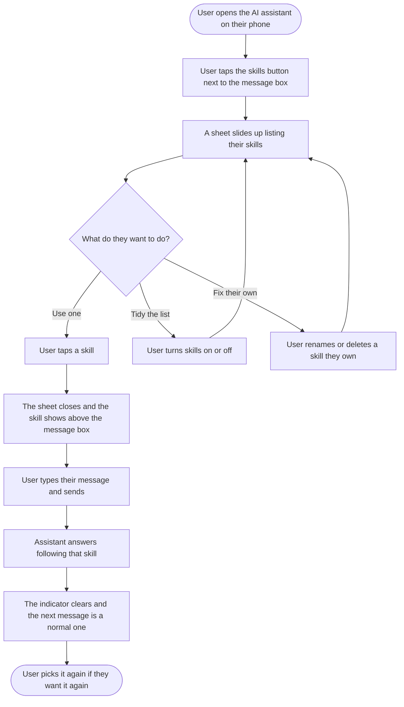

# Epic: Skills in AI Chat

## Epic description

Skills are reusable, user-editable instruction sets that a user attaches to an AI chat message so the assistant performs a specific task the same way every time. A skill has a name, a slash command, a one-line description and a markdown instructions body. ContentStudio ships a curated catalog of default skills grounded in the user's own accounts, analytics and scheduled content. A user inserts one into the message they are writing, by typing a slash or clicking the skills button, and manages the whole library on a dedicated Skills page in AI Studio.

A skill lives inside the message it applies to. Choosing one inserts a highlighted token into the text, the user writes their own words around it, and the skill governs that message and nothing after it. Clicking the token opens the skill's full instructions, so what the assistant was told is never a black box, either before sending or when reading back an answer weeks later.

Users can create their own skills by filling in a form or by asking the assistant to build one from the conversation they just had. They can edit any skill including ContentStudio's own, which creates their own copy and leaves the original intact. They can share a skill with everyone in the workspace, and they can turn off the ones they never use without affecting anyone else.

Skills replaces the existing custom prompts feature entirely. Today, applying a saved prompt simply types text into the chat box on the user's behalf, so it can never reference the user's data or define an output shape. A skill instead travels with the message as a first-class instruction the assistant follows, which is what makes a curated, data-grounded catalog possible at all. Existing custom prompts migrate to personal skills and the old seeded prompt list is retired.

## Sequencing

The epic ships in three phases.

**Phase 1, platform and migration.** Data model, API, the skills menu and toolbar button, inline skill tokens, the skill details modal, the Skills page, the editor, forking, plus migration off custom prompts.

**Phase 2, the catalog and two supporting tools.** Sixteen default skills, being the fifteen with real backing data plus the skill creator, alongside a post detail read and a post performance read that complete three of them.

**Phase 3, inbox.** The three inbox skills. These depend on the assistant having access to the social inbox, which is being delivered separately outside this epic.

## A note on mobile

The mobile app gets skills, minus the writing. A user can pick a skill, use it, turn skills on and off, and rename or delete the ones they own. Writing the instructions, forking and sharing with the workspace stay on web, because composing a few hundred words of structured instructions is a keyboard task and the app has no voice input to work around that.

Two constraints shape the mobile story. The app's chat input is a plain text field with no slash command support, so the picker opens from a button rather than by typing a slash. And the app has no saved prompts and no brand voice today, so skills is the first library of its kind on mobile rather than a replacement for something users already know.

---

## Story list

**Phase 1**
1. [Design] Design the Skills experience across web and mobile
2. [BE] Create the skills data model and CRUD API
3. [BE] Migrate custom prompts to skills and retire the default prompt list
4. [BE] Seed the ContentStudio default skill catalog
5. [BE] Apply the skill in a message to the assistant's response
6. [FE] Add the skills menu to the AI chat input
7. [FE] Insert skills as inline tokens in the chat message
8. [FE] Show a skill's details when a token is clicked
9. [FE] Replace saved prompts with skills in the AI content library
10. [FE] Build the Skills page in AI Studio
11. [FE] Build the skill editor with preview, visibility and forking
12. [FE] Let the assistant draft a skill into the skill editor

**Phase 2**
13. [BE] Add post detail and post performance reads for the assistant
14. [Flutter] Use and manage skills in the mobile AI assistant

**Phase 3**
15. [BE] Add the inbox skills to the default catalog

---

# Phase 1

## [Design] Design the Skills experience across web and mobile

### Description:

As a designer, I want to define the complete visual and interaction design for Skills across AI chat, AI Studio and the mobile app, so that every build story in this epic has a single agreed reference and Skills feels like part of ContentStudio rather than a bolted-on panel.

Skills touches five web surfaces that must feel like one feature: a menu that opens inside the chat input, a highlighted token that sits inside the message text, a modal showing what a skill actually does, a modal for the AI content library which has no chat box, and a full management page with an editor. It also touches two mobile surfaces: a picker sheet and a per message skill indicator.

### Workflow:

1. Designer reviews the five web surfaces plus the two mobile ones, and the states each needs.
2. Designer produces the skills menu, including its grouped list, its filtered state, its keyboard focus treatment and its empty state, plus the skills button that sits in the chat toolbar.
3. Designer produces the inline skill token as it appears inside message text, both while being written and in a sent message, alongside the image mentions the chat box already renders.
4. Designer produces the skill details modal, the AI content library skills modal, the Skills page, and the skill editor including its markdown preview.
5. Designer produces the copy on write confirmation, the restore default confirmation, and the delete confirmation.
6. Designer produces empty, loading and error states for every list.
7. Designer confirms which pieces can be built from existing library components and which need new ones.

### Acceptance criteria:

- [ ] Skills menu is designed with grouped sections for System, Workspace and Mine, each row showing slash command, skill name and description
- [ ] Skills menu filtered, keyboard focused, and no results states are designed
- [ ] The skills button is designed in the chat input toolbar alongside the existing tools, using a slash icon
- [ ] The inline skill token is designed as it appears inside message text, with a background highlight that reads as clickable without competing with the message itself
- [ ] The token is designed for both an unsent message and a sent one, and shown wrapping across lines in a long message
- [ ] The token is designed sitting alongside an image mention in the same message, so the two do not read as the same thing
- [ ] Skill details modal is designed showing name, slash command, description, formatted instructions, ownership information and its edit and close actions
- [ ] The AI content library skills modal is designed with a search field, the three groups and a link through to the Skills page
- [ ] Skills page is designed with search, grouping, per row enable toggle, a system tag, and row actions for edit, duplicate and delete
- [ ] Skill editor is designed with fields for name, slash command, description, instructions and visibility, plus a preview toggle for the instructions
- [ ] Character counters are designed for the description and instructions fields
- [ ] Copy on write confirmation, restore default confirmation and delete confirmation dialogs are designed
- [ ] Empty, loading and error states are designed for the menu, both modals and the Skills page
- [ ] Design specifies which existing library components each element uses
- [ ] Design covers the responsive behaviour of the Skills page and both modals down to tablet width
- [ ] Mobile app picker sheet is designed, including its grouped list, search field, per row toggle, loading, error and empty states
- [ ] Mobile rename and delete actions are designed, including how they are reached from a row and which rows do not offer them
- [ ] Mobile per message skill indicator is designed, sized to stay readable on a small phone, and clearly showing that it applies to the next message only
- [ ] Designs use theme aware primary colours so white label workspaces render correctly, with no hardcoded colour values

### Mock-ups:

This story produces them. See PRD section 7 for the flow the designs must support.

### Impact on existing data:

None.

### Impact on other products:

The saved prompts modal is being replaced, so its current design is retired. Mobile needs its own designs for the picker sheet and the per message skill indicator, covered in **[Flutter] Use and manage skills in the mobile AI assistant**.

### Dependencies:

None. This story blocks every frontend story in this epic.

### Global quality & compliance (wherever applicable)

- [ ] Mobile responsiveness (frontend only, N/A for backend-only stories)
- [ ] Multilingual support (frontend + backend, translations available or fallback handled)
- [ ] UI theming support (default + white-label, design library components are being used)
- [ ] White-label domains impact review
- [ ] Cross-product impact assessment (web, mobile apps, Chrome extension)

---

## [BE] Create the skills data model and CRUD API

### Description:

As a developer building the Skills feature, I want a workspace scoped API for creating, reading, updating, deleting, enabling and forking skills, so that the frontend has a single correct place to manage a user's skill library.

### Workflow:

This is a backend story with no direct user-facing flow. The API supports the flows described in the frontend stories in this epic.

### Acceptance criteria:

- [ ] A skill record stores a name, a slash command, a description, a markdown instructions body, a category, a visibility flag, a system flag, a reference to the skill it was forked from, a version number, a surface list, the owning user and workspace, and who last updated it and when
- [ ] The surface list is stored on every skill and defaults to chat, so future surfaces can consume skills without a data migration
- [ ] Listing skills for a workspace returns system skills, workspace skills shared by any member, and the requesting user's own private skills
- [ ] A user can create a skill with a name, slash command, description, instructions and visibility
- [ ] A user can update or delete a skill they own
- [ ] A user cannot update or delete a skill owned by another user, and cannot update a system skill directly
- [ ] Forking a system or workspace skill creates a new skill owned by the requesting user, carrying the source content and a reference back to the source
- [ ] Deleting a fork is what restores the original, and the original is returned in listings again afterwards
- [ ] A fork cannot be set to shared visibility while its slash command still matches its source, and the request is rejected with a clear reason
- [ ] Enabling and disabling a skill is stored per user per workspace, and never changes what another user sees
- [ ] A system skill can be disabled by a user even though the user does not own it
- [ ] Every endpoint verifies that the requesting user is a member of the workspace, and rejects the request otherwise
- [ ] Name is required and limited to 60 characters
- [ ] Slash command is required, accepts lowercase letters, numbers and hyphens only, and is rejected otherwise
- [ ] Description is required when creating a skill and when setting any skill to shared visibility, and is limited to 200 characters
- [ ] Instructions are required and limited to the agreed maximum size, and the request is rejected with a clear reason when exceeded
- [ ] A skill created with a slash command that already exists for that user is saved with a numeric suffix, and the response states the command that was actually used
- [ ] Resolving a slash command returns the user's own skill first, then a workspace skill, then a system skill
- [ ] Listing skills is available to every plan tier

### Mock-ups:

N/A, backend only.

### Impact on existing data:

Adds new collections for skills and for per user enable state. Does not modify or delete the existing custom prompt records, which are handled by **[BE] Migrate custom prompts to skills and retire the default prompt list**.

### Impact on other products:

None directly. The public API and the mobile app are unaffected by this story.

### Dependencies:

None.

### Global quality & compliance (wherever applicable)

- [ ] Mobile responsiveness — N/A, backend only
- [ ] Multilingual support (frontend + backend, translations available or fallback handled)
- [ ] UI theming support — N/A, backend only
- [ ] White-label domains impact review
- [ ] Cross-product impact assessment (web, mobile apps, Chrome extension)

---

## [BE] Migrate custom prompts to skills and retire the default prompt list

### Description:

As a user who has already written custom prompts for AI chat, I want them to become skills automatically, so that upgrading to Skills costs me nothing and I do not lose work I have already done.

### Workflow:

1. A user who previously saved custom prompts opens AI chat after the release.
2. Their saved prompts now appear as personal skills, under Mine, with the same names they gave them.
3. Opening one shows the same instructions text they originally wrote.
4. Each one has a slash command generated from its name, so they can type it directly.
5. Each one has an empty description and shows a prompt inviting them to add one.
6. ContentStudio's old list of default prompts is no longer shown anywhere.

### Acceptance criteria:

- [ ] Every custom prompt a user saved becomes a personal skill carrying the same name and the same instructions text
- [ ] Migrated skills are private to the user who owned the original prompt, in the same workspace
- [ ] Migrated skills have an empty description and remain fully usable despite it
- [ ] A slash command is generated for every migrated skill from its name, lowercased with spaces replaced by hyphens and unsupported characters removed
- [ ] A generated slash command that collides with another of that user's skills is made unique with a numeric suffix
- [ ] A migrated skill whose name exceeds the name limit is truncated rather than skipped
- [ ] ContentStudio's previously seeded default prompts are no longer returned to any surface
- [ ] The original custom prompt records are left in place and are not deleted by the migration
- [ ] Running the migration a second time does not create duplicate skills
- [ ] A user who had no custom prompts sees only the ContentStudio default skills, with no empty Mine group errors

### Mock-ups:

N/A, backend only. The prompt to add a description is specified in **[FE] Build the Skills page in AI Studio**.

### Impact on existing data:

Reads every existing custom prompt record and writes a matching skill. The source records are retained so the migration is reversible. ContentStudio's seeded default prompt records stop being served, and no surface reads them after this story.

### Impact on other products:

The AI content library generate form currently offers the same prompt list as AI chat. After this story it must show skills instead, which is covered by **[FE] Replace saved prompts with skills in the AI content library**. Those two stories must ship together so that surface is never left showing a retired list.

### Dependencies:

Depends on **[BE] Create the skills data model and CRUD API**.

### Global quality & compliance (wherever applicable)

- [ ] Mobile responsiveness — N/A, backend only
- [ ] Multilingual support (frontend + backend, translations available or fallback handled)
- [ ] UI theming support — N/A, backend only
- [ ] White-label domains impact review
- [ ] Cross-product impact assessment (web, mobile apps, Chrome extension)

---

## [BE] Seed the ContentStudio default skill catalog

### Description:

As a user opening Skills for the first time, I want a set of ready made skills that already understand my accounts and my data, so that the feature is useful to me before I have written anything myself.

The catalog content, including the exact name, description and instructions for every default skill, is supplied separately as a dev reference document alongside this epic.

### Workflow:

1. A user opens AI chat and types a slash for the first time.
2. They see ContentStudio's default skills grouped under System, each with a name and a plain English description of what it does.
3. They pick one and use it immediately, with no setup.

### Acceptance criteria:

- [ ] The default skills are available to every workspace and every plan tier
- [ ] Every default skill is marked as a system skill and is enabled for every user by default
- [ ] Every default skill carries a name, a slash command, a description within the description limit, and a markdown instructions body
- [ ] Default skills are owned by ContentStudio rather than by any user, and cannot be edited or deleted directly by a user
- [ ] Running the seed again updates the existing default skills in place rather than creating duplicates
- [ ] Updating a default skill through the seed changes what users see, except for users who have forked that skill, whose copies are untouched
- [ ] A default skill that depends on data ContentStudio cannot retrieve for the user explains what is missing instead of producing an answer
- [ ] The best time to post skill states in its own response that its data covers Facebook and Instagram only, when asked about any other network
- [ ] The account health skill reports connection problems and posting gaps, and does not claim to report publishing failure history
- [ ] Each default skill's version is recorded so support can tell which revision a workspace is on

### Mock-ups:

N/A, backend only.

### Impact on existing data:

Creates the ContentStudio owned skill records. Does not touch user owned skills.

### Impact on other products:

None.

### Dependencies:

Depends on **[BE] Create the skills data model and CRUD API**. The three inbox skills are deliberately excluded here and are added by **[BE] Add the inbox skills to the default catalog**. Three skills in this catalog reach their full behaviour only once **[BE] Add post detail and post performance reads for the assistant** ships, and until then behave as described in that story.

### Global quality & compliance (wherever applicable)

- [ ] Mobile responsiveness — N/A, backend only
- [ ] Multilingual support (frontend + backend, translations available or fallback handled)
- [ ] UI theming support — N/A, backend only
- [ ] White-label domains impact review
- [ ] Cross-product impact assessment (web, mobile apps, Chrome extension)

---

## [BE] Apply the skill in a message to the assistant's response

### Description:

As a user who has written a skill into my message, I want the assistant to actually follow that skill's instructions for that message, so that I get the specific, consistent result the skill promises instead of a generic answer.

### Workflow:

1. The user sends a chat message containing a skill.
2. The assistant answers following that skill's method and output shape.
3. If the workspace also has a brand voice active, the response still sounds like the brand.
4. The user sends a follow up message with no skill in it, and the assistant answers as it normally would.

### Acceptance criteria:

- [ ] A message sent with a skill in it produces a response that follows that skill's instructions
- [ ] The skill applies to that message only, and has no effect on any later message
- [ ] A message sent with no skill behaves exactly as it does today
- [ ] The skill is validated as one the requesting user is allowed to use, and is ignored if not
- [ ] A disabled or deleted skill is ignored, and the message is answered as a normal chat message
- [ ] When a message carries both a skill and a brand voice, the brand voice governs tone and identity and the skill governs method, structure and output shape
- [ ] The skill's instructions are checked by the existing safety layer before reaching the assistant
- [ ] The skill's instructions are not returned to the user in the response
- [ ] The skill instructions are placed so that they do not degrade response caching, and median time to first token stays within five percent of the pre release baseline
- [ ] The skill applies regardless of which assistant capability handles the request, so a skill about scheduling is not lost when the request is handled as a content request
- [ ] A skill that asks for data the assistant cannot retrieve results in a response that says what is missing, and never in fabricated figures

### Mock-ups:

N/A, backend only.

### Impact on existing data:

None. The skill travels with the request and is not stored as conversation state.

### Impact on other products:

The chat request gains one optional value, carried per message. Web sends it first. The mobile app starts sending it in **[Flutter] Use and manage skills in the mobile AI assistant**, and until then continues to work exactly as it does today.

### Dependencies:

Depends on **[BE] Create the skills data model and CRUD API**.

### Global quality & compliance (wherever applicable)

- [ ] Mobile responsiveness — N/A, backend only
- [ ] Multilingual support (frontend + backend, translations available or fallback handled)
- [ ] UI theming support — N/A, backend only
- [ ] White-label domains impact review
- [ ] Cross-product impact assessment (web, mobile apps, Chrome extension)

---

## [FE] Add the skills menu to the AI chat input

### Description:

As a social media manager using AI chat, I want to bring up a list of skills while I am writing, either by typing a slash or by clicking a button, so that I can reach a capability without leaving what I was typing and without needing to know a shortcut exists.

### Workflow:

1. User is writing in the AI chat box and types a slash, at the start of the message or after a space.
2. A list opens directly above the chat box, grouped into ContentStudio skills, shared with workspace and my skills, each row showing the slash command, the skill name and a one line description.
3. User keeps typing. The list narrows to skills whose name or description matches.
4. User moves through the list with the arrow keys and presses Enter, or clicks a row.
5. The skill is inserted into the message and the menu closes.
6. Alternatively, the user clicks the skills button in the chat toolbar and gets the same list, unfiltered.

### Acceptance criteria:

- [ ] Typing a slash at the start of the chat box, or immediately after a space, opens the menu directly above the input
- [ ] Typing a slash inside a word does not open the menu, so a web address, a date or a fraction is never interrupted
- [ ] A skills button sits in the chat input toolbar alongside the other tools, showing a slash icon, and opens the same menu unfiltered
- [ ] Hovering the skills button shows the hover text "Skills. Type / in the message box for the same list."
- [ ] The menu lists only skills that are enabled for the current user
- [ ] Rows are grouped under the headings "ContentStudio skills", "Shared with workspace" and "My skills", and empty groups are not shown
- [ ] Each row shows the slash command, the skill name and its description on one line, truncated with an ellipsis at the end of a word rather than mid word
- [ ] Typing further characters filters the list against both the skill name and its description
- [ ] Up and down arrow keys move the highlighted row, Enter chooses it, and Escape closes the menu leaving the typed slash in place as ordinary text
- [ ] While the menu is open, pressing Enter chooses a skill and does not send the message
- [ ] Clicking anywhere outside the menu closes it and leaves the typed text in place
- [ ] Where two visible skills share the same slash command, each row shows an owner label reading "Yours", "Workspace" or "ContentStudio"
- [ ] The menu and the existing image mention menu are never open at the same time, and existing image mention behaviour is unchanged
- [ ] When no skill matches what the user typed, the menu shows a single row with the text "No skills match" and an action reading "Create a skill", which opens the skill editor with the typed text pre filled as the name
- [ ] When the user has turned off every skill, the menu shows the text "All your skills are turned off" with an action reading "Manage skills" that opens the Skills page
- [ ] While the skill list is still loading the menu shows a loading indicator rather than an empty list
- [ ] If the skill list cannot be loaded the menu shows the text "We could not load your skills. Try again in a moment." and closes on Escape
- [ ] When a skill is chosen from the menu, an `ai_skill_inserted` Usermaven event fires with `{ skill_slug, is_system, source }` where `source` is `slash` when the menu was opened by typing and `button` when it was opened from the toolbar

### Mock-ups:

See PRD section 7 and the designs produced by **[Design] Design the Skills experience across web and mobile**.

**Interactive prototype:** https://claude.ai/code/artifact/520ebc5c-5b3e-45f1-b82e-84a38979097d

A clickable build of the skills menu, the inline token, the details modal, the Skills page and the skill editor, running inside a recreation of AI Studio. Use it for behaviour, states and copy. The designs remain the source of truth for visual detail.

### Impact on existing data:

None.

### Impact on other products:

The chat box already has an image mention menu on a different trigger. The two must never be open at once and the existing behaviour must not change. Mobile has its own picker, specified in **[Flutter] Use and manage skills in the mobile AI assistant**.

### Dependencies:

Depends on **[Design] Design the Skills experience across web and mobile** and **[BE] Create the skills data model and CRUD API**. Works together with **[FE] Insert skills as inline tokens in the chat message**.

### Global quality & compliance (wherever applicable)

- [ ] Mobile responsiveness (frontend only, N/A for backend-only stories)
- [ ] Multilingual support (frontend + backend, translations available or fallback handled)
- [ ] UI theming support (default + white-label, design library components are being used)
- [ ] White-label domains impact review
- [ ] Cross-product impact assessment (web, mobile apps, Chrome extension)

---

## [FE] Insert skills as inline tokens in the chat message

### Description:

As a social media manager using a skill, I want the skill to sit inside the message I am writing so that I can tell it what to work on and add my own instructions around it, and so that it applies to that message only rather than quietly staying on.

A skill written into the message is visible, scoped and permanent. Anyone reading the conversation later can see exactly which message used which skill, and nothing carries over to surprise the user on their next question.

### Workflow:

1. User chooses a skill from the menu and it appears in the message as a highlighted token showing its slash command.
2. User types their own words around it, for example pasting a draft caption after it, or writing a length limit before it.
3. User sends the message. The assistant answers following that skill.
4. The message stays in the conversation with the token still visible, so the user can see later what produced that answer.
5. The next message the user writes starts clean, with no skill.
6. To use the skill again, the user inserts it again.

### Acceptance criteria:

- [ ] Choosing a skill from the menu inserts it into the message at the cursor as a highlighted token showing the slash command
- [ ] The token is visually distinct from surrounding text, using a background highlight in the theme aware primary colour so white label workspaces render correctly
- [ ] The user can type text before, after and around the token
- [ ] The token behaves as a single unit when editing, and pressing backspace against it removes the whole token rather than one character
- [ ] Deleting the token leaves the rest of the message untouched and the message sends as an ordinary message
- [ ] Only one skill may be in a message. Choosing a second replaces the existing token in place, and a brief note appears reading "You can use one skill per message, so we swapped it."
- [ ] The message is sent with that skill applied, and the assistant's answer follows it
- [ ] The token remains visible in the sent message in the conversation
- [ ] The next message starts with no skill, and nothing carries over from the previous one
- [ ] Sending a message with no token behaves exactly as chat does today
- [ ] Switching workspace clears any token left in an unsent message
- [ ] If the skill in an unsent message has been deleted or turned off, sending delivers the message as ordinary chat, and a toast appears reading "That skill is no longer available, so your message was sent as a normal chat message."
- [ ] A message containing a token wraps correctly at tablet width, with the token never split across lines mid token
- [ ] When a message containing a skill is sent, an `ai_skill_message_sent` Usermaven event fires with `{ skill_slug, is_system }`

### Mock-ups:

See the designs produced by **[Design] Design the Skills experience across web and mobile**.

**Interactive prototype:** https://claude.ai/code/artifact/520ebc5c-5b3e-45f1-b82e-84a38979097d

A clickable build of the skills menu, the inline token, the details modal, the Skills page and the skill editor, running inside a recreation of AI Studio. Use it for behaviour, states and copy. The designs remain the source of truth for visual detail.

### Impact on existing data:

None. The skill travels with the message and is not stored as conversation state.

### Impact on other products:

The chat box already renders image mentions as inline elements, and skill tokens sit alongside them in the same message. A message may contain both.

The brand voice control and a skill can both apply to the same message. Since the skill is now visible inside the message itself, what is in effect should be far easier for a user to work out than it was.

### Dependencies:

Depends on **[Design] Design the Skills experience across web and mobile**, **[FE] Add the skills menu to the AI chat input** and **[BE] Apply the skill in a message to the assistant's response**.

### Global quality & compliance (wherever applicable)

- [ ] Mobile responsiveness (frontend only, N/A for backend-only stories)
- [ ] Multilingual support (frontend + backend, translations available or fallback handled)
- [ ] UI theming support (default + white-label, design library components are being used)
- [ ] White-label domains impact review
- [ ] Cross-product impact assessment (web, mobile apps, Chrome extension)

---

## [FE] Show a skill's details when a token is clicked

### Description:

As a social media manager about to use a skill someone else wrote, I want to click it and read exactly what it tells the assistant to do, so that I can trust it before I send and understand the answer afterwards.

This is what stops a skill being a black box. It matters most for skills shared by a teammate and for ContentStudio's own defaults, where the user had no part in writing the instructions.

### Workflow:

1. User hovers a skill token in a message and sees a short explanation that this is a skill and can be opened.
2. User clicks the token.
3. A modal opens showing the skill name, its description and its full instructions as formatted text.
4. If the user owns the skill, the modal offers an action to edit it.
5. User closes the modal and their message is exactly as they left it.
6. The same works on a token in a message already sent, so the user can look back and see what produced an answer.

### Acceptance criteria:

- [ ] Hovering a skill token shows the hover text "This is a skill. Click to see what it does."
- [ ] Clicking a skill token opens a modal, in both an unsent message and a message already sent
- [ ] Modal title is the skill name
- [ ] The modal shows the slash command beneath the title
- [ ] The modal shows the skill's description, or the text "No description yet" when it is empty
- [ ] The modal shows the full instructions rendered as formatted text rather than raw markup
- [ ] A `Badge` reading "ContentStudio" is shown on a system skill, and shared skills show who last edited them and when
- [ ] The modal offers an "Edit skill" action only when the user owns the skill, which opens the skill editor
- [ ] A system skill shows "Edit skill" and follows the copy on write confirmation rather than editing in place
- [ ] The modal has a close action reading "Close"
- [ ] Opening and closing the modal never changes the message the user was writing, including their cursor position
- [ ] If the skill has been deleted since the message was sent, the modal shows the title "Skill no longer available" and the text "This skill was deleted, so we cannot show what it said."
- [ ] Instructions longer than the modal scroll inside it rather than pushing the close action off screen
- [ ] The modal is usable down to tablet width
- [ ] When a skill token is clicked and the details open, an `ai_skill_details_viewed` Usermaven event fires with `{ skill_slug, is_system }`

### Mock-ups:

See the designs produced by **[Design] Design the Skills experience across web and mobile**.

**Interactive prototype:** https://claude.ai/code/artifact/520ebc5c-5b3e-45f1-b82e-84a38979097d

A clickable build of the skills menu, the inline token, the details modal, the Skills page and the skill editor, running inside a recreation of AI Studio. Use it for behaviour, states and copy. The designs remain the source of truth for visual detail.

### Impact on existing data:

None. The modal is read only.

### Impact on other products:

None.

### Dependencies:

Depends on **[FE] Insert skills as inline tokens in the chat message** and **[BE] Create the skills data model and CRUD API**. The edit action depends on **[FE] Build the skill editor with preview, visibility and forking**.

### Global quality & compliance (wherever applicable)

- [ ] Mobile responsiveness (frontend only, N/A for backend-only stories)
- [ ] Multilingual support (frontend + backend, translations available or fallback handled)
- [ ] UI theming support (default + white-label, design library components are being used)
- [ ] White-label domains impact review
- [ ] Cross-product impact assessment (web, mobile apps, Chrome extension)

---

## [FE] Replace saved prompts with skills in the AI content library

### Description:

As a social media manager generating content in the AI content library, I want the prompts button there to give me my skills instead, so that I have one library across the product rather than skills in chat and a retired list of prompts here.

The AI content library generate form is not a chat surface. It has no message box and no slash support, so it gets a modal rather than an inline token, and choosing a skill puts its instructions into the generation field.

### Workflow:

1. User opens the AI content library generate form and clicks the button that previously opened saved prompts.
2. A modal opens listing every skill available to them, with a search field and the same grouping used elsewhere.
3. User searches or scrolls, then clicks a skill.
4. The modal closes and that skill's instructions are placed into the generation field, where the user can edit them before generating.

### Acceptance criteria:

- [ ] The button on the AI content library generate form that previously opened saved prompts now opens a skills modal
- [ ] Modal title reads "Skills"
- [ ] Modal subtext reads "Pick a skill to drop its instructions into your prompt."
- [ ] The modal uses the `Modal` component and the search field uses the `SearchInput` component with placeholder "Search skills"
- [ ] Skills are grouped under the headings "ContentStudio skills", "Shared with workspace" and "My skills", and empty groups are not shown
- [ ] Each row shows the skill name and its description, with a `Badge` reading "ContentStudio" on system skills
- [ ] Clicking a row closes the modal and places that skill's instructions into the generation field
- [ ] Existing text in the generation field is not silently discarded. If the field already has content, the instructions are added to it rather than replacing it
- [ ] A footer link reads "Manage skills" and opens the Skills page
- [ ] Empty state headline reads "No skills yet", subtext reads "Skills are saved instructions you can reuse here and in AI chat.", and the button reads "Create your first skill"
- [ ] No results state reads "No skills match your search"
- [ ] Loading state shows a `Loader` rather than an empty list
- [ ] Error state reads "We could not load your skills. Try again in a moment." with a button reading "Retry"
- [ ] The retired ContentStudio default prompts are no longer shown on this surface

### Mock-ups:

See the designs produced by **[Design] Design the Skills experience across web and mobile**.

**Interactive prototype:** https://claude.ai/code/artifact/520ebc5c-5b3e-45f1-b82e-84a38979097d

A clickable build of the skills menu, the inline token, the details modal, the Skills page and the skill editor, running inside a recreation of AI Studio. Use it for behaviour, states and copy. The designs remain the source of truth for visual detail.

### Impact on existing data:

None directly. The prompts this surface previously showed are converted by **[BE] Migrate custom prompts to skills and retire the default prompt list**.

### Impact on other products:

This is the one surface where a skill is used as text rather than as an instruction the assistant follows, because the generate form has no assistant turn to attach it to. That difference should not be visible to the user beyond the instructions appearing in the field.

This story and **[BE] Migrate custom prompts to skills and retire the default prompt list** must ship together so this surface is never left showing a retired list.

### Dependencies:

Depends on **[Design] Design the Skills experience across web and mobile**, **[BE] Create the skills data model and CRUD API** and **[BE] Migrate custom prompts to skills and retire the default prompt list**.

### Global quality & compliance (wherever applicable)

- [ ] Mobile responsiveness (frontend only, N/A for backend-only stories)
- [ ] Multilingual support (frontend + backend, translations available or fallback handled)
- [ ] UI theming support (default + white-label, design library components are being used)
- [ ] White-label domains impact review
- [ ] Cross-product impact assessment (web, mobile apps, Chrome extension)

---

## [FE] Build the Skills page in AI Studio

### Description:

As a social media manager building up a library of skills, I want a dedicated page where I can search, organise, turn off and manage everything, so that my library stays useful as it grows rather than becoming a list I scroll past.

### Workflow:

1. User opens AI Studio and clicks Skills in the sidebar, directly under AI Chat.
2. The Skills page lists every skill available to them, grouped and searchable.
3. User searches for a skill by name.
4. User turns a skill off with its toggle, and it disappears from their skills menu in chat.
5. User opens the actions on one of their own skills and picks Edit, Duplicate or Delete.
6. User clicks New skill and the skill editor opens.

### Acceptance criteria:

- [ ] A Skills item appears in the AI Studio sidebar directly below AI Chat, using the `Icon` component, and is highlighted when the page is open
- [ ] Page title reads "Skills"
- [ ] Page subtext reads "Saved instructions the assistant follows, so you get the same result every time without re explaining it."
- [ ] A `SearchInput` at the top filters the list on skill name and description, with placeholder "Search skills"
- [ ] Skills are grouped under the headings "ContentStudio skills", "Shared with workspace" and "My skills", each showing a count
- [ ] Each row shows the skill name, its slash command, its description, a `Switch` for on and off, and a `Badge` reading "ContentStudio" on system skills
- [ ] Shared skills show who last edited them and when, in the format "Edited by Sarah on 12 Aug"
- [ ] A skill with no description shows the text "Add a description so your team knows when to use this" in place of the description, which opens the editor when clicked
- [ ] Each row has an `ActionIcon` opening a `Dropdown` with the items Edit, Duplicate and Delete
- [ ] Delete is not offered on ContentStudio skills, and Edit on a ContentStudio skill opens the copy on write confirmation
- [ ] A skill the user has forked shows Restore default in place of Delete
- [ ] Delete opens a confirmation with the title "Delete this skill?", the text "This cannot be undone. Anyone in your workspace using it will lose it.", a confirm button reading "Delete skill" and a cancel button reading "Cancel"
- [ ] Restore default opens a confirmation with the title "Restore ContentStudio's version?", the text "Your edited copy will be deleted and you will go back to the original. You will also start getting our future improvements to it again.", a confirm button reading "Restore original" and a cancel button reading "Cancel"
- [ ] A "New skill" `Button` in the page header opens the skill editor
- [ ] Empty state headline reads "No skills yet", subtext reads "Skills are saved instructions the assistant follows, so you get the same result every time without re explaining it.", and the button reads "Create your first skill"
- [ ] No results state reads "No skills match your search"
- [ ] Loading state shows skeleton rows rather than an empty page
- [ ] Error state reads "We could not load your skills. Try again in a moment." with a button reading "Retry"
- [ ] The page is usable down to tablet width, with rows stacking rather than truncating the toggle out of reach
- [ ] When the user toggles a skill on or off, an `ai_skill_toggled` Usermaven event fires with `{ skill_slug, is_system, enabled }`
- [ ] When the user deletes a skill, an `ai_skill_deleted` Usermaven event fires with `{ skill_slug, is_fork }`

### Mock-ups:

See the designs produced by **[Design] Design the Skills experience across web and mobile**.

**Interactive prototype:** https://claude.ai/code/artifact/520ebc5c-5b3e-45f1-b82e-84a38979097d

A clickable build of the skills menu, the inline token, the details modal, the Skills page and the skill editor, running inside a recreation of AI Studio. Use it for behaviour, states and copy. The designs remain the source of truth for visual detail.

### Impact on existing data:

None.

### Impact on other products:

Adds a new item to the AI Studio sidebar, which changes the sidebar for every user of AI Studio. Skills is available on every plan tier, so the item is not gated or locked.

### Dependencies:

Depends on **[Design] Design the Skills experience across web and mobile** and **[BE] Create the skills data model and CRUD API**. Works together with **[FE] Build the skill editor with preview, visibility and forking**.

### Global quality & compliance (wherever applicable)

- [ ] Mobile responsiveness (frontend only, N/A for backend-only stories)
- [ ] Multilingual support (frontend + backend, translations available or fallback handled)
- [ ] UI theming support (default + white-label, design library components are being used)
- [ ] White-label domains impact review
- [ ] Cross-product impact assessment (web, mobile apps, Chrome extension)

---

## [FE] Build the skill editor with preview, visibility and forking

### Description:

As a social media manager with a method I repeat constantly, I want to write it down once as a skill in plain language, so that the assistant follows it every time and my teammates can use it too.

### Workflow:

1. User clicks New skill on the Skills page, or Edit on a skill they own.
2. The editor opens with fields for the name, the slash command, the description, the instructions and the visibility.
3. As the user types a name, the slash command fills in automatically and stays editable.
4. User writes the instructions in plain text, using formatting if they want to.
5. User clicks Preview and sees the instructions rendered as formatted text.
6. User chooses whether the skill is only for them or for everyone in the workspace.
7. User saves. The skill appears in their skills menu straight away.
8. If the user was editing one of ContentStudio's skills, they first confirm that this makes their own copy.

### Acceptance criteria:

- [ ] The editor opens with fields for name, slash command, description, instructions and visibility
- [ ] Name field uses `TextInput`, label reads "Skill name", placeholder reads "Weekly client recap", and is required
- [ ] Name shows the validation message "Please enter a name for this skill" when left empty
- [ ] Name is limited to 60 characters and shows a live character count as the limit approaches
- [ ] Slash command field uses `TextInput`, label reads "Slash command", and helper text reads "This is what you type in chat to use this skill. Example: type /weekly-recap"
- [ ] Slash command fills in automatically from the name, lowercased with hyphens, and stops updating once the user edits it directly
- [ ] Slash command accepts lowercase letters, numbers and hyphens only, and shows the validation message "Use lowercase letters, numbers and hyphens only. Example: weekly-recap"
- [ ] If the slash command is already used by one of the user's own skills, the message "You already have a skill using this command. We will save this one as /weekly-recap-2." is shown before saving
- [ ] Description field uses `TextInput`, label reads "Description", placeholder reads "Sums up last week's results for one client in a short recap", and helper text reads "This is what you and your team see in the list, so make it clear when to use this skill"
- [ ] Description is required for a new skill, shows the validation message "Please add a short description so you know when to use this", and is limited to 200 characters with a live character count
- [ ] Instructions field uses `Textarea`, label reads "Instructions", and placeholder reads "Tell the assistant exactly how to do this task. Write it the way you would explain it to a new team member."
- [ ] Instructions are required and show the validation message "Please tell the assistant what to do"
- [ ] Instructions show a live character count and block saving past the limit with the message "These instructions are too long. Try trimming the detail the assistant does not need."
- [ ] A Preview toggle switches the instructions between the editable field and a formatted rendering, using the `SegmentedControl` component with the options "Write" and "Preview"
- [ ] Visibility uses a `Dropdown` with the label "Who can use this skill", offering "Only me" with the subtext "Nobody else in your workspace will see it" and "Everyone" with the subtext "Everyone in this workspace can use it"
- [ ] Editing a ContentStudio skill first shows a confirmation with the title "Make your own copy?", the text "ContentStudio's version stays as it is. You will get your own copy to change however you like, and it will stop getting our future updates.", a confirm button reading "Make a copy" and a cancel button reading "Cancel"
- [ ] Confirming creates the copy, opens it in the editor, and leaves the ContentStudio skill unchanged
- [ ] A copied skill shows the text "Based on ContentStudio's Caption polisher" beneath its name
- [ ] Setting a copied skill to Everyone while its slash command still matches the original is blocked with the message "Change the slash command first, so your team does not end up with two skills answering to the same command."
- [ ] Save button reads "Save skill" and is disabled until name, slash command, description and instructions are all valid
- [ ] Cancel button reads "Cancel" and closes the editor without saving
- [ ] Closing the editor with unsaved changes asks "Discard your changes?" with buttons reading "Discard" and "Keep editing"
- [ ] A saved skill appears in the skills menu immediately without a page refresh
- [ ] Save failure shows an `Alert` reading "We could not save this skill. Try again in a moment."
- [ ] Changing the slash command on an existing skill shows the warning "Anyone who types the old command will not find this skill any more"
- [ ] When a new skill is saved for the first time, an `ai_skill_created` Usermaven event fires with `{ skill_slug, is_private, authored_by: 'manual' }`
- [ ] When the user confirms making their own copy of a ContentStudio skill, an `ai_skill_forked` Usermaven event fires with `{ skill_slug }`
- [ ] When the user changes visibility, an `ai_skill_visibility_changed` Usermaven event fires with `{ skill_slug, is_private }`

### Mock-ups:

See the designs produced by **[Design] Design the Skills experience across web and mobile**.

**Interactive prototype:** https://claude.ai/code/artifact/520ebc5c-5b3e-45f1-b82e-84a38979097d

A clickable build of the skills menu, the inline token, the details modal, the Skills page and the skill editor, running inside a recreation of AI Studio. Use it for behaviour, states and copy. The designs remain the source of truth for visual detail.

### Impact on existing data:

None beyond creating and updating skills.

### Impact on other products:

None.

### Dependencies:

Depends on **[Design] Design the Skills experience across web and mobile**, **[BE] Create the skills data model and CRUD API** and **[FE] Build the Skills page in AI Studio**.

### Global quality & compliance (wherever applicable)

- [ ] Mobile responsiveness (frontend only, N/A for backend-only stories)
- [ ] Multilingual support (frontend + backend, translations available or fallback handled)
- [ ] UI theming support (default + white-label, design library components are being used)
- [ ] White-label domains impact review
- [ ] Cross-product impact assessment (web, mobile apps, Chrome extension)

---

## [FE] Let the assistant draft a skill into the skill editor

### Description:

As a social media manager who has just got a great result from the assistant, I want to ask it to turn what we just did into a skill, so that I can capture a method without starting from a blank text box.

Writing a good skill from scratch is the hardest part of this feature, and it is the reason most people never build one. Letting the assistant do the first draft is what makes authoring realistic for a non technical user.

### Workflow:

1. User types the skill creator command in chat, or asks the assistant to turn the conversation into a reusable skill.
2. The assistant drafts a name, a description and a set of instructions, and shows them in the chat.
3. Beneath the draft, an action reads "Review and save as a skill".
4. User clicks it and the skill editor opens with everything filled in.
5. User changes whatever they want, picks visibility and saves.
6. If the user closes the editor instead, nothing is created.

### Acceptance criteria:

- [ ] When the assistant produces a skill draft, an action appears beneath the response reading "Review and save as a skill"
- [ ] Clicking it opens the skill editor pre filled with the drafted name, slash command, description and instructions
- [ ] The editor behaves exactly as it does for a manually created skill, including all validation
- [ ] Nothing is saved unless the user saves in the editor
- [ ] Closing the editor without saving creates nothing and leaves the chat response in place, so the user can open it again
- [ ] A drafted description longer than the description limit is trimmed to fit before the editor opens, rather than blocking the user
- [ ] A drafted skill defaults to Only me visibility
- [ ] If the draft is missing a name or instructions, the editor opens with the missing field empty and its normal validation message
- [ ] When a skill drafted by the assistant is saved, an `ai_skill_created` Usermaven event fires with `{ skill_slug, is_private, authored_by: 'assistant' }`

### Mock-ups:

See the designs produced by **[Design] Design the Skills experience across web and mobile**.

**Interactive prototype:** https://claude.ai/code/artifact/520ebc5c-5b3e-45f1-b82e-84a38979097d

A clickable build of the skills menu, the inline token, the details modal, the Skills page and the skill editor, running inside a recreation of AI Studio. Use it for behaviour, states and copy. The designs remain the source of truth for visual detail.

### Impact on existing data:

None.

### Impact on other products:

None.

### Dependencies:

Depends on **[FE] Build the skill editor with preview, visibility and forking** and **[BE] Seed the ContentStudio default skill catalog**, which supplies the skill creator skill itself.

### Global quality & compliance (wherever applicable)

- [ ] Mobile responsiveness (frontend only, N/A for backend-only stories)
- [ ] Multilingual support (frontend + backend, translations available or fallback handled)
- [ ] UI theming support (default + white-label, design library components are being used)
- [ ] White-label domains impact review
- [ ] Cross-product impact assessment (web, mobile apps, Chrome extension)

---

# Phase 2

## [BE] Add post detail and post performance reads for the assistant

### Description:

As a user asking the assistant about one specific post, I want it to actually read that post and its results, so that skills like preparing a post for publishing or reviewing how a post performed give me real answers instead of approximations.

The assistant can currently list posts, but only sees a shortened preview of each caption, and it cannot look up the results of any single post. Three default skills are limited by this today.

### Workflow:

1. User asks the assistant to get one of their scheduled posts ready for publishing.
2. The assistant reads that post in full, including its caption, its media and which accounts it is going to.
3. User asks the assistant how a published post did.
4. The assistant reads that post's results and compares them against the account's usual performance.

### Acceptance criteria:

- [ ] The assistant can read one post in full by its identifier, returning the complete caption rather than a preview, its media, its target accounts, its per network settings, its status and its scheduled time
- [ ] The assistant can read the performance of one published post by its identifier, returning its metrics and how they compare to that account's recent average
- [ ] Both reads are restricted to posts inside the workspace the user is asking from
- [ ] Requesting a post that does not exist or belongs to another workspace returns a clear not found result rather than an error the user sees
- [ ] Requesting performance for a post that has not been published yet returns a clear explanation rather than empty figures
- [ ] Requesting performance for a network that does not report that metric returns a clear explanation rather than a zero
- [ ] The prepare a post skill uses the full post read and no longer relies on a truncated preview
- [ ] The post review skill uses the post performance read and produces a retrospective on the specific post the user named
- [ ] The repurpose skill can now work from a post the user names, as well as from content the user pastes in
- [ ] Adding these reads does not push any single assistant capability past its tool limit

### Mock-ups:

N/A, backend only.

### Impact on existing data:

None. Both are read only.

### Impact on other products:

None. These reads are internal to the assistant and are not added to the public API by this story.

### Dependencies:

Depends on **[BE] Seed the ContentStudio default skill catalog**, whose prepare a post, post review and repurpose skills are the consumers.

### Global quality & compliance (wherever applicable)

- [ ] Mobile responsiveness — N/A, backend only
- [ ] Multilingual support (frontend + backend, translations available or fallback handled)
- [ ] UI theming support — N/A, backend only
- [ ] White-label domains impact review
- [ ] Cross-product impact assessment (web, mobile apps, Chrome extension)

---

## [Flutter] Use and manage skills in the mobile AI assistant

### Description:

As a social media manager working from my phone, I want to pick a skill in the mobile AI assistant and keep my own list tidy, so that I get the same consistent, ContentStudio grounded results on mobile as I do on the web without having to open a laptop to turn something off.

Skills are written on the web, because writing a set of instructions is a keyboard task. On mobile they are used and lightly managed: pick one, use it, turn skills on and off, rename your own, and delete the ones you do not want. Writing and sharing stays on web.

On web a skill is inserted into the message text as a highlighted token. The mobile chat input is a plain text field with no rich text support, so it cannot do that. Mobile keeps the same rule, that a skill applies to one message, using an indicator above the message box that clears as soon as the message is sent.

### Workflow:

1. User opens the AI assistant in the ContentStudio app and taps the skills button next to the message box.
2. A sheet slides up listing every skill available to them, grouped into ContentStudio skills, shared with workspace, and their own.
3. User searches or scrolls, then taps the skill they want.
4. The sheet closes and the chosen skill appears as a chip above the message box.
5. User types their message and sends it. The assistant answers following that skill.
6. The indicator clears. The next message the user sends is a normal one.
7. To use the skill again, the user picks it again from the sheet.
8. Later, the user opens the sheet and turns off two skills they never use, so their list gets shorter.
9. User spots a typo in the name of a skill they wrote on the web, taps into it and fixes it from their phone.

### Acceptance criteria:

**Finding and using a skill**
- [ ] A skills button sits next to the message box in the AI assistant and opens a bottom sheet, following the same sheet pattern the assistant already uses for its writing options
- [ ] The sheet lists skills available to the user in the current workspace, grouped under "ContentStudio skills", "Shared with workspace" and "My skills", with empty groups hidden
- [ ] Each row shows the skill name and its description, wrapped to at most two lines rather than cut off mid word
- [ ] A search field at the top filters on skill name and description, with placeholder "Search skills"
- [ ] Tapping a skill closes the sheet and attaches that skill
- [ ] The chosen skill is shown as an indicator above the message box, with the skill name and a remove control, sized so the name stays readable on a small phone
- [ ] The indicator makes clear that the skill applies to the next message, with the text "Applies to your next message"
- [ ] Tapping the remove control clears the indicator immediately with no confirmation
- [ ] Only one skill can be chosen at a time, and picking another replaces it
- [ ] The next message sent is sent with that skill, and the assistant's answer follows it
- [ ] **The indicator clears as soon as that message is sent**, so the following message is a normal one, matching how the web behaves
- [ ] The indicator is cleared when the user switches workspace, starts a new chat, or closes and reopens the app
- [ ] If the chosen skill has been deleted or turned off on web before the message is sent, the message is sent as normal chat, the indicator clears, and a message appears reading "That skill is no longer available, so your message was sent as a normal chat message."

**Managing skills from the phone**
- [ ] Every row in the sheet has a toggle that turns that skill on or off for the current user only, and never changes what a teammate sees
- [ ] A skill turned off on mobile is immediately gone from the mobile list and is also off on the web, because it is the same setting
- [ ] Turning a skill off while it is chosen for the next message clears the indicator
- [ ] Skills the user owns offer rename and delete, reachable by long pressing the row or from an action on it
- [ ] Rename lets the user change the skill name and its description, with the same length limits and the same validation messages used on the web
- [ ] Rename does not offer the instructions, the slash command, or the visibility setting, and does not imply they can be changed here
- [ ] Delete asks for confirmation with the title "Delete this skill?", the text "This cannot be undone. Anyone in your workspace using it will lose it.", a confirm action reading "Delete skill" and a cancel action reading "Cancel"
- [ ] ContentStudio skills and skills shared by someone else can be turned on and off but cannot be renamed or deleted, and those actions are not shown for them
- [ ] The sheet does not offer create, edit instructions, duplicate, fork or visibility controls, and does not imply they exist on mobile
- [ ] An action at the bottom of the sheet reads "Create and edit skills on ContentStudio on the web", so users know where authoring lives rather than assuming it is missing

**States**
- [ ] The sheet shows a loading indicator while skills are being fetched rather than an empty list
- [ ] If skills cannot be loaded, the sheet shows "We could not load your skills. Check your connection and try again." with a "Retry" action
- [ ] Empty state, when the user has no skills turned on, reads "No skills turned on" with the subtext "Turn a skill back on below, or create new ones on ContentStudio on the web."
- [ ] A failed toggle, rename or delete leaves the list as it was and shows "We could not save that change. Check your connection and try again."

**Tracking**
- [ ] Choosing a skill, sending a message with one, toggling a skill and deleting a skill emit the same analytics events as on web, with the same names and payload shape
- [ ] Existing AI assistant behaviour is unchanged when no skill is chosen

### Mock-ups:

See the designs produced by **[Design] Design the Skills experience across web and mobile**, which covers the mobile picker sheet, its management actions and the per message skill indicator alongside the web surfaces.

### Impact on existing data:

None beyond renaming and deleting skills the user already owns. The chosen skill is held on the device only until the next message is sent.

### Impact on other products:

The mobile assistant's chat request currently sends an older, smaller set of values than the web app does. This story adds the chosen skill to it, which is the first time mobile carries a per message option of this kind. That change must not alter behaviour for users who never pick a skill.

Turning a skill on or off, renaming it or deleting it from the phone is the same underlying change the web makes, so the two must stay in step. A skill turned off on the phone is off on the web too.

The app has no saved prompts and no brand voice today, so skills arrive on mobile without the surrounding context web users have. The sheet copy should not assume familiarity with either.

### Dependencies:

Depends on **[BE] Create the skills data model and CRUD API**, **[BE] Apply the skill in a message to the assistant's response** and **[BE] Seed the ContentStudio default skill catalog**. Should follow **[FE] Add the skills menu to the AI chat input** and **[FE] Insert skills as inline tokens in the chat message** so the mobile behaviour matches what shipped on web.

### Global quality & compliance (wherever applicable)

- [ ] Mobile responsiveness (frontend only, N/A for backend-only stories)
- [ ] Multilingual support (frontend + backend, translations available or fallback handled)
- [ ] UI theming support (default + white-label, design library components are being used)
- [ ] White-label domains impact review
- [ ] Cross-product impact assessment (web, mobile apps, Chrome extension)

---

# Phase 3

## [BE] Add the inbox skills to the default catalog

### Description:

As a user with a backlog of unanswered messages and reviews, I want ready made skills for triaging and replying, so that I can get through a morning's inbox in one sitting instead of one message at a time.

The exact name, description and instructions for these three skills are supplied in the dev reference document alongside this epic.

### Workflow:

1. User types the triage command in chat.
2. The assistant sorts their unanswered inbox items into priority groups with a line of context each.
3. User types the reply command and points at one conversation.
4. The assistant drafts a reply in the workspace brand voice and asks the user to confirm before sending.
5. User types the review response command and the assistant drafts a response matched to the review's rating and tone.

### Acceptance criteria:

- [ ] Three additional default skills are added to the catalog for inbox triage, drafting a reply to a conversation, and responding to a review
- [ ] They behave as system skills in every respect, matching the skills already in the catalog
- [ ] The triage skill groups unanswered items into priority buckets with one line of context per item
- [ ] The reply skill drafts in the workspace brand voice and never sends without the user confirming
- [ ] The review response skill adapts its tone to the review's rating, and its instructions account for the response being publicly visible
- [ ] All three explain what is missing when no inbox capable account is connected, rather than producing an empty result
- [ ] Adding these skills does not change the behaviour of any skill already in the catalog

### Mock-ups:

N/A, backend only.

### Impact on existing data:

Adds three ContentStudio owned skill records.

### Impact on other products:

None beyond the inbox access itself.

### Dependencies:

Depends on **[BE] Seed the ContentStudio default skill catalog**.

Also depends on the assistant having access to the social inbox, which is being delivered separately and is not part of this epic. This story assumes the assistant can already read inbox conversations and reviews and send a reply after the user confirms. Do not start it before that access is live, because these three skills have nothing to run against without it.

### Global quality & compliance (wherever applicable)

- [ ] Mobile responsiveness — N/A, backend only
- [ ] Multilingual support (frontend + backend, translations available or fallback handled)
- [ ] UI theming support — N/A, backend only
- [ ] White-label domains impact review
- [ ] Cross-product impact assessment (web, mobile apps, Chrome extension)
