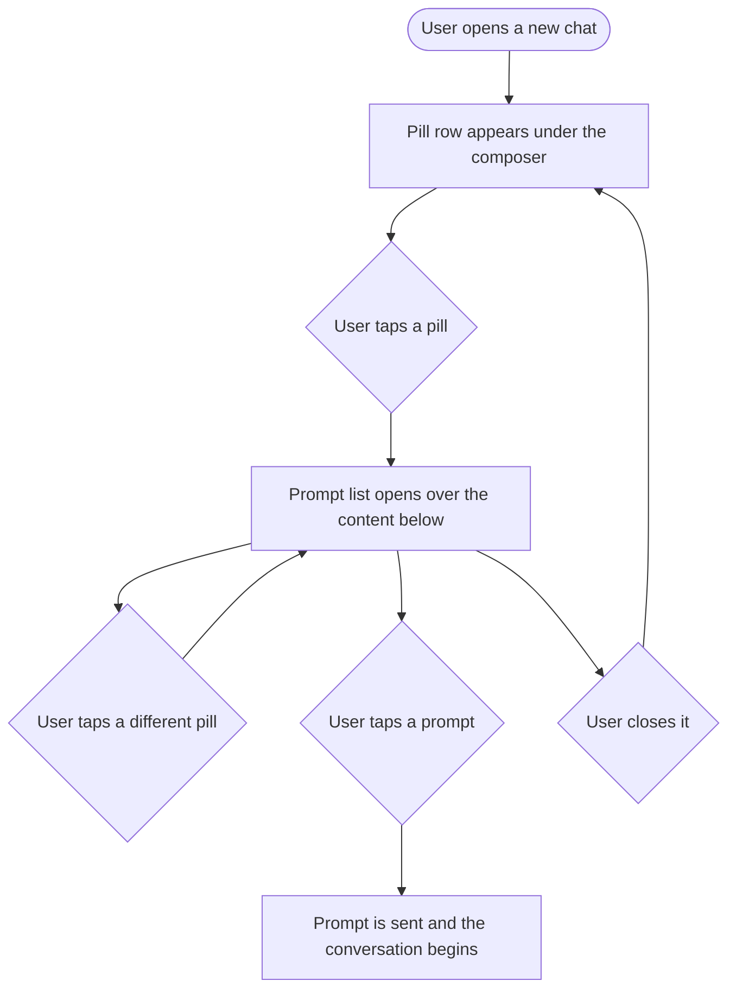

# Epic and Stories: AI chat starter prompts

**Date:** 2026-09-14
**Stories:** 4
**Research:** `01-research.md`
**Prototype:** reviewed and approved

---

## Epic

### Title

**AI chat starter prompts**

### Description

A new AI chat opens on a blank box and, in AI Studio only, three fixed suggestions. Everywhere else it opens on nothing at all. A user who has not used the assistant before has no idea what it can do, and the three suggestions that do exist cover a fraction of it.

This replaces them with a row of **feature pills**. Each pill opens a short list of prompts for that part of the product, and tapping a prompt sends it straight away. The pills cover Post, Write, Media, Inbox, Reporting and Workspace, so the row doubles as an answer to "what is this thing for".

It also brings the three places a chat can start into line. Today AI Studio, the chat modal and the home widget each open differently, with different greetings, different actions and the composer in a different position. They become one experience.

### Scope

- One shared new-chat hero across AI Studio, the chat modal and the home widget.
- Six feature pills, each opening a list of prompts.
- Tapping a prompt sends it and the chat collapses into a conversation, which is the existing behaviour.
- Prompts shown only where the user's plan and role allow that area.
- A bottom sheet instead of an anchored panel at phone width.

### Out of scope

- **Connected accounts as a gate.** Deliberate: see the decisions below.
- **The mobile app**, which has its own story so it is tracked rather than forgotten.
- **User-created or saved prompts.** Existing saved prompts are untouched.
- **Changing what the assistant does.** This exposes existing capability, it does not add any.

### Sequencing

The hero story leads. There is no point building the pill row three times, so the surfaces are brought together first. It is also shippable on its own.

### Decisions taken

- **The panel floats, it does not push.** Anchored under the composer at its full width, not to the pill that was clicked. This is what lets one behaviour work everywhere: the home widget has page content directly under the composer, so a panel that pushed would shove the page down on every click.
- **The pills stay visible** while a list is open, so a user can move between sections without closing first.
- **Phone width gets a bottom sheet.**
- **The panel has a height ceiling and the list scrolls inside it**, so adding a prompt to a section can never break the layout on the shortest surface.
- **Tapping a prompt sends it**, rather than filling the box as today's suggestions do.
- **Gating is plan and role only.** Connected accounts are not a gate. Every prompt shows regardless, and the assistant explains what is possible from there. A new workspace still gets to see what the product can do.
- **The greeting is the modal's**, a welcome plus "How may I help you today?". It is the only one of the three that does not name AI Studio, which reads wrong in the other two places.
- **The modal's Write with AI, Generate Image and Generate Video buttons are replaced**, since the composer moves into that space.

### Success measure

A user opening the assistant for the first time can tell what it does without typing anything, and can start a useful conversation in one tap.

### Stories

1. **[FE] Share one new-chat hero across AI Studio, the chat modal and the home widget**
2. **[FE] Add feature pills and starter prompts to the new-chat hero**
3. **[Flutter] Add feature pills and starter prompts to the mobile assistant**
4. **[Design] Design the shared new-chat hero, the feature pills and the prompt list**

---

## Story 1

### Title

**[FE] Share one new-chat hero across AI Studio, the chat modal and the home widget**

### Description

As someone who uses the assistant from wherever I happen to be in ContentStudio, I want it to look and behave the same in all three places, so that it feels like one feature rather than three that happen to share a name.

A chat can be started in three places and each opens differently today. AI Studio shows a headline naming AI Studio, a centered composer and three suggestions. The chat modal shows a different greeting, a composer docked at the bottom and three entirely different buttons. The home widget repeats the AI Studio headline under a tab row. This makes them one.

It is worth doing before anything else in this epic, because otherwise the pill row would have to be built three times.

---

### Workflow

1. User opens the assistant from the AI Studio page. They see a greeting, a centered composer, and nothing else competing for attention.
2. User opens the assistant from the chat modal anywhere else in the app. They see the same greeting and the same centered composer.
3. User opens the assistant from the home widget. Same again, with the page's own content still below it.
4. User types or picks something. The greeting clears, the composer settles to the bottom, and the conversation begins, which is what happens today.
5. User starts a new chat from any of the three. They are returned to the same opening state.

---

### Acceptance criteria

- [ ] The new-chat opening state is the same in AI Studio, the chat modal and the home widget
- [ ] The greeting is a welcome followed by "How may I help you today?", and **does not name AI Studio**, since that reads wrong in the modal and on home
- [ ] The composer is centered in the opening state on all three surfaces, including the modal, where it currently sits docked at the bottom
- [ ] The composer keeps every control it has today, being the image and video modes, attachments, the brand toggle, voice input and send
- [ ] The modal's "Write with AI", "Generate Image" and "Generate Video" buttons are removed, because the composer now occupies that space
- [ ] Sending the first message collapses the opening state and docks the composer, which is the current behaviour and is unchanged
- [ ] Starting a new chat returns to the opening state on all three surfaces
- [ ] The home widget's own page content below the assistant is unaffected and does not move
- [ ] The opening state appears only for a genuinely new chat, being one with no messages, nothing loading and no tool selected, which is the current rule
- [ ] Opening an existing conversation shows that conversation, never the opening state
- [ ] The dashboard hand-off still works: a message started in the home widget still arrives in AI Studio and is sent there
- [ ] The three existing suggestions are removed as part of this story, since they are replaced by **[FE] Add feature pills and starter prompts to the new-chat hero**. If that story has not landed, the opening state ships without them
- [ ] The commented-out prompt block left in the chat component from an earlier iteration is deleted rather than left in place
- [ ] The opening state is usable at phone width on all three surfaces, with no horizontal scrolling

---

### UI copy

**Greeting**

> **Line one:** Hey {first name}! 👋
> **Line two:** How may I help you today?

**Composer placeholder**

> Type your message here

**Removed copy**

> The AI Studio headline "Plan, create & schedule smarter with AI Studio" is no longer used in the chat opening state. The modal's three action button labels are removed with the buttons.

**Loading state**

While an existing conversation is loading, the opening state is not shown. The existing loading treatment is unchanged.

**Empty and error states**

N/A. This story changes the arrangement of an existing state and introduces no new view. Error handling in the chat itself is unchanged.

**Component notes**

> No new component is required. The opening state becomes one shared piece rather than three, and the surface it is rendered on should not change what it looks like.
>
> **Worth knowing for estimation:** the opening state is currently gated to AI Studio by a single condition in the chat component. There is a second AI-Studio-only branch in the same file that handles the home widget hand-off and **must stay** AI-Studio-only. The home widget is a separate component with its own copy of the opening state, so bringing it in means it renders the shared one rather than its own.

---

### Mock-ups

**Interactive prototype:** https://claude.ai/code/artifact/b15644b0-1429-4404-a1f5-847806a34986

Switch the surface control at the top right to see the same opening state in AI Studio, the chat modal and the home widget.

Designs follow in **[Design] Design the shared new-chat hero, the feature pills and the prompt list**.

---

### Impact on existing data

None. Nothing is stored and nothing changes shape.

---

### Impact on other products

- **Mobile app:** no impact. The mobile assistant is covered by its own story.
- **Chrome extension:** no impact.
- **Public API:** no impact.

---

### Dependencies

None. This story leads the epic.

---

### Global quality & compliance (wherever applicable)

- [ ] Mobile responsiveness (frontend only, N/A for backend-only stories)
- [ ] Multilingual support (frontend + backend, translations available or fallback handled)
- [ ] UI theming support (default + white-label, design library components are being used)
- [ ] White-label domains impact review
- [ ] Cross-product impact assessment (web, mobile apps, Chrome extension)

---

## Story 2

### Title

**[FE] Add feature pills and starter prompts to the new-chat hero**

### Description

As someone opening the AI assistant, I want to see what it can help me with and start in one tap, so that I do not have to guess what to type or discover its abilities by trial and error.

A row of six pills sits under the composer, one per area of the product. Tapping a pill opens a short list of prompts for that area. Tapping a prompt sends it. The pills stay visible while a list is open, so moving between areas takes one tap rather than two.

Two things about the prompts matter more than they look. **Every one has to correspond to something the assistant can genuinely do**, because a prompt with nothing behind it does not fail politely. And **prompts are shown based on the user's plan and role**, so nobody is offered a shortcut into a part of the product they cannot reach.

---

### Workflow

1. User opens a new chat. Under the composer is a row of pills: Post, Write, Media, Inbox, Reporting and Workspace.
2. Only the pills for areas this user's plan and role allow are shown.
3. User taps **Reporting**. A list of reporting prompts opens directly under the composer, floating over whatever is below rather than pushing it down.
4. User taps **Inbox** without closing first. The list swaps to inbox prompts.
5. User taps a prompt. It is sent as if they had typed it, the opening state collapses, and the assistant replies.
6. Anything that would create, send or change something asks the user to confirm before it happens.
7. Instead of picking a prompt, the user could close the list with its close control, by tapping outside it, or with the escape key. The pills are still there.
8. On a phone the same list opens as a sheet from the bottom of the screen.

---

### Acceptance criteria

**The pill row**

- [ ] A row of feature pills appears under the composer in the new-chat opening state, on all three surfaces
- [ ] The pills are Post, Write, Media, Inbox, Reporting and Workspace, in that order
- [ ] Each pill carries an icon and a label
- [ ] The pills remain visible while a prompt list is open, and the open pill is indicated
- [ ] Tapping a different pill while a list is open swaps the list rather than closing it
- [ ] The row wraps rather than scrolling sideways when it does not fit

**The prompt list**

- [ ] Tapping a pill opens a list of that area's prompts
- [ ] The list is anchored under the composer at its width, **not** to the individual pill
- [ ] The list **floats over** whatever is below it and never pushes page content down, verified on the home widget, which has its own content directly beneath
- [ ] The list header names the area and carries a close control
- [ ] The list has a maximum height and scrolls internally beyond it, so a longer section can never overflow the surface it is on
- [ ] The list closes on its close control, on a tap outside it, and on the escape key
- [ ] Closing the list returns to the pill row with nothing else changed
- [ ] At phone width the list opens as a bottom sheet with a dimmed backdrop instead of an anchored panel, and dismisses by tapping the backdrop or its close control

**Sending**

- [ ] Tapping a prompt sends it immediately, without a further confirm step in the interface
- [ ] The sent prompt appears as the user's own message
- [ ] The opening state collapses and the composer docks, which is the existing behaviour
- [ ] The pills and the list are not shown again for that conversation
- [ ] Starting a new chat brings them back

**What the prompts are**

- [ ] Every prompt corresponds to something the assistant can actually do
- [ ] **Every prompt works with no prior context.** A new chat has no image attached, no post selected and no caption pasted, so no prompt refers to "this post", "this image" or "this caption". A prompt may still open a conversation the assistant completes by asking a question, which is different and allowed
- [ ] No prompt refers to blog posts or blog publishing, which is sunset and out of scope
- [ ] No prompt offers to create a content category, which cannot be created through the assistant. Listing them is fine
- [ ] No prompt refers to social listening, content discovery or trending content, industry benchmarks, competitor analytics, generated reports, automations, autonomous agents, tasks, or reply-time figures, **none of which the assistant can do**
- [ ] No prompt asks for a carousel, which currently fails after the user has already confirmed it
- [ ] No prompt names a weekday, such as "next Tuesday", because relative weekdays currently resolve to the wrong week. Prompts say "this week" or "next week" instead
- [ ] Prompt wording never implies something happens instantly when it needs confirmation first

**Gating**

- [ ] A pill is shown only where the user's plan and role allow that area, matching what the product's own navigation already shows for the same area
- [ ] A prompt is shown only where the user's plan and role allow it
- [ ] **Connected accounts are not a gate.** Every prompt is shown regardless of what is connected, and the assistant explains what is possible
- [ ] A pill whose prompts are all hidden is itself hidden, rather than opening an empty list
- [ ] The create-posts prompt respects the **per-member permission**, not the role name, so an approver who has been granted it sees the prompt and one who has not does not
- [ ] Verified for an approver with default permissions: they see the Post pill with the approvals prompt, and do not see Inbox, Reporting or Workspace
- [ ] When nothing qualifies, a small fallback row is shown instead of an empty space, offering prompts that always work

**Analytics**

- [ ] When a user opens a pill, an `ai_chat_prompt_pill_opened` Usermaven event fires with `{ pill, surface }`
- [ ] When a user sends a starter prompt, an `ai_chat_starter_prompt_sent` Usermaven event fires with `{ pill, prompt_id, surface }`, where `surface` is `studio`, `modal` or `home`
- [ ] The prompt text itself is not included in either payload

**Translations**

- [ ] Every pill label and every prompt is added as a translation key across all supported locales in the same change, with no hardcoded English left in a component

---

### UI copy

**Pill labels**

> Post · Write · Media · Inbox · Reporting · Workspace

**Post**

> What's scheduled for this week?
> Which days next week have nothing planned?
> What's waiting for my approval?
> Draft posts to fill my empty slots
> Show me everything still sitting in draft

**Write**

> Give me 10 post ideas for next month
> Plan a week of posts around a theme
> Write a caption in my brand voice
> Suggest content pillars for my brand
> Write three scroll-stopping opening lines

**Media**

> Generate an eye-catching visual for my next post
> Create a set of images for a campaign
> Generate a short video from a description
> Create images that match my brand style

**Inbox**

> What still needs a reply?
> Summarize what people are asking me
> Draft replies to my oldest unread messages
> Show me my recent reviews
> Is anyone unhappy with us right now?

**Reporting**

> How did my accounts perform last month?
> What changed in my reach this week?
> Which posts worked best this month?
> Which account is growing fastest?

**Workspace**

> Which accounts need reconnecting?
> What platforms can I still connect?
> Who's on my team?
> Invite someone to my workspace
> Show me my labels, campaigns and content categories
> Create a label for a new campaign

**Fallback row**, shown when the user's plan and role leave nothing

> What can you help me with?
> What platforms can I still connect?
> **Note beneath:** Nothing else is available on this plan and role yet.

**Prompt list header**

> The area name, with a close control labelled "Close".

**Loading and empty states**

> **Loading:** the pill row is not shown until the opening state has rendered. There is no separate loading treatment for the pills themselves.
> **Empty:** covered by the fallback row above. A pill never opens an empty list, because a pill with no prompts is not shown.

**Error state**

> If sending fails, the existing chat error handling applies and the user's prompt stays in the composer so they can retry. No new error surface.

**Component notes**

> No new component is required. The pills reuse the existing pill treatment, and the panel is a standard floating surface. The bottom sheet at phone width is the one thing that may not have a direct equivalent and should be confirmed against the library during design.
>
> **The number of prompts per pill will change over time**, which is why the panel has a height ceiling and an internal scroll rather than being sized to the current list. Do not size it to five items.

---

### Mock-ups

**Interactive prototype:** https://claude.ai/code/artifact/b15644b0-1429-4404-a1f5-847806a34986

It is the agreed reference for the pill row, the floating panel, the bottom sheet at phone width and the gating behaviour. Two things worth trying in it:

- Open a pill on the **Home widget** surface and confirm the page content beneath does not move.
- Change the **role** to Approver in the right-hand panel and watch the row reduce to the Post pill with a single prompt. The panel beside it explains every pill that was hidden and why.

Designs follow in **[Design] Design the shared new-chat hero, the feature pills and the prompt list**.

---

### Impact on existing data

None. Nothing about a user or a workspace changes.

---

### Impact on other products

- **Mobile app:** not in this batch, covered by **[Flutter] Add feature pills and starter prompts to the mobile assistant**.
- **Chrome extension:** no impact.
- **Public API:** no impact.
- **Saved prompts:** the existing saved-prompts feature is untouched and continues to work as it does today.

---

### Dependencies

Depends on **[FE] Share one new-chat hero across AI Studio, the chat modal and the home widget**, which is what gives this one place to live instead of three.

Design input from **[Design] Design the shared new-chat hero, the feature pills and the prompt list** should land before build starts.

---

### Global quality & compliance (wherever applicable)

- [ ] Mobile responsiveness (frontend only, N/A for backend-only stories)
- [ ] Multilingual support (frontend + backend, translations available or fallback handled)
- [ ] UI theming support (default + white-label, design library components are being used)
- [ ] White-label domains impact review
- [ ] Cross-product impact assessment (web, mobile apps, Chrome extension)

---

## Story 3

### Title

**[Flutter] Add feature pills and starter prompts to the mobile assistant**

### Description

As someone who uses ContentStudio on my phone, I want the assistant to show me what it can help with there too, so that starting a conversation on mobile is as easy as it is on the web.

**Not in this batch.** It is written now so the gap is tracked rather than forgotten, and so that whoever builds the web version knows a mobile counterpart is coming and keeps the prompt set and the copy in a shape that can be reused.

The mobile assistant already has its own chat screen and its own empty state. This adds the same pills and the same prompts, as a bottom sheet, which is the phone treatment the web version already uses at that width.

---

### Workflow

1. User opens the AI assistant in the app and starts a new chat.
2. Under the greeting is a row of feature pills, wrapping to as many lines as it needs.
3. User taps a pill. A sheet slides up from the bottom of the screen with that area's prompts.
4. User taps a different pill behind the sheet, or dismisses and taps another. The sheet shows the new area.
5. User taps a prompt. It sends, the sheet closes, and the conversation begins.
6. Dismissing the sheet by swiping down or tapping the backdrop returns to the pills with nothing changed.

---

### Acceptance criteria

- [ ] The new-chat state in the mobile assistant shows a row of feature pills under the greeting
- [ ] The pills, their order, and the prompts behind each match the web version exactly, so the two products do not drift
- [ ] Tapping a pill opens a bottom sheet listing that area's prompts
- [ ] The sheet dismisses by swiping down, by tapping the backdrop, and by its own close control
- [ ] Tapping a prompt sends it and closes the sheet, and the conversation begins
- [ ] The pills are not shown once a conversation has started, and return when a new chat is started
- [ ] Pills and prompts respect the same plan and role rules as the web version
- [ ] Connected accounts are not a gate, matching web
- [ ] A pill with no prompts available is not shown
- [ ] When nothing qualifies, the same fallback prompts are shown
- [ ] The sheet is usable on a small phone with the keyboard dismissed, and the list scrolls when it is taller than the sheet
- [ ] The prompts are translated into every language the app supports, matching the web copy
- [ ] Verified on both iOS and Android
- [ ] When a user sends a starter prompt, the same analytics event as web fires, with the surface recorded as the mobile app

---

### UI copy

Identical to the web story, so the two surfaces read the same. The pill labels, the prompts for all six areas, and the fallback row are all reused rather than rewritten.

---

### Mock-ups

**Interactive prototype:** https://claude.ai/code/artifact/b15644b0-1429-4404-a1f5-847806a34986

Switch the surface control to **Phone** to see the bottom sheet this story reuses. A separate mobile design pass is only needed if the app's own sheet pattern differs materially from it.

---

### Impact on existing data

None.

---

### Impact on other products

- **Web:** none, but the prompt set must stay in step. If the web set changes after this ships, mobile needs the same change.

---

### Dependencies

Depends on **[FE] Add feature pills and starter prompts to the new-chat hero**, whose prompt set and copy this reuses.

---

### Global quality & compliance (wherever applicable)

- [ ] Mobile responsiveness (frontend only, N/A for backend-only stories)
- [ ] Multilingual support (frontend + backend, translations available or fallback handled)
- [ ] UI theming support (default + white-label, design library components are being used)
- [ ] White-label domains impact review
- [ ] Cross-product impact assessment (web, mobile apps, Chrome extension)

---

## Story 4

### Title

**[Design] Design the shared new-chat hero, the feature pills and the prompt list**

### Description

As the developers bringing three chat surfaces into one and adding a pill row to all of them, we want an agreed treatment, so that the same opening state reads correctly in a full page, a narrow modal and a widget sitting on a busy dashboard.

The hard part is not the pills. It is that the same block has to work in three very different frames, one of which has page content immediately beneath it, and then again on a phone.

---

### Workflow

1. Designer reviews the approved prototype and the copy specified in the frontend stories, which is agreed and should be treated as the content to design around rather than placeholder text.
2. Designer reviews the three surfaces as they render today, and the prototype's floating-panel behaviour.
3. Designer produces the states listed below.
4. Designer reviews with product and frontend, and the agreed designs become the reference.

---

### Acceptance criteria

**The shared opening state**

- [ ] The opening state in all three frames: the full AI Studio page, the narrow chat modal, and the home widget with page content beneath it
- [ ] The composer centered in each, confirming it does not look stranded in the tall frame or cramped in the narrow one
- [ ] The opening state at phone width

**The pill row**

- [ ] The full row of six pills, and the row wrapping when it does not fit
- [ ] A pill in its resting, hover and open states
- [ ] A reduced row, as a gated user would see, confirming it does not look broken with two or three pills
- [ ] The fallback row shown when nothing qualifies

**The prompt list**

- [ ] The floating panel open under the composer, at each of the three frame widths
- [ ] The panel shown over the home widget's page content, confirming the overlap reads as deliberate
- [ ] The panel at its height ceiling with the list scrolling inside it
- [ ] The panel header and its close control

**Phone**

- [ ] The bottom sheet with its backdrop, at rest and mid-scroll
- [ ] Confirmation of whether the design system has a sheet pattern to reuse, or whether one is needed

**General**

- [ ] Every state uses components from the existing design system, and any genuine gap is called out explicitly rather than drawn as a one-off
- [ ] The pills are theme-aware, with no hardcoded colours. **Today's three suggestions use hardcoded blues and stay ContentStudio blue on a white-label domain**, which this work should not repeat
- [ ] Designs are delivered for both the default primary colour and a non-blue white-label primary colour

---

### Mock-ups

This story produces them, building on the approved prototype: https://claude.ai/code/artifact/b15644b0-1429-4404-a1f5-847806a34986

---

### Impact on existing data

None.

---

### Impact on other products

- **Mobile app:** the phone treatment designed here is the reference for the mobile story, so it should be drawn with that reuse in mind.
- **Chrome extension:** no impact.

---

### Dependencies

None. Should start first.

---

### Global quality & compliance (wherever applicable)

- [ ] Mobile responsiveness (frontend only, N/A for backend-only stories)
- [ ] Multilingual support (frontend + backend, translations available or fallback handled)
- [ ] UI theming support (default + white-label, design library components are being used)
- [ ] White-label domains impact review
- [ ] Cross-product impact assessment (web, mobile apps, Chrome extension)
