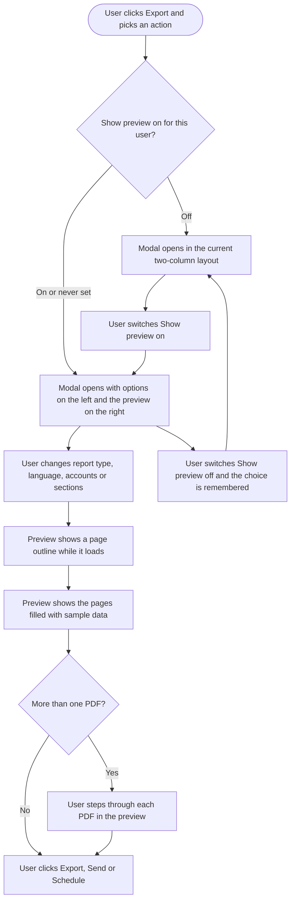

# Workflow: Analytics Report Preview

**Prototype (canvas):** https://claude.ai/artifact/6qpafL7Usef92RCxFVRw2z

## 1. Feature Placement

The preview lives inside the report modals that already open from analytics. There is no new navigation.

| Where the user is | Entry point | Modal today |
|---|---|---|
| Analytics, Overview or any social platform dashboard | **Export** button, then Export PDF, Email PDF or Schedule PDF | Export Report / Send PDF as Email / Schedule PDF as Email |
| Analytics, Meta Ads or Google Ads | Same **Export** button | Same modal |
| Analytics, Campaign & Label | Same **Export** button | Export Report / Send PDF as Email |
| Analytics, Competitor (Facebook, Instagram, YouTube) | **Export** in the competitor report header | Export Report |

Turning the preview on or off is a **Show preview** switch in the modal header.

## 2. Workflow Diagram (Overview)

## 3. User Flow (happy path)

1. The user opens any analytics dashboard, sets the accounts and date range, and clicks **Export**, then **Export PDF**.
2. The modal opens wide. The report options sit in one column on the left. On the right is the **Preview** with a **Sample data** badge and a summary such as "3 PDFs · 22 pages".
3. The preview first shows an outline of each page (section names and block shapes), and a moment later the pages fill in with example charts, tables and numbers.
4. The user changes **Report Type** to "Detailed insights reports (separate PDFs)". A strip above the preview now says "3 separate PDFs" and shows one tab per account with its page count. The user clicks the second tab to see that account's PDF.
5. The user unticks **Audience Demographics**. That block disappears from every preview page that had it, and the page count drops.
6. The user changes **Report Language** to French. Every heading, label and the cover page switch to French.
7. The user edits the **Export Name**. The cover page title updates as they type.
8. The user clicks **p. 4** next to a section in the list, and the preview scrolls to page 4.
9. The user clicks **Export**. The report is generated with real data, exactly as today.

## 4. Alternative Flows

**A. The user prefers the old modal.** They switch **Show preview** off. The modal immediately goes back to the current two-column layout. Next time they open any report modal, on any device, it opens without the preview. Switching it back on is remembered the same way.

**B. One PDF with several accounts.** With "Individual overview reports (single PDF)" or "Detailed insights report (single PDF)", the strip says "1 PDF" and "3 account reports, one after the other", with **Jump to** chips for each account.

**C. Email and Schedule.** The preview behaves the same. The summary adds "attached to each email". For Schedule, the cover shows the rolling period ("Previous week, sent every Monday") instead of fixed dates.

**D. Nothing to preview.**
- No accounts selected: "Nothing to preview yet".
- All sections unticked: "No sections selected".
- No report type picked yet: "Pick a report type".

The submit button stays disabled exactly as today.

**E. The preview fails to load.** The preview pane shows "We couldn't load the preview" with **Try again**. The rest of the modal keeps working and the user can still export.

**F. Tablet (768 to 1279px wide).** The options take the full width. A **Preview · 22 pages** button in the footer opens the preview as a side panel over the options, and it keeps updating while the user edits. Tapping outside the panel or its close button hides it.

**G. Phone (under 768px).** The modal is a full-screen sheet with **Settings** and **Preview · 22 pages** tabs. The main button stays pinned at the bottom. Dropdowns open as bottom sheets. Separate PDFs become a "File 1 of 3" picker with arrows, and "Jump to" becomes a sheet.

**H. Competitor and Campaign & Label.** These modals have no report type, so there is always one PDF. The preview covers their own sections.

## 5. Key Design Decisions

| Decision | Options | Recommendation |
|---|---|---|
| What the preview shows | A. Labelled wireframe only. B. Real report layout with sample data. C. Real data | **B, with A as its loading state.** It matches the printed PDF without fetching analytics on every change. C is too slow and costly per change. (PO decided, 2026-10-01) |
| Is the preview optional | Always on / optional and remembered per user | **Optional, on by default at rollout, remembered per user** so power users keep the fast modal. (PO decided) |
| Layout with preview off | New single column / keep today's layout | **Keep today's two-column layout**, so turning it off is a true "no change" for users who don't want it. (PO decided) |
| Separate PDFs | Dropdown / file tabs / grid of files | **Tabs with arrows on desktop, a file picker on phone.** Tabs make it obvious there are several files, and a dropdown fits a phone. (PO decided) |
| How the preview renders | Reuse the print templates in a sample mode / a dedicated preview renderer / render server-side | **Open: a [Research] ticket.** The Vue print templates and the Go report engine don't match for every area. |

## 6. Integration with Existing Features

- **Section picker:** the preview reacts to the same section list. Each selected section gets a "p. N" shortcut.
- **Report types:** the preview makes the five report types concrete (one combined report, back-to-back reports in one PDF, or one PDF per account).
- **Report language:** headings use the same translated labels the PDF uses.
- **Export Name:** shown on the cover page and page headers.
- **White-label workspaces:** the cover and page accents follow whatever branding the real PDF uses for that workspace.
- **Report generation, emailing and scheduling:** unchanged. The preview never creates a report or sends anything.

## 7. Trackable Actions (Usermaven candidates)

| Action | Candidate event | Trigger |
|---|---|---|
| User switches Show preview on or off | `analytics_report_preview_toggled` | The switch is flipped in any report modal |
| User creates a report with the preview showing | Extend the existing `analytics_report_created` with `preview_shown` | A report is created from a modal |

Not tracked: switching between PDFs, jump links, the view toggle and page scrolling (trivial UI).

## 8. Scope Recommendation

**v1 (this epic)**
- The preview in all three report modals and every report area
- Sample data in the real report layout, with the wireframe as the loading state
- Show preview switch remembered per user, with the current layout when it's off
- Separate-PDF and multi-account navigation
- Tablet and phone layouts
- Design for all of the above

**Deferred (v2 candidates)**
- "Preview with my data" (real numbers)
- "Send a test report now" for schedules
- Downloading the preview itself
- The Flutter app
