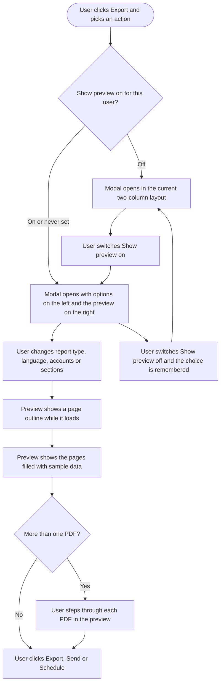

# **PRD: Analytics Report Preview**

**Author:** Ghulam Jaffar (PO), drafted with Claude
**Last Updated:** 2026-10-01
**Status:** In Review
**Target Release:** Sprint Oct 05 - Oct 18 - 2026

**Prototype (canvas):** https://claude.ai/artifact/6qpafL7Usef92RCxFVRw2z

---

## **1. Overview**

Users who export, email or schedule an analytics report currently configure it blind. This feature adds a live preview to the report modals: the actual report layout, filled with sample data, updating as the user changes the report type, language, accounts and sections. It shows how many PDFs will be created and what each contains. The preview is on by default. Users who don't want it can switch it off, and that choice is remembered for them.

---

## **2. Problem Statement**

**What problem are we solving?**

The report modals ask for an export name, language, report type, accounts and sections, but show nothing of the result. The report type names don't explain themselves: a user can't tell from "Individual overview reports (separate PDFs)" versus "Detailed insights report (single PDF)" how many files they will get or what is inside. Users learn by generating the report, opening it and redoing it. With Email and Schedule, a wrong report reaches a client or manager before the user ever sees it.

**Who has this problem?**

- Agency users and in-house marketers who send reports to clients and managers.
- Most acutely, anyone setting up a scheduled report, because the mistake repeats on every run.
- Users exploring report types and the section picker for the first time.

**What happens if we don't solve it?**

- Wasted renders: each "export, check, redo" cycle is a full PDF generation.
- Wrong reports in clients' inboxes.
- Support questions about what each report type produces.
- We lag Agorapulse, the one tracked competitor with a live preview in the export flow.

---

## **3. Goals & Success Metrics**

| Goal | Metric | Target | How We'll Measure |
| ----- | ----- | ----- | ----- |
| Users understand the report before generating it | Share of reports created with the preview showing | ≥ 70% of reports created in the first 60 days | `analytics_report_created` with `preview_shown` |
| Fewer redo cycles | Reports regenerated by the same user, same area, within 10 minutes | -25% vs the 30 days before launch | Report records (backend) |
| Preview is useful, not in the way | Share of users who switch the preview off and keep it off | ≤ 20% | `analytics_report_preview_toggled` |
| Guard rail: report modal stays fast | Time from modal open to first preview page shown | ≤ 1.5s on desktop | Frontend timing during QA |
| Guard rail: no extra load on report generation | Report records created per modal session | Unchanged (preview creates none) | Report records (backend) |

### **3.1 Analytics Events (Usermaven)**

| Event Name | Trigger | Payload | What we measure with it |
| ----- | ----- | ----- | ----- |
| `analytics_report_preview_toggled` (new, FE) | User flips the Show preview switch in any report modal | `{ enabled, platform, action }`, where `enabled` is true or false, `platform` is the section-picker platform key (e.g. `facebook`, `overview`, `instagram_competitor`, `campaign_label`), and `action` is `export`, `email` or `schedule` | Opt-out rate and where users turn the preview off |
| `analytics_report_created` (existing, FE, extended) | A report is created from a report modal (where this event already fires) | Existing `{ source, report_type, entry_point }` plus `preview_shown: true / false` | Share of reports made with the preview visible |
| `analytics_report_sections_customized` (existing, unchanged) | Unchanged | Unchanged | Unchanged |

---

## **4. Target Users**

**Primary Persona:**
Agency account manager. They send monthly or weekly PDF reports to several clients, care about the report looking right in front of the client, and are comfortable with ContentStudio but not with every report type.

**Secondary Persona:**
In-house social media manager. They export reports for their own manager, often from one dashboard and in a non-English language.

**Non-Users (explicitly out of scope):**
- Users of the Flutter mobile app.
- Workspace-level reports set up in Settings, which use a separate modal.
- Users who want real numbers in the preview (deferred).

---

## **5. User Stories / Jobs to Be Done**

| ID | As a... | I want to... | So that... | Priority |
| ----- | ----- | ----- | ----- | ----- |
| US-1 | Agency account manager | see a preview of the report while I pick its options | I know what my client will get before I send it | Must Have |
| US-2 | Any report user | see how many PDFs will be created and preview each one | I pick the right report type the first time | Must Have |
| US-3 | Any report user | see the preview change as I change sections, language and accounts | I understand what every option does | Must Have |
| US-4 | Power user | turn the preview off and have that remembered | the modal stays as fast and compact as it is today | Must Have |
| US-5 | Any report user | jump from a section in the list to where it appears in the preview | I can check one section without scrolling | Should Have |
| US-6 | User on a tablet or phone | use the preview on a small screen | I can check a report away from my desk | Must Have |
| US-7 | Competitor or Campaign & Label user | get the same preview in those report modals | every analytics report works the same way | Must Have |

---

## **6. Requirements**

### **6.1 Must Have (P0)**

**The preview**
- A live preview in the Export, Email and Schedule report modals, for every report area: Overview, every social platform dashboard, Meta Ads, Google Ads, Campaign & Label and competitor reports.
- The preview uses the real report layout with sample data, and a permanently visible **Sample data** badge.
- While the preview loads, each page shows a labelled outline of its sections.
- The preview reacts to report type, language, accounts (or competitors, campaigns and labels, ad accounts), sections, export name and, for schedules, frequency.
  - It shows the cover page, page headers and footers, page numbers and a running page count.
- For report types that create several PDFs: a file switcher with a count, previous/next and each file's page count.
- For one PDF covering several accounts: a jump to each account's part.

**Turning it on and off**
- A **Show preview** switch in the modal header.
  - On for everyone by default.
  - Turning it off returns the modal to today's layout.
  - The choice is saved per user, so it follows them across devices and browsers.

**Edge cases and small screens**
- Empty states (no accounts, no sections, no report type) and an error state that never blocks creating the report.
- Tablet and phone layouts.

**What must not change**
- The preview never creates a report record, never calls the analytics data APIs and never sends anything.

### **6.2 Should Have (P1)**

- A "p. N" shortcut next to each selected section that scrolls the preview to it.
- A view toggle on desktop: two pages side by side, or one larger page.
- Usermaven events per section 3.1.

### **6.3 Nice to Have (P2)**

- Smooth fade when a section is removed from the preview.
- Remember the two-page vs one-page view per user.

### **6.4 Explicitly Out of Scope**

- Real data in the preview ("Preview with my data"). Deferred.
- "Send a test report now" for schedules. Deferred.
- Downloading or sharing the preview itself.
- The Flutter app.
- Workspace-level reports in Settings.
- Changing what a generated PDF contains.

---

## **7. User Flow (High Level)**

1. The user clicks **Export** on an analytics dashboard and picks Export PDF, Email PDF or Schedule PDF.
2. The modal opens with options on the left and the preview on the right (or in today's layout, if they turned the preview off).
3. The preview shows a page outline, then fills in with sample data.
4. The user changes the options and the preview updates: file count, pages, sections, language, names.
5. The user steps through each PDF if there are several.
6. The user clicks Export, Send or Schedule. The report is generated with real data as today.

---

## **8. Business Rules & Constraints**

| Rule ID | Rule | Rationale |
| ----- | ----- | ----- |
| BR-1 | The preview never shows real metric values. Every number, chart, post and caption is sample data. Account names and avatars are the real selected ones | Instant, cheap, and works for new or empty accounts. Real names make the structure recognisable |
| BR-2 | The **Sample data** badge is visible whenever sample data is on screen | Nobody mistakes example numbers for a client's real figures |
| BR-3 | Showing or updating the preview creates no report record and triggers no report generation, email or analytics data request | Keeps load on report generation unchanged |
| BR-4 | The preview's file count, page order, section order and page count match what the generated PDF will contain for the same options | A preview that disagrees with the PDF is worse than no preview |
| BR-5 | Show preview defaults to on. Once a user switches it, their choice is saved at user level and applies to every report modal | PO decision, 2026-10-01 |
| BR-6 | With Show preview off, the modal looks and behaves exactly as it does today | Opting out must cost the user nothing |
| BR-7 | Preview headings, labels and the cover follow the selected Report Language, not the app's interface language | The preview shows the PDF, and the PDF is in the report language |
| BR-8 | If the preview fails, the user can still create the report | The preview is advisory, never a gate |

---

## **9. Open Questions**

| Question | Options | Owner | Due Date | Decision |
| ----- | ----- | ----- | ----- | ----- |
| How does the preview render the real layout with sample data for areas the Go report engine prints? | Reuse the Vue print templates in a sample mode / a dedicated preview renderer / a server-rendered preview | Engineering, through the [Research] ticket | Start of sprint | Pending |
| Does the saved Show preview choice apply on tablet and phone, where the preview opens on demand? | It only decides the wide-screen layout / it also hides the Preview tab and button | PO | Before design hand-off | Proposed: wide screens only. Small screens always offer the Preview button or tab |
| Should the sample data scale with the number of selected accounts? | Fixed / scaled | Design | Design review | Proposed: fixed ranges per platform |

---

## **10. Risks & Mitigations**

| Risk | Likelihood | Impact | Mitigation |
| ----- | ----- | ----- | ----- |
| Preview layout drifts from the printed PDF, especially where the Go engine prints | Medium | High | The Research ticket picks an approach with one source of truth for layout. BR-4 is tested in QA per area |
| Rendering many sample pages slows the modal, especially on phones | Medium | Medium | Wireframe-first loading. Only draw pages as they scroll into view |
| Users read sample numbers as real | Low | High | Permanent Sample data badge (BR-2), and sample values that are clearly round, example-looking figures |
| The modal is already large and has a migration pending | Medium | Medium | Preview built as its own piece the three modals share. Preview-off path left untouched (BR-6) |
| White-label branding missing in the preview | Low | Medium | Design and QA check against a white-label workspace |

---

## **11. Dependencies**

**Internal**
- The three report modals in `contentstudio-frontend/src/modules/analytics/components/reports/modals/` (`ScheduleReportModal.vue`, `ExportReportModal.vue`, `SendReportByEmailModal.vue`).
- The section config in `src/modules/analytics/utils/reportSections.ts`.
- The print templates in `src/modules/analytics/views/reports/` and `components/PDFReports.vue`.
- The Go report engine through `ReportsHelper::createPDFFile` / `GoReportsClient`.
- The user preferences store (`preferences/setPreferences`), already used by `useAnalyticsSidebarSectionsStore`.

**External:** none.

**Blockers**
- The [Research] ticket's outcome on rendering approach, before the main preview FE story starts.
- The [Design] story's hand-off.

---

## **12. Appendix**

- **Prototype canvas:** https://claude.ai/artifact/6qpafL7Usef92RCxFVRw2z (Options A and B on desktop, plus tablet and phone)
- **Competitive analysis:** in the Research doc. Agorapulse is the closest precedent for a live preview in the export flow, and AgencyAnalytics for the remembered sample-data toggle.
- **Related epics:** Analytics Report Customization and Overview Card Cleanup (section picker). Report names for exported and emailed reports (Export Name).

---

## **Changelog**

| Date | Author | Changes |
| ----- | ----- | ----- |
| 2026-10-01 | Ghulam Jaffar / Claude | Initial draft from canvas exploration and PO decisions |
