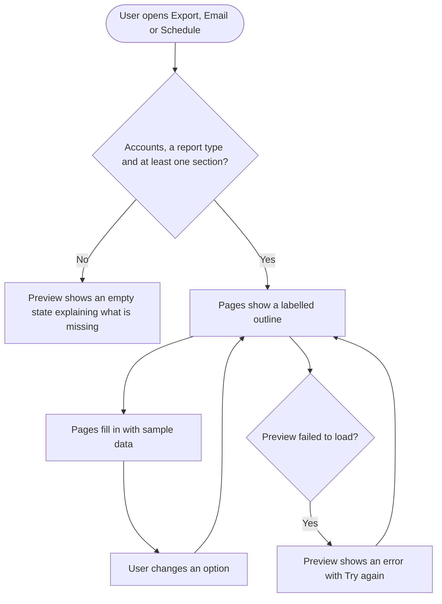
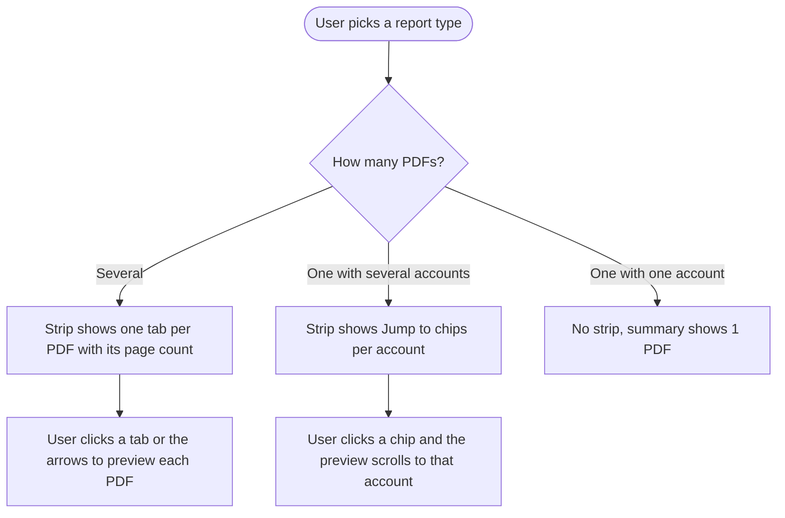

# EPIC: Analytics report preview in the export, email and schedule modals

Let users see the analytics report they are about to create before they create it.

Today the Export, Email and Schedule report modals ask for a name, language, report type, accounts and sections, but show nothing of the result. Users find out what a report type produces, how many PDFs they will get, and whether the sections they picked look right only after the report is generated. Emailed and scheduled reports reach clients or managers before the user has seen them. This epic adds a live preview to those modals for every analytics report area: Overview, every social platform dashboard, Meta Ads, Google Ads, Campaign & Label and competitor reports.

The preview shows the real report layout filled with clearly labelled sample data. It updates as the user changes options. It also shows how many PDFs will be created and lets the user step through each one. While it loads, each page shows a labelled outline of its sections. The preview is on by default. Users can switch it off, which returns the modal to today's layout, and their choice is remembered.

Tablet and phone screens get layouts of their own. The Flutter app is out of scope.

Prototype: https://claude.ai/artifact/6qpafL7Usef92RCxFVRw2z

---

Seven stories. The [Research] ticket decides the technical approach; the other stories describe behavior only.

| Story | Covers |
|---|---|
| [Design] Design the analytics report preview for the export, email and schedule modals | All screens, states and components |
| [Research] Decide how the report preview shows the real report layout with sample data | Technical approach across both report engines |
| [FE] Show a live sample-data preview of the report beside the report options | The preview itself, loading, empty and error states |
| [FE] Add a Show preview switch to the report modals and remember each user's choice | Optional preview, layout switch, per-user memory |
| [FE] Show how many PDFs a report creates and let users preview each one | Separate PDFs, multi-account jumps, section page shortcuts |
| [FE] Add the report preview to competitor and Campaign & Label report modals | The two areas served by different modals |
| [FE] Fit the report preview to tablet and phone screens | Small screens |

---

## [Design] Design the analytics report preview for the export, email and schedule modals

### Description:

As a **product designer**, I want to design the report preview for the report modals so that developers have final screens, states and components for every report area and screen size.

When a user exports, emails or schedules an analytics report, the modal will show a live preview of the PDF beside the report options, filled with sample data. The PO has already decided the direction on a prototype canvas. This story turns it into a production design that fits the ContentStudio design system and white-label theming, and that holds up for every report area.

The direction to design from:

- **Preview on:** options in one column on the left, the preview on the right.
- **Preview off:** today's modal layout, unchanged.
- A **Show preview** switch in the modal header.
- The real report layout with sample data, and a permanently visible Sample data badge.
- A labelled outline of each page while it loads.
- File tabs for reports that create several PDFs, and jump chips for one PDF that covers several accounts.
- A side panel on tablet, and Settings and Preview tabs on phone.

Prototype: https://claude.ai/artifact/6qpafL7Usef92RCxFVRw2z

### Workflow:

1. The designer reviews the prototype canvas: Option A (the labelled outline, which becomes the loading state), Option B (sample data), tablet and phone.
2. The designer designs the preview-on modal for Export, Email and Schedule, and confirms the preview-off modal is today's layout with only the new switch added.
3. The designer designs the preview pane:
   - The header, with Preview, the Sample data badge, the summary and the view toggle.
   - The page frame: cover, page header, footer and page numbers.
   - A sample-data look for each block type: metric cards, line chart, bar chart, table, post cards, breakdown bars, hashtag list and text summary.
4. The designer designs the loading outline for each block type, the empty states, and the error state.
5. The designer designs the file strip for separate PDFs, the Jump to chips, and the "p. N" shortcut in the section list.
6. The designer designs the tablet side panel and the phone layout: Settings and Preview tabs, the pinned footer, bottom sheets, the file picker, and the Jump to account sheet.
7. The designer checks the result against a white-label workspace and hands off.

### Acceptance criteria:

- [ ] Designs cover the preview-on modal for Export Report, Send PDF as Email and Schedule PDF as Email
- [ ] Designs show the preview-off modal is today's layout, with only the Show preview switch added to the header
- [ ] The preview pane header is designed: "Preview" title, Sample data badge with info icon, summary text (e.g. "3 PDFs · 22 pages"), and the two-page / one-page view toggle
- [ ] Page designs cover the cover page (logo, report title, report label, reporting period, language, included accounts, contents with page numbers), content page header and footer, and the account banner that opens each account's part
- [ ] Each block type has a sample-data design and a loading-outline design: metric cards, line chart, bar chart, table, post cards, breakdown bars, hashtag list, text summary
- [ ] Designs cover every report area at least once: Overview, a social platform, Meta Ads, Google Ads, Campaign & Label, and a competitor report
- [ ] Designs cover all five report types, including the file strip for separate PDFs and Jump to chips for one PDF with several accounts
- [ ] The "p. N" shortcut next to selected sections is designed
- [ ] Empty states are designed (no accounts, no sections, no report type), plus the error state with Try again
- [ ] The tablet side panel (768 to 1279px) and the phone layout (under 768px) are designed, including bottom sheets for dropdowns, the file picker and the Jump to account sheet
- [ ] Designs use theme colors only and are checked against a white-label workspace's primary color and logo
- [ ] Component hand-off lists which `@contentstudio/ui` components are used (`Switch`, `Badge`, `Tabs`, `SegmentedControl`, `Button`, `ActionIcon`, `Dropdown`, `DropdownItem`, `Checkbox`, `Loader`, `Alert`) and specs the new pieces flagged below
- [ ] New components are specced, because they are not in `@contentstudio/ui` today:
    - the preview page frame with its block placeholders
    - a bottom sheet for phone
    - a tooltip (the library has none; `CstPopup` is the fallback)
- [ ] All UI copy in the designs matches the copy in the FE stories of this epic

### Mock-ups:

Starting point: the prototype canvas, https://claude.ai/artifact/6qpafL7Usef92RCxFVRw2z

### Impact on existing data:

None.

### Impact on other products:

None outside the web app. The Flutter app is out of scope.

### Dependencies:

None. This story unblocks every [FE] story in this epic.

### Global quality & compliance (wherever applicable)

- [ ] Mobile responsiveness (frontend only, N/A for backend-only stories)
- [ ] Multilingual support (frontend + backend, translations available or fallback handled)
- [ ] UI theming support (default + white-label, design library components are being used)
- [ ] White-label domains impact review
- [ ] Cross-product impact assessment (web, mobile apps, Chrome extension)
- [ ] Developer surfaces coverage: N/A, design only

---

## [Research] Decide how the report preview shows the real report layout with sample data

### Description:

As a **developer on the analytics team**, I want to work out how the report preview can show the real report layout filled with sample data so that the preview always matches the PDF a user will get, without slowing the modal or adding load to report generation.

The product requirement is clear: the preview shows the same layout as the generated PDF, filled with sample numbers, and updates instantly as options change. What isn't settled is how to build it, because reports are produced in more than one way today. Some areas are printed by the newer report engine, others by the report page in the web app. The two don't render identically for every area, and they don't treat section selection the same way.

The preview also must never create a report record, request analytics data, or trigger a report, on any option change.

Prototype: https://claude.ai/artifact/6qpafL7Usef92RCxFVRw2z

### Workflow:

1. The developer reviews how each report area is printed today, and which areas each engine covers.
2. For each area, the developer answers the questions in the acceptance criteria.
3. The developer compares at least two approaches, for example reusing the existing report templates with a sample-data source versus a dedicated preview renderer, and recommends one.
4. The developer writes the decision as a comment on this ticket. If backend work is needed, they draft the follow-up [BE] story in this epic.

### Acceptance criteria:

- [ ] A written decision on how the preview renders each report area (Overview, each social platform, Meta Ads, Google Ads, Campaign & Label, Facebook, Instagram and YouTube competitor reports), with the reasoning
- [ ] The decision states how the preview stays in line with the printed PDF for page order, section order, page breaks and file count, and how drift is caught when a report changes
- [ ] The decision states where sample data comes from, how it stays clearly example-looking, and how it covers every block type and both report languages and account counts
- [ ] The decision confirms that opening and updating the preview creates no report records and calls no analytics data endpoints
- [ ] The decision states the expected time to first preview page on desktop (target 1.5 seconds or less) and how it stays responsive on phones, for example drawing only the pages that are scrolled into view
- [ ] The decision states how the preview reacts to every option: report type, language, accounts, sections, export name, and schedule frequency
- [ ] Any backend work needed is written as a [BE] story in this epic. If none is needed, the decision says so
- [ ] Findings are shared with the developers on [FE] Show a live sample-data preview of the report beside the report options before that story starts

### Mock-ups:

N/A. Research.

### Impact on existing data:

None. Research only.

### Impact on other products:

None.

### Dependencies:

None. Blocks **[FE] Show a live sample-data preview of the report beside the report options**.

### Global quality & compliance (wherever applicable)

- [ ] Mobile responsiveness: N/A, research only
- [ ] Multilingual support (frontend + backend, translations available or fallback handled)
- [ ] UI theming support: N/A, research only
- [ ] White-label domains impact review
- [ ] Cross-product impact assessment (web, mobile apps, Chrome extension)
- [ ] Developer surfaces coverage: N/A, the preview is in-app only and changes no API

---

## [FE] Show a live sample-data preview of the report beside the report options

### Description:

As an **agency account manager exporting, emailing or scheduling an analytics report**, I want to see a preview of the report while I choose its options so that I know exactly what my client or manager will receive before it is generated or sent.

This story adds the preview pane to the report modal used for Export, Email and Schedule on Overview, every social platform dashboard, Meta Ads and Google Ads.

- With the preview on, the options move to one column on the left and the preview sits on the right.
- The preview shows the real report layout, filled with sample data, and updates as the user changes options.
- While a change loads, each page first shows a labelled outline of its sections, then fills in.

Real account names are shown, but every number, chart and post is an example, and a Sample data badge always says so. Creating the report is unchanged: it still uses real data.

Prototype: https://claude.ai/artifact/6qpafL7Usef92RCxFVRw2z

### Workflow:

1. The user opens an analytics dashboard, clicks **Export** and picks **Export PDF**.
2. The modal opens wide. The options sit in one column on the left. On the right is the **Preview**, with a **Sample data** badge and a summary such as "1 PDF · 8 pages".
3. Each page first shows an outline: section names and grey shapes for charts, tables and cards. A moment later the pages fill in with example charts, tables and numbers.
4. The user unticks **Audience Demographics**. That block disappears from the preview, the remaining sections move up, and the page count updates.
5. The user changes **Report Language** to German. Every heading, label, the cover page and page footers switch to German.
6. The user types a new **Export Name**. The cover page title and page headers update as they type.
7. The user switches the view toggle to see one larger page at a time.
8. The user clicks **Export**, **Send** or **Schedule**. The report is created as it is today.

### Acceptance criteria:

**Layout and placement**

- [ ] With the preview on, the modal widens (up to 1340px, within the window) with options in one left column (440px) and the preview filling the right side
- [ ] The preview is in the report modal on Overview, Facebook, Instagram, LinkedIn, TikTok, YouTube, Pinterest, X, Threads, Bluesky, Google Business Profile, Meta Ads and Google Ads, for Export, Email and Schedule

**Preview header**

- [ ] The header shows "Preview", a `Badge` reading "Sample data", and an info icon
- [ ] The info icon's tooltip reads: "This preview uses example numbers so it loads instantly. Your report will use your real data for the dates and accounts you picked."
- [ ] The summary shows the file and page count, e.g. "1 PDF · 8 pages" or "3 PDFs · 22 pages"
- [ ] For Email and Schedule, the summary ends with "attached to each email", e.g. "3 PDFs · 22 pages, attached to each email"

**What the preview shows**

- [ ] Pages show the real report layout for the selected area and report type:
    - a cover page
    - content pages with a header (export name on the left, account name on the right)
    - a footer reading "Page 2 of 8", in the report language
- [ ] The cover page shows:
    - the workspace logo
    - the report label (e.g. "Analytics report")
    - the export name as the title
    - "Reporting period" with the dates
    - "Language"
    - "Included", with the selected accounts' avatars and names
    - "Contents", listing sections (or accounts, when a PDF has several) with page numbers
- [ ] Every number, chart, post and caption is sample data. Account names and avatars are the user's selected ones
- [ ] Sample data differs between accounts, so switching accounts visibly changes the pages

**Reacting to changes**

- [ ] Unticking a section removes it from the preview, and ticking it adds it back in its normal report order. The page count and contents update
- [ ] Changing Report Language changes every heading, label, the cover page and the page footers to that language
- [ ] Editing Export Name updates the cover title and page headers as the user types
- [ ] Adding or removing accounts updates the cover, the account banners and the pages
- [ ] For Schedule, the cover's Reporting period shows "Previous week, sent every Monday" (Weekly) or "Previous month, sent on the 2nd" (Monthly), in the report language, instead of fixed dates
- [ ] The file count, page order, section order and page count in the preview match the generated PDF for the same options

**Views and loading**

- [ ] A view toggle (`SegmentedControl` with two icon options) switches between two pages side by side and one larger page
    - Tooltips: "Show two pages side by side" and "Show one page, larger"
- [ ] Loading: on opening the modal and after each change, pages first show a labelled outline (section titles and grey block shapes, with a small label such as "Line chart" or "Table") and then fill in with sample data
    - The badge reads "Loading preview…" while this happens

**Empty and error states**

- [ ] Empty state, no accounts selected:
    - Headline "Nothing to preview yet"
    - Subtext "Select at least one account and the preview appears here."
- [ ] Empty state, no sections selected:
    - Headline "No sections selected"
    - Subtext "Turn on at least one section to see what your report will contain."
- [ ] Empty state, no report type picked:
    - Headline "Pick a report type"
    - Subtext "Choose how you want your report put together and the preview appears here."
- [ ] Error state:
    - Headline "We couldn't load the preview"
    - Subtext "Your report isn't affected. You can still create it, or try the preview again."
    - A `Button` "Try again" that reloads the preview
- [ ] The Export, Send and Schedule buttons keep their current rules and are never blocked by the preview loading or failing

**What must not happen**

- [ ] Opening the modal and changing options never creates a report, sends an email, or requests analytics data for the preview

**Analytics events**

- [ ] When a report is created from this modal, the `analytics_report_created` Usermaven event includes `preview_shown: true` if the preview was visible and `preview_shown: false` if not, alongside its existing `{ source, report_type, entry_point }`

### Mock-ups:

See the designs from **[Design] Design the analytics report preview for the export, email and schedule modals**, and the prototype: https://claude.ai/artifact/6qpafL7Usef92RCxFVRw2z

Requires new component: the preview page frame with its block placeholders and sample-data blocks. Not currently in `@contentstudio/ui`; specced in the [Design] story.

### Impact on existing data:

None. The preview creates and stores nothing.

### Impact on other products:

None. Generated, emailed and scheduled reports are unchanged.

### Dependencies:

- **[Design] Design the analytics report preview for the export, email and schedule modals**
- **[Research] Decide how the report preview shows the real report layout with sample data**

### Global quality & compliance (wherever applicable)

- [ ] Mobile responsiveness (small screens are covered by [FE] Fit the report preview to tablet and phone screens)
- [ ] Multilingual support (frontend + backend, translations available or fallback handled)
- [ ] UI theming support (default + white-label, design library components are being used)
- [ ] White-label domains impact review
- [ ] Cross-product impact assessment (web, mobile apps, Chrome extension)
- [ ] Developer surfaces coverage: N/A, no API is created or changed

---

## [FE] Add a Show preview switch to the report modals and remember each user's choice

### Description:

As a **power user who exports reports often**, I want to switch the report preview off and have ContentStudio remember that so that the modal stays as compact and fast as it is today whenever I open it.

The preview is on by default for everyone at rollout. A **Show preview** switch in the modal header turns it off or back on.

- **Off:** the modal returns to today's layout, with the options in two columns and no preview.
- **On:** the options move to the left column and the preview appears on the right.

The choice is saved to the user's account, not the browser, so it follows them to every report modal, browser and device.

Prototype: https://claude.ai/artifact/6qpafL7Usef92RCxFVRw2z

### Workflow:

1. The user opens a report modal for the first time after the release. The preview is showing, because it is on by default.
2. The user switches **Show preview** off in the modal header. The modal immediately returns to today's two-column layout without the preview.
3. The user closes the modal and later opens Email PDF on a different dashboard. It opens without the preview.
4. The user signs in on another computer and opens a report modal. It still opens without the preview.
5. The user switches **Show preview** on again. The preview appears, and from then on every report modal opens with it.

### Acceptance criteria:

**The switch**

- [ ] The header of the Export Report, Send PDF as Email and Schedule PDF as Email modals shows a `Switch` labelled "Show preview", to the left of the close button
- [ ] The switch's tooltip reads: "See a sample of your report while you choose its options. For example, untick Top Posts and watch that page disappear. We'll remember your choice."

**Default and layouts**

- [ ] A user who has never used the switch sees the preview on
- [ ] With the switch off, the modal is today's layout:
    - same width
    - options in two columns
    - same fields, order and buttons
    - no preview
- [ ] With the switch on, options move to one column on the left and the preview appears on the right, as described in [FE] Show a live sample-data preview of the report beside the report options
- [ ] Switching it on or off keeps every option the user already set (name, language, report type, accounts, sections, email and schedule fields)

**Remembering the choice**

- [ ] The choice is saved to the user's account and applies to every report modal, in every analytics area, browser and device
- [ ] The choice is per user: two members of the same workspace can have different settings
- [ ] If saving the choice fails, the switch still changes the current modal. No error is shown, and the saved choice simply stays as it was
- [ ] The saved choice decides the layout on screens 1280px wide and up. On smaller screens the preview opens on demand, as described in [FE] Fit the report preview to tablet and phone screens

**Analytics events**

- [ ] When the user flips the switch, an `analytics_report_preview_toggled` Usermaven event fires with `{ enabled, platform, action }`:
    - `enabled` is the new state (true or false)
    - `platform` is the report's area key (e.g. `facebook`, `overview`, `meta_ads`, `campaign_label`, `instagram_competitor`)
    - `action` is `export`, `email` or `schedule`

### Mock-ups:

See the designs from **[Design] Design the analytics report preview for the export, email and schedule modals**, and the prototype: https://claude.ai/artifact/6qpafL7Usef92RCxFVRw2z

Uses the `Switch` component. A tooltip component is not in `@contentstudio/ui`; use `CstPopup` as the fallback.

### Impact on existing data:

Adds one saved preference per user who uses the switch. Users who never touch it have nothing saved and get the default (on).

### Impact on other products:

None.

### Dependencies:

- **[Design] Design the analytics report preview for the export, email and schedule modals**
- **[FE] Show a live sample-data preview of the report beside the report options**

### Global quality & compliance (wherever applicable)

- [ ] Mobile responsiveness (frontend only, N/A for backend-only stories)
- [ ] Multilingual support (frontend + backend, translations available or fallback handled)
- [ ] UI theming support (default + white-label, design library components are being used)
- [ ] White-label domains impact review
- [ ] Cross-product impact assessment (web, mobile apps, Chrome extension)
- [ ] Developer surfaces coverage: N/A, saves a UI preference only

---

## [FE] Show how many PDFs a report creates and let users preview each one

### Description:

As a **report user picking a report type**, I want the preview to show how many PDFs I will get and let me look at each one so that I choose the right report type the first time.

The five report types differ mainly in how files are put together:

- one combined report
- several accounts back to back in one PDF
- one PDF per account

Today the names are the only explanation.

This story makes the difference visible:

- **Separate PDFs:** a strip above the preview names how many files will be created, with one tab per file.
- **One PDF covering several accounts:** **Jump to** chips go to each account's part.
- **Any report:** each selected section in the list gets a page shortcut that scrolls the preview to it.

Prototype: https://claude.ai/artifact/6qpafL7Usef92RCxFVRw2z

### Workflow:

1. The user selects three accounts and picks **Detailed insights reports (separate PDFs)**.
2. Above the preview, a strip reads "3 separate PDFs · One file per selected account. Pick one to preview it." Three tabs follow, one per account, each showing the platform and page count (e.g. "Facebook · 8 pages").
3. The user clicks the second tab, or the next arrow. The preview shows that account's PDF and the counter reads "2 of 3".
4. The user switches to **Detailed insights report (single PDF)**. The strip now reads "1 PDF · 3 account reports, one after the other", with **Jump to** chips such as "BloomVille · p. 2".
5. The user clicks a chip and the preview scrolls to that account's first page.
6. In the section list, the user clicks **p. 5** next to **Top Posts**, and the preview scrolls to page 5.

### Acceptance criteria:

**Separate PDFs**

- [ ] For "Individual overview reports (separate PDFs)" and "Detailed insights reports (separate PDFs)" with two or more accounts, a strip above the preview shows:
    - a file icon
    - "N separate PDFs" (e.g. "3 separate PDFs")
    - the subtext "One file per selected account. Pick one to preview it."
- [ ] For Email and Schedule, the subtext reads "One file per account, all attached to the same email."
- [ ] The strip shows one tab per PDF (`Tabs`), labelled with the account name, plus the platform and page count underneath (e.g. "Facebook · 8 pages")
    - The selected tab is highlighted, and the preview shows that PDF
- [ ] Previous and next `ActionIcon` buttons (labels "Previous PDF" and "Next PDF") sit beside a counter such as "2 of 3"
    - The buttons wrap around from the last file to the first
- [ ] When there are more tabs than fit, the tab row scrolls sideways

**One PDF with several accounts**

- [ ] For "Individual overview reports (single PDF)" and "Detailed insights report (single PDF)" with two or more accounts, the strip shows:
    - "1 PDF"
    - "N account reports, one after the other"
    - "Jump to" chips, each showing the account name and its first page (e.g. "@bloomville.co · p. 6")
- [ ] Clicking a Jump to chip scrolls the preview to that account's first page

**Other report types and section shortcuts**

- [ ] For "Grouped overview report (single PDF)", or any report with one account, no strip is shown, and the summary reads "1 PDF · N pages"
- [ ] Each ticked section in the "Sections to include" list shows a small "p. N" shortcut with the first page it appears on in the PDF currently shown
    - Its tooltip reads "Show this section in the preview"
    - Clicking it scrolls the preview to that page
    - Unticked sections show no shortcut
- [ ] Changing the selected PDF, report type, accounts or sections keeps the strip, chips and page shortcuts in line with the pages shown

### Mock-ups:

See the designs from **[Design] Design the analytics report preview for the export, email and schedule modals**, and the prototype: https://claude.ai/artifact/6qpafL7Usef92RCxFVRw2z

Uses `Tabs`, `ActionIcon`, `Button` and `Badge`. A dedicated chip component is not in `@contentstudio/ui`; use `Badge` or `Button` per the design.

### Impact on existing data:

None.

### Impact on other products:

None.

### Dependencies:

- **[Design] Design the analytics report preview for the export, email and schedule modals**
- **[FE] Show a live sample-data preview of the report beside the report options**

### Global quality & compliance (wherever applicable)

- [ ] Mobile responsiveness (small screens are covered by [FE] Fit the report preview to tablet and phone screens)
- [ ] Multilingual support (frontend + backend, translations available or fallback handled)
- [ ] UI theming support (default + white-label, design library components are being used)
- [ ] White-label domains impact review
- [ ] Cross-product impact assessment (web, mobile apps, Chrome extension)
- [ ] Developer surfaces coverage: N/A, no API is created or changed

---

## [FE] Add the report preview to competitor and Campaign & Label report modals

### Description:

As a **user exporting a competitor report or a Campaign & Label report**, I want the same preview the other analytics reports have so that every report in ContentStudio works the same way.

Competitor reports (Facebook, Instagram and YouTube) and Campaign & Label reports open different report modals from the rest of analytics. Those modals have no report type, so there is always exactly one PDF.

This story brings the preview, the **Show preview** switch and the same saved choice to:

- the competitor Export modal
- the Campaign & Label Export modal
- the Campaign & Label Email modal

Each preview uses that report's own sections and sample data that fits it: competitors, campaigns and labels.

Prototype: https://claude.ai/artifact/6qpafL7Usef92RCxFVRw2z

### Workflow:

1. The user opens an Instagram competitor report and clicks **Export**.
2. The Export Report modal opens with the options on the left and the preview on the right.
    - The cover lists the competitors under "Included".
    - Pages show the competitor sections, such as "Competitors' Performance Comparison" and "Most Engaged Hashtags", filled with sample data.
3. The user unticks **Bio Analysis**. It disappears from the preview and the page count updates.
4. The user switches **Show preview** off. The modal returns to its current layout. The choice is the same saved choice as in every other report modal.
5. On Campaign & Label, the user picks two campaigns and a label and clicks **Email PDF**. The preview shows one PDF whose cover lists those campaigns and labels.

### Acceptance criteria:

**Where the preview appears**

- [ ] The preview, the Sample data badge, the summary, the view toggle, loading, empty and error states behave exactly as in [FE] Show a live sample-data preview of the report beside the report options, in:
    - the competitor Export Report modal (Facebook, Instagram and YouTube competitors)
    - the Campaign & Label Export Report modal
    - the Campaign & Label Send PDF as Email modal

**What each preview shows**

- [ ] Competitor previews:
    - The cover's "Included" lists the competitors in that competitor report, with avatars
    - Pages use that platform's competitor sections and sample competitor data
- [ ] Campaign & Label previews:
    - The cover's "Included" lists the selected campaigns and labels
    - Pages use the Campaign & Label sections
- [ ] These previews always show one PDF. No file strip and no Jump to chips appear

**Switch and empty states**

- [ ] The **Show preview** switch appears in these modals with the same label and tooltip, and reads and saves the same per-user choice as every other report modal
- [ ] With the switch off, each modal looks and behaves exactly as it does today
- [ ] The empty state for no selection uses the right noun:
    - competitor: "Select at least one competitor and the preview appears here."
    - Campaign & Label: "Select at least one campaign or label and the preview appears here."

**Analytics events**

- [ ] The `analytics_report_preview_toggled` event fires here with `platform` set to `facebook_competitor`, `instagram_competitor`, `youtube_competitor` or `campaign_label`
- [ ] `analytics_report_created` includes `preview_shown` as specified in [FE] Show a live sample-data preview of the report beside the report options

### Mock-ups:

See the designs from **[Design] Design the analytics report preview for the export, email and schedule modals**, and the prototype: https://claude.ai/artifact/6qpafL7Usef92RCxFVRw2z

### Impact on existing data:

None.

### Impact on other products:

None.

### Dependencies:

- **[FE] Show a live sample-data preview of the report beside the report options**
- **[FE] Add a Show preview switch to the report modals and remember each user's choice**

### Global quality & compliance (wherever applicable)

- [ ] Mobile responsiveness (small screens are covered by [FE] Fit the report preview to tablet and phone screens)
- [ ] Multilingual support (frontend + backend, translations available or fallback handled)
- [ ] UI theming support (default + white-label, design library components are being used)
- [ ] White-label domains impact review
- [ ] Cross-product impact assessment (web, mobile apps, Chrome extension)
- [ ] Developer surfaces coverage: N/A, no API is created or changed

---

## [FE] Fit the report preview to tablet and phone screens

### Description:

As a **user checking or sending a report from a tablet or phone browser**, I want the report modal and its preview to work on a small screen so that I can review a report before sending it when I'm away from my desk.

A side-by-side form and preview doesn't fit below 1280px.

- **Tablet (768 to 1279px wide):** the options take the full width and the preview opens as a side panel on demand.
- **Phone (under 768px):** the modal becomes a full-screen sheet with **Settings** and **Preview** tabs, a pinned main button, and bottom sheets in place of dropdowns.
  - Separate PDFs use a file picker, the "File 1 of 3" dropdown the PO asked for, in place of tabs.

This covers every report modal in this epic. The Flutter app is out of scope.

Prototype: https://claude.ai/artifact/6qpafL7Usef92RCxFVRw2z

### Workflow:

1. **Tablet.** The user opens Export PDF on a tablet. The options fill the modal. The footer has a **Preview · 22 pages** button.
2. The user taps it. The preview slides in from the right over the options and keeps updating as they change options behind it. They tap outside the panel or the close button to hide it.
3. **Phone.** The user opens Export PDF on a phone. A full-screen sheet opens with **Settings** and **Preview · 22 pages** tabs. Cancel and Export are pinned at the bottom.
4. The user taps **Report Type**. A bottom sheet lists the five types with their descriptions. They pick one and the sheet closes.
5. The user taps **Preview**. The pages fit the screen width, and the user scrolls through them.
6. For separate PDFs, a picker reads "File 1 of 3" with the account name, plus arrows on both sides. Tapping it opens a "Choose a PDF to preview" sheet.
7. In Settings, the user taps **p. 5** next to a section. The Preview tab opens at page 5.

### Acceptance criteria:

**Tablet (768 to 1279px)**

- [ ] The options use the full modal width
- [ ] The footer shows a `Button` "Preview · N pages" (e.g. "Preview · 22 pages") to the left of Cancel. With nothing to preview it reads "Preview"
- [ ] Tapping it opens the preview as a side panel from the right, covering about 86% of the modal width, over a dimmed backdrop
- [ ] The panel keeps updating while open
- [ ] Tapping the backdrop or the panel's close `ActionIcon` (label "Close preview") hides it
- [ ] The file strip and Jump to chips work inside the panel as on desktop

**Phone (under 768px)**

- [ ] The modal is a full-screen sheet with a `SegmentedControl` of two tabs: "Settings" and "Preview · N pages"
- [ ] The Preview tab's page count updates live as options change
- [ ] Cancel and the main button (Export, Send or Schedule) are pinned at the bottom of both tabs, and the main button keeps its current enable rules
- [ ] Report Language, Report Type and the account (or competitor, campaign and label, ad account) pickers open as bottom sheets titled with the field name, each with a "Done" action
- [ ] The Preview tab shows one page at a time at the screen width, scrolled vertically
- [ ] The summary moves into the tab label, the badge shortens to "Sample data, not your real numbers", and there is no view toggle

**Phone: separate PDFs and jumps**

- [ ] Separate PDFs show the strip as:
    - a header "N separate PDFs · one per account"
    - a picker button reading "File 2 of 3" with the account name, between previous and next arrow buttons (labels "Previous PDF" and "Next PDF")
- [ ] Tapping the picker opens a bottom sheet "Choose a PDF to preview", listing each PDF with its platform and page count, and a check on the current one
- [ ] One PDF with several accounts shows "1 PDF" with a "Jump to" button that opens a "Jump to account" sheet listing each account and its page. Picking one scrolls the preview there
- [ ] Tapping a "p. N" shortcut in the Settings tab switches to the Preview tab and scrolls to that page

**Both small-screen sizes**

- [ ] Loading outlines, empty states and the error state work the same as on desktop
- [ ] Every touch target is at least 44px tall

### Mock-ups:

See the designs from **[Design] Design the analytics report preview for the export, email and schedule modals**, and the prototype: https://claude.ai/artifact/6qpafL7Usef92RCxFVRw2z

Requires new component: a bottom sheet for phone. Not currently in `@contentstudio/ui`; specced in the [Design] story. The tablet side panel can build on `CstDrawer`.

### Impact on existing data:

None.

### Impact on other products:

Web app on small screens only. The Flutter app is out of scope.

### Dependencies:

- **[FE] Show a live sample-data preview of the report beside the report options**
- **[FE] Show how many PDFs a report creates and let users preview each one**
- **[FE] Add a Show preview switch to the report modals and remember each user's choice**

### Global quality & compliance (wherever applicable)

- [ ] Mobile responsiveness (frontend only, N/A for backend-only stories)
- [ ] Multilingual support (frontend + backend, translations available or fallback handled)
- [ ] UI theming support (default + white-label, design library components are being used)
- [ ] White-label domains impact review
- [ ] Cross-product impact assessment (web, mobile apps, Chrome extension)
- [ ] Developer surfaces coverage: N/A, no API is created or changed
