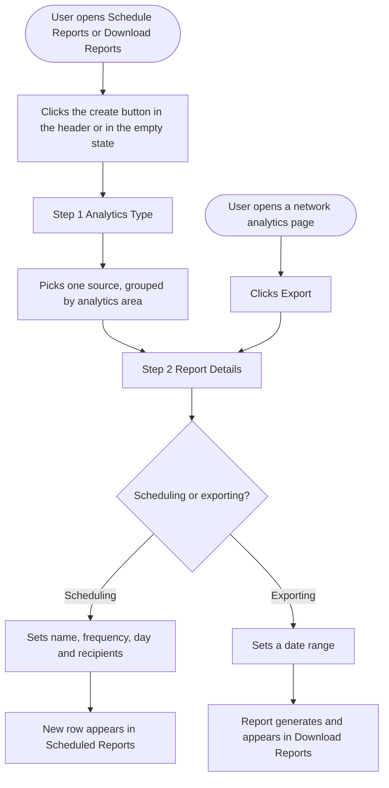

# Epic: Make analytics reports reachable and self-serve

## Epic description

Two things stop people finding and creating analytics reports.

The analytics sidebar opens all seven of its sections at once. That is around 1,076px of navigation in an 818px sidebar on a 900px screen, so **Manage Reports, the last section, sits below the fold and is not visible on ordinary screens**. Nothing remembers what a user collapses, so it is below the fold again on the next visit.

Separately, **a report can only be created from inside a network's analytics page**, behind the Export button. The Schedule Reports and Download Reports pages list reports and let you edit or delete them, but offer no way to make one. A user who goes to Schedule Reports to schedule a report hits a dead end, and the empty state for a brand new workspace says "No reports" with nothing to click.

The two are the same problem seen from either end: the reports area is hard to reach, and useless when you get there.

### Scope

In:

- Sidebar opens with Social Analytics and Manage Reports expanded, everything else collapsed
- Manage Reports moves directly below Social Analytics
- Every expand and collapse is remembered per user
- Schedule Reports and Download Reports each get a create action, in the page header and in the empty state
- The report modal gains a first step for choosing what the report covers
- Export gains a date range, which it needs only when it is not started from an analytics page

Out:

- **Send PDF as Email.** The third creation path has no list page of its own, so it stays reachable only from an analytics page.
- **Bluesky and Threads reports.** Neither has a PDF renderer today, so neither appears as a report source. Threads analytics is being built now and needs its own ticket for this.
- **Moving Reports Settings out of the sidebar.** Worth doing, needs a separate PO decision.

### Stories

1. `[Design] Design the report creation flow and the analytics sidebar default state`
2. `[FE] Remember which analytics sidebar sections each user leaves open`
3. `[FE] Create reports from the Schedule Reports and Download Reports pages`

There is no backend story. The user preferences endpoint accepts any key with no whitelist, so remembering the sidebar state needs no server change, and report creation reuses the payloads that exist today.

---

# [Design] Design the report creation flow and the analytics sidebar default state

### Description

As a designer, I want to define the visual and interaction design for the new first step of the report modal, the two new creation entry points and the analytics sidebar's starting state, so that both build stories in this epic work from one agreed reference and the reports area reads as part of Analytics rather than a patch on top of it.

The report modal has never had a step. It is a single dense form that assumes the user arrived from a page that already answered the most important question. Adding a step in front of it is the one genuinely new piece of interface in this epic, and it decides whether the flow feels considered or bolted on.

---

### Workflow

1. Designer reviews the two existing modals, Export Report and Schedule PDF as Email, and the two reports pages as they stand today.
2. Designer produces the first step, a picker for what the report covers, grouped under the four analytics areas that produce a PDF.
3. Designer produces the step indicator, deciding how two steps are shown without making a short form feel like a wizard.
4. Designer produces the second step's header treatment: the chosen source, the way back to step one, and how both disappear when the modal was opened from an analytics page.
5. Designer places the new Date Range field inside the Export Report form and confirms the field order still reads well at the modal's fixed width.
6. Designer produces the two page header buttons and the two rewritten empty states.
7. Designer produces the sidebar's starting state and confirms the position of Manage Reports.
8. Designer confirms which pieces are built from existing library components and flags anything that is not.

---

### Acceptance criteria

**Report modal, step one**

- [ ] The source picker is designed with four groups: Social Analytics, Competitor Analytics, Ad Analytics, Performance Analytics
- [ ] A group holding nine sources and a group holding one source both read correctly, so the layout does not depend on groups being a similar size
- [ ] Each source is designed with its network icon and name, in a default, hover, selected and disabled state
- [ ] The disabled state covers a source the user's plan or connected accounts do not allow, and shows why on hover
- [ ] The step is designed at the modal's existing width and does not make the modal taller than the Schedule PDF as Email form already is
- [ ] Validation is designed for continuing without a source chosen

**Report modal, step two**

- [ ] The step indicator is designed for both steps, including how a completed step reads and whether it can be clicked to go back
- [ ] The chosen source is designed as a header element above the existing fields, with its way back to step one
- [ ] The same header is designed in its pre-filled form, where the source came from an analytics page and there is no way back, so the flow matches today's for existing users
- [ ] The Date Range field is designed in place within the Export Report form, and the form is shown both with it and without it
- [ ] The Report Type field is shown in its three cases: five options, two options, and absent entirely for Campaign & Label
- [ ] The existing fields, labels and order are unchanged, and the design says so explicitly so no copy drifts during build

**Reports pages**

- [ ] The Scheduled Reports and Download Reports page headers are designed with their new primary button, alongside the existing filter and search controls
- [ ] Both headers are shown wrapping at tablet width without the button dropping out of reach
- [ ] Both empty states are designed with an icon, headline, subtext and primary button, replacing today's icon and single line of text
- [ ] The disabled state of both buttons is designed for users whose plan does not include exports and scheduled reports, matching the existing Export button treatment
- [ ] Loading and error states are designed for both pages

**Analytics sidebar**

- [ ] The sidebar's starting state is designed with Social Analytics and Manage Reports expanded and the other five collapsed
- [ ] Manage Reports is placed directly below Social Analytics, and the design shows the full order of all seven sections
- [ ] The design is shown at 768px and 900px viewport heights, confirming that Schedule Reports, Download Reports and Reports Settings are reachable without scrolling in both
- [ ] The collapsed and expanded heading treatments are unchanged from today

**Across everything**

- [ ] The design names the existing library component behind each element, and flags anything that has no component today
- [ ] Designs use theme aware primary colours so white label workspaces render correctly, with no hardcoded colour values
- [ ] Every new string in the design matches the copy agreed in **[FE] Create reports from the Schedule Reports and Download Reports pages**, and any change to that copy is made in both places

---

### Mock-ups

This story produces them.

An interactive prototype already exists and is the agreed reference for **behaviour**: which options appear where, what changes when the source changes, and what each state does. It is not the visual specification.

**https://claude.ai/artifact/4rw8PgVAEDK8SzURBQ42bc**

---

### Impact on existing data

None.

---

### Impact on other products

None. Neither the mobile app nor the Chrome extension has an analytics sidebar or a report creation surface.

---

### Dependencies

None. This story blocks **[FE] Create reports from the Schedule Reports and Download Reports pages** and should be agreed before **[FE] Remember which analytics sidebar sections each user leaves open** starts, since that story changes the order of the sidebar.

---

### Global quality & compliance (wherever applicable)

- [ ] Mobile responsiveness (frontend only, N/A for backend-only stories)
- [ ] Multilingual support (frontend + backend, translations available or fallback handled)
- [ ] UI theming support (default + white-label, design library components are being used)
- [ ] White-label domains impact review
- [ ] Cross-product impact assessment (web, mobile apps, Chrome extension)

---
---

# [FE] Remember which analytics sidebar sections each user leaves open

### Description

As a ContentStudio user working in Analytics, I want the sidebar to open showing only the sections I actually use, and to stay exactly as I left it, so that Manage Reports and my networks are reachable without scrolling the sidebar every single visit.

Today all seven sections open at once and nothing is remembered, so Manage Reports falls below the fold on any screen shorter than about 1,050px and has to be scrolled to every time.

---

### Workflow

1. User opens Analytics for the first time after this ships. The sidebar shows all seven section headings. **Social Analytics** and **Manage Reports** are expanded. **Ad Analytics**, **Competitor Analytics**, **Performance Analytics**, **Web Analytics** and **Data Studio** are collapsed to their headings.
2. Manage Reports sits directly below Social Analytics, so Schedule Reports, Download Reports and Reports Settings are visible without scrolling.
3. User clicks the **Ad Analytics** heading. It expands and Meta Ads and Google Ads appear.
4. User clicks the **Social Analytics** heading. It collapses to its heading.
5. User moves around Analytics, reloads the page, signs out and signs back in, or opens ContentStudio on another computer. The sidebar comes back with Ad Analytics and Manage Reports expanded and Social Analytics collapsed, exactly as left.
6. User switches workspace. The sidebar keeps the same expanded and collapsed sections, because this is a personal preference rather than a workspace setting.

---

### Acceptance criteria

- [ ] On a user's first visit to Analytics after release, Social Analytics and Manage Reports are expanded and Ad Analytics, Competitor Analytics, Performance Analytics, Web Analytics and Data Studio are collapsed
- [ ] Manage Reports appears directly below Social Analytics and above Ad Analytics
- [ ] At a 768px viewport height with the default state, Schedule Reports, Download Reports and Reports Settings are all fully visible without scrolling the sidebar
- [ ] Expanding a section keeps it expanded for that user on the next visit
- [ ] Collapsing a section keeps it collapsed for that user on the next visit
- [ ] The remembered state survives a full page reload, a sign out and sign in, and opening ContentStudio in a different browser or on a different device
- [ ] Switching workspace does not reset the remembered state
- [ ] A user can have any number of sections expanded at once, including all seven
- [ ] A user can collapse every section, and all seven are still collapsed on the next visit
- [ ] If the saved state cannot be read, the sidebar falls back to the default expanded set and no error message is shown to the user
- [ ] Sections that are already hidden for a user stay hidden and are not counted: sample workspaces hide Competitor Analytics, Performance Analytics, Web Analytics, Data Studio and Manage Reports, and Ad Analytics is hidden when the user has no visible ad route
- [ ] Expanding or collapsing a section fires no Usermaven event, in line with the convention that sidebar toggles are not tracked
- [ ] Section headings keep their current labels and their current translations in all supported languages

---

### Mock-ups

Final designs come from **[Design] Design the report creation flow and the analytics sidebar default state**. The interactive prototype below is the behaviour reference.

Interactive prototype: **https://claude.ai/artifact/4rw8PgVAEDK8SzURBQ42bc**

Set **Sidebar** to *Proposed* and **Screen** to *768p*. The fit meter above the frame measures the live sidebar and reports how much content there is against how much room there is. Collapse a section, reload the page, and it comes back the way you left it.

No new UI copy is introduced by this story. Section headings, nav labels and icons are unchanged.

---

### Impact on existing data

Adds one user level preference storing which analytics sidebar sections are expanded. Nothing is migrated. Existing users see the new default the first time they open Analytics after release, and their own choices are saved from that point on.

---

### Impact on other products

None. The mobile app has no analytics sidebar and the Chrome extension has no analytics area.

---

### Dependencies

Depends on **[Design] Design the report creation flow and the analytics sidebar default state** for the agreed section order and starting state. Does not block **[FE] Create reports from the Schedule Reports and Download Reports pages**.

---

### Global quality & compliance (wherever applicable)

- [ ] Mobile responsiveness (frontend only, N/A for backend-only stories)
- [ ] Multilingual support (frontend + backend, translations available or fallback handled)
- [ ] UI theming support (default + white-label, design library components are being used)
- [ ] White-label domains impact review
- [ ] Cross-product impact assessment (web, mobile apps, Chrome extension)

---
---

# [FE] Create reports from the Schedule Reports and Download Reports pages

### Description

As a ContentStudio user, I want to schedule a report or export a PDF directly from the Schedule Reports and Download Reports pages, so that I do not have to already know that the only way to create one is hidden behind the Export button on a network's analytics page.

Today both pages only list what already exists. The report modal cannot be opened on its own because it has no way to ask what the report should cover, and every other field depends on that answer. This story adds that first step and the two entry points it unlocks.

---

### Workflow

1. User goes to **Analytics → Manage Reports → Schedule Reports** and clicks **Schedule a new report** in the page header. On a brand new workspace the list is empty and the same action is offered in the middle of the empty state.
2. The **Schedule PDF as Email** modal opens on step one, **Analytics Type**. The user sees every report source grouped under its analytics area: Social Analytics, Competitor Analytics, Ad Analytics and Performance Analytics.
3. User picks **Facebook** and clicks **Continue**.
4. Step two, **Report Details**, opens. A chip at the top reads "Social Analytics · Facebook" with a **Change** link back to step one. The rest of the form is the one that exists today: Export Name, Report Language, Report Type, Social Accounts, Sections to include, Schedule Frequency, the day picker, the plain English summary of what will be sent, the save as default checkbox and the recipient list.
5. Report Type offers the two detailed insights layouts, because Facebook is a single network. Sections to include shows "13 of 13 sections selected", because Facebook has 13.
6. User fills in the form and clicks **Schedule**. The modal closes and the new report appears at the top of the Scheduled Reports list.
7. The same user goes to **Download Reports** and clicks **Export a new report**. The **Export Report** modal opens on the same first step.
8. This time the user picks **Overview**, and Report Type offers five layouts instead of two, because the three overview layouts only apply to a report covering all accounts.
9. Because the user started from the reports page rather than an analytics page, step two includes a **Date Range** the user sets themselves. It defaults to the last 30 days.
10. User clicks **Export**. The report is generated in the background and appears in the Download Reports list.
11. Nothing changes for a user who starts from an analytics page. Clicking **Export** there opens the modal straight on step two with the source already filled in from the page, and the date range taken from the page's own date picker.

---

### Acceptance criteria

**Entry points**

- [ ] The Scheduled Reports page header has a primary button labelled "Schedule a new report"
- [ ] The Download Reports page header has a primary button labelled "Export a new report"
- [ ] Both empty states offer the same action as a primary button, replacing today's icon and "No reports" text
- [ ] Both buttons are disabled with the existing upgrade tooltip for users whose plan does not include exports and scheduled reports, matching how the Export button behaves on analytics pages today

**Step one: Analytics Type**

- [ ] The modal opens on a first step titled "Analytics Type" when started from either reports page
- [ ] Sources are grouped under four headings: Social Analytics, Competitor Analytics, Ad Analytics, Performance Analytics
- [ ] Social Analytics lists Overview, Facebook, Instagram, X (Twitter), LinkedIn, TikTok, YouTube, Pinterest and Google Business
- [ ] Competitor Analytics lists Facebook Competitors and Instagram Competitors
- [ ] Ad Analytics lists Meta Ads and Google Ads
- [ ] Performance Analytics lists Campaign & Label
- [ ] Bluesky, Threads, Usermaven and Data Studio do not appear as sources, because no PDF report exists for them
- [ ] Only sources the user's plan and connected accounts allow are listed
- [ ] Continue is disabled until a source is picked
- [ ] Picking a different source resets the report type, account and section choices made against the previous one

**Step two: Report Details**

- [ ] The second step is titled "Report Details" and shows a chip with the chosen area and source, plus a "Change" link back to step one
- [ ] The step two fields are unchanged from today for both modals, including their labels, placeholders and order
- [ ] Report Type lists five layouts when the source is Overview: "Grouped overview report (single PDF)", "Individual overview reports (single PDF)", "Individual overview reports (separate PDFs)", "Detailed insights report (single PDF)" and "Detailed insights reports (separate PDFs)"
- [ ] Report Type lists only the two detailed insights layouts for any single network, competitor or ads source
- [ ] The Report Type field is not shown at all when the source is Campaign & Label
- [ ] Social Accounts lists only accounts belonging to the chosen source
- [ ] Sections to include lists that source's own sections and opens with all of them selected, and the field summarises the count, for example "13 of 13 sections selected"
- [ ] Selecting every section produces the same report as today's full export, with no change to the generated PDF
- [ ] Validation on submit uses the existing messages: "Please select a report type" and "Please select at least one account"

**Date range, Export only**

- [ ] The Export Report modal shows a Date Range field when it was opened from the Download Reports page
- [ ] The Date Range defaults to the last 30 days
- [ ] The Date Range field is not shown when the modal was opened from an analytics page, where the page's own date range is used instead
- [ ] The Schedule PDF as Email modal has no Date Range field, because a scheduled report always covers the period ending on its send date

**Opened from an analytics page**

- [ ] Clicking Export on any analytics page opens the modal directly on Report Details with the source already set from that page
- [ ] The Back control and the Change link are not offered in that case, so the flow is identical to today
- [ ] Reports created this way are unchanged in content, file name and delivery

**After creating**

- [ ] A newly scheduled report appears at the top of the Scheduled Reports list without a page refresh
- [ ] A newly exported report appears in the Download Reports list with its status, without a page refresh
- [ ] If creation fails, the modal stays open with the user's choices intact and shows the existing "Something went wrong" message
- [ ] The lists show their existing skeleton loading state while fetching

**Tracking**

- [ ] On successful creation an `analytics_report_created` Usermaven event fires with `{ source, report_type, entry_point }`, where `entry_point` is `reports_page` or `analytics_page`

---

### Mock-ups

Final designs come from **[Design] Design the report creation flow and the analytics sidebar default state**. The interactive prototype below is the behaviour reference.

Interactive prototype: **https://claude.ai/artifact/4rw8PgVAEDK8SzURBQ42bc**

Click **Schedule a new report** and **Export a new report** to walk both flows. Switch **Data** to *First time* to see the empty states. Click any network in the sidebar and then **Export** on that page to see the pre-filled path that must not change. Pick Overview and then Facebook in step one to see Report Type change from five options to two.

#### New UI copy

**Page header buttons**

| Page | Button label |
|---|---|
| Scheduled Reports | Schedule a new report |
| Download Reports | Export a new report |

**Scheduled Reports empty state**

- Headline: "No scheduled reports yet"
- Subtext: "Choose what the report covers and which accounts to include, then set how often it is sent and who receives it."
- Button: "Schedule a new report"

**Download Reports empty state**

- Headline: "No reports exported yet"
- Subtext: "Choose what the report covers, which accounts to include and a date range. The PDF is built in the background and lands in this list when it is ready."
- Button: "Export a new report"

**Modal steps**

| Step | Label |
|---|---|
| 1 | Analytics Type |
| 2 | Report Details |

**Step one**

- Group headings: "Social Analytics", "Competitor Analytics", "Ad Analytics", "Performance Analytics"
- Primary button: "Continue"
- Validation on attempting to continue with nothing picked: "Please choose what the report covers"

**Step two**

- Source chip: the area name, then the source name, for example "Social Analytics · Facebook"
- Link beside the chip: "Change"
- Secondary button: "Back"
- New field label: "Date Range"

All existing modal titles, field labels, placeholders and buttons stay exactly as they are: "Export Report", "Schedule PDF as Email", "Export Name", "Enter a name for export...", "Report Language", "Report Type", "Select Report Type", "Social Accounts", "Sections to include", "Schedule Frequency", "Choose a Day", "Save as my default for future reports", "Email To (Separate emails with a comma)", "Enter up to 25 email address...", "Send a copy to myself", "Learn more", "Export", "Schedule".

#### Components

Use existing components: `Button`, `Dropdown` and `DropdownItem`, `Checkbox`, `Modal`, `SearchInput`. Reuse the existing analytics date range picker for the new Date Range field and the existing report section picker for Sections to include. No new component is required.

---

### Impact on existing data

None. No schema change and no migration. Reports created through the new entry point are the same shape as reports created today, and a full section selection produces a byte identical PDF to the current export.

---

### Impact on other products

None. The mobile app and the Chrome extension have no report creation surface.

---

### Dependencies

Depends on **[Design] Design the report creation flow and the analytics sidebar default state**. Does not depend on **[FE] Remember which analytics sidebar sections each user leaves open**, though that story is what makes these two pages easy to reach in the first place.

---

### Global quality & compliance (wherever applicable)

- [ ] Mobile responsiveness (frontend only, N/A for backend-only stories)
- [ ] Multilingual support (frontend + backend, translations available or fallback handled)
- [ ] UI theming support (default + white-label, design library components are being used)
- [ ] White-label domains impact review
- [ ] Cross-product impact assessment (web, mobile apps, Chrome extension)
