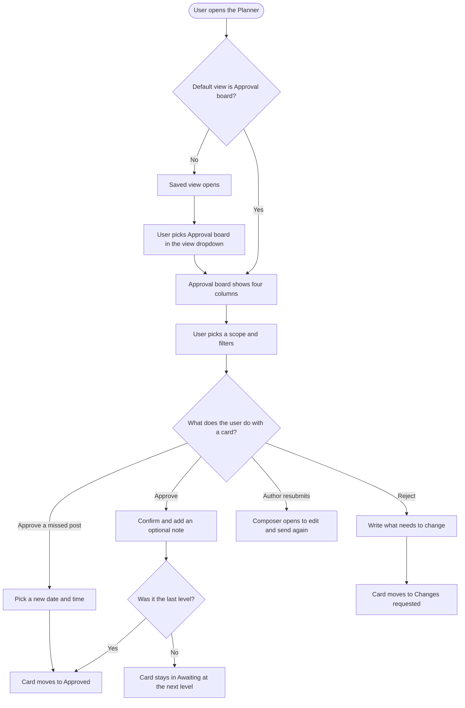
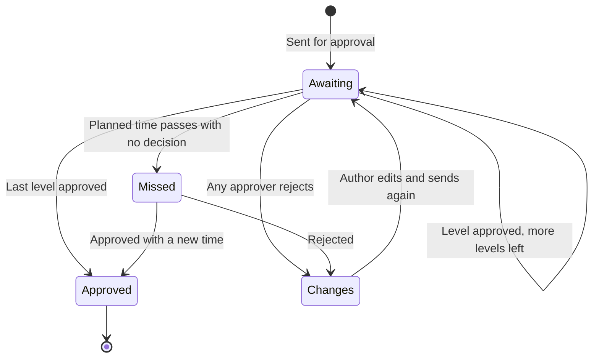

# Approval Board: Workflow Design

**Design canvas:** https://claude.ai/artifact/ACAtyDsDKYbBGc31FyY69e

---

## 1. Feature Placement

- **Where it lives:** Publisher → Planner, as a new view called **Approval board**.
- **How you get there:**
  - **The view dropdown** at the top right of the Planner header, the one that currently reads "Feed", "List" and so on. Approval board is the last entry and carries a **New** tag for the first 30 days.
  - **Default landing view for new approvers.** A user created as an approver lands on Approval board when they open the Planner.
  - **Any user who picks Approval board once.** The Planner already remembers the last view picked, so it becomes their default.
  - **The in-app announcement** for existing users. A popover on the view dropdown, shown once, with "Try Approval board".
  - **Approval notifications,** but only for users whose default view is Approval board (see Decision 6).
- **What's on the page:**
  - It sits inside the existing Planner shell: same left sidebar, same header with Filters, Accounts, date range, Search, Share and the view dropdown.
  - Below the header: a scope switch (Assigned to me / Requested by me / All approvals), a "N waiting on you" summary, and a hint: "Drag a card to approve it or request changes".
  - Then four columns: Awaiting approval, Missed review, Changes requested, Approved.

## 2. Workflow Diagram (Overview)

### Card states

## 3. User Flow (Happy Path)

**Approver, from a new notification**

1. Sara (an approver) opens the Planner. Her default is Approval board, so it opens with scope **Assigned to me**.
2. The header reads "3 waiting on you". Awaiting approval shows her cards first, each marked **Your turn**. Below them are cards waiting on an earlier level ("Waiting on Level 1: Brand review. Your turn comes at Level 3.").
3. She clicks a card's caption, and the existing post preview opens (the same preview Feed and List use).
4. She drags the card to **Approved**. The dialog "Approve this post?" reads "This approves Level 2: Legal. The post then moves to Level 3: Client sign-off." She adds an optional note and clicks **Approve post**.
5. The card stays in Awaiting, now showing "Level 3 of 3: Client sign-off", without the Your turn badge. A toast confirms: "Level 2 approved. Now waiting on Level 3: Client sign-off."
6. She drags another card, on its last level, to Approved and confirms. It moves to **Approved** as "Scheduled for Oct 4, 10:00 AM".
7. She clicks **Approve all** on Awaiting approval. "Approve 2 posts?" lists what happens. She confirms, and each post moves on or into Approved.

**Submitter, checking on their posts**

1. Bilal switches the scope to **Requested by me**.
2. He sees 1 Awaiting card, 1 in Changes requested ("Changes requested by Ahmed Raza: Please swap the hero image...") and 2 in Approved. One of those reads "Approved, not scheduled yet" because it was sent for approval as a draft.
3. He clicks **Edit and resubmit** on the rejected card (or drags it to Awaiting approval). The Composer opens, he fixes the image, and sends it for approval again. Back on the board, the card is in Awaiting at Level 1.
4. On the approved draft he clicks **Schedule post**, and the existing scheduling options open.

## 4. Alternative Flows

| # | Situation | What the user sees |
|---|---|---|
| A1 | **Missed review.** The planned time passed while the post waited for approval | Card in Missed review, time in red ("Was due Sep 30, 10:00 AM") and a "Time passed" badge. Approving it, by drag or button, opens "Pick a new time". Both date and time are required, and only future times are allowed |
| A2 | **Reject without a note** | The "Reject post" button shows "Add a note so the author knows what to change." The post doesn't move |
| A3 | **Author approves their own post** | Card shows "You created this post, so you can approve it yourself." The confirm dialog adds "You created this post, so your approval completes Level 1 for all of its approvers." |
| A4 | **Dragging to a column the user isn't allowed to drop on** | Columns the card can't go to fade while dragging, and dropping there does nothing (the card snaps back). For example, a collaborator who isn't an approver can't drop into Approved, and nothing can be dragged out of Approved |
| A5 | **The card changed since the board loaded** (someone else approved or rejected it) | The action fails with the toast "This post was updated by someone else. We refreshed the board so you see its latest status." The board reloads that card |
| A6 | **Server error on approve or reject** | The card goes back where it was. Toast: "We couldn't save that. Please try again." |
| A7 | **A column is empty** | A one-line message per column, for example "No posts awaiting approval" or "No approved posts in this date range" |
| A8 | **The whole board is empty for this scope and filters** | Empty state across the board, with a "Clear filters" CTA when filters are on, or "Set up an approval workflow" for admins when the workspace has none |
| A9 | **Loading** | Each column shows 3 skeleton cards. Scrolling to the bottom of a column loads more |
| A10 | **Phone width** | The columns become tabs with counts. Dragging is off, and the Approve and Reject buttons are the way to act |
| A11 | **Approver without permission to edit posts** | No "Edit and resubmit" button. Changes requested cards are view-only for them |
| A12 | **External approver approves through a share link** | On the team board the card moves the next time the board refreshes. On the share page the client has their own 3-column Approval board. A missed post they approve shows on the team board as "Approved, needs a new time" |
| A13 | **Legacy single-level approval** (no workflow) | Card shows "Level 1 of 1". "Anyone" vs "everyone" rules work exactly as today |
| A14 | **A post not in approval at all** | Never appears on the board |

## 5. Key Design Decisions

### Decision 1: What happens on drop
- **Option A: Instant action plus an undo toast** (the competitor pattern). Fast, but a last-level approval schedules the post and can't be revoked, so an undo can't be honoured.
- **Option B: A confirm dialog on every drop** *(recommended)*. One extra click, but it shows exactly what will happen (next level, or the scheduled time) and collects the note.
- **Option C:** Instant for non-final levels, confirm for final. Inconsistent, and users can't predict it.

**Recommendation: B.** The dialog is also where the optional approval note and the required rejection note go.

### Decision 2: How columns load
- **Option A:** One request that returns every approval post, split into columns in the browser. Simple, but it breaks with large workspaces (an Approved column over a month can hold hundreds of posts).
- **Option B: Each column loads and pages on its own, plus one counts request** that follows scope and filters *(recommended)*.

**Recommendation: B.**

### Decision 3: The Status filter on this view
- **Option A:** Keep the Status filter and let it hide columns.
- **Option B: Hide the Status filter on Approval board** *(recommended)*. The columns already are the statuses, and having both is confusing. All other filters (accounts, labels, campaigns, content categories, members, post type) apply as usual.

**Recommendation: B.**

### Decision 4: What Approve all covers
- **Option A:** Every card in the Awaiting column.
- **Option B: Only the cards in Awaiting that are your turn**, within the current scope and filters *(recommended)*. Approve all is never an override.

**Recommendation: B.** The button only shows when 2 or more posts are your turn.

### Decision 5: The default saved views "My Pending Approvals" and "My Approval Requests"
- **Option A:** Leave both on Feed for everyone.
- **Option B: New workspaces get both on Approval board. Existing workspaces keep theirs unchanged** *(recommended)*. This follows D9: no surprise changes for existing users.

**Recommendation: B.**

### Decision 6: Where approval notifications land
- **Option A:** Unchanged for everyone (Feed with the single post).
- **Option B: Users whose default view is Approval board land there**, with the post's preview open and its card highlighted. Everyone else is unchanged *(recommended)*.

**Recommendation: B.** It respects the user's own choice and doesn't change anything for existing users.

## 6. Integration with Existing Features

| Feature | How it connects |
|---|---|
| **Planner filters, date range, search, saved views, Share** | Apply on the board the same way they do on other views. A saved custom view can store Approval board as its view type |
| **Post preview** | Clicking a card opens the existing preview, with comments, approval history and the existing approve and reject actions |
| **Composer** | "Edit and resubmit" and dragging from Changes requested to Awaiting approval open the existing Composer for that post. "Send for approval" works exactly as today |
| **Approval workflows** (Settings) | Level names, rules (anyone/everyone) and members come from the saved workflow. Nothing changes in the workflow builder |
| **Legacy approvals** | Supported as single-level cards |
| **Missed review email and notification** | Unchanged in v1 |
| **Bell notification panel** | Follows Decision 6 |
| **Approver role** | Approval board is added to the routes approvers can open. New approvers get it as their default |
| **Share links for external approval** | The share page gets its own Approval board with 3 columns. Client decisions show up on the team board, and a missed post a client approved shows as "Approved, needs a new time" |
| **Public API / CLI / MCP** | The posts list gains an "approved" status filter so the same columns can be rebuilt from the API. Approve and reject already exist there |
| **Flutter app** | Out of scope. No change |

## 7. Trackable Actions (Usermaven candidates)

No planner or approval events exist today, and visits to the new view are already counted by the global `pageview` event.

| Candidate event | Trigger | Why |
|---|---|---|
| `post_approved` | User approves a post from Approval board (drag, button or confirm dialog) | Approval volume, and drag vs button use |
| `post_rejected` | User rejects a post from Approval board | Rejection rate and note quality |
| `posts_bulk_approved` | User confirms Approve all | Bulk use and batch size |
| `approval_board_announcement_actioned` | Existing user clicks "Try Approval board" or "Not now" | Announcement conversion. Optional, the PO decides |

Payload proposals are in PRD §3.1.

## 8. Scope Recommendation

**v1**
- The Approval board view and the view dropdown entry
- Four columns with counts, each loading and paging on its own
- Scope switch
- Cards with level progress, Your turn, outcome and requester
- Drag and drop with allowed and blocked columns, plus button equivalents
- Approve, reject, missed-review and Approve all dialogs
- Approve all fixed for workflow posts on the backend
- Approved status filter, also on the public API
- Default for new approvers, and the approver route access
- Announcement for existing users
- Saved-view defaults for new workspaces
- Notification landing (Decision 6)
- Phone-width tabs
- The client share-link board: a third view next to List and Calendar, with 3 columns (Awaiting approval, Changes requested, Approved). Missed posts stay in Awaiting with a "Time passed" badge, dragging needs approval actions on the link, and view-only links are read-only
- Empty, error and loading states
- Usermaven events
- A [Design] story

**v2 (deferred)**
- Live refresh when someone else acts (Socket.IO)
- Collapsible columns
- "Review N posts" step-through mode
- Right-click quick actions
- A board across all workspaces
- Grouping by workflow level when filtered to one workflow
- Fixing "Requested by me" to match the submitter instead of the last editor, unless the PO wants that in v1 (see PRD open questions)
