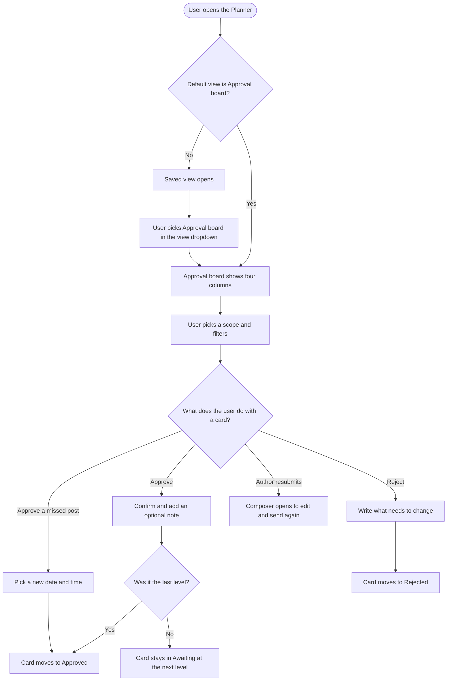

# **PRD: Approval Board**

**Author:** Ghulam Jaffar
**Last Updated:** 2026-10-02
**Status:** In Review
**Target Release:** Q4 2026

---

## **1\. Overview**

Approval board is a new Planner view that shows every post going through approval as a card on a kanban board. There are four columns: Awaiting approval, Missed review, Rejected and Approved.

- **Approvers** see at a glance what is waiting on them, and approve or request changes by dragging a card or clicking a button.
- **Authors** see where each post they sent is stuck.
- **Admins** see the whole team's approval pipeline.

Clients reviewing through a share link get the same board on their share page, with three columns: Awaiting approval, Rejected and Approved.

It works with both single-level approvals and multi-level approval workflows. Each card shows its level and progress, and a post stays in Awaiting until its last level is approved. Today approvals are scattered across the Feed and List views, so the board turns ContentStudio's approval workflows into one visible queue. It also puts us level with Planable and Sked Social, and ahead of both on missed reviews and multi-level progress.

---

## **2\. Problem Statement**

**What problem are we solving?**

ContentStudio has strong approval mechanics (multi-level workflows, anyone/everyone rules, external approvers) but no place to *see* approvals as a pipeline:

- **Approvers** land on the Feed view from a notification and have to combine status filters with "assigned to me" to find their queue. Nothing tells them which posts are their turn and which are waiting on an earlier level.
- **Authors** can't see at a glance how many of their posts are approved, rejected, stuck or missed.
- **Missed reviews**, where the planned time passed with no decision, are only visible through a status filter or the review-missed email. These posts silently don't publish.
- **Bulk approve doesn't work for multi-level workflows.** It only enables with an exact `under_review` filter, and on the backend it only understands the older single-level approvals, so workflow posts skip their levels.

**Who has this problem?**

- **Agencies and teams** that use approval workflows: approvers (clients, managers, legal), collaborators who need approval, and admins.
- Every workspace with at least one saved approval workflow, or with legacy approvers on posts.
- They hit it every time a post is sent for approval.

**What happens if we don't solve it?**

- **Competitive gap:** Planable (approvals board), Sked Social (Approvals Board, launched August 2026) and Kontentino (status board) all offer a board. Agencies compare on approval UX.
- **Lost posts:** more missed reviews, which mean posts that never go out.
- **Support load:** "where are my approvals" questions keep coming in.
- **Silent data bug:** Approve all on workflow posts keeps skipping their levels.

---

## **3\. Goals & Success Metrics**

| Goal | Metric | Target | How We'll Measure |
| ----- | ----- | ----- | ----- |
| Faster approval decisions | Median time from "sent for approval" to final decision, workspaces using the board | -30% within 90 days of release | Approval workflow history timestamps (submitted_at vs last level action) |
| Fewer posts lost to missed review | Missed reviews per active approval workspace per month | -25% within 90 days | Posts entering missed review (review-missed job) |
| Adoption | Share of approvers whose default Planner view is Approval board | 40% of active approvers within 60 days | User `planner_default_view` values |
| Adoption, existing users | Existing users who switch to Approval board after the announcement | 20% of users shown the announcement | `approval_board_announcement_actioned` plus default-view data |
| Guard rail: no accidental approvals | Revoke-approval rate | No increase from the pre-release baseline | Revoke actions in approval history |
| Guard rail: workflow integrity | Workflow posts scheduled without every level completed | 0 | Backend audit query after the bulk-approve fix |

### **3.1 Analytics Events (Usermaven)**

All events are sent from the frontend and fire after the server confirms success.

| Event Name | Trigger | Payload | What we measure with it |
| ----- | ----- | ----- | ----- |
| `post_approved` | User confirms an approval from Approval board (drag or card button) | `{ source: 'approval_board', method: 'drag' \| 'button', approval_type: 'workflow' \| 'legacy', is_final_level: boolean, was_missed_review: boolean }` | Approval volume from the board, drag vs button use, share of missed posts rescued |
| `post_rejected` | User confirms a rejection from Approval board | `{ source: 'approval_board', method: 'drag' \| 'button', approval_type: 'workflow' \| 'legacy' }` | Rejection rate from the board |
| `posts_bulk_approved` | User confirms Approve all on Approval board | `{ source: 'approval_board', number_of_posts: number }` | Bulk approval use and batch size |
| `approval_board_announcement_actioned` | Existing user clicks "Try Approval board" or "Not now" on the announcement | `{ action: 'try' \| 'dismiss' }` | Announcement conversion |

Visits to the view itself are already counted by the global `pageview` event on the new route.

---

## **4\. Target Users**

**Primary Persona:**
**Approver** (client, marketing manager, legal reviewer). Often not a daily ContentStudio user, and may log in only through the approver login. Cares about: "what needs me, and can I clear it in two minutes?" Low to medium skill with the tool.

**Secondary Persona:**
- **Client reviewing through a share link** (no ContentStudio login). Cares about: "which of these posts still need my answer, and which did I already approve or send back?"
- **Author / collaborator who needs approval** (content creator, junior marketer). Cares about: "Is my post approved? What came back with changes? What missed its slot?"
- **Workspace admin / agency owner.** Cares about bottlenecks across the team and clients.

**Non-Users (explicitly out of scope):**
- **Mobile app users.** There's no Flutter change.
- **Users who never use approvals.** The board is empty for them, and nothing about their Planner changes.

---

## **5\. User Stories / Jobs to Be Done**

| ID | As a... | I want to... | So that... | Priority |
| ----- | ----- | ----- | ----- | ----- |
| US-1 | Approver | see every post waiting on me in one column, with mine marked "Your turn" | I know exactly what to review first | Must Have |
| US-2 | Approver | drag a card to Approved or Rejected | I can decide in one motion | Must Have |
| US-3 | Approver | approve or reject from buttons on the card | I can act without dragging (keyboard, touch, phone) | Must Have |
| US-4 | Approver | approve all posts that are my turn at once | I can clear a batch quickly | Must Have |
| US-5 | Approver | pick a new time when approving a missed post | the post still goes out instead of being lost | Must Have |
| US-6 | Approver on a multi-level workflow | see which level a post is at and when my turn comes | I understand why a post isn't mine yet | Must Have |
| US-7 | Author | see my posts split by Awaiting, Missed, Rejected and Approved | I know the status of everything I sent | Must Have |
| US-8 | Author | read the rejection note on the card and resubmit from there | I can fix and resend quickly | Must Have |
| US-9 | Author | approve my own post when needed | I'm not blocked when an approver is away (existing behaviour) | Must Have |
| US-10 | Admin | see all approvals in the workspace | I can spot bottlenecks | Must Have |
| US-11 | New approver | land on Approval board the first time I open the Planner | I don't need to know where approvals are | Must Have |
| US-12 | Existing user | be told about the new view without my saved view changing | I can try it on my own terms | Must Have |
| US-13 | User on a phone browser | switch between columns as tabs and approve with buttons | I can approve on the go | Should Have |
| US-14 | Developer using the public API | filter posts by approved status | I can build the same view in my own tools | Should Have |
| US-15 | Client reviewing through a share link | see the shared posts as a board split into Awaiting approval, Rejected and Approved, and drag to approve or request changes | I can review a batch of posts without a ContentStudio account | Must Have |

---

## **6\. Requirements**

### **6.1 Must Have (P0)**

**The view**
- **A new Planner view, "Approval board,"** listed in the view dropdown at the top right, with a "New" tag for the first 30 days after release.
- **Four columns**, each with a live count:

| Column | What it holds |
| ----- | ----- |
| Awaiting approval | Waiting on a decision, time in the future or no time set |
| Missed review | Planned time passed, no decision |
| Rejected | Rejected |
| Approved | Approval complete, within the selected date range, whatever the post status is now |

- **Scope switch:** Assigned to me (the default for approvers), Requested by me (the default for collaborators who need approval), All approvals (the default for admins). Each option shows a count.
- **Cards show:**
  - Account avatars and the planned time (shown in red when missed)
  - A "Your turn" badge, and a level chip such as "Level 2 of 3: Legal"
  - A caption preview of up to 3 lines, and a media thumbnail label
  - A level progress bar
  - The requester, and the comment count
  - The rejection note (in Rejected), or the outcome (in Approved: scheduled, published, or not scheduled yet)
- **Ordering in Awaiting approval:** "Your turn" cards sort first.

**Actions**
- **Drag and drop between columns, with allowed moves only:**

| Move | Who can do it | What happens |
| ----- | ----- | ----- |
| Awaiting approval or Missed review → Approved | Approver on the current level, or the post's author | Approve |
| Awaiting approval or Missed review → Rejected | Approver on the current level, or the post's author | Reject, with a required note |
| Rejected → Awaiting approval | The author only | Opens the Composer |
| Anything out of Approved | Nobody | Not allowed |

  Columns the card can't go to fade while dragging.
- **Every drop opens a confirm dialog** showing the outcome (the next level, or the scheduled time). Approving a missed post requires a new future date and time.
- **Card buttons** with the same actions: Approve, Reject, Edit and resubmit, Schedule post.
- **Approve all** on Awaiting approval: approves only "Your turn" posts within the current scope and filters. Shown only when there are 2 or more.
- **Multi-level workflows are respected everywhere** (single, drag, bulk). Approving a non-final level moves the post to the next level, it never schedules it. Fix the bulk approve and reject backend so workflow posts go through their levels.
- **Authors can still approve their own posts**, which completes the current level (existing behaviour).

**Data and filters**
- **Each column loads and pages on its own**, and one counts request follows scope and filters.
- **Every existing Planner filter applies except Status**, which is hidden on this view. That covers accounts, labels, campaigns, content categories, members, post type, date range and search.
- **Stale actions are caught.** If the post changed since the board loaded, the action fails with a clear message and the card refreshes.

**Access, defaults and announcement**
- **Approvers can open Approval board** (it's added to their allowed views).
- **New approvers default to Approval board.** This only applies when the user has no saved Planner view.
- **Existing users' saved views are never changed.** They see a one-time announcement popover on the view dropdown instead.
- **Empty, error and loading states** for each column and for the whole board.
- **Usermaven events** as listed in §3.1.

**Client share-link board**
- **The share-link page gets a third view, "Approval board,"** next to List and Calendar, with three columns:
  - **Awaiting approval:** includes posts whose time has passed, marked "Time passed"
  - **Rejected**
  - **Approved**
- **Dragging follows the link's settings.** On links where approval actions are on, the client can drag Awaiting approval → Approved (approve, optional comment) or Awaiting approval → Rejected (reject, required comment). Card buttons do the same. Nothing moves out of Approved or Rejected.
- **View-only links** show the board read-only, with no drag and no buttons.
- **Columns reflect the client's own decision** on each post, so one client's choice doesn't hide a post another client still has to answer.
- **Missed posts on the team board.** A post a client approved after its time passed shows in the team's Approved column as "Approved, needs a new time" with a Schedule post button.

### **6.2 Should Have (P1)**

- **Phone-width layout:** columns become tabs with counts, and buttons replace dragging.
- **The default saved views "My Pending Approvals" and "My Approval Requests"** use Approval board in **new** workspaces.
- **Approval notifications** (bell panel and its "Open planner" link) open Approval board with the post preview, for users whose default view is Approval board.
- **The public API posts list** accepts an `approved` status filter, which the CLI and MCP `fetch_posts` pick up.

### **6.3 Nice to Have (P2)**

- **Live refresh** when someone else approves, rejects or edits a post on the board.
- **Collapsible columns.**
- **A "Review N posts" step-through mode** from Awaiting approval.

### **6.4 Explicitly Out of Scope**

- **A general post-status kanban** (Draft, Scheduled, Published, Failed).
- **Custom columns.**
- **Ideas kanban** (Publer-style).
- **A board across all workspaces.**
- **Grouping by workflow level.**
- **Flutter app changes.**
- **Deadline or due-date fields on approvals.** None exist today.
- **Changing the review-missed email link.**
- **Changing who can approve.** Permissions stay exactly as they are today.

---

## **7\. User Flow (High Level)**

1. The user opens the Planner. New approvers, and anyone who picked it before, land on Approval board. Everyone else picks it from the view dropdown.
2. The user picks a scope (Assigned to me / Requested by me / All approvals) and any filters.
3. The board loads four columns with counts. "Your turn" cards sort first.
4. The user drags a card, or clicks a card button, and confirms in the dialog.
5. The card moves (to the next level, Approved, or Rejected), the counts update, and a toast confirms.
6. Authors resubmit from Rejected through the Composer, and schedule approved drafts from the card.

The card state diagram is in the workflow document (section 2, "Card states").

---

## **8\. Business Rules & Constraints**

| Rule ID | Rule | Rationale |
| ----- | ----- | ----- |
| BR-1 | A post appears on the board only if it has approvers (legacy) or an approval workflow | The board is for approvals only |
| BR-2 | **Awaiting approval:** pending, partially approved, or a draft pending approval, with a future time or no time | Matches today's "under review" logic |
| BR-3 | **Missed review:** still under review and the planned time has passed | Matches today's "missed review" logic |
| BR-4 | **Rejected:** rejected by any approver at any level | Any single rejection rejects the post (existing rule) |
| BR-5 | **Approved:** approval complete. Listed if its planned time (or approval time, for drafts with no time) falls in the selected date range | Keeps the column bounded (PO decision D8) |
| BR-6 | **Assigned to me:** posts where I'm a member of any level, or a legacy approver, whatever my status | Lets me see posts before my turn and after I've acted |
| BR-7 | **Requested by me:** posts I sent for approval | Same as the existing "My Approval Requests" filter |
| BR-8 | **"Your turn":** I'm a pending member of the post's current level, or a pending legacy approver | Tells me what needs me now |
| BR-9 | **Who can approve or reject:** an approver on the current level, or the post's author. Admins without one of those roles can't act from the board | Same permissions as today. Author self-approval is kept (D6) |
| BR-10 | **Approving a non-final level moves the post to the next level.** Approving the final level schedules the post at its planned time, or leaves it a draft if it was a draft | Existing workflow engine behaviour |
| BR-11 | **Approving a missed post requires a new date and time in the future** | Otherwise it would publish immediately or fail |
| BR-12 | **Rejecting requires a note** | The author needs to know what to change |
| BR-13 | **Nothing can be moved out of Approved** | Revoke isn't allowed once fully approved |
| BR-14 | **Only the author can move a post from Rejected to Awaiting**, and only by editing it in the Composer | Resubmitting means changing the post |
| BR-15 | **Approve all only approves "Your turn" posts** in the current scope and filters | Bulk is never an override |
| BR-16 | **Bulk approve and reject run every workflow post through its levels**, the same as a single approval | Fixes today's level-skipping bug |
| BR-17 | **A new approver's default Planner view is Approval board**, but only if they have no saved view | No surprise changes for existing users (D9) |
| BR-18 | **The Status filter is hidden on Approval board.** All other filters apply | The columns already are the statuses |
| BR-19 | **An action on a post that changed since the board loaded is rejected** with a clear message, and the card refreshes | No acting on stale information |
| BR-20 | **The client board has 3 columns.** Missed posts sit in Awaiting approval with a "Time passed" badge | Clients can't pick a new publishing time |
| BR-21 | **Client board columns follow that client's own decision** (pending, approved, rejected) | Several clients can share one link and each answers for themselves |
| BR-22 | **Clients can only drag or act when the share link allows approval actions.** Otherwise the board is read-only | Same rule as the share page's list view today |
| BR-23 | **A post a client approved after its time passed** shows on the team board in Approved as "Approved, needs a new time" | Today it silently stays unscheduled |

---

## **9\. Open Questions**

| Question | Options | Owner | Due Date | Decision |
| ----- | ----- | ----- | ----- | ----- |
| Should "Requested by me" match the person who sent the post for approval, instead of the last editor (today's behaviour)? | Keep as-is / Match the submitter | Ghulam Jaffar | 2026-10-09 | Pending. Default: keep as-is in v1 |
| Should admins who aren't approvers be able to approve from the board? | No, same as today / Yes, as an override | Ghulam Jaffar | 2026-10-09 | Pending. Default: no |
| Track the announcement (`approval_board_announcement_actioned`)? | Yes / No | Ghulam Jaffar | 2026-10-09 | Pending. Default: yes |
| How long does the "New" tag on the view dropdown stay? | 30 days / Until first use | Ghulam Jaffar | 2026-10-09 | Pending. Default: 30 days |
| Should the announcement show to users who never use approvals? | Everyone / Only workspaces with approval activity | Ghulam Jaffar | 2026-10-09 | Pending. Default: only workspaces with approval activity in the last 90 days |

---

## **10\. Risks & Mitigations**

| Risk | Likelihood | Impact | Mitigation |
| ----- | ----- | ----- | ----- |
| Accidental approval by drag schedules a post that can't be revoked | Medium | High | A confirm dialog on every drop shows the exact outcome. Track revoke rate as a guard rail |
| Bulk approve skips workflow levels (existing bug) and Approve all makes it more visible | High | High | A BE story routes bulk actions through the workflow engine before Approve all ships |
| Two approvers act on the same post from stale boards | Medium | Medium | The server rejects stale actions, the board refreshes the card, and the toast explains why |
| The Approved column gets slow for busy workspaces | Medium | Medium | Columns page on their own and are bounded by the date range |
| Approvers get bounced to List because the route isn't allowed | High if missed | High | Add the new route to the approver allowlist. QA covers the approver login |
| Release overwrites existing users' default views | Low | High | Set the default only on new approver creation and only when it's empty. Never backfill |
| "Requested by me" shows posts an approver merely edited | Medium | Low | Logged as an open question. Behaviour unchanged from today's filter |
| Drag and drop isn't accessible | Medium | Medium | Every action has a card button. Dragging is off at phone width |
| Client approvals use the older single-level approval, so a client approval on a workflow post doesn't move workflow levels | Medium | Medium | Client board cards show the client's own decision only, with no level progress. Behaviour is unchanged from the share list view today |
| A competitor (Sked, launched August 2026) sets user expectations first | Medium | Medium | Ship the differentiators: Missed review column and multi-level progress |

---

## **11\. Dependencies**

**Internal**
- **Approval workflow engine** (`ApprovalWorkflowBuilder`) and legacy `ApprovalBuilder`, for the single approve and reject path the board reuses (`changePlanStatus` → `maybeRouteThroughWorkflow`).
- **Planner shell, view dropdown and route constants:**
  - `PlannerHeader.vue`
  - `plannerRoutes.ts`
  - `usePlannerViewSwitcher.ts`
  - `getDefaultPlannerRoute`
  - the approver route allowlist in `usePermission.ts`
- **Plans fetch and counts:** `PlansRepository::getV2PlansByFilters` and its route allowlist, and `fetchPlansCounts`, which needs approved and scope-aware counts.
- **The default view preference:**
  - `UserPreferencesController::setPlannerDefaultView`, whose validator needs the new value
  - approver creation in `TeamController::processSingleMemberAddition`
  - `DefaultPlannerViewsService` for the saved-view type
- **The missed-review time picker** (`PublishingTimeFeedView type="missed_reviewed"`) and the post preview.
- **`vuedraggable`**, already installed.
- **The share-link page** (`SharePlans.vue`, `SharePlansControls.vue` view switch, `SharePlansListView.vue`), the public share endpoints (`shareLink/fetchPlans`, `shareLink/action`) and `ExternalApprovalBuilder`.

**External**
- None.

**Blockers**
- **The [Design] story for the card and column.** No kanban or card component exists in `@contentstudio/ui`.
- **The bulk approve fix** must ship with Approve all, or before it.

---

## **12\. Appendix**

- **Design canvas (interactive):** https://claude.ai/artifact/ACAtyDsDKYbBGc31FyY69e. It covers the desktop board, the phone width layout and the announcement.
- **Research:** competitor analysis (Planable, Sked Social, Kontentino, Publer, Metricool and 9 others) and codebase analysis, in the research document.
- **Workflow:** user flows, edge cases A1 to A14, and decisions 1 to 6, in the workflow document.
- **Related:** the multi-tiered approval workflow feature (the existing levels engine), and the public API approval workflows.

---

## **Changelog**

| Date | Author | Changes |
| ----- | ----- | ----- |
| 2026-10-02 | Ghulam Jaffar | Initial draft |
| 2026-10-02 | Ghulam Jaffar | Client share-link board moved into v1 as Must have, with 3 columns |
| 2026-10-05 | Ghulam Jaffar | Renamed the "Changes requested" column to "Rejected", on both the Planner and client boards |
