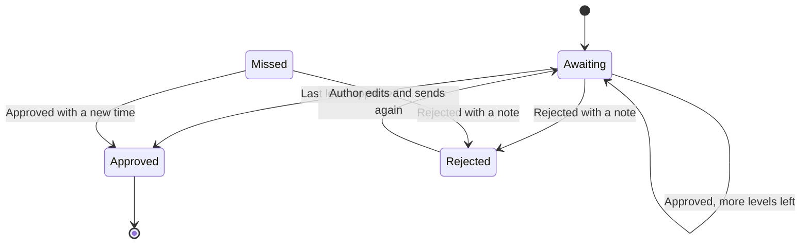
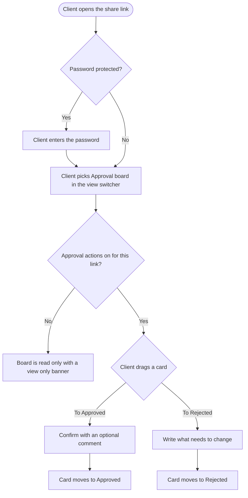

# Approval Board: Epic and Stories

## Epic: Approval board view for the Planner and client share links

Approval board is a new Planner view that shows every post going through approval as a card on a kanban board, split into four columns: Awaiting approval, Missed review, Rejected and Approved.

- **Approvers** see what is waiting on them, with their own posts marked "Your turn", and approve or request changes by dragging a card or clicking a button.
- **Authors** see where each post they sent is stuck.
- **Admins** see the whole team's approval pipeline.

It works with both single-level approvals and multi-level approval workflows. Each card shows its level and progress, and a post stays in Awaiting approval until its last level is approved. Clients who review through a share link get the same board on their share page, with three columns: Awaiting approval, Rejected and Approved.

**Goals**
- Cut the median time from "sent for approval" to the final decision by 30%.
- Cut missed reviews by 25% within 90 days.
- Reach 40% of active approvers using Approval board as their default view within 60 days.

**What it fixes along the way**
- Approve all now runs multi-level workflow posts through their levels. Today bulk approve skips them.

**Release rules**
- New approvers land on Approval board by default.
- Existing users keep their saved view and get a one-time announcement instead.

**Design canvas:** https://claude.ai/artifact/ACAtyDsDKYbBGc31FyY69e

---

## Stories

1. [Design] Design the Approval board for the Planner and the client share page
2. [BE] Serve Approval board columns, counts and card approval details
3. [BE] Run bulk approve and reject through approval workflow levels
4. [BE] Reject approval actions on posts that changed since they were loaded
5. [BE] Support Approval board as a default view, saved view and announcement
6. [BE] Serve the client share-link board with each client's own decisions
7. [BE] Add the approved status filter to the public API, CLI and MCP posts list
8. [FE] Add Approval board to the Planner view dropdown
9. [FE] Build the Approval board columns, cards and scope switch
10. [FE] Approve, reject and resubmit posts from Approval board with drag and drop
11. [FE] Announce Approval board to existing users
12. [FE] Open approval notifications on Approval board
13. [FE] Add Approval board to the client share-link page

---

## [Design] Design the Approval board for the Planner and the client share page

### Description:
As a **designer**, I want to turn the agreed Approval board canvas into final designs, so that the frontend team can build the board, its cards, dialogs and announcement with consistent ContentStudio components.

There is no kanban column or card component in the ContentStudio design library today. This story defines both and covers every state the FE stories need.

---

### Workflow:
1. Designer starts from the agreed design canvas: the desktop board, the phone-width layout and the announcement.
2. Designer finalises the board column: header, ℹ icon, count, Approve all, empty state, drop states (allowed, hovered, faded) and the loading skeleton.
3. Designer finalises the post card:
   - **Variants:** Your turn, Waiting on an earlier level, Missed, Rejected, and Approved (Scheduled, Published, Not scheduled yet, Needs a new time)
   - **States:** dragging, and read-only
4. Designer finalises the dialogs: Approve this post?, Request changes, Pick a new time and Approve all.
5. Designer designs the scope switch, the "waiting on you" summary and the drag hint.
6. Designer designs the phone-width layout, where columns become tabs.
7. Designer designs the announcement popover on the view dropdown, and the "New" tag in the dropdown.
8. Designer designs the client share-link board: 3 columns, the read-only state, the "Time passed" note, and the phone-width tabs.
9. Designer hands the designs over and lists which parts use existing library components and which need new ones.

---

### Acceptance criteria:
- [ ] **Desktop Planner board** designed at 1280px and 1440px, with four columns: Awaiting approval, Missed review, Rejected, Approved
- [ ] **Narrow windows:** columns keep a minimum readable width, and the board scrolls sideways instead of squeezing cards
- [ ] **Column design covers:**
  - [ ] Header: icon, title, ℹ icon and count badge
  - [ ] Approve all button, on Awaiting approval only
  - [ ] Date range subtitle, on Approved only
  - [ ] Empty message
  - [ ] Skeleton loading, and "loading more" at the bottom of the column
  - [ ] Column error with Try again
  - [ ] Drop states: allowed, hovered, faded
- [ ] **Card design covers every variant:**
  - [ ] Your turn
  - [ ] Waiting on an earlier level
  - [ ] Missed (time in red, "Time passed" badge)
  - [ ] Rejected (rejection note box)
  - [ ] Approved: Scheduled, Published, Not scheduled yet, Needs a new time
  - [ ] Author self-approval note
  - [ ] Read-only (no actions)
  - [ ] While being dragged
- [ ] **Card content:** account avatars, planned time, level chip ("Level 2 of 3: Legal"), segmented level progress, caption preview of up to 3 lines, media thumbnail, requester, comment count and action buttons
- [ ] **Dialogs designed with all states,** including validation errors: Approve this post?, Request changes, Pick a new time and Approve all
- [ ] **Scope switch** with counts, the "N waiting on you" summary and the drag hint
- [ ] **Phone-width Planner board:** column tabs with counts, a stacked card list, and 44px Approve and Reject buttons
- [ ] **Announcement popover** anchored to the view dropdown, with the "New" tag on the Approval board option
- [ ] **Client share-link board:**
  - [ ] 3 columns: Awaiting approval, Rejected, Approved
  - [ ] The "Time passed" note for clients
  - [ ] The read-only banner for view-only links
  - [ ] Approve and Request changes dialogs worded for clients
  - [ ] Phone-width tabs
- [ ] **Library components used where they exist:**
  - [ ] `SegmentedControl`, `Badge`, `Avatar`, `Progress`, `Modal`, `Textarea`, `Button`
  - [ ] `Dropdown` / `DropdownItem`, `Tabs`, `Loader`
  - [ ] `CstPopup` for the announcement
- [ ] **New components specified** for the library, with their states:
  - [ ] Board column
  - [ ] Post card
  - [ ] Segmented level progress, if `Progress` can't show segments
- [ ] **Colours** use theme variables for primary accents, so white-label workspaces keep their brand colour. Status colours (amber, red, purple, green) also differ in lightness, not just hue
- [ ] **Text contrast** is at least 4.5:1, including caption grey and badge text

---

### Mock-ups:
Agreed design canvas: https://claude.ai/artifact/ACAtyDsDKYbBGc31FyY69e. See PRD section 7.

---

### Impact on existing data:
None.

---

### Impact on other products:
- Adds new components to the design library (board column, post card), which later features can reuse.
- The client share-link page gets a new view.

---

### Dependencies:
None. This story should be done before **[FE] Build the Approval board columns, cards and scope switch** and **[FE] Add Approval board to the client share-link page**.

---

### Global quality & compliance (wherever applicable)

- [ ] Mobile responsiveness (frontend only, N/A for backend-only stories)
- [ ] Multilingual support (frontend + backend, translations available or fallback handled)
- [ ] UI theming support (default + white-label, design library components are being used)
- [ ] White-label domains impact review
- [ ] Cross-product impact assessment (web, mobile apps, Chrome extension)
- [ ] Developer surfaces coverage: N/A, design only

---

## [BE] Serve Approval board columns, counts and card approval details

### Description:
As an **approver, author or admin**, I want the Planner to return my approval posts already split into Awaiting approval, Missed review, Rejected and Approved, with counts and the details each card needs, so that Approval board loads fast and shows the right actions for me.

Approval board loads each column separately and pages through it, so a busy Approved column doesn't slow down the others. It works for both single-level approvals and multi-level approval workflows.

---

### Workflow:
1. User opens Approval board and picks a scope: Assigned to me, Requested by me or All approvals.
2. Each column loads its first page of posts. The counts for every column, and for every scope option, load alongside.
3. User scrolls to the bottom of a column, and the next page of that column loads.
4. User changes a filter (accounts, labels, campaigns, date range, search and so on), and every column and count reloads to match.
5. Each card shows whether it is the user's turn, which level the post is on, who rejected it and why, and what happened after approval.

---

### Acceptance criteria:

**Columns**
- [ ] **One column per request, paged:** the Planner posts endpoint accepts an Approval board request for one column at a time (Awaiting approval, Missed review, Rejected or Approved), with page and page-size parameters, and returns that column's posts in pages.
- [ ] **Only posts in approval** (legacy approvers or an approval workflow) are ever returned.
- [ ] **Awaiting approval** returns posts waiting on a decision whose planned time is in the future, plus drafts sent for approval with no time.
  - [ ] For workflows, this means pending or partially approved.
  - [ ] For legacy approvals, this means pending approval.
- [ ] **Missed review** returns posts still waiting on a decision whose planned time has passed.
- [ ] **Rejected** returns posts rejected at any level.
- [ ] **Approved** returns posts whose approval is complete, whether they are now scheduled, published or a draft.
  - [ ] Only posts whose planned time falls in the selected date range are included.
  - [ ] For drafts with no time, the approval time is used instead.
- [ ] **Sort order:**
  - [ ] Awaiting approval: posts that are the requesting user's turn first, then by planned time, soonest first.
  - [ ] Missed review: by planned time.
  - [ ] Rejected: most recently rejected first.
  - [ ] Approved: by planned time, newest first.

**Scope and filters**
- [ ] **Assigned to me** returns posts where the user is an approver at any level, or a legacy approver, whatever their status.
- [ ] **Requested by me** returns the same posts as the existing "My Approval Requests" filter.
- [ ] **All approvals** returns every approval post the user can see in the workspace.
- [ ] **Existing filters apply:** accounts, labels, campaigns, content categories, members, post type, search and date range.
- [ ] **The status filter is ignored** for Approval board requests.

**Counts**
- [ ] **The counts endpoint** returns, for the current filters:
  - [ ] a count for each of the four columns in the selected scope
  - [ ] a total for each of the three scopes
  - [ ] the number of posts that are the user's turn
- [ ] **Counts match the posts** each column returns for the same scope and filters.

**Details on each post**
- [ ] **Each post includes:**
  - [ ] whether it is the requesting user's turn (pending approver on the current level, or pending legacy approver)
  - [ ] current level number and name, and total levels
  - [ ] each level's state (done, current, rejected, not started)
  - [ ] who rejected it and their note, when rejected
  - [ ] the outcome when approved: scheduled, published, approved but not scheduled, or needs a new time
- [ ] **Each post includes what the user can do:**
  - [ ] whether they can approve or reject it (on the current level, or the post's author)
  - [ ] whether they can edit and resubmit it (the author, while it is in Rejected)
- [ ] **Legacy single-level approvals** come back as level 1 of 1.

**Access**
- [ ] **Approver-role users** can call these endpoints and get the same results.
- [ ] **Performance:** each column request returns in under 1 second at the 95th percentile, for a workspace with 5,000 approval posts in range.

---

### Mock-ups:
N/A, backend only.

---

### Impact on existing data:
None. This reads existing approval and workflow data, and no stored data changes.

---

### Impact on other products:
- The existing List, Feed, Calendar and grid views are unchanged.
- The counts endpoint used by the Planner filter sidebar keeps returning its current fields. The new counts are additions.

---

### Dependencies:
None.

---

### Global quality & compliance (wherever applicable)

- [ ] Mobile responsiveness: N/A, backend only
- [ ] Multilingual support (frontend + backend, translations available or fallback handled)
- [ ] UI theming support: N/A, backend only
- [ ] White-label domains impact review
- [ ] Cross-product impact assessment (web, mobile apps, Chrome extension)
- [ ] Developer surfaces coverage: the approved status filter reaches the public API through **[BE] Add the approved status filter to the public API, CLI and MCP posts list**. The column requests themselves are internal

---

## [BE] Run bulk approve and reject through approval workflow levels

### Description:
As an **approver**, I want approving or rejecting several posts at once to follow each post's approval workflow, so that a bulk approval never skips a level or publishes a post that other approvers still need to see.

Today bulk approve only understands single-level approvals. On a multi-level workflow post it can set the post straight to scheduled, skipping the remaining levels and their notifications. Approve all on Approval board depends on this fix.

---

### Workflow:
1. User selects several posts (or clicks Approve all on Approval board) and confirms.
2. Each post is handled exactly as if the user had approved it on its own:
   - **Not the last level:** the post moves to its next level and the next approvers are notified.
   - **Last level:** the post is scheduled at its planned time, or stays a draft if it was one.
3. Posts the user can't act on are skipped, with a reason.
4. User sees the result for each post.

---

### Acceptance criteria:

**Approve**
- [ ] **Each workflow post goes through the same path as a single approval:**
  - [ ] the user's approval is recorded on the current level
  - [ ] the level's rule ("anyone" or "everyone") is applied
  - [ ] the next level starts when the current one is complete
  - [ ] the post is only scheduled (or left a draft) after its last level
- [ ] **The same notifications go out** for bulk approvals as for single approvals: the next level's approvers, and the author when fully approved.
- [ ] **Legacy single-level posts** keep working exactly as they do today.
- [ ] **Author self-approval** works the same in bulk as for a single post: it completes the current level.
- [ ] **Posts are skipped**, with a reason, when the user isn't a pending approver on the current level and isn't the author, or when the post is no longer awaiting approval.
- [ ] **Missed-review posts are skipped** with the reason "needs a new time". Bulk approve never schedules a post in the past.

**Reject**
- [ ] **Bulk reject requires a comment.** The same comment is recorded on each post.
- [ ] **Each rejected post** moves to rejected and notifies its author, the same as a single rejection.

**Response and audit**
- [ ] **The response lists every post with its result:** moved to next level, approved and scheduled, approved and left as draft, rejected, or skipped with a reason.
- [ ] **One failure doesn't stop the batch.** A post that fails doesn't stop the others and is reported as failed.
- [ ] **Audit:** after the fix, an audit query finds no workflow post that was scheduled without every level complete.

---

### Mock-ups:
N/A, backend only.

---

### Impact on existing data:
- **No migration.**
- Workflow posts that were bulk-approved before this fix may have skipped levels. Run the audit query once and share the list with the PO. Don't change those posts automatically.

---

### Impact on other products:
- **The List view's bulk Approve and Reject** use the same endpoint and get the fix too.
- **The client share page's bulk actions** use their own path and are unaffected.

---

### Dependencies:
None.

---

### Global quality & compliance (wherever applicable)

- [ ] Mobile responsiveness: N/A, backend only
- [ ] Multilingual support (frontend + backend, translations available or fallback handled)
- [ ] UI theming support: N/A, backend only
- [ ] White-label domains impact review
- [ ] Cross-product impact assessment (web, mobile apps, Chrome extension)
- [ ] Developer surfaces coverage (any new or changed API is reflected in the public API, CLI, MCP server and automation apps, N/A when nothing API-facing changes)

---

## [BE] Reject approval actions on posts that changed since they were loaded

### Description:
As an **approver**, I want ContentStudio to stop me from approving or rejecting a post that someone else already acted on since my board loaded, so that I never approve the wrong version or act twice on the same level.

The Planner doesn't refresh live when another approver acts, so two people can act on the same card from boards that are out of date.

---

### Workflow:
1. Two approvers have Approval board open, showing the same post.
2. The first approver approves it, and the post moves to the next level.
3. The second approver, still seeing the old card, tries to approve or reject it.
4. The action is refused with a clear reason and the post's current state, so the board can refresh that card.

---

### Acceptance criteria:
- [ ] **Single and bulk approve and reject accept an optional "last seen" marker** for each post, taken from the post as the board loaded it.
- [ ] **If the post's approval state changed since then, the action is refused** without changing anything. Changes that count:
  - [ ] the level changed
  - [ ] the post was rejected, approved or resubmitted
  - [ ] the post was edited
- [ ] **A refused action returns a distinct error code** for "changed since loaded", along with the post's current column and approval details.
- [ ] **In bulk, only the changed posts are refused.** They are reported as skipped with the reason "changed since loaded", and the rest still go through.
- [ ] **Without the marker,** actions behave exactly as they do today, so other callers keep working.
- [ ] **A user who is no longer allowed to act** (the level moved past them) gets the same refusal, never a silent success.

---

### Mock-ups:
N/A, backend only.

---

### Impact on existing data:
None.

---

### Impact on other products:
The post preview's approve and reject can send the marker too. That's optional and has no visible change.

---

### Dependencies:
None.

---

### Global quality & compliance (wherever applicable)

- [ ] Mobile responsiveness: N/A, backend only
- [ ] Multilingual support (frontend + backend, translations available or fallback handled)
- [ ] UI theming support: N/A, backend only
- [ ] White-label domains impact review
- [ ] Cross-product impact assessment (web, mobile apps, Chrome extension)
- [ ] Developer surfaces coverage: if the public API approval endpoint shares this path, document the optional marker and the new error code there. Otherwise N/A

---

## [BE] Support Approval board as a default view, saved view and announcement

### Description:
As a **new approver**, I want the Planner to open on Approval board the first time I use it, and as an **existing user**, I want my saved Planner view left alone and to be told about the new view once, so that approvals are easy to find without changing anyone's setup.

---

### Workflow:
1. An admin adds a brand-new user as an approver. When that approver first opens the Planner, it opens on Approval board.
2. An existing user picks Approval board in the view dropdown. It is saved as their default, like any other view.
3. A new workspace is created. Its default saved views "My Pending Approvals" and "My Approval Requests" open on Approval board.
4. An existing user in a workspace that uses approvals opens the Planner after the release. They see the announcement once, and it never shows again after they dismiss it or try the view.

---

### Acceptance criteria:

**Default view**
- [ ] **The Planner default-view preference accepts Approval board** as a value, alongside the existing views.
- [ ] **A brand-new user created as an approver** gets Approval board as their default Planner view.
- [ ] **An existing user who is added as an approver** gets Approval board as their default only if they have no saved default view. A saved default is never overwritten.
- [ ] **No backfill:** the release doesn't change the default view of any existing user.

**Saved views**
- [ ] **New workspaces** get the default saved views "My Pending Approvals" (scope: Assigned to me) and "My Approval Requests" (scope: Requested by me) set to Approval board.
- [ ] **Existing workspaces** keep their saved views unchanged.
- [ ] **Custom saved views** can store Approval board as their view, and open on it.

**Announcement**
- [ ] **The user profile returns whether the user should see the Approval board announcement.** It is true only when all of these hold:
  - [ ] the workspace had approval activity in the last 90 days (a post sent for approval, approved or rejected)
  - [ ] the user's default view isn't already Approval board
  - [ ] the user hasn't dismissed or used the announcement before
- [ ] **Dismissing or using the announcement is stored per user**, so it never shows again on any device.

---

### Mock-ups:
N/A, backend only.

---

### Impact on existing data:
- **Adds Approval board** as an allowed value for the default Planner view and the saved-view type.
- **Adds a per-user "announcement seen" marker.**
- No existing values change.

---

### Impact on other products:
- **Approver accounts created after the release** land on Approval board.
- **Mobile web** keeps its existing behaviour of opening List at phone width when the stored default is a view that isn't available there.

---

### Dependencies:
None.

---

### Global quality & compliance (wherever applicable)

- [ ] Mobile responsiveness: N/A, backend only
- [ ] Multilingual support (frontend + backend, translations available or fallback handled)
- [ ] UI theming support: N/A, backend only
- [ ] White-label domains impact review
- [ ] Cross-product impact assessment (web, mobile apps, Chrome extension)
- [ ] Developer surfaces coverage: N/A, internal preference only

---

## [BE] Serve the client share-link board with each client's own decisions

### Description:
As a **client reviewing posts through a share link**, I want the shared posts split into Awaiting approval, Rejected and Approved based on my own decisions, so that I can see what still needs my answer, even when other clients review the same link.

As a **team member**, I want a post that a client approved after its planned time passed to be flagged on our board, so that we pick a new time instead of the post silently never publishing.

---

### Workflow:
1. Client opens a share link and enters the password if there is one.
2. Client switches to Approval board. Every post on the link comes back with the column that matches this client's own decision: still pending, approved or rejected.
3. Posts whose planned time has passed come back flagged as "time passed".
4. Client approves a post whose time has passed. On the team's Approval board it shows in Approved as "needs a new time".

---

### Acceptance criteria:
- [ ] **Each post on a share link comes back with a board column** for the client viewing it (identified by their share token):
  - [ ] **Awaiting approval:** this client hasn't decided and the post still needs approval
  - [ ] **Rejected:** this client rejected it, or the post is rejected
  - [ ] **Approved:** this client approved it, or the post's approval is complete
- [ ] **Each post is flagged as "time passed"** when its planned time is in the past and it is still awaiting approval.
- [ ] **The response says whether this client can approve or reject**, following the link's existing approval-actions setting. View-only links return "no actions".
- [ ] **Client approve and reject keep working exactly as they do today.** Reject still requires a comment.
- [ ] **A client acting on a post they already decided, or that is no longer awaiting approval,** is refused with a clear reason, never a duplicate decision.
- [ ] **Stuck posts are flagged:** a post whose approval was completed by a client after its planned time passed is returned to the team Planner with the outcome "needs a new time", and appears in the team's Approved column.
- [ ] **The share-link endpoints stay public** (token and password protected, as today) and expose no other workspace data.

---

### Mock-ups:
N/A, backend only.

---

### Impact on existing data:
None. This uses the existing share-link approvers, tokens and recorded client actions.

---

### Impact on other products:
- **The share page's List and Calendar views** are unchanged.
- **The team's Approval board** shows the new "needs a new time" outcome.

---

### Dependencies:
- **[BE] Serve Approval board columns, counts and card approval details**, for the outcome field on the team board.

---

### Global quality & compliance (wherever applicable)

- [ ] Mobile responsiveness: N/A, backend only
- [ ] Multilingual support (frontend + backend, translations available or fallback handled)
- [ ] UI theming support: N/A, backend only
- [ ] White-label domains impact review: share links can be served on white-label domains. Confirm the board data works there
- [ ] Cross-product impact assessment (web, mobile apps, Chrome extension)
- [ ] Developer surfaces coverage: N/A, share-link endpoints aren't part of the public API

---

## [BE] Add the approved status filter to the public API, CLI and MCP posts list

### Description:
As a **developer building on ContentStudio**, I want to list posts whose approval is complete, alongside the existing under review, missed review and rejected filters, so that I can build my own approval board or reports from the public API, the `contentstudio` CLI, the MCP server, or Zapier, Make and n8n.

---

### Workflow:
1. Developer calls the public posts list for a workspace with status `approved`.
2. They get the posts whose approval is complete, whether they are now scheduled, published or a draft, within the date range they pass.
3. They do the same with the CLI posts list command and the MCP posts tool.

---

### Acceptance criteria:

**Public API**
- [ ] **The public posts list accepts `approved` as a status value.** It can be combined with the existing statuses, `approval_assigned_to[]`, `approval_requested_by[]` and date filters.
- [ ] **`approved` returns the same posts** as the Approved column on Approval board for the same filters.
- [ ] **Each post includes its approval progress:** current level number and name, total levels, and the outcome (scheduled, published, approved but not scheduled, needs a new time).
- [ ] **The API reference** documents the new status value and the approval fields.

**CLI and MCP**
- [ ] **The CLI posts list** accepts the `approved` status, following the existing `resource:action` command naming.
- [ ] **The MCP posts tool** accepts the `approved` status, and its tool description mentions it.

**Automation apps**
- [ ] **Zapier, Make and n8n:** listing approved posts works through their existing ContentStudio steps, with no new app version needed. If one does need a new version, note which.

---

### Mock-ups:
N/A, API only.

---

### Impact on existing data:
None.

---

### Impact on other products:
- The public API, the CLI, the MCP server and the automation apps.

---

### Dependencies:
- **[BE] Serve Approval board columns, counts and card approval details**, which defines what counts as approved.

---

### Global quality & compliance (wherever applicable)

- [ ] Mobile responsiveness: N/A, backend only
- [ ] Multilingual support (frontend + backend, translations available or fallback handled)
- [ ] UI theming support: N/A, backend only
- [ ] White-label domains impact review
- [ ] Cross-product impact assessment (web, mobile apps, Chrome extension)
- [ ] Developer surfaces coverage (any new or changed API is reflected in the public API, CLI, MCP server and automation apps, N/A when nothing API-facing changes)

---

## [FE] Add Approval board to the Planner view dropdown

### Description:
As a **Planner user**, I want to pick "Approval board" from the same view dropdown I use for Calendar, List and Feed, so that I can switch to the approval view in one click and have it remembered like my other views.

---

### Workflow:
1. User opens the Planner and clicks the view dropdown at the top right (it shows the current view, for example "Feed").
2. User sees "Approval board" as the last option, with a "New" tag.
3. User clicks it. The Planner switches to Approval board, keeping the current filters, date range and search.
4. Next time the user opens the Planner, it opens on Approval board, because the Planner remembers the last view picked.
5. A new approver opening the Planner for the first time lands on Approval board.

---

### Acceptance criteria:

**Dropdown**
- [ ] **The Planner view dropdown lists "Approval board" as the last option,** after TikTok grid. It uses the existing `Dropdown` / `DropdownItem` components with a board icon.
- [ ] **A "New" tag shows next to "Approval board"** (`Badge`, primary style) for 30 days after release, then disappears.
- [ ] **While Approval board is the current view,** the dropdown button reads "Approval board" with the board icon.

**Switching and the default**
- [ ] **Switching to Approval board** keeps the current account, label, campaign, content category, member, post type, date range and search filters.
- [ ] **Picking Approval board saves it as the user's default view,** the same way picking any other view does.
- [ ] **New approvers:** a user whose default is Approval board (including new approvers) lands on it when opening the Planner.
- [ ] **Approver-role users can open Approval board** and are not redirected to List.
- [ ] **The URL for Approval board can be shared and bookmarked**, and opens on the same view with the same filters.
- [ ] **Saved custom views:** creating or editing a saved view while on Approval board saves it with that view, and opening it opens Approval board.

**Status filter**
- [ ] **On Approval board the Status filter section is hidden** in the Filters sidebar, because the columns already are the statuses.
  - [ ] It shows this note instead: "Status isn't available on Approval board. Each column already shows one status."
  - [ ] Switching to another view shows the Status filter again, with its previous selection.

**Phone width**
- [ ] **Approval board is available at phone width**, and opens in its tab layout. Defined in **[FE] Build the Approval board columns, cards and scope switch**.

---

### Mock-ups:
Design canvas: https://claude.ai/artifact/ACAtyDsDKYbBGc31FyY69e (view dropdown open on the desktop board). See PRD section 7.

---

### Impact on existing data:
None. The default view preference gains a new value.

---

### Impact on other products:
The other Planner views are unchanged.

---

### Dependencies:
- **[BE] Support Approval board as a default view, saved view and announcement**
- **[FE] Build the Approval board columns, cards and scope switch** (the view's content)

---

### Global quality & compliance (wherever applicable)

- [ ] Mobile responsiveness (frontend only, N/A for backend-only stories)
- [ ] Multilingual support (frontend + backend, translations available or fallback handled)
- [ ] UI theming support (default + white-label, design library components are being used)
- [ ] White-label domains impact review
- [ ] Cross-product impact assessment (web, mobile apps, Chrome extension)
- [ ] Developer surfaces coverage: N/A, nothing API-facing changes

---

## [FE] Build the Approval board columns, cards and scope switch

### Description:
As an **approver, author or admin**, I want to see posts in approval as cards in four columns (Awaiting approval, Missed review, Rejected and Approved), with my own posts marked "Your turn", so that I can tell at a glance what needs me, what's stuck and what's done.

---

### Workflow:
1. User opens Approval board. The scope switch sits under the Planner header, defaulting to:
   - **Assigned to me** for approvers
   - **Requested by me** for collaborators who need approval
   - **All approvals** for admins
2. User sees "3 waiting on you", plus the hint "Drag a card to approve it or request changes".
3. User sees four columns, each with a count.
   - In **Awaiting approval**, cards marked "Your turn" come first.
   - Other cards say which level they're waiting on, for example "Waiting on Level 1: Brand review. Your turn comes at Level 3."
4. User reads a card: the accounts, planned time, level, caption, media, requester and comment count. Rejected cards show the approver's note, and approved cards show what happened next.
5. User clicks a card's caption or media, and the existing post preview opens.
6. User scrolls down a column, and more cards load.
7. User changes scope or a filter, and the columns and counts update.

---

### Acceptance criteria:

**Scope switch**
- [ ] **A `SegmentedControl` above the board** with "Assigned to me", "Requested by me" and "All approvals". Each option shows its count as a `Badge`.
- [ ] **Each option has a tooltip** (`CstPopup`):
  - [ ] Assigned to me: "Posts where you are one of the approvers, at any level. For example, a post waiting on Brand review shows here if you approve at the Legal level."
  - [ ] Requested by me: "Posts you sent for approval, so you can see which are approved, rejected or still waiting."
  - [ ] All approvals: "Every post in this workspace that is going through approval."
- [ ] **The default scope:**
  - [ ] Approvers: Assigned to me
  - [ ] Collaborators who need approval: Requested by me
  - [ ] Admins and everyone else: All approvals
- [ ] **The chosen scope is kept in the URL**, and opening the "My Pending Approvals" or "My Approval Requests" saved view picks the matching scope.
- [ ] **The summary** next to the switch reads "{n} waiting on you" when n > 0, and is hidden when 0 or when the scope is Requested by me.
- [ ] **The hint** at the right of the row reads "Drag a card to approve it or request changes", with a hand icon. It's hidden at phone width.

**Columns**
- [ ] **Four columns, left to right:** Awaiting approval, Missed review, Rejected, Approved.
  - [ ] Each header shows its icon, title, an ℹ icon and a count `Badge`.
  - [ ] Columns use the board column component from **[Design] Design the Approval board for the Planner and the client share page**.
- [ ] **ℹ tooltips** (`CstPopup`):
  - [ ] Awaiting approval: "Posts that still need a decision. Cards marked Your turn are waiting on you right now."
  - [ ] Missed review: "Posts whose planned time passed before anyone approved them. They won't publish until someone approves them with a new time."
  - [ ] Rejected: "Posts an approver rejected with a note. The author can edit them and send them for approval again."
  - [ ] Approved: "Posts that finished approval in the selected date range. Change the date range at the top to see older ones."
- [ ] **The Approved header** shows the selected date range as a subtitle, for example "Oct 1 to Oct 31, 2026".
- [ ] **Card order in Awaiting approval:** "Your turn" cards come first.

**Cards**
- [ ] **Every card shows:**
  - [ ] account avatars (`Avatar`, overlapping, with the account name on hover)
  - [ ] the planned time (or "No time set")
  - [ ] the level chip
  - [ ] a caption preview of up to 3 lines
  - [ ] the media thumbnail, when the post has media
  - [ ] the segmented level progress (one segment per level: done, current, rejected, not started)
  - [ ] the requester
  - [ ] the comment count
- [ ] **Level chip copy:**
  - [ ] "Level {n} of {total}: {level name}"
  - [ ] Single-level posts: "Level 1 of 1: {level name}". Legacy approvals: "Level 1 of 1: Approval"
  - [ ] On approved cards: "All {total} levels approved", or "Approved" for single-level
- [ ] **"Your turn"** `Badge` (primary) shows when the user is a pending approver on the current level. The card gets a primary-tinted border.
- [ ] **Waiting line:** when the user is an approver on a later level, the card shows "Waiting on Level {n}: {level name}. Your turn comes at Level {m}."
- [ ] **Missed review cards:**
  - [ ] The time shows in red as "Was due {date, time}", for example "Was due Sep 30, 10:00 AM".
  - [ ] A "Time passed" `Badge` shows.
- [ ] **Rejected cards:**
  - [ ] A note box shows "Rejected by {name}" (or "You rejected this post") with the rejection note.
  - [ ] The note is shown in full, up to 4 lines, then "Show more".
- [ ] **Approved card outcome line:**
  - [ ] "Scheduled for {date, time}"
  - [ ] "Published on {date, time}"
  - [ ] "Approved, not scheduled yet" (amber)
  - [ ] "Approved, needs a new time" (amber)
- [ ] **Requester line:** "Requested by {name}", or "Requested by you".
- [ ] **Author self-approval note:** when the user is the author and can approve but it isn't their turn, the card shows "You created this post, so you can approve it yourself."
- [ ] **Clicking the caption or media** opens the existing post preview, with its comments and approval history.

**Paging, refresh and counts**
- [ ] **Each column loads 20 cards, then 20 more** as the user scrolls near its bottom. "Loading more posts..." shows with a `Loader`.
- [ ] **Changing scope, a filter, the date range or search** reloads all four columns and every count.
- [ ] **The Planner refresh button** reloads all four columns and every count.

**Loading, empty and error states**
- [ ] **Loading:**
  - [ ] Each column shows 3 skeleton cards while its first page loads.
  - [ ] Counts show a small `Loader` until loaded.
- [ ] **Empty column messages:**
  - [ ] Awaiting approval: "No posts awaiting approval"
  - [ ] Missed review: "No missed reviews"
  - [ ] Rejected: "No rejected posts"
  - [ ] Approved: "No approved posts in this date range"
- [ ] **Empty board, no filters applied:**
  - [ ] Headline: "No posts in approval yet"
  - [ ] Subtext: "When someone sends a post for approval, it shows up here so you can approve it or request changes in one place."
  - [ ] Admins whose workspace has no approval workflow also see a "Set up an approval workflow" `Button`, which opens Settings > Approval workflows.
- [ ] **Empty board, with filters applied:**
  - [ ] Headline: "No posts match your filters"
  - [ ] Subtext: "Try a different date range or remove some filters to see more posts."
  - [ ] CTA: "Clear filters"
- [ ] **Column error:**
  - [ ] The column shows "We couldn't load these posts." with a "Try again" `Button`, which reloads that column only.
- [ ] **Whole-board error** (counts and every column fail):
  - [ ] Headline: "We couldn't load your approval board"
  - [ ] Subtext: "Check your connection and try again."
  - [ ] CTA: "Try again"

**Layout**
- [ ] **Desktop:** columns share the available width with a minimum readable width. On narrow windows the board scrolls sideways instead of squeezing cards. Each column scrolls on its own.
- [ ] **Phone width:**
  - [ ] The scope switch becomes a select labelled "Show".
  - [ ] Columns become `Tabs` with counts: "Awaiting", "Missed", "Rejected", "Approved".
  - [ ] Cards stack in a single list, and drag is turned off.

**Theming**
- [ ] **Colours:** primary accents use the theme colour classes (`text-primary-cs-500`, `bg-primary-cs-50` and so on), and no primary colour is hardcoded.

---

### Mock-ups:
Design canvas: https://claude.ai/artifact/ACAtyDsDKYbBGc31FyY69e. It shows the desktop board in all three scopes, and the phone width layout. See PRD section 7.

---

### Impact on existing data:
None.

---

### Impact on other products:
- The post preview opens from the board, unchanged.
- The Filters sidebar hides Status on this view. See **[FE] Add Approval board to the Planner view dropdown**.

---

### Dependencies:
- **[Design] Design the Approval board for the Planner and the client share page**
- **[BE] Serve Approval board columns, counts and card approval details**
- **[FE] Add Approval board to the Planner view dropdown**

---

### Global quality & compliance (wherever applicable)

- [ ] Mobile responsiveness (frontend only, N/A for backend-only stories)
- [ ] Multilingual support (frontend + backend, translations available or fallback handled)
- [ ] UI theming support (default + white-label, design library components are being used)
- [ ] White-label domains impact review
- [ ] Cross-product impact assessment (web, mobile apps, Chrome extension)
- [ ] Developer surfaces coverage: N/A, nothing API-facing changes

---

## [FE] Approve, reject and resubmit posts from Approval board with drag and drop

### Description:
As an **approver**, I want to drag a card to Approved or Rejected, or use the buttons on the card, so that I can make approval decisions in one motion.

As an **author**, I want to resubmit a post that came back with changes, and schedule one that was approved as a draft, right from the board.

---

### Workflow:

1. User starts dragging a card they're allowed to act on. Columns it can go to show a drop hint, and the others fade.
2. User drops it on **Approved**. "Approve this post?" opens and says exactly what will happen. User adds an optional note and clicks "Approve post".
3. If more levels remain, the card stays in Awaiting approval at the next level. If it was the last level, it moves to Approved. A toast confirms either way.
4. User drops a missed card on **Approved**. "Pick a new time" opens, the user picks a future date and time, and clicks "Approve and schedule".
5. User drops a card on **Rejected**. "Request changes" opens, the user writes what needs to change, and clicks "Reject post".
6. The author drags a Rejected card to **Awaiting approval**, or clicks "Edit and resubmit", and the Composer opens for that post.
7. User clicks **Approve all** on Awaiting approval, confirms, and every post that is their turn is approved.
8. Every drag action is also a button on the card: Approve, Reject, Edit and resubmit, Schedule post.

---

### Acceptance criteria:

**Dragging**
- [ ] **Which cards can be dragged:**
  - [ ] Awaiting approval and Missed review cards the user can approve or reject (pending approver on the current level, or the author)
  - [ ] Rejected cards the user authored
  - [ ] All other cards, and every Approved card, can't be dragged and show a default cursor
- [ ] **Allowed drops:**

| From | To | Allowed for |
| ----- | ----- | ----- |
| Awaiting approval | Approved | Pending approver on the current level, or the author |
| Awaiting approval | Rejected | Pending approver on the current level, or the author |
| Missed review | Approved | Pending approver on the current level, or the author |
| Missed review | Rejected | Pending approver on the current level, or the author |
| Rejected | Awaiting approval | The author only |

  Nothing else is allowed.
- [ ] **While dragging:**
  - [ ] Columns the card can go to show a dashed outline and a drop hint: "Drop to approve", "Drop to request changes" or "Drop to edit and resubmit".
  - [ ] Every other column fades, and the card being dragged is shown faded.
- [ ] **Dropping somewhere not allowed,** or releasing outside a column, returns the card to where it was, with no message.
- [ ] **Drag is off at phone width**, and the card buttons are used instead.

**Card buttons**
- [ ] **Approve** (`Button`, primary, check icon) and **Reject** (`Button`, secondary) show on cards the user can approve or reject.
- [ ] **Edit and resubmit** (`Button`, secondary, pencil icon) shows on Rejected cards the user authored, when the user can edit posts.
- [ ] **Schedule post** (`Button`, secondary) shows on Approved cards with the outcome "Approved, not scheduled yet" or "Approved, needs a new time". It opens the existing scheduling options for that post.

**"Approve this post?" dialog** (`Modal`)
- [ ] **Title:** "Approve this post?"
- [ ] **Shows the caption** in 2 lines.
- [ ] **Body copy:**
  - [ ] Not the last level: "This approves Level {n}: {level name}. The post then moves to Level {n+1}: {next level name}."
  - [ ] Last level, with a planned time: "This is the last approval level, so the post will be scheduled for {date, time}."
  - [ ] Last level, a draft: "This is the last approval level. The post stays a draft until someone schedules it."
- [ ] **Author self-approval,** when it isn't the author's turn: an extra line reads "You created this post, so your approval completes Level {n} for all of its approvers."
- [ ] **Note field** (`Textarea`):
  - [ ] Label: "Note for the team (optional)"
  - [ ] Placeholder: "For example: Looks great, good to go."
  - [ ] Helper: "Your note is added to the post's comments."
- [ ] **Buttons:** "Cancel" (secondary) and "Approve post" (primary).

**"Request changes" dialog** (`Modal`)
- [ ] **Title:** "Request changes"
- [ ] **Shows the caption** in 2 lines.
- [ ] **Body copy:**
  - [ ] Someone else's post: "The post goes back to {author name} with your note, and moves to the Rejected column."
  - [ ] Your own post: "The post moves to the Rejected column. You can edit it and send it again."
- [ ] **Note field** (`Textarea`), required:
  - [ ] Label: "What needs to change?"
  - [ ] Placeholder: "For example: Swap the image for the approved product shot."
- [ ] **Validation:** "Add a note so the author knows what to change." The post doesn't move.
- [ ] **Buttons:** "Cancel" (secondary) and "Reject post" (destructive).

**"Pick a new time" dialog** (`Modal`, missed posts only)
- [ ] **Title:** "Pick a new time"
- [ ] **Body:** "This post was due on {date, time}, which has passed. Choose a new date and time, then approve it."
- [ ] **Fields:** "New date" and "New time", both required. Past dates are disabled.
- [ ] **Validation:**
  - [ ] Either field empty: "Pick a new date and time to continue."
  - [ ] Time in the past: "Pick a time in the future."
- [ ] **Buttons:** "Cancel" and "Approve and schedule" (primary).
- [ ] **The same dialog opens** when the Approve button is clicked on a missed card.

**"Approve all" dialog** (`Modal`)
- [ ] **When the button shows:** "Approve all" (`Button`, secondary, small) appears in the Awaiting approval header only when 2 or more posts there are the user's turn, in the current scope and filters.
- [ ] **Title:** "Approve {n} posts?"
- [ ] **Body:** "This approves every post in Awaiting approval that is waiting on you. Posts on their last level get scheduled at their planned time. Posts with more levels move to the next approver."
- [ ] **Note field:** optional, same label and placeholder as "Approve this post?"
- [ ] **Buttons:** "Cancel" and "Approve all" (primary).
- [ ] **Missed review posts are never included.**

**After an action**
- [ ] **On success,** the card moves to its new column (or stays at its next level), and every count updates.
- [ ] **Toasts:**
  - [ ] Next level: "Level {n} approved. Now waiting on Level {n+1}: {level name}."
  - [ ] Final level, with a time: "Approved. Scheduled for {date, time}."
  - [ ] Final level, a draft: "Approved. It stays a draft until someone schedules it."
  - [ ] Missed post approved: "Approved. Scheduled for {new date, time}."
  - [ ] Rejected, someone else's post: "Post rejected. {author name} has been notified with your note."
  - [ ] Rejected, your own post: "Post moved to the Rejected column."
  - [ ] Approve all: "{n} posts approved. Posts on their last level are now scheduled."
  - [ ] Approve all, partly done: "{x} of {n} posts approved. {y} couldn't be approved because they changed. We refreshed the board."
- [ ] **Post changed by someone else:** if the post changed since the board loaded, the card returns to its column and refreshes, and a toast reads "This post was updated by someone else. We refreshed the board so you see its latest status."
- [ ] **Any other failure:** the card returns to where it was, and a toast reads "We couldn't save that. Please try again."
- [ ] **Edit and resubmit, or dragging to Awaiting approval,** opens the Composer for that post. After it's sent for approval again, the board reloads and the card is back in Awaiting approval.

**Multi-level workflows**
- [ ] **Approving a non-final level never schedules the post.** The card stays in Awaiting approval, its level chip and progress update, and "Your turn" disappears unless the user is also on the next level.

**Usermaven events**
- [ ] **When the user confirms an approval** from Approval board and the server confirms it, a `post_approved` Usermaven event fires with `{ source: 'approval_board', method: 'drag' | 'button', approval_type: 'workflow' | 'legacy', is_final_level, was_missed_review }`.
- [ ] **When the user confirms a rejection** from Approval board and the server confirms it, a `post_rejected` Usermaven event fires with `{ source: 'approval_board', method: 'drag' | 'button', approval_type: 'workflow' | 'legacy' }`.
- [ ] **When the user confirms Approve all** and the server confirms it, a `posts_bulk_approved` Usermaven event fires with `{ source: 'approval_board', number_of_posts }`, where `number_of_posts` is the number actually approved.

---

### Mock-ups:
Design canvas: https://claude.ai/artifact/ACAtyDsDKYbBGc31FyY69e. Press Play on the desktop board to drag cards and open each dialog. See PRD section 7.

---

### Impact on existing data:
None. This uses the existing approve, reject and scheduling actions.

---

### Impact on other products:
- **Notifications** to approvers and authors go out exactly as they do for approvals made elsewhere.
- **The Composer** opens for resubmitting.

---

### Dependencies:
- **[FE] Build the Approval board columns, cards and scope switch**
- **[BE] Run bulk approve and reject through approval workflow levels**
- **[BE] Reject approval actions on posts that changed since they were loaded**

---

### Global quality & compliance (wherever applicable)

- [ ] Mobile responsiveness (frontend only, N/A for backend-only stories)
- [ ] Multilingual support (frontend + backend, translations available or fallback handled)
- [ ] UI theming support (default + white-label, design library components are being used)
- [ ] White-label domains impact review
- [ ] Cross-product impact assessment (web, mobile apps, Chrome extension)
- [ ] Developer surfaces coverage: N/A, it uses existing approval actions

---

## [FE] Announce Approval board to existing users

### Description:
As an **existing ContentStudio user whose team uses approvals**, I want a one-time heads-up about the new Approval board without my saved Planner view changing, so that I can try it when it suits me.

---

### Workflow:
1. An existing user in a workspace that uses approvals opens the Planner on their usual view, for example Feed.
2. A small dot shows on the view dropdown, and a popover points to it.
3. User reads the popover and clicks "Try Approval board". The Planner switches to Approval board, which also becomes their default view.
4. Or the user clicks "Not now", and the popover closes. Either way, it never shows again.

---

### Acceptance criteria:

**When it shows**
- [ ] **The popover (`CstPopup`) shows once** next to the Planner view dropdown, only for users the profile marks as eligible. Users already on Approval board, and new approvers, never see it.
- [ ] **It doesn't open at phone width.** It shows the next time the user opens the Planner on desktop.

**Copy and buttons**
- [ ] **Content:**
  - [ ] A small board illustration
  - [ ] A "New" `Badge`
  - [ ] Title: "Approval board"
  - [ ] Body: "See every post that is waiting for approval, missed its time, been rejected or been approved, all in one board. Drag a card to approve it."
  - [ ] Subtext: "You can switch views any time from this menu. Your current view stays as it is."
- [ ] **Buttons:** "Not now" (`Button`, secondary) and "Try Approval board" (`Button`, primary).
- [ ] **While the popover is open,** a dot in the primary theme colour shows on the view dropdown button.

**Behaviour**
- [ ] **"Try Approval board"** switches to Approval board, keeping the current filters, and saves it as the default view, like any other view switch.
- [ ] **"Not now", or clicking outside,** closes the popover, and the current view doesn't change.
- [ ] **Never again:** after either button, or clicking outside, the popover never shows again for that user on any device.
- [ ] **The user's saved view is never changed** unless they click "Try Approval board".

**Usermaven events**
- [ ] **"Try Approval board"** fires an `approval_board_announcement_actioned` Usermaven event with `{ action: 'try' }`.
- [ ] **"Not now"** fires an `approval_board_announcement_actioned` Usermaven event with `{ action: 'dismiss' }`.

---

### Mock-ups:
Design canvas: https://claude.ai/artifact/ACAtyDsDKYbBGc31FyY69e (the "Existing users: in-app announcement" artboard). See PRD section 7.

---

### Impact on existing data:
None. It uses the per-user "announcement seen" marker.

---

### Impact on other products:
None.

---

### Dependencies:
- **[BE] Support Approval board as a default view, saved view and announcement**
- **[FE] Add Approval board to the Planner view dropdown**

---

### Global quality & compliance (wherever applicable)

- [ ] Mobile responsiveness (frontend only, N/A for backend-only stories)
- [ ] Multilingual support (frontend + backend, translations available or fallback handled)
- [ ] UI theming support (default + white-label, design library components are being used)
- [ ] White-label domains impact review
- [ ] Cross-product impact assessment (web, mobile apps, Chrome extension)
- [ ] Developer surfaces coverage: N/A, nothing API-facing changes

---

## [FE] Open approval notifications on Approval board

### Description:
As a **user whose default Planner view is Approval board**, I want approval notifications to open the post on Approval board, so that I land where I make approval decisions.

Users on any other view keep today's behaviour.

---

### Workflow:
1. User whose default view is Approval board gets an approval notification in the bell panel.
2. User clicks the notification. Approval board opens with the right scope:
   - **Assigned to me** for posts waiting on them
   - **Requested by me** for updates on their own posts
3. The post's preview opens on top, and its card is highlighted on the board.
4. User clicks "Open planner" in the bell panel. Approval board opens on Assigned to me.

---

### Acceptance criteria:
- [ ] **Users whose default is Approval board,** on clicking an approval notification in the bell panel:
  - [ ] Approval board opens, with the post preview open for that post.
  - [ ] **Scope for notifications asking them to review:** Assigned to me.
  - [ ] **Scope for notifications about their own post** (approved, rejected, moved to next level, missed): Requested by me.
- [ ] **The post's card is highlighted** with a primary-colour outline for 3 seconds, and its column scrolls to it.
- [ ] **If the post isn't on the board** for the current date range, the preview still opens, and a toast reads "This post is outside the selected date range, so it isn't shown on the board."
- [ ] **"Open planner" in the bell panel** opens Approval board with Assigned to me for these users.
- [ ] **Everyone else:** users whose default is any other view keep today's behaviour (Feed with the post preview).
- [ ] **Approver-role users** whose default is Approval board get the same behaviour.

---

### Mock-ups:
N/A. It uses the board and the existing post preview. See PRD section 7.

---

### Impact on existing data:
None.

---

### Impact on other products:
- **The bell notification panel.**
- **Approval and review-missed emails** are unchanged in v1.

---

### Dependencies:
- **[FE] Build the Approval board columns, cards and scope switch**
- **[FE] Add Approval board to the Planner view dropdown**

---

### Global quality & compliance (wherever applicable)

- [ ] Mobile responsiveness (frontend only, N/A for backend-only stories)
- [ ] Multilingual support (frontend + backend, translations available or fallback handled)
- [ ] UI theming support (default + white-label, design library components are being used)
- [ ] White-label domains impact review
- [ ] Cross-product impact assessment (web, mobile apps, Chrome extension)
- [ ] Developer surfaces coverage: N/A, nothing API-facing changes

---

## [FE] Add Approval board to the client share-link page

### Description:
As a **client reviewing posts through a share link**, I want to see the shared posts on a board with Awaiting approval, Rejected and Approved columns, and drag a card to approve it or request changes, so that I can work through a batch of posts quickly without a ContentStudio account.

---

### Workflow:

1. Client opens the share link and, if asked, enters the password.
2. Client sees the view switcher with "List", "Calendar" and "Approval board", and picks Approval board.
3. Client sees three columns, each with a count. Cards waiting on them are in Awaiting approval.
4. Client drags a card to Approved, adds an optional comment, and confirms. Or they drag it to Rejected and write what needs to change.
5. A card whose planned time has passed sits in Awaiting approval with a "Time passed" badge and a note. The client can still approve it, and the team will pick a new time.
6. Clicking a card opens the existing post preview with comments.

---

### Acceptance criteria:

**View switcher**
- [ ] **The share page's view switcher** shows "Approval board" after "List" and "Calendar".
- [ ] **The last view picked** is remembered in this browser for that link.

**Columns**
- [ ] **Three columns:** Awaiting approval, Rejected and Approved, each with a count `Badge`, based on this client's own decisions.
- [ ] **ℹ tooltips** (`CstPopup`):
  - [ ] Awaiting approval: "Posts your team is waiting for you to review. Drag one to Approved or Rejected to give your answer."
  - [ ] Rejected: "Posts you or another reviewer rejected with a comment. Your team will update them."
  - [ ] Approved: "Posts you approved. Your team will publish them at their planned time."

**Cards**
- [ ] **Each card shows:**
  - [ ] account avatars
  - [ ] the planned time
  - [ ] a caption preview of up to 3 lines
  - [ ] the media thumbnail
  - [ ] the comment count
  - [ ] the rejection comment (on Rejected)
- [ ] **No workflow levels** and no team member names are shown on cards.
- [ ] **Time passed:** a card whose planned time has passed shows a "Time passed" `Badge` and the line "The planned time has passed. Your team will pick a new time after you approve."

**Actions** (links with approval actions on)
- [ ] **Allowed drags:** Awaiting approval → Approved, and Awaiting approval → Rejected. Nothing moves out of Approved or Rejected.
- [ ] **Card buttons** "Approve" (primary) and "Request changes" (secondary) do the same as dragging.
- [ ] **Approve dialog** (`Modal`):
  - [ ] Title: "Approve this post?"
  - [ ] Body: "Your team will be notified that you approved it."
  - [ ] Comment field (`Textarea`): label "Comment (optional)", placeholder "For example: Love this one."
  - [ ] Buttons: "Cancel" and "Approve post"
- [ ] **Request changes dialog** (`Modal`):
  - [ ] Title: "Request changes"
  - [ ] Body: "Your team will see your comment and update the post."
  - [ ] Comment field (`Textarea`), required: label "What needs to change?", placeholder "For example: Please use the logo with the white background."
  - [ ] Validation: "Add a comment so your team knows what to change."
  - [ ] Buttons: "Cancel" and "Send request"
- [ ] **Toasts:**
  - [ ] Approve: "Thanks, your approval was sent to the team."
  - [ ] Request changes: "Thanks, your request was sent to the team."
  - [ ] Already decided: "This post was already reviewed, so we refreshed the board."
  - [ ] Failure: "We couldn't send that. Please try again."

**View-only links**
- [ ] **No drag and no action buttons** on links without approval actions.
- [ ] **An `Alert` banner** above the board reads "This link is view only. You can look through the posts but can't approve them or request changes."

**Empty, loading and error states**
- [ ] **Empty board:**
  - [ ] Headline: "No posts to review"
  - [ ] Subtext: "There are no posts on this link right now. Check back later or ask your team for a new link."
- [ ] **Empty columns:**
  - [ ] Awaiting approval: "Nothing waiting on you"
  - [ ] Rejected: "No rejected posts"
  - [ ] Approved: "No approved posts yet"
- [ ] **Loading:** 3 skeleton cards per column.
- [ ] **Error:** "We couldn't load these posts. Check your connection and try again." with a "Try again" `Button`.

**Phone width**
- [ ] **Columns become `Tabs`** with counts ("Awaiting", "Rejected", "Approved"). Drag is off, and the card buttons are used instead.

**Theming and branding**
- [ ] **White-label:** primary colours follow the share link's white-label branding.

---

### Mock-ups:
See PRD section 7. The client board is designed in **[Design] Design the Approval board for the Planner and the client share page**.

---

### Impact on existing data:
None.

---

### Impact on other products:
- **The share page's List and Calendar views** are unchanged.
- **Client decisions show on the team's Approval board.** A post a client approved after its time passed shows there as "Approved, needs a new time".

---

### Dependencies:
- **[Design] Design the Approval board for the Planner and the client share page**
- **[BE] Serve the client share-link board with each client's own decisions**

---

### Global quality & compliance (wherever applicable)

- [ ] Mobile responsiveness (frontend only, N/A for backend-only stories)
- [ ] Multilingual support (frontend + backend, translations available or fallback handled)
- [ ] UI theming support (default + white-label, design library components are being used)
- [ ] White-label domains impact review
- [ ] Cross-product impact assessment (web, mobile apps, Chrome extension)
- [ ] Developer surfaces coverage: N/A, share links aren't part of the public API
