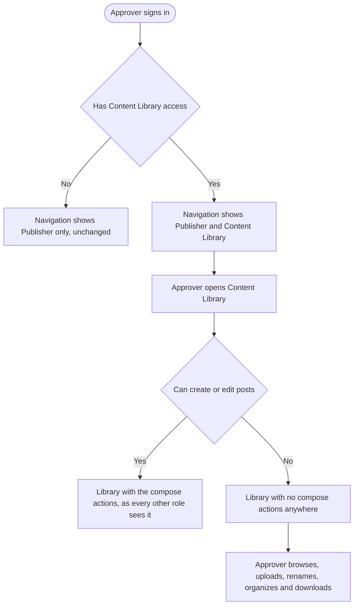
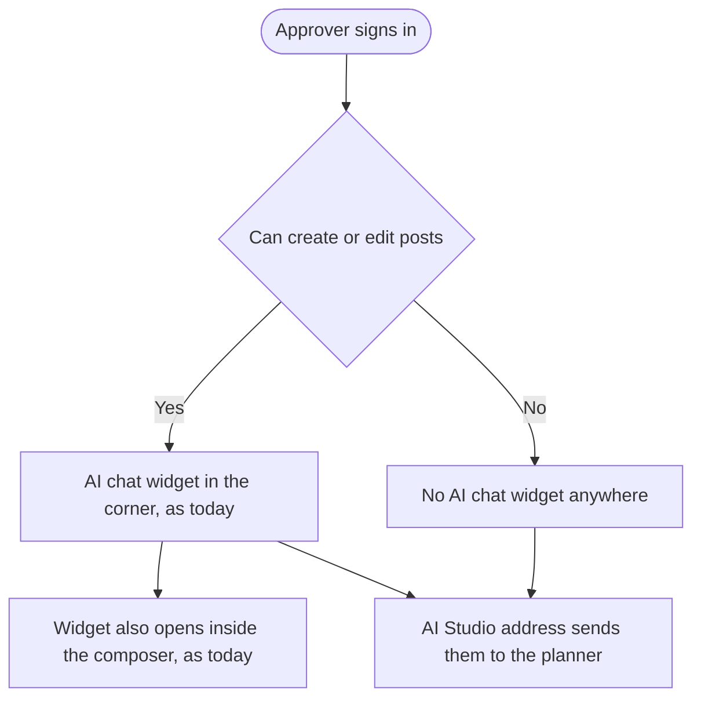
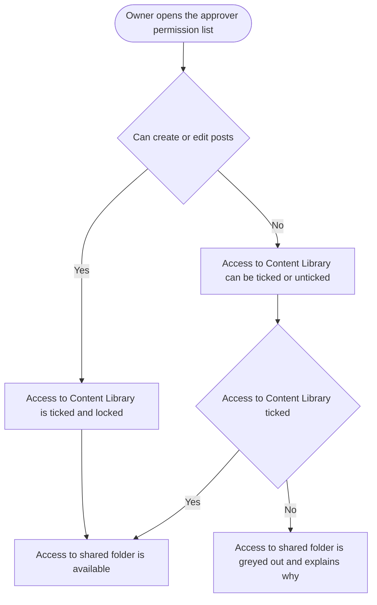

# Epic and Stories: Approver navigation, Content Library and AI access

**Date:** 2026-09-22 (revised after the marketing and product meeting)
**Stories in this batch:** 6 (1 backend, 3 frontend, 1 mobile, 1 design), plus one story already in the tracker

---

## Epic

### Title

**Make the approver's navigation, Content Library and AI access follow their permissions**

### Goal

The approver role has drifted out of shape. What an approver can see is decided by their role name, while what an approver is allowed to do is decided by per-member permissions a workspace owner sets. Those two answers no longer agree, and the result is a role that is both too closed and too open at the same time.

An approver who can create or edit posts already has the entire Content Library available to them inside the composer. They browse folders, upload files, organize them. What they cannot do is open the Content Library on its own, because the navigation has no entry for it and the address sends them back to the planner. The capability was granted, only the front door is missing.

An approver who can do neither still gets offered an "Access to shared folder" permission in the settings screen, ticked on by default, that provably does nothing. That approver has no way to reach the Content Library at all, so nothing about that setting can ever take effect. A workspace owner turns it on, nothing happens, and no screen explains why.

At the same time the AI chat widget sits in the corner of the screen for every approver, including one whose entire job is to approve or reject other people's posts and who has nothing to write.

Underneath all of it is one cause: what an approver sees is a hardcoded list keyed on the role name, and it never consults the permissions the workspace owner set. This epic replaces that with navigation, library access and AI access that follow the permissions, so what an approver sees matches what they are allowed to do, and a workspace owner can predict the result of every switch they flip.

The central change is a new permission, **Access to Content Library**, which lets a workspace owner give an approver the media library **without** giving them the composer or AI. That case does not exist today and is the reason for most of the work below.

### The agreed model

| Approver has | Content Library module | Composer | AI chat widget | AI Studio | "Access to shared folder" |
|---|---|---|---|---|---|
| Neither post permission nor library access | hidden | no | hidden | hidden | unavailable, greyed out |
| Library access only | **visible** | **no**, and no way in from the library | hidden | hidden | available |
| Can create or edit posts | visible, **locked on** | yes | **visible** | hidden | available |

Three rules follow from it:

1. **Access to Content Library stands on its own.** Granting it gives the module and nothing else. No composer, no AI.
2. **It is granted automatically with the post permissions and cannot then be taken away.** An approver who can create or edit posts reaches the library through the composer whatever the setting says, so the setting is locked on rather than pretending otherwise.
3. **A library-only approver has no route into the composer at all.** Not from an asset, not from the upload panel, not from the preview. The module is for organizing files, not for starting posts.

### Scope

- A new per-member permission, Access to Content Library, stored, enforced and shown in the team settings screen.
- The Content Library reachable as its own destination for approvers who have that permission, on web and in the mobile app.
- Every route from the Content Library into the composer closed for approvers who cannot create or edit posts.
- The AI chat widget, in the corner of the screen and in the composer, shown only to approvers who can create or edit posts.
- The "Access to shared folder" permission shown as unavailable, with an explanation, until the approver has the Content Library.
- The approver's navigation laid out correctly in both of the shapes it now has: one module for an approver who can only review, two modules for an approver who also has the Content Library.
- A single design pass covering both navigation shapes and the new permission states.

### Out of scope

- **AI Studio for approvers.** It stays hidden whatever permissions an approver holds. Worth knowing that this is not quite a no-op: the module has no entry point in an approver's interface today, but the address still opens it for them. The AI story below closes that, which is a behaviour change for anyone who had bookmarked it.
- The AI assistant in the mobile app. The agreed AI rule was scoped to web and the app is untouched.
- Any change to what an approver may do inside the Content Library on mobile. The app lets approvers browse but not upload, delete, move or manage folders, and that stays as it is. It is a real difference from web and a separate product decision.
- Any other part of the approver's navigation. Home, Discover, Analytics, Inbox, Social Listening, Automations and API stay closed to approvers.
- Any change to the Administrator or Collaborator roles. The new permission is read for approvers only.

### Stories in this epic

Already in the tracker, to be moved under this epic:

- **[FE] Merge the module rail and the sidebar when a user can reach only one module** (CONT-3932), https://app.helpin.ai/w/contentstudio/pm/tasks/432660c4-260e-49b3-80b8-4b70a1195a9b?task=CONT-3932

New in this batch:

1. **[BE] Add the Content Library permission for approvers and enforce it on the media endpoints**
2. **[FE] Show the Content Library to approvers who have the permission, with no way into the composer**
3. **[FE] Show the AI chat widget only to approvers who can create or edit posts**
4. **[FE] Add the Content Library permission to the approver settings and explain when each one applies**
5. **[Flutter] Show the Content Library menu entry to approvers who have the Content Library permission**
6. **[Design] Define the approver navigation and the new permission states**

### How the navigation stories fit together

The two navigation stories look like they conflict and do not, because the merged sidebar story is written on how many modules a user can reach rather than on the role name. Read together they give one rule:

- An approver with no Content Library access reaches **one** module, so they get the merged single sidebar.
- An approver with Content Library access reaches **two** modules, Publisher and Content Library, so they keep the standard navigation.

Whichever ships first must not break that split. In particular, the merged sidebar must not assume every approver is a single-module user.

### Sequencing

The backend story should land first, since everything else reads the permission it defines. The design story should land before or alongside the frontend work, since it settles both navigation shapes and the new permission states at once. The AI story and the mobile story are independent and can ship in any order.

One ordering trap: the settings story makes the new permission visible to workspace owners. Shipping it before the backend story means owners can tick a permission that does nothing, which is the exact problem this epic exists to fix.

### Success measure

A workspace owner can set up an approver and correctly predict what that approver will see, with no support ticket and no trial and error. Specifically: an owner can grant the Content Library without accidentally granting the composer or AI, an approver granted post permissions finds the Content Library where every other role finds it, an approver without them is never offered a setting that cannot take effect, and no approver ever finds a way into the composer that their permissions do not allow.

---

## Stories

---

## [BE] Add the Content Library permission for approvers and enforce it on the media endpoints

### Description:

As a workspace owner, I want the Content Library permission I set for an approver to be honoured by the product itself and not only by the screen, so that hiding the Content Library from an approver actually withholds it rather than merely making it hard to find.

This adds a new per-member permission that decides whether an approver may use the Content Library. It also settles, in one place, the rule that an approver who can create or edit posts always has it, so that no screen can ever disagree with any other screen about the answer.

There is a second reason to put this on the server. The media endpoints carry no role restriction at all today, so what an approver can reach has only ever been decided by which links the interface offered them. Anyone who knew the addresses could call them. This closes that.

---

### Workflow:

This story has no user-facing screen of its own. It is the rule the other stories in this epic read. The behaviour a user eventually sees is described in **[FE] Show the Content Library to approvers who have the permission, with no way into the composer** and **[FE] Add the Content Library permission to the approver settings and explain when each one applies**.

---

### Acceptance criteria:

**The permission**

- [ ] A new per-member permission decides whether a member may use the Content Library, saved alongside the existing team member permissions and returned wherever member permissions are returned today
- [ ] Adding a team member and updating a team member both accept and save it
- [ ] For an approver it defaults to **off**, so no existing approver gains the Content Library when this ships
- [ ] For Administrators, Collaborators and the workspace owner the permission is ignored entirely, and their Content Library access is exactly what it is today

**The derived rule**

- [ ] An approver who can create posts has Content Library access, whatever the new permission is set to
- [ ] An approver who can edit posts has Content Library access, whatever the new permission is set to
- [ ] An approver with neither post permission has Content Library access only when the new permission is on
- [ ] The rule is answered in one place, so the interface, the mobile app and the media endpoints cannot give different answers for the same member

**Enforcement**

- [ ] A member without Content Library access is refused when they call the media endpoints directly, including listing folders, listing assets, uploading, moving, renaming, deleting and downloading
- [ ] The refusal is a permission error, not an empty result, so the caller can tell "not allowed" apart from "nothing here"
- [ ] A member with Content Library access is served exactly as they are today, with no change to any response shape
- [ ] The existing "Access to shared folder" filtering is unchanged and still applies on top: a member with Content Library access but without shared folder access gets the library with the shared folder removed from it
- [ ] The workspace owner is never refused, whatever any permission says

**No regressions**

- [ ] Every non-approver role reaches the media endpoints exactly as they do today
- [ ] Attaching media while writing a post is unaffected for every member who is allowed to write posts
- [ ] Existing team member records that carry no value for the new permission are read as off for approvers, with no migration and no data backfill

---

### Mock-ups:

N/A, backend only.

---

### Impact on existing data:

No migration. Existing team member records simply do not carry the new permission, and a missing value is read as off for approvers.

This default is deliberate and is the opposite of the one chosen for "Access to shared folder", which defaults to on. If the new permission defaulted to on, every existing review-only approver would silently gain the Content Library the day this ships. Defaulting to off means workspace owners opt in, which is the safer direction for a permission that widens access.

Worth flagging to the PO: approvers who **can** create or edit posts will gain the Content Library on deploy regardless of the default, because the derived rule grants it to them. That is intended and is the point of the epic, but it is a visible change for those members.

---

### Impact on other products:

- **Web app and mobile app:** both read this rule. Neither can be correct until it exists.
- **Chrome extension:** no impact. It does not use the Content Library.
- **Public API:** no new endpoint. The permission travels with the member record that is already returned.
- **White label:** no impact. The permission is per team member, not per domain.

---

### Dependencies:

None. This is the first story in the epic and everything else depends on it.

---

### Global quality & compliance (wherever applicable)

- [ ] Mobile responsiveness (frontend only, N/A for backend-only stories)
- [ ] Multilingual support (frontend + backend, translations available or fallback handled)
- [ ] UI theming support (N/A, backend-only story)
- [ ] White-label domains impact review
- [ ] Cross-product impact assessment (web, mobile apps, Chrome extension)
- [ ] Developer surfaces coverage (the new permission and the media endpoint enforcement both reach the public API and the MCP team toolset, so anything reading team member permissions or calling media endpoints with an approver key behaves the same way the app does)

---

## [FE] Show the Content Library to approvers who have the permission, with no way into the composer

### Description:

As an approver who has been given the Content Library, I want to open it from my navigation and organize the workspace's files, so that I can do the part of the job I was given without needing a permission to write posts that nobody intended me to have.

Two different approvers arrive at the same screen by different routes, and the screen has to behave differently for each.

An approver who can create or edit posts already has the whole Content Library inside the composer. They browse folders, upload, organize. The only thing they cannot do is open it on its own, because the navigation has no entry and the address sends them back to the planner. For them this story is a front door onto a room they are already standing in.

An approver who has only been given the Content Library is new. They get the module, and they must find no way out of it into the composer. Not from an asset, not from the upload panel, not from the preview. They were given a filing cabinet, not a pen.

---

### Workflow:

1. A workspace owner turns on **Access to Content Library** for an approver who cannot create or edit posts.
2. That approver signs in and the navigation now shows two modules: **Publisher** and **Content Library**.
3. They open **Content Library** and see the workspace's folders and files, with the same search, filters, upload and folder controls every other role sees.
4. They upload a file, rename it, move it between folders, add a note to it and download it. All of this works.
5. Nowhere on the screen is there an action that starts a post. Selecting a file offers preview, note, download, move and delete, and nothing that opens the composer. The upload panel offers no way to carry the files into a post.
6. Opening a file's preview shows the same: no action that leaves for the composer.
7. If the workspace owner has turned off "Access to shared folder" for this approver, the shared folder is absent from the folder list.
8. An approver who **can** create or edit posts sees the Content Library exactly as every other role does, compose actions included.
9. An approver with no Content Library access sees no entry for it, and typing the address still sends them to the planner.

---

### Acceptance criteria:

**Who sees the module**

- [ ] An approver with "Access to Content Library" turned on sees a **Content Library** entry in the desktop navigation, alongside Publisher
- [ ] An approver who can create posts sees it, whatever "Access to Content Library" is set to
- [ ] An approver who can edit posts sees it, whatever "Access to Content Library" is set to
- [ ] An approver with none of the three sees no entry, and their navigation is unchanged from today
- [ ] No other role's navigation changes in any way

**Reaching the page**

- [ ] An approver with Content Library access can open the Content Library address directly, including from a bookmark and from browser back and forward
- [ ] An approver without it is still sent to the planner when they open that address directly
- [ ] The Content Library opens with the folders, assets, search, filter, upload and folder controls that other roles see there

**No way into the composer for a library-only approver**

- [ ] For an approver who can neither create nor edit posts, no action anywhere in the Content Library opens the composer
- [ ] The per-asset compose actions, labelled **Compose Post** and **Add to Composer**, are absent from every asset card
- [ ] The **Add to Composer** action is absent from the upload panel after files finish uploading
- [ ] The asset preview offers no action that opens the composer
- [ ] Selecting several assets at once offers no bulk action that opens the composer
- [ ] With every compose action removed, the remaining actions still sit correctly and leave no gap, stray divider or empty menu where one used to be
- [ ] The composer cannot be reached from the Content Library by any other means available to that approver, including the address bar
- [ ] An approver who **can** create or edit posts keeps every compose action exactly as it is today, and using one opens the composer with the chosen media attached, unchanged

**The shared folder permission**

- [ ] With "Access to shared folder" turned on, the approver sees the shared folder and can open, upload into and download from it
- [ ] With it turned off, the shared folder does not appear in the approver's folder list, and they cannot open, upload into or download from it
- [ ] This holds for a library-only approver and for an approver who can create or edit posts alike

**Nothing else opens up**

- [ ] Home, Discover, Analytics, Inbox, Social Listening, Automations, AI Studio and API remain absent from the approver's navigation
- [ ] The approver still cannot reach any address outside the ones they can reach today, apart from the Content Library
- [ ] The media picker that an approver with post permissions opens while writing a post behaves exactly as it does today

**Collapsed navigation**

- [ ] With the navigation collapsed, both the Publisher and Content Library icons are shown for an approver who has the library
- [ ] Hovering either collapsed icon shows its name, and the label is not clipped
- [ ] The current module is clearly marked in both the expanded and collapsed states

---

### Mock-ups:

No new screens. The Content Library page and the navigation entry both already exist and are shown to every other role today. The new part is the Content Library with its compose actions removed, which is an existing screen with fewer controls on it.

Two things need a designer, and both are covered by **[Design] Define the approver navigation and the new permission states**: how an approver's navigation reads with two modules against the single-module layout in **[FE] Merge the module rail and the sidebar when a user can reach only one module**, and how the asset card and its action menu sit once the compose actions come out.

**Copy:** none is new. The navigation entry reads **Library** with a hover label of **Content Library**, which is the wording every other role already sees, so every language is already covered. No replacement copy is needed where the compose actions are removed. They are removed, not disabled, and no explanation is shown in their place, because an approver who never had them has nothing to be told.

**Empty, loading and error states:** none are introduced. The Content Library has its own and they are unchanged. A library-only approver with an empty library sees the same empty state as anyone else, except that any action in it that would start a post is absent for the same reason as everywhere else.

---

### Impact on existing data:

None. Nothing is stored and nothing is migrated. The permissions this reads are saved on the team member record and their values are not changed by this story.

---

### Impact on other products:

- **Web app:** the only product changed by this story.
- **Mobile app:** the same gap exists there and is covered by **[Flutter] Show the Content Library menu entry to approvers who have the Content Library permission**. Neither story depends on the other shipping first.
- **Chrome extension:** no impact.
- **White label:** the navigation entry follows the existing theming and should be checked once on a workspace with a non-default primary color.

---

### Dependencies:

Depends on **[BE] Add the Content Library permission for approvers and enforce it on the media endpoints**. Without it there is no permission to read.

Related but not blocking: **[FE] Merge the module rail and the sidebar when a user can reach only one module**, the other navigation story in this epic. The two fit together without either being rewritten, because that story's rule is written on how many modules a user can reach rather than on the role name. An approver with the Content Library reaches two modules and keeps the standard navigation. An approver without it reaches one and gets the merged sidebar. Whichever ships first must not assume every approver is a single-module user.

---

### Global quality & compliance (wherever applicable)

- [ ] Mobile responsiveness (frontend only, N/A for backend-only stories)
- [ ] Multilingual support (frontend + backend, translations available or fallback handled)
- [ ] UI theming support (default + white-label, design library components are being used)
- [ ] White-label domains impact review
- [ ] Cross-product impact assessment (web, mobile apps, Chrome extension)
- [ ] Developer surfaces coverage (N/A, this story changes nothing API-facing)

---

## [FE] Show the AI chat widget only to approvers who can create or edit posts

### Description:

As an approver whose job is to review other people's posts, I do not want an AI writing assistant following me around the screen, so that the interface offers me the things I can act on rather than a tool for a job I was not given.

The AI chat widget sits in the bottom-right corner of every screen and opens inside the composer. It exists to help someone write. An approver who can neither create nor edit posts has nothing to write, so for them it is a permanent offer they can never usefully take up.

This ties the widget to the post permissions. An approver who can create or edit posts keeps it exactly as it is. An approver who cannot no longer sees it.

The same story closes a related gap. AI Studio is understood to be unavailable to approvers, and there is indeed no way into it from an approver's navigation. The address still opens it for them though. This story makes the two agree, so AI Studio is genuinely unavailable to every approver rather than merely unadvertised.

---

### Workflow:

1. An approver who can create or edit posts signs in. The AI chat widget is in the bottom-right corner, exactly where it is today.
2. They open the composer and the AI chat is available there, exactly as it is today.
3. A different approver, who can neither create nor edit posts, signs in. There is no AI chat widget in the corner of any screen.
4. That approver moves between the planner and their other views and the widget never appears.
5. Either approver typing the AI Studio address is sent to the planner.
6. A workspace owner turns on "Can create posts & send for approval" for the second approver. The next time that approver signs in, the widget is there.

---

### Acceptance criteria:

**The widget**

- [ ] An approver who can create posts sees the AI chat widget in the corner of the screen, unchanged from today
- [ ] An approver who can edit posts sees it, unchanged from today
- [ ] An approver with neither post permission sees no AI chat widget on any screen they can reach
- [ ] For that approver the widget is absent rather than shown and disabled, with no placeholder, lock icon or upgrade prompt in its place
- [ ] The AI chat inside the composer follows the same rule, which means it is available to every approver who can open the composer at all
- [ ] Granting either post permission to an approver gives them the widget the next time they sign in

**AI Studio**

- [ ] No approver can open AI Studio, whatever permissions they hold, including by typing the address, from a bookmark and through browser back and forward
- [ ] An approver who tries is sent to the planner, the same way every other unavailable address already behaves for them
- [ ] AI Studio remains absent from every approver's navigation, as it is today

**No regressions**

- [ ] Administrators, Collaborators and the workspace owner see the AI chat widget and AI Studio exactly as they do today
- [ ] Hiding the widget for an approver does not affect anyone else's chat, including any conversation already in progress in another session
- [ ] No console error, layout shift or empty region appears on a screen where the widget is absent

---

### Mock-ups:

No new screens and no new copy. This removes an existing widget for one group of users and closes an address. Nothing is added to the interface.

**Empty, loading and error states:** none are introduced. Where the widget is hidden there is nothing to load and nothing that can fail.

---

### Impact on existing data:

None. No conversation history is deleted or hidden. An approver who loses the widget and is later granted a post permission finds their previous conversations as they left them.

---

### Impact on other products:

- **Web app:** the only product affected.
- **Mobile app:** deliberately unchanged. The AI assistant in the app is out of scope for this epic and keeps its current behaviour. If the same rule is wanted there, it needs its own story.
- **Chrome extension:** no impact.
- **White label:** no impact.

---

### Dependencies:

None. This reads the post permissions, which already exist, so it can ship at any point in the epic.

---

### Global quality & compliance (wherever applicable)

- [ ] Mobile responsiveness (frontend only, N/A for backend-only stories)
- [ ] Multilingual support (frontend + backend, translations available or fallback handled)
- [ ] UI theming support (default + white-label, design library components are being used)
- [ ] White-label domains impact review
- [ ] Cross-product impact assessment (web, mobile apps, Chrome extension)
- [ ] Developer surfaces coverage (N/A, this story changes nothing API-facing)

---

## [FE] Add the Content Library permission to the approver settings and explain when each one applies

### Description:

As a workspace owner setting up an approver, I want to give them the Content Library without also giving them the composer, and I want each permission to tell me when it will and will not do anything, so that I can set an approver up correctly the first time instead of guessing and checking.

Two problems in the same panel. There is no way to give an approver the Content Library on its own, which is the gap this epic exists to close. And "Access to shared folder" sits there ticked on by default for approvers who cannot reach the Content Library at all, where it can never take effect, with nothing on the screen to say so.

This adds the new permission and makes both of them honest about when they apply.

---

### Workflow:

1. A workspace owner opens Settings, then Manage Team & Roles, and adds or edits an approver.
2. They open the approver's permission list and see a new option, **Access to Content Library**.
3. This approver can neither create nor edit posts, so the new option can be ticked or unticked freely. Below it, **Access to shared folder** is greyed out and cannot be changed.
4. The owner hovers the information icon next to the greyed out option and reads that the Content Library has to be granted first.
5. The owner ticks **Access to Content Library**. **Access to shared folder** becomes changeable straight away, with no saving or reopening.
6. The owner decides whether this approver should see the shared folder, and saves. That approver now gets the Content Library and nothing else.
7. Later the owner turns on **Can create posts & send for approval** for the same approver. **Access to Content Library** immediately ticks itself and greys out, and can no longer be changed.
8. The owner hovers its information icon and reads that an approver who can create or edit posts always has the Content Library.
9. The owner turns the post permission back off. **Access to Content Library** becomes changeable again and returns to whatever the owner had last chosen, rather than to a default.

---

### Acceptance criteria:

**The new permission**

- [ ] The approver permission list shows a new option labelled **Access to Content Library**
- [ ] For a new approver it starts unticked
- [ ] For an approver who can neither create nor edit posts it can be ticked and unticked freely, and the choice is saved
- [ ] It appears only for the Approver role. The Administrator and Collaborator lists are completely unchanged
- [ ] An information icon sits beside it and shows the copy below

**Locked when the post permissions grant it**

- [ ] When the approver can create posts, the option is ticked and greyed out and cannot be unticked
- [ ] When the approver can edit posts, the same
- [ ] Clicking the locked option does nothing. No value changes and the list does not close
- [ ] Turning on either post permission ticks and locks it immediately in the same open panel, with no saving or reopening
- [ ] Turning both post permissions back off unlocks it and restores the value the owner last chose, rather than resetting it to unticked
- [ ] The information icon explains the lock while it is locked, using the copy below

**The shared folder permission becomes honest**

- [ ] When the approver has no Content Library access, "Access to shared folder" is visible but greyed out and cannot be ticked or unticked
- [ ] Clicking it does nothing. No value changes and the list does not close
- [ ] Turning on Content Library access, whether directly or by granting a post permission, makes it changeable immediately in the same open panel
- [ ] Taking Content Library access away greys it out again and keeps the value the owner last chose
- [ ] Saving a member whose option is greyed out leaves the stored value exactly as it was
- [ ] Hovering its information icon shows the greyed out copy or the available copy below, matching its state

**Select all and the summary**

- [ ] "Select all" does not change any greyed out or locked option
- [ ] A greyed out option does not count towards the selected count shown on the permission list
- [ ] A locked option does count, because it is genuinely granted

**Everywhere an approver is invited**

- [ ] The behaviour is the same when adding a new approver and when editing an existing one
- [ ] The behaviour is the same in the organization member dialog and in the guided workspace setup invite step, so an approver invited from any of these places is treated identically
- [ ] Each information icon is reachable and its text readable for someone using a keyboard or a screen reader

---

### Mock-ups:

No new screens or components. This adds one option to an existing list, plus a greyed out state and a locked state for options in it. Use the existing `Checkbox` component's disabled state rather than styling a new one, and keep the existing information icon with the tooltip already used in this list.

The greyed out and locked treatments, and how a user tells the two apart, should be confirmed by design and are covered by **[Design] Define the approver navigation and the new permission states**.

### UI copy

**New option label:**

> Access to Content Library

**Its information icon, when the option can be changed:**

> Let this approver open the Content Library and organize the workspace files. They will still not be able to create or edit posts, and they will find no way to start a post from the library. Turn on "Can create posts & send for approval" or "Can edit posts" if you want them to write posts too.

**Its information icon, when the option is ticked and locked:**

> This approver can create or edit posts, so they already have the Content Library and this cannot be turned off. To take the Content Library away, turn off both "Can create posts & send for approval" and "Can edit posts" first.

**"Access to shared folder" label** (unchanged):

> Access to shared folder

**Its information icon, when the option is greyed out:**

> This setting has no effect yet. Turn on "Access to Content Library" first, then choose whether this approver sees the shared folder.

**Its information icon, when the option can be changed:**

> Allow this approver to view and use the shared folder in the Content Library. The shared folder is a common space where all permitted team members can upload, organize, and access media files together. If turned off, the shared folder will not appear for this approver anywhere, including when they attach media to a post.

**Administrator and Collaborator lists:** their existing "Access to shared folder" explanation stays exactly as it is. This story adds copy for the approver role only.

**Empty, loading and error states:** none are introduced. The permission list has no empty variant, and this story adds no request of its own.

---

### Impact on existing data:

No value is written, cleared or migrated by this story. Approvers who already have a shared folder value keep it.

One thing for the PO to note in release notes. "Access to shared folder" currently defaults to on for everyone, so most existing approvers already have it stored as on. It has never done anything for them. The moment an approver is given the Content Library, whether directly or by being given a post permission, that stored value starts taking effect and the shared folder appears. That is the intended behaviour and matches how Collaborators and Administrators already work, but for those approvers it will look like a change.

---

### Impact on other products:

- **Web app:** the only product affected. Team permissions are managed on web only.
- **Mobile app:** no impact. Permissions cannot be edited from the app, though the app reads the result. See **[Flutter] Show the Content Library menu entry to approvers who have the Content Library permission**.
- **Chrome extension:** no impact.
- **White label:** no impact. The permission is per team member, not per domain.

---

### Dependencies:

Depends on **[BE] Add the Content Library permission for approvers and enforce it on the media endpoints**. Shipping this first would let workspace owners tick a permission that does nothing, which is the exact problem this epic exists to fix.

Reads best alongside **[FE] Show the Content Library to approvers who have the permission, with no way into the composer**, which is the story that makes the new permission visible to the approver.

---

### Global quality & compliance (wherever applicable)

- [ ] Mobile responsiveness (frontend only, N/A for backend-only stories)
- [ ] Multilingual support (frontend + backend, translations available or fallback handled)
- [ ] UI theming support (default + white-label, design library components are being used)
- [ ] White-label domains impact review
- [ ] Cross-product impact assessment (web, mobile apps, Chrome extension)
- [ ] Developer surfaces coverage (N/A, the permission itself is defined and exposed by the backend story)

---

## [Flutter] Show the Content Library menu entry to approvers who have the Content Library permission

### Description:

As an approver using the ContentStudio app who has been given the Content Library, I want it in the app's menu so that I can browse the workspace's media without having to start writing a post first.

The app hides the Content Library menu entry from every approver, without looking at what that approver is allowed to do. At the same time it deliberately lets an approver reach the media picker while writing a post, on the reasoning that attaching an existing file is part of drafting. That leaves the same inconsistency the web app has: the capability is granted, but the direct route to it is closed.

This makes the menu entry follow the same rule the web app uses, so an approver granted the Content Library finds it in both places.

**Out of scope:** what an approver may do once inside. The app lets approvers browse but not upload, delete, move or manage folders, and this story does not change that. Widening it is a separate product decision, and worth noting that the web app is more permissive here.

Also out of scope: the AI assistant in the app, which keeps its current behaviour.

---

### Workflow:

1. A workspace owner turns on **Access to Content Library** for an approver, or turns on a post permission which grants it automatically.
2. That approver opens the app and the menu now shows a **Content Library** entry.
3. They select it and the Content Library opens, showing the workspace's folders and files.
4. If the workspace owner has turned off "Access to shared folder" for them, the shared folder is not in the list.
5. They browse and preview files. Upload, delete, move and folder management stay unavailable to them, as they are today.
6. An approver with no Content Library access opens the menu and sees no Content Library entry, exactly as today.
7. Attaching media while writing a post works exactly as it does today for every approver who can get to the composer.

---

### Acceptance criteria:

- [ ] An approver with "Access to Content Library" turned on sees the Content Library entry in the app's menu
- [ ] An approver who can create posts sees it, whatever that permission is set to
- [ ] An approver who can edit posts sees it, whatever that permission is set to
- [ ] An approver with none of the three sees no Content Library entry, unchanged from today
- [ ] The entry stays hidden for everyone when the workspace's plan does not include the Content Library, whatever permissions the approver holds
- [ ] Every non-approver role sees the menu exactly as they do today
- [ ] Opening the Content Library from the menu shows the workspace's folders and files
- [ ] With "Access to shared folder" turned off, the shared folder does not appear for that approver, in the menu route or in the media picker
- [ ] Upload, delete, move and folder management remain unavailable to approvers, both from the menu route and from the media picker, unchanged from today
- [ ] No action in the app's Content Library starts a post for an approver who cannot create or edit posts
- [ ] The media picker an approver uses while writing a post behaves exactly as it does today
- [ ] Switching to a workspace where the same person has no Content Library access removes the entry, and switching back restores it
- [ ] Behaviour is identical on iOS and Android

---

### Mock-ups:

No new screens. The Content Library screen and its menu entry already exist and are shown to other roles. No new copy, so every language is already covered.

**Empty, loading and error states:** none are introduced. The Content Library screen has its own and they are unchanged.

---

### Impact on existing data:

None. No local storage, no cached state, no migration. This reads a permission the app receives with the member record.

---

### Impact on other products:

- **Mobile app:** the only product changed by this story. One change ships to both iOS and Android.
- **Web app:** covered by **[FE] Show the Content Library to approvers who have the permission, with no way into the composer**. Neither depends on the other.

---

### Dependencies:

Depends on **[BE] Add the Content Library permission for approvers and enforce it on the media endpoints**, which defines the permission and the rule this reads.

---

### Global quality & compliance (wherever applicable)

- [ ] Mobile responsiveness (frontend only, N/A for backend-only stories)
- [ ] Multilingual support (frontend + backend, translations available or fallback handled)
- [ ] UI theming support (default + white-label, design library components are being used)
- [ ] White-label domains impact review
- [ ] Cross-product impact assessment (web, mobile apps, Chrome extension)
- [ ] Developer surfaces coverage (N/A, this story changes nothing API-facing)

---

## [Design] Define the approver navigation and the new permission states

### Description:

As a developer building the approver's Content Library and permission work, I want the designer to settle how an approver's navigation reads in each of its shapes, how the Content Library looks with its compose actions removed, and how a permission that is greyed out differs from one that is locked on, so that I am not deciding those in code.

Three things need a designer's eye. The approver's navigation now has two shapes depending on a permission, and one of those shapes is the subject of a separate story in this epic to merge the whole thing into one sidebar. The Content Library gains a variant with several actions taken out of it. And the permissions panel gains two states it has never had: an option that cannot be changed because it would not do anything, and an option that cannot be changed because it is already granted.

---

### Workflow:

1. The designer reviews the approver's navigation in both of its shapes: one module for an approver with no Content Library access, two modules for an approver who has it.
2. The designer reconciles that split with the single-sidebar story in this epic, and says which layout each approver gets.
3. The designer reviews the Content Library with every compose action removed and specifies how the remaining controls sit.
4. The designer specifies the greyed out and locked states in the permission list, and how a user tells them apart.
5. The designer hands all of it to engineering before or alongside the frontend work.

---

### Acceptance criteria:

**Approver navigation**

- [ ] The expanded navigation is specified for an approver who reaches two modules, Publisher and Content Library, showing order, spacing and how the current module is marked
- [ ] The collapsed navigation is specified for that approver, including both icons and their hover labels
- [ ] It is stated explicitly which layout an approver who reaches only one module gets, and whether that is today's layout or the merged sidebar described in **[FE] Merge the module rail and the sidebar when a user can reach only one module**
- [ ] The two layouts are shown side by side, so the change a workspace owner causes by granting the Content Library is visible at a glance
- [ ] Both layouts are shown at a laptop width, confirming the content area is not left cramped
- [ ] Both are shown once on a white-label workspace with a non-default primary color

**Content Library without the compose actions**

- [ ] The asset card is specified with its compose actions removed, showing how the remaining actions sit and confirming no gap or stray divider is left behind
- [ ] The asset action menu is specified in the same state, confirming it does not become a single-item menu or an empty one
- [ ] The upload panel is specified without its "Add to Composer" action, confirming the remaining action reads correctly as the primary one
- [ ] The asset preview is specified in the same state
- [ ] It is confirmed that nothing is shown in place of the removed actions, since an approver who never had them has nothing to be told

**The two new permission states**

- [ ] The greyed out state of an option in the team permission list is specified, covering the tick box, the label and the information icon
- [ ] The locked state, meaning ticked and not changeable, is specified the same way
- [ ] The two are clearly distinguishable from each other and from an option that is simply unticked, so a workspace owner can tell "this will not do anything" apart from "this is already granted"
- [ ] The hover behaviour of the information icon is specified for every state
- [ ] Both states are checked against a long translation of the option label so nothing wraps badly or clips
- [ ] Both are confirmed to work with the existing tick box and information icon in the design system, or any gap is named explicitly so it can be added to the library first

---

### Mock-ups:

This story is the one that produces them. Nothing to attach at creation.

---

### Impact on existing data:

None. Design only.

---

### Impact on other products:

- **Web app:** the navigation, library and permission work are all web.
- **Mobile app:** out of scope. The app's menu entry shows an entry that already exists and needs no new design.

---

### Dependencies:

Should be resolved alongside **[FE] Merge the module rail and the sidebar when a user can reach only one module**, the other navigation story in this epic, since both describe the approver's navigation and must agree with each other. That story already carries its own interactive mockup of the merged sidebar, so this design work builds on it rather than replacing it.

Should be delivered before or alongside **[FE] Show the Content Library to approvers who have the permission, with no way into the composer** and **[FE] Add the Content Library permission to the approver settings and explain when each one applies**.

---

### Global quality & compliance (wherever applicable)

- [ ] Mobile responsiveness (frontend only, N/A for backend-only stories)
- [ ] Multilingual support (frontend + backend, translations available or fallback handled)
- [ ] UI theming support (default + white-label, design library components are being used)
- [ ] White-label domains impact review
- [ ] Cross-product impact assessment (web, mobile apps, Chrome extension)
- [ ] Developer surfaces coverage (N/A, design story)
