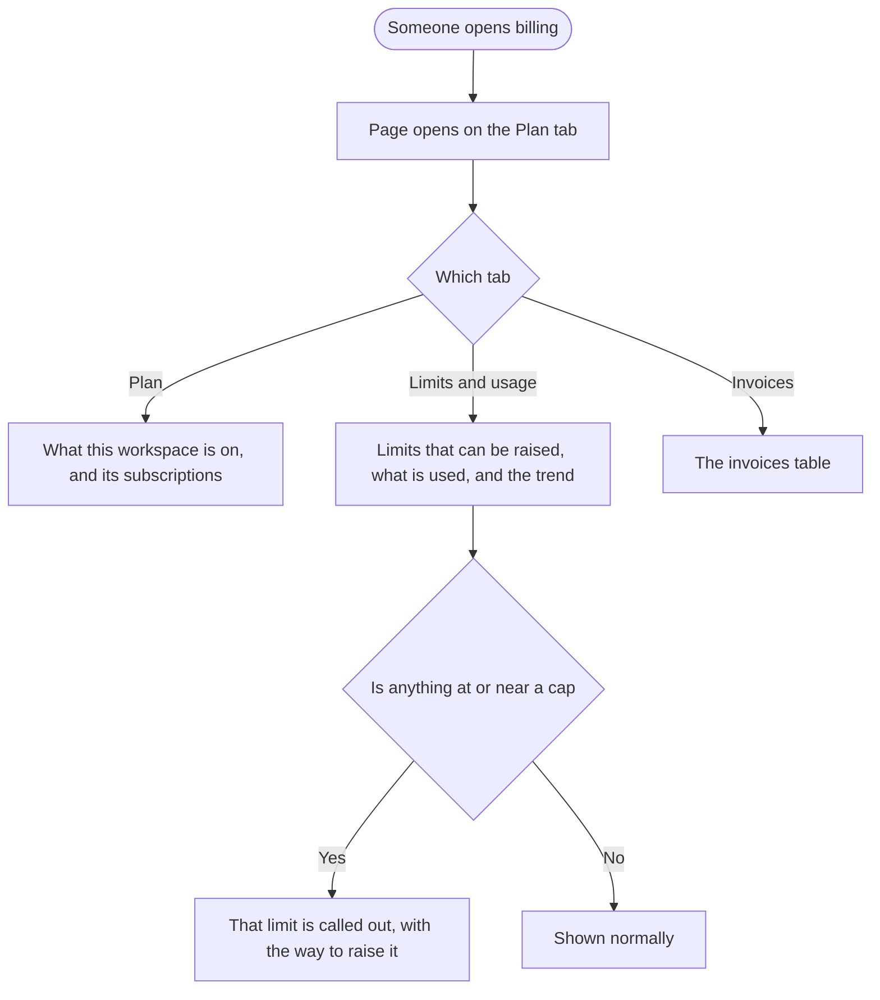

# Epic and Story: Billing page in three tabs

**Date:** 2026-09-16
**Stories:** 1, plus an existing design ticket tracked separately

---

## Epic

### Title

**Billing page in three tabs**

### Description

The billing page is one long scrolling column. Plan details, the X wallet, subscriptions, billing history, usage limits and reseller limits are stacked one after another, so finding an invoice means scrolling past everything else, and checking whether a limit is nearly full means scrolling past that too. Nothing is grouped by what the person came to do.

This restructures it into three tabs:

| Tab | What lives there |
|---|---|
| **Plan** | The overall summary of what this workspace is on, and the subscriptions behind it |
| **Limits and usage** | The limits that can be raised, what has been used against each, and the trend over time |
| **Invoices** | The invoices table |

Nothing is removed. The same information is regrouped so each tab answers one question: what am I on, what am I using, and what have I paid.

### Why three, and why these three

Those are the three reasons anyone opens this page. Someone checking their plan does not want to scroll past usage bars, and someone chasing an invoice for their finance team does not want to scroll past plan cards. The current single column forces everyone through everyone else's task.

### Scope

- The three tabs and the regrouping of existing content into them.
- Plan-aware behaviour, so each tab shows what is true for the plan this workspace is actually on.
- The page states that already exist or are known to be missing, listed below.

### Out of scope

- **Changing what anyone can buy**, or how limits and credits are priced. A separate epic covers add-on top-ups on the Standard plan, and this one must not collide with it.
- **A read-only viewer state.** People without billing access do not reach this page at all, so there is no such state to design.
- **Redesigning the plan comparison or checkout flows**, which keep working as they do today.
- **The design itself**, which is covered by the existing design ticket.

### The states this page has to handle

Taken from the prototype, minus the read-only viewer, which does not apply:

1. **No payment method.** The empty state plus a renewal warning.
2. **AI credits exhausted.** One credit type at its cap while another is approaching it, since these rarely run out together.
3. **Capped social accounts.** A count against a limit, or unlimited when the cap does not apply.
4. **Auto-recharge off.** The wallet shown in its off state.
5. **Loading.** Skeletons, never a progress bar sitting at zero.

Plus the plan states the page already deals with today: trial, trial expired, cancelled, paused, deleted, lifetime add-ons, reseller and white label, and API-only plans.

### Open before build

1. **Where do the X wallet, payment method and reseller limits go?** The three tabs as described do not name them. The wallet is a consumable balance so it reads as Limits and usage, payment method reads as Plan, and reseller limits read as Limits and usage, but none of that is decided.
2. **What happens to the plan states that currently take over the whole page?** Trial expired, cancelled, paused and deleted each replace the page today. With tabs, the question is whether they still take over everything or live in the Plan tab. **Someone whose plan was cancelled still needs to reach their invoices**, so taking over the whole page would trap them.
3. **Does each tab get its own address?** Bookmarking Invoices, or sending someone a link straight to it, only works if it does. There are also two existing routes pointing at this page today, and both need to keep working.
4. **How does this relate to the separate manage-limits screen**, which covers similar ground from a different entry point. Two places showing limits is the kind of thing this restructure could resolve or could make worse.

### Stories

1. **[FE] Restructure the billing page into Plan, Limits and usage, and Invoices tabs**

Design is covered by the existing design ticket, which is tracked separately and should land before this story starts.

---

## Story 1

### Title

**[FE] Restructure the billing page into Plan, Limits and usage, and Invoices tabs**

### Description

As someone managing a ContentStudio subscription, I want the billing page grouped into tabs, so that I can go straight to the thing I came for instead of scrolling through everything else to reach it.

Today it is a single column: plan details, then the wallet, then subscriptions, then billing history, then usage limits, then reseller limits. Every visit means scrolling past other people's concerns. Grouping into Plan, Limits and usage, and Invoices gives each visit one place to land.

The content itself is not being rewritten. It is being regrouped, and made to behave sensibly across the plans and states this page already has to deal with.

---

### Workflow

1. Someone opens billing from settings. The page opens on the **Plan** tab.
2. The Plan tab shows what this workspace is on: the plan, what it renews or expires, and the subscriptions behind it.
3. They switch to **Limits and usage**. Each limit that can be raised is listed with how much has been used against it, and how usage has moved over time.
4. Anything at its cap, or close to it, is called out rather than left for the person to spot, with the way to raise it right there.
5. They switch to **Invoices** and see the invoices table, with the ability to find and open an individual invoice.
6. Their tab choice is reflected in the address, so they can bookmark Invoices or send someone a link straight to it.
7. On any tab, what they see is true for the plan they are actually on. Something their plan does not include is either absent or shown as unavailable with a way to change that, never shown as if it were available.

---

### Acceptance criteria

**The three tabs**

- [ ] The billing page presents three tabs: **Plan**, **Limits and usage**, and **Invoices**
- [ ] The page opens on the Plan tab
- [ ] The Plan tab carries the overall summary of what the workspace is on, and the subscriptions behind it
- [ ] The Limits and usage tab carries the limits that can be raised, the usage against each, and the usage trend
- [ ] The Invoices tab carries the invoices table
- [ ] **Nothing that is on the page today is lost.** Every card and every piece of information currently shown is reachable in one of the three tabs
- [ ] Switching tabs does not reload the page or lose anything the person had already opened
- [ ] The selected tab is reflected in the address, so a tab can be bookmarked and linked to directly
- [ ] Both existing routes that reach this page continue to work and land somewhere sensible

**Limits and usage**

- [ ] Each limit that can be raised shows what has been used against it and what the limit is
- [ ] Each shows how usage has moved over time, so someone can see whether they are about to run out
- [ ] A limit at its cap is clearly marked as such, and the way to raise it is offered directly
- [ ] A limit approaching its cap is called out before it is reached, not only once it is hit
- [ ] A limit that does not apply, because the plan has no cap on it, reads as unlimited rather than as a very large number
- [ ] **Limits that can be topped up and limits fixed to the plan are distinguishable**, since raising them means two different things, and the path offered matches which kind it is
- [ ] Where a credit type is exhausted and another is only approaching its cap, both are represented accurately at the same time, since they rarely run out together

**Plan-aware behaviour**

- [ ] Each tab reflects the plan this workspace is actually on
- [ ] Something the plan does not include is either not shown, or shown as unavailable with the way to change that. It is never shown as if it were available
- [ ] The page behaves correctly on a trial, and on a trial that has expired
- [ ] The page behaves correctly for a cancelled, paused or deleted plan
- [ ] **Someone on a cancelled, paused or expired plan can still reach their invoices**, since they still need them for their own records
- [ ] Lifetime add-ons are represented correctly
- [ ] Reseller and white-label arrangements are represented correctly
- [ ] An API-only plan shows what applies to it and nothing that does not

**The states**

- [ ] **No payment method:** the empty state is shown along with a warning about what happens at renewal
- [ ] **Auto-recharge off:** the wallet is shown in its off state, and turning it back on is available from there
- [ ] **Capped social accounts:** the count against the limit is shown when a cap applies, and unlimited when it does not
- [ ] **Loading:** each tab uses skeletons while it loads. **No progress bar sits at zero**, since an empty bar reads as "you have used nothing" rather than "this has not loaded"
- [ ] **Failure to load:** a tab that cannot load its content says so and offers a retry, rather than showing an empty tab that reads as "you have nothing"
- [ ] An empty invoices table reads as "no invoices yet" rather than as a failure

**Everything else**

- [ ] Existing actions keep working: upgrading, changing plan, cancelling, managing limits, buying add-ons, and anything else reachable from this page today
- [ ] The page is usable at laptop and tablet widths, and the tabs do not overflow
- [ ] Every tab label, state message and empty state is translated across all supported locales in the same change
- [ ] When a user switches tabs, a Usermaven event fires recording which tab, so it is possible to see whether the grouping matches what people actually come for

---

### UI copy

**Tab labels**

> Plan
> Limits and usage
> Invoices

**No payment method**

> **Heading:** No payment method on file
> **Body:** Add a payment method so your plan renews without interruption.
> **Action:** Add payment method
> **Renewal warning:** Your plan renews on {date}. Without a payment method it will not renew.

**A limit at its cap**

> **Marker:** At your limit
> **Body:** You have used all of your {limit name} for this period.
> **Action, where it can be topped up:** Add more
> **Action, where it is fixed to the plan:** Upgrade to raise this

**A limit approaching its cap**

> **Marker:** Running low
> **Body:** You have used {used} of your {limit}.

**Unlimited**

> Unlimited

**Auto-recharge off**

> **Marker:** Auto-recharge off
> **Body:** Your balance will not top up automatically. Turn it on to avoid interruptions.
> **Action:** Turn on auto-recharge

**Loading**

> Skeletons matching the shape of what is loading. No figures, and no progress bar at zero.

**Failed to load**

> **Body:** We could not load this. Refresh to try again.
> **Action:** Try again

**Empty invoices**

> **Heading:** No invoices yet
> **Body:** Invoices appear here once your first payment has been taken.

---

### Mock-ups

Covered by the existing design ticket, which should land before this story starts.

---

### Impact on existing data

None. Nothing stored changes. This regroups what the page already shows.

---

### Impact on other products

- **Mobile app:** billing is handled separately there, including Apple in-app purchases. Worth confirming nothing in the app links into a specific part of this page that is about to move.
- **Chrome extension:** no impact.
- **Public API:** no impact.
- **White label:** the page must keep working on white-label domains with their own branding and their reseller arrangements.
- Related: the separate epic covering **add-on top-ups on the Standard plan** changes what appears in the add-ons area and distinguishes consumable credits from plan limits. That distinction is the same one the Limits and usage tab has to make, so the two should be built consistently rather than each inventing their own treatment.

---

### Dependencies

The existing design ticket should land first.

---

### Global quality & compliance (wherever applicable)

- [ ] Mobile responsiveness (frontend only, N/A for backend-only stories)
- [ ] Multilingual support (frontend + backend, translations available or fallback handled)
- [ ] UI theming support (default + white-label, design library components are being used)
- [ ] White-label domains impact review
- [ ] Cross-product impact assessment (web, mobile apps, Chrome extension)
