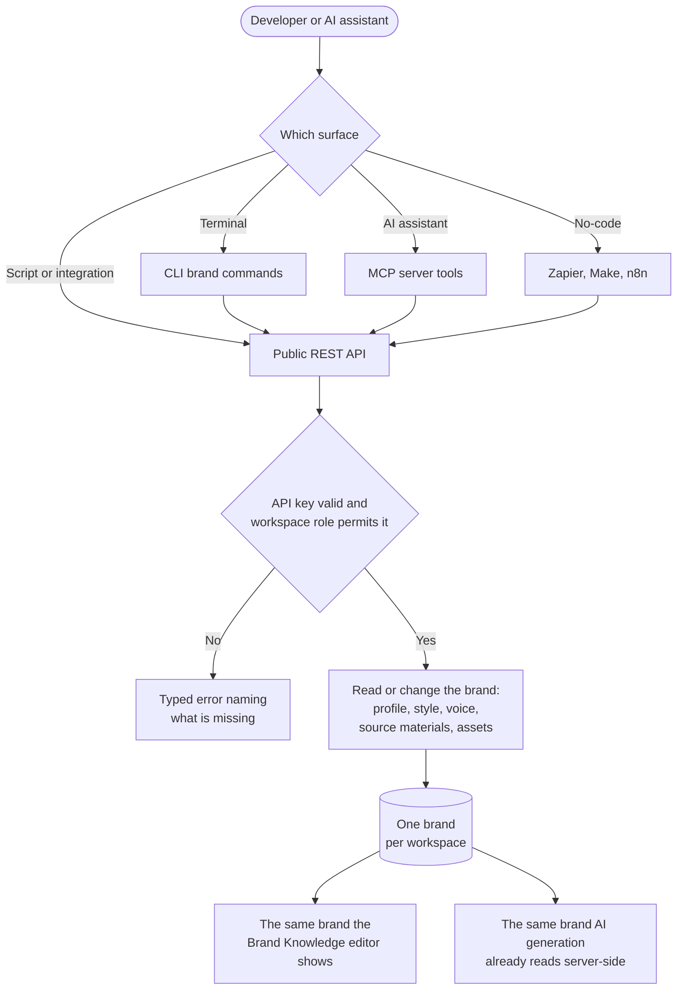

# Brand Knowledge on Developer Surfaces — Workflow Design

> Based on [01-research.md](01-research.md). Scoped to match the existing public API epics in `docs/stories/public-api-*`.
>
> **This is exposure, not redesign.** Brand Knowledge already works in the product. Every capability the browser has becomes reachable from the API, and from there the CLI, the MCP server, the connectors and the no-code tools. Nothing about how brand knowledge behaves changes.

---

## 1. Feature Placement

No new UI anywhere. The web app, the mobile app and the Brand Knowledge editor are untouched.

| Surface | What appears |
|---|---|
| **Public REST API** | `/api/v1/workspaces/{workspace_id}/brand/...` — a new resource family mirroring the five tabs |
| **API reference** | A "Brand Knowledge" tag group in the interactive reference, plus a help article |
| **CLI** | `brand:*` commands |
| **MCP server** | Brand tools alongside the existing dedicated ones |
| **ChatGPT and Claude connectors** | Inherited through the MCP server |
| **Zapier, Make, n8n** | The capabilities appropriate to each |
| **AI agents service** | A brand toolkit, built on the public API once it exists |

---

## 2. Workflow Overview

---

## 3. User Flow

1. The developer generates an API key in the dashboard, the same key that already works for posts, media and analytics.
2. They read the workspace's brand and get everything back: profile, style, voice, source materials and brand assets.
3. They change what they need. Brand profile, brand style and brand voice are each updated on their own, so two integrations touching different parts do not overwrite each other.
4. They add a source material, a website address, a document, pasted text or a connected account, and the brand is rebuilt from every active source, exactly as it is when done in the browser.
5. They upload brand assets or remove them.
6. They turn the brand on or off for AI generation.
7. They do all of the same things from the CLI, from an AI assistant through the MCP server, or from a no-code automation, because every surface carries the same capabilities.
8. The change shows up in the Brand Knowledge editor immediately, because it is the same brand.

---

## 4. Alternative Flows

| Situation | Behavior |
|---|---|
| The workspace has no brand yet | A read returns an empty brand marked as not set up, rather than an error. A write creates it |
| Source material limit reached | The caller is refused with a message naming the limit and the current count. Today this returns a misleading "profile not found", which this epic fixes |
| More website sources than can be processed | The response names which sources were used and which were skipped. Today the extras are dropped silently |
| A source cannot be read | The source is marked unreachable with a reason, and the brand is left unchanged |
| Rebuilding the brand from sources | Derived fields are regenerated from all active sources, the same as the browser. The response returns the updated brand so the caller can see what changed |
| Permission denied | Reads succeed, writes are refused naming the role required. Same rules as the dashboard |
| Brand disabled | Reads still return the brand. Generation ignores it. The response says plainly that it is switched off |
| Upload too large or wrong format | Refused with a typed error naming the limit and the accepted formats |

---

## 5. Key Design Decisions

### 5.1 One resource or five

| Option | Trade-off |
|---|---|
| **Five addressable parts under one brand resource** ✅ **Recommended** | Mirrors the five tabs the user already sees, so the API, the UI and the docs share one vocabulary. A caller can read everything in one call or update one part without touching the others |
| One brand document read and written whole | Every write becomes a full overwrite, so two integrations editing different tabs lose each other's changes |

### 5.2 How long-running rebuilds are handled

Building a brand from a website can take a few minutes. The browser already handles this by streaming progress, and the API cannot.

| Option | Trade-off |
|---|---|
| **Mirror the existing behavior and document the timing** ✅ **Recommended for v1** | Simplest, matches what the product already does, and needs no new machinery. The endpoint returns when the rebuild is done, and the documentation states plainly that adding a website source can take several minutes |
| Build a job system with polling | More robust for very slow sources, but it is new machinery for a problem the product has not hit yet. Deferred |

Flagged as a risk in the PRD rather than solved here: the AI agents service times out well before the backend does, so the brand toolkit story must either avoid the rebuild operation or handle its own timeout.

### 5.3 Tone, emotion, character and language

These are free text today, with no allowed-value list anywhere in the product.

**Recommendation: keep them free text and document the common values.** Introducing a fixed list would be a breaking change to a surface that the Brand Knowledge revamp is still changing, and would force a migration of values already stored.

### 5.4 Brand assets

Brand assets are media records marked as brand assets, and they are excluded from the normal media grid. The API exposes them as their own list so a caller does not have to know that. Whether they move into a Media Library folder is the Brand Knowledge revamp's decision, not this epic's, and the API shape does not depend on the answer.

---

## 6. Integration with Existing Features

| Feature | How it is touched |
|---|---|
| **Brand Knowledge editor** | Same brand. A change made over the API appears in the editor immediately. No UI change |
| **AI composer, inbox auto-replies, RSS, Evergreen** | Unchanged. They keep reading the stored brand server-side |
| **Media Library** | Brand assets are media, so uploads consume the workspace's storage allowance and follow the existing upload path |
| **Inbox auto-replies** | The per-source auto-reply flag is exposed, because turning it on has a cost and a delay the caller should be able to see |
| **Existing brand status endpoint** | Keeps working exactly as it is. Integrations relying on it must not break |
| **API credits and rate limits** | Brand calls are workspace-scoped, so they consume an API credit like every other call |
| **Brand Knowledge revamp** | Supplies the data model. The API is written against the revamped five-part shape |
| **Developer surface parity contract epic** | The dependency that makes the surfaces story one change instead of six |

---

## 7. Trackable Actions — Usermaven candidates

**None.** This epic adds no user-facing UI and no new in-product action, so there is nothing for Usermaven to track. API usage is already captured in the API request logs, which is where brand API adoption should be measured from.

`brand_profile_created` already exists for the setup wizard and is unaffected.

---

## 8. Scope Recommendation

### v1

1. Brand read and CRUD on the public API: the whole brand, plus brand profile, brand style, brand voice, the enabled flag, post generation settings, and deleting the brand.
2. Source materials and brand assets on the public API: add, read, update, delete, rebuild from sources, the auto-reply flag, asset upload and asset delete.
3. The same capabilities on every developer surface: CLI, agent skill, MCP server, the ChatGPT and Claude connectors, Zapier, Make and n8n, plus the public documentation and the parity check.
4. A brand toolkit in the AI agents service, built on the public API, so the in-product assistant can read the brand and change it behind the existing confirmation gate.

### Defer

- Webhooks on brand change.
- Per-operation rate limits.
- A job and polling model for long rebuilds, if the timing turns out to be a real problem.
- An allowed-value list for tone, emotion, character and language.
- Exporting brand style as portable design tokens.

### Explicitly out of scope

- **Any frontend or mobile work.** No UI changes in the web app or the Flutter app.
- **Redesigning Brand Knowledge.** That is the revamp's epic.
- **Multiple brands per workspace.** The revamp removes it by design.
- **Accepting brand content inside a generation request.** Generation keeps resolving brand server-side from the stored record.
