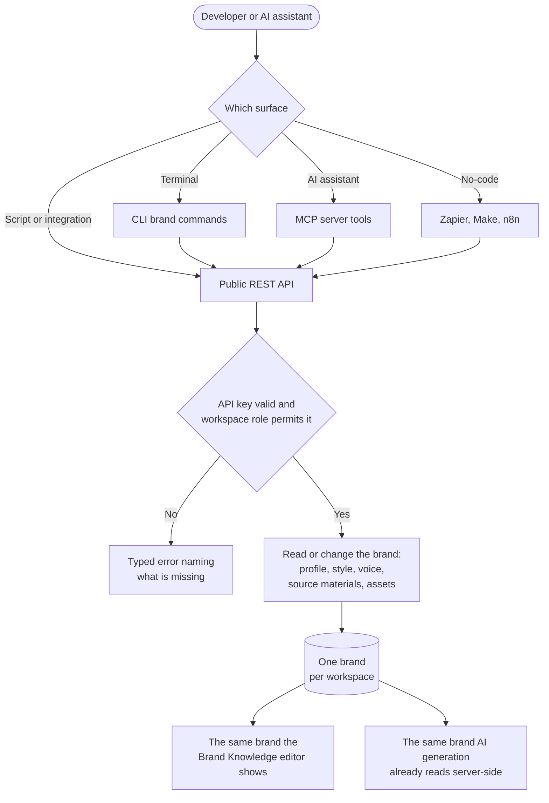

# **PRD: Brand Knowledge on Developer Surfaces**

**Author:** Product
**Date:** 2026-09-20
**Status:** Draft for review
**Related:** [01-research.md](01-research.md) · [02-workflow.md](02-workflow.md) · `docs/features/brand-knowledge-revamp/` · `docs/stories/public-api-parity-contract/`

---

## **1. Overview**

Brand Knowledge is the store of everything that makes AI output sound and look like a customer's brand: their brand profile, brand style, brand voice, the source materials the brand was built from, and their brand assets. It works well in the browser and is reachable from nowhere else.

This epic exposes it. Every capability the Brand Knowledge editor has becomes a public API capability, and from there a CLI command, an MCP tool, a connector action and a no-code step. A brand toolkit in the AI agents service follows, so the in-product assistant can read and change the brand too.

This is exposure, not redesign. Nothing about how brand knowledge behaves changes, and there is no frontend or mobile work.

---

## **2. Problem Statement**

**What problem are we solving?**

An agency onboarding fifty client workspaces has to fill five tabs by hand, fifty times. A customer whose brand guidelines already live in Frontify, Notion or a Google Doc has to retype them into ContentStudio and retype them again whenever they change. A developer who drives the whole of ContentStudio from the API hits a wall at the one feature that determines whether the content is any good. And an AI assistant connected through the MCP server can create posts for a workspace but cannot find out what that workspace's brand sounds like, so it writes generic copy or asks the user to paste the brand in every session.

**Who has this problem?**

Agencies and white-label partners provisioning many workspaces, API-first customers automating their whole publishing workflow, and every user of the MCP server, the CLI and the connectors.

**What happens if we don't solve it?**

Brand Knowledge stays a feature that only works if a human clicks through it, which caps its adoption at whoever visits that settings page. The developer surfaces keep producing off-brand content, which is the most visible possible failure for an AI feature. And ContentStudio gives up a position no competitor currently holds: the research found that **not one social media management platform exposes brand voice or brand kit over any developer surface.**

---

## **3. Goals & Success Metrics**

| Goal | Metric |
|---|---|
| Brand Knowledge is fully drivable without the browser | Every capability in the Brand Knowledge editor has an API equivalent, verified by the parity check |
| Agencies can provision brands in bulk | Brand write calls from a single API key across multiple workspaces, measured in the API request logs |
| Assistants produce on-brand content | Share of MCP and in-product assistant sessions that read the brand before generating |
| No surface falls behind | The parity check passes for brand knowledge on every surface, every release |
| Nothing regresses | The existing brand status endpoint and all in-product brand behavior are unchanged |

### **3.1 Analytics Events (Usermaven)**

**None.**

This epic adds no user-facing UI and no new in-product action, so there is nothing for Usermaven to track. Brand API adoption is measured from the existing API request logs, which already record every call with its workspace, key and endpoint.

`brand_profile_created` already exists for the brand setup wizard and is unaffected by this epic.

---

## **4. Target Users**

**Primary Persona:** the integration developer or agency operator who drives ContentStudio programmatically and needs brand setup to be scriptable rather than clicked.

**Secondary Persona:** the customer using ContentStudio through an AI assistant, whether the in-product one or an external one connected over MCP, who expects it to already know their brand.

**Non-Users (explicitly out of scope):** anyone using the Brand Knowledge editor in the browser. Their experience does not change.

---

## **5. User Stories / Jobs to Be Done**

| As a... | I want to... | So that... |
|---|---|---|
| Agency operator | Set up a client's brand from a script or a file | I do not fill five tabs by hand for every client |
| Integration developer | Read a workspace's brand profile, style and voice | My integration can show and use it |
| Integration developer | Update one part of the brand without touching the others | Two integrations editing different parts do not overwrite each other |
| Integration developer | Add a website, document or pasted text as a source | The brand is rebuilt from it, the same as in the browser |
| Integration developer | Upload and remove brand assets | Logos and imagery are managed with everything else |
| Integration developer | Turn a workspace's brand on or off | I can control whether AI generation applies it |
| Developer using the CLI | Run the same brand commands I would call over HTTP | I stay in one place |
| Customer using an AI assistant | Have the assistant already know my brand | I stop pasting my brand voice into every session |
| Customer using the in-product assistant | Ask about my brand and change it in conversation | I do not have to leave the chat to edit a setting |
| No-code builder | Read or set brand fields in Zapier, Make or n8n | My automation can keep ContentStudio in step with my brand system of record |

---

## **6. Requirements**

### **6.1 Must Have (P0)**

- **Read the whole brand** for a workspace in one call: profile, style, voice, source materials and brand assets.
- **Read and update each part on its own** — brand profile, brand style, brand voice — so a partial write never overwrites another part.
- **Enable and disable** the brand for AI generation.
- **Delete** the brand.
- **Read and update post generation settings.**
- **Source materials:** list, add, read, update, delete. Types are website address, document, pasted text and connected social account, matching the product.
- **Rebuild the brand from sources**, both the destructive re-derive and the non-destructive blend the product already has.
- **The per-source auto-reply flag**, readable and settable, because turning it on has a cost and a delay.
- **Brand assets:** list, upload by file or by web address, read, delete. Logo upload included.
- **Documented limits and typed errors** for every cap that exists: maximum source materials, maximum website sources processed, maximum brand assets, upload size and accepted formats. Today the source-material cap returns a misleading "profile not found" and extra website sources are dropped silently. Both are fixed.
- **The same authorization and plan gating as the dashboard** on every surface. No surface is a weaker path to the same action.
- **Every capability on every developer surface:** CLI, agent skill, MCP server, the ChatGPT and Claude connectors, Zapier, Make and n8n.
- **Public documentation and OpenAPI annotations**, including a worked example of setting up a brand end to end.
- **The existing brand status endpoint keeps working unchanged.**

### **6.2 Should Have (P1)**

- **A brand toolkit in the AI agents service**, built on the public API, giving the in-product assistant brand reads and brand writes behind the existing confirmation gate.
- **Last-changed metadata** on brand responses, so a caller can tell when the brand last changed.

### **6.3 Nice to Have (P2)**

- An allowed-value list for tone, emotion, character and language, offered as a lookup rather than enforced.
- Per-operation rate limits, with reads more generous than writes.

### **6.4 Explicitly Out of Scope**

- **Any frontend or mobile work.** No changes to the web app or the Flutter app.
- **Redesigning Brand Knowledge.** That is `docs/features/brand-knowledge-revamp/`.
- **Multiple brands per workspace.** The revamp removes it by design.
- **Accepting brand content inside a generation request.** Generation keeps resolving the brand server-side from the stored record.
- **A job and polling model** for long rebuilds. Deferred unless the timing proves to be a problem.
- **Webhooks** on brand change.
- **Exporting brand style as portable design tokens.**
- **Migrating the existing surfaces onto the parity contract's definition source.** That is the parity contract epic's work.

---

## **7. User Flow (High Level)**

1. The developer uses the API key they already have for posts, media and analytics.
2. They read the workspace's brand and get all five parts back.
3. They update the parts they need, each on its own.
4. They add source materials, and the brand is rebuilt from every active source exactly as it is in the browser.
5. They upload or remove brand assets.
6. They turn the brand on or off for AI generation.
7. They do all of the same from the CLI, from an AI assistant over MCP, or from a no-code automation.
8. The change appears in the Brand Knowledge editor immediately, because it is the same brand.

---

## **8. Business Rules & Constraints**

| Rule ID | Rule | Rationale |
|---|---|---|
| BR-1 | One brand per workspace, so brand paths are singular and there is no collection to paginate | Matches the Brand Knowledge revamp |
| BR-2 | Brand profile, brand style and brand voice are updated independently. A write to one never changes another | Prevents two integrations from overwriting each other |
| BR-3 | Generation never accepts brand content in a request body. It always resolves the brand server-side from the stored record | Keeps the reason the brand status endpoint was kept minimal fully answered |
| BR-4 | Rebuilding from sources regenerates derived fields from all active sources, identical to the browser behavior | One behavior, not two |
| BR-5 | If a source cannot be read, the source is marked unreachable and the brand is left unchanged | Matches the product's existing safe-failure rule |
| BR-6 | Every cap is documented and returns a typed error naming the limit. No silent truncation and no misleading status code | Today the source cap returns "profile not found" and extra website sources are dropped silently |
| BR-7 | Every surface enforces the same authorization and plan gating as the REST endpoints | No surface is a weaker path to the same action |
| BR-8 | Brand writes made by an assistant go through the existing confirmation gate, like every other write tool | Brand overwrites are destructive |
| BR-9 | The public brand schema is versioned separately from the internal storage document | Lets the Brand Knowledge revamp keep changing storage without breaking integrations |
| BR-10 | Brand assets are media, so uploads consume the workspace's storage allowance | Single source of truth for storage |
| BR-11 | The existing brand status endpoint is unchanged and keeps working | Existing integrations must not break |

---

## **9. Open Questions**

| Question | Options | Owner | Due | Decision |
|---|---|---|---|---|
| Does the API ship against the current brand shape or wait for the Brand Knowledge revamp to land? | Ship now and migrate / wait for the revamp | Product + Backend | Before the first endpoint story starts | Pending |
| Do brand assets stay a flag on the media record or move into a Media Library folder? | Flag / folder | Backend lead | Before the source materials and assets story | Pending, inherited from the revamp's own open question |
| Is brand API access gated by plan, and if so which plans? | All paid / higher tiers only / same as general API access | Product | Before release | Pending |
| Does a brand read consume an API credit, given every workspace-scoped call currently charges one? | Yes, like every call / exempt reads | Product + Backend | Before release | Pending |
| Does the AI agents brand toolkit ship with this epic or follow it? | Same epic / follow-on | Product | Before the toolkit story starts | Pending, proposed as the last story in this epic |
| Do we expose the destructive rebuild to no-code tools, or omit it there? | Expose / omit with a recorded reason | Product | During the surfaces story | Pending |

---

## **10. Risks & Mitigations**

| Risk | Likelihood | Impact | Mitigation |
|---|---|---|---|
| Rebuilding a brand from a website takes minutes, longer than an API caller or an agent client will wait | High | Medium | Document the timing plainly. The AI agents toolkit either avoids the rebuild operation or handles its own timeout. If it becomes a real problem, add a job and polling model, which is already specified as deferred scope |
| The API contract is published against a brand shape the revamp is still changing | Medium | High | Version the public schema separately from the internal document (BR-9). Prefer landing the revamp's data model first |
| Six surfaces drift, so a capability exists on one and not another | High | High | The surfaces story and the parity check. This is exactly the cost the developer surface parity contract epic exists to remove |
| Brand assets model is unsettled between a flag and a folder | Medium | Medium | The API exposes brand assets as their own list, so the contract does not depend on which one wins |
| An assistant overwrites a carefully written brand voice | Medium | High | Every assistant write goes through the existing confirmation gate (BR-8), showing what will change before it is saved |
| Free-text tone and voice fields are hard for an agent to fill correctly | Medium | Low | Document common values and put examples in the tool descriptions. A lookup endpoint is P2 |
| Exposing the per-source auto-reply flag triggers indexing costs a caller did not expect | Low | Medium | Document the cost and the delay on that field |

---

## **11. Dependencies**

- **Internal:**
  - `AiContentLibraryProfile` and `AiContentLibraryProfileController` (`contentstudio-backend/`) — the brand data model and the existing internal endpoints being mirrored.
  - `MediaRepository` and the public media upload path (`contentstudio-backend/`) — the pattern brand asset upload follows.
  - `BrandAnalysisService` and the AI agents business-info endpoints — the rebuild-from-sources path.
  - The public API v1 conventions: API key middleware, permission middleware, the typed response envelope, and the OpenAPI annotation setup.
  - `contentstudio-ai-agents` toolkit layer (`src/integrations/contentstudio/toolkits/`) — where the brand toolkit is added.
- **External repositories, not mounted in this workspace:**
  - `contentstudio-mcp` — the MCP server.
  - `contentstudio-agent` / `contentstudio-cli` — the CLI and agent skill.
  - The Zapier, Make and n8n integrations and the ChatGPT and Claude connectors.
- **Blockers:**
  - The developer surface parity contract epic. Without it, the surfaces story is six hand-copied changes rather than one.
  - The Brand Knowledge revamp's data model, if the decision is to wait for it.

---

## **12. Appendix**

- **Research and competitive analysis:** [01-research.md](01-research.md)
- **Workflow and diagram:** [02-workflow.md](02-workflow.md)
- **Related product epic:** `docs/features/brand-knowledge-revamp/`
- **Related programme:** `docs/stories/PUBLIC-API-PARITY-PLAN-2026-08-23.md` and the `docs/stories/public-api-*` epics
- **Mock-ups:** none. No graphical UI in this epic.

---

## **Changelog**

| Date | Change |
|---|---|
| 2026-09-20 | Initial draft |
