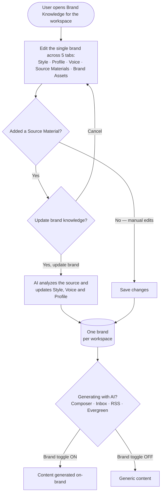
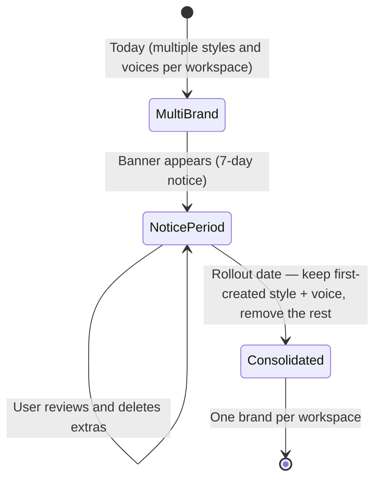
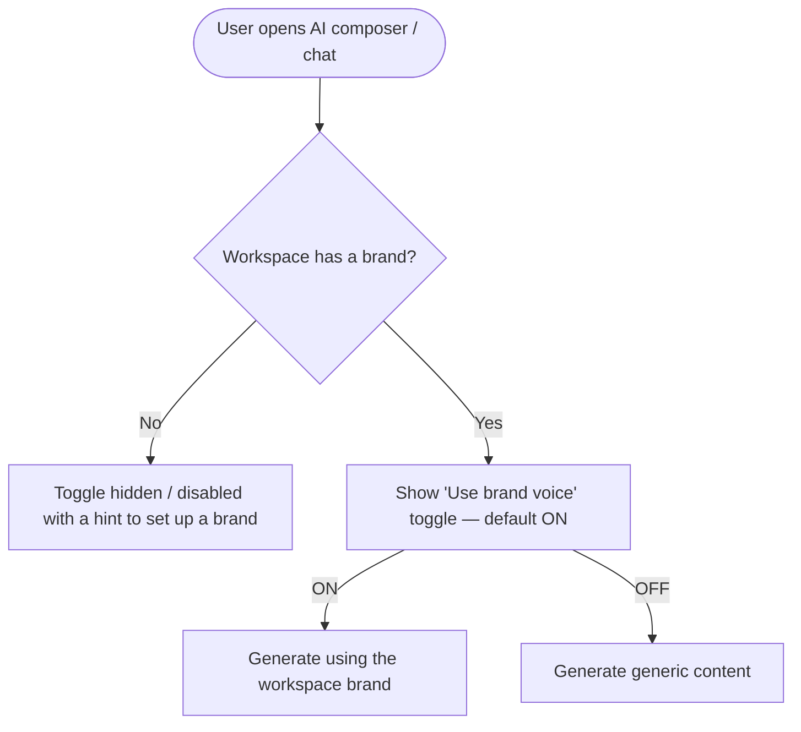

# Brand Knowledge Revamp — Workflow Design

> Builds on [01-research.md](01-research.md). Locked decisions: one brand **per workspace**; migration auto-keeps the **first-created** style + voice (banner gives a 7-day window to clean up); **no export** (hard delete after notice); **Brand Profile is a new tab**.
>
> **Design artifact (exemplary mockup):** https://claude.ai/design/p/c9cb3c18-d69f-48c8-9674-4d9a18413a8c?file=Brand+Knowledge.html

---

## 1. Feature Placement

Brand Knowledge is the renamed/restructured **AI Content Library** (`contentstudio-frontend/src/modules/publisher/ai-content-library/`). It is **workspace-scoped** — each workspace has exactly one brand after the revamp.

- **Entry point:** the existing Brand Knowledge / AI Content Library hub, reached from the workspace's AI area in the main navigation. Header keeps the "Brand Knowledge — Define and manage your brand's identity so AI can create content that aligns with your brand's values and personality" intro card.
- **New tab bar (5 tabs, in order):** `Brand Style` · `Brand Profile` · `Brand Voice` · `Source Materials` · `Brand Assets`.
- **Migration banner** appears (a) at the top of the Brand Knowledge hub and (b) on the workspace home/dashboard, for the 7-day notice window only.
- **Media Library** (`src/modules/publish/components/media-library/`) gains a dedicated **"Brand Assets"** folder per workspace, which is the storage backing the Brand Assets tab.
- **Downstream consumption surfaces** (where brand is *used*, not edited): AI composer / AI chat, Inbox auto-replies & message composer, RSS automation, Evergreen automation.

---

## 2. Workflow Diagram — Overview



---

## 3. User Flow (Happy Path)

### A. Migration / notice (existing multi-brand users, one-time)
1. User with multiple brand styles/voices logs in during the 7-day window and sees a banner in Brand Knowledge and on the home page: *"Brand Knowledge is becoming one brand per workspace on [date]."*
2. Banner explains what will be kept (the first-created style + voice) and what will be removed, with a CTA **"Review my brands."**
3. User clicks the CTA, lands in Brand Knowledge, and reviews their existing styles/voices.
4. To control which one survives, the user **deletes the brands they don't want** (since the oldest-remaining style + voice are kept). They keep their preferred brand as the oldest remaining one.
5. On the rollout date, the system consolidates automatically: keeps the first-created (oldest) remaining style + voice, removes the rest, and dismisses the banner.

### B. Editing the unified brand (after rollout)
1. User opens Brand Knowledge → lands on **Brand Style** by default.
2. **Brand Style:** sets logo(s), brand colors, title/body fonts, and a free-text "Visual Identity Description." Saves.
3. **Brand Profile** (new): fills business name, business overview & positioning (core identity, market positioning tiers, direct competitors local/international, competitive advantages, customer segments, top revenue generators, emerging growth areas, value drivers, emotional benefits, brand story, brand personality tags). Edits each section inline. Saves.
4. **Brand Voice:** sets purpose, audience, tone tags, emotion tags, character tags, syntax rules, language rules. Saves.

### C. Adding a source material (auto-populate from a source)
1. On **Source Materials**, user clicks **"Add Source Material."**
2. Chooses a source type: **Website URL** (recommended), **Upload Document**, **Social Account** (an already-connected account), or **Paste Text**.
3. Enters the input (URL, file, account selection, or text) and clicks **"Generate Voice."**
4. A confirm modal appears: **"Update brand knowledge? — Adding this source will update your Brand Voice, Brand Style, and Brand Profile to reflect the new content."** with **Cancel** / **Yes, Update Brand**.
5. User clicks **"Yes, Update Brand."** The source is added to the list with a **"Processing"** status; the AI analyzes it asynchronously.
6. When done, the source row shows **"Last synced [date]"**, and the Brand Style / Voice / Profile tabs reflect the newly derived content. User can **Sync** (manually re-pull), **Rename**, **Open**, or **delete** any source later.
7. For **live** sources (Website URL, connected Social Account), the user can enable **Auto-sync** so the source re-pulls and regenerates the brand on a schedule. Auto-sync is **opt-in per source (default OFF)**; after each auto-update the user is notified. Static sources (Document, Paste Text) don't offer auto-sync. (Cadence TBD.)

### D. Managing brand assets
1. On **Brand Assets**, user sees a media grid (backed by the Media Library "Brand Assets" folder) with **"Add New Media."**
2. Clicking it offers two options: **Upload** (new file) or **Choose from Media Library** (pick existing assets).
3. Added assets appear in the grid. User can select multiple for **bulk actions** (bulk delete) or delete individually.

### E. Using the brand in AI generation
1. In the AI composer / chat (and inbox replies, RSS, Evergreen), instead of choosing a brand voice/style from a dropdown, the user sees a single **"Use brand voice"** toggle.
2. With the toggle **ON** (default when a brand exists), generated content uses the workspace's single brand. Turning it **OFF** produces generic content for that generation.

---

## 4. Alternative & Edge-Case Flows

- **Source unreachable / scrape fails:** the source row shows an **"Unreachable"** status (as in the artifact) with a retry **Sync**. Brand content is left unchanged; user sees an error toast.
- **Document parse fails / unsupported file type:** inline validation error on upload; no brand change.
- **Social account has too little content to analyze:** processing completes with a notice that not enough was found; brand left unchanged.
- **User cancels the "Update brand knowledge?" modal:** the source is *not* added and nothing changes.
- **Workspace has no brand yet (new workspace):** all tabs show empty states prompting the user to either fill fields manually or add a source material to auto-generate.
- **Migration — user takes no action during the window:** at rollout, the system keeps the first-created style + voice and removes the rest (default behavior).
- **Migration — user has exactly one brand already:** no consolidation needed; banner is informational and auto-dismisses at rollout.
- **Brand Assets — asset chosen from library that already lives in another folder:** the asset is *linked into* the Brand Assets folder (not removed from its original location). See Key Decision 4.
- **Toggle OFF but downstream feature requires brand context:** generation proceeds generically; no error.

### Migration states



### Source ingestion (multi-system)

```mermaid
sequenceDiagram
    actor User
    participant CS as ContentStudio (Brand Knowledge)
    participant Job as Brand Knowledge Job
    participant AI as AI Brand Analyzer
    User->>CS: Add source (URL / document / social / text)
    CS->>User: "Update brand knowledge?" confirm modal
    User->>CS: Yes, Update Brand
    CS->>Job: Queue ingestion (source shows "Processing")
    Job->>AI: Extract and analyze content
    AI-->>Job: Brand voice, style and profile fields
    Job-->>CS: Update the workspace brand; mark source "Last synced"
    CS-->>User: Notify done; tabs reflect the new content
```

---

## 5. Key Design Decisions

### Decision 1 — How actionable is the migration banner?
- **Option A — Informational only:** banner just announces the change; consolidation runs silently at rollout (keep first-created).
- **Option B (recommended) — Informational + deep-link to cleanup:** banner CTA deep-links into Brand Knowledge where users can delete brands they don't want, so their preferred brand is the oldest-remaining survivor. No new "set default" UI is built (honors the PO's first-created rule), but users retain control.
- **Rationale:** B gives users agency without adding a selector, matching the locked "first-created" rule. Deleting extras is an existing capability.

### Decision 2 — Source processing: synchronous vs asynchronous
- **Option A — Synchronous:** block with a spinner until analysis finishes.
- **Option B (recommended) — Asynchronous job:** reuse the existing `BrandKnowledgeGenerationJob`; the source row shows "Processing" → "Last synced", and the user can navigate away and is notified on completion. Matches the artifact's "Last Synced" column and "Unreachable" status.
- **Rationale:** scraping + AI analysis can take many seconds; async avoids a frozen UI and supports retries.

### Decision 3 — What a source update changes (overwrite vs merge)
- **Option A — Full overwrite from the latest source only:** each new source replaces the AI-derived fields.
- **Option B — Regenerate from all active sources combined (recommended):** the AI derives Brand Voice/Style/Profile from the full set of currently-attached source materials, so adding/removing/syncing a source recomputes consistently. The confirm modal serves as explicit consent before any overwrite.
- **Option C — Append/merge incrementally:** risk of conflicting/duplicated content.
- **Rationale:** B is predictable and idempotent-ish, and matches the modal copy ("update … to reflect the new content"). Note: AI-derived fields overwrite on update; the modal warns the user first. (A v2 enhancement could protect manually-edited fields from being overwritten.)

### Decision 4 — Brand Assets ↔ Media Library relationship
- **Option A — Brand Assets tab is a view into a dedicated "Brand Assets" Media Library folder (recommended).** "Upload" adds new files to that folder; "Choose from Media Library" **links** existing assets into it (asset stays in its original folder too). Single source of truth = Media Library.
- **Option B — Separate brand-asset storage** duplicated from the library.
- **Rationale:** A matches the PO's requirement ("storage is also gonna be in the media library") and avoids duplicating files. **Open implementation question for BE:** confirm whether a media asset can belong to multiple folders; if folders are exclusive, "Choose from Library" must copy rather than move. Flagged in the BE story.

### Decision 5 — Default state of the "Use brand voice" toggle
- **Option A (recommended) — Default ON when a brand exists:** since there's exactly one brand per workspace, applying it by default delivers the value prop; users toggle OFF for one-off generic content. If no brand exists, the toggle is hidden/disabled with a hint to set one up.
- **Option B — Default OFF (opt-in):** safer but most users would never turn it on, undercutting the feature.
- **Rationale:** A matches the market's "always-on for the active brand" pattern (see research §3).



---

## 6. Integration with Existing Features

| Surface | Today | After revamp |
|---|---|---|
| **AI composer / AI chat** (`src/modules/AI-tools/AIChatMain.vue`, `ChatHeader.vue`, `BrandVoiceSelector.vue`) | Two dropdowns (style + voice) | Single **"Use brand voice"** toggle; state in `useAIChatStore` as `brandGuidanceEnabled` |
| **Inbox auto-replies** (`src/modules/inbox-revamp/components/autoreplies/AutoReplyForm.vue`, `useAutoReplyForm.ts`) | Brand-voice dropdown reading `brand_voices[]` | Toggle; uses the single workspace brand voice |
| **Inbox message composer** (`MessageComposer.vue`) | Finds default voice | Uses the single workspace brand voice |
| **AI Content Library post settings** (`components/form/PostSettingsForm.vue`) | Style + voice dropdowns | Pre-populated from the single brand; per-post override retained where it adds value |
| **Evergreen automation** (`GenerateVariationsModal.vue`) | `useBrandContent` boolean flag | Mostly unchanged (already a toggle); now maps to the single brand |
| **RSS automation** (`rss_post_generator.py`) | Accepts brand guidelines dict | Fetches the single workspace brand |
| **Media Library** (`media-library/`, `MediaLibraryFolders`) | Folders with `is_ai_folder` etc. | New `is_brand_assets_folder` per workspace, surfaced in Brand Assets tab |
| **AI agents** (`caption_writer.py`, `image_generator.py`, `rss_post_generator.py`) | Already consume a single `brand_voice` object | Call sites auto-fetch the workspace brand; minimal change |

---

## 7. Trackable Actions (Usermaven candidates)

These are candidates; exact names/payloads are finalized in the PRD §3.1 (grep `userMaven.track(` first to reuse existing names).

| Action | Candidate event | Trigger | Notes |
|---|---|---|---|
| Add a brand source | `brand_source_added` | User confirms "Yes, Update Brand" | payload: `{ source_type: website\|document\|social\|text }` |
| Brand knowledge updated from a source | `brand_knowledge_updated` | Ingestion job completes successfully | server-side → BE story; payload: `{ source_type }` |
| Add a brand asset | `brand_asset_added` | Asset uploaded or linked from library | payload: `{ method: upload\|library, count }` |
| Toggle brand voice in a generation surface | `brand_voice_toggle_changed` | User flips the toggle | payload: `{ enabled, surface: composer\|inbox\|rss\|evergreen }` |
| Manually save a brand tab | `brand_knowledge_saved` | User saves Style/Profile/Voice | payload: `{ tab }` |
| Migration banner CTA clicked | `brand_migration_cta_clicked` | User clicks "Review my brands" | dismiss/view variants optional |
| Brand consolidated at rollout | `brand_consolidated` | Consolidation job runs at rollout | server-side → BE story; payload: `{ styles_removed, voices_removed }` |

---

## 8. Scope Recommendation

### v1 (this epic)
- Migration **banner + notice** (FE) and **consolidation/backfill job** keeping first-created style + voice (BE).
- **Data-model unification** `styles[]`/`brand_voices[]` → single `style` + `brand_voice` + new `brand_profile` + `source_materials[]` (BE).
- **5 tabs:** Brand Style (restructure existing, FE), Brand Profile (new, FE + BE fields), Brand Voice (restructure existing, FE), **Source Materials** with all four sources + confirm modal + async processing + manual Sync + **opt-in auto-sync for live sources** (FE + BE), **Brand Assets** with Media Library "Brand Assets" folder + upload/choose/bulk-delete (FE + BE).
- **Dropdown → toggle** across AI composer/chat, inbox, RSS, Evergreen (FE, with BE call-site updates as needed).
- **Memory management research spike** (research ticket — Agno memory vs pgvector, chunking, retrieval, refresh, per-workspace limits).

### Deferred to v2
- **Memory/embedding implementation** for source materials (depends on the spike outcome).
- **Off-brand flagging / governance** (Jasper Brand IQ-style "this caption drifts from your brand voice").
- **Learning from connected-account performance analytics** (Publer-style 30-day data).
- **Per-platform voice/tone variants** under the single brand.
- **Protect manually-edited fields** from being overwritten on source re-sync.
- **"Spin extra brands into new workspaces"** migration helper (instead of deletion).

### Open questions for engineering
- Can a Media Library asset belong to multiple folders (Decision 4)? If not, "Choose from Library" must copy.
- Exact memory/retrieval approach for source materials (the research spike resolves this).
- Whether per-post style/voice override in `PostSettingsForm.vue` is still wanted once there's a single brand.
