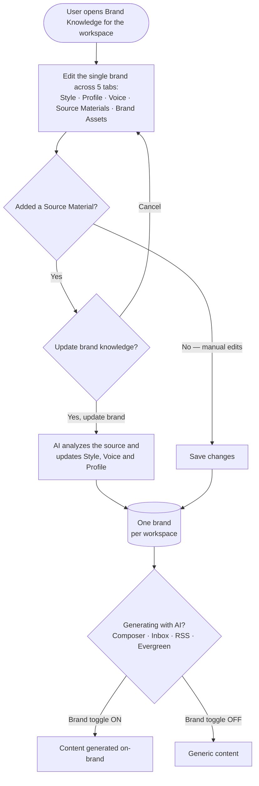

# **PRD: Brand Knowledge Revamp (One Brand Per Workspace)**

**Author:** Tehreem Shehzadi (Product Owner)
**Last Updated:** 2026-06-12
**Status:** In Review
**Target Release:** Q3 2026

---

## **1. Overview**

Brand Knowledge (today's "AI Content Library") lets a workspace define its brand identity so ContentStudio's AI generates on-brand content. Today it allows **multiple** brand styles and voices per workspace, selected via dropdowns — which fragments the brand, confuses users, and complicates every AI surface. This revamp **unifies it to exactly one brand per workspace**, restructures it into five tabs (**Brand Style, Brand Profile, Brand Voice, Source Materials, Brand Assets**), adds **multi-source auto-learning** (website URL, document, connected social account, or pasted text) — including **opt-in auto-sync** that keeps live sources fresh on a schedule — integrates **Brand Assets** with the Media Library, and replaces the brand selector **dropdown with a simple on/off toggle** everywhere AI generates content. Existing multi-brand workspaces are migrated via a 7-day in-app notice, after which the first-created style and voice are kept and the rest are removed.

---

## **2. Problem Statement**

**What problem are we solving?**
The current Brand Knowledge stores `styles[]` and `brand_voices[]` as arrays, so a workspace can accumulate many competing brand definitions. This forces a brand-selection **dropdown** into every AI surface (composer, AI chat, inbox auto-replies, post settings), creates ambiguity about which brand is "the" brand, and makes on-brand generation an explicit per-action choice rather than a default. There is no structured **Brand Profile** (business facts/positioning), no unified **Source Materials** ingestion to auto-learn the brand, and no first-class **brand asset** storage.

**Who has this problem?**
All workspaces that use AI generation — composer, AI chat, inbox replies, RSS, Evergreen. Agencies and multi-client users feel the fragmentation most. New workspaces face a cold-start problem: defining a brand by hand is tedious, so many never complete it and get generic AI output.

**What happens if we don't solve it?**
- AI output stays generic ("AI slop"), undercutting our core AI value prop in a market where brand fidelity is the differentiator (see [01-research.md](01-research.md)).
- We fall behind competitors who auto-learn the brand from a website/sample (SocialBee, Canva, Jasper, Copy.ai).
- The multi-brand model keeps accruing technical and UX debt across every AI surface.

---

## **3. Goals & Success Metrics**

| Goal | Metric | Target | How We'll Measure |
| ----- | ----- | ----- | ----- |
| **Primary** — More workspaces have a usable brand | % of active workspaces with a completed brand (style + voice saved) | 50% within 90 days of GA | Product analytics (`brand_profile_created`) |
| **Secondary** — Source ingestion adoption | % of active workspaces that add ≥1 source material | 30% within 90 days | `brand_source_added` |
| **Secondary** — Brand actually applied in generation | % of AI generations with the brand toggle ON | 60% of generations | `brand_voice_toggle_changed` + generation events |
| **Guard rail** — Migration doesn't drive churn | Churn delta vs. prior period | < 1% delta | Billing data |
| **Guard rail** — Migration doesn't flood support | Brand-loss support tickets in the 14 days post-rollout | < 0.5% of migrated workspaces | Intercom |
| **Guard rail** — Ingestion is reliable | Successful source-ingestion rate | ≥ 90% | `brand_knowledge_updated` success vs. failure |

### **3.1 Analytics Events (Usermaven)**

`brand_profile_created` already exists in `contentstudio-frontend/src/` and is reused below for brand-setup completion. The rest are new.

| Event Name | Trigger | Payload | What we measure with it |
| ----- | ----- | ----- | ----- |
| `brand_profile_created` *(reuse existing)* | User saves the workspace brand for the first time (style + voice present) | *(existing payload; confirm shape in code)* | Brand setup completion rate (primary goal) |
| `brand_source_added` | User confirms **"Yes, Update Brand"** in the confirm modal (FE) | `{ source_type: 'website' \| 'document' \| 'social' \| 'text' }` | Source-ingestion adoption, breakdown by source type |
| `brand_knowledge_updated` | Source ingestion job completes — manual or auto-sync (BE, server-side) | `{ source_type, status: 'success' \| 'failed', trigger: 'manual' \| 'auto' }` | Ingestion success rate (guard rail); manual vs. auto split |
| `brand_autosync_changed` | User enables/disables auto-sync for a source (FE) | `{ enabled: boolean, source_type: 'website' \| 'social' }` | Auto-sync adoption |
| `brand_asset_added` | User uploads or links a brand asset (FE) | `{ method: 'upload' \| 'library', count }` | Brand Assets adoption |
| `brand_voice_toggle_changed` | User flips the "Use brand voice" toggle (FE) | `{ enabled: boolean, surface: 'composer' \| 'inbox' \| 'rss' \| 'evergreen' }` | How often brand is applied vs. disabled, per surface |
| `brand_migration_cta_clicked` | User clicks the migration banner CTA "Review my brands" (FE) | `{ location: 'brand_knowledge' \| 'home' }` | Migration-notice engagement |
| `brand_consolidated` | Consolidation job runs at rollout for a workspace (BE, server-side) | `{ styles_removed, voices_removed }` | Migration impact / how many brands were removed |

---

## **4. Target Users**

**Primary Persona — Solo marketer / small-business owner (e.g. Tim Hortons Pakistan social manager):** wants on-brand AI content without re-explaining the brand each time. Low patience for manual setup; values "scan my website and learn my brand."

**Secondary Persona — Agency operator:** manages multiple clients, one workspace per client. Wants each workspace to have a single, clean, canonical brand and fast switching between workspaces.

**Non-Users (out of scope):**
- Users wanting **multiple brands within a single workspace** (the explicit thing we're removing — they should use multiple workspaces).
- **Mobile app users** for AI brand features — AI brand features are web-only.
- Users wanting **off-brand governance/flagging** — deferred to v2.

---

## **5. User Stories / Jobs to Be Done**

| ID | As a... | I want to... | So that... | Priority |
| ----- | ----- | ----- | ----- | ----- |
| US-1 | Existing multi-brand user | be warned before my extra brands are removed | I'm not surprised by lost data | Must Have |
| US-2 | Existing multi-brand user | clean up my brands during the notice window | my preferred brand is the one that's kept | Must Have |
| US-3 | Workspace owner | have exactly one brand (style + voice + profile) per workspace | my AI output is consistently on-brand | Must Have |
| US-4 | Small-business owner | paste my website URL (or a doc/social account/text) and have AI learn my brand | I don't have to define everything by hand | Must Have |
| US-5 | Marketer | maintain a structured brand profile (positioning, competitors, segments, story) | AI knows the *facts* about my brand, not just its tone | Must Have |
| US-6 | Marketer | keep my brand images/logos in a Brand Assets library | AI and I can reuse them in content | Must Have |
| US-7 | Marketer | toggle brand voice on/off when generating | I can produce on-brand content by default and generic content when I want | Must Have |
| US-8 | Agency operator | bulk-manage (delete) brand assets | I can keep the brand library tidy | Should Have |
| US-9 | Product/engineering | a clear plan for storing & retrieving source-material "memory" | source ingestion scales and stays relevant | Must Have (research) |

---

## **6. Requirements**

### **6.1 Must Have (P0)**

- **One brand per workspace.** Data model unifies `styles[]` → single `style` and `brand_voices[]` → single `brand_voice`; adds a new `brand_profile` object and a `source_materials[]` list.
- **Migration consolidation job.** At rollout, per workspace, keep the **first-created (oldest)** style + voice; permanently remove the rest. No export.
- **Migration banner** (Brand Knowledge hub + home page) for a **7-day** notice window, with a CTA deep-linking to Brand Knowledge for cleanup; auto-dismiss at rollout.
- **Five tabs:** Brand Style, Brand Profile (new), Brand Voice, Source Materials (new), Brand Assets (new).
- **Brand Style:** logo(s), brand colors, title/body fonts, visual identity description (parity with today + per artifact).
- **Brand Profile (new):** business name; business overview & positioning — core identity, market positioning (primary/secondary/tertiary), direct competitors (local/international), competitive advantages, primary customer segments, top revenue generators, emerging growth areas, primary value drivers, emotional benefits, brand story, brand personality tags.
- **Brand Voice:** purpose, audience, tone, emotion, character, syntax, language (parity with today + per artifact).
- **Source Materials (all four sources in v1):** Website URL, Upload Document, connected Social Account, Paste Text. "Add Source Material" → input → **"Update brand knowledge?"** confirm modal → **"Yes, Update Brand"** → **asynchronous** ingestion → derived fields update. Source list shows status (Processing / Last synced / **Unreachable**) and per-row **Sync / Rename / Open / Delete**.
- **Source update behavior:** regenerate AI-derived Voice/Style/Profile fields from **all active source materials combined**; the confirm modal is the consent gate.
- **Brand Assets (new):** media grid backed by a per-workspace **"Brand Assets" folder in the Media Library**. "Add New Media" → **Upload** or **Choose from Media Library**. Individual delete + **bulk delete**.
- **Dropdown → toggle:** replace the brand-voice/style selector with a single **"Use brand voice"** toggle across AI composer/AI chat, inbox auto-replies & composer, RSS, Evergreen. **Default ON** when a brand exists; hidden/disabled when none.
- **All listed analytics events** (§3.1) emitted.

### **6.2 Should Have (P1)**

- Empty states on every tab guiding users to fill manually or add a source.
- Bulk-select UX and confirmation for brand-asset deletion.
- Re-sync ("Sync") of an existing source to re-pull and regenerate (manual).
- **Auto-sync** for live sources (Website URL and connected Social Account): periodically re-pull the source and regenerate brand fields on a schedule. **Opt-in per source (default OFF)**; the user is notified after each auto-update. Static sources (Document, Paste Text) are not auto-synced. **Cadence TBD** (see Open Questions).
- Migration notice via email in addition to the in-app banner.

### **6.3 Nice to Have (P2)**

- "Open" a source to preview the ingested content.
- Per-source contribution indicator (which fields a source influenced).

### **6.4 Explicitly Out of Scope**

- **Memory/embedding implementation** for source materials — **research spike only** in this epic; implementation follows the spike (v2).
- **Off-brand flagging / governance** (Jasper Brand IQ-style) — v2.
- **Learning from connected-account performance analytics** (Publer-style) — v2.
- **Per-platform voice/tone variants** under the single brand — v2.
- **Protecting manually-edited fields** from overwrite on source re-sync — v2.
- **Data export** of brands before deletion — explicitly not building (PO decision).
- **Multiple brands per workspace** — removed by design.
- **Mobile** AI brand features — web-only.
- **Dark mode / RTL** — not supported by ContentStudio.

---

## **7. User Flow (High Level)**

1. **(Migration, one-time)** Multi-brand user sees the banner, clicks "Review my brands," deletes the brands they don't want to keep. At rollout the system keeps the first-created style + voice and removes the rest.
2. User opens **Brand Knowledge** for the workspace and edits the single brand across the 5 tabs.
3. On **Source Materials**, user adds a source (URL/document/social/text), confirms **"Yes, Update Brand,"** and the AI asynchronously updates Style/Voice/Profile.
4. On **Brand Assets**, user uploads or links assets from the Media Library and manages them (incl. bulk delete).
5. When generating with AI (composer, inbox, RSS, Evergreen), the **"Use brand voice"** toggle (default ON) applies the single workspace brand.

> See [02-workflow.md](02-workflow.md) for the migration **state diagram**, the source-ingestion **sequence diagram**, and the toggle decision flowchart.

---

## **8. Business Rules & Constraints**

| Rule ID | Rule | Rationale |
| ----- | ----- | ----- |
| BR-1 | After rollout, a workspace has **exactly one** brand style + one brand voice | Core of the unification |
| BR-2 | Migration keeps the **first-created (oldest)** style + voice; all others are **permanently deleted**; no export | PO decision |
| BR-3 | A **7-day** notice window precedes consolidation; banner shows on Brand Knowledge + home page | Give users time to clean up |
| BR-4 | Adding or syncing a source **regenerates AI-derived brand fields from all active sources** and requires explicit "Yes, Update Brand" confirmation | Predictable, consented updates |
| BR-5 | Brand Assets are stored in a per-workspace **"Brand Assets" folder in the Media Library** (single source of truth) | PO requirement; avoid duplicate storage |
| BR-6 | "Use brand voice" toggle **defaults ON** when a brand exists; **hidden/disabled** when none | Deliver on-brand output by default |
| BR-7 | Source ingestion runs **asynchronously**; on failure, brand content is **unchanged** and the source shows an error status | Avoid frozen UI; safe failure |
| BR-8 | AI brand features are **web-only** | No mobile AI |
| BR-9 | Deleting a brand asset from the Brand Assets tab removes it from the Media Library "Brand Assets" folder | Single source of truth |
| BR-10 | **Auto-sync** applies only to live sources (Website URL, connected Social Account), is **opt-in per source (default OFF)**, uses the same regenerate-from-all-sources logic (BR-4), and **notifies the user after each auto-update** | Avoid silent/surprising overwrites of the brand |

---

## **9. Open Questions**

| Question | Options | Owner | Due Date | Decision |
| ----- | ----- | ----- | ----- | ----- |
| Can a Media Library asset belong to **multiple folders**? If not, "Choose from Library" must copy, not link | Multi-folder link / Copy into folder | Backend lead | Before Brand Assets BE story | Pending |
| What is the **memory/retrieval approach** for source materials? | Agno memory / pgvector / structured-JSON only | AI + Backend | Resolved by the research spike | Pending (spike) |
| Auto-sync **cadence** (how often live sources re-sync) | Daily / Weekly / Configurable per source | Product | Before the auto-sync story is built | Pending |
| Auto-sync **default state** | Opt-in (default OFF) / Default ON | Product | Before the auto-sync story is built | Pending (proposed: opt-in, default OFF) |
| Should the **per-post style/voice override** in `PostSettingsForm.vue` remain once there's a single brand? | Keep override / Remove | Product | During FE build | Pending |
| Exact **rollout date** and notice-window start | — | Product | Before release | Pending |
| Does the migration email (P1) ship with v1 or fast-follow? | v1 / fast-follow | Product | Before release | Pending |

---

## **10. Risks & Mitigations**

| Risk | Likelihood | Impact | Mitigation |
| ----- | ----- | ----- | ----- |
| Users lose brand data they wanted (no export, hard delete) | Medium | High | Prominent 7-day banner on two surfaces + deep-link cleanup; (P1) email notice; clear copy on exactly what's kept/removed |
| Source ingestion overwrites manual edits unexpectedly | Medium | Medium | Explicit confirm modal warns before update; v2 protects manual fields |
| Auto-sync silently overwrites brand fields while the user is away | Medium | Medium | Opt-in (default OFF); notify after each auto-update; same regenerate logic; v2 manual-field protection |
| Website scrape / document parse / social analysis fails | Medium | Medium | Async job with retry; "Unreachable"/error status; brand unchanged on failure (BR-7) |
| AI "memory" approach adds cost/latency or doesn't scale | Medium | Medium | Research spike before any implementation; structured-JSON fallback |
| Media-library multi-folder model unknown → assets behave unexpectedly | Medium | Medium | BE investigation (Open Question 1) before Brand Assets story finalized |
| Consolidation job slow for workspaces with many brands | Low | Medium | Batch/queued processing; run off-peak; idempotent + resumable |
| Agencies feel constrained by one-brand-per-workspace | Low | Medium | Position workspace = brand (research §6); fast workspace switching |

---

## **11. Dependencies**

- **Internal:**
  - `AiContentLibraryProfile` model + `AiContentLibraryProfileController` (`contentstudio-backend/`) — data-model unification.
  - `BrandKnowledgeGenerationJob` (`contentstudio-backend/`) — async source ingestion (reused for manual sync and auto-sync).
  - Laravel scheduler / cron — runs auto-sync for live sources at the chosen cadence.
  - Media Library: `MediaLibraryFolders` model + `MediaLibraryFoldersRepo` + assets controller — Brand Assets folder.
  - AI agents (`contentstudio-ai-agents/`): `business_info_agent.py` (source analysis), `caption_writer.py` / `image_generator.py` / `rss_post_generator.py` (consumption); `src/memory/` (memory option).
  - Frontend: `src/modules/publisher/ai-content-library/`, `src/modules/AI-tools/` (toggle), `src/modules/inbox-revamp/`, `src/modules/automation/` (Evergreen), `src/modules/publish/components/media-library/`.
- **External:**
  - Web scraping (HTTP fetch) for Website URL sources.
  - Document parsing library (e.g. PDF parser) for Upload Document.
  - Social platform read APIs for connected-account analysis.
  - AI model (Claude) for brand analysis/derivation.
- **Blockers:**
  - The **consolidation/backfill job** must be tested and ready **before** the rollout date.
  - The **memory research spike** should report before committing to source-material storage/retrieval.

---

## **12. Appendix**

- **Research & competitive analysis:** [01-research.md](01-research.md)
- **Workflow & diagrams:** [02-workflow.md](02-workflow.md)
- **Design artifact (exemplary mockup):** https://claude.ai/design/p/c9cb3c18-d69f-48c8-9674-4d9a18413a8c?file=Brand+Knowledge.html
- **Mock-ups:** the 8 PO-provided screenshots (Brand Style, Brand Profile, Brand Voice, Source Materials incl. the "Update brand knowledge?" modal, Media/Brand Assets) — exemplary, not pixel-final.

---

## **Changelog**

| Date | Author | Changes |
| ----- | ----- | ----- |
| 2026-06-12 | Tehreem Shehzadi | Initial draft from approved research + workflow |
