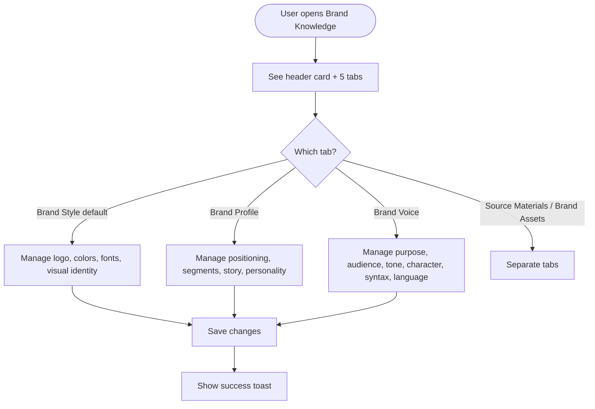
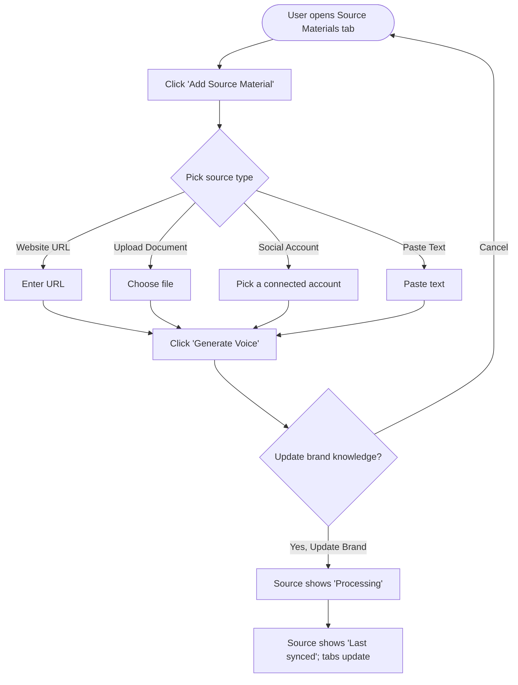

# Brand Knowledge Revamp — Epic & Stories

> Final deliverable for the PO to create in Shortcut manually. **Nothing is pushed to Shortcut.** Each story ends with a **Shortcut fields** block.
>
> **Design artifact (attach in Shortcut where mock-ups are referenced):** https://claude.ai/design/p/c9cb3c18-d69f-48c8-9674-4d9a18413a8c?file=Brand+Knowledge.html
>
> **Mobile note:** AI brand features are **web-only** — no iOS/Android stories. The only cross-product touchpoint is the new Media Library "Brand Assets" folder, which surfaces in the mobile Media Library automatically as a standard (non-AI) folder; no mobile work is required.

---

## EPIC: Brand Knowledge Revamp — One Brand Per Workspace

**Description:**

Brand Knowledge (today's "AI Content Library") lets a workspace define its brand identity so ContentStudio's AI generates on-brand content. Today a workspace can hold *multiple* brand styles and voices, selected via dropdowns — which fragments the brand, confuses users, and forces a brand-picker into every AI surface. This epic **unifies Brand Knowledge to exactly one brand per workspace** and restructures it into five tabs: **Brand Style, Brand Profile (new), Brand Voice, Source Materials (new), and Brand Assets (new)**.

Users will be able to **auto-learn their brand** by adding a Source Material — a website URL, an uploaded document, a connected social account, or pasted text — which the AI analyzes to populate Brand Style, Brand Voice, and Brand Profile. Live sources (website, social account) can be **auto-synced** on a schedule. Brand images and logos live in a new **Brand Assets** library backed by the Media Library. Across the product (AI composer, AI chat, inbox auto-replies, RSS, Evergreen), the brand selector dropdown is replaced by a single **"Use brand voice"** toggle that defaults on when a brand exists.

Existing workspaces with multiple brands are migrated gracefully: a **7-day in-app notice** warns users, after which the system keeps the **first-created** brand style and voice and removes the rest (no export). Success is measured by brand-setup completion (target 50% of active workspaces in 90 days), source-ingestion adoption (30%), and brand-applied-in-generation rate (60%), with guard rails on churn, support volume, and ingestion reliability.

**Epic state when created in Shortcut:** To Do.

---

## Story List

| # | Title | Type | Group |
|---|---|---|---|
| 1 | [Design] Finalize Brand Knowledge revamp designs (5 tabs, modals, empty/error states) | chore | Design |
| 2 | [BE] Unify Brand Knowledge to a single brand per workspace (data model + APIs) | chore | Backend |
| 3 | [BE] Migrate existing workspaces to one brand (consolidation job + 7-day rollout) | chore | Backend |
| 4 | [FE] Add the Brand Knowledge unification migration banner | feature | Frontend |
| 5 | [FE] Build the Brand Knowledge tabs (shell + Brand Style, Brand Profile, Brand Voice) | feature | Frontend |
| 6 | [BE] Source material ingestion API + async processing (website, document, social, text) | feature | Backend |
| 7 | [FE] Build the Source Materials tab (add sources, confirm modal, sync, auto-sync) | feature | Frontend |
| 8 | [BE] Auto-sync live brand sources on a schedule (opt-in) | feature | Backend |
| 9 | [BE] Add a per-workspace "Brand Assets" folder to the Media Library | feature | Backend |
| 10 | [FE] Build the Brand Assets tab (upload, choose from library, bulk actions) | feature | Frontend |
| 11 | [BE] Apply the single workspace brand in AI generation based on the brand toggle | feature | Backend |
| 12 | [FE] Replace brand selector with a "Use brand voice" toggle across AI surfaces (composer, AI chat, Inbox) | feature | Frontend |
| 13 | [BE] [Research] Brand source-material memory & retrieval approach | chore | Backend |

---

# 1. [Design] Finalize Brand Knowledge revamp designs (5 tabs, modals, empty/error states)

### Description:
As a designer, I want to finalize high-fidelity designs for the revamped Brand Knowledge (the five tabs, the "Add Source Material" flow, the "Update brand knowledge?" modal, the Brand Assets grid, and all empty/error/loading states) so that engineering builds a consistent, on-brand experience that matches ContentStudio's design system.

### Workflow:
1. Designer reviews the exemplary artifact and PO screenshots and produces production-ready designs for: the Brand Knowledge header card + 5-tab layout (Brand Style, Brand Profile, Brand Voice, Source Materials, Brand Assets).
2. Designer specs the "Add Source Material" panel (source-type selector, inputs per type), the "Update brand knowledge?" confirmation modal, and the source list with status states (Processing, Last synced, Unreachable).
3. Designer specs the Brand Assets grid, the "Add New Media" menu (Upload / Choose from Media Library), and bulk-selection UI.
4. Designer specs empty, loading, and error states for every tab, plus the migration banner.
5. Designer confirms all components map to `@contentstudio/ui` (or flags gaps) and uses CSS-variable theming (no hardcoded colors).

### Acceptance criteria:
- [ ] Designs delivered for all five tabs matching the design system (spacing, typography, components)
- [ ] Add Source Material panel designed for all four source types (Website URL, Upload Document, Social Account, Paste Text)
- [ ] "Update brand knowledge?" modal designed with the agreed copy
- [ ] Source list designed with Processing / Last synced / Unreachable states and per-row actions (Sync, Rename, Open, Delete) + the per-source auto-sync toggle
- [ ] Brand Assets grid + "Add New Media" menu + bulk-select designed
- [ ] Empty, loading, and error states designed for each tab and the migration banner
- [ ] Component gaps flagged (e.g., chip/pill, tooltip) with proposed design-system solutions
- [ ] No dark-mode or RTL variants (not supported)

### Mock-ups:
See the Brand Knowledge design artifact: https://claude.ai/design/p/c9cb3c18-d69f-48c8-9674-4d9a18413a8c?file=Brand+Knowledge.html (exemplary — to be finalized). PO-provided screenshots are reference only.

### Impact on existing data:
None (design only).

### Impact on other products:
Establishes the visual pattern for the Brand Assets folder that also appears in the Media Library.

### Dependencies:
None (this unblocks the FE stories).

### Global quality & compliance (wherever applicable)
- [ ] Mobile responsiveness (frontend only, N/A for backend-only stories) — design responsive layouts for the web app
- [ ] Multilingual support (frontend + backend, translations available or fallback handled) — allow for text expansion
- [ ] UI theming support — N/A, ContentStudio has no dark mode; ensure white-label via CSS variables
- [ ] White-label domains impact review — colors must come from theme variables
- [ ] Cross-product impact assessment (web, mobile apps, Chrome extension) — N/A, web-only

---

# 2. [BE] Unify Brand Knowledge to a single brand per workspace (data model + APIs)

### Description:
As a workspace owner, I want my workspace to have exactly one Brand Style, one Brand Voice, and one Brand Profile (instead of multiple) so that AI consistently uses one canonical brand and the experience is no longer fragmented. This story changes the data model and the Brand Knowledge APIs to a single-brand shape and adds the new Brand Profile and Source Materials structures.

### Workflow:
This is a backend data-model and API story; the user-facing flow is covered by the FE tab stories. Behavior:
1. The brand-knowledge profile for a workspace exposes a single `style`, a single `brand_voice`, a new `brand_profile` object, and a `source_materials` list — instead of `styles[]` / `brand_voices[]` arrays.
2. Fetching the profile returns the single-brand shape; updating accepts the single-brand shape.
3. During the transition the API can still read legacy array data (so nothing breaks before migration runs).

### Acceptance criteria:
- [ ] The brand-knowledge profile API returns a single `style` object and a single `brand_voice` object for a workspace (not arrays)
- [ ] The profile API returns a new `brand_profile` object supporting: business name; core identity; market positioning (primary, secondary, tertiary); direct competitors (local, international); competitive advantages; primary customer segments; top revenue generators; emerging growth areas; primary value drivers; emotional benefits; brand story; brand personality (list of tags)
- [ ] The profile API returns a `source_materials` list, each item with: id, type (`website` | `document` | `social` | `text`), reference (URL / file / account id / text), name, status (`processing` | `synced` | `unreachable`), last_synced timestamp, added timestamp, auto_sync flag (default false)
- [ ] Updating Brand Style, Brand Voice, or Brand Profile persists to the single-brand fields and is scoped to the current workspace
- [ ] Validation rejects malformed payloads with clear error responses (field-level messages)
- [ ] When a workspace has legacy `styles[]` / `brand_voices[]` data and no single-brand fields yet, the API still returns a usable brand by falling back to the first-created style/voice (so reads don't break before migration runs)
- [ ] Existing AI-agent consumption contract (a single brand-voice object) continues to work unchanged
- [ ] When the workspace brand is saved for the first time (style + voice present), a `brand_profile_created` Usermaven event fires (reusing the existing event; confirm payload shape in code)

### Mock-ups:
N/A — backend only.

### Impact on existing data:
`AiContentLibraryProfile` documents currently store `styles[]` and `brand_voices[]`. This story adds single `style`, `brand_voice`, `brand_profile`, and `source_materials[]` fields without dropping the legacy arrays (the arrays are removed later, after migration completes). MongoDB's flexible schema means no destructive migration here.

### Impact on other products:
The mobile Media Library is unaffected. AI agents continue to receive a single brand-voice object.

### Dependencies:
Blocks **[BE] Migrate existing workspaces to one brand (consolidation job + 7-day rollout)**, the FE tab stories, **[BE] Source material ingestion API + async processing (website, document, social, text)**, and **[BE] Apply the single workspace brand in AI generation based on the brand toggle**.

### Global quality & compliance (wherever applicable)
- [ ] Mobile responsiveness — N/A, backend only
- [ ] Multilingual support (frontend + backend, translations available or fallback handled) — error messages localizable
- [ ] UI theming support — N/A, backend only
- [ ] White-label domains impact review — brand data is workspace-scoped; verify no leakage across workspaces/domains
- [ ] Cross-product impact assessment (web, mobile apps, Chrome extension) — verify AI agent contract and any API consumers

### Implementation references
*Pointers from research — not a contract. Engineering may choose a different approach.*

**Primary entry points:**
- `contentstudio-backend/app/Models/Ai/AiContentLibrary/AiContentLibraryProfile.php` — model holding `styles: array`, `brand_voices: array` today (each item has `id`, `name`, `is_default`)
- `contentstudio-backend/app/Http/Controllers/AI/AiContentLibrary/AiContentLibraryProfileController.php` — profile CRUD
- `contentstudio-backend/app/Http/Requests/AI/AiContentLibrary/UpdateProfileRequest.php` — validation
- `contentstudio-backend/app/Helpers/Ai/ContentLibraryHelper.php`, `AiChatHelper.php` — brand-context builders

**Existing behavior to preserve:**
- AI agents already expect a single `brand_voice` object (`contentstudio-ai-agents/src/models/brand_voice.py`) — keep that contract.

---

# 3. [BE] Migrate existing workspaces to one brand (consolidation job + 7-day rollout)

### Description:
As an existing user with multiple brands in a workspace, I want my workspace consolidated to a single brand automatically when the change ships, keeping my first-created Brand Style and Brand Voice, so that I'm not left with a broken or fragmented setup. This story is the one-time consolidation that runs at the end of the 7-day notice window.

### Workflow:
This is a backend migration job; the user-facing notice is covered by **[FE] Add the Brand Knowledge unification migration banner**. Behavior:
1. Until the rollout date, nothing is deleted — users can review and clean up their brands.
2. On the rollout date, the consolidation runs per workspace: it keeps the **first-created (oldest)** brand style and the first-created brand voice, copies them into the single-brand fields, and removes the remaining styles/voices. No export is produced.
3. Workspaces that already have a single brand are left unchanged.

### Acceptance criteria:
- [ ] A consolidation job processes every workspace that has more than one brand style or brand voice
- [ ] For each such workspace, the **first-created (oldest by creation time)** style and the first-created voice are retained and written to the single-brand fields
- [ ] All other styles and voices for that workspace are permanently removed (no export, no archive)
- [ ] Workspaces with exactly one (or zero) brand are skipped with no change
- [ ] The job is idempotent and resumable (re-running does not delete additional data or duplicate work)
- [ ] The job processes workspaces in batches and can run off-peak without timing out
- [ ] Legacy `styles[]` / `brand_voices[]` arrays are removed after the single-brand fields are populated
- [ ] When consolidation completes for a workspace, a `brand_consolidated` Usermaven event fires (server-side) with `{ styles_removed, voices_removed }`
- [ ] A dry-run / count mode is available to report how many workspaces and brands would be affected before the real run

### Mock-ups:
N/A — backend only.

### Impact on existing data:
Destructive for workspaces with multiple brands: all but the first-created style and voice are permanently deleted. Legacy arrays are dropped after the singles are populated. This is intentional and gated by the 7-day notice (PO decision: no export).

### Impact on other products:
After consolidation, every AI surface uses the single retained brand. Mobile is unaffected.

### Dependencies:
Depends on **[BE] Unify Brand Knowledge to a single brand per workspace (data model + APIs)**. Pairs with **[FE] Add the Brand Knowledge unification migration banner** (the banner must run for the full 7-day window before this job executes).

### Global quality & compliance (wherever applicable)
- [ ] Mobile responsiveness — N/A, backend only
- [ ] Multilingual support — N/A, no user-facing copy in the job
- [ ] UI theming support — N/A, backend only
- [ ] White-label domains impact review — ensure per-workspace isolation during batch processing
- [ ] Cross-product impact assessment (web, mobile apps, Chrome extension) — verify downstream AI surfaces resolve the retained brand

### Implementation references
*Pointers from research — not a contract. Engineering may choose a different approach.*

**Primary entry points:**
- `contentstudio-backend/app/Models/Ai/AiContentLibrary/AiContentLibraryProfile.php` — read `styles[]` / `brand_voices[]`, write single fields
- Reuse the existing async job pattern (`contentstudio-backend/app/Jobs/AI/BrandKnowledgeGenerationJob.php`) as a template for batched processing

**Gotcha:**
- "First-created" must be derived from a stable creation timestamp/ordering on each array item; if items lack a creation timestamp, fall back to array order (oldest index first) and confirm that order reflects creation.

---

# 4. [FE] Add the Brand Knowledge unification migration banner

### Description:
As an existing user with multiple brands, I want a clear in-app notice before the change ships so that I understand what's happening, know which brand will be kept, and have time to clean up so my preferred brand is the one that stays. The banner appears on the Brand Knowledge page and the workspace home page during the 7-day notice window.

### Workflow:
1. During the notice window, a user whose workspace has more than one brand style or voice sees a banner at the top of the Brand Knowledge page and the workspace home page.
2. The banner explains that Brand Knowledge is moving to one brand per workspace on the rollout date, that the **first-created** Brand Style and Brand Voice will be kept, and that the rest will be removed.
3. The user clicks **"Review my brands"** and lands on Brand Knowledge, where they can delete the brands they don't want (so their preferred brand becomes the oldest remaining one).
4. The user can dismiss the banner for the current session; it reappears on the next visit until the rollout date, after which it no longer shows.

### Acceptance criteria:
- [ ] Banner appears only for workspaces with more than one brand style or brand voice, and only during the notice window (hidden after the rollout date)
- [ ] Banner shows on both the Brand Knowledge page and the workspace home/dashboard
- [ ] Banner text reads: **"Brand Knowledge is becoming simpler. From {rollout date}, each workspace will keep one Brand Style and one Brand Voice — we'll keep your first-created Brand Style and Voice and remove the rest. Review your brands now to choose what stays."**
- [ ] Banner shows a dynamic countdown subtext: **"{n} days left to review."**
- [ ] Primary CTA button labeled **"Review my brands"** deep-links to the Brand Knowledge page
- [ ] A secondary text link **"What's changing?"** opens the help article in a new tab
- [ ] Banner is dismissible (×) for the session; it reappears on the next visit until the rollout date
- [ ] When the user clicks "Review my brands", a `brand_migration_cta_clicked` Usermaven event fires with `{ location: 'brand_knowledge' | 'home' }` (set `location` to where the banner was clicked)
- [ ] No banner is shown to workspaces that already have a single brand

### Mock-ups:
See the Brand Knowledge design artifact: https://claude.ai/design/p/c9cb3c18-d69f-48c8-9674-4d9a18413a8c?file=Brand+Knowledge.html

### Impact on existing data:
None — informational UI only. (The actual consolidation is handled by **[BE] Migrate existing workspaces to one brand (consolidation job + 7-day rollout)**.)

### Impact on other products:
Appears in the web app only.

### Dependencies:
Pairs with **[BE] Migrate existing workspaces to one brand (consolidation job + 7-day rollout)** (same rollout date). Best shipped alongside **[FE] Build the Brand Knowledge tabs (shell + Brand Style, Brand Profile, Brand Voice)**.

### Global quality & compliance (wherever applicable)
- [ ] Mobile responsiveness (frontend only) — banner readable on small web viewports
- [ ] Multilingual support — all banner copy via i18n keys in every locale
- [ ] UI theming support — N/A dark mode; use CSS-variable theme classes (e.g., `text-primary-cs-500`)
- [ ] White-label domains impact review — link/help URL must respect white-label
- [ ] Cross-product impact assessment (web, mobile apps, Chrome extension) — web only

### Implementation references
*Pointers from research — not a contract. Engineering may choose a different approach.*

**Suggested components:**
- Use `CstBanner` (full-width banner; no `@contentstudio/ui` equivalent per the component catalog) with theme-aware classes; CTA via `Button`.
- The rollout date and notice-window start can come from a config/feature-flag constant; the "has multiple brands" condition can read the existing profile (`styles[]` / `brand_voices[]` length) before migration runs.

**Primary entry points:**
- `contentstudio-frontend/src/modules/publisher/ai-content-library/` — Brand Knowledge module (banner host)
- Workspace home/dashboard view — second banner location

---

# 5. [FE] Build the Brand Knowledge tabs (shell + Brand Style, Brand Profile, Brand Voice)

### Description:
As a workspace user, I want Brand Knowledge organized into a clear five-tab layout and the three brand-editing tabs — Brand Style (logo, colors, fonts, visual identity), Brand Profile (business positioning, audience, story, personality), and Brand Voice (tone, character, syntax, language) — so that everything about my single brand lives in one structured place. This story delivers the tab shell plus the Brand Style, Brand Profile, and Brand Voice tabs. (The Source Materials and Brand Assets tabs are separate stories.)

### Workflow:

1. User opens Brand Knowledge and sees the header card ("Brand Knowledge — Define and manage your brand's identity so AI can create content that aligns with your brand's values and personality") and a row of five tabs, with **Brand Style** selected by default.
2. On **Brand Style**, the user manages logos, colors, fonts, and a visual identity description.
3. On **Brand Profile**, the user manages business name and the Business Overview & Positioning sections (each with inline Edit).
4. On **Brand Voice**, the user manages purpose, audience, and tag lists for tone, emotion, character, syntax, and language.
5. User saves on each tab and sees a success toast.

### Acceptance criteria:

**Tab shell:**
- [ ] Brand Knowledge shows five tabs in order: **Brand Style**, **Brand Profile**, **Brand Voice**, **Source Materials**, **Brand Assets** (using the `Tabs` component)
- [ ] Brand Style is the default tab on open
- [ ] Header card displays the title and description text

**Brand Style tab:**
- [ ] **Logo** section: user can upload one or more logo images via an "Upload" control and an **"+ Add More"** link; logos display as thumbnails
- [ ] **Colors** section: user can add brand colors via a "+" control (color picker) and remove a color; colors display as swatches
- [ ] **Fonts** section: a **Title font** dropdown and a **Body font** dropdown; a live preview shows the selected fonts (heading sample + body sample)
- [ ] **Visual Identity Description**: an editable multi-line field with an "Edit" affordance; placeholder example: *"Clean minimal layout, bold red accents, modern sans-serif fonts, ample white space, friendly approachable tone."*
- [ ] Saving Brand Style shows success toast: **"Brand Style saved."**
- [ ] **Empty state** (no brand yet): headline **"Set up your Brand Style"**, subtext **"Add your logo, colors, and fonts so AI can create content that looks like your brand. Or add a Source Material to fill this in automatically."**, CTA **"Add Source Material"** (switches to the Source Materials tab)

**Brand Profile tab (new):**
- [ ] **Business Name** field (text input), e.g., *"Tim Hortons Pakistan"*
- [ ] **Core Identity** (multi-line)
- [ ] **Market Positioning** — three fields: **Primary**, **Secondary**, **Tertiary** (e.g., *"Experience Canadian warmth in every cup"*)
- [ ] **Direct Competitors** — two fields: **Local** and **International**
- [ ] **Competitive Advantages**, **Primary Customer Segments**, **Top Revenue Generators**, **Emerging Growth Areas**, **Primary Value Drivers**, **Emotional Benefits** — each an editable list (add/remove); customer segments support a label + optional share/description (e.g., *"Young Professionals (30%) — Age 18-35, seeking quick breakfast and lunch"*)
- [ ] **Brand Story** — multi-line text
- [ ] **Brand Personality** — tag input where each tag renders as a removable chip (e.g., *Warm, Trustworthy, Approachable, Authentic, Community-driven*)
- [ ] Each section supports inline **Edit** and persists on save; success toast: **"Brand Profile saved."**
- [ ] **Empty state**: headline **"Tell AI about your business"**, subtext **"Add your positioning, audience, and story so AI writes content that fits your brand — or add a Source Material to fill this in automatically."**, CTA **"Add Source Material"**

**Brand Voice tab:**
- [ ] **Purpose** (multi-line), e.g., *"Promote menu items and special offers, encourage customer engagement, showcase hospitality and warmth."*
- [ ] **Audience** (multi-line), e.g., *"Coffee enthusiasts looking for quality beverages; fans of Tim Hortons and potential new customers in Pakistan."*
- [ ] **Tone** — tag input, placeholder **"Add tone and press Enter"** (e.g., *Welcoming and friendly*)
- [ ] **Emotion** — tag input, placeholder **"Add emotion and press Enter"** (e.g., *Elicit feelings of comfort and joy*)
- [ ] **Character** — tag input, placeholder **"Add character and press Enter"** (e.g., *Act as a friendly guide for customers exploring menu options*)
- [ ] **Syntax** — tag input, placeholder **"Add syntax rule and press Enter"** (e.g., *Use short, engaging sentences*)
- [ ] **Language** — tag input, placeholder **"Add language rule and press Enter"** (e.g., *Use everyday language with a casual tone*)
- [ ] Each tag renders as a removable chip; tags can be added and removed
- [ ] Each section has an info tooltip with a plain-language explanation + example. Tone tooltip: **"How your brand sounds. Example: 'Welcoming and friendly' makes captions warm and casual rather than formal."** Syntax tooltip: **"Rules for sentence structure. Example: 'Use short, engaging sentences' keeps posts punchy and easy to read."**
- [ ] Saving Brand Voice shows success toast: **"Brand Voice saved."**
- [ ] **Empty state**: headline **"Define your brand voice"**, subtext **"Set the tone and personality AI should use when writing your posts and replies — or add a Source Material to generate it automatically."**, CTA **"Add Source Material"**

**Common to all three tabs:**
- [ ] **Loading state**: skeleton placeholders while the brand loads
- [ ] **Error state**: if saving fails, show inline error toast **"Couldn't save your changes. Please try again."**
- [ ] All copy provided via i18n keys; colors use theme-aware classes (no hardcoded hex)

### Mock-ups:
See the Brand Knowledge design artifact: https://claude.ai/design/p/c9cb3c18-d69f-48c8-9674-4d9a18413a8c?file=Brand+Knowledge.html (Brand Style, Brand Profile, Brand Voice tabs).

### Impact on existing data:
Reads/writes the single `style`, `brand_profile`, and `brand_voice` objects from the unified profile. Replaces the previous multi-style and multi-voice editors.

### Impact on other products:
Brand Style feeds AI image/visual generation; Brand Voice + Brand Profile feed AI caption/reply generation. No mobile impact.

### Dependencies:
Depends on **[BE] Unify Brand Knowledge to a single brand per workspace (data model + APIs)** and **[Design] Finalize Brand Knowledge revamp designs (5 tabs, modals, empty/error states)**.

### Global quality & compliance (wherever applicable)
- [ ] Mobile responsiveness (frontend only) — tab layout and all three tabs usable on small web viewports
- [ ] Multilingual support — all labels/placeholders/tooltips/toasts/empty states via i18n keys in every locale
- [ ] UI theming support — N/A dark mode; use `@contentstudio/ui` components + CSS-variable classes
- [ ] White-label domains impact review — no hardcoded brand colors in the UI chrome
- [ ] Cross-product impact assessment (web, mobile apps, Chrome extension) — web only

### Implementation references
*Pointers from research — not a contract. Engineering may choose a different approach.*

**Suggested components:** `Tabs`, `Button`, `Dropdown`/`DropdownItem` (fonts), `TextInput`, `Textarea`. Tag input via `CstTagsDropdown`. **Tooltip gap:** no standalone Tooltip in `@contentstudio/ui` (see catalog) — use `CstPopup` or a Tailwind-based tooltip. **Chip gap:** no dedicated Chip/Pill component — render removable tag chips with the existing tag pattern / Tailwind pills (theme-aware classes). No dedicated color-swatch component — reuse the existing color-picker pattern from the current Brand Style UI.

**Primary entry points:**
- `contentstudio-frontend/src/modules/publisher/ai-content-library/` — module to restructure into tabs
- `contentstudio-frontend/src/modules/publisher/ai-content-library/composables/useSetup.js` — refactor `AIUserProfile` from `styles[]`/`brand_voices[]` to single `style`/`brand_voice` + new `brand_profile`
- `contentstudio-frontend/src/modules/publisher/ai-content-library/components/editors/BrandVoiceEditor.vue`, `StyleEditor.vue` — refactor from multi to single
- `contentstudio-frontend/src/api/ai-content-library.ts` — `fetchAiProfileApi()`, `updateBrandingApi()`, `updateStrategyApi()`, `updateTopicsApi()`

---

# 6. [BE] Source material ingestion API + async processing (website, document, social, text)

### Description:
As a user, I want to add a source — my website, a document, a connected social account, or pasted text — and have AI analyze it to fill in my Brand Style, Brand Voice, and Brand Profile, so that I don't have to define my brand by hand. This story provides the ingestion APIs and the asynchronous processing for all four source types.

### Workflow:
This is the backend for **[FE] Build the Source Materials tab**. Behavior:
1. The user adds a source and confirms the update; the API records the source with a "processing" status and queues an asynchronous ingestion job.
2. The job extracts content (scrape website / parse document / analyze recent posts from the connected account / read pasted text), then regenerates the brand from **all active source materials combined**, and updates the single `style`, `brand_voice`, and `brand_profile`.
3. On success the source is marked "synced" with a last-synced timestamp; on failure it's marked "unreachable" and the brand is left unchanged.

### Acceptance criteria:
- [ ] Endpoint to **add a source material** of type `website` (URL), `document` (file upload), `social` (a connected social account id), or `text` (pasted text); returns the created source with status `processing`
- [ ] Endpoint to **list** a workspace's source materials and to **delete**, **rename**, and **manually sync** a source
- [ ] Adding or manually syncing a source queues an **asynchronous** ingestion job (no synchronous blocking)
- [ ] **Website:** the job fetches and extracts page content; on unreachable/invalid URL the source is marked `unreachable` and the brand is unchanged
- [ ] **Document:** supported file types are validated; text is extracted; unsupported/corrupt files return a clear validation error and the source is not added
- [ ] **Social account:** recent posts from the selected connected account are analyzed; if too little content is found, the job completes without changing the brand and reports that
- [ ] **Text:** pasted text is accepted (with a minimum length) and analyzed
- [ ] After extraction, the brand is regenerated from **all active source materials combined** and the single `style`, `brand_voice`, and `brand_profile` are updated
- [ ] On success the source status becomes `synced` with a `last_synced` timestamp; on failure it becomes `unreachable` (or an error status) and the existing brand is preserved
- [ ] When an ingestion job completes, a `brand_knowledge_updated` Usermaven event fires (server-side) with `{ source_type, status, trigger: 'manual' }`
- [ ] All source endpoints are workspace-scoped and authorized

### Mock-ups:
N/A — backend only.

### Impact on existing data:
Adds `source_materials[]` items and overwrites the AI-derived fields of `style` / `brand_voice` / `brand_profile` on each update. (Protecting manually-edited fields is a v2 enhancement.)

### Impact on other products:
Updated brand flows to all AI surfaces. No mobile impact.

### Dependencies:
Depends on **[BE] Unify Brand Knowledge to a single brand per workspace (data model + APIs)**. Powers **[FE] Build the Source Materials tab (add sources, confirm modal, sync, auto-sync)** and is extended by **[BE] Auto-sync live brand sources on a schedule (opt-in)**. Storage/retrieval of source content is informed by **[BE] [Research] Brand source-material memory & retrieval approach**.

### Global quality & compliance (wherever applicable)
- [ ] Mobile responsiveness — N/A, backend only
- [ ] Multilingual support — error/status messages localizable
- [ ] UI theming support — N/A, backend only
- [ ] White-label domains impact review — scraping/parsing must be workspace-scoped; no cross-tenant leakage
- [ ] Cross-product impact assessment (web, mobile apps, Chrome extension) — verify AI agent inputs remain valid

### Implementation references
*Pointers from research — not a contract. Engineering may choose a different approach.*

**Primary entry points:**
- `contentstudio-backend/app/Jobs/AI/BrandKnowledgeGenerationJob.php` — existing async brand-generation job to extend/reuse
- `contentstudio-backend/app/Http/Controllers/AI/AiContentLibrary/AiContentLibraryProfileController.php` — add source endpoints
- `contentstudio-ai-agents/src/agents/tools/business_info_agent.py` — already analyzes brand info from documents/URLs
- Existing FE ingestion helpers to mirror server-side: `analyzeBrandApi()`, `uploadBrandFileApi()` in `contentstudio-frontend/src/api/ai-content-library.ts`

**Gotcha:**
- "Regenerate from all active sources" means a delete or re-sync of one source should recompute from the remaining set — make the job read the full active source list, not just the triggering source.

---

# 7. [FE] Build the Source Materials tab (add sources, confirm modal, sync, auto-sync)

### Description:
As a user, I want to add and manage brand sources (website, document, social account, pasted text) from a Source Materials tab, confirm before AI updates my brand, and optionally keep live sources auto-synced, so that my brand stays accurate with minimal effort.

### Workflow:

1. User opens **Source Materials** and clicks **"Add Source Material"**.
2. User picks a source type from a selector: **Website URL** (marked "Recommended"), **Upload Document**, **Social Account**, **Paste Text**.
3. User provides the input and clicks **"Generate Voice"**.
4. A confirmation modal appears; on **"Yes, Update Brand"** the source is added with a **"Processing"** status and the AI updates the brand in the background.
5. When done, the row shows **"Last synced {date}"**; the Brand Style/Voice/Profile tabs reflect the new content.
6. The user can **Sync**, **Rename**, **Open**, or **delete** any source, and can enable **Auto-sync** for live sources (website, social account).

### Acceptance criteria:
- [ ] Header shows **"Source Materials"** with the count (e.g., "3 items") and subtext **"Upload marketing or brand materials. AI will analyze and use them in content generation."** and an **"+ Add Source Material"** button
- [ ] "Add new source" panel uses a `SegmentedControl` with four options: **Website URL** (badge **"Recommended"**), **Upload Document**, **Social Account**, **Paste Text**
- [ ] **Website URL:** input with placeholder **"https://example.com"**, helper text **"We'll scan this website to learn your brand voice and style."**
- [ ] **Upload Document:** file picker with accepted-types hint; invalid type shows error **"That file type isn't supported. Try a PDF, DOC, or TXT file."**
- [ ] **Social Account:** a picker listing the workspace's connected social accounts
- [ ] **Paste Text:** a textarea with placeholder **"Paste your marketing copy, About page, or any text that represents your brand."**; if too short, show **"Please paste at least a few sentences so AI has enough to learn from."**
- [ ] Panel has **"Cancel"** and **"Generate Voice"** buttons; "Generate Voice" is disabled until valid input is provided
- [ ] Clicking "Generate Voice" opens the confirm modal — title **"Update brand knowledge?"**, body **"Adding this source will update your Brand Voice, Brand Style, and Brand Profile to reflect the new content. Are you sure you want to continue?"**, buttons **"Cancel"** and **"Yes, Update Brand"** (using the `Modal` component)
- [ ] On **"Yes, Update Brand"**, the source appears in the list with a **"Processing"** status `Badge`; the user can navigate away and is notified when it finishes
- [ ] Source list table columns: **NAME**, **TYPE**, **LAST SYNCED**, **ADDED**, **ACTIONS**; status shows as `Badge` (**Processing**, **Last synced {date}**, or **Unreachable** in a warning style)
- [ ] Per-row actions: **Sync**, **Rename**, **Open**, **Delete** (delete asks for confirmation)
- [ ] Live sources (Website URL, Social Account) show an **Auto-sync** `Switch` (default **off**) with tooltip **"Keep this source fresh — we'll re-check it on a schedule and update your brand automatically. You'll get a notification each time it updates."**; static sources (Document, Paste Text) do not show the toggle
- [ ] When the user confirms a new source, a `brand_source_added` Usermaven event fires with `{ source_type: 'website' | 'document' | 'social' | 'text' }`
- [ ] When the user toggles auto-sync for a source, a `brand_autosync_changed` Usermaven event fires with `{ enabled, source_type: 'website' | 'social' }`
- [ ] **Empty state**: headline **"Teach AI about your brand"**, subtext **"Add your website, a document, a connected account, or some text and AI will learn your brand voice and style."**, CTA **"Add Source Material"**
- [ ] **Loading state** while sources load; **error toast** if adding a source fails: **"Couldn't add that source. Please try again."**
- [ ] All copy via i18n; theme-aware classes only

### Mock-ups:
See the Brand Knowledge design artifact: https://claude.ai/design/p/c9cb3c18-d69f-48c8-9674-4d9a18413a8c?file=Brand+Knowledge.html (Source Materials tab + "Update brand knowledge?" modal).

### Impact on existing data:
Drives updates to the single brand via the ingestion API; displays `source_materials[]`.

### Impact on other products:
Updated brand flows to all AI surfaces. No mobile impact.

### Dependencies:
Depends on **[BE] Source material ingestion API + async processing (website, document, social, text)**, **[BE] Auto-sync live brand sources on a schedule (opt-in)** (for the auto-sync toggle behavior), and **[Design] Finalize Brand Knowledge revamp designs (5 tabs, modals, empty/error states)**.

### Global quality & compliance (wherever applicable)
- [ ] Mobile responsiveness (frontend only) — table/panel usable on small web viewports
- [ ] Multilingual support — all copy via i18n in every locale
- [ ] UI theming support — N/A dark mode; `@contentstudio/ui` + CSS-variable classes
- [ ] White-label domains impact review — no hardcoded colors; help text white-label safe
- [ ] Cross-product impact assessment (web, mobile apps, Chrome extension) — web only

### Implementation references
*Pointers from research — not a contract. Engineering may choose a different approach.*

**Suggested components:** `SegmentedControl` (source-type picker), `TextInput`, `Textarea`, `Button`, `Modal` (confirm), `Badge` (status), `Switch` (auto-sync), `ActionIcon` (row actions), `Loader`. **Tooltip gap:** use `CstPopup` or Tailwind tooltip for the auto-sync hint.

**Primary entry points:**
- `contentstudio-frontend/src/modules/publisher/ai-content-library/composables/useSetup.js` — existing website-URL + file-upload ingestion state to extend
- `contentstudio-frontend/src/api/ai-content-library.ts` — `analyzeBrandApi()`, `uploadBrandFileApi()`

---

# 8. [BE] Auto-sync live brand sources on a schedule (opt-in)

### Description:
As a user, I want my live sources (website, connected social account) to refresh automatically on a schedule so that my brand stays current without me re-syncing manually. Auto-sync is opt-in per source and notifies me whenever it updates my brand.

### Workflow:
This is backend scheduling for the auto-sync toggle in **[FE] Build the Source Materials tab**. Behavior:
1. When a user enables auto-sync for a live source, the source is flagged for scheduled refresh.
2. On the schedule, the system re-pulls each auto-sync source, regenerates the brand from all active sources, and updates the brand.
3. After each successful auto-update, the user is notified.

### Acceptance criteria:
- [ ] A source can be flagged **auto-sync on/off** (default off); only `website` and `social` source types are eligible
- [ ] A scheduled job re-pulls each auto-sync-enabled source on the configured cadence and runs the same ingestion/regeneration as a manual sync
- [ ] On a successful auto-update, the source's `last_synced` timestamp updates and the user receives a notification that their brand was updated from that source
- [ ] On failure, the source is marked `unreachable` (or error), the brand is left unchanged, and the failure does not repeatedly spam notifications
- [ ] Auto-sync respects the **regenerate-from-all-active-sources** rule (BR-4)
- [ ] When an auto-sync ingestion completes, a `brand_knowledge_updated` Usermaven event fires (server-side) with `{ source_type, status, trigger: 'auto' }`
- [ ] The cadence is configurable (final cadence is a product decision — see open question) and can be changed without code edits
- [ ] Disabling auto-sync stops future scheduled runs for that source

### Mock-ups:
N/A — backend only.

### Impact on existing data:
Adds an `auto_sync` flag per source; periodically overwrites AI-derived brand fields. (Manual-field protection is v2.)

### Impact on other products:
Keeps the brand fresh across all AI surfaces. No mobile impact.

### Dependencies:
Depends on **[BE] Source material ingestion API + async processing (website, document, social, text)**. Surfaced by the auto-sync toggle in **[FE] Build the Source Materials tab (add sources, confirm modal, sync, auto-sync)**.

### Global quality & compliance (wherever applicable)
- [ ] Mobile responsiveness — N/A, backend only
- [ ] Multilingual support — the post-sync notification copy must be localizable
- [ ] UI theming support — N/A, backend only
- [ ] White-label domains impact review — notifications respect white-label sender/branding
- [ ] Cross-product impact assessment (web, mobile apps, Chrome extension) — notification delivery channels reviewed

### Implementation references
*Pointers from research — not a contract. Engineering may choose a different approach.*

**Primary entry points:**
- Laravel scheduler (`app/Console/Kernel.php` schedule) to dispatch auto-sync runs
- Reuse the ingestion path from **[BE] Source material ingestion API + async processing** (the `BrandKnowledgeGenerationJob`)

**Gotcha:**
- Stagger/queue scheduled runs so a large number of auto-sync sources doesn't spike scraping/AI load at the cadence boundary.

---

# 9. [BE] Add a per-workspace "Brand Assets" folder to the Media Library

### Description:
As a user, I want my brand images and logos stored in a dedicated Brand Assets library that lives in my Media Library, so that brand visuals are reusable across content and managed in one place. This story adds the backing folder and the link/upload/delete operations.

### Workflow:
This is backend support for **[FE] Build the Brand Assets tab**. Behavior:
1. Each workspace has a special **"Brand Assets"** folder in its Media Library.
2. Users can upload new assets into it or link existing Media Library assets into it.
3. Users can delete assets (individually or in bulk) from the Brand Assets folder.

### Acceptance criteria:
- [ ] Each workspace has (or lazily gets) a single special **"Brand Assets"** Media Library folder, identifiable by a flag (e.g., `is_brand_assets_folder`)
- [ ] Endpoint to list the assets in a workspace's Brand Assets folder
- [ ] Endpoint to **add new uploaded assets** to the Brand Assets folder
- [ ] Endpoint to **add existing Media Library assets** to the Brand Assets folder (see Open Question on multi-folder membership: if an asset can belong to multiple folders, link it; if folders are exclusive, copy it — final behavior must be documented)
- [ ] Endpoint to **delete** one or many assets from the Brand Assets folder (bulk delete supported)
- [ ] Deleting an asset from the Brand Assets folder behaves per the chosen membership model (link removal vs. copy deletion) and is documented in the story on completion
- [ ] All operations are workspace-scoped and authorized
- [ ] The Brand Assets folder is not user-deletable (it's a managed system folder)

### Mock-ups:
N/A — backend only.

### Impact on existing data:
Adds an `is_brand_assets_folder` flag to the Media Library folder model and creates one such folder per workspace on demand.

### Impact on other products:
The new folder appears in the **mobile Media Library** as a standard folder (non-AI, no special handling required). No Chrome extension impact expected.

### Dependencies:
Pairs with **[FE] Build the Brand Assets tab (upload, choose from library, bulk actions)**. Resolves Open Question on multi-folder membership.

### Global quality & compliance (wherever applicable)
- [ ] Mobile responsiveness — N/A, backend only
- [ ] Multilingual support — folder name localizable or a stable system key
- [ ] UI theming support — N/A, backend only
- [ ] White-label domains impact review — workspace isolation of assets
- [ ] Cross-product impact assessment (web, mobile apps, Chrome extension) — confirm the folder surfaces correctly in the mobile Media Library

### Implementation references
*Pointers from research — not a contract. Engineering may choose a different approach.*

**Primary entry points:**
- `contentstudio-backend/app/Models/Storage/MediaLibraryFolders.php` — folder model already has `is_root`, `is_global`, `is_ai_folder`, `is_ai_video_folder`; add `is_brand_assets_folder`
- `contentstudio-backend/app/Repository/Storage/MediaLibraryFoldersRepo.php` — folder CRUD
- `contentstudio-backend/app/Http/Controllers/Storage/MediaLibrary/MediaLibraryAssetsController.php` — asset management

**Open question to resolve here:** can a Media Library asset belong to multiple folders? If not, "Choose from Library" must copy rather than link.

---

# 10. [FE] Build the Brand Assets tab (upload, choose from library, bulk actions)

### Description:
As a user, I want a Brand Assets tab that looks like my Media Library where I can upload brand images/videos or pick existing ones, and manage them (including bulk delete), so that my brand visuals are organized and reusable.

### Workflow:
1. User opens the **Brand Assets** tab and sees a media grid (backed by the Media Library "Brand Assets" folder).
2. User clicks **"Add New Media"** and chooses **Upload** or **Choose from Media Library**.
3. User can select multiple assets for bulk actions or delete individually.

### Acceptance criteria:
- [ ] Header shows **"Brand Assets"** with a count (e.g., "15 images, 0 videos") and subtext **"Add media to keep your content fresh. AI uses your images and videos to create relevant social posts, blogs, and emails."** and an **"+ Add New Media"** button
- [ ] Assets display in a responsive grid with name and meta (e.g., "Image • Uploaded Today"); a "Used" badge shows on assets already used in content (matching existing Media Library behavior)
- [ ] **"Add New Media"** opens a menu with two options: **Upload** and **Choose from Media Library**
- [ ] **Upload** opens the file picker and adds new files to the Brand Assets folder; shows upload progress and a success toast **"Added to Brand Assets."**
- [ ] **Choose from Media Library** opens a picker of existing assets; selected assets are added to the Brand Assets folder
- [ ] User can multi-select assets (checkboxes) and **bulk delete**; a confirmation dialog appears: title **"Delete selected assets?"**, body **"This removes them from your Brand Assets. This can't be undone."**, buttons **"Cancel"** / **"Delete"**
- [ ] User can delete a single asset (with the same confirmation)
- [ ] When assets are added (via upload or library), a `brand_asset_added` Usermaven event fires with `{ method: 'upload' | 'library', count }`
- [ ] **Empty state**: headline **"No brand assets yet"**, subtext **"Upload your logos, product photos, and brand images — or pick from your Media Library — so AI can use them in your content."**, CTA **"Add New Media"**
- [ ] **Loading state** (grid skeletons) and **error toast** on failure: **"Couldn't load your brand assets. Please try again."**
- [ ] All copy via i18n; theme-aware classes only

### Mock-ups:
See the Brand Knowledge design artifact: https://claude.ai/design/p/c9cb3c18-d69f-48c8-9674-4d9a18413a8c?file=Brand+Knowledge.html (Media/Brand Assets tab).

### Impact on existing data:
Displays and manages assets in the Media Library "Brand Assets" folder via the backing API.

### Impact on other products:
Assets are shared with the Media Library; the folder also appears in the mobile Media Library (non-AI).

### Dependencies:
Depends on **[BE] Add a per-workspace "Brand Assets" folder to the Media Library** and **[Design] Finalize Brand Knowledge revamp designs (5 tabs, modals, empty/error states)**.

### Global quality & compliance (wherever applicable)
- [ ] Mobile responsiveness (frontend only) — grid usable on small web viewports
- [ ] Multilingual support — all copy via i18n in every locale
- [ ] UI theming support — N/A dark mode; `@contentstudio/ui` + CSS-variable classes
- [ ] White-label domains impact review — no hardcoded colors
- [ ] Cross-product impact assessment (web, mobile apps, Chrome extension) — web UI here; mobile shows the folder via Media Library

### Implementation references
*Pointers from research — not a contract. Engineering may choose a different approach.*

**Suggested components:** reuse the existing Media Library grid/asset/folder components (`contentstudio-frontend/src/modules/publish/components/media-library/` — `Asset.vue`, `Folder.vue`), `Button`/`SplitButton` (Add New Media menu), `Checkbox` (bulk select), `Modal`/`Dialog` (delete confirm), `Loader`.

**Primary entry points:**
- `contentstudio-frontend/src/modules/publish/components/media-library/composables/useMediaLibrary.js` — folder/upload/selection logic to reuse

---

# 11. [BE] Apply the single workspace brand in AI generation based on the brand toggle

### Description:
As a user, I want AI generation to use my workspace's single brand when the "Use brand voice" toggle is on (and produce generic content when it's off), across the composer, AI chat, inbox replies, RSS, and Evergreen, so that on-brand output is the default everywhere without picking a brand each time.

### Workflow:
This is the backend behind the FE toggle story. Behavior:
1. Generation requests carry a "use brand" flag instead of a selected brand/style id.
2. When the flag is on, the system fetches the workspace's single brand and passes it to the AI agents; when off, no brand is applied.
3. This applies consistently across composer/AI chat, inbox auto-replies & composer, RSS, and Evergreen.

### Acceptance criteria:
- [ ] AI generation endpoints accept a boolean **use-brand** flag (replacing brand/style id selection)
- [ ] When use-brand is **true**, the workspace's single `brand_voice` (+ relevant `brand_profile` / `style`) is fetched and passed to the AI agents
- [ ] When use-brand is **false**, no brand context is applied and content is generic
- [ ] Behavior is consistent across these surfaces: AI composer / AI chat, inbox auto-replies, inbox message composer, RSS generation, Evergreen variation generation
- [ ] If use-brand is true but the workspace has no brand, generation proceeds generically without error
- [ ] Removing reliance on `selectedBrandVoiceId` / `selectedStyleId` / default-brand selection does not break any generation path
- [ ] AI agents continue to receive a single brand-voice object (existing contract preserved)

### Mock-ups:
N/A — backend only.

### Impact on existing data:
Generation requests no longer reference per-call brand/style ids; they reference the workspace's single brand. Stored session selections for brand id become obsolete.

### Impact on other products:
All AI generation surfaces. No mobile (AI is web-only).

### Dependencies:
Depends on **[BE] Unify Brand Knowledge to a single brand per workspace (data model + APIs)**. Pairs with **[FE] Replace brand selector with a "Use brand voice" toggle across AI surfaces (composer, AI chat, Inbox)**.

### Global quality & compliance (wherever applicable)
- [ ] Mobile responsiveness — N/A, backend only
- [ ] Multilingual support — N/A logic; generated content language follows brand language rules
- [ ] UI theming support — N/A, backend only
- [ ] White-label domains impact review — workspace-scoped brand fetch
- [ ] Cross-product impact assessment (web, mobile apps, Chrome extension) — AI is web-only; confirm no mobile generation path depends on brand-id selection

### Implementation references
*Pointers from research — not a contract. Engineering may choose a different approach.*

**Primary entry points:**
- `contentstudio-backend/app/Helpers/Ai/AiChatHelper.php`, `ContentLibraryHelper.php` — brand-context builders
- `contentstudio-ai-agents/src/teams/router_team.py`, `src/agents/content/caption_writer.py`, `src/agents/content/rss_post_generator.py`, `src/agents/image/image_generator.py` — already consume a single `brand_voice`; auto-fetch the workspace brand when not provided

---

# 12. [FE] Replace brand selector with a "Use brand voice" toggle across AI surfaces (composer, AI chat, Inbox)

### Description:
As a user generating content with AI, I want a simple "Use brand voice" toggle instead of choosing a brand from a dropdown, so that on-brand content is the default and turning it off is one click. (There's now one brand per workspace, so a picker is unnecessary.) This replaces the brand selector everywhere it appears in the web UI: the AI composer / AI chat and the Inbox (auto-replies and the message composer).

### Workflow:
1. User opens the AI composer / AI chat, or configures an auto-reply / composes a reply in the Inbox.
2. Instead of brand style/voice dropdowns, the user sees a **"Use brand voice"** toggle, **on by default** when the workspace has a brand.
3. The user generates content; with the toggle on, output uses the workspace brand; off, it's generic.

### Acceptance criteria:

**AI composer / AI chat:**
- [ ] The brand style + brand voice dropdowns are removed from the AI composer / AI chat
- [ ] A **"Use brand voice"** `Switch` is shown, **default ON** when the workspace has a brand
- [ ] Tooltip on the toggle: **"Turn this on to generate content that matches your brand — its tone, style, and personality. Turn it off for a quick, generic draft."**
- [ ] When the user flips the toggle here, a `brand_voice_toggle_changed` Usermaven event fires with `{ enabled, surface: 'composer' }`

**Inbox (auto-replies + message composer):**
- [ ] The brand-voice dropdown is removed from the Inbox auto-reply form and the message composer
- [ ] A **"Use brand voice"** `Switch` is shown in both places, **default ON** when the workspace has a brand
- [ ] Tooltip: **"Turn this on so AI replies match your brand's tone and style. Turn it off for a neutral reply."**
- [ ] When the user flips the toggle here, a `brand_voice_toggle_changed` Usermaven event fires with `{ enabled, surface: 'inbox' }`

**Common to all surfaces:**
- [ ] When the workspace has **no** brand, the toggle is hidden or disabled with a hint: **"Set up your Brand Knowledge to use your brand voice here."** linking to Brand Knowledge
- [ ] With the toggle ON, generated content reflects the workspace brand; with it OFF, content is generic
- [ ] No brand-id/style-id selection state remains anywhere in these surfaces
- [ ] All copy via i18n; theme-aware classes only

### Mock-ups:
See the Brand Knowledge design artifact: https://claude.ai/design/p/c9cb3c18-d69f-48c8-9674-4d9a18413a8c?file=Brand+Knowledge.html (toggle pattern).

### Impact on existing data:
Removes brand-id selection state from the composer/chat session and the Inbox auto-reply config (no more stored `brand_voice_id`); all surfaces use the workspace's single brand.

### Impact on other products:
AI composer / AI chat and Inbox (web). No mobile (AI is web-only).

### Dependencies:
Depends on **[BE] Apply the single workspace brand in AI generation based on the brand toggle** and **[BE] Unify Brand Knowledge to a single brand per workspace (data model + APIs)**.

### Global quality & compliance (wherever applicable)
- [ ] Mobile responsiveness (frontend only) — toggle usable on small web viewports
- [ ] Multilingual support — toggle label/tooltip/hint via i18n in every locale
- [ ] UI theming support — N/A dark mode; `Switch` + CSS-variable classes
- [ ] White-label domains impact review — hint link respects white-label
- [ ] Cross-product impact assessment (web, mobile apps, Chrome extension) — web only

### Implementation references
*Pointers from research — not a contract. Engineering may choose a different approach.*

**Suggested components:** `Switch`; **Tooltip gap** — use `CstPopup` or Tailwind tooltip.

**Primary entry points (composer / AI chat):**
- `contentstudio-frontend/src/modules/AI-tools/components/BrandVoiceSelector.vue` — replace the two dropdowns with the toggle
- `contentstudio-frontend/src/modules/AI-tools/AIChatMain.vue`, `ChatHeader.vue` — host the toggle
- `contentstudio-frontend/src/composables/useAIChatActions.ts`, `src/composables/useAIChat.ts`, `src/stores/core/useAIChatStore.ts` — replace `setBrandVoiceId()` / `setStyleId()` / `selectedBrandVoiceId` / `selectedStyleId` with a `brandGuidanceEnabled` boolean

**Primary entry points (Inbox):**
- `contentstudio-frontend/src/modules/inbox-revamp/components/autoreplies/AutoReplyForm.vue`, `composables/useAutoReplyForm.ts` — replace the brand-voice dropdown (reads `brand_voices[]`) with the toggle reading the single brand
- `contentstudio-frontend/src/modules/inbox-revamp/components/MessageComposer.vue` — use the single workspace brand voice

---

# 13. [BE] [Research] Brand source-material memory & retrieval approach

### Description:
As the engineering team, we need a decision on how to store and retrieve brand "memory" derived from source materials (website, documents, social, text) so that brand context scales, stays relevant, and can be efficiently injected into AI generation. This is a research spike that produces a recommendation, not production code.

### Workflow:
Research spike. The output is a written recommendation with trade-offs and a proposed implementation plan.

### Acceptance criteria:
- [ ] Document the options for storing/retrieving source-material memory: (a) Agno memory system (already integrated in the AI agents), (b) PostgreSQL `pgvector` embeddings, (c) structured-JSON only (no vector store)
- [ ] For each option, capture trade-offs: implementation cost, infra changes, latency, relevance/quality, and per-workspace storage limits
- [ ] Recommend a chunking strategy and an embeddings approach (if vectors are used)
- [ ] Define retrieval-at-generation behavior (how brand memory augments caption/image/RSS prompts) and a freshness/refresh policy (how re-sync updates memory)
- [ ] Recommend per-workspace storage/size limits and a cleanup policy
- [ ] Produce a recommended approach + phased implementation plan
- [ ] Identify any dependencies/risks for the ingestion and auto-sync stories

### Mock-ups:
N/A — research.

### Impact on existing data:
None (research). May propose new storage in a follow-up.

### Impact on other products:
Informs how source materials power AI generation across surfaces.

### Dependencies:
Informs **[BE] Source material ingestion API + async processing (website, document, social, text)** and **[BE] Auto-sync live brand sources on a schedule (opt-in)**. Should be completed early so its recommendation can shape the ingestion implementation.

### Global quality & compliance (wherever applicable)
- [ ] Mobile responsiveness — N/A, research
- [ ] Multilingual support — consider multilingual source content in the recommendation
- [ ] UI theming support — N/A, research
- [ ] White-label domains impact review — memory must be workspace-isolated
- [ ] Cross-product impact assessment (web, mobile apps, Chrome extension) — N/A, research (web AI only)

### Implementation references
*Pointers from research — not a contract. Engineering may choose a different approach.*

**Primary entry points:**
- `contentstudio-ai-agents/src/memory/` — existing Agno memory system to evaluate
- `contentstudio-ai-agents/src/models/brand_voice.py` — current structured-JSON brand representation (`BrandVoiceParser`, `to_prompt_context()`)
- `contentstudio-ai-agents/src/agents/tools/business_info_agent.py` — current source analysis

---

## Shortcut fields (apply per story when creating in Shortcut)

**Common to all stories:**
- **Template:** New Feature Template (select on creation so the standard sections + 5 quality-checklist tasks pre-populate)
- **Epic:** Brand Knowledge Revamp — One Brand Per Workspace (this feature's epic; **not** the Miscellaneous epic)
- **Estimate:** *(leave empty — devs estimate during sprint planning)*
- **Labels:** *(none — team manages labels)*
- **Iteration:** *(PO assigns the current/target sprint at creation)*
- **Workflow state:** Ready for Dev

**Per-story fields:**

| # | Story | Type | Project | Group | Priority | Product Area | Skill Set |
|---|---|---|---|---|---|---|---|
| 1 | [Design] Finalize Brand Knowledge revamp designs | chore | Web App | Design | High | Composer | Design |
| 2 | [BE] Unify Brand Knowledge to a single brand (data model + APIs) | chore | Web App | Backend | High | Composer | Backend |
| 3 | [BE] Migrate existing workspaces to one brand (consolidation job) | chore | Web App | Backend | High | Composer | Backend |
| 4 | [FE] Brand Knowledge unification migration banner | feature | Web App | Frontend | High | Throughout Product | Frontend |
| 5 | [FE] Brand Knowledge tabs (shell + Brand Style, Brand Profile, Brand Voice) | feature | Web App | Frontend | High | Composer | Frontend |
| 6 | [BE] Source material ingestion API + async processing | feature | Web App | Backend | High | Composer | Backend |
| 7 | [FE] Source Materials tab | feature | Web App | Frontend | High | Composer | Frontend |
| 8 | [BE] Auto-sync live brand sources (opt-in) | feature | Web App | Backend | Medium | Composer | Backend |
| 9 | [BE] Brand Assets folder in Media Library | feature | Web App | Backend | High | Media Library | Backend |
| 10 | [FE] Brand Assets tab | feature | Web App | Frontend | High | Media Library | Frontend |
| 11 | [BE] Apply single workspace brand in AI generation (toggle) | feature | Web App | Backend | High | Composer | Backend |
| 12 | [FE] "Use brand voice" toggle across AI surfaces (composer, AI chat, Inbox) | feature | Web App | Frontend | High | Throughout Product | Frontend |
| 13 | [BE] [Research] Source-material memory & retrieval approach | chore | Web App | Backend | High | Composer | Backend |

> Priority → Shortcut custom field mapping: High = P0, Medium = P1, Low = P2. (Auto-sync is the only P1; everything else — including the now-P0 memory research spike — is P0.)
