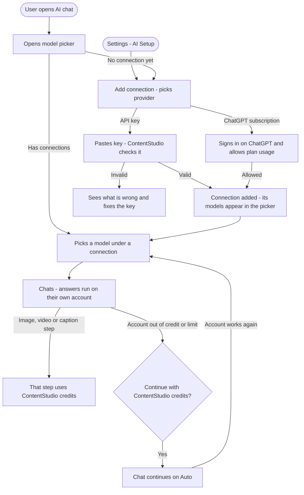
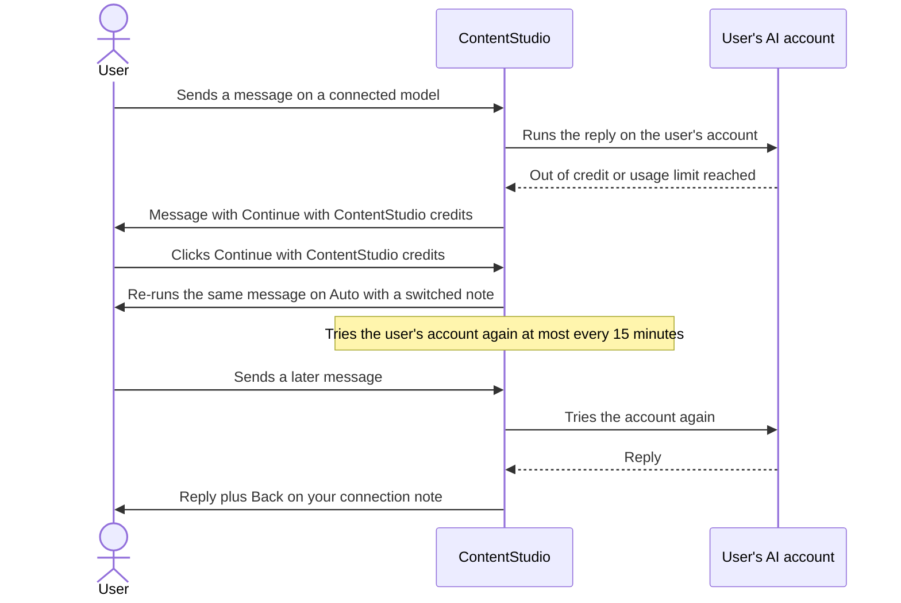
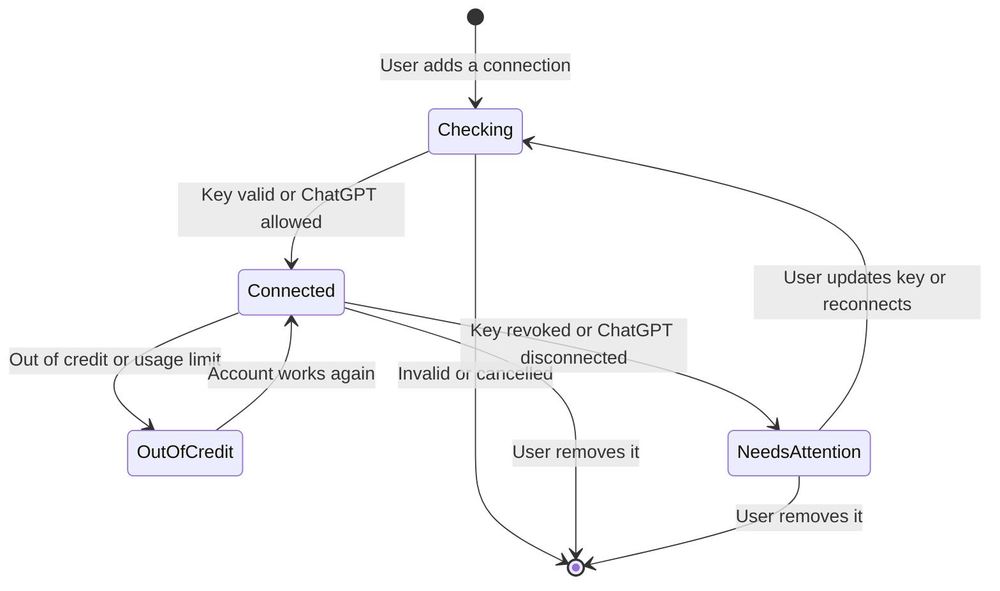

# Bring Your Own AI: Workflow Design

**Feature:** Bring your own AI. Users connect their own AI accounts (API keys or a ChatGPT subscription), and ContentStudio's AI chat runs on them.
**Date:** 2026-10-02
**Mockup canvas:** https://claude.ai/artifact/WgQS5idxU96vK1trQKmUs3
**Inputs:** approved research (`01-research.md`, including PO Direction #2) and these PO decisions:

| Decision | Choice |
|---|---|
| Connection model | **One "AI connections" model for every provider**, following Helpin's "Add connection" pattern |
| v1 providers | OpenAI API key, Anthropic API key, Google Gemini API key, OpenRouter API key, ChatGPT subscription. ChatGPT subscription is enabled only once OpenAI approves ContentStudio. |
| Compatible endpoint | Deferred to v2 |
| Connections per user | Many, each with a name |
| Who it belongs to | **Each user.** Connections are personal, and teammates add their own. Without one, a user stays on ContentStudio credits. |
| When the user's account runs out | **Ask to switch** to ContentStudio credits. Switch back automatically when the account works again. |
| Plan gating | All paid plans |
| Runs on the user's connection | AI chat orchestrator, general assistant, the agents and follow-ups behind chat, post-plan and carousel text, skills |
| Stays on ContentStudio | The caption-writing step, image generation, video generation, safety moderation |
| Mobile in v1 | Full parity in the Flutter AI assistant: model picker and Add connection |
| White-label | Accept in v1. OpenAI's ChatGPT consent screen names ContentStudio. |

**Dependency outside this epic:** OpenAI must approve ContentStudio for "Sign in with ChatGPT" plan usage before the ChatGPT subscription provider can be turned on. The four API-key providers don't depend on it.

---

## 1. Feature Placement

| Where | What the user sees | Purpose |
|---|---|---|
| **Settings > Account Settings > AI Setup** (new page, after Notifications) | The **AI connections** list with name, provider, status, last used and a menu (Rename, Update key or Reconnect, Remove). Also **Add connection**, and **Default model for new chats**. | The main place to manage connections. It's per user, so it sits under Account Settings. |
| **Add connection modal** | Provider, Connection name, API key (or **Continue to ChatGPT** for the subscription) | One form for every provider. It opens from Settings, from the chat picker and in the app. |
| **AI chat > model picker** (new chip in the input bar) | **Auto**, then one section per connection, named with the provider icon, listing its models. At the bottom: **Add connection**. | Pick the model per chat. The picker also shows who pays. |
| **AI chat header credits chip** | "1,240 AI credits left" on Auto. "Using your connection: Claude" on a connected model. | Shows who pays for the current conversation |
| **Flutter AI assistant** | The same picker as a bottom sheet, Add connection as a native form, and the same messages | Full parity with web chat |

**Who sees it:**
- Any paid-plan user who can use AI chat, whatever their role.
- On free or expired accounts, AI Setup shows an upgrade prompt.
- Rollout is behind a feature flag.
- The ChatGPT subscription option shows **Coming soon** and is disabled until OpenAI approval.

**Not affected:**
- AI Studio tools.
- Composer AI captions.
- The AI content library.
- Analytics AI insight pages.
- Image and video generation everywhere.

These stay on ContentStudio models and credits.

---

## 2. Workflow Diagram (Overview)

---

## 3. User Flow (happy path)

### 3a. Add an API key connection from the chat picker
1. The user opens AI chat. The model chip in the input bar reads **Auto**.
2. They open the picker and see:
   - **Auto**: "Picks the best model for each task. Uses your ContentStudio AI credits." It's checked.
   - **Add connection**: "Use your own OpenAI, Claude, Gemini, OpenRouter or ChatGPT account".
3. They click **Add connection**. The **Add connection** modal opens with:
   - The subtitle "Personal connection · Only you". Its info icon reads: "Only you can use this connection. Your teammates won't see it or be charged on it."
   - **Provider**: a dropdown of OpenAI API key, Anthropic API key, Google Gemini API key, OpenRouter API key, and ChatGPT subscription (Coming soon until approved).
   - **Connection name**: prefilled from the provider, for example "Claude". The user can edit it.
   - **API key**: a password-style field. Its info icon explains where to find a key for that provider, with a link to the provider's key page.
4. They pick **Anthropic API key**, paste the key and click **Add connection**.
5. ContentStudio checks the key with a quick test, which takes a few seconds. The button shows a spinner and "Checking key...".
6. The modal closes with the toast "Claude connected. Pick one of its models in the chat to use it."
7. The picker now has a **Claude** section with the Anthropic logo. It lists the models that work with ContentStudio chat, recommended first. ContentStudio selects the recommended model, so the connection takes effect straight away.
8. The chip shows the model with the provider logo, and the header chip reads **Using your connection: Claude**.
9. They chat as usual. Answers, follow-ups, analytics questions, post plans, carousel text and skills run on their Anthropic account, and no text credits are used.
10. If they ask for an image, it's made with ContentStudio's image models on image credits, as today. The chat notes once: "Images, videos and captions use your ContentStudio AI credits."

### 3b. Add the ChatGPT subscription (once OpenAI approves)
1. In Add connection they pick **ChatGPT subscription**. The API key field is replaced by the line "You'll sign in to ChatGPT in a new window. You need ChatGPT Plus or Pro."
2. The button becomes **Continue to ChatGPT**. OpenAI's own pages open:
   - "Continue to ContentStudio": the user chooses their account.
   - "Connect ChatGPT and ContentStudio": **Use your ChatGPT plan** is on. They click **Continue**.
3. The window closes. The connection is added and the plan's models appear in the picker, as in 3a.

### 3c. Manage connections in Settings
1. Settings > Account Settings > **AI Setup** shows:
   - **Default model for new chats**: a dropdown with Auto and every connection's models.
   - The **AI connections** list. Each row shows the provider logo, name, provider type, the key masked to its last 4 characters (or the ChatGPT account email), the status (Connected, Needs attention), last used, and a **...** menu.
   - **Add connection**.
   - The panel "What uses your connection / What still uses ContentStudio credits".
2. The **...** menu offers:
   - **Rename**.
   - **Update key**, for API keys. It re-checks the key.
   - **Reconnect**, for ChatGPT.
   - **Remove**. It confirms with: "Remove Claude? Chats using its models will switch to Auto and use your ContentStudio AI credits."

### 3d. Switch models
- The user picks any model in the picker, or **Auto**. The chip and header chip update.
- The choice becomes their default for new chats on web and mobile.
- Each open conversation keeps its own model.

### 3e. Mobile
- The picker opens as a bottom sheet with the same sections.
- **Add connection** opens the same form natively. Paste works for keys, and the ChatGPT subscription opens OpenAI's sign-in in an in-app browser and returns to the chat.
- Removing and renaming connections, and the default model, are managed on web in Settings > AI Setup.

---

## 4. Alternative Flows

### 4a. Key check fails when adding

| Problem | Message under the API key field |
|---|---|
| Wrong or revoked key | "This key didn't work. Check that you copied the whole key, or create a new one." |
| No billing or credit on the provider account | "This key works, but your OpenAI account has no credit. Add billing on OpenAI, then try again." (The provider name changes.) |
| Key without model access | "This key can't use any models that work with ContentStudio chat. Check the key's permissions on OpenAI." |
| Provider unreachable | "We couldn't reach OpenAI to check your key. Try again in a minute." |

The connection isn't saved until the check passes.

### 4b. Account out of credit, or ChatGPT limit reached, mid-chat

The chat card copy changes by cause:

- **ChatGPT plan limit**
  - Headline: "You've reached your ChatGPT usage limit"
  - Body: "You can keep going on your ContentStudio AI credits, or wait until your ChatGPT usage resets."
  - Actions: **Continue with ContentStudio credits**, **Manage ChatGPT usage**
- **API account out of credit**
  - Headline: "Your Anthropic account is out of credit"
  - Body: "Add credit on Anthropic, or keep going on your ContentStudio AI credits."
  - Actions: **Continue with ContentStudio credits**, **Add credit on Anthropic**
- **Rate limited** (too many requests in a short time)
  - No card. The chat retries once by itself. If that fails, it shows: "Your Anthropic account is busy right now. Try again in a moment, or continue on ContentStudio credits."

If ContentStudio credits are also used up, the existing "not enough credits" message shows.

### 4c. Connection stops working (key revoked, ChatGPT disconnected)
- The next message on that connection fails with an authorization error. The connection is marked **Needs attention** in AI Setup and in the picker, where its section shows a warning and **Update key** or **Reconnect**.
- The chat shows:
  - Headline: "Your Claude connection stopped working"
  - Body: "Update the key to keep using it, or continue on your ContentStudio AI credits."
  - Actions: **Update key** (or **Reconnect**), **Continue with ContentStudio credits**
- OpenAI doesn't tell ContentStudio when someone disconnects inside ChatGPT, so this is found on the next request.

### 4d. ChatGPT subscription not eligible (free ChatGPT account)
- "Your ChatGPT account doesn't include plan sharing. You need ChatGPT Plus or Pro to use it in ContentStudio." Nothing is saved.

### 4e. Cancel or close the ChatGPT window, or the popup is blocked
- Cancel or close: the toast "ChatGPT not connected." Nothing changes.
- Blocked: "Your browser blocked the ChatGPT window. Allow pop-ups for ContentStudio and try again."

### 4f. ContentStudio plan expires or drops to free
- Connections are kept but not used, and chat follows the free experience.
- AI Setup shows an upgrade prompt.
- Connections resume when the user upgrades.

### 4g. Model no longer offered
- If a saved model disappears from the provider's list, chat uses that connection's recommended model.
- A one-time note says: "Claude Sonnet 4.6 is no longer available on your connection, so we switched you to Claude Sonnet 5."

### 4h. Duplicate key
- Adding a key that's already connected shows: "You've already connected this key as 'Claude'." Nothing new is added.

### 4i. Teammates
- Connections are personal. A teammate never sees or uses someone else's connection. They see Auto and Add connection.

---

## 5. Connection States

---

## 6. Key Design Decisions

### D1. The model picker decides who pays (decided)
- Auto means ContentStudio credits. A model under a connection means that connection.
- There's no separate on/off toggle, so the picker always shows the funding source before sending.

### D2. Which models appear under a connection?
- **Option A (recommended):** models from the provider's own list, **filtered to those that support tool calling and that we've marked compatible**, with the recommended one first.
  - OpenRouter returns hundreds of models, so its section gets a search box.
  - Chat creates posts and reads analytics through tools, and a model without tool support would fail at that.
- **Option B:** every model the provider returns. This risks broken chats on models that can't use tools.

### D3. What runs on the connection inside a chat turn (decided)
- **On the connection:**
  - orchestrator
  - general assistant
  - planning and analytics agents
  - follow-ups
  - post-plan and carousel text
  - skills
- **On ContentStudio:**
  - the caption-writing step
  - images and video
  - safety moderation

### D4. Default model right after adding a connection
- **Recommended:** auto-select the connection's recommended model, so adding it has a visible effect. Notion does this.

### D5. Quality across providers
- Chat is tuned for Claude today. Anthropic keys are lowest risk, and GPT and Gemini need an eval pass before launch.
- OpenRouter models we haven't tested can show a small "Not tested with ContentStudio" label.
- **Recommended:** ship with a tested recommended model per provider, and label anything else as untested.

### D6. Key security (decided by default, not negotiable)
- Keys are encrypted at rest and never shown again (masked to the last 4 characters).
- They're never sent to the browser or app after saving.
- They're kept out of logs, traces and analytics events.
- Removing a connection deletes the key and, for ChatGPT, revokes access with OpenAI.

### D7. Mobile Add connection scope
- **Option A (recommended, follows the PO's "full parity" call):** the full Add connection form in the app, for API keys and ChatGPT.
- **Option B:** in the app, Add connection opens a "Add connections on the web in Settings > AI Setup" note. This is less Flutter work, but breaks parity.

---

## 7. Integration with Existing Features

| Area | Impact |
|---|---|
| **AI chat (web)** | New model picker, header chip states, and the out-of-credit, needs-attention and switched messages in the conversation |
| **AI chat engine (ai-agents)** | Each turn can run on the user's provider, key and model, instead of the shared defaults. Caption, image, video and moderation steps keep ContentStudio models. |
| **AI credits** | Turns on a connection use no text credits. Caption, image and video steps still deduct. The "minimum 5 text credits to start a chat" check doesn't apply on a connection. |
| **Skills** | Run on whichever model the chat uses |
| **Settings** | New Account Settings page, AI Setup |
| **Flutter AI assistant** | Picker, Add connection form, header chip, and the new messages |
| **AI Studio, Composer AI, content library, analytics insight pages** | No change in v1 |
| **Public API, CLI, MCP** | No change. External callers don't use a user's connections. |
| **White-label** | The ChatGPT consent screen names ContentStudio (accepted). API keys are unaffected. |
| **Privacy and legal** | The privacy policy and DPA mention that chats can be processed under the user's own AI provider account and terms |

---

## 8. Trackable Actions (Usermaven candidates)

No AI chat model or connection events exist yet (checked `userMaven.track(` in `contentstudio-frontend/src/`).

| Event | Trigger | Why |
|---|---|---|
| `ai_connection_add_started` | Add connection modal opened (payload: `entry_point` settings, chat_picker or mobile_picker) | Funnel top, and which entry point works |
| `ai_connection_added` | Connection saved (payload: `provider`, `entry_point`) | Adoption by provider, the core metric |
| `ai_connection_add_failed` | Key check failed or ChatGPT cancelled or not eligible (payload: `provider`, `reason`) | Where people drop |
| `ai_connection_removed` | User removes a connection (payload: `provider`) | Churn |
| `ai_chat_model_changed` | User picks a model (payload: `from_model`, `to_model`, `funding` credits or connection, `provider`) | Usage mix, and switching back to Auto |
| `ai_connection_limit_reached` | Out-of-credit or limit card shown (payload: `provider`, `cause`) | How often users' accounts run dry |
| `ai_connection_fallback_accepted` | User clicks Continue with ContentStudio credits (payload: `provider`) | Credit revenue retained |
| `ai_connection_needs_attention` | Connection marked Needs attention (server-side, payload: `provider`) | Revoked keys and silent ChatGPT disconnects |

---

## 9. Scope Recommendation

### v1 (this epic)
- AI connections:
  - The Add connection modal with OpenAI, Anthropic, Gemini and OpenRouter keys, and ChatGPT subscription behind OpenAI approval.
  - Many named connections per user.
  - Key check on add.
  - Rename, update key, reconnect, remove.
- AI Setup page with the default model for new chats.
- Chat model picker grouped by connection, with Add connection inside it.
- Per-request routing of chat to the user's provider, key and model. Captions, images, video and moderation stay ours.
- Credit metering split.
- Out-of-credit and limit handling with prompted fallback and automatic switch-back. Needs-attention handling.
- Flutter parity: picker, Add connection, messages.
- Feature flag. Usermaven events.
- A `[Design]` story.

### v2 and later
- Compatible endpoint (support-provisioned, Helpin-style).
- Composer captions and AI Studio text tools on the user's connection.
- Workspace admin control to allow or block member connections, plus an audit log.
- Shared workspace connections, where one key is used by the team.
- Picking specific ContentStudio models (on credits) in an "Other models" group.
