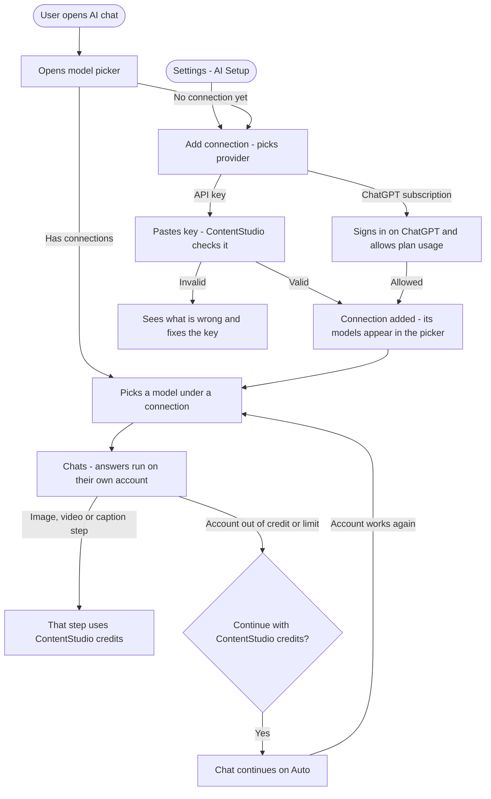

# **PRD: Bring Your Own AI**

**Author:** Ghulam Jaffar
**Last Updated:** 2026-10-02
**Status:** In Review
**Target Release:** Q4 2026. The API-key providers ship first. The ChatGPT subscription provider ships once OpenAI approves ContentStudio.

---

## **1\. Overview**

Bring Your Own AI lets each ContentStudio user connect their own AI accounts, so ContentStudio's AI chat runs on them instead of ContentStudio AI credits. Supported connections:
- OpenAI, Anthropic (Claude), Google Gemini and OpenRouter API keys
- a ChatGPT Plus or Pro subscription

Users add connections from a single **Add connection** form, in Settings or straight from the chat. They then pick any model from their connections in a new chat model picker, and the picked model decides who pays. Caption writing, image generation and video generation keep running on ContentStudio's models and credits.

Notion launched "use your ChatGPT plan" on 29 Sep 2026. No social media management tool lets users power its AI with their own account today, apart from Publer's bare OpenAI key field. This feature makes ContentStudio the first social media tool with a full multi-provider version, and it removes the "paying twice for AI" objection for users who already pay for ChatGPT or an AI provider.

---

## **2\. Problem Statement**

**What problem are we solving?**

ContentStudio's AI chat (the orchestrator, general assistant, analytics, post-plan and carousel agents, and skills) only runs on ContentStudio's own models and is metered by plan AI credits. Text use is charged per word, and a chat needs at least 5 text credits to start. Three problems follow:

- **Users who already pay for AI pay twice.** Someone with ChatGPT Plus or an Anthropic API account has to spend ContentStudio credits for the same kind of work.
- **Heavy chat users hit credit limits.** They either buy more credits or stop using chat mid-task.
- **Users can't choose their model.** Chat has no text model picker today. The existing `ModelProviderSelect` covers image and video models only.

**Who has this problem?**

- **Power users of AI chat:** agencies and in-house marketers who plan, draft and analyse through chat daily and exhaust their monthly credits.
- **Users already paying for ChatGPT Plus or Pro, or an AI provider's API.** This is a large and growing group. OpenAI's own launch partners report demand for "use my plan".
- **Teams with AI governance needs:** they want AI processing on their own provider account and terms.

**What happens if we don't solve it?**

- **Competitive gap:** Notion has set user expectations, and Publer already offers BYOK. More apps are joining OpenAI's program.
- **Credit friction keeps capping chat engagement,** which is ContentStudio's main AI differentiator.
- **We miss being the first social media tool** with ChatGPT-plan-powered AI. No competitor is an OpenAI partner today.

---

## **3\. Goals & Success Metrics**

| Goal | Metric | Target | How We'll Measure |
| ----- | ----- | ----- | ----- |
| Primary: adoption | % of weekly active AI chat users with at least one connection | 15% within 90 days of launch | `ai_connection_added`, plus active connections in the DB |
| Primary: engagement | AI chat messages per active chat user, for connected vs unconnected users | +30% for connected users | Chat message counts by funding source |
| Secondary: setup success | Add connection success rate (started to added) | ≥ 70% | `ai_connection_add_started` → `ai_connection_added` |
| Secondary: ChatGPT reach | Share of new connections that are ChatGPT subscription, once enabled | Track (no target until enabled) | `ai_connection_added.provider` |
| Guard rail: AI credit revenue | Credit top-up and add-on revenue from AI | No more than a 10% decline vs the 90-day pre-launch baseline | Billing data |
| Guard rail: chat quality | Thumbs-down rate on connected-model replies vs Auto | No more than 1.2× the Auto rate | Chat feedback events |
| Guard rail: reliability | Chat turns failing on a connection, excluding out-of-credit | < 2% | Server logs by error code |

### **3.1 Analytics Events (Usermaven)**

None of these exist yet. A search of `userMaven.track(` in `contentstudio-frontend/src/` found no AI chat model or connection events. All are FE-dispatched except where noted.

| Event Name | Trigger | Payload | What we measure with it |
| ----- | ----- | ----- | ----- |
| `ai_connection_add_started` | FE: the Add connection form opens | `{ entry_point: 'settings' \| 'chat_picker' \| 'mobile_picker' }` | Funnel top, and which entry point drives connections |
| `ai_connection_added` | FE: a connection is saved (key check passed, or ChatGPT allowed) | `{ provider: 'openai' \| 'anthropic' \| 'gemini' \| 'openrouter' \| 'chatgpt', entry_point }` | Adoption by provider and entry point |
| `ai_connection_add_failed` | FE: the key check fails, or ChatGPT is cancelled or not eligible | `{ provider, reason: 'invalid_key' \| 'no_credit' \| 'no_model_access' \| 'provider_unreachable' \| 'duplicate' \| 'cancelled' \| 'not_eligible' }` | Where and why setup fails |
| `ai_connection_removed` | FE: the user confirms Remove | `{ provider }` | Connection churn |
| `ai_chat_model_changed` | FE: the user picks a model in the chat picker | `{ from_model, to_model, funding: 'credits' \| 'connection', provider }` | Model mix, and how often users go back to Auto |
| `ai_connection_limit_reached` | FE: the out-of-credit or usage-limit card is shown | `{ provider, cause: 'out_of_credit' \| 'plan_limit' }` | How often users' own accounts run dry |
| `ai_connection_fallback_accepted` | FE: the user clicks Continue with ContentStudio credits | `{ provider, cause: 'out_of_credit' \| 'plan_limit' \| 'needs_attention' }` | Credit usage kept at the fallback point |
| `ai_connection_needs_attention` | **BE:** a connection is marked Needs attention after an authorization failure | `{ provider }` | Revoked keys and silent ChatGPT disconnects |

No payload carries keys, emails or message content.

---

## **4\. Target Users**

**Primary Persona:**
**Maya, agency content lead.** She runs AI chat all day for post plans, carousel copy and "how did last week perform" questions across client workspaces. She already pays for ChatGPT Plus or an Anthropic API account for other work. She's comfortable copying an API key if told where it is, but isn't a developer. She cares about not running out of credits mid-week and about using the model she trusts.

**Secondary Persona:**
**Daniel, in-house marketing manager at a mid-size company.** IT has given him a company OpenAI or Anthropic API key, with a policy that AI work should go through it. He cares about using the approved account and knowing which account a chat ran on.

**Non-Users (explicitly out of scope):**
- Developers who want to point ContentStudio at a self-hosted or custom endpoint. Compatible endpoints are v2.
- Workspace owners who want one shared key for the whole team. Connections are personal in v1.
- Users of the public API, CLI or MCP. They drive ContentStudio from outside and don't use connections.
- Free-plan users (trial users are included).

---

## **5\. User Stories / Jobs to Be Done**

| ID | As a... | I want to... | So that... | Priority |
| ----- | ----- | ----- | ----- | ----- |
| US-1 | Chat user with an AI provider API key | add my OpenAI, Anthropic, Gemini or OpenRouter key as a connection | AI chat runs on my account instead of my ContentStudio credits | Must Have |
| US-2 | Chat user | add a connection straight from the chat model picker | I don't have to leave the conversation to set it up | Must Have |
| US-3 | Chat user | pick any model from my connections, or Auto, in the chat | I use the model I trust and can see who pays before I send | Must Have |
| US-4 | Chat user | be told clearly when my key is wrong or my account has no credit | I can fix it myself without contacting support | Must Have |
| US-5 | Chat user | be asked before ContentStudio credits are used when my account runs out | I'm never charged credits by surprise | Must Have |
| US-6 | Chat user | manage my connections (rename, update key, remove) and set a default model | I stay in control of my keys and defaults | Must Have |
| US-7 | Chat user | know that captions, images and videos still use ContentStudio credits | I understand my bill | Must Have |
| US-8 | Mobile user | pick models and add a connection in the Flutter app | I get the same chat experience on my phone | Must Have |
| US-9 | ChatGPT Plus or Pro subscriber | connect my ChatGPT plan with a sign-in instead of a key | AI chat uses the plan I already pay for | Should Have (needs OpenAI approval) |
| US-10 | Chat user | have chat switch back to my connection automatically when it works again | I don't have to remember to switch back | Should Have |
| US-11 | Chat user | keep several connections with names I choose | I can switch between Claude and GPT, or work and personal keys | Should Have |
| US-12 | OpenRouter user | search a long model list | I can find the model I want quickly | Nice to Have |

---

## **6\. Requirements**

### **6.1 Must Have (P0)**

**Connections**
- **Add connection form**, opened from Settings > Account Settings > AI Setup, from the chat model picker (web), and from the Flutter AI assistant picker.
  - Fields: Provider, Connection name (prefilled from the provider, editable) and API key.
  - Subtitle "Personal connection · Only you".
- **Providers in v1:**
  - OpenAI API key
  - Anthropic API key
  - Google Gemini API key
  - OpenRouter API key
  - ChatGPT subscription, shown as **Coming soon** and disabled until OpenAI approval
- **Key check before saving.** A test call to the provider. Failures show a specific, plain-language message: invalid key, no credit or billing, no compatible models, provider unreachable, or duplicate key. Nothing is saved on failure.
- **Many named connections per user.** They are personal: never visible to or usable by teammates.
- **Key security:**
  - encrypted at rest
  - never returned to the browser or app after saving (shown masked to the last 4 characters)
  - excluded from logs, traces, analytics and event payloads
  - deleted on Remove
- **AI Setup page** in Account Settings:
  - an empty state
  - a connections table (logo, name, provider type, masked key or account email, status, last used, a menu with Rename, Update key or Reconnect, Remove)
  - **Add connection**
  - **Default model for new chats**
  - the "What uses your connection / What still uses ContentStudio credits" panel

**Chat**
- **Model picker** in the AI chat input bar (web) and the Flutter AI assistant:
  - **Auto** (ContentStudio credits)
  - one section per connection listing its models, recommended first
  - **Add connection** at the bottom
- The chosen model is remembered per user as the default for new chats on web and mobile. Each open conversation keeps its own model.
- **Who pays follows the model.** Auto uses ContentStudio credits. A connection's model uses that connection. The header chip shows "Using your connection: [name]" or the credit balance.
- **Runs on the connection:**
  - the chat orchestrator
  - the general assistant
  - planning and analytics agents
  - follow-up suggestions
  - post-plan and carousel text
  - skills
- **Stays on ContentStudio models and credits:**
  - the caption-writing step
  - image generation
  - video generation
  - safety moderation
- **Credits:**
  - Turns on a connection deduct no text credits.
  - Caption, image and video steps inside those turns deduct as today.
  - The "minimum 5 text credits to start a chat" check doesn't apply when a connection's model is selected.
- **Image and video model pickers** (in chat and AI tools) show "Uses your ContentStudio AI credits" while a connection's model is selected. This stops users expecting their own account to pay for models like GPT Image, which ContentStudio serves through its own image provider.
- **Only models that support tool calling** and that ContentStudio has marked compatible are listed under a connection.
- **After adding a connection,** its recommended model is selected automatically.

**Failures**
- **Out of credit, or ChatGPT usage limit:**
  - The chat shows a card with **Continue with ContentStudio credits** and a link to the provider (Add credit on [provider], or Manage ChatGPT usage).
  - Continuing re-runs the same message on Auto.
  - It never switches silently.
- **Authorization failure** (key revoked, ChatGPT disconnected): the connection is marked **Needs attention** in Settings and the picker, and a chat card offers **Update key** or **Reconnect**, or Continue with ContentStudio credits.
- **Rate limited:** one automatic retry, then a short message. No card.
- **ContentStudio plan expires or drops to free:** connections are kept but not used. AI Setup shows an upgrade prompt.

**Rollout**
- Behind a feature flag.
- Available on all paid plans and during the trial.
- Usermaven events per §3.1.

### **6.2 Should Have (P1)**

- **ChatGPT subscription provider**, live once OpenAI approves ContentStudio:
  - sign in on OpenAI's pages (popup on web, in-app browser on mobile)
  - a plan-usage consent
  - models discovered from the plan
  - "not eligible" handling for free ChatGPT accounts
  - revocation with OpenAI on Remove
  - Reconnect when OpenAI rejects the stored sign-in
- **Automatic switch-back:** after a fallback, the user's connection is retried at most once every 15 minutes on new messages, with a "Back on your connection" note when it works.
- **Model removed by provider:** fall back to that connection's recommended model, with a one-time note.
- **Mobile parity:** the full Add connection form in the Flutter app. Rename, remove and default model stay on web.

### **6.3 Nice to Have (P2)**

- A search box in the OpenRouter section of the picker.
- A "Not tested with ContentStudio" label on compatible but untested models.
- "Last used" on each connection.

### **6.4 Explicitly Out of Scope**

- Compatible or custom endpoints (Azure OpenAI, self-hosted). Planned for v2 as support-provisioned endpoints.
- Shared workspace or team connections, and admin allow or block controls, plus an audit log.
- Running Composer AI captions, AI Studio tools, the AI content library or analytics insight pages on a connection.
- Using a connection for image or video generation.
- Picking specific ContentStudio models (on credits) in the picker. Auto only in v1.
- Claude or Gemini **subscriptions**. Anthropic forbids subscription sign-in in third-party apps, and Google has no program. API keys only.
- Exposing connections or model choice through the public API, CLI or MCP.
- Free-plan access.

---

## **7\. User Flow (High Level)**

1. The user opens AI chat and clicks the model chip, which shows **Auto**.
2. They click **Add connection**, choose a provider, name it, and paste a key. For ChatGPT, they sign in on OpenAI's pages and allow plan usage.
3. ContentStudio checks the key and saves the connection. The connection's models appear in the picker, and the recommended one is selected.
4. The user chats as usual. Chat runs on their account, and the header shows "Using your connection: [name]".
5. Captions, images and videos in that chat still use ContentStudio credits.
6. If their account runs out or stops working, the chat asks whether to continue on ContentStudio credits, and switches back later when the account works again.
7. They manage connections and their default model in Settings > Account Settings > AI Setup.

The workflow doc also has the out-of-credit sequence diagram and the connection state diagram.

---

## **8\. Business Rules & Constraints**

| Rule ID | Rule | Rationale |
| ----- | ----- | ----- |
| BR-1 | Connections are personal. Only the user who added one can see, use or manage it. | Usage and billing follow the person who owns the account. Matches Notion. |
| BR-2 | The selected model decides who pays. Auto uses ContentStudio credits. A connection's model uses that connection. | One clear, visible switch. No hidden toggles. |
| BR-3 | Caption writing, image generation, video generation and safety moderation always use ContentStudio models and credits, even on a connection. | These run on providers ContentStudio pays for (fal, Veo, BytePlus). Moderation must be consistent. |
| BR-4 | Chat turns on a connection deduct zero text credits. Caption, image and video steps deduct normally. | Users shouldn't pay twice for text. |
| BR-5 | ContentStudio never switches a user from their connection to ContentStudio credits without an explicit click. | No surprise credit spend. OpenAI's rules and Notion follow the same principle. |
| BR-6 | A connection is saved only after a successful key check (or ChatGPT consent). | Avoids broken connections in the picker. |
| BR-7 | A key is never displayed in full after saving, never sent back to the browser or app, and never written to logs, traces, analytics or events. | Security. A leaked key costs the user money. |
| BR-8 | The same key can't be added twice by the same user. | Avoids confusing duplicates. |
| BR-9 | Only models that support tool calling and are marked compatible appear under a connection. | Chat creates posts and reads analytics through tools. Other models would fail. |
| BR-10 | Available on all paid plans and during the trial. On downgrade to free or expiry, connections are kept but inactive. | PO decision: all paid plans plus trial. |
| BR-11 | After a fallback, the connection is retried at most once every 15 minutes. | Avoids hammering a provider that's out of credit. |
| BR-12 | Removing a connection deletes its key. For ChatGPT it also revokes access with OpenAI. Conversations using it switch to Auto. | Clean removal. OpenAI's sign-out doesn't revoke on its own. |
| BR-13 | ChatGPT subscription stays disabled ("Coming soon") until OpenAI issues ContentStudio a client ID for plan usage. | OpenAI only offers plan usage to approved commercial partners. |

---

## **9\. Open Questions**

| Question | Options | Owner | Due Date | Decision |
| ----- | ----- | ----- | ----- | ----- |
| When will OpenAI approve ContentStudio for "Sign in with ChatGPT" plan usage, and does plan usage support tool calling? | Submit the interest form now. Ask about tool calling, models, rate limits, data terms and white-label callbacks. | CEO / Product | 2026-10-16 (form submitted) | Pending |
| How does Helpin offer ChatGPT subscription ("one-time code")? Partner approval or another route? | Ask the Helpin team | Product | 2026-10-09 | Pending |
| Which model is "recommended" per provider, and has each passed our chat quality check? | Claude Sonnet 5 for Anthropic. GPT-5 for OpenAI. Gemini model TBD. OpenRouter defaults to a tested Claude or GPT model. | AI team | Before launch | Pending |
| Do trial users get the feature? | Yes / No | PO | 2026-10-02 | **Yes.** Trial users get it too. |
| Privacy policy and DPA wording for chats processed under the user's own provider account | Legal review | Legal | Before launch | Pending |
| Mark OpenRouter models we haven't tested as "Not tested with ContentStudio", or hide them? | Label / Hide | PO | During design | Pending |

---

## **10\. Risks & Mitigations**

| Risk | Likelihood | Impact | Mitigation |
| ----- | ----- | ----- | ----- |
| OpenAI doesn't approve ContentStudio, or approval is slow | Medium | Medium | API-key providers ship independently. The ChatGPT option stays "Coming soon". Don't market "use your ChatGPT plan" until it's live. |
| ChatGPT plan usage doesn't support tool calling | Medium | High (for ChatGPT only) | Confirm with OpenAI before building it. If tools are unsupported, don't ship the ChatGPT provider, since chat would break. |
| Chat quality drops on non-Claude models (prompts tuned for Claude) | High | Medium | Run a quality check per recommended model. Track the thumbs-down guard rail. Recommend Claude for Anthropic users. Label untested models. |
| Leaked or logged keys | Low | High | Encrypt at rest. Exclude keys from traces (Langfuse), the Redis session store, Kafka events and logs. Security review before launch. |
| AI credit revenue cannibalized | Medium | Medium | Image, video and captions stay on credits. Watch the revenue guard rail. Plan gating can be tightened later. |
| Users surprised by charges on their own provider account | Medium | Medium | Clear copy in the form and Settings. The header chip shows who pays. Links to provider usage pages. |
| ChatGPT users disconnect inside ChatGPT and we don't notice | High | Low | Mark Needs attention on the first auth failure and offer Reconnect. |
| OpenRouter models without reliable tool use break chats | Medium | Medium | List only tool-capable, compatible models. Offer the "Not tested" label or hide. |
| Provider terms change suddenly (e.g. OpenAI cutting Cursor's access) | Low | Medium | Multi-provider by design, so no single dependency. Auto always remains. |
| White-label clients see "ContentStudio" on OpenAI's consent screen | Medium | Low | Accepted for v1. Ask OpenAI about per-domain branding. |

---

## **11\. Dependencies**

**Internal:**
- **AI chat engine (ai-agents):**
  - The model factory (`contentstudio-ai-agents/src/utils/model_registry.py`, `_create_model` / `resolve_model`) needs a per-request API key, since it takes keys from env today.
  - The chat Team (`src/orchestration/team.py` `get_content_team()`) is a process-wide singleton and must accept per-request model overrides.
  - The members (`src/orchestration/agents.py` `create_member_agents()`) need the same.
  - Credit pre-checks (`src/utils/credit_validation/validation.py`, `src/api/routers/streaming_router.py`) must skip text checks for connection turns.
- **Backend:**
  - `AIController::processAgnoAgent` (`contentstudio-backend/app/Http/Controllers/AI/AIController.php`) handles the 5-credit minimum and passes the connection and model.
  - `AiChatHelper::buildWorkflowInputs` / `deductAiCredits` and `ChatUsageEventHandler` (Kafka backstop) zero out text credits for connection turns.
  - The cancel billing path does the same.
  - A new encrypted connections store follows the `CanvaIntegration` pattern (`SocialHelper::encryptToken`, `CanvaRepo::markInvalid`).
  - The plan feature key is added via migration, following the `canva_integration` pattern.
  - The `feature.flag` middleware handles rollout.
- **Frontend:**
  - The AI chat module (`contentstudio-frontend/src/modules/AI-tools/`, `ChatHeader.vue`, `AiCreditsChip.vue`, the stream reducers for new error codes).
  - The Settings sidebar and routes (`src/modules/setting/`).
  - `useFeatures().canAccess()` for plan gating.
- **Flutter:**
  - `lib/features/ai_assistant/` (picker, credits pill, `ai_stream_event_mapper.dart` for new error codes).
  - A native Add connection screen.
- **Design:** the AI Setup page, Add connection form, chat picker states, chat cards and Flutter screens.

**External:**
- **OpenAI "Sign in with ChatGPT"** commercial approval and client ID, for the ChatGPT provider only.
- **Provider APIs** for key checks and model lists: OpenAI, Anthropic, Google Gemini, OpenRouter.

**Blockers:**
- None for the API-key providers.
- OpenAI approval for the ChatGPT subscription provider.

---

## **12\. Appendix**

- **Workflow and functional detail:** `02-workflow.md` (flows, alternative flows, state diagram, design decisions)
- **Research:** `01-research.md` (OpenAI program details, the Notion deep dive, competitor table, codebase analysis, PO directions)
- **Mockups:** https://claude.ai/artifact/WgQS5idxU96vK1trQKmUs3 (15 screens: Add connection, picker, failures, AI Setup, Flutter)
- **Reference screenshots:** `references/notion-0*.png` (Notion launch video) and `references/helpin-0*.png` (Helpin Add connection)
- **External:**
  - developers.openai.com/siwc
  - notion.com/help/use-your-chatgpt-plan-with-notion-agent
  - publer.com/help/en/article/how-to-connect-my-openai-account-1dmawuf

---

## **Changelog**

| Date | Author | Changes |
| ----- | ----- | ----- |
| 2026-10-02 | Ghulam Jaffar | Initial draft from approved research and workflow |
| 2026-10-02 | Ghulam Jaffar | Trial users included. Image and video model pickers note that they use ContentStudio credits. Connections cover text and processing only. |
