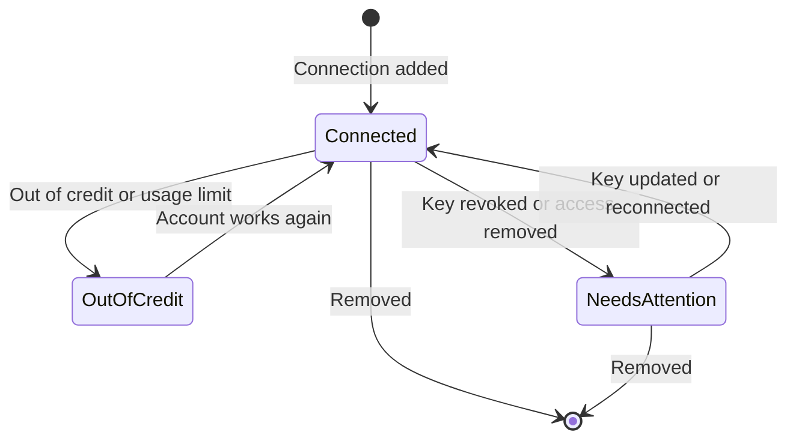
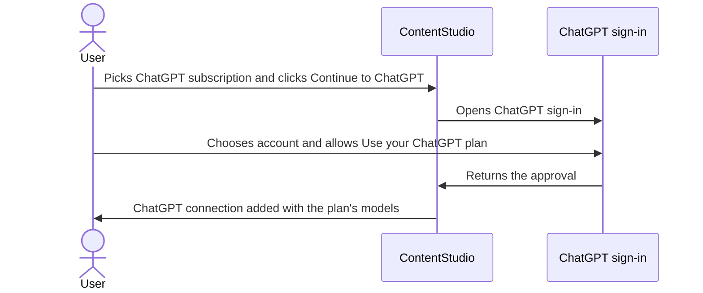
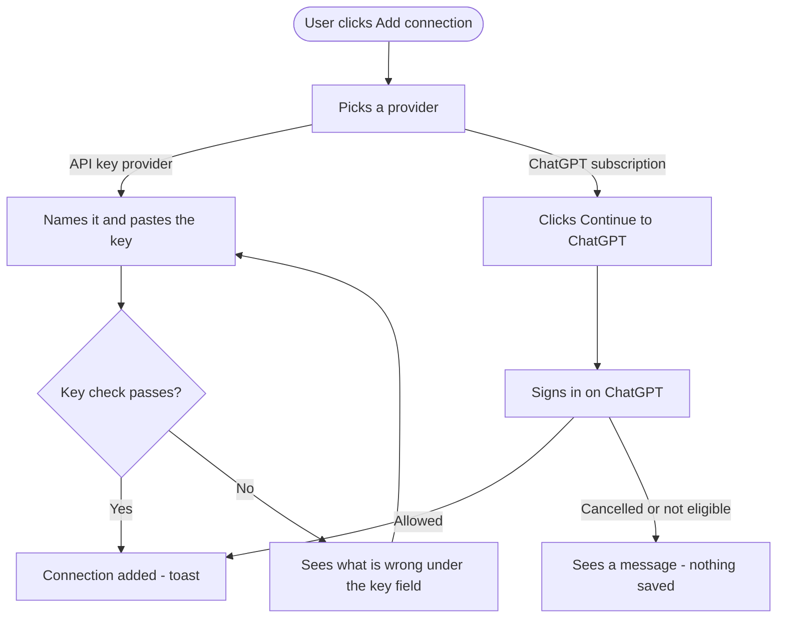
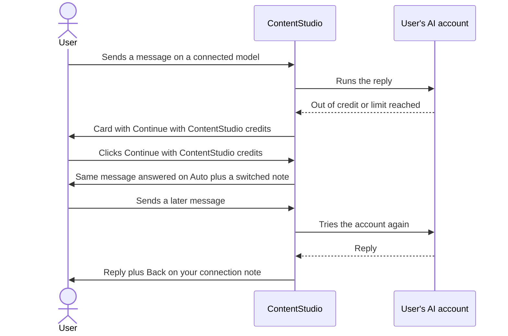

# Bring Your Own AI: Epic and Stories

## Epic: Bring your own AI account to AI Chat

Bring Your Own AI lets every ContentStudio user connect the AI accounts they already pay for, and have AI Chat run on them instead of ContentStudio AI credits. Supported connections:

- An **OpenAI**, **Anthropic (Claude)**, **Google Gemini** or **OpenRouter** API key.
- A **ChatGPT Plus or Pro subscription**, once OpenAI approves ContentStudio for "Sign in with ChatGPT".

Users add connections from one **Add connection** form, in Settings > Account Settings > AI Setup or straight from the chat. Connections are personal, and a user can have several, each with a name.

A new model picker in AI Chat lists **Auto** (ContentStudio credits) and the models under each connection. The model the user picks decides who pays.

**What runs where:**

| Runs on the user's connection (text and processing) | Stays on ContentStudio models and credits |
|---|---|
| Chat answers and follow-ups, planning and analytics questions, post-plan and carousel text, skills | Caption writing, image generation, video generation, safety moderation |

**When the user's account runs out or stops working,** chat asks before using ContentStudio credits, and switches back by itself when the account works again. The Flutter AI assistant gets the same picker, Add connection form and messages.

**Goals**
- 15% of weekly active AI Chat users have at least one connection within 90 days.
- Connected users send 30% more chat messages than unconnected users.
- AI credit revenue falls by no more than 10%, and the reply quality on connected models stays within 1.2× Auto's thumbs-down rate.

**Release rules**
- Available on all paid plans and during the trial. Rollout is behind a feature flag.
- The ChatGPT subscription option shows **Coming soon** until OpenAI approves ContentStudio. The four API-key providers don't wait for it.

**Design canvas:** https://claude.ai/artifact/WgQS5idxU96vK1trQKmUs3

---

## Stories

1. [Research] Define how AI Chat runs on a user's own AI connection
2. [Design] Design Bring Your Own AI for AI Setup, AI Chat and the mobile app
3. [BE] Add, check and manage personal AI connections
4. [BE] List each connection's chat models and remember the user's model choice
5. [BE] Run AI Chat on the model and connection the user picked
6. [BE] Stop charging text credits for AI Chat replies on a user's connection
7. [BE] Connect a ChatGPT subscription with Sign in with ChatGPT
8. [FE] Build the AI Setup page in Account Settings
9. [FE] Build the Add connection form
10. [FE] Add a model picker to AI Chat
11. [FE] Show connection problems and the credits fallback in AI Chat
12. [Flutter] Add the model picker, Add connection and connection messages to the AI assistant

---

## [Research] Define how AI Chat runs on a user's own AI connection

### Description:
As the engineering team, we want an agreed technical approach for running AI Chat on a user's own AI account before we build it. That way the stories in this epic can be built without rework, and users' keys are safe from day one.

The product requirements are settled, and this ticket settles the how. The output is a short written proposal that the backend, AI and frontend leads agree on, reviewed with the PO before the BE stories start.

### Workflow:
1. The developers read the requirements in this epic and the design canvas.
2. They look at how AI Chat picks its models and pays for replies today.
3. They answer the questions below in a written proposal.
4. They review it with the PO and update any story whose requirement can't be met as written.

**Questions the proposal must answer:**

**Running chat on a connection**
- How does a single chat reply run on the user's chosen provider, key and model, when today every reply uses ContentStudio's shared models and keys?
- Which parts of a reply move to the connection (orchestrating, the general assistant, planning and analytics agents, follow-ups, post-plan and carousel text, skills), and how do caption writing, images, video and safety moderation stay on ContentStudio?
- Does a reply on a connection use one model for everything, or does it need a smaller model for some steps? If so, how is that picked from the same connection?
- How do OpenAI, Anthropic, Gemini and OpenRouter differ in tool calling and settings, and what has to change so chat behaves the same on each?

**Keys and safety**
- How are keys stored so they're encrypted, personal, and never sent back to the browser or app?
- How do we make sure a key never ends up in logs, traces, the chat session store, events or analytics?
- How is a key checked when it's added, and what does each provider return for a wrong key, no credit, no model access or a rate limit?

**Models**
- Where does each connection's model list come from, and how often is it refreshed?
- How do we decide which models support tool calling and work with ContentStudio chat, and which one is recommended per provider?
- What quality check does each recommended model pass before launch, given chat prompts are tuned for Claude today?

**Credits**
- Every place text credits are charged for chat today (during the reply, the usage backstop, cancelled replies): how is each one set to zero for connection replies while captions, images and video still charge?

**ChatGPT subscription**
- Once OpenAI approves us: how do sign-in, token refresh, revocation on remove and "not eligible" accounts work, on web and in the Flutter app?
- Does ChatGPT plan usage support tool calling? If not, the ChatGPT provider can't ship.

### Acceptance criteria:
- [ ] A written proposal answers every question above
- [ ] The proposal names a recommended model per provider and the quality check each passed
- [ ] The proposal lists every place a key could leak (logs, traces, session store, events, analytics) and how each is closed
- [ ] The proposal lists every place chat charges text credits and how each is zeroed for connection replies
- [ ] The proposal lists any requirement in this epic that can't be met as written, with an alternative
- [ ] The PO and the backend, AI and frontend leads have reviewed and agreed the proposal
- [ ] Any story changes that come out of it are made before the BE stories start

### Mock-ups:
N/A for research. Product behaviour is on the design canvas: https://claude.ai/artifact/WgQS5idxU96vK1trQKmUs3

### Impact on existing data:
None. This ticket produces a proposal only.

### Impact on other products:
Covers AI Chat on the web and in the Flutter app. It should note anything that would later matter for Composer AI, AI Studio and the AI content library, without designing for them.

### Dependencies:
None. This ticket blocks:
- **[BE] Add, check and manage personal AI connections**
- **[BE] List each connection's chat models and remember the user's model choice**
- **[BE] Run AI Chat on the model and connection the user picked**
- **[BE] Stop charging text credits for AI Chat replies on a user's connection**
- **[BE] Connect a ChatGPT subscription with Sign in with ChatGPT**

---

### Global quality & compliance (wherever applicable)

- [ ] Mobile responsiveness (N/A, research only)
- [ ] Multilingual support (N/A, research only)
- [ ] UI theming support (N/A, research only)
- [ ] White-label domains impact review
- [ ] Cross-product impact assessment (web, mobile apps, Chrome extension)
- [ ] Developer surfaces coverage (N/A, research only)

---

## [Design] Design Bring Your Own AI for AI Setup, AI Chat and the mobile app

### Description:
As a ContentStudio user, I want connecting my own AI account and picking a model to feel simple and trustworthy, so I always know which account pays for a chat and never get surprised by a charge.

The design canvas shows the agreed flows and copy as low-fidelity mockups. This story turns them into final designs and components that the FE and Flutter developers can build from.

### Workflow:
1. The designer reviews the canvas, the FE and Flutter stories in this epic, and the copy in them.
2. They design every screen and state listed below for web and mobile.
3. They review with the PO and hand off designs and any new components.

### Acceptance criteria:
**Web: AI Setup page (Settings > Account Settings > AI Setup)**
- [ ] Sidebar entry "AI Setup" placed after Notifications in Account Settings
- [ ] Empty state, the connections list, loading and error states, and the upgrade prompt for free accounts
- [ ] Connection row: provider logo, name, provider type, masked key or ChatGPT email, status badge (Connected, Needs attention, Out of credit), last used, row menu
- [ ] Rename, Update key and Remove dialogs
- [ ] "Default model for new chats" dropdown and the "What uses your connection / What still uses ContentStudio credits" panel

**Web: Add connection form**
- [ ] Provider dropdown with all five providers (ChatGPT subscription with a "Coming soon" state)
- [ ] API key state, ChatGPT subscription state, checking state, and each validation error
- [ ] Learn more icon placement

**Web: AI Chat**
- [ ] Model chip in the input bar for Auto and for a connection's model, with provider logos
- [ ] Model picker: Auto, one section per connection, a search box for long lists (OpenRouter), the Needs attention state of a section, and Add connection
- [ ] Header chip "Using your connection: [name]"
- [ ] "Uses your ContentStudio AI credits" note in the image and video model pickers
- [ ] Chat cards: out of credit, ChatGPT usage limit, connection stopped working
- [ ] In-chat notes: switched to Auto, back on your connection, model no longer available, images use credits

**Mobile (Flutter AI assistant)**
- [ ] Model picker bottom sheet in both states
- [ ] Native Add connection screen, including the ChatGPT subscription state
- [ ] Header chip, chat cards and notes adapted for mobile

**Components**
- [ ] Provider logo set (OpenAI, Anthropic, Google Gemini, OpenRouter, ChatGPT) for web and mobile
- [ ] Any component not in the design library is called out. Known gaps: there's no Pill/Chip component (header and model chips) and no standalone Tooltip.

### Mock-ups:
Low-fidelity canvas: https://claude.ai/artifact/WgQS5idxU96vK1trQKmUs3

Reference screenshots: Notion's "Connect ChatGPT plan" model picker and Helpin's "Add connection" form.

### Impact on existing data:
None.

### Impact on other products:
Covers web AI Chat, Settings and the Flutter AI assistant. The image and video model picker note also appears in AI Studio's image tools.

### Dependencies:
None. Blocks every FE story in this epic and **[Flutter] Add the model picker, Add connection and connection messages to the AI assistant**.

---

### Global quality & compliance (wherever applicable)

- [ ] Mobile responsiveness (frontend only, N/A for backend-only stories)
- [ ] Multilingual support (frontend + backend, translations available or fallback handled)
- [ ] UI theming support (default + white-label, design library components are being used)
- [ ] White-label domains impact review
- [ ] Cross-product impact assessment (web, mobile apps, Chrome extension)
- [ ] Developer surfaces coverage (N/A, design only)

---

## [BE] Add, check and manage personal AI connections

### Description:
As a ContentStudio user, I want to save my own OpenAI, Anthropic, Gemini or OpenRouter API key as a named connection, and rename, update or remove it later, so AI Chat can run on my account and I stay in control of my keys.

Connections are personal: only the user who adds one can see, use or manage it.

### Workflow:
1. The user opens Add connection, picks a provider, names the connection and pastes a key.
2. ContentStudio checks the key with the provider before saving it.
3. If the key works, the connection is saved and shows in the user's list with the key masked. If not, the user is told exactly what's wrong.
4. Later the user can rename the connection, replace its key, or remove it.

### Acceptance criteria:
**Adding**
- [ ] A user can add a connection with a provider (OpenAI, Anthropic, Google Gemini or OpenRouter), a name and an API key
- [ ] The key is checked with the provider before saving, and a connection is saved only when the check passes
- [ ] A failed check returns one of these reasons, so the app can show the right message:
  - wrong or revoked key
  - the provider account has no credit or billing
  - the key can't use any compatible model
  - the provider can't be reached
- [ ] The same key can't be added twice by the same user, and the reason says which connection already uses it
- [ ] Two connections of the same user can't have the same name
- [ ] Names are required and up to 40 characters
- [ ] A user can have several connections, including several for the same provider

**Privacy and security**
- [ ] A connection is visible to and usable by only the user who added it, in every workspace they belong to. Teammates, including admins and the workspace owner, can't see it.
- [ ] After saving, the key is never returned in full to the web app, the mobile app or any API response. Only its last 4 characters are shown.
- [ ] The key is stored encrypted, and never appears in logs, traces, events or analytics

**Managing**
- [ ] The user's list returns each connection's name, provider, masked key, status (Connected, Needs attention or Out of credit) and last used time
- [ ] Renaming follows the same name rules as adding
- [ ] Replacing a key runs the same check, and a connection marked Needs attention becomes Connected again when the new key passes
- [ ] Removing a connection deletes its key permanently. Chats that used its models go back to Auto.

**Plan access**
- [ ] Users on any paid plan or on the trial can add and use connections
- [ ] When a user's plan expires or drops to free, their connections are kept but not used. They work again after upgrading.
- [ ] The whole feature is behind a feature flag

### Mock-ups:
N/A, backend only. See the design canvas for how this appears: https://claude.ai/artifact/WgQS5idxU96vK1trQKmUs3

### Impact on existing data:
A new store of personal AI connections. No existing data changes.

### Impact on other products:
The same connections are used by the web app and the Flutter app. Nothing changes for the public API, CLI or MCP.

### Dependencies:
- **[Research] Define how AI Chat runs on a user's own AI connection**

---

### Global quality & compliance (wherever applicable)

- [ ] Mobile responsiveness (N/A, backend only)
- [ ] Multilingual support (frontend + backend, translations available or fallback handled)
- [ ] UI theming support (N/A, backend only)
- [ ] White-label domains impact review
- [ ] Cross-product impact assessment (web, mobile apps, Chrome extension)
- [ ] Developer surfaces coverage (N/A, internal endpoints only. Connections are not exposed on the public API, CLI or MCP.)

---

## [BE] List each connection's chat models and remember the user's model choice

### Description:
As a ContentStudio user, I want to see the models my connections offer and have my choice remembered, so I can pick the model I trust once and have new chats start with it on web and mobile.

### Workflow:
1. The user opens the model picker in AI Chat or the default model setting in AI Setup.
2. They see Auto, then each of their connections with its models, recommended first.
3. They pick a model. New chats start with it on web and in the app, and each open chat keeps its own model.

### Acceptance criteria:
**Model lists**
- [ ] Each connection lists only the models that support the tools AI Chat needs and that ContentStudio has marked as compatible
- [ ] Each connection has one recommended model, listed first
- [ ] Each model is marked as tested or untested with ContentStudio, so the app can label untested ones
- [ ] Models a provider retires disappear from the list within a day
- [ ] A connection marked Needs attention returns no models, only its status

**Remembering the choice**
- [ ] A user has one default model for new chats: Auto, or a model under one of their connections
- [ ] Adding a user's first connection makes that connection's recommended model their default
- [ ] Choosing a model in a chat updates the user's default for new chats on web and in the app
- [ ] Each existing chat keeps the model it was using, so switching models in one chat doesn't change another
- [ ] If the default model is no longer available, the user's default becomes that connection's recommended model, and the app is told once so it can show a note
- [ ] If the connection behind the default model is removed, the default becomes Auto

### Mock-ups:
N/A, backend only. See the design canvas: https://claude.ai/artifact/WgQS5idxU96vK1trQKmUs3

### Impact on existing data:
Adds a default model per user and a model per chat. Existing chats are treated as Auto.

### Impact on other products:
The same lists and defaults are used by the Flutter AI assistant.

### Dependencies:
- **[Research] Define how AI Chat runs on a user's own AI connection**
- **[BE] Add, check and manage personal AI connections**

---

### Global quality & compliance (wherever applicable)

- [ ] Mobile responsiveness (N/A, backend only)
- [ ] Multilingual support (frontend + backend, translations available or fallback handled)
- [ ] UI theming support (N/A, backend only)
- [ ] White-label domains impact review
- [ ] Cross-product impact assessment (web, mobile apps, Chrome extension)
- [ ] Developer surfaces coverage (N/A, internal endpoints only)

---

## [BE] Run AI Chat on the model and connection the user picked

### Description:
As a ContentStudio user, I want AI Chat to actually run on the account and model I picked, and to ask me before using ContentStudio credits when my account fails, so I use what I already pay for and never get a surprise charge.

### Workflow:

1. The user picks a model under one of their connections and sends a message.
2. The reply, follow-up suggestions, planning, analytics answers, post-plan and carousel text and any skill all run on their account.
3. If they ask for a caption, an image or a video, that step runs on ContentStudio's models as today.
4. If their account is out of credit or at its limit, or the key stopped working, the chat stops and asks whether to continue on ContentStudio credits.
5. If they continue, the same message runs again on Auto, and later messages try their account again until it works.

### Acceptance criteria:
**What runs where**
- [ ] With a connection's model selected, these run on the user's account:
  - chat answers
  - follow-up suggestions
  - planning and analytics answers
  - post-plan and carousel text
  - skills
- [ ] Caption writing, image generation, video generation and safety moderation always run on ContentStudio's models, whatever model is selected
- [ ] With Auto selected, chat behaves exactly as it does today
- [ ] A user's chats never use another user's connection

**When the account fails**
- [ ] When the provider says the account is out of credit, the reply stops and the app is told the cause is "out of credit" and which provider. Nothing is charged to ContentStudio credits.
- [ ] When ChatGPT says the usage limit is reached, the app is told the cause is "plan limit"
- [ ] When the provider rejects the key or access, the connection is marked **Needs attention** and the app is told
- [ ] When this happens, an `ai_connection_needs_attention` Usermaven event fires from the server with `{ provider }`
- [ ] When the provider is rate limiting, the reply is retried once automatically. If it fails again, the app is told it's a temporary "busy" error.
- [ ] Chat never switches from the user's connection to ContentStudio credits on its own

**Fallback and switch-back**
- [ ] When the user chooses to continue on ContentStudio credits, the same message runs again on Auto and later messages in that chat use Auto
- [ ] After a fallback, the user's connection is tried again on a new message at most once every 15 minutes. When it works, the chat goes back to the user's model and the app is told so it can show "Back on your connection".
- [ ] When an out-of-credit connection works again, its status goes back to Connected
- [ ] If the user's plan has expired or dropped to free, chat runs on the free experience and connections are not used

### Mock-ups:
N/A, backend only. See the design canvas: https://claude.ai/artifact/WgQS5idxU96vK1trQKmUs3

### Impact on existing data:
Records which model and connection each chat reply ran on, and each connection's last used time.

### Impact on other products:
The Flutter AI assistant uses the same chat, so it gets the same behaviour and errors. Composer AI, AI Studio and the AI content library are unchanged.

### Dependencies:
- **[Research] Define how AI Chat runs on a user's own AI connection**
- **[BE] Add, check and manage personal AI connections**
- **[BE] List each connection's chat models and remember the user's model choice**

---

### Global quality & compliance (wherever applicable)

- [ ] Mobile responsiveness (N/A, backend only)
- [ ] Multilingual support (frontend + backend, translations available or fallback handled)
- [ ] UI theming support (N/A, backend only)
- [ ] White-label domains impact review
- [ ] Cross-product impact assessment (web, mobile apps, Chrome extension)
- [ ] Developer surfaces coverage (N/A, internal chat endpoints only)

---

## [BE] Stop charging text credits for AI Chat replies on a user's connection

### Description:
As a ContentStudio user with my own AI connection, I don't want to be charged ContentStudio text credits for chat replies my own account already paid for. I still expect captions, images and videos to use ContentStudio credits, as the app tells me.

### Workflow:
1. The user chats on a connection's model. Their text credit balance doesn't change.
2. They ask for an image in the same chat. Image credits are deducted as today.
3. They switch to Auto. Text credits are charged as today.

### Acceptance criteria:
- [ ] Chat replies that run on the user's connection deduct zero text credits, including follow-ups, planning and analytics answers, post-plan and carousel text, and skills
- [ ] Caption writing inside those chats deducts text credits as today
- [ ] Image and video generation inside those chats deducts image and video credits as today
- [ ] A cancelled reply on a connection deducts zero text credits, while a caption, image or video already made in it is still charged
- [ ] The usage backstop that catches missed charges never charges text credits for a connection reply
- [ ] A user with fewer than 5 text credits can start and continue a chat on a connection's model
- [ ] If that user then asks for a caption, image or video without enough credits, the existing "not enough credits" message is shown for that step only
- [ ] Replies on Auto are charged exactly as today
- [ ] The credits shown in AI Chat match what was actually deducted

### Mock-ups:
N/A, backend only.

### Impact on existing data:
Chat usage records show whether a reply ran on a connection, so text usage can be reported separately.

### Impact on other products:
The Flutter AI assistant credit display follows the same numbers. Billing and credit reports count fewer text credits for connected users.

### Dependencies:
- **[Research] Define how AI Chat runs on a user's own AI connection**
- **[BE] Run AI Chat on the model and connection the user picked**

---

### Global quality & compliance (wherever applicable)

- [ ] Mobile responsiveness (N/A, backend only)
- [ ] Multilingual support (N/A, no copy)
- [ ] UI theming support (N/A, backend only)
- [ ] White-label domains impact review
- [ ] Cross-product impact assessment (web, mobile apps, Chrome extension)
- [ ] Developer surfaces coverage (N/A, nothing API-facing changes)

---

## [BE] Connect a ChatGPT subscription with Sign in with ChatGPT

> **Blocked until OpenAI approves ContentStudio for "Sign in with ChatGPT" plan usage and confirms that plan usage supports tool calling.** Until then, the ChatGPT subscription option shows as Coming soon.

### Description:
As a ChatGPT Plus or Pro subscriber, I want to connect my ChatGPT plan by signing in with ChatGPT instead of pasting a key, so AI Chat uses the plan I already pay for.

### Workflow:

1. The user picks ChatGPT subscription in Add connection and clicks Continue to ChatGPT.
2. They sign in on ChatGPT's own pages, choose their account and allow "Use your ChatGPT plan".
3. They return to ContentStudio, and the connection shows with their ChatGPT email and the plan's models.
4. Removing it later also disconnects ContentStudio from their ChatGPT account.

### Acceptance criteria:
- [ ] A user can add a ChatGPT subscription connection by signing in with ChatGPT on web (new window) and in the Flutter app (in-app browser that returns to the app)
- [ ] The connection shows the ChatGPT account's email instead of a masked key
- [ ] The connection lists the models the user's plan offers, filtered by the same compatibility rules as other providers
- [ ] A free ChatGPT account returns "not eligible" and nothing is saved
- [ ] Cancelling or closing the ChatGPT window saves nothing and returns "cancelled"
- [ ] The sign-in stays valid without the user signing in again, until they remove it or ChatGPT revokes it
- [ ] When ChatGPT rejects the stored sign-in, the connection is marked Needs attention and can be reconnected
- [ ] Removing the connection also revokes ContentStudio's access in the user's ChatGPT account
- [ ] A user can have one ChatGPT subscription connection per ChatGPT account
- [ ] Sign-in works from white-label domains. OpenAI's consent screen naming ContentStudio is accepted.
- [ ] The ChatGPT subscription option is reported as "coming soon" to the apps until this is switched on

### Mock-ups:
N/A, backend only. See canvas screens "ChatGPT subscription" and "OpenAI consent": https://claude.ai/artifact/WgQS5idxU96vK1trQKmUs3

### Impact on existing data:
None beyond the connections store.

### Impact on other products:
Web and the Flutter app both use this sign-in.

### Dependencies:
- **[Research] Define how AI Chat runs on a user's own AI connection**
- **[BE] Add, check and manage personal AI connections**
- External: OpenAI approval and a ContentStudio client ID for "Sign in with ChatGPT" plan usage

---

### Global quality & compliance (wherever applicable)

- [ ] Mobile responsiveness (N/A, backend only)
- [ ] Multilingual support (frontend + backend, translations available or fallback handled)
- [ ] UI theming support (N/A, backend only)
- [ ] White-label domains impact review
- [ ] Cross-product impact assessment (web, mobile apps, Chrome extension)
- [ ] Developer surfaces coverage (N/A, internal endpoints only)

---

## [FE] Build the AI Setup page in Account Settings

### Description:
As a ContentStudio user, I want one place in Settings to see and manage my AI connections and choose the model new chats start with, so I always know what's connected and can fix or remove it myself.

### Workflow:
1. The user goes to Settings > Account Settings > **AI Setup**.
2. With no connections, they see an empty state with **Add your first connection**.
3. With connections, they see the default model setting and a list of their connections with status and a menu.
4. From the menu they can rename, update a key (or reconnect ChatGPT), or remove a connection.

### Acceptance criteria:
**Navigation**
- [ ] "AI Setup" appears in the Settings sidebar under Account Settings, after Notifications, for every user whatever their role
- [ ] It's hidden while the feature flag is off

**Page header**
- [ ] Title: **AI Setup**
- [ ] Subtext: "Connect your own AI accounts so AI Chat runs on them instead of your ContentStudio AI credits. Only you can use your connections."
- [ ] Primary `Button` top right: **Add connection** (opens the Add connection form)
- [ ] A `?` icon next to the title links to the "Use your own AI account in ContentStudio" help article (written by Support)

**Empty state**
- [ ] Shows the provider logos (OpenAI, Anthropic, Gemini, OpenRouter, ChatGPT)
- [ ] Headline: "No AI connections yet"
- [ ] Subtext: "Already pay for OpenAI, Claude, Gemini, OpenRouter or ChatGPT Plus? Connect it and AI Chat will use it instead of your ContentStudio AI credits."
- [ ] CTA `Button` (secondary): **Add your first connection**

**Default model**
- [ ] `Dropdown` labelled **Default model for new chats**, listing Auto and every model under the user's connections, grouped by connection
- [ ] Info icon `ℹ` tooltip: "New AI chats start with this model. For example, pick Claude Sonnet 5 to have every new chat run on your Anthropic account. You can still switch inside any chat."
- [ ] Changing it shows the toast "Default model updated."
- [ ] Hidden while the user has no connections

**Connections list**
- [ ] Columns: Connection (provider logo, name, provider type such as "Anthropic API key"), Key or account (`••••7Qx2` or the ChatGPT email), Status, Last used ("12 minutes ago", "Never"), and an `ActionIcon` menu
- [ ] Status uses `Badge`:
  - **Connected**
  - **Needs attention**, with tooltip: "This connection stopped working. Usually the key was deleted or your ChatGPT access was removed. Click Update key to fix it."
  - **Out of credit**, with tooltip: "Your Anthropic account ran out of credit. Add credit on Anthropic and we'll start using it again automatically." (The provider name changes per connection.)
- [ ] The row menu (`Dropdown` + `DropdownItem`) has **Rename**, **Update key** (API keys) or **Reconnect** (ChatGPT), and **Remove**

**Rename**
- [ ] A `Modal` titled "Rename connection" with a `TextInput`:
  - Label: "Connection name"
  - Placeholder: "e.g. Work OpenAI"
- [ ] Buttons: **Save** / **Cancel**
- [ ] Errors: "Give this connection a name.", "Keep the name under 40 characters.", "You already have a connection called 'Claude'. Choose another name."
- [ ] Success toast: "Connection renamed."

**Update key**
- [ ] Opens the Add connection form in update mode for that connection (see **[FE] Build the Add connection form**)
- [ ] Success toast: "Key updated. Claude is working again."

**Remove**
- [ ] A `Dialog` for an API key connection:
  - Title: "Remove Claude?"
  - Body: "Chats using Claude models will switch to Auto and use your ContentStudio AI credits. Your Anthropic account itself isn't affected."
  - Buttons: **Remove** (danger) / **Cancel**
- [ ] For a ChatGPT connection the body is: "We'll also disconnect ContentStudio from your ChatGPT account. Chats using it will switch to Auto and use your ContentStudio AI credits."
- [ ] Success toast: "Claude removed."
- [ ] When the user confirms, an `ai_connection_removed` Usermaven event fires with `{ provider }`

**What's covered panel**
- [ ] Two side-by-side boxes below the list:
  - "What uses your connection": AI Chat answers and follow-ups, post plans and carousel text, analytics questions in chat, skills
  - "What still uses ContentStudio credits": captions, images, videos

**Plan access**
- [ ] On free or expired accounts, an `Alert` replaces the list:
  - Text: "Bring your own AI is available on paid plans and during your trial. Upgrade to connect your own OpenAI, Claude, Gemini, OpenRouter or ChatGPT account."
  - Action: **Upgrade plan**, which opens the existing upgrade flow
- [ ] Existing connections stay listed but disabled while the account is free or expired

**States**
- [ ] Loading: skeleton rows in the list area, using `Loader`
- [ ] Error: "We couldn't load your AI connections. Refresh the page or try again in a minute." with a **Try again** `Button`
- [ ] All colours use theme classes (for example `text-primary-cs-500`, `bg-primary-cs-50`), never hardcoded colours

### Mock-ups:
Canvas screens 10 and 11: https://claude.ai/artifact/WgQS5idxU96vK1trQKmUs3. Final designs come from **[Design] Design Bring Your Own AI for AI Setup, AI Chat and the mobile app**.

### Impact on existing data:
None.

### Impact on other products:
Adds a Settings page on web only. Mobile manages connections from web.

### Dependencies:
- **[Design] Design Bring Your Own AI for AI Setup, AI Chat and the mobile app**
- **[BE] Add, check and manage personal AI connections**
- **[BE] List each connection's chat models and remember the user's model choice**
- **[FE] Build the Add connection form**

---

### Global quality & compliance (wherever applicable)

- [ ] Mobile responsiveness (frontend only, N/A for backend-only stories)
- [ ] Multilingual support (frontend + backend, translations available or fallback handled)
- [ ] UI theming support (default + white-label, design library components are being used)
- [ ] White-label domains impact review
- [ ] Cross-product impact assessment (web, mobile apps, Chrome extension)
- [ ] Developer surfaces coverage (N/A, nothing API-facing changes)

---

## [FE] Build the Add connection form

### Description:
As a ContentStudio user, I want one simple form to connect any AI account I already pay for, with clear help on where to find my key and plain messages when something's wrong, so I can set it up myself in under a minute.

### Workflow:

1. The user clicks **Add connection** in AI Setup, in the AI Chat model picker, or in an empty picker.
2. They pick a provider. The connection name fills in automatically, and they can change it.
3. For an API key provider, they paste the key and click **Add connection**. ContentStudio checks it.
4. If it passes, the form closes with a toast and the new connection's recommended model is selected in chat. If it fails, they see what's wrong and can fix it.
5. For ChatGPT subscription, they click **Continue to ChatGPT** and sign in on ChatGPT's own pages.

### Acceptance criteria:
**Form**
- [ ] Uses the `Modal` component:
  - Title: **Add connection**
  - Subtext: "Personal connection · Only you", with an info icon `ℹ`. Tooltip: "Only you can use this connection. Your teammates won't see it, and their chats never use it. For example, if you add your OpenAI key, a teammate's AI Chat still uses ContentStudio credits."
  - A `?` icon next to the title links to the "Use your own AI account in ContentStudio" help article
- [ ] **Provider** `Dropdown` with a provider logo per `DropdownItem`, in this order: OpenAI API key, Anthropic API key, Google Gemini API key, OpenRouter API key, ChatGPT subscription
- [ ] Provider info tooltip: "Choose the AI account you already pay for. An API key is billed by the provider for what you use. A ChatGPT subscription uses your ChatGPT Plus or Pro plan."
- [ ] Until it's switched on, ChatGPT subscription shows a "Coming soon" `Badge` and can't be selected
- [ ] **Connection name** `TextInput`:
  - Prefilled with "OpenAI", "Claude", "Gemini", "OpenRouter" or "ChatGPT"
  - Placeholder: "e.g. Work OpenAI"
  - Helper text: "Helps you tell connections apart in the model picker, for example 'Work OpenAI' and 'Personal Claude'."
- [ ] **API key** `TextInput` (masked, with a show/hide `ActionIcon`). The placeholder and info tooltip change by provider:

  | Provider | Placeholder | Info tooltip |
  |---|---|---|
  | OpenAI | `sk-proj-...` | "Find it at platform.openai.com under API keys. It starts with sk-. We check it once, store it encrypted and never show it again." |
  | Anthropic | `sk-ant-...` | "Find it in the Anthropic Console under API keys. It starts with sk-ant-. We check it once, store it encrypted and never show it again." |
  | Google Gemini | `AIza...` | "Find it in Google AI Studio under Get API key. It starts with AIza. We check it once, store it encrypted and never show it again." |
  | OpenRouter | `sk-or-...` | "Find it at openrouter.ai under Keys. It starts with sk-or-. We check it once, store it encrypted and never show it again." |

- [ ] Helper text under the key: "You pay [provider] directly for what AI Chat uses. Captions, images and videos still use your ContentStudio AI credits."
- [ ] Footer buttons: **Cancel** (secondary) and **Add connection** (primary). The primary button is disabled until the name and key are filled.

**Checking and errors**
- [ ] While the key is checked, the primary button shows a `Loader` and "Checking key...", and the form can't be edited
- [ ] Field errors:
  - Empty name: "Give this connection a name."
  - Name over 40 characters: "Keep the name under 40 characters."
  - Duplicate name: "You already have a connection called 'Claude'. Choose another name."
  - Empty key: "Paste your API key."
- [ ] Key check errors, shown under the key field:
  - Wrong key: "This key didn't work. Check that you copied the whole key, or create a new one."
  - No credit: "This key works, but your OpenAI account has no credit. Add billing on OpenAI, then try again."
  - No models: "This key can't use any models that work with ContentStudio chat. Check the key's permissions on OpenAI."
  - Unreachable: "We couldn't reach OpenAI to check your key. Try again in a minute."
  - Duplicate key: "You've already connected this key as 'Claude'."
  - (The provider name changes per provider.)

**Success**
- [ ] The form closes and the toast "Claude connected. Pick one of its models in the chat to use it." appears
- [ ] Opened from the chat picker, the new connection's recommended model is selected straight away in that chat

**ChatGPT subscription (once switched on)**
- [ ] The API key field is replaced by: "You'll sign in to ChatGPT in a new window. You need ChatGPT Plus or Pro."
- [ ] The primary button becomes **Continue to ChatGPT** with the ChatGPT logo, and opens ChatGPT's sign-in in a new window
- [ ] Cancelled or closed window: toast "ChatGPT not connected."
- [ ] Not eligible: the inline message "Your ChatGPT account doesn't include plan sharing. You need ChatGPT Plus or Pro to use it in ContentStudio."
- [ ] Popup blocked: "Your browser blocked the ChatGPT window. Allow pop-ups for ContentStudio and try again."

**Update key mode** (opened from AI Setup)
- [ ] Title: "Update key for Claude". Provider and name are read-only, and the button reads **Update key**.

**Analytics**
- [ ] When the form opens, an `ai_connection_add_started` Usermaven event fires with `{ entry_point }`, where `entry_point` is `settings` or `chat_picker`
- [ ] When a connection is saved, an `ai_connection_added` Usermaven event fires with `{ provider, entry_point }`, where `provider` is `openai`, `anthropic`, `gemini`, `openrouter` or `chatgpt`
- [ ] When the key check fails or ChatGPT is cancelled or not eligible, an `ai_connection_add_failed` Usermaven event fires with `{ provider, reason }`, where `reason` is `invalid_key`, `no_credit`, `no_model_access`, `provider_unreachable`, `duplicate`, `cancelled` or `not_eligible`
- [ ] No event payload contains the key

### Mock-ups:
Canvas screens 2 to 6: https://claude.ai/artifact/WgQS5idxU96vK1trQKmUs3

### Impact on existing data:
None.

### Impact on other products:
The Flutter app has its own version of this form (see **[Flutter] Add the model picker, Add connection and connection messages to the AI assistant**).

### Dependencies:
- **[Design] Design Bring Your Own AI for AI Setup, AI Chat and the mobile app**
- **[BE] Add, check and manage personal AI connections**
- **[BE] Connect a ChatGPT subscription with Sign in with ChatGPT** (ChatGPT part only)

---

### Global quality & compliance (wherever applicable)

- [ ] Mobile responsiveness (frontend only, N/A for backend-only stories)
- [ ] Multilingual support (frontend + backend, translations available or fallback handled)
- [ ] UI theming support (default + white-label, design library components are being used)
- [ ] White-label domains impact review
- [ ] Cross-product impact assessment (web, mobile apps, Chrome extension)
- [ ] Developer surfaces coverage (N/A, nothing API-facing changes)

---

## [FE] Add a model picker to AI Chat

### Description:
As an AI Chat user, I want to pick which model a chat runs on and see before I send who pays for it, so I can use my own AI account when I want to and ContentStudio credits when I don't.

### Workflow:
1. The user opens AI Chat. A model chip in the input bar shows **Auto** or their default model.
2. They click it and see Auto, then a section per connection with its models, then **Add connection**.
3. They pick a model. The chip and the header chip update to show who pays.
4. If they open the image or video model picker while on a connection's model, it notes that images and videos still use ContentStudio credits.

### Acceptance criteria:
**Model chip**
- [ ] A model chip sits in the AI Chat input bar, next to the send button, showing the current model with its provider logo (Auto shows the AI sparkle icon)
- [ ] New chats start on the user's default model, and existing chats open on their own model

**Picker**
- [ ] Clicking the chip opens a `Dropdown` with:
  - **Auto**, subtext "Picks the best model for each task. Uses your ContentStudio AI credits." A check mark shows on the selected item.
  - One section per connection, headed by its provider logo and name with the provider type on the right (for example "Claude · Anthropic API key"), listing its models, recommended first. The recommended model has a "Recommended" `Badge`, and a newly released model has a "New" `Badge`.
  - **Add connection**, subtext "Use your own OpenAI, Claude, Gemini, OpenRouter or ChatGPT account". It opens the Add connection form.
- [ ] Models ContentStudio hasn't tested show a muted label "Not tested with ContentStudio"
- [ ] A connection with more than 10 models (usually OpenRouter) shows a `SearchInput` inside its section, with placeholder "Search OpenRouter models"
- [ ] A section marked Needs attention shows "This connection stopped working" and an **Update key** (or **Reconnect**) link instead of models
- [ ] With no connections, the picker shows Auto and Add connection only
- [ ] Picking a model updates the chip straight away and makes it the user's default for new chats

**Who pays**
- [ ] On Auto, the header keeps the existing credits chip
- [ ] On a connection's model, the header chip reads "Using your connection: Claude" with the provider logo. Tooltip: "Replies in this chat run on your Claude connection, so they don't use ContentStudio AI credits. Images, videos and captions still do."
- [ ] The first time a user on a connection's model gets an image, video or caption in a chat, a one-line note appears under it: "Images, videos and captions use your ContentStudio AI credits."
- [ ] The image and video model pickers in AI Chat and AI Studio show "Uses your ContentStudio AI credits" under the picker while a connection's model is selected. Tooltip: "Images and videos are made with ContentStudio's own models, even when your chat runs on your own AI account."

**Notes**
- [ ] If the user's model is no longer offered, a one-time note appears in the chat: "Claude Sonnet 4.6 is no longer available on your connection, so we switched you to Claude Sonnet 5."

**Analytics**
- [ ] When the user picks a model, an `ai_chat_model_changed` Usermaven event fires with `{ from_model, to_model, funding, provider }`, where `funding` is `credits` or `connection`
- [ ] When the user clicks Add connection in the picker, the form opens with `entry_point: 'chat_picker'`

**General**
- [ ] The picker is usable by keyboard and works in the AI Chat modal, widget and full page
- [ ] Hidden while the feature flag is off
- [ ] Colours use theme classes, never hardcoded colours

### Mock-ups:
Canvas screens 1 and 7: https://claude.ai/artifact/WgQS5idxU96vK1trQKmUs3. There's no Pill/Chip component in the design library, so the model and header chips need one from **[Design] Design Bring Your Own AI for AI Setup, AI Chat and the mobile app**.

### Impact on existing data:
None.

### Impact on other products:
AI Studio image and video tools show the credits note. The Flutter app gets its own picker.

### Dependencies:
- **[Design] Design Bring Your Own AI for AI Setup, AI Chat and the mobile app**
- **[BE] List each connection's chat models and remember the user's model choice**
- **[BE] Run AI Chat on the model and connection the user picked**
- **[FE] Build the Add connection form**

---

### Global quality & compliance (wherever applicable)

- [ ] Mobile responsiveness (frontend only, N/A for backend-only stories)
- [ ] Multilingual support (frontend + backend, translations available or fallback handled)
- [ ] UI theming support (default + white-label, design library components are being used)
- [ ] White-label domains impact review
- [ ] Cross-product impact assessment (web, mobile apps, Chrome extension)
- [ ] Developer surfaces coverage (N/A, nothing API-facing changes)

---

## [FE] Show connection problems and the credits fallback in AI Chat

### Description:
As an AI Chat user on my own connection, I want to be told plainly when my account runs out or stops working, and choose whether to continue on ContentStudio credits, so I'm never stuck mid-task and never charged without agreeing.

### Workflow:

1. The user's message fails because their account is out of credit, at its ChatGPT limit, or no longer working.
2. In place of the reply, they see a card that explains what happened, with **Continue with ContentStudio credits** and a way to fix it.
3. If they continue, the same message is answered on Auto, and a note says the chat switched.
4. When their account works again, the chat switches back by itself and says so.

### Acceptance criteria:
**Out of credit card** (API key connections)
- [ ] Uses `Alert` (warning):
  - Title: "Your Anthropic account is out of credit"
  - Body: "Add credit on Anthropic, or keep going on your ContentStudio AI credits."
  - Buttons: **Continue with ContentStudio credits** (primary) and **Add credit on Anthropic** (link to the provider's billing page, new tab)
  - The provider name and link change per provider

**ChatGPT usage limit card**
- [ ] Title: "You've reached your ChatGPT usage limit"
- [ ] Body: "You can keep going on your ContentStudio AI credits, or wait until your ChatGPT usage resets."
- [ ] Buttons: **Continue with ContentStudio credits** and **Manage ChatGPT usage** (links to ChatGPT usage settings, new tab)

**Stopped working card**
- [ ] Uses `Alert` (danger):
  - Title: "Your Claude connection stopped working"
  - Body: "Update the key to keep using it, or continue on your ContentStudio AI credits."
  - Buttons: **Update key** (opens the form in update mode), or **Reconnect** for ChatGPT, and **Continue with ContentStudio credits**

**Busy**
- [ ] When the provider is busy after one retry, an inline message shows: "Your Anthropic account is busy right now. Try again in a moment, or continue on ContentStudio credits." It has **Try again** and **Continue with ContentStudio credits** actions.

**Fallback and switch-back**
- [ ] **Continue with ContentStudio credits** answers the same message on Auto. The chip changes to Auto, and a note appears: "Switched to Auto for this chat. We'll go back to Claude when your account works again."
- [ ] While switched, hovering the Auto chip shows: "Your Claude connection isn't available right now, so this chat is using ContentStudio AI credits."
- [ ] When the account works again, a note appears: "Back on your Claude connection." The chip and header chip return to the connection's model.
- [ ] If ContentStudio credits are also used up, the existing "not enough credits" message shows instead
- [ ] Nothing switches to ContentStudio credits without the user clicking **Continue with ContentStudio credits**

**Analytics**
- [ ] When an out-of-credit or usage-limit card is shown, an `ai_connection_limit_reached` Usermaven event fires with `{ provider, cause }`, where `cause` is `out_of_credit` or `plan_limit`
- [ ] When the user clicks **Continue with ContentStudio credits**, an `ai_connection_fallback_accepted` Usermaven event fires with `{ provider, cause }`, where `cause` is `out_of_credit`, `plan_limit` or `needs_attention`

**General**
- [ ] Cards appear in the AI Chat modal, widget and full page
- [ ] Colours use theme classes and `Alert` variants, never hardcoded colours

### Mock-ups:
Canvas screens 8 and 9: https://claude.ai/artifact/WgQS5idxU96vK1trQKmUs3

### Impact on existing data:
None.

### Impact on other products:
The Flutter app shows the same cards (see **[Flutter] Add the model picker, Add connection and connection messages to the AI assistant**).

### Dependencies:
- **[Design] Design Bring Your Own AI for AI Setup, AI Chat and the mobile app**
- **[BE] Run AI Chat on the model and connection the user picked**
- **[FE] Add a model picker to AI Chat**

---

### Global quality & compliance (wherever applicable)

- [ ] Mobile responsiveness (frontend only, N/A for backend-only stories)
- [ ] Multilingual support (frontend + backend, translations available or fallback handled)
- [ ] UI theming support (default + white-label, design library components are being used)
- [ ] White-label domains impact review
- [ ] Cross-product impact assessment (web, mobile apps, Chrome extension)
- [ ] Developer surfaces coverage (N/A, nothing API-facing changes)

---

## [Flutter] Add the model picker, Add connection and connection messages to the AI assistant

### Description:
As a ContentStudio mobile user, I want the same model choice and connections in the AI assistant as on the web, so I can use my own AI account from my phone and know who pays for each chat.

Renaming and removing connections and setting the default model stay on the web, in Settings > AI Setup.

### Workflow:
1. The user opens the AI assistant. The model chip in the input bar shows Auto or their default model.
2. They tap it and a bottom sheet lists Auto, their connections and models, and **Add connection**.
3. They tap Add connection and fill in the same form as on the web. For ChatGPT, sign-in opens in an in-app browser and brings them back.
4. If their account runs out or stops working, they see the same cards as on the web and can continue on ContentStudio credits.

### Acceptance criteria:
**Picker**
- [ ] A model chip in the input bar shows the current model with its provider logo, and new chats start on the user's default model
- [ ] Tapping it opens a bottom sheet titled "Choose a model", with:
  - Auto ("Uses your ContentStudio AI credits.")
  - one section per connection with its models, recommended first, plus the "Recommended", "New" and "Not tested with ContentStudio" labels
  - a search field ("Search OpenRouter models") for connections with more than 10 models
  - a Needs attention section state with "This connection stopped working"
  - **Add connection**
- [ ] Picking a model updates the chip and becomes the default for new chats on mobile and web
- [ ] The header shows "ChatGPT plan" or the connection name with its logo on a connection's model, and the existing credits pill on Auto

**Add connection screen**
- [ ] A full-screen form titled "Add connection" with Cancel, showing:
  - "Personal connection · Only you" and its info text
  - Provider, Connection name and API key, with the same labels, placeholders, helper text, tooltips and validation and key-check messages as on the web
- [ ] Pasting into the key field works, and the key is masked with a show/hide toggle
- [ ] The **Add connection** button shows a spinner and "Checking key..." while checking
- [ ] Success shows "Claude connected. Pick one of its models in the chat to use it." and selects the recommended model
- [ ] ChatGPT subscription shows "Coming soon" until switched on. Then **Continue to ChatGPT** opens ChatGPT sign-in in an in-app browser and returns to the assistant, and the cancelled and not-eligible messages match the web.

**Messages**
- [ ] The out of credit, ChatGPT usage limit, stopped working and busy cards, the switched and back notes, and the model-no-longer-available note all use the same copy as the web
- [ ] **Update key** on mobile opens the Add connection screen in update mode
- [ ] Links to provider billing and ChatGPT usage open in the in-app browser

**Analytics**
- [ ] `ai_connection_add_started` fires with `{ entry_point: 'mobile_picker' }` when the screen opens
- [ ] `ai_connection_added` fires with `{ provider, entry_point: 'mobile_picker' }`
- [ ] `ai_connection_add_failed` fires with `{ provider, reason }`
- [ ] `ai_chat_model_changed` fires with `{ from_model, to_model, funding, provider }`
- [ ] `ai_connection_limit_reached` fires with `{ provider, cause }`
- [ ] `ai_connection_fallback_accepted` fires with `{ provider, cause }`
- [ ] No event payload contains the key

**Platform**
- [ ] Works on iOS and Android
- [ ] The bottom sheet and form respect safe areas and the keyboard
- [ ] Hidden while the feature flag is off

### Mock-ups:
Canvas screens 12 to 15: https://claude.ai/artifact/WgQS5idxU96vK1trQKmUs3

### Impact on existing data:
None.

### Impact on other products:
Uses the same connections and defaults as the web app.

### Dependencies:
- **[Design] Design Bring Your Own AI for AI Setup, AI Chat and the mobile app**
- **[BE] Add, check and manage personal AI connections**
- **[BE] List each connection's chat models and remember the user's model choice**
- **[BE] Run AI Chat on the model and connection the user picked**
- **[BE] Connect a ChatGPT subscription with Sign in with ChatGPT** (ChatGPT part only)

---

### Global quality & compliance (wherever applicable)

- [ ] Mobile responsiveness (frontend only, N/A for backend-only stories)
- [ ] Multilingual support (frontend + backend, translations available or fallback handled)
- [ ] UI theming support (default + white-label, design library components are being used)
- [ ] White-label domains impact review
- [ ] Cross-product impact assessment (web, mobile apps, Chrome extension)
- [ ] Developer surfaces coverage (N/A, nothing API-facing changes)
