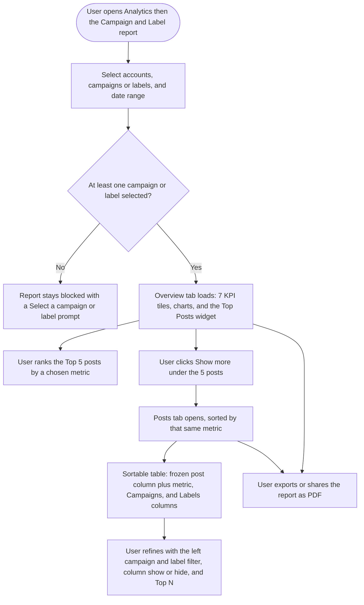

# Workflow Design — Campaign & Label Analytics Report Revamp

## 1. Feature Placement

- **Location:** Analytics → Reports → **Campaign & Label** report (route `campaign-and-label`, route name `campaign_and_label`), in the unified `analytics` module. Entry from the Analytics sidebar, gated by the `campaign_label_analytics` access flag.
- **Shell:** `MainComponent.vue` hosts the top **FilterBar** (accounts + campaigns/labels + date range) and the tab strip.
- **Tabs:** today only **Overview**. This revamp adds a second tab, **Posts**, next to Overview.
- **What changes on Overview:** the KPI tile row grows from 4 → **7 tiles** (adds Post Reach, Video Views, Link Clicks); a new **Top Posts** widget is added below the existing charts.
- **What's new (Posts tab):** a dedicated, sortable post-level table with a frozen post column, scrollable metric columns, and Campaigns/Labels columns.

---

## 2. Overview Diagram (user journey)

---

## 3. User Flow (happy path)

1. User opens the **Campaign & Label** report from the Analytics sidebar.
2. In the top FilterBar, the user selects one or more **social accounts**, one or more **campaigns and/or labels**, and a **date range**. (The report stays blocked until at least one campaign or label is chosen.)
3. The **Overview** tab loads with **7 KPI tiles** — Posts Published, Post Impressions, **Post Reach**, Post Engagements, Engagement Rate per Impression, **Video Views**, **Link Clicks** — each with an info tooltip on hover. Values are totals across the selected accounts (per the existing report behavior).
4. Below the existing charts, a **Top Posts** widget shows the **top 5 posts**. Each post card shows the post preview plus **colored campaign and label icons** indicating which campaign(s)/label(s) it belongs to.
5. The widget heading has a **"Top posts by …"** dropdown (Impressions, Reach, Engagements, Engagement Rate, Video Views, Link Clicks). Changing it re-ranks the 5 posts.
6. The user clicks **Show more** beneath the 5 posts → the **Posts** tab opens, pre-sorted by the metric that was selected in the widget.
7. In the **Posts** tab, a table lists posts one per row. The **first column is frozen** (post image + caption); the remaining metric columns scroll horizontally. Two extra columns — **Campaigns** and **Labels** — show the same colored icons.
8. The user sorts by clicking any sortable column header.
9. The user refines the table with three header controls:
   - **Left** of the heading: a dropdown — **All** ▸ divider ▸ **Campaigns** (checkboxes) ▸ divider ▸ **Labels** (checkboxes). It only lists the campaigns/labels selected in the **main top FilterBar** (a strict subset).
   - **Right #1:** a **column show/hide** dropdown (reused from the Meta Ads table).
   - **Right #2:** a **Top: N** dropdown (20 / 30 / 50 …).
10. The user **exports or shares** the report; the new tiles, Top Posts widget, and Posts table render correctly in the shareable/PDF report view.

---

## 4. Alternative & Edge Flows

- **No campaign/label selected:** Overview and Posts stay in the existing blocked/backdrop state with the "Select a campaign or label" prompt.
- **No posts in the selection:** Top Posts widget and Posts table show an **empty state** (headline + subtext); tiles show 0.
- **A network doesn't report a metric** (e.g., LinkedIn reach, or a network with no video views): that metric shows **"—"** for those posts and that network is **excluded** from the metric's total — never counted as 0.
- **Reach across networks:** shown as a **sum of per-post reach** (matches current tile behavior) with a tooltip clarifying it's summed, not de-duplicated unique reach.
- **Video Views data not yet available for a platform:** column/tile shows "—" for those posts until the backend data lands (Video Views is flagged pending per-platform data availability).
- **Report (shared/PDF) view:** read-only — no interactive sort/filter; the table renders the selected/sorted state as generated.
- **No access to the report:** hidden/blocked via the `campaign_label_analytics` gate (unchanged).

---

## 5. Key Design Decisions

**D1 — Cross-network aggregation for the new metrics**
- *Options:* (a) sum all new metrics across networks; (b) sum additive metrics but average Reach; (c) per-network breakdown only.
- **Recommendation:** **(a) sum**, matching the current tiles' behavior (per PO). Add a **caveat tooltip on Reach** ("sum of each post's reach; not de-duplicated across posts/networks"). Compute Engagement Rate per Impression as Σengagements ÷ Σimpressions. *Rationale:* consistency with today's report; avoids a mixed mental model. (A future "Aggregate vs by-network" toggle — Sprout's differentiator — is deferred to v2.)

**D2 — Missing metric on a network**
- *Options:* zero-fill; show "—" and exclude; hide the whole column.
- **Recommendation:** **show "—" per post and exclude that network from the total.** *Rationale:* zero-filling drags down totals and engagement-rate math and misleads; this is the industry-standard handling.

**D3 — New per-post endpoint vs. extending existing queries**
- *Options:* extend the current summary/breakdown query to also return per-post rows; build a **new per-post endpoint** modeled on the platform reports' Top Posts/PostsSection endpoints.
- **Recommendation:** **new per-post endpoint** (returns per-post metrics + campaign/label associations), reused by both the Top Posts widget and the Posts tab. *Rationale:* the summary and per-post shapes differ; a dedicated endpoint mirrors the existing platform-report architecture and keeps paging/sorting/Top-N clean.

**D4 — Top Posts default ranking metric**
- **Recommendation:** match the platform reports' default (the composable scaffold exposes impressions/engagements today). Pin the exact default to whatever Pinterest/Instagram use when writing the FE story; proposed default **Engagements**.

**D5 — Public API exposure**
- **Recommendation:** expose the campaign/label summary + per-post data through ContentStudio's existing public/developer API conventions (same auth, versioning, and response shape as current public analytics endpoints). Read-only. *Rationale:* PO wants external access; reuse existing public-API patterns rather than inventing a new contract.

---

## 6. Integration with Existing Features

- **Planner:** a campaign = a planner **folder**; a label = **plan label ids**. Post resolution reuses `CampaignAnalyticsRepo` / `LabelAnalyticsRepo` (+ `PlansRepository::fetchPlansByFolderId` / `fetchPlansByLabels`).
- **Platform reports:** reuse `NewStatsCard` (tiles), the `TopPosts.vue` pattern (5 + show more), `PostsSection`/`AnalyticsPostsTable` (sortable table + sort dropdown + Top:N).
- **Meta Ads table:** reuse `useMetaAdsTableColumns.ts` (column show/hide + reorder) and the `sticky left-0` frozen-first-column pattern from `MetaAdsBaseTable.vue`.
- **Campaign/label icons:** reuse `CampaignAttachment.vue` / `LabelAttachment.vue` color helpers (`color_1…color_20`) for cards, table columns, and the left dropdown — all consistent.
- **Reports (shareable/PDF/scheduled):** the new tiles, Top Posts widget, and Posts table must render in the report-view/export path.
- **Public API:** new read-only endpoints under CS's public API surface.

---

## 7. Trackable Actions (Usermaven candidates)

This feature is **predominantly view-only**, and per the analytics guideline, read-only navigation, tab switches, sorting, and filtering are **not** tracked. Candidates are therefore minimal:

| Action | Candidate event | Trigger | Notes |
|---|---|---|---|
| Report exported/shared | *(reuse existing)* | User exports/shares the Campaign & Label report | Search `userMaven.track(` for an existing analytics-export/share event and **reuse** it — likely already instrumented; do not invent a new one. |
| Posts tab first viewed (optional) | `campaign_label_posts_tab_viewed` | User opens the new Posts tab | **Optional** adoption signal for the net-new tab. Include only if the PO wants to measure Posts-tab uptake; otherwise skip (tab switches aren't normally tracked). |

Everything else (tile hovers, Top-Posts re-ranking, column show/hide, Top:N, left-filter changes) is view-only → **no events**. Final decision on the two candidates is made in the PRD (§3.1) after searching the live event catalog.

---

## 8. Scope Recommendation

**v1 (this epic):**
- 3 new KPI tiles (Reach, Video Views, Link Clicks) + tone-matched tooltips.
- Top Posts widget (5 + "Top posts by" sort + campaign/label icons + Show more).
- New Posts tab: sortable table, frozen first column, Campaigns/Labels columns, left filter dropdown, column show/hide, Top:N.
- Backend: new metrics in the summary + new per-post endpoint.
- Public API exposure of the report data.
- Reports (shareable/PDF/scheduled) handling of the new surfaces.
- Design review.
- **Video Views** included but flagged **pending per-platform data availability** (no data in the builder today).

**Deferred to v2:**
- **Aggregate ↔ by-network toggle** (Sprout-style) for cross-network transparency.
- AI-written campaign summary; column-preference persistence beyond the reused Meta-Ads defaults; enhanced scheduled-report layouts.
