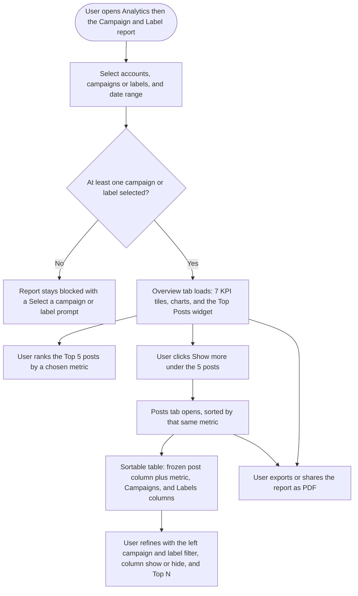

# **PRD: Campaign & Label Analytics Report Revamp**

**Author:** Product Owner
**Last Updated:** 2026-07-24
**Status:** Draft
**Target Release:** Q3 2026

---

## **1. Overview**

ContentStudio's **Campaign & Label** analytics report lets users see aggregated performance for the posts they've organized into campaigns (planner folders) and labels (tags), across all their connected accounts. Today it lags the per-platform reports: only 4 KPI tiles, no Top Posts module, and no post-level table. This revamp brings it to parity — adding **Post Reach, Video Views, and Link Clicks** tiles, a **Top Posts** widget on the Overview, and a new dedicated **Posts** tab with a sortable, campaign/label-aware table — plus exposing the data through ContentStudio's **public API** and handling the new surfaces in **shareable/PDF reports**.

---

## **2. Problem Statement**

**What problem are we solving?**
The Campaign & Label report only answers "how many posts, impressions, engagements, and what engagement rate" for a campaign/label. Users can't see the fuller metric set (reach, video views, link clicks), can't identify the best-performing posts in a campaign, and can't drill into per-post performance in a table. Compared to ContentStudio's own per-platform reports (Facebook, Instagram, Pinterest, LinkedIn), the campaign/label view is visibly under-built.

**Who has this problem?**
Agencies and social media managers who run **cross-network campaigns** and use campaigns/labels to organize content — the exact users who need to report campaign ROI to clients/stakeholders. It's encountered every reporting cycle (weekly/monthly).

**What happens if we don't solve it?**
- **Competitive gap.** Sprout Social (Tag Performance Report), Hootsuite (Cross-Network Posts Table), Buffer, Publer, and Loomly all offer richer campaign/tag analytics with top-posts and sortable post tables.
- **Workarounds & churn risk.** Users export raw data to spreadsheets or lean on other tools for campaign reporting.
- **Weak ROI storytelling.** Without best-post visibility and per-post detail, campaign reports are less persuasive for client retention.

---

## **3. Goals & Success Metrics**

| Goal | Metric | Target | How We'll Measure |
| ----- | ----- | ----- | ----- |
| Primary — drive adoption of the revamped report | % of workspaces that open the Campaign & Label report and view the new Posts tab | +30% report engagement in 90 days | Product analytics (Usermaven) |
| Secondary — surface best-performing content | Interactions with the Top Posts widget (rank changes, Show more clicks) | Measurable usage in 60 days | Product analytics |
| Secondary — external data access | Public API calls to the new campaign/label analytics endpoints | Non-zero adoption by API users in 90 days | API gateway logs |
| Guard rail — no performance regression | Report/Posts-tab load time; error rate | No material regression vs current report | APM / error monitoring |

### **3.1 Analytics Events (Usermaven)**

This feature is **predominantly view-only** (viewing tiles, ranking top posts, sorting/filtering a table, switching tabs). Per story guidelines §19, read-only navigation, tab switches, sorting, and filtering are **not** tracked. A search of `contentstudio-frontend/src/` for `userMaven.track(` found **no existing report-export/share or campaign-label event** to reuse.

| Event Name | Trigger | Payload | What we measure with it |
| ----- | ----- | ----- | ----- |
| `campaign_label_posts_tab_viewed` *(optional)* | FE — user opens the new **Posts** tab for the first time in a session | `{ metric }` (the sort metric the tab opened with) | Adoption of the net-new Posts tab (Primary goal) |

- The Posts-tab event is the **only** candidate, and it's **optional** — include it only if we want to measure Posts-tab adoption (it's the one net-new surface, which is why it's a defensible exception to "don't track tab switches"). If we don't want it, §3.1 is *"None — feature is view-only."*
- No other new events. Tile hovers, Top-Posts re-ranking, column show/hide, Top:N, and left-filter changes are **not** tracked.
- **Open item:** confirm whether report export/share is instrumented elsewhere; if the team wants export tracking, it's a separate cross-cutting task, not part of this epic.

---

## **4. Target Users**

**Primary Persona:**
*Agency social media manager / marketer* — organizes posts into campaigns and labels, manages several connected accounts across networks, and reports campaign performance to clients or leadership on a recurring cadence. Comfortable with analytics dashboards; not a developer.

**Secondary Persona:**
*Client / stakeholder* — receives a shared or PDF report and reads it without interacting (read-only view).
*API consumer / developer* — pulls campaign/label analytics into an external BI/reporting stack via the public API.

**Non-Users (out of scope):**
- Mobile app users — this report is **web-only** (no Campaign & Label analytics in the iOS/Android apps).
- Users who don't organize posts into campaigns or labels — the report requires at least one campaign/label selected.

---

## **5. User Stories / Jobs to Be Done**

| ID | As a... | I want to... | So that... | Priority |
| ----- | ----- | ----- | ----- | ----- |
| US-1 | Social media manager | see reach, video views, and link clicks for a campaign/label (not just impressions/engagements) | I get the full performance picture in one place | Must Have |
| US-2 | Agency manager | see the top 5 posts in a campaign/label ranked by a metric I choose | I can showcase the best content to clients | Must Have |
| US-3 | Marketer | open a full post-level table for a campaign/label and sort by any metric | I can analyze every post, not just the top few | Must Have |
| US-4 | Marketer | see which campaign(s)/label(s) each post belongs to in the table | I can make sense of posts when several campaigns/labels are selected | Must Have |
| US-5 | Analyst | narrow the table to specific campaigns/labels and choose which metric columns show and how many posts | I can focus the view without leaving the report | Should Have |
| US-6 | Agency owner | include the new tiles, top posts, and post table in shared/PDF reports | client reports look complete and professional | Must Have |
| US-7 | Developer | fetch the campaign/label analytics via the public API | I can feed it into our own BI/reporting stack | Should Have |
| US-8 | Designer | review the revamped report against the design system before build | the new surfaces are visually consistent | Must Have |

---

## **6. Requirements**

### **6.1 Must Have (P0)**

- Add 3 KPI tiles to the Overview — **Post Reach, Video Views, Link Clicks** — each with an info tooltip matching the tone/structure of the existing 4 tiles.
- Backend: return Reach, Video Views, and Link Clicks in the campaign/label **summary** (aggregated across selected networks, matching current tile behavior).
- Backend: a **new per-post endpoint** returning per-post metrics + each post's campaign/label associations, powering both the Top Posts widget and the Posts tab.
- **Top Posts widget** on Overview: top 5 posts, a **"Top posts by {metric}"** sort dropdown, campaign/label icons on each card, and a **Show more** button that opens the Posts tab sorted by the same metric.
- **New Posts tab**: sortable table with a **frozen first column** (post image + caption), horizontally-scrollable metric columns, and **Campaigns and Labels columns** (colored icons matching the dropdown).
- Posts-tab header controls: **left campaign/label filter dropdown** (All ▸ Campaigns ▸ Labels checkboxes, strictly a subset of the main FilterBar selection), **column show/hide** (reused from Meta Ads), and **Top: N** dropdown.
- **Reports handling**: the new tiles, Top Posts widget, and Posts table render correctly in shareable/PDF/scheduled reports.
- **Missing-metric handling**: a metric a network doesn't report shows **"—"** per post and is **excluded** from that metric's total (never zero-filled).
- **Design review** completed before/alongside build.

### **6.2 Should Have (P1)**

- **Public API** exposure of the campaign/label summary + per-post data (read-only), following CS's existing public-API auth/versioning/response conventions.
- Reach tile tooltip explicitly clarifies it's a **sum of per-post reach** (not de-duplicated unique reach).

### **6.3 Nice to Have (P2)**

- **Aggregate ↔ by-network** view/toggle for cross-network transparency (Sprout-style).
- Persisted per-user column preferences on the Posts table beyond the reused Meta-Ads defaults.

### **6.4 Explicitly Out of Scope**

- Mobile (iOS/Android) — web-only.
- AI-written campaign summary.
- Redesigning the existing charts or the FilterBar behavior.
- De-duplicated unique reach across posts/networks (not feasible from platform data; Reach is summed).
- New report-export/share analytics instrumentation (separate cross-cutting task).

---

## **7. User Flow (High Level)**

1. User opens the **Campaign & Label** report from the Analytics sidebar.
2. User selects accounts, one or more campaigns/labels, and a date range (report is blocked until ≥1 campaign/label is chosen).
3. **Overview** loads with **7 KPI tiles**, the existing charts, and the new **Top Posts** widget (top 5, with campaign/label icons).
4. User re-ranks the widget via **"Top posts by {metric}"**.
5. User clicks **Show more** → the **Posts** tab opens, sorted by that metric.
6. In the Posts tab, user sorts columns and refines via the left campaign/label filter, column show/hide, and Top:N.
7. User exports/shares the report; the new surfaces render in the report view.

---

## **8. Business Rules & Constraints**

| Rule ID | Rule | Rationale |
| ----- | ----- | ----- |
| BR-1 | New metrics (Reach, Video Views, Link Clicks) are **summed across selected networks**, matching the current tiles. | Consistency with existing report behavior (PO decision). |
| BR-2 | A metric a network doesn't report shows **"—"** and is **excluded** from that metric's aggregate — never counted as 0. | Zero-filling distorts totals and engagement-rate math. |
| BR-3 | **Reach** is presented as a **sum of per-post reach**, with a tooltip clarifying it is not de-duplicated unique reach. | Unique reach can't be de-duplicated across posts/networks from platform data. |
| BR-4 | Engagement Rate per Impression is computed as Σengagements ÷ Σimpressions. | Correct cross-network rate; not an average of rates. |
| BR-5 | The report stays blocked until at least one campaign or label is selected. | Existing behavior; the report is meaningless without a grouping. |
| BR-6 | The Posts-tab **left filter dropdown lists only** campaigns/labels selected in the main FilterBar. | The tab is a refinement of the report scope, not a way to widen it. |
| BR-7 | The Top Posts widget shows exactly **5 posts**; "Show more" routes to the Posts tab. | Matches the per-platform report pattern. |
| BR-8 | The public API endpoints are **read-only** and follow existing CS public-API auth/versioning. | Reuse proven contract; no write surface needed. |
| BR-9 | GMB accounts remain excluded from account selection (existing). | Unchanged from today's report. |
| BR-10 | Feature is **web-only**; no mobile surface. | No Campaign & Label analytics in the mobile apps. |

---

## **9. Open Questions**

| Question | Options | Owner | Due Date | Decision |
| ----- | ----- | ----- | ----- | ----- |
| Is **Video Views** data available per platform in the analytics store? | Available / Partial / Needs new ingestion | Backend | Before BE build | Pending — flagged; keep in scope, ship "—" where unavailable |
| Exact **default sort metric** for Top Posts | Engagements / Impressions / (match platform reports) | Product + FE | Story writing | Pending — match Pinterest/Instagram default |
| Include the optional **`campaign_label_posts_tab_viewed`** event? | Yes / No | Product | Before FE build | Pending |
| Public API **versioning & endpoint naming** | Reuse current analytics public-API version / new namespace | Backend | Before BE build | Pending |

---

## **10. Risks & Mitigations**

| Risk | Likelihood | Impact | Mitigation |
| ----- | ----- | ----- | ----- |
| **Video Views** data doesn't exist for some/all platforms (no builder reference today) | High | Medium | Investigate per-platform data first; render "—" where unavailable; don't block the rest of the epic on it. |
| The `analytics` module is large/feature-sensitive; regressions in the existing report | Medium | High | Reuse existing components (tiles, TopPosts, PostsSection, Meta-Ads table); zero-change to existing charts/FilterBar; test the existing Overview alongside. |
| Users misread summed Reach as unique reach | Medium | Low | Clear caveat tooltip (BR-3). |
| Per-post endpoint slow for large campaigns/date ranges | Medium | Medium | Server-side sort + Top:N paging (mirror platform reports); avoid returning unbounded rows. |
| Public API exposes heavy queries to external load | Low | Medium | Reuse existing public-API rate limiting; read-only; cap page size. |
| Cross-repo API contract drift (FE built before BE endpoint stable) | Medium | Medium | Define the per-post endpoint contract first; BE story precedes FE stories in dependency order. |

---

## **11. Dependencies**

- **Internal:**
  - Backend analytics builder — `CampaignLabelAnalyticsController.php`, `CampaignLabelAnalyticsBuilder.php`, `CampaignLabelRequest.php`, `routes/web/analytics.php` (ClickHouse). New metrics + new per-post endpoint live here.
  - Planner data — campaigns = folders, labels = plan label ids (`CampaignAnalyticsRepo` / `LabelAnalyticsRepo`, `PlansRepository`).
  - Frontend reuse — `NewStatsCard`, platform `TopPosts.vue`, `PostsSection`/`AnalyticsPostsTable`, `useMetaAdsTableColumns.ts` + `MetaAdsBaseTable.vue` (frozen column), `CampaignAttachment`/`LabelAttachment` icon helpers.
  - Reports/export system (shareable/PDF/scheduled report rendering path).
  - Public API framework (existing analytics public endpoints, auth, versioning).
- **External:** Per-platform metric availability (LinkedIn reach naming, TikTok public-post gating, video-view support per network).
- **Blockers:** Confirm `contentstudio-backend` `develop` is current before BE work; Video Views data investigation before committing its tile/column as fully populated.

---

## **12. Appendix**

- Research: `docs/features/campaign-label-analytics-revamp/01-research.md` (competitor analysis + codebase grounding). *(Pipeline-local; not for Shortcut story bodies.)*
- Workflow: `docs/features/campaign-label-analytics-revamp/02-workflow.md`.
- Competitive analysis summary: closest analog is **Sprout Social's Tag Performance Report**; sortable post tables in Buffer/Hootsuite/Publer/Loomly; top-posts modules in Buffer/Metricool.
- Designs: Figma — *to be attached by Design during the design-review story.*

---

## **Changelog**

| Date | Author | Changes |
| ----- | ----- | ----- |
| 2026-07-24 | Product Owner | Initial draft from approved research + workflow |
