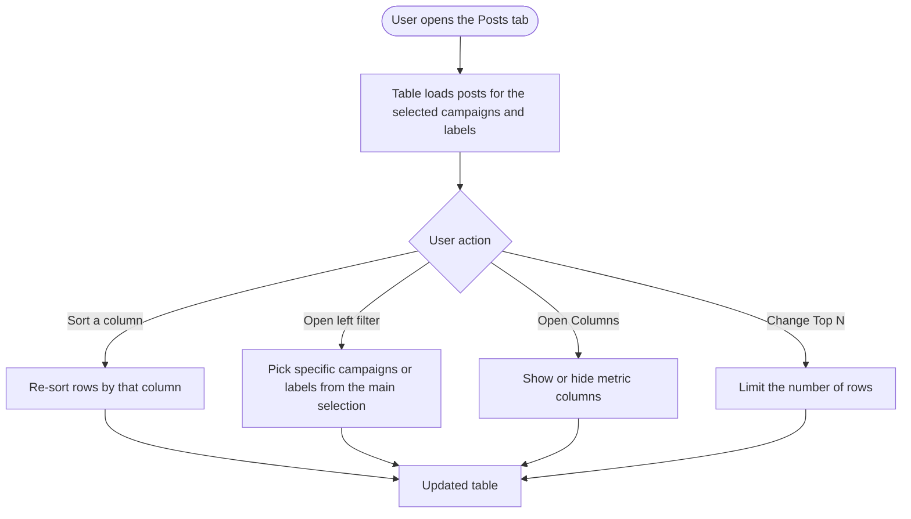
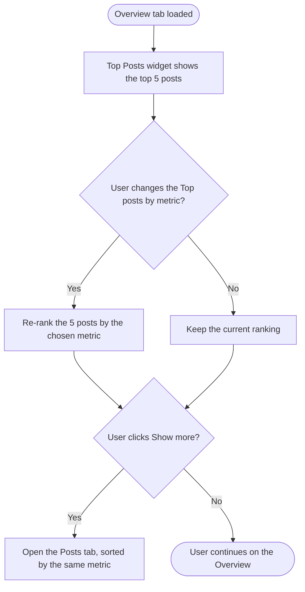

# Epic & Stories — Campaign & Label Analytics Report Revamp

## Epic: Campaign & Label Analytics Report Revamp

The Campaign & Label analytics report shows aggregated performance for the posts a user has organized into **campaigns** (planner folders) and **labels** (tags), across all their connected accounts. Today it trails ContentStudio's per-platform reports — only four KPI tiles, no best-posts module, and no post-level table — so users running cross-network campaigns can't see their best content or drill into per-post performance.

This epic brings the report to parity with the per-platform reports: three new KPI tiles (**Post Reach, Video Views, Link Clicks**), a **Top Posts** widget on the Overview (top 5, ranked by a selectable metric, with campaign/label icons on each card), and a new **Posts** tab with a sortable, campaign/label-aware table (frozen post column, scrollable metric columns, and dedicated Campaigns and Labels columns). Beyond the UI, it adds the backend to power these surfaces — the new metrics in the summary plus a new per-post analytics endpoint — exposes the report's data through **ContentStudio's public API**, and ensures the new surfaces render in **shareable and PDF/scheduled reports**. A **design review** grounds the visual work in the design system before build.

**Goal:** close the competitive gap (closest analog: Sprout Social's Tag Performance Report), give agencies and marketers a complete campaign performance story with best-post visibility and per-post detail, and make that data available externally. **Web-only.** Video Views ships where platform data is available and shows "—" elsewhere; new metrics are summed across networks (matching current tiles), with any metric a network doesn't report shown as "—" and excluded from the total.

**Stories (dependency order):**
1. [Design] Design the revamped Campaign & Label report (tiles, Top Posts, Posts tab)
2. [Full Stack] Add Post Reach, Video Views & Link Clicks tiles to the Campaign & Label report
3. [Full Stack] Add the Posts tab with a sortable table and per-post analytics endpoint
4. [FE] Add the Top Posts widget to the Campaign & Label Overview
5. [BE] Expose Campaign & Label analytics via the ContentStudio public API
6. [FE] Render the revamped Campaign & Label report in shareable and PDF reports

> **Note on the Full Stack stories:** BE work is folded into the FE story it serves — the summary-metric additions live with the tiles, and the per-post endpoint lives with the Posts tab. The public API stays a separate `[BE]` story because it builds on **both** and is a distinct external-exposure task.

---

## [Design] Design the revamped Campaign & Label report (tiles, Top Posts, Posts tab)

### Description
As a designer, I want to design and review the revamped Campaign & Label report — the 7-tile Overview, the Top Posts widget, and the new Posts tab — against the ContentStudio design system, so that the build is visually consistent and the copy and interactions are finalized before engineering starts.

All three surfaces — the 7-tile Overview, the Top Posts widget, and the Posts tab — must be reviewed and signed off by a designer before development starts, to confirm they stay visually consistent with ContentStudio's existing per-platform analytics reports (Facebook, Instagram, Pinterest, LinkedIn). The designer verifies spacing, typography, tile/card styling, icon usage, and the campaign/label color treatment against the design system, and flags any component gaps or new design tokens so they're resolved before the FE stories begin.

### Workflow
1. Designer produces mockups for the enhanced Overview (7 tiles), the Top Posts widget, and the new Posts tab, reusing the patterns from the per-platform reports.
2. Designer finalizes the copy (tile titles/tooltips, empty/loading/error states, dropdown labels) with product.
3. Product and engineering review; feedback is incorporated; designs are signed off.
4. Final Figma is attached to the epic for the build stories.

### Acceptance criteria
- [ ] Mockups for the **7-tile Overview** layout (responsive from the current 4-tile grid), including icons for the 3 new tiles (Post Reach, Video Views, Link Clicks).
- [ ] Mockups for the **Top Posts widget**: post card with preview, metric value, and campaign/label icons; the "Top posts by" sort dropdown; the "Show more" affordance; and empty/loading states.
- [ ] Mockups for the **Posts tab**: frozen first column (post image + caption), horizontally-scrollable metric columns, Campaigns and Labels columns, the left campaign/label filter dropdown, the column show/hide control, and the Top:N control; plus empty/loading/error states.
- [ ] Designs use existing design-system components and tokens (no dark mode, no RTL).
- [ ] Copy for tile titles, tooltips, and empty states is finalized and matches the build stories.
- [ ] Designs are reviewed and signed off; Figma is attached to the epic.

### Mock-ups
This story produces the mock-ups. See PRD section 7 for the flow they visualize.

### Impact on existing data
None.

### Impact on other products
Informs the build stories; report-view/PDF layout considerations feed **[FE] Render the revamped Campaign & Label report in shareable and PDF reports**.

### Dependencies
None (precedes/parallels the build stories).

### Global quality & compliance (wherever applicable)
- [ ] Mobile responsiveness — N/A, design story (web-only report)
- [ ] Multilingual support — N/A, design story
- [ ] UI theming support (default + white-label, design library components are being used)
- [ ] White-label domains impact review
- [ ] Cross-product impact assessment (web, mobile apps, Chrome extension) — N/A, web-only

---

## [Full Stack] Add Post Reach, Video Views & Link Clicks tiles to the Campaign & Label report

### Description
As a user viewing the Campaign & Label report, I want reach, video views, and link clicks shown as KPI tiles on the Overview alongside the existing metrics, so that I can see the full performance picture for my campaigns and labels at a glance. This story covers both the backend (adding the three metrics to the report summary) and the frontend (rendering the tiles with tooltips).

### Workflow
1. User opens the Campaign & Label report and selects accounts, campaigns/labels, and a date range.
2. The Overview shows **7 KPI tiles** — the existing four plus Post Reach, Video Views, and Link Clicks — each summed across the selected networks the same way the current metrics are.
3. Hovering a tile's info icon shows a plain-language tooltip explaining the metric.
4. Where a network doesn't report a metric (e.g., LinkedIn reach, or a platform without video views), the tile reflects only the networks that do (and shows "—" if none report it).

### Acceptance criteria

**Backend**
- [ ] The campaign/label **summary** response includes `reach`, `video_views`, and `link_clicks`, aggregated across the selected networks, consistent with how existing metrics are aggregated (summed).
- [ ] Engagement Rate per Impression continues to be computed as total engagements ÷ total impressions (unchanged).
- [ ] A metric a network does not report is **excluded** from that metric's total and is distinguishable from a genuine 0 (the response conveys "no data", not `0`).
- [ ] **Video Views** returns real values for platforms that provide it; where a platform doesn't, it returns "no data" so the tile shows "—". *(Per-platform video-view availability must be confirmed — see Implementation references.)*
- [ ] Summary **reach** is the sum of per-post reach across the selection.

**Frontend**
- [ ] The Overview shows 7 tiles including Post Reach, Video Views, and Link Clicks (final order per the Design story).
- [ ] Each new tile displays the summed value from the report API and has an info tooltip (copy below) on hover.
- [ ] The tile row stays responsive as it grows from 4 to 7 tiles (no overflow/misalignment at supported breakpoints).
- [ ] A metric with no data for the current selection shows "—" (not 0); Video Views shows "—" where the platform doesn't provide it.
- [ ] Tiles reuse the existing stats-card component and design-system theming (no hardcoded colors).

### UI copy
**Tile titles:** "Post Reach" · "Video Views" · "Link Clicks"

**Tooltips** (matching the tone/structure of the existing tiles):
- **Post Reach:** "The total number of times the posts published during the selected time period, associated with the chosen campaign and label, were seen by unique users, across the selected social accounts. Reach is summed across posts (it is not de-duplicated across posts or networks) and is based on the lifetime performance of the posts."
- **Video Views:** "The total number of video views received by the posts published during the selected time period, associated with the chosen campaign and label, across the selected social accounts. Video views are based on the lifetime performance of the posts."
- **Link Clicks:** "The total number of link clicks received by the posts published during the selected time period, associated with the chosen campaign and label, across the selected social accounts. Link clicks are based on the lifetime performance of the posts."

### Mock-ups
See the **[Design] Design the revamped Campaign & Label report (tiles, Top Posts, Posts tab)** story and PRD section 7.

### Impact on existing data
No changes to stored data or existing response fields; the summary gains three fields. Reach and Link Clicks (post_clicks) already exist per-post in the analytics store; **Video Views may require new ingestion/columns** if not present per platform (flagged as an open item).

### Impact on other products
- Consumed by **[BE] Expose Campaign & Label analytics via the ContentStudio public API** and rendered in report view by **[FE] Render the revamped Campaign & Label report in shareable and PDF reports**.
- Mobile: N/A (web-only report).

### Dependencies
Depends on: **[Design] Design the revamped Campaign & Label report (tiles, Top Posts, Posts tab)**. Confirm `contentstudio-backend` `develop` is current before the BE work.

### Global quality & compliance (wherever applicable)
- [ ] Mobile responsiveness (frontend only, N/A for backend-only stories)
- [ ] Multilingual support (frontend + backend, translations available or fallback handled)
- [ ] UI theming support (default + white-label, design library components are being used)
- [ ] White-label domains impact review
- [ ] Cross-product impact assessment (web, mobile apps, Chrome extension)

### Implementation references
*Pointers from research — not a contract. Engineering may choose a different approach.*

**Backend (`contentstudio-backend/`):**
- `app/Builders/Analytics/Analyze/CampaignLabelAnalyticsBuilder.php` → `getSummaryQuery()` (per-platform CTEs `UNION ALL`ed, then `sum(...)`) — add the 3 metrics here. Reach/link-clicks SQL precedent exists in `getAnalyticsForPlannerQuery()` (`post_impressions_unique as reach`, `post_clicks`).
- `app/Http/Controllers/Analytics/Analyze/CampaignLabelAnalyticsController.php` (default metric fallback lists only the current 4), `app/Http/Requests/Analyze/CampaignLabelRequest.php`.
- **Gotcha:** `video_views` has zero references in the builder — its per-platform availability needs investigation; render "—" where absent. Reach is not additive (double-counts) — product accepts the sum; don't imply de-duplication.

**Frontend (`contentstudio-frontend/`):**
- `src/modules/analytics/views/performance-report/label-and-campaign/composables/useLabelAndCampaign.ts` → `getSampleSummaryData(): SummaryCardData[]` — add three tile entries (`get title()` → `analytics.label_and_campaign.cards.*`, `get tooltip()` → `analytics.label_and_campaign.tooltips.*`). Add keys to **all 8 locale dirs**.
- `components/CardsComponent.vue` → `common/NewStatsCard.vue`; adjust the Overview tile grid (`OverviewSection.vue`, currently `grid-cols-4`) for 7 tiles. Tile icons are SVG imports — add one per new tile.

---

## [Full Stack] Add the Posts tab with a sortable table and per-post analytics endpoint

### Description
As a user viewing the Campaign & Label report, I want a dedicated **Posts** tab with a sortable table of every post in the selected campaigns/labels — including which campaigns and labels each post belongs to — so that I can analyze all posts, not just the top few. This story covers both the backend (a new per-post analytics endpoint) and the frontend (the Posts tab and its table). The per-post endpoint also powers the Top Posts widget.

### Workflow

1. A new **Posts** tab appears next to Overview. Opening it (directly or via the Top Posts "Show more") loads the post-level table.
2. Each post is a row. The **first column is frozen** (post image + caption); the remaining columns scroll horizontally.
3. Columns include per-post metrics (Impressions, Reach, Engagements, Engagement Rate, Video Views, Link Clicks), network/account and published date, and **Campaigns** and **Labels** columns showing the same colored icons as the left filter dropdown.
4. The user sorts by clicking a column header.
5. The user refines with three header controls: a **left campaign/label filter**, a **column show/hide** control (right), and a **Top: N** control (right).

### Acceptance criteria

**Backend (per-post endpoint)**
- [ ] A new per-post endpoint returns, per published post: post id, preview/caption, network, account, published date, per-post metrics (impressions, reach, engagements, engagement rate, video views, link clicks), and the campaign(s) and label(s) the post belongs to (supporting multi-membership).
- [ ] The endpoint supports **server-side sorting** by any returned metric (ascending/descending) and a **result limit** (Top N).
- [ ] The endpoint honors the same scope as the report (selected accounts, campaigns/labels, date range) and the same `campaign_label_analytics` access gate.
- [ ] Metrics a network doesn't report are returned as "no data" (client renders "—"), never `0`.
- [ ] The endpoint returns within acceptable time for large campaigns/date ranges (result limit enforced; no unbounded row sets).

**Frontend (Posts tab)**
- [ ] A **Posts** tab appears next to Overview; opening it loads the post-level table for the current selection.
- [ ] The table shows one row per post; the **first column (post image + caption) is frozen** and the remaining columns scroll horizontally.
- [ ] Columns include Impressions, Reach, Engagements, Engagement Rate, Video Views, Link Clicks, network/account, published date, and **Campaigns** and **Labels** columns (colored icons matching the left dropdown; name on hover; multiple icons if the post belongs to several).
- [ ] Clicking a sortable column header sorts rows by that column (ascending/descending).
- [ ] A **left filter dropdown** next to the heading offers **All** ▸ **Campaigns** (checkboxes) ▸ **Labels** (checkboxes); it lists **only** the campaigns/labels selected in the main top FilterBar; changing it filters the table.
- [ ] A **column show/hide** dropdown (right) toggles which metric columns are visible.
- [ ] A **Top: N** dropdown (right) limits the number of rows (e.g., 20 / 30 / 50).
- [ ] Opening the tab via the Top Posts "Show more" pre-sorts the table by the widget's selected metric.
- [ ] Cells for a metric a post/network doesn't report show "—".
- [ ] Empty, loading, and error states are handled (copy below).
- [ ] *(Optional — include only if the team opts to track Posts-tab adoption per PRD §3.1)* When the user opens the Posts tab, a `campaign_label_posts_tab_viewed` Usermaven event fires with `{ metric }` (the metric the tab opened sorted by).

### UI copy
- **Tab title:** "Posts"
- **Left filter — trigger (all selected):** "All campaigns & labels"; **(subset):** "{count} selected"
- **Left filter — section headers:** "Campaigns" and "Labels" (with a divider above each; an "All" option at the top)
- **Column control:** "Columns"
- **Row-count control:** "Top: {count}"
- **Column headers:** "Post", "Account", "Published", "Impressions", "Reach", "Engagements", "Engagement rate", "Video views", "Link clicks", "Campaigns", "Labels"
- **Empty state — headline:** "No posts match your filters"
- **Empty state — subtext:** "Try selecting more campaigns or labels, or widening your date range."
- **Loading:** table skeleton rows.
- **Error:** global alert — "We couldn't load posts. Please try again."
- **Missing metric cell:** "—"

### Mock-ups
See the **[Design] Design the revamped Campaign & Label report (tiles, Top Posts, Posts tab)** story and PRD section 7.

### Impact on existing data
No changes to stored data; a new per-post endpoint is added. Reach and Link Clicks already exist per-post; Video Views availability per platform is the open item (renders "—" where absent).

### Impact on other products
- The per-post endpoint also powers **[FE] Add the Top Posts widget to the Campaign & Label Overview** and is exposed externally by **[BE] Expose Campaign & Label analytics via the ContentStudio public API**.
- Rendered in report view by **[FE] Render the revamped Campaign & Label report in shareable and PDF reports**.
- Mobile: N/A.

### Dependencies
Depends on: **[Design] Design the revamped Campaign & Label report (tiles, Top Posts, Posts tab)**. Confirm `contentstudio-backend` `develop` is current before the BE work.

### Global quality & compliance (wherever applicable)
- [ ] Mobile responsiveness (frontend only, N/A for backend-only stories)
- [ ] Multilingual support (frontend + backend, translations available or fallback handled)
- [ ] UI theming support (default + white-label, design library components are being used)
- [ ] White-label domains impact review
- [ ] Cross-product impact assessment (web, mobile apps, Chrome extension)

### Implementation references
*Pointers from research — not a contract. Engineering may choose a different approach.*

**Backend (`contentstudio-backend/`):**
- Add a per-post query/endpoint modeled on the platform reports' Top Posts/posts-section endpoints. Per-post SQL precedent lives in `CampaignLabelAnalyticsBuilder.php::getAnalyticsForPlannerQuery()` (Facebook `post_impressions_unique as reach`, `post_clicks`; other platforms `reach`, `post_clicks`). Route + params in `routes/web/analytics.php` and `CampaignLabelRequest.php`.
- Post ↔ campaign/label linkage: campaign = planner folder, label = plan label ids — via `CampaignAnalyticsRepo` / `LabelAnalyticsRepo` (+ `PlansRepository::fetchPlansByFolderId` / `fetchPlansByLabels`, `PostingRepository::getPostedIdsByPlanIds`). Carry each post's campaign/label ids onto the rows.
- Reuse the same builder from **[Full Stack] Add Post Reach, Video Views & Link Clicks tiles…** so summary and per-post metrics stay consistent.

**Frontend (`contentstudio-frontend/`):**
- Add the tab in `.../label-and-campaign/MainComponent.vue` — extend `:tabs` on both `AnalyticsTabsHeader` and `TabsComponent` from `['#overview']` to `['#overview', '#posts']` and add a `v-slot:posts` template. The `posts` tab title string already exists (`analytics.common.tabs_component.tab_titles.posts`). Verify `AnalyticsTabsHeader`'s current special-case for `type === 'campaign-and-label'`.
- Build the table from `views/common/AnalyticsPostsTable.vue` (sortable columns, sort dropdown, Top:N via `PostsSection.vue`) + `meta_ads/components/MetaAdsBaseTable.vue` `sticky left-0` frozen-first-column pattern + `meta_ads/composables/useMetaAdsTableColumns.ts` (column show/hide).
- Campaigns/Labels columns + left filter icons: reuse `CampaignAttachment.vue` / `LabelAttachment.vue` color helpers; the existing `LableAndCampaignTable.vue` already renders a combined Campaigns/Labels column with these helpers. New copy → **all 8 locale dirs** (namespace `analytics`).

---

## [FE] Add the Top Posts widget to the Campaign & Label Overview

### Description
As a user viewing the Campaign & Label report, I want to see the top 5 posts for my selected campaigns/labels — ranked by a metric I choose, with the campaigns and labels each post belongs to shown on the card — so that I can quickly spot and showcase the best-performing content.

### Workflow

1. On the Overview, below the charts, a **Top Posts** widget shows up to 5 posts for the current selection.
2. Each card shows the post preview/caption, its value for the selected sort metric, and colored **campaign and label icons** (hovering an icon shows the campaign/label name).
3. The widget heading has a **"Top posts by"** dropdown; changing it re-ranks the 5 posts.
4. A **"Show more"** button below the 5 posts opens the Posts tab, pre-sorted by the metric currently selected.

### Acceptance criteria
- [ ] A Top Posts widget appears on the Overview (below the existing charts) showing up to 5 posts for the selected accounts, campaigns/labels, and date range.
- [ ] Each card shows the post preview/caption, the value of the currently selected sort metric, and the campaign(s) and label(s) it belongs to as colored icons (name on hover; multiple icons if the post belongs to several).
- [ ] The heading has a **"Top posts by"** dropdown with options: Impressions, Reach, Engagements, Engagement Rate, Video Views, Link Clicks.
- [ ] The default sort matches the per-platform reports' default (confirm the exact metric when building; proposed: Engagements).
- [ ] Changing the metric re-ranks the 5 posts.
- [ ] Posts that don't report the selected metric rank last and show "—" for that value.
- [ ] A **"Show more"** button opens the Posts tab pre-sorted by the currently selected metric.
- [ ] Empty, loading, and error states are handled (copy below; errors via the global alert).

### UI copy
- **Section heading:** "Top Posts"
- **Sort dropdown label:** "Top posts by" — options: "Impressions", "Reach", "Engagements", "Engagement rate", "Video views", "Link clicks"
- **Show more button:** "Show more"
- **Empty state — headline:** "No top posts yet"
- **Empty state — subtext:** "Once the posts in your selected campaigns and labels have performance data for this date range, your best posts will show up here."
- **Loading:** skeleton post cards.
- **Error:** global alert — "We couldn't load the top posts. Please try again."

### Mock-ups
See the **[Design] Design the revamped Campaign & Label report (tiles, Top Posts, Posts tab)** story and PRD section 7.

### Impact on existing data
None — reads the per-post endpoint (limited to 5).

### Impact on other products
Rendered in report view by **[FE] Render the revamped Campaign & Label report in shareable and PDF reports**. Mobile: N/A.

### Dependencies
Depends on: **[Full Stack] Add the Posts tab with a sortable table and per-post analytics endpoint** (provides the per-post endpoint and the "Show more" target) and **[Design] Design the revamped Campaign & Label report (tiles, Top Posts, Posts tab)**.

### Global quality & compliance (wherever applicable)
- [ ] Mobile responsiveness (frontend only, N/A for backend-only stories)
- [ ] Multilingual support (frontend + backend, translations available or fallback handled)
- [ ] UI theming support (default + white-label, design library components are being used)
- [ ] White-label domains impact review
- [ ] Cross-product impact assessment (web, mobile apps, Chrome extension)

### Implementation references
*Pointers from research — not a contract. Engineering may choose a different approach.*

- Model on the per-platform Top Posts widget: `src/modules/analytics/views/facebook_v2/components/TopPosts.vue` (`DEFAULT_VISIBLE_COUNT = 5`, `isExpanded`, CSTU `Button`), with `views/pinterest/components/TopPosts.vue` and `linkedin_v2` as parallels. Cards via a `TopPostCard`-style component.
- Sort dropdown: the composable already has a `getTopLeastEngagementDropdown()` scaffold (impressions/engagements) + `selectedTopLeastSortType` — extend with the new metrics.
- Campaign/label icons: reuse `src/components/common/CampaignAttachment.vue` / `LabelAttachment.vue` color helpers (`color_1…color_20`).
- Consume the per-post endpoint with a limit of 5; "Show more" routes to the Posts tab carrying the selected metric as the initial sort.

---

## [BE] Expose Campaign & Label analytics via the ContentStudio public API

### Description
As a developer integrating with ContentStudio, I want to fetch a campaign/label's analytics — the summary metrics and the per-post data — through ContentStudio's public API, so that I can pull campaign performance into my own BI/reporting stack.

### Workflow
1. The developer authenticates with their ContentStudio API token.
2. They call the campaign/label analytics endpoint with the workspace, accounts, campaigns/labels, and date range, and receive the summary metrics as JSON.
3. They call the per-post endpoint with the same scope (plus optional sort metric and limit) and receive the per-post rows, including each post's campaign/label associations.
4. Access is limited to the workspaces/accounts the token's user can access.

### Acceptance criteria
- [ ] A read-only public API endpoint returns the campaign/label **summary** metrics (including reach, video views, link clicks) for a given workspace, account set, campaign/label set, and date range.
- [ ] A read-only public API endpoint returns the **per-post** dataset (same fields as the internal per-post endpoint), accepting sort-metric and limit parameters.
- [ ] Endpoints follow the existing CS public-API **authentication** (API token), **versioning**, and **response-envelope** conventions.
- [ ] The same access rules apply: only workspaces/accounts the token's user can access, and the `campaign_label_analytics` gate is respected.
- [ ] Metrics a network doesn't report are conveyed as "no data" (consistent with the internal API), not `0`.
- [ ] Endpoints are covered by the public API documentation (parameters, response shape, example request/response).
- [ ] Existing public-API rate limiting and page-size caps apply.

### Mock-ups
N/A — backend only.

### Impact on existing data
None — read-only exposure of data delivered by the internal endpoints.

### Impact on other products
External API consumers / integrations; requires public API documentation update. Mobile: N/A.

### Dependencies
Depends on: **[Full Stack] Add Post Reach, Video Views & Link Clicks tiles to the Campaign & Label report** (summary metrics) and **[Full Stack] Add the Posts tab with a sortable table and per-post analytics endpoint** (per-post data).

### Global quality & compliance (wherever applicable)
- [ ] Mobile responsiveness — N/A, backend-only story
- [ ] Multilingual support — N/A, backend-only story
- [ ] UI theming support — N/A, backend-only story
- [ ] White-label domains impact review
- [ ] Cross-product impact assessment (web, mobile apps, Chrome extension)

### Implementation references
*Pointers from research — not a contract. Engineering may choose a different approach.*

- Reuse the analytics data layer from the two Full Stack stories (same builder/queries) — the public endpoints should be a thin, authenticated, versioned wrapper, not a re-implementation.
- **Research gap:** the codebase pass did not map ContentStudio's public-API analytics surface. Engineering should locate the existing public analytics API controllers/routes and mirror their auth, versioning, and response envelope for consistency.

---

## [FE] Render the revamped Campaign & Label report in shareable and PDF reports

### Description
As an agency owner sharing performance with clients, I want the new tiles, the Top Posts widget, and the Posts table to appear in shared report links and PDF/scheduled reports, so that the client-facing report is complete and professional.

### Workflow
1. The user shares the Campaign & Label report as a link or exports/schedules it as a PDF.
2. The generated report (read-only) shows the 7 KPI tiles, the Top Posts widget, and the Posts table.
3. The report reflects the selection, sort, and columns as generated; there are no interactive controls in the report view.

### Acceptance criteria
- [ ] The 3 new KPI tiles appear in the shared/PDF report view.
- [ ] The Top Posts widget appears in the report view (read-only), rendering the ranking for its selected metric.
- [ ] The Posts table appears in the report view (read-only), rendering the current sort, visible columns, and Top-N, including the Campaigns and Labels columns.
- [ ] Shared links and PDF/scheduled reports include all three new surfaces.
- [ ] The report view is read-only — no interactive sort/filter/column controls are shown (consistent with existing report-view behavior).
- [ ] The Posts table renders legibly in PDF (paginates/fits; frozen-column behavior degrades gracefully to a print-friendly layout).

### Mock-ups
See the **[Design] Design the revamped Campaign & Label report (tiles, Top Posts, Posts tab)** story (report-view/PDF layout) and PRD section 7.

### Impact on existing data
None — rendering only.

### Impact on other products
- Shared report links, PDF export, and scheduled (emailed) reports.
- Scheduled/PDF generation must include the new per-post data — verify the server-side report-generation path pulls it (may need a BE check; the data comes from the two Full Stack stories).
- Mobile: N/A.

### Dependencies
Depends on: **[Full Stack] Add Post Reach, Video Views & Link Clicks tiles to the Campaign & Label report**, **[Full Stack] Add the Posts tab with a sortable table and per-post analytics endpoint**, and **[FE] Add the Top Posts widget to the Campaign & Label Overview**.

### Global quality & compliance (wherever applicable)
- [ ] Mobile responsiveness (frontend only, N/A for backend-only stories)
- [ ] Multilingual support (frontend + backend, translations available or fallback handled)
- [ ] UI theming support (default + white-label, design library components are being used)
- [ ] White-label domains impact review
- [ ] Cross-product impact assessment (web, mobile apps, Chrome extension)

### Implementation references
*Pointers from research — not a contract. Engineering may choose a different approach.*

- The report components already know a report-view mode (e.g., `CardsComponent.vue` passes `:show-info-tooltip="!isReportView"`). Route the new tiles/widget/table rendering through the same `isReportView` path.
- Confirm the shared-link and scheduled/PDF generation pipeline includes the new per-post data; if the PDF path is server-rendered, ensure it requests the new endpoint fields.

---

## Shortcut fields (per story)

> Common to all: **Template:** New Feature Template · **Project:** Web App · **Epic:** Campaign & Label Analytics Report Revamp (this epic) · **Product Area:** Analytics · **Estimate:** _(empty — set during sprint planning)_ · **Labels:** _(none)_ · **Iteration:** _(PO assigns current/target sprint)_

| Story | Story type | Group | Priority | Skill Set |
|---|---|---|---|---|
| [Design] Design the revamped Campaign & Label report (tiles, Top Posts, Posts tab) | chore | Design | High (P0) | Design |
| [Full Stack] Add Post Reach, Video Views & Link Clicks tiles to the Campaign & Label report | feature | Full Stack | High (P0) | Backend + Frontend |
| [Full Stack] Add the Posts tab with a sortable table and per-post analytics endpoint | feature | Full Stack | High (P0) | Backend + Frontend |
| [FE] Add the Top Posts widget to the Campaign & Label Overview | feature | Frontend | High (P0) | Frontend |
| [BE] Expose Campaign & Label analytics via the ContentStudio public API | feature | Backend | Medium (P1) | Backend |
| [FE] Render the revamped Campaign & Label report in shareable and PDF reports | feature | Frontend | High (P0) | Frontend |
