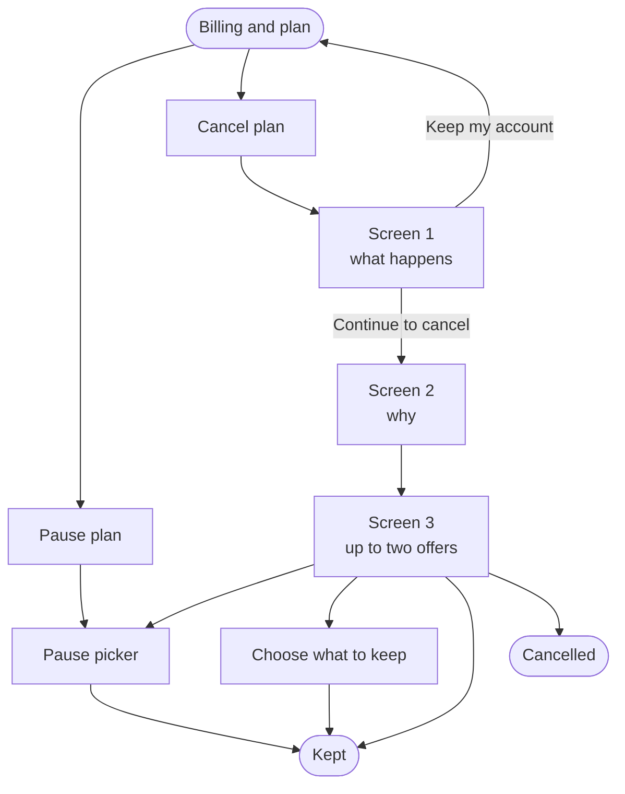

# Cancellation and retention flow - workflow

What the user sees and does, screen by screen. This replaces the cancellation dialog that exists today.

> **Locked 2026-09-28.** Copy, offer ladder, guard rails and edge cases are final and verified against the codebase. Every user-facing claim in here has been checked against what ContentStudio actually does. Changes from here need a new decision, not an edit.

Codebase pointers, billing mechanics and open technical questions are in the research doc and stay there.

---

## 1. The shape of it

---

## 2. Two ways in

| Button | Where | Opens |
|---|---|---|
| **Pause plan** | Billing and plan, beside Cancel | The pause picker directly. No warning screen, no reason question |
| **Cancel plan** | Billing and plan | Screen 1 |

---

## 3. Screen 1: what happens

1. User opens Settings, then Billing and plan, and clicks **Cancel plan**.
2. The heading names the date their plan ends: *"If you cancel, this is what happens on 14 January 2027."* Below it: *"Nothing is cancelled yet."*
3. A short list of what changes on that date. Only lines that apply to this account appear:
    - Publishing stops for all 31 connected accounts, across 6 workspaces
    - 9 team members lose access
    - Analytics, Brand Profiles and the media library are locked
    - The 24 posts already scheduled all publish before then
4. A closing line: *"Nothing changes before 14 January 2027. You can subscribe again afterwards and pick up where you left off."*
5. User clicks **Keep my account** and the dialog closes, or **Continue to cancel** and moves on.

---

## 4. Screen 2: why

6. One question: *"Before you go, can you tell us why?"* Below it: *"This helps us fix the right things. It will not slow down your cancellation, and there is one question."*
7. User picks one of seven reasons. An optional box below accepts anything else they want to say, and never blocks.
8. User clicks **Continue**, or **Back** to return to Screen 1.

| # | Reason |
|---|---|
| 1 | It's too expensive |
| 2 | I'm missing a feature I need |
| 3 | I'm switching to another tool |
| 4 | I'm not using it enough |
| 5 | I've run into technical issues or bugs |
| 6 | My business closed / no longer needs this |
| 7 | Other |

---

## 5. Screen 3: the offer

9. User sees at most two offers. The heading matches the first one.
10. User accepts one, clicks **Contact support**, which closes the dialog and opens the chat, or clicks **No thanks, continue to cancel**.

### What each reason leads to

| Reason | What the user is offered |
|---|---|
| It's too expensive | Up to two of: a pause, a move to a smaller plan, 20% off |
| I'm not using it enough | A pause, then 20% off |
| Other | The same as too expensive |
| I'm missing a feature I need | A box to describe it. Sending logs it on the support ticket the cancellation already raises |
| I've run into technical issues or bugs | A box to describe it. Sending logs it on the support ticket the cancellation already raises |
| I'm switching to another tool | Book a demo, or contact support |
| My business closed | Nothing. A graceful exit |

**Book a demo and contact support are the only two things offered where money is not the problem.** No phone call is offered anywhere in the flow, and no reply time is promised.

### Which offer comes first

The order is fixed. Whichever two apply first are the ones shown.

| Order | Offer | Shown when |
|---|---|---|
| 1 | Pause | The account barely publishes, and is not paying for a lot of extra social accounts or a premium feature |
| 2 | Move to a smaller plan | A smaller plan already covers every account, workspace and team member they have |
| 3 | 20% off | They have been with us over two years, publish heavily, and no smaller plan fits |
| 4 | Move to a smaller plan | A smaller plan nearly fits. They would drop up to 40% of their accounts |
| 5 | 20% off | Anything else |
| 6 | Pause | Always available if it is not already on the list |

**20% off is always the last thing offered that could apply.** Moving to a plan that fits is a one-off correction and leaves the price at list. A discount lowers the price for as long as they stay.

---

## 6. The pause picker

11. User picks 1, 2 or 3 months. Two is preselected.
12. The screen says exactly when billing restarts:
    - **Monthly**: *"Your current month runs to 14 October 2026. After that you are not billed until 14 December 2026, saving $576."*
    - **Annual**: *"Your year runs to 14 January 2027 as planned. Instead of renewing then, we hold the account and bill you on 14 March 2027."*
13. One line says what a pause does: *"While paused, publishing stops. Your 31 accounts stay connected, nothing is deleted, and your scheduled posts and automations pick up where they left off when you come back."*
14. User clicks **Pause for 2 months**.

Opened from Billing the other buttons are **Contact support** and **Not now**. Reached from the flow they are **Back**, **Contact support** and **No thanks, continue to cancel**.

---

## 7. Choose what to keep

Reached only from a move-to-a-smaller-plan offer where the account does not already fit.

15. User sees what fits and what does not: connected accounts, workspaces and team members against the smaller plan, and the new price.
16. A line under it: *"Your cancellation has already been stopped. If you leave this part way through, you stay on Agency Unlimited with nothing changed."*
17. User clicks **Complete downgrade**, which hands over to the existing plan change screen, or **Abandon workflow** and returns to Billing unchanged.

Where the smaller plan already covers everything they use, this screen is skipped and the offer applies directly.

---

## 8. Endings

There are two, and only two.

| Ending | Reached by | What the user sees |
|---|---|---|
| **Kept** | Accepting an offer, or taking a pause | *"You're all set."* Their plan, the reason they gave, and the next charge date |
| **Cancelled** | Going through | Access until the term ends, then the account is deactivated. Nothing is deleted, and they can subscribe again whenever they like |

### Hand-offs are not endings, and they get no screen

**Contacting support, sending a bug report, sending a feature request and booking a demo all close the dialog and open the destination.** No confirmation screen, no summary of what was just typed, no "Message sent."

The rule behind it: **the dialog never sits open behind the chat.** A chat is a whole conversation and a booking page is a whole page. Neither is a step inside cancelling, so the dialog gets out of the way instead of stacking a state on top of itself.

Nothing is cancelled at that point, so nothing is lost. The chat or booking page is the confirmation, and **Cancel plan** is one click away on the billing page if they still want it. The chat's first line says nothing has been cancelled, so it is stated somewhere the user is actually looking.

A support ticket is raised in Helpin on every cancellation regardless, carrying the reason and anything the user typed. Nothing in the flow promises a reply by a particular time.

---

## 9. Hard requirements

Not negotiable. Each one is here because losing it breaks something.

1. **The most we ever offer is a 20% discount, a pause, a smaller plan, a demo, or support.** Nothing else, on any path.
2. **Never more than two offers on a screen**, and exactly one of them is the lead.
3. **Never a discount to an account that already has one.** The billing record is checked before the offer is built.
4. **One save offer per account per twelve months**, and one pause per account per twelve months.
5. **The discount is permanent.** It stays for the life of the subscription, not three months.
6. **A pause never starts mid-period.** It begins when the period already paid for runs out.
7. **Every screen has a visible way out**, the same size and weight as the other buttons. The cancel path is never hidden, greyed or shrunk.
8. **Every screen offers Contact support**, which opens the support chat.
9. **The flow never claims anything about data deletion or emails that the product does not do.** Cancelling deactivates the account, deletes nothing and sends the customer no email. The flow says exactly that and no more.
10. **Posts already scheduled before the end date still publish.** The flow promises this, so it has to hold.
11. **A count of zero is never shown.** A line whose number is zero is left out, not printed as a zero.
12. **The flow never promises a reply, a timescale or a callback.** A ticket is raised, and that is what the user is told.
13. **No internal language on any screen.** No tier names, no branch names, no queue names, no reasoning about offers the user did not ask for.
14. **No phone call is offered anywhere.** Where a conversation is the right answer, the user gets **Book a demo** and **Contact support**, and nothing else.
15. **Every hand-off closes the dialog.** Contact support, a bug report, a feature request and a demo booking each close the modal and open the destination. No confirmation screen, and the dialog is never open behind the chat.
16. **The flow never writes a message on the user's behalf.** If they typed nothing, nothing is sent as though they had.
17. **A pause must leave the schedule intact.** Resuming restores the held posts and switches the automations back on. Without that, the pause offer cannot claim anything is waiting and should not be offered at all.

---

## 10. Edge cases

Each one changes what the user sees. Miss one and somebody hits a dead end.

| Case | What the user sees |
|---|---|
| **Subscription billed through Apple** | Cancelling is not possible here. Show Apple's instructions and stop. None of the offers apply |
| **Already on a discount** | No discount offer. A pause, and a smaller plan if one fits |
| **Already on a discount, and no smaller plan fits** | One offer only, a pause. One card, not two |
| **Used a save offer in the last twelve months** | No offers at all. Straight from the reason to the confirmation |
| **Paused in the last twelve months** | The Pause plan button on Billing is disabled, with a tooltip saying why |
| **Account under 60 days old** | Whatever reason they pick, they are offered a demo and support. No money |
| **Never published anything** | Screen 1 drops the loss framing. Screen 2 gains an eighth reason, *"I never got it set up"*. They are offered a demo and support |
| **No smaller plan exists** on Standard or API | The ladder is a pause and 20% off |
| **API plan** | Monthly and annual cost the same, so there is nothing to gain by changing cycle. The ladder is a pause and 20% off |
| **Enterprise** | No automated offer at any point. A demo or support, always. Pause is arranged with the account team |
| **Paying for a lot of extra social accounts, or a premium feature** | Never treated as a light user, whatever their post count. They always reach the discount |
| **One workspace** | Screen 1 says nothing about workspaces |
| **One team member** | Screen 1 says nothing about team members |
| **Nothing scheduled** | Screen 1 drops the scheduled posts line |
| **Cancelling during a pause** | Allowed, in one click, and it does not restart this flow |
| **Resuming after a pause** | The account unlocks, the held posts return to the schedule, and the automations switch back on. Anything whose slot passed while paused is left as a draft rather than published late |
| **Subscribing again after cancelling** | Available from the billing page at any time. No deadline, because nothing is deleted on a timer. Everything is as they left it |

---

## 11. Questions the flow cannot answer on its own

- Who can reach this? If a team member without billing permission opens Billing, is Cancel plan visible to them at all?
- After a pause ends and billing restarts, is the customer warned before the charge, and how far ahead?
- Should the two reasons the current dialog has and this one does not be kept: *already paying for another account*, and *could not upgrade or downgrade due to a credit card issue*?
