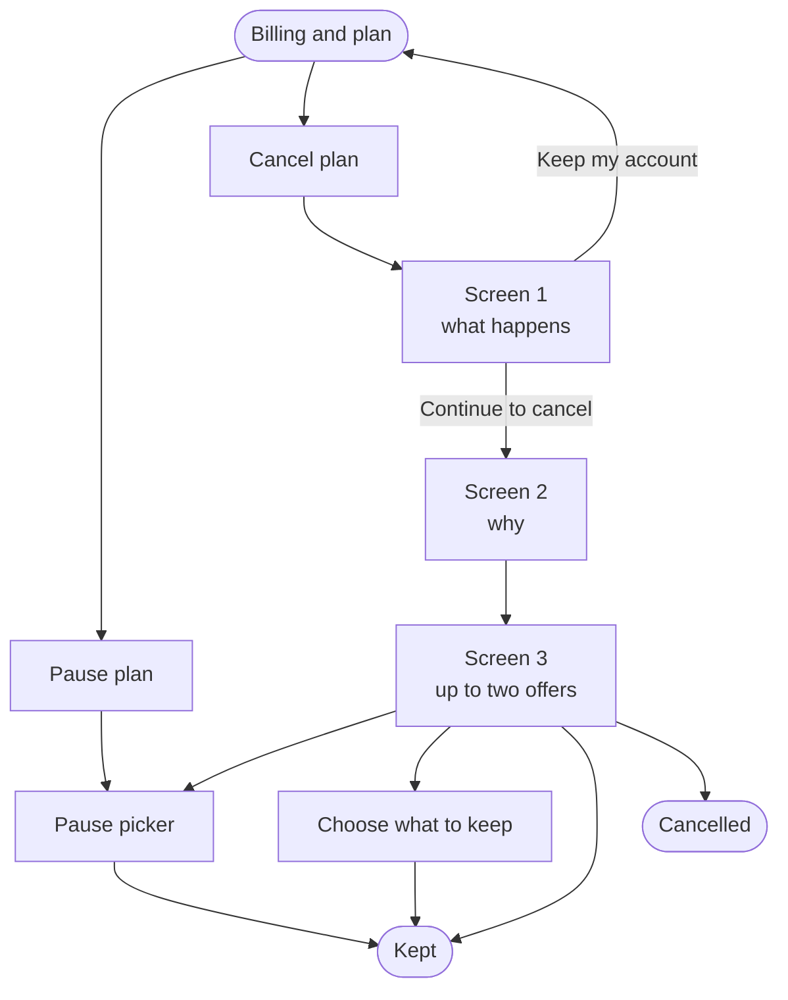

# **PRD: Cancellation and retention flow**

**Author:** Ghulam Jaffar
**Last Updated:** 2026-09-28
**Status:** Locked

> **Locked 2026-09-28.** Copy, offer ladder, guard rails and edge cases are final and verified against the codebase. Every user-facing claim in here has been checked against what ContentStudio actually does. Changes from here need a new decision, not an edit.
**Target Release:** TBD

---

## **1. Overview**

When a customer clicks Cancel plan today they get a two step dialog that asks why and offers a pause. It captures a reason and lets them go. This replaces it with a flow that first shows what cancelling actually costs them, then asks why, then makes at most two offers chosen from what we know about the account. Offers are capped at five things: a 20% discount, a pause, a move to a smaller plan, a demo, or the support chat. No phone call is offered anywhere. A separate Pause plan button on Billing lets somebody pause without starting to cancel at all.

---

## **2. Problem Statement**

**What problem are we solving?**

Three things, in order of size.

**The current flow makes one offer to everybody.** A customer paying $5,688 a year and a customer paying $228 see the same screen. So does a customer who publishes 142 posts a month and one who has never published at all. The offer that would keep each of them is different, and we make none of those distinctions.

**A customer who wants to stop paying for a while has to cancel to find out they could pause.** Pause exists and works, but it is buried inside a cancellation flow. Somebody who just needs two months off has to start cancelling to discover it.

**We cannot tell a saved account from an unsaved one.** There is no record of what was offered, whether it was taken, or whether the account survived. Without that, no discount policy can be evaluated and a permanent discount given today is invisible next year.

A fourth, quieter problem: **the flow currently offers nothing at all to an account that has never published.** A failed activation is treated as a churn, and money is the wrong answer to it.

---

## **3. Goals & Success Metrics**

| Type | Goal | Target | Source |
| ----- | ----- | ----- | ----- |
| Primary goal | Save a share of voluntary cancellations | Baseline first, then a target. No baseline exists today | `save_offer_accepted` against `cancellation_flow_started` |
| Primary goal | Saved accounts survive | 90 day survival above 70% of saves | Billing data |
| Secondary goal | Pause used without entering the cancel flow | 25% of pauses come from the Billing button | Flow analytics |
| Secondary goal | Never-activated accounts take the setup offer | 50% of setup offers accepted | `save_offer_accepted` |
| Guard rail | Discounted accounts do not churn at the next renewal | Renewal rate within 10 points of undiscounted | Billing data |
| Guard rail | No rise in support tickets about cancelling | No increase over the 90 days after launch | Helpin |
| Guard rail | Time from Cancel plan to cancelled | No slower than today for a user who declines every offer | Flow analytics |

**The guard rails matter more than the primary goal here.** A save rate is easy to inflate by making cancellation harder or by discounting everyone. Both are failures dressed as success.

### **3.1 Analytics Events (Usermaven)**

| Event Name | Trigger | Payload | What we measure with it |
| ----- | ----- | ----- | ----- |
| `cancellation_flow_started` | User opens the flow from Billing, FE | `{ plan, billing_cycle, entry_point }` | How many reach the flow, and from where |
| `cancellation_reason_given` | User continues past the reason screen, FE | `{ plan, reason }` | Reason mix, and which reasons grow |
| `save_offer_shown` | Offer screen renders, FE | `{ plan, reason, offers }` | Which offers people actually see |
| `save_offer_accepted` | User accepts an offer, FE | `{ plan, reason, offer }` | Take rate per offer, the number the whole feature turns on |
| `subscription_paused` | Pause confirmed, FE | `{ plan, months, entry_point }` | Pause volume, and the split between entry points |
| `subscription_cancelled` | Cancellation completes, FE | `{ plan, reason, offers_declined }` | Churn with the offers that failed attached |

`entry_point` is `billing_button` or `cancel_flow`. `offers` is the list shown. No PII beyond what identify already carries.

**These six are the whole measurement story.** Without `save_offer_shown` alongside `save_offer_accepted` there is no take rate, only a count.

---

## **4. Target Users**

| User | Context | What they need from this |
| ----- | ----- | ----- |
| **Agency owner on Agency Unlimited** | Paying $1,188 plus add-ons, publishes heavily across many accounts | To be talked to like a large customer, not shown a form |
| **Small business on Standard** | Paying $228 a year, publishes a few times a month | A pause, or a real reduction. Not a downgrade that does not exist |
| **Over-provisioned customer** | On Agency, uses 8 of 25 accounts | The right plan. They have a fit problem, not a price problem |
| **Customer who never activated** | Signed up, connected one account, never published | Help getting started, not a discount |
| **Seasonal customer** | Busy half the year | A pause they can find without cancelling |
| **Customer with a real problem** | A bug, or a missing feature | Support, not money. A discount reads as a bribe |

---

## **5. User Stories / Jobs to Be Done**

- As a customer who needs to cut costs, I want to see what my options are before I lose access, so I can decide without guessing.
- As a customer taking a break, I want to pause without cancelling, so I do not have to rebuild my workspace later.
- As a customer whose plan is bigger than my usage, I want to be moved to the right plan, so I stop paying for capacity I do not use.
- As a customer who never got started, I want help rather than a discount, so the product actually works before I pay for another month.
- As a customer with a bug, I want it escalated, so somebody fixes it instead of offering me money.
- As a customer who has decided, I want to leave quickly and know exactly what happens to my data.

---

## **6. Requirements**

### **6.1 Must Have (P0)**

- Three screens: what happens, why, and the offer. Plus a pause picker and a plan change handoff.
- A **Pause plan** button on Billing, beside Cancel plan, opening the pause picker directly.
- Offers capped at five things: 20% off, a pause, a move to a smaller plan, a demo, or the support chat. Never more than two on a screen, exactly one of them the lead.
- 20% on both cycles, applied to the account total, **kept for the life of the subscription**.
- Never a discount to an account that already carries one.
- One save offer, and one pause, per account per twelve months.
- A pause of 1, 2 or 3 months that always begins when the paid period runs out.
- **Contact support** on every screen. It closes the dialog and opens the support chat, with no confirmation screen in between.
- The outcome recorded against the account: kept or cancelled.
- Every screen keeps a visible way out, the same size and weight as the other buttons.
- A count of zero is never printed. The line is left out.
- Apple billed subscriptions are detected and shown Apple's instructions instead.

### **6.2 Should Have (P1)**

- A win-back email after cancellation. There is no cancellation email of any kind today, so this is a new build, not a change.
- Reasons mapped from the current list so historical reporting survives.

### **6.3 Nice to Have (P2)**

- Win back emails at day 30 and day 90.
- A data export at the graceful exit, which does not exist in the product today.

### **6.4 Explicitly Out of Scope**

- **The plan change screen itself.** The flow hands over to it and stops.
- **Involuntary churn.** Failed cards never reach this flow and are a larger, separate project.
- **Mobile.** Cancellation is not in the Flutter app, and Apple billed subscriptions are cancelled through Apple.
- **Refunds.** Nothing in this flow gives money back.
- **Deeper than 20%.** Anything beyond it is settled in a conversation, not on a screen.

---

## **7. User Flow (High Level)**

Screen by screen detail, all copy, the offer order and every edge case are in the workflow doc.

---

## **8. Business Rules & Constraints**

| Rule ID | Rule | Rationale |
| ----- | ----- | ----- |
| BR-1 | The most ever offered is 20% off, a pause, a smaller plan, a demo, or the support chat | Keeps the flow predictable and stops it becoming a negotiation |
| BR-2 | At most two offers per screen, exactly one styled as the lead | Two choices decide, three deliberate |
| BR-3 | No discount to an account that already carries one | Stacking is how a plan quietly reaches half price permanently |
| BR-4 | One save offer per account per twelve months | Stops the base learning that threatening to leave earns a discount |
| BR-5 | One pause per account per twelve months, maximum three months | Past a quarter a pause stops being a pause. Two unpaid quarters is churn, whatever the billing record says |
| BR-6 | A pause begins when the paid period runs out, never mid period | The customer keeps what they have already bought |
| BR-7 | The discount is permanent, not a promotion | Decided at the demo. It is also the most expensive rule here |
| BR-8 | The discount is always the last rung that could apply | A plan change is a one off correction, a discount never stops costing |
| BR-9 | Accounts over $400 a month, and all Enterprise, are offered a demo or support before any automated offer | No screen should give away four figures unreviewed |
| BR-10 | Accounts under 60 days old, or that have never published, are offered help and never money | A discount cannot fix a product they never got working |
| BR-11 | Spend decides the treatment above a threshold, not post count | A customer paying for 50 accounts is valuable whether or not they post |
| BR-12 | Only social accounts and premium feature add-ons count toward that spend | Workspaces and users are unlimited on Agency, and credits are consumption |
| BR-13 | A smaller plan is only offered if the customer could accept it | Offering a move that means disconnecting 21 accounts is not an offer |
| BR-14 | The flow claims nothing about data deletion or emails that the product does not do | Cancelling deactivates the account, deletes nothing and sends no email. A promise we do not keep is worse than no promise |
| BR-15 | Posts scheduled before the end date still publish | The flow promises it, so it has to hold |
| BR-16 | No internal language on any customer screen | Tier names, branch names and queue names are ours, not theirs |
| BR-17 | No phone call is offered anywhere. Where a conversation is the right answer, the screen offers **Book a demo** and **Contact support** | Nobody is staffed to make calls, and an offer we cannot keep is worse than no offer |
| BR-18 | Every hand-off closes the dialog and opens the destination. No confirmation screen, and the dialog is never open behind the chat | A chat is a destination, not a step inside cancelling. Nothing is cancelled at that point, so there is nothing to confirm |
| BR-19 | The flow never composes a message on the user's behalf | Prefilling a chat with words the customer did not write misrepresents them to our own support team |
| BR-20 | Resuming from a pause restores the held scheduled posts and re-enables the automations | Pause currently reverts pending posts to drafts and switches automations off, and resume restores neither. A save that hands back a dismantled workspace is worse than the cancellation |
| BR-21 | A post whose scheduled slot passed during the pause comes back as a draft, not a late publish | Publishing a fortnight-old post to a customer's audience on their behalf is its own incident |

**Legal constraint.** Germany requires a cancellation button as easy as signup, California's automatic renewal law and FTC enforcement under ROSCA point the same way. One confirmation and one offer, with a visible exit on every screen, is comfortably inside that. Adding friction, hiding the exit or requiring a call to cancel is not.

---

## **9. Open Questions**

| # | Question | Blocks | Owner |
| ----- | ----- | ----- | ----- |
| 1 | Are the four existing discount codes set to 20%, and should the flow reuse them or get its own? | Reporting. Reusing makes save and promotional discounts indistinguishable | Whoever owns Paddle |
| 2 | Does pausing suspend the jobs that refresh social tokens? | Whether three months is safe to offer | Engineering |
| 3 | Can a team member without billing permission see Cancel plan? | Who the flow is even for | Product |
| 4 | Keep the two current reasons this spec drops: *already paying for another account*, and *credit card issue*? | The reason list, and continuity of reporting | Product |
| 5 | After a pause ends, how far ahead is the customer warned before billing restarts? | Whether the resume feels like a surprise charge | Product |
| 6 | Which booking page does **Book a demo** open, and who picks the booking up? | Whether the demo rung can ship | Product |

Question 2 is the one that can turn the best save into a delayed churn, and it needs an answer before three months is offered to anyone.

---

## **10. Risks & Mitigations**

| Risk | Impact | Mitigation |
| ----- | ----- | ----- |
| The permanent discount compounds. A saved annual account costs $547.60 every year, not once | High | Track 90 day survival from launch. A save that churns next year is a pure loss and is otherwise invisible |
| Save rate flatters the flow | High | Measure survival and the renewal rate of discounted accounts, never save rate alone |
| Two cancellation dialogs exist. Shipping into one leaves two experiences live | Medium | Establish which is live for which cohort before touching either |
| Apple billed customers hit a flow that cannot cancel them | Medium | Detect and divert at the top of the flow. Named as P0 |
| A pause returns a customer to disconnected accounts | Medium | Answer question 2 before offering three months. Cap the pause at the shortest token lifetime if needed |
| Offer logic in the client is manipulable | High | The server decides what may be offered and re-checks on accept |

---

## **11. Dependencies**

- **The existing plan change screen**, which the smaller plan offer hands over to. Its completion rate is currently unmeasured and becomes part of this feature's numbers.
- **Helpin**, for the support ticket every cancellation already raises, and for the chat.
- **Paddle**, for the discount codes, the pause and the plan change.
- **The existing cancellation ticket**, which already emails a Helpin-routed inbox on every cancellation and needs only the new reason list.

---

## **12. Appendix**

- **Locked prototype**, version 43: https://claude.ai/artifact/2RuyPekdyeQheZCdknWfQ8
- **Locked spec**: https://claude.ai/code/artifact/0eff1388-eb6c-4b8c-b541-28d889edc0e1
- Screen copy, offer order and all 21 edge cases: the workflow doc
- Codebase pointers and what already exists: the research doc

All 5,120 combinations of plan, cycle, usage, add-ons, existing discount, offer history and reason were enumerated against BR-1 through BR-13. No combination produces an offer outside the allowed set, two discounts, or an empty offer screen.

---

## **Changelog**

| Date | Change |
| ----- | ----- |
| 2026-09-25 | First draft. Scope locked against prototype version 36 |
| 2026-09-28 | Verified every user-facing claim against the codebase. Removed the retention window, the deletion date and the reactivation emails, none of which exist. No phone call anywhere. Hand-offs close the dialog. Added BR-17 to BR-21. Locked |
