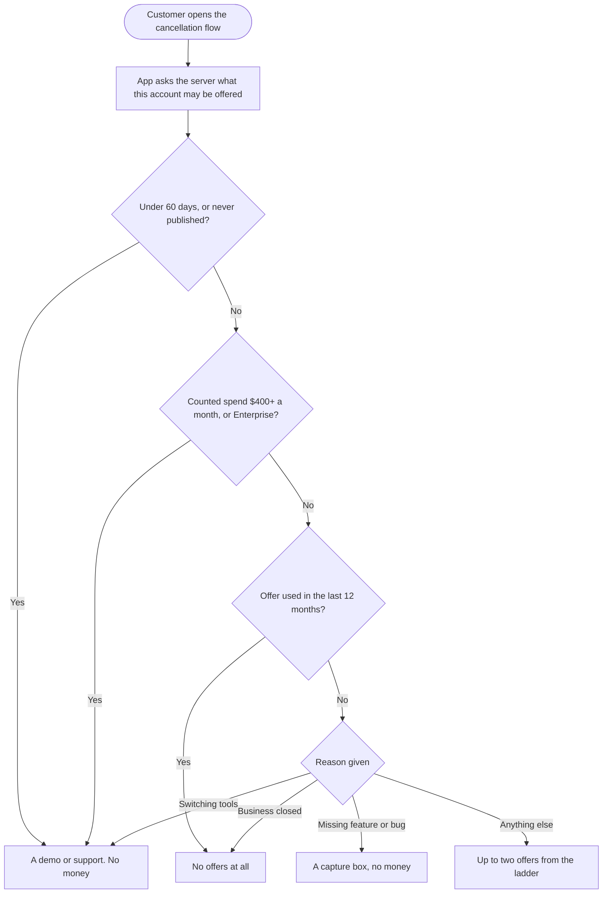
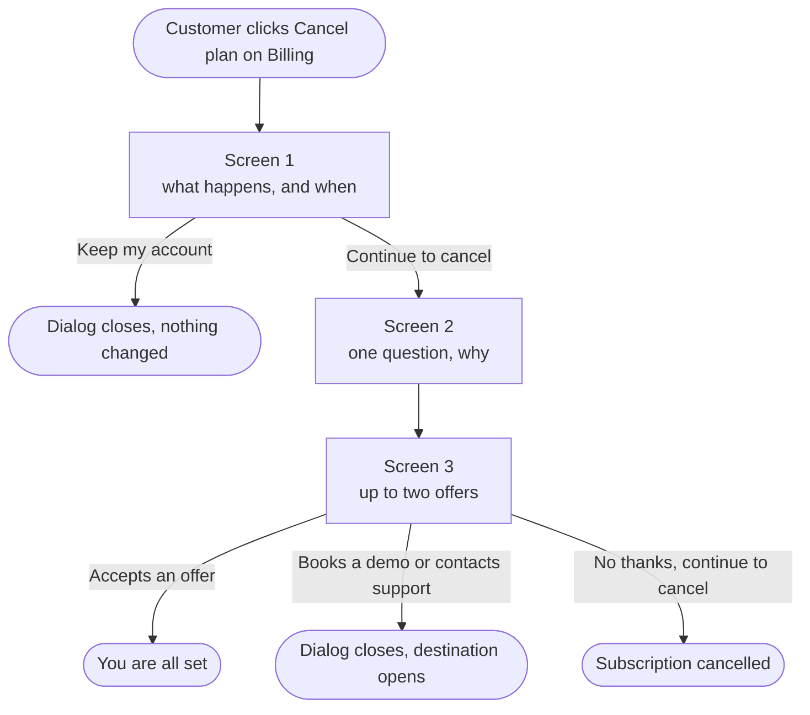

# Cancellation and retention flow - epic and stories

> **Authored 2026-09-28.** Markdown first. Nothing is created in Helpin until the PO approves this batch in the moment.

**7 stories:** 1 `[Design]`, 4 `[BE]`, 2 `[FE]`. No `[Flutter]` story - see the note at the end.

| # | Title |
|---|---|
| 1 | `[Design] Design the cancellation and retention flow screens` |
| 2 | `[BE] Build the save offer engine for the cancellation flow` |
| 3 | `[BE] Apply a permanent 20% save discount and record it against the account` |
| 4 | `[BE] Add a fixed one to three month pause with a scheduled resume date` |
| 5 | `[BE] Restore held scheduled posts and automations when a subscription resumes` |
| 6 | `[FE] Rebuild the cancel plan dialog with the consequences, reason and offer screens` |
| 7 | `[FE] Add a Pause plan button and pause picker to the billing page` |

---

# EPIC: Cancellation and retention flow

### Description

Cancelling a ContentStudio subscription today opens a two step dialog that asks why and offers an indefinite pause. It captures a reason and lets the customer go. Every customer sees the same screen regardless of what they pay, how much they use the product or how long they have been with us.

This epic replaces that dialog with a flow that first shows what cancelling actually costs the customer, then asks why, then makes at most two offers chosen from what we already know about the account.

**The most we ever offer is a 20% discount, a pause, a move to a smaller plan, a demo, or the support chat.** Nothing else, on any path. That cap was verified by enumerating all 5,120 combinations of plan, billing cycle, usage shape, add-on set, existing-discount state, offer history and reason. No combination produces an offer outside that set, none produces two discounts, and none produces an empty offer screen.

A separate **Pause plan** button on the billing page lets someone pause without starting to cancel at all.

### Why now

Cancellation is the only moment where a customer tells us exactly what is wrong and is still reachable. We currently spend that moment on a form. Meanwhile the offer that would actually keep a given customer is different for each one: a discount to somebody who never publishes just moves the churn one cycle out and lowers lifetime value, while a pause to an agency paying for 75 extra social accounts is an insult.

### What is in scope

- A three screen cancellation flow: what happens, why, and up to two offers
- A backend offer engine that decides the offers from spend, usage and tenure, with guard rails that run before the reason is even consulted
- A permanent 20% save discount, applied to the account total, never stacked on an existing discount, once per account per twelve months
- A fixed one to three month pause with a scheduled resume date, reachable both from the flow and directly from billing
- Restoring the customer's schedule and automations when a pause ends
- Booking a demo and contacting support as the two hand-offs where money is not the answer

### What is deliberately out of scope

- **Involuntary churn.** Failed cards and expired payment methods never reach this flow. It is a larger source of churn than this epic addresses and deserves its own work.
- **Win-back emails.** Nothing is emailed to a cancelling customer today. Adding that is a new build, not a change to this flow.
- **A data export.** ContentStudio does not have one, so the flow cannot offer one.
- **The paused-account lockout.** Being unable to publish while not paying is defensible and stays as it is.
- **Deeper than 20%.** Anything beyond it is settled in a conversation, not on a screen.

### Guard rails, in order

The first one that matches wins, and the reason is never consulted.

1. **Under 60 days old, or never published** - a failed activation, not churn. Offer a demo or support, never money.
2. **$400 a month or more in counted spend, or any Enterprise account** - offer a demo or support before any automated offer.
3. **An offer was used in the last twelve months** - no offers at all.
4. **The plan already carries a discount** - no discount rung. Pause and a smaller plan still apply.
5. **The business has closed** - no offer. A graceful exit.

### Hard requirements

These are not negotiable and each one is here because losing it breaks something.

1. The most ever offered is a 20% discount, a pause, a smaller plan, a demo, or support.
2. Never more than two offers on a screen, and exactly one of them is the lead.
3. Never a discount to an account that already carries one.
4. One save offer, and one pause, per account per twelve months.
5. The discount is permanent - it stays for the life of the subscription.
6. A pause never starts mid-period. It begins when the paid period runs out.
7. Every screen has a visible way out, the same size and weight as the other buttons.
8. Nothing on any screen promises a reply, a timescale or a callback.
9. No phone call is offered anywhere.
10. Every hand-off closes the dialog and opens the destination. No confirmation screen.
11. The flow never composes a message on the customer's behalf.
12. The flow claims nothing about data deletion or emails that the product does not do.
13. A count of zero is never printed. The line is left out.
14. No internal language on any customer screen.

### Success measures

| Measure | Why it is here |
|---|---|
| Save rate **by branch** | So we can kill offers that do not work rather than averaging them away |
| 90 day survival of saved accounts | The number that says whether a save was real |
| Lifetime value of discounted saves against baseline | Whether discounting buys time or destroys value |
| Pause resumption rate, and churn within 90 days of returning | Whether pause works or just defers |
| Downgrade completion rate | The strongest offer hands off to a workflow nothing currently measures |

### Interactive prototype

Every screen in the flow, with real ContentStudio pricing and plan limits, plus a flow board of all branches underneath: https://claude.ai/artifact/2RuyPekdyeQheZCdknWfQ8

Full written spec, including the offer ladder, the tier definitions and every edge case: https://claude.ai/code/artifact/0eff1388-eb6c-4b8c-b541-28d889edc0e1

---

# 1. `[Design] Design the cancellation and retention flow screens`

### Description:

As a designer, I want to produce the final screens for the cancellation and retention flow so that engineering builds one consistent experience rather than interpreting a prototype seven different ways.

### Workflow:

1. Designer reviews the interactive prototype and the written spec, which between them define every screen, every branch and all final copy.
2. Designer produces the design file covering the five screens and their variants.
3. Designer specifies the two offer card treatments: one lead card and one secondary card. Exactly one card on any screen is the lead.
4. Designer hands over to the two frontend stories.

### Screens to cover

| Screen | Variants |
|---|---|
| Consequences | Standard, and a "never published" variant that drops the loss framing |
| Reason | Seven reasons, plus an eighth shown only to accounts that have never published |
| Offer | Up to two cards, one lead. Plus the demo and support pair, and the feature and bug capture boxes |
| Pause picker | One, two and three months, entered from the flow and entered directly from billing |
| Choose what to keep | The downgrade hand-off, shown only when the smaller plan does not already fit |

### Acceptance criteria:

- [ ] All five screens are designed, with every variant listed above
- [ ] Two offer card treatments exist, a lead and a secondary, and they are visually distinct at a glance
- [ ] Every screen shows a visible exit that is the same size and weight as the other footer buttons - the cancel path is never hidden, greyed or shrunk
- [ ] Footer button order and hierarchy is specified for each screen
- [ ] Empty, loading and error states are designed for the offer screen, which waits on a server response
- [ ] Designs use components from the existing design system and any gap is flagged explicitly rather than drawn as a one-off
- [ ] Colours come from the theming variables so white-label domains render correctly - no hardcoded blues
- [ ] Mobile and small-viewport behaviour is specified for every screen
- [ ] Designs carry the final copy from the spec, not placeholder text

### Mock-ups:

Interactive prototype, all screens and all branches: https://claude.ai/artifact/2RuyPekdyeQheZCdknWfQ8

Written spec with the full copy: https://claude.ai/code/artifact/0eff1388-eb6c-4b8c-b541-28d889edc0e1

### Impact on existing data:

None. Design only.

### Impact on other products:

None. The cancellation flow is web only. The mobile app has no cancellation path.

### Dependencies:

None. This story starts the epic and unblocks both frontend stories.

### Global quality & compliance (wherever applicable)

- [ ] Mobile responsiveness (frontend only, N/A for backend-only stories)
- [ ] Multilingual support (frontend + backend, translations available or fallback handled)
- [ ] UI theming support (default + white-label, design library components are being used)
- [ ] White-label domains impact review
- [ ] Cross-product impact assessment (web, mobile apps, Chrome extension)
- [ ] Developer surfaces coverage - N/A, design story, nothing API-facing changes

---

# 2. `[BE] Build the save offer engine for the cancellation flow`

### Description:

As a product owner, I want the server to decide which save offers a cancelling customer may see, so that the offer matches what the account is actually worth and a customer cannot grant themselves a discount from the browser console.

### Workflow:

1. Customer opens the cancellation flow and the app asks the server what this account may be offered.
2. Server works through the guard rails in order. The first that matches wins and the reason is never consulted.
3. If no guard rail matches, the server picks up to two offers from the ladder and returns them in order, the first being the lead.
4. Customer accepts an offer, and the server re-checks that the offer was genuinely permitted for this account before doing anything.

### What the engine reads

| Input | Meaning |
|---|---|
| Plan and billing cycle | Which plan, monthly or annual |
| Account total | The plan price plus every add-on. This is what the customer pays and what a discount applies to |
| Counted spend | The plan price plus social account add-ons and premium feature add-ons only. This decides the tier |
| Connected accounts, workspaces, team members | Against the limits of the tier below, to decide whether a smaller plan fits |
| Posts in the last rolling 30 days, and posts ever | Usage |
| Account age | Tenure |
| Existing discount on the plan | Whether the discount rung is available at all |
| Save offer used in the last 12 months | Whether any offer is available at all |

**Only social account add-ons and premium feature add-ons count toward spend.** Workspace and team member add-ons are ignored because both are unlimited on Agency Unlimited. Credit packs are ignored because consumption is not commitment.

### The ladder

At most two offers are returned, in this order. Whichever two apply first are the ones shown.

| Order | Offer | Returned when |
|---|---|---|
| 1 | Pause | The account barely publishes and is not paying for extra social accounts or a premium feature |
| 2 | Move to a smaller plan | A smaller plan already covers every account, workspace and team member in use |
| 3 | 20% off | Two years or more with us, publishing heavily, and no smaller plan fits |
| 4 | Move to a smaller plan | A smaller plan nearly fits - up to 40% of accounts would be dropped |
| 5 | 20% off | Anything else |
| 6 | Pause | Always available if it is not already on the list |

**20% off is always the last rung that could apply.** Moving to a plan that fits is a one-off correction that leaves the price at list. A discount lowers the price for as long as the customer stays.

### Acceptance criteria:

- [ ] A cancelling customer's permitted offers are decided on the server and returned to the app, which renders only what it is given
- [ ] Accepting an offer is re-checked on the server against the same rules before anything is applied, and a request for an offer the account was never entitled to is rejected
- [ ] The guard rails run in the documented order and the first match wins, with the reason ignored
- [ ] An account under 60 days old, or that has never published, is offered a demo or support and never a discount, whatever reason it gives
- [ ] An account at $400 a month or more in counted spend, or on Enterprise, is offered a demo or support before any automated offer
- [ ] An account that used a save offer in the last twelve months receives no offers at all
- [ ] An account whose plan already carries a discount never receives the discount rung, and still receives pause and a smaller plan where those apply
- [ ] A reason of "My business closed" returns no offers
- [ ] No response ever contains more than two offers
- [ ] No response ever contains two discounts
- [ ] No response is ever empty for an account that passed the guard rails
- [ ] Counted spend includes the plan and social account, SSO, white label and social listening add-ons, and excludes workspace add-ons, team member add-ons and all credit packs
- [ ] A smaller plan is only offered where the account could actually accept it - it is never offered when it would mean disconnecting more than 40% of connected accounts
- [ ] Offers are decided from counted spend rather than post count above the spend threshold, so an account paying for 50 social accounts reaches the discount whether or not it publishes often
- [ ] A `save_offer_shown` Usermaven event fires when offers are returned, with `{ plan, reason, offers }`

### Mock-ups:

The live tier readout in the prototype shows which offers any given account combination produces - change the plan, billing cycle, account shape and add-ons and watch the ladder change: https://claude.ai/artifact/2RuyPekdyeQheZCdknWfQ8

Tier definitions and the full enumeration: https://claude.ai/code/artifact/0eff1388-eb6c-4b8c-b541-28d889edc0e1

### Impact on existing data:

No migration. The engine reads existing subscription, add-on, workspace and post data. It needs one new piece of state: the record of a save offer having been made to an account, which is created by **[BE] Apply a permanent 20% save discount and record it against the account**.

### Impact on other products:

None. The mobile app has no cancellation path, and the offer engine is not exposed publicly.

### Dependencies:

- **[BE] Apply a permanent 20% save discount and record it against the account** owns the offer-history record this engine reads for the once-per-twelve-months rule. Either story can be built first, but the rule cannot be verified until both exist.

### Global quality & compliance (wherever applicable)

- [ ] Mobile responsiveness - N/A, backend-only story
- [ ] Multilingual support (frontend + backend, translations available or fallback handled)
- [ ] UI theming support - N/A, backend-only story
- [ ] White-label domains impact review
- [ ] Cross-product impact assessment (web, mobile apps, Chrome extension)
- [ ] Developer surfaces coverage - N/A, the offer engine is internal to the cancellation flow and is deliberately not exposed on the public API, CLI or MCP server

---

# 3. `[BE] Apply a permanent 20% save discount and record it against the account`

### Description:

As a product owner, I want an accepted save discount to be applied to the customer's subscription and recorded against the account, so that the price actually changes and the same customer cannot collect a discount every year by threatening to leave.

### Workflow:

1. Customer accepts the 20% offer on the cancellation screen.
2. Server confirms the account was entitled to that offer, and that the plan does not already carry a discount.
3. Server applies the discount to the subscription so the customer's next charge and every charge after it is 20% lower.
4. Server records that a save offer was made and accepted, with the date, so the once-per-twelve-months rule can be enforced.
5. Customer's cancellation is abandoned and they land on a confirmation showing their plan and their next charge date.

### What "permanent" means

The discount stays for the life of the subscription. It is not a three month promotion and it does not expire. That is the most expensive rule in this epic and it is deliberate: a discount the customer has to re-negotiate every quarter produces a second cancellation conversation every quarter.

It applies to the **account total** - the plan plus every add-on - because that is what the customer pays and what they were comparing against when they decided to leave.

### Acceptance criteria:

- [ ] Accepting the 20% offer reduces the subscription price by 20% from the next charge onward
- [ ] The discount applies to the account total, including add-ons, not to the plan price alone
- [ ] The discount does not expire and is not reversed on renewal
- [ ] An account whose plan already carries a discount cannot receive this one, and the attempt is rejected rather than stacked
- [ ] Accepting an offer records it against the account with the date and which offer it was
- [ ] A second save offer to the same account within twelve months of the recorded date is refused
- [ ] The customer's pending cancellation is abandoned when an offer is accepted, and their subscription continues unchanged apart from the price
- [ ] The same rules are enforced on both billing stacks, following the existing branch
- [ ] A `save_offer_accepted` Usermaven event fires with `{ plan, reason, offer }`
- [ ] If applying the discount at the payment provider fails, nothing is recorded against the account and the customer sees an error rather than a silent no-op

### Mock-ups:

The discount screens, including what the saving looks like on monthly and annual for every plan: https://claude.ai/artifact/2RuyPekdyeQheZCdknWfQ8

### Impact on existing data:

Adds a record of save offers made to an account. Existing subscriptions are untouched until a customer accepts an offer.

Four discount codes already exist in the payment provider configuration. Confirm what depth they are actually set to before reusing them, and prefer a code specific to this flow so the saves can be reported on separately.

### Impact on other products:

A discounted price is visible wherever the plan price is shown, including the mobile app's billing screens. Those read the price from the API, so no mobile change is expected - worth confirming that a discounted total renders correctly rather than the list price.

### Dependencies:

- **[BE] Build the save offer engine for the cancellation flow** decides whether the discount may be offered at all. This story applies it and owns the record that engine reads.

### Global quality & compliance (wherever applicable)

- [ ] Mobile responsiveness - N/A, backend-only story
- [ ] Multilingual support (frontend + backend, translations available or fallback handled)
- [ ] UI theming support - N/A, backend-only story
- [ ] White-label domains impact review
- [ ] Cross-product impact assessment (web, mobile apps, Chrome extension)
- [ ] Developer surfaces coverage - N/A, applying a save discount is internal to the cancellation flow and is deliberately not exposed on the public API, CLI or MCP server

---

# 4. `[BE] Add a fixed one to three month pause with a scheduled resume date`

### Description:

As a customer who needs a break rather than an exit, I want to pause my subscription for a set number of months and have it start again on its own, so that I do not have to remember to come back and I am not billed while I am away.

### Workflow:

1. Customer chooses one, two or three months on the pause picker, from the cancellation flow or directly from the billing page.
2. Server schedules the pause to begin when the period the customer has already paid for runs out.
3. Nothing changes until that date. Publishing, automations and analytics all carry on as normal.
4. On that date the pause begins and billing stops.
5. On the resume date the subscription starts again on its own and the customer is billed as usual.

### How the two cycles differ

| Cycle | What a pause does |
|---|---|
| **Monthly** | The current month runs to its end. Billing then stops for the chosen number of months and restarts after that |
| **Annual** | The year runs to its end as planned. Instead of renewing then, the renewal is deferred by the chosen number of months |

### What already works and what is missing

Pausing already begins at the end of the paid period, which is exactly the rule this flow needs, and resuming already exists. What is missing is a **duration**: today's pause is indefinite and has to be undone by hand. This story adds the scheduled resume date so a one, two or three month pause genuinely ends on its own.

### Acceptance criteria:

- [ ] A customer can pause for one, two or three months, and the chosen duration is stored with the subscription
- [ ] The pause begins when the already-paid period ends, never mid-period
- [ ] Between the request and that date, nothing about the account changes - publishing, automations and analytics all continue
- [ ] The subscription resumes on its own on the resume date, with no manual action from the customer or from support
- [ ] On a monthly plan, no charge is taken for the paused months and billing restarts on the resume date
- [ ] On an annual plan, the renewal is deferred by the paused months rather than a charge being skipped
- [ ] A pause longer than three months cannot be created through this flow
- [ ] A second pause on the same account within twelve months of the last one is refused
- [ ] A customer can cancel outright while paused, in one action, without going through the cancellation flow again
- [ ] The resume date is returned to the app so the pause picker can state it exactly
- [ ] The same behaviour holds on both billing stacks, following the existing branch
- [ ] A `subscription_paused` Usermaven event fires with `{ plan, months, entry_point }`

### Mock-ups:

The pause picker with dated outcomes for both cycles: https://claude.ai/artifact/2RuyPekdyeQheZCdknWfQ8

### Impact on existing data:

Existing indefinite pauses stay as they are and are not migrated to a duration. Confirm how an already-paused account behaves if it reaches this flow.

### Impact on other products:

None directly. The mobile app has no pause control, though a paused account's state is visible there.

### Dependencies:

- **[BE] Restore held scheduled posts and automations when a subscription resumes** must ship with this story. Without it the pause hands the customer back a workspace with its queue dismantled, and the pause offer cannot claim anything is waiting.

### Global quality & compliance (wherever applicable)

- [ ] Mobile responsiveness - N/A, backend-only story
- [ ] Multilingual support (frontend + backend, translations available or fallback handled)
- [ ] UI theming support - N/A, backend-only story
- [ ] White-label domains impact review
- [ ] Cross-product impact assessment (web, mobile apps, Chrome extension)
- [ ] Developer surfaces coverage - N/A, pausing is a billing action inside the app and is deliberately not exposed on the public API, CLI or MCP server

---

# 5. `[BE] Restore held scheduled posts and automations when a subscription resumes`

### Description:

As a customer coming back from a pause, I want my scheduled posts and my automations to be working again, so that pausing costs me a break in publishing rather than the whole schedule I built.

### Workflow:

1. Customer's pause ends, or they resume early, and billing restarts.
2. Everything that was held when the pause began is put back: scheduled posts return to the schedule, and automations switch back on.
3. Anything whose scheduled time passed while the account was paused comes back as a draft instead, so nothing old is published without the customer deciding to.
4. Customer opens the planner and sees their queue where they left it.

### The problem this fixes

When a pause takes effect, pending scheduled posts are turned back into drafts and every automation is switched off. That part is correct - a paused subscription should not be publishing.

**Resuming undoes none of it.** The subscription becomes active again and the held posts stay drafts and the automations stay off. A customer who paused for two months comes back to a workspace with automations silently switched off and anything scheduled beyond the pause window sitting in drafts. They will not know to go looking, and the automations are the part they will not notice for weeks.

That turns our strongest save into a delayed and angrier churn, which is why this ships with the pause rather than after it.

### Acceptance criteria:

- [ ] When a subscription resumes from a pause, posts that were held at the start of that pause return to the schedule at their original times
- [ ] Automations that were switched off at the start of that pause are switched back on
- [ ] A held post whose scheduled time passed during the pause returns as a draft and is not published late
- [ ] Only the posts and automations held by that pause are restored - anything the customer drafted or disabled themselves is left alone
- [ ] Resuming early produces the same restoration as resuming on the scheduled date
- [ ] Restoration runs once per resume, and a repeated resume event does not duplicate posts or re-enable automations the customer has since turned off
- [ ] Restoration covers every workspace on the account, not only the first
- [ ] If restoration fails for one workspace, the others still complete and the failure is reported rather than swallowed
- [ ] The behaviour is the same whether the pause was one, two or three months

### Mock-ups:

None. No user interface changes - this is the behaviour behind the promise made on the pause picker.

### Impact on existing data:

Touches scheduled posts and automations that were held by a pause. It must be able to tell which items a given pause held, so that restoring does not sweep up posts the customer drafted themselves or automations they switched off on purpose.

Accounts already sitting in an indefinite pause have held items from before this story existed. Decide whether those are restored when they resume or left alone, and say which in the implementation.

### Impact on other products:

Restored posts and automations appear in the mobile app's planner as they would anywhere else. No mobile change expected.

### Dependencies:

- **[BE] Add a fixed one to three month pause with a scheduled resume date** - these two ship together. The pause offer's copy promises that posts and automations pick up where they left off, and that promise is only true once this story exists.

### Global quality & compliance (wherever applicable)

- [ ] Mobile responsiveness - N/A, backend-only story
- [ ] Multilingual support (frontend + backend, translations available or fallback handled)
- [ ] UI theming support - N/A, backend-only story
- [ ] White-label domains impact review
- [ ] Cross-product impact assessment (web, mobile apps, Chrome extension)
- [ ] Developer surfaces coverage - N/A, restoration happens on a billing event and exposes no new API

---

# 6. `[FE] Rebuild the cancel plan dialog with the consequences, reason and offer screens`

### Description:

As a customer thinking about cancelling, I want to see what cancelling actually costs me, be asked why in one question, and be shown an offer that fits my account, so that I can make a decision with the facts in front of me instead of guessing.

### Workflow:

1. Customer opens Settings, then Billing and plan, and clicks **Cancel plan**.
2. Customer sees the date their plan ends and a short list of what changes on that date. Only lines that apply to their account appear.
3. Customer clicks **Keep my account** and the dialog closes, or **Continue to cancel**.
4. Customer picks one reason from the list and may add anything else in an optional box that never blocks.
5. Customer clicks **Continue** and sees at most two offers, with the first styled as the lead.
6. Customer accepts an offer, books a demo, contacts support, or carries on and cancels.

### Screen 1: what happens

**Heading:** "If you cancel, this is what happens on {renewal date}."
**Subtext:** "Nothing is cancelled yet."

Below it, only the lines that apply, and never a line whose number is zero:

- "Publishing stops for all {n} connected accounts across your {n} workspaces."
- "{n} team members lose access."
- "Analytics, Brand Profiles and your media library are locked."
- "Your {n} scheduled posts all publish before then."

**Closing line:** "Nothing changes before {renewal date}. You can subscribe again afterwards and pick up where you left off."

**Footer:** Contact support · Continue to cancel · **Keep my account**

An account that has never published sees a variant that drops the loss framing, because a list of things they never used argues for cancelling rather than against it.

### Screen 2: why

**Heading:** "Before you go, can you tell us why?"
**Subtext:** "This helps us fix the right things. It will not slow down your cancellation, and there is one question."

| # | Reason |
|---|---|
| 1 | It's too expensive |
| 2 | I'm missing a feature I need |
| 3 | I'm switching to another tool |
| 4 | I'm not using it enough |
| 5 | I've run into technical issues or bugs |
| 6 | My business closed / no longer needs this |
| 7 | Other |

An eighth reason, **"I never got it set up"**, appears only for an account that has never published, positioned fourth.

**Optional box label:** "Anything else you'd like to add? (optional)"
**Placeholder:** "The more specific, the more useful it is to us."

**Footer:** Back · Contact support · **Continue** (disabled until a reason is picked, with the hint "Select a reason above to continue.")

### Screen 3: the offers

The heading matches the lead offer:

| Lead offer | Heading | Subtext |
|---|---|---|
| Pause | "Take a break instead?" | "Pausing keeps everything exactly as it is until you need it again." |
| A smaller plan that already fits | "You are paying for more than you use." | "A smaller plan covers everything you have today, so this is a permanent saving rather than a discount." |
| A smaller plan that nearly fits | "Want to stay at a lower cost?" | "We would rather move you down a plan than lose you." |
| 20% off | "Want to stay at a lower cost?" | "Here is what we can do on price." |
| A demo and support | "Before you go, can we help?" | "Two ways to get a real answer, whichever suits you better." |
| A demo and support, failed activation | "Let us get it working first." | "A walkthrough with someone who sets these up all day is usually all it takes." |
| Feature capture | "What would have kept you?" | "Tell us what you needed. It goes to the product team along with your cancellation." |
| Bug capture | "Let's fix that." | "Tell us what went wrong. It opens a support ticket with your account details attached." |

**The lead card carries a saving pill** showing the yearly value, for example "Saves $1,080 a year". The second card does not.

**Footer:** Back · Contact support · **No thanks, continue to cancel**

### Hand-offs close the dialog

**Contact support**, **Send to support**, **Send it and talk to us** and **Book a demo** all close the dialog and open the destination. There is no confirmation screen and no summary of what was typed. The dialog never sits open behind the chat.

If the customer typed nothing, nothing is sent on their behalf.

### The confirmation screens

**Kept:** "You're all set." · "Nothing has been cancelled. We have kept every workspace, account and scheduled post exactly as it was." Below it, their plan, the reason they gave, and the next charge date.

**Cancelled:** "Your subscription is cancelled." · "Thanks for being a customer. We hope it served you well while you needed it."

| Row | Copy |
|---|---|
| Full access until | "{renewal date}. Nothing changes before then. The {n} posts scheduled before that date publish as planned." |
| Your data | "Nothing is deleted. Your {n} workspaces, {n} accounts and everything in them stay as they are. If you want them gone, there is a Permanently delete data button on your billing page." |
| Coming back | "Subscribe again from your billing page whenever you like. There is no deadline, and everything is as you left it." |

### States

- **Loading:** the offer screen waits on the server. Show a loader in the card area, never an empty screen.
- **Error:** if the offer request fails, the flow continues to the cancellation rather than trapping the customer. Copy: "We could not load your options. You can still continue to cancel, or contact support."

### Acceptance criteria:

- [ ] Clicking Cancel plan on the billing page opens the new three screen flow
- [ ] Screen 1 names the exact date the plan ends and lists only the consequences that apply to this account
- [ ] A consequence line whose number is zero is left out entirely, never rendered as "0"
- [ ] An account that has never published sees the variant of Screen 1 without the loss framing
- [ ] Screen 2 shows the seven reasons, and the eighth only for an account that has never published
- [ ] Continue is disabled until a reason is selected, and the hint explains why
- [ ] The optional free-text box never blocks progress, whether filled or empty
- [ ] Screen 3 renders only the offers the server returned, never more than two, with the first styled as the lead
- [ ] Exactly one card on the offer screen is styled as the lead, and only the lead card shows the saving pill
- [ ] Accepting an offer sends it to the server and shows the confirmation on success
- [ ] Every screen shows an exit of the same size and weight as the other footer buttons
- [ ] Contact support, Book a demo, Send to support and Send it and talk to us each close the dialog and open the destination, with no confirmation screen
- [ ] No message is sent on the customer's behalf when they have typed nothing
- [ ] No screen promises a reply, a timescale or a callback
- [ ] No screen offers a phone call
- [ ] No screen mentions a data retention window, a deletion date or an email, because the product does none of those
- [ ] A subscription billed through Apple shows Apple's cancellation instructions and stops - no offers, no reason question
- [ ] If the offer request fails, the customer can still continue to cancel and sees the error copy above
- [ ] All copy comes from translation keys, with English as the fallback
- [ ] Colours come from the theming variables so white-label domains render correctly
- [ ] The old cancellation dialogs are removed once this one is live, so only one cancellation experience exists in production
- [ ] A `cancellation_flow_started` Usermaven event fires when the dialog opens, with `{ plan, billing_cycle, entry_point }`
- [ ] A `cancellation_reason_given` Usermaven event fires on Continue, with `{ plan, reason }`
- [ ] A `subscription_cancelled` Usermaven event fires when the cancellation completes, with `{ plan, reason, offers_declined }`

### Mock-ups:

Interactive prototype - every screen, every branch, with controls to change the account and watch the offer change: https://claude.ai/artifact/2RuyPekdyeQheZCdknWfQ8

Full copy for every screen and variant: https://claude.ai/code/artifact/0eff1388-eb6c-4b8c-b541-28d889edc0e1

### UI components

Built from the existing design system: `Modal` for the dialog, `Button` for the footer actions, `Radio` for the reason list, `Textarea` for the optional note and the capture boxes, `Badge` for the saving pill on the lead card, `Loader` for the offer screen's waiting state, and `Alert` for the error state.

The offer card itself has no equivalent in the library. **Requires new component: a card with a title, a saving pill, body copy and an action, in a lead and a secondary treatment.** Not currently in `@contentstudio/ui` - covered by **[Design] Design the cancellation and retention flow screens**.

### Impact on existing data:

None. The flow reads existing account data and writes only through the backend stories.

Two cancellation dialogs exist today with different reason lists. Establish which is live for which customers before replacing either, and map the old reasons to the new ones so whatever reporting exists on those strings survives.

### Impact on other products:

None. The mobile app has no cancellation path and the Chrome extension has no billing surface.

### Dependencies:

- **[Design] Design the cancellation and retention flow screens** - needs the screens and the two offer card treatments
- **[BE] Build the save offer engine for the cancellation flow** - this story renders whatever the engine returns
- **[BE] Apply a permanent 20% save discount and record it against the account** - needed for accepting a discount offer to do anything

### Global quality & compliance (wherever applicable)

- [ ] Mobile responsiveness (frontend only, N/A for backend-only stories)
- [ ] Multilingual support (frontend + backend, translations available or fallback handled)
- [ ] UI theming support (default + white-label, design library components are being used)
- [ ] White-label domains impact review
- [ ] Cross-product impact assessment (web, mobile apps, Chrome extension)
- [ ] Developer surfaces coverage - N/A, no new or changed API is introduced by this story

---

# 7. `[FE] Add a Pause plan button and pause picker to the billing page`

### Description:

As a customer who needs a break, I want to pause my plan directly from the billing page, so that I do not have to start cancelling in order to find the option that would have kept me.

### Workflow:

1. Customer opens Settings, then Billing and plan, and sees **Pause plan** next to **Cancel plan**.
2. Customer clicks it and the pause picker opens straight away - no warning screen and no reason question, because they have not said they are leaving.
3. Customer picks one, two or three months. Two is preselected.
4. Customer reads exactly when billing restarts and clicks **Pause for 2 months**.

### The pause picker

**Heading:** "How long do you need?"

**Subtext, monthly:** "Your current month runs to {period end}. After that you are not billed until {resume date}, saving {amount}."
**Subtext, annual:** "Your year runs to {renewal date} as planned. Instead of renewing then, we hold the account and bill you on {resume date}."

Three duration options, each showing the date billing restarts. Two months is preselected.

**One line on what a pause does:** "While paused, publishing stops. Your {n} accounts stay connected, nothing is deleted, and your scheduled posts and automations pick up where they left off when you come back."

**Primary button:** "Pause for {n} months"

**Footer when opened from Billing:** Contact support · Not now · **Pause for 2 months**
**Footer when reached from the cancellation flow:** Back · Contact support · No thanks, continue to cancel · **Pause for 2 months**

The secondary action is **Not now**, never "Cancel" - a button labelled Cancel next to a pause button in a billing context is genuinely ambiguous about what it does.

### When the button is unavailable

An account that paused within the last twelve months sees **Pause plan** disabled with a tooltip: "You paused this account within the last year. Pausing is available once every 12 months."

### Acceptance criteria:

- [ ] A **Pause plan** button appears next to **Cancel plan** on the billing page
- [ ] Clicking it opens the pause picker directly, with no consequences screen and no reason question
- [ ] One, two and three month options are shown, with two preselected
- [ ] Each option shows the date billing restarts
- [ ] The subtext states the exact restart date, and on monthly also the amount saved
- [ ] The primary button label reflects the selected duration
- [ ] The secondary action reads "Not now", never "Cancel"
- [ ] An account that paused within the last twelve months sees the button disabled with the tooltip above
- [ ] The same picker is reachable from the cancellation flow, with the footer actions appropriate to that entry point
- [ ] Confirming a pause shows the confirmation screen with the restart date
- [ ] The picker makes no claim about anything being deleted, and promises no email
- [ ] All copy comes from translation keys, with English as the fallback
- [ ] Colours come from the theming variables so white-label domains render correctly
- [ ] A `subscription_paused` Usermaven event fires with `{ plan, months, entry_point }`, where entry point distinguishes the billing page from the cancellation flow

### Mock-ups:

The pause picker from both entry points, with dated outcomes for monthly and annual: https://claude.ai/artifact/2RuyPekdyeQheZCdknWfQ8

### UI components

`Modal` for the picker, `Button` for the footer actions, and `Badge` for the saving where it is shown. The three duration options are a segmented choice - use `SegmentedControl` if it can carry two lines per option, otherwise this is a small addition covered by **[Design] Design the cancellation and retention flow screens**.

There is no tooltip component in the library, so the disabled-button tooltip uses the existing `CstPopup` approach.

### Impact on existing data:

None. The billing page already shows a pause control inside the cancellation dialog - that path stays, and this story adds the direct one.

### Impact on other products:

None. The mobile app has no pause control.

### Dependencies:

- **[Design] Design the cancellation and retention flow screens** - the picker is one of the five screens
- **[BE] Add a fixed one to three month pause with a scheduled resume date** - the durations and the resume date come from there
- **[FE] Rebuild the cancel plan dialog with the consequences, reason and offer screens** shares this picker. Whichever ships first owns the component.

### Global quality & compliance (wherever applicable)

- [ ] Mobile responsiveness (frontend only, N/A for backend-only stories)
- [ ] Multilingual support (frontend + backend, translations available or fallback handled)
- [ ] UI theming support (default + white-label, design library components are being used)
- [ ] White-label domains impact review
- [ ] Cross-product impact assessment (web, mobile apps, Chrome extension)
- [ ] Developer surfaces coverage - N/A, no new or changed API is introduced by this story

---

## Why there is no `[Flutter]` story

The mobile app has no cancellation and no pause control. `contentstudio-flutter/lib/features/billing/` contains no cancel or pause path, and subscriptions bought through Apple are cancelled in the App Store rather than in any ContentStudio surface.

A discounted price and a paused state both show up in the app because it reads them from the API, so no mobile change is expected. That is worth confirming during QA rather than building for.
