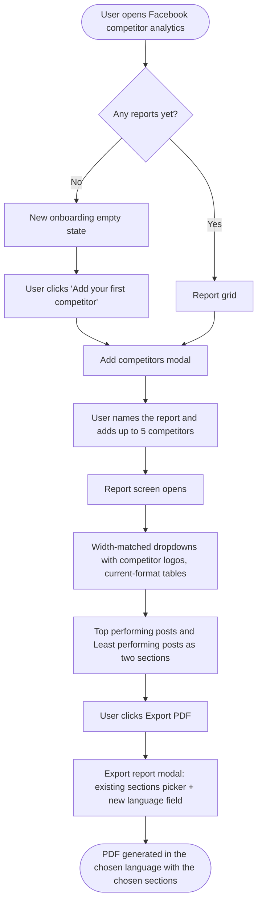
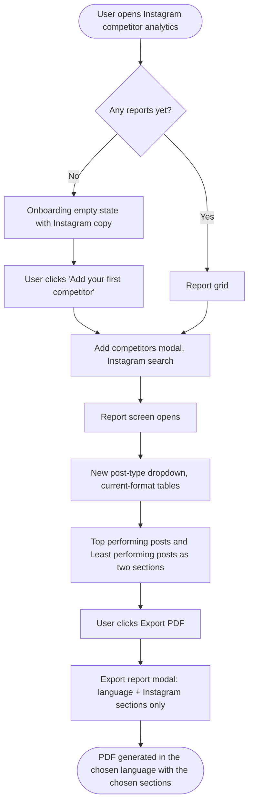

# Epic + Stories — Competitor Analytics Revamp (Facebook + Instagram)

Three stories: one design story, then two build stories split by platform. Create each with the **New Feature Template** so the standard sections and the 5 quality-checklist tasks are pre-populated. Nothing is pushed to Shortcut — create these manually from this document.

> **How the platform split works, and why it isn't symmetrical.**
>
> Facebook and Instagram competitor analytics are built from the **same components**: one report-creation modal, one report-list screen, one set of table components, one top/least posts component, one dropdown wrapper, and one export path through the Go analytics service. Splitting the epic by platform therefore means two stories that touch the same files.
>
> To keep that honest rather than pretending the work is duplicated:
> - The **Facebook story carries the shared foundations** — the redesigned Add Competitor modal, the new empty-state component, the table format migration, the top/least split, the dropdown width behavior, and the language field on the shared Export report modal. All of it is platform-neutral and lands once.
> - The **Instagram story covers Instagram parity plus its real differences** — the Instagram copy, converting Instagram's prop-driven post-type selector into a dropdown, and the Instagram section list for export (which is genuinely shorter than Facebook's).
>
> Whoever picks up the Instagram story after Facebook ships will find much of the plumbing already in place. That's expected. The Instagram story is scoped to what actually remains.
>
> **On the export modal:** the "Sections to include" picker **already ships**. A shared `ExportReportModal.vue` serves both competitor reports and platform analytics exports, with a section picker that has Select all, section search, a selected-count, and validation — and the competitor section lists are already defined per platform, correctly omitting the sections Instagram has no data for. **The only gap is a Language selector.** Because the competitor export request already carries a language value, this is frontend-only work: send the user's choice instead of silently using their interface language.
>
> ⚠️ **That modal is shared with platform analytics exports.** Adding a language selector to it gives the option to platform exports too, not just competitor. That's almost certainly what you want, but it widens the change beyond competitor analytics — flagged for a decision.
>
> **On the top/least posts split:** no backend work at all. `top_5_posts` / `least_5_posts` are already returned per competitor, and the exported PDF already splits them into separate sections. Only the on-screen layout lags.
>
> **On research accuracy:** the mounted frontend checkout was 158 commits behind `origin/develop`, which is why an earlier draft of these stories called for building an export modal that already exists. All findings have since been verified against `origin/develop`.

---

## EPIC: Competitor Analytics Revamp (Facebook + Instagram)

### Description

Competitor analytics lets users compare their own Facebook Pages and Instagram business profiles against up to five competitors — followers, engagement rate, posting activity, hashtags, bio, and best/worst content. The data and the exported PDF are in good shape. The screens around them are not: the entry point offers no explanation of what the feature does, the report-creation modal is dated and unlabelled, chart dropdowns open narrower than their own card headers and identify competitors by name only, the top/least performing posts section crams every competitor into one stacked two-column grid, and Export PDF fires instantly with no chance to choose sections or language.

This epic modernizes all of it, bringing competitor analytics in line with patterns already shipped elsewhere in Analytics: the onboarding empty-state pattern from the platform analytics screens, the width-matched design-system dropdowns used in the reports modals, the shared analytics data table used by Meta Ads and Google Ads, the top-and-least posts layout used on Pinterest and YouTube, and the sections-plus-language export controls already used by the multi-workspace analytics report.

The work starts with a design story covering all four areas for both platforms, then splits into a Facebook story and an Instagram story. Because both platforms share the same components, the Facebook story carries the shared foundations and the Instagram story covers parity plus Instagram's genuine differences — most notably that three Facebook charts (post reactions distribution, post engagement comparison, post engagement over time) have **no Instagram equivalent** in the analytics backend, so they are correctly absent from Instagram's report and from its export section list.

This is a presentation revamp: no schema changes, no new metrics, no mobile impact.

**Epic state:** To Do

---

## Story 1 — `[Design]` Design the revamped Facebook and Instagram competitor analytics screens

### Description

Competitor analytics is being modernized across four areas — the empty state, the Add Competitor modal, the report screen, and the Export report modal — for both Facebook and Instagram. Some mockups already exist (empty state, Add Competitor modal); the rest of the revamp has no designs yet.

This story is the design pass for all of it. It is deliberately open: **the designer owns the details.** Verify the existing mockups still hold, design what's missing, and flag anything in the plan that doesn't work visually before the frontend stories start.

### Workflow

1. The user opens Competitor Analytics with no reports yet and sees a first-run screen explaining what the feature does, with a clear way to add their first competitor.
2. They open the Add Competitor modal, name their report, search for pages/profiles, and add up to five competitors.
3. The report opens: chart dropdowns, comparison tables, and top/least performing posts, all readable at a glance.
4. They export the report, choosing which sections to include and what language it's written in.

### Acceptance criteria

Designs delivered for both Facebook and Instagram covering:

- [ ] **Empty state** — first-run screen for users with no competitor reports (follows the onboarding empty-state pattern already shipped on the platform analytics screens).
- [ ] **Add Competitor modal** — labelled fields, search results with logos, competitor slot counter (5 max), validation states.
- [ ] **Report screen** — chart dropdowns (width-matched to their card, competitor logos in the options), comparison tables in the shared analytics data table format, and top/least performing posts as two clearly separated sections instead of one stacked grid.
- [ ] **Export report modal** — the existing sections picker plus a new language selector.
- [ ] All empty, loading, error, and validation states for the above.
- [ ] Designs use existing `@contentstudio/ui` design-system components; any genuinely new component is flagged.
- [ ] Theme tokens only — no hardcoded colors, so white-label domains render correctly.
- [ ] Responsive behavior covered (web only — no dark mode, no RTL).

**Please verify rather than assume:**

- [ ] The existing empty-state and Add Competitor modal mockups — confirm they're still current, or update them.
- [ ] Whether Instagram needs its own screens or can reuse Facebook's with Instagram copy and logo.
- [ ] That Instagram's report is genuinely missing three Facebook sections (post reactions distribution, post engagement comparison, post engagement over time) — there's no Instagram data for them, so the layout shouldn't leave gaps where they'd sit.
- [ ] Anything in the revamp plan that doesn't hold up visually — raise it here before development starts.

### Mock-ups

Existing empty-state and Add Competitor modal mockups — Product Owner to attach them to this story in Shortcut. This story produces the rest.

Reference patterns already in the product: the analytics onboarding empty states, the dropdowns in the analytics reports modals, the shared analytics data table used by Meta Ads and Google Ads, the top-and-least posts layout on Pinterest and YouTube, and the multi-workspace analytics report export modal.

### Impact on existing data

None — design only.

### Impact on other products

- **Mobile apps / Chrome extension:** not affected — competitor analytics and PDF export are web-only.
- **Shared surfaces:** the Add Competitor modal, the report tables, and the Export report modal are shared between Facebook and Instagram, and the export modal is also shared with platform analytics exports. Designs need to hold up in all of those contexts.

### Dependencies

Blocks both **[FE] Revamp Facebook competitor analytics: empty state, Add Competitor modal, report screen, and PDF export** and **[FE] Revamp Instagram competitor analytics to match the new Facebook competitor experience**. Ship designs first.

### Global quality & compliance (wherever applicable)

- [ ] Mobile responsiveness tested (frontend only, N/A for backend-only stories)
- [ ] Multilingual support verified (frontend + backend, translations available or fallback handled)
- [ ] UI theming supported (default + white-label, design library components are being used)
- [ ] White-label domains impact reviewed
- [ ] Cross-product impact assessed (web, mobile apps, Chrome extension)

### Shortcut fields

| Field | Value |
|---|---|
| Template | New Feature Template |
| Story type | Feature |
| Project | Web App |
| Group | Design |
| Epic | Competitor Analytics Revamp (Facebook + Instagram) |
| Priority | High |
| Product Area | Analytics |
| Skill Set | Design |
| Workflow state | Planning / Design |
| Estimate | *(leave empty — devs estimate at sprint planning)* |
| Labels | *(none)* |
| Iteration | *(PO assigns current/target sprint)* |

---

## Story 2 — `[FE]` Revamp Facebook competitor analytics: empty state, Add Competitor modal, report screen, and PDF export

### Description

As a user working with Facebook competitor analytics, I want the whole experience modernized — a first-run screen that explains the feature, a clear report-creation modal, a report screen that reads well, and an export I can actually configure — so the feature feels as current as the rest of Analytics.

Four things are wrong today, end to end:

**The entry point explains nothing.** A user with no competitor reports lands on a grid containing a single dashed "create" tile — no headline, no explanation, no sense of what they'll get. The only other way in is a "Create new" button tucked in the page header.

**The report-creation modal is dated.** Neither field has a visible label; the report name field communicates entirely through its placeholder. Nothing validates until the user hits save, and then both errors appear at once. Search results render in hand-built markup rather than a design-system dropdown, several colors are hardcoded hex values that won't recolor on white-label domains, and the primary button says "Continue" even though it saves and closes. There's no count of how many of the five competitor slots are used until the input silently disables at five.

**The report screen has three separate problems.** Chart dropdowns open to the width of their contents rather than their card header, so a dropdown under a wide heading opens as a narrow sliver. The dropdowns that select a competitor list names as plain text even though every competitor's logo is already in the data. The tables use bespoke components while the rest of Analytics has moved to the shared analytics data table. And the top/least performing posts section crams every competitor into one stacked two-column grid, with the only top/least labels appearing once in the card header plus a hint that shows on hover — the exported PDF already splits these into separate sections, so the screen is the part that lags.

**Export PDF has no language choice.** The Export report modal already lets the user pick which sections go into the PDF, but not what language it's written in — the PDF is silently generated in whatever language the user's interface happens to be set to. A user who wants a Spanish report for a client has to switch the whole app to Spanish first.

This story fixes all four for Facebook. Because Facebook and Instagram share these components, it also delivers the shared foundations that **[FE] Revamp Instagram competitor analytics to match the new Facebook competitor experience** builds on.

### Workflow

1. The user opens Competitor Analytics and picks Facebook. With no reports yet, they see the new empty state — the Facebook logo, a title, a subtitle, four info cards, an **Add your first competitor** button, and a **Learn More** link.
2. They click the CTA and the redesigned **Add competitors** modal opens, with labelled fields and helper text.
3. They name the report, search for Facebook Pages by name, and pick results from a dropdown showing each page's logo, name, verified badge, and location. A counter tracks their five slots.
4. They click **Create report** and land on the report screen.
5. On the report screen, chart dropdowns now open to the full width of their card headers, and the ones that pick a competitor show that competitor's logo beside the name. The data tables render in the current Analytics format with the same columns and values as before.
6. Scrolling down, they see **Top performing posts of {competitor}** with a competitor dropdown and up to five posts, then **Least performing posts of {competitor}** below it with its own dropdown and five posts. Picking a competitor in either dropdown updates only that section.
7. They click any post and the existing post preview opens with its statistics sidebar.
8. They click **Export PDF** and the **Export report** modal opens as it does today, with all sections ticked — now with a **Language** field above the sections picker, pre-set to their interface language. They pick a language, untick any sections they don't need, and click **Export PDF**. The report is generated in the chosen language with only the chosen sections.

### Acceptance criteria

#### Empty state

- [ ] On the Facebook competitor screen, when the user's plan includes competitor analytics and they have zero Facebook competitor reports, a new onboarding empty state renders in place of the bare dashed create tile.
- [ ] As soon as they have one or more Facebook reports, the existing report grid renders instead — the empty state does not appear.
- [ ] The empty state is a centered white card on the light-grey page background with rounded corners and a subtle border, visually consistent with the platform analytics onboarding empty states.
- [ ] The Facebook logo sits centered above the title, followed by the title, subtitle, and a horizontal row of four info cards that wraps to fewer columns at narrower widths.
- [ ] Each info card is center-aligned with an icon in a rounded-square background, a heading, and one body line. No step labels ("STEP 1", etc.) anywhere.
- [ ] The **Add your first competitor** button is the primary themed button and opens the same Add competitors modal the header create button opens.
- [ ] A **Learn More** link with a small question-mark icon sits below the button and opens the competitor analytics help article.
- [ ] The existing header create button continues to work and is unchanged.
- [ ] Users whose plan does not include competitor analytics still see the existing upgrade screen with sample charts — this story does not change that screen.
- [ ] Switching workspace re-evaluates the empty state against the new workspace's Facebook reports.
- [ ] While the report list loads, existing skeleton placeholders show — the empty state does not flash before data arrives. If the list fails to load, the existing section error state shows instead of the empty state.
- [ ] No emojis in the UI — icons are SVG.

#### Add Competitor modal

- [ ] The report name field has a visible label, a placeholder, and helper text — it no longer relies on the placeholder alone.
- [ ] The competitor search field has a visible label, a Facebook-specific placeholder, and helper text stating the five-competitor limit.
- [ ] Both fields use design-system input components rather than custom markup.
- [ ] Search results render in a design-system dropdown, not hand-built markup.
- [ ] Each result shows the Page's logo, its name (falling back to its slug when no name is set), a verified badge when the Page is verified, and its city and country when available.
- [ ] When a logo fails to load, the existing default profile placeholder shows instead of a broken image.
- [ ] A loading indicator shows in the search field while a search is in flight.
- [ ] A search returning no matches shows a "no results" message naming the search term; a failed search shows the error message returned for it.
- [ ] Picking a result adds it to the added-competitors list and clears the search field.
- [ ] Each added competitor row shows its logo and name plus a remove icon with a "Remove competitor" tooltip.
- [ ] A counter shows how many of the five slots are used, updating as competitors are added and removed.
- [ ] At five competitors the search field is disabled and a notice explains the limit and how to free a slot; removing one re-enables the field and clears the notice.
- [ ] Saving with an empty report name shows an inline error on that field; saving with no competitors shows an inline error on the competitor field.
- [ ] Each error clears as soon as the user fixes that field — no re-submit needed to see it clear.
- [ ] The save button is disabled while a save or search is in flight, so a double-click cannot create two reports.
- [ ] Opening the modal for an existing report pre-fills its name and competitors, and the modal title and save button reflect that the user is editing.
- [ ] Closing or cancelling discards unsaved changes and resets the form, so the next open starts clean.

#### Report screen — dropdowns and logos

- [ ] All three Facebook chart dropdowns (posting activity by post type, post engagement over time, post reactions distribution) open to the full width of their trigger / card header instead of sizing to their content.
- [ ] Dropdowns use the design-system dropdown components with the same trigger height, radius, placement, and selected-item check mark as the dropdowns in the analytics reports modals.
- [ ] In the two dropdowns that select a competitor (post engagement over time, post reactions distribution), each option shows the competitor's logo next to its name.
- [ ] The currently selected competitor's logo also shows in the dropdown trigger, next to the heading text.
- [ ] The post-type dropdown shows no logo, since it doesn't select a competitor.
- [ ] Long names truncate with an ellipsis and reveal the full name on hover, rather than stretching or wrapping the panel.
- [ ] When the option list overflows, the panel scrolls internally rather than growing past the viewport.
- [ ] When a competitor's logo fails to load, the default profile placeholder shows instead of a broken image.

#### Report screen — tables

- [ ] The Facebook competitor data tables adopt the shared analytics data-table formatting used elsewhere in Analytics: consistent header styling, row height, borders, and hover treatment.
- [ ] Column sorting continues to work on the columns sortable today, with the sort indicator matching the shared table.
- [ ] On narrow widths a table scrolls horizontally within its own card rather than pushing the page sideways.
- [ ] Existing loading skeletons, empty states, and error states for each table section are preserved.
- [ ] The comparative table, hashtags table, bio analysis table, and posting-activity table all show the same columns and values as before.

#### Report screen — top and least performing posts

- [ ] The single combined top-and-least card is replaced by two stacked sections: **Top performing posts** and **Least performing posts**, in that order.
- [ ] Each section shows up to **5 posts** for the selected competitor.
- [ ] Each section has its own visible heading — the top/least distinction is never communicated by hover alone.
- [ ] The per-competitor two-column grid is gone: a section shows one competitor's posts at a time, not every competitor stacked.
- [ ] Each section's heading includes a dropdown listing every competitor in the report, showing each competitor's logo next to its name.
- [ ] Both dropdowns default to the first competitor in the report.
- [ ] Changing a section's dropdown updates only that section; the other section keeps its own selection.
- [ ] Posts render in the same layout the platform analytics top-posts sections use.
- [ ] Clicking a post opens the existing post preview with its statistics sidebar and the existing Facebook embedded post preview — unchanged.
- [ ] The existing expand-to-fullscreen affordance is retained on each of the two sections.
- [ ] While data loads, each section shows skeleton placeholders.
- [ ] When the selected competitor has no top posts in the date range, the top section shows an empty state naming that competitor; the same applies to the least section.
- [ ] When the report is still syncing competitor data, the existing data-fetching state is preserved; a fetch error surfaces the existing error handling.

#### Export report modal — add a language selector

- [ ] The Export report modal gains a **Language** field, placed above the existing **Sections to include** picker.
- [ ] The language selector offers exactly the eight languages the report generator supports: English, German, Spanish, French, Italian, Polish, Greek, Chinese — each shown with its country flag, matching the language selector in the schedule-report modal.
- [ ] The selector defaults to the user's current interface language.
- [ ] The generated report is written in the selected language regardless of the interface language.
- [ ] Choosing an export language does **not** change the user's interface language.
- [ ] The selected language resets to the interface-language default each time the modal is opened, so a previous export's choice doesn't silently carry over.
- [ ] The chosen language is recorded on the existing section-customization analytics event rather than a new event being introduced.

**Existing export behavior that must not regress**
- [ ] The sections picker continues to work exactly as it does today: all sections ticked by default, Select all, section search, the selected-count display, and inline validation when nothing is selected.
- [ ] The Facebook section list is unchanged, including the three Facebook-only sections (post reactions distribution, post engagement over time, post engagement comparison).
- [ ] Unticking every section still blocks export with the existing validation message.
- [ ] The export button still shows a loading state while the request is in flight and cannot be double-submitted.
- [ ] The existing Export PDF button conditions are preserved: it stays disabled while competitor data is loading, with the same explanatory tooltip.
- [ ] Cancelling the modal exports nothing and leaves the report untouched.
- [ ] The existing success and failure toasts are unchanged.
- [ ] Because this modal is shared with platform analytics exports, those exports continue to work — and gain the same language field.

#### No data changes

- [ ] No metric values, column sets, chart data, post fields, or default selections change anywhere in this story — presentation and arrangement only.

#### Quality

- [ ] All copy renders through i18n and exists in all 8 locales, falling back to English rather than showing a raw key.
- [ ] Colors come from theme tokens — the hardcoded hex values in the touched components are replaced — and every screen renders correctly on white-label domains.
- [ ] All touched screens remain readable and usable down to mobile widths.

### UI copy

#### Empty state

- **Title:** "Track your Facebook competitors"
- **Subtitle:** "See how you stack up against the competition — followers, engagement, posting habits, and best-performing content, all side by side."

| Card | Heading | Body |
|---|---|---|
| 1 | Add up to 5 competitors | "Search for any public Facebook Page by name — no login or permission needed from them." |
| 2 | Compare side by side | "Followers, engagement rate, and posting activity for every competitor in one view." |
| 3 | AI Insights | "Get smart suggestions to improve your strategy." |
| 4 | Create & share reports | "Export as PDF, email, or schedule recurring reports." |

- **CTA button:** "Add your first competitor"
- **Learn More link:** "Learn More" (with a `?` icon), opening the competitor analytics help article.
- **Loading / error states:** existing skeleton placeholders and section error state — no new copy.

#### Add Competitor modal

- **Modal title, creating:** "Add competitors"
- **Modal title, editing:** "Manage competitors"

**Report name field**
- **Label:** "Report name"
- **Placeholder:** "e.g. Sportswear brands"
- **Helper text:** "A name you'll recognize in your list of reports."
- **Validation error:** "Please enter a report name."

**Competitor search field**
- **Label:** "Competitors"
- **Placeholder:** "Search for a Facebook Page by name"
- **Helper text:** "Add up to 5 competitors. Search by name, then pick from the results — they won't be notified."
- **Validation error:** "Please add at least one competitor."
- **No results:** "No matches for "{search term}". Try a different name or check the spelling."
- **Counter:** "{count} of 5 added"

**Other modal copy**
- **Five-competitor notice:** "You've reached the maximum of 5 competitors. Remove one to add another."
- **Remove icon tooltip:** "Remove competitor"
- **Empty added-list state:** "No competitors added yet. Search above to add your first one."
- **Buttons:** "Cancel" / "Create report" (creating) / "Save changes" (editing)

> **Copy change to note:** the primary button currently says "Continue", which reads like a wizard step even though it saves and closes. "Create report" / "Save changes" describes what actually happens. Flag if you'd rather keep "Continue".

#### Report screen

**Chart dropdown triggers** — existing meaning retained:

| Dropdown | Trigger copy |
|---|---|
| Posting activity by post type | "Posting activity by competitors ({post type})" |
| Post engagement over time | "Posts per day by {competitor name}" |
| Post reactions distribution | "Distribution of post reactions by {competitor name}" |

**Top and least performing posts**
- **Top section dropdown trigger:** "Top performing posts of {competitor name}"
- **Least section dropdown trigger:** "Least performing posts of {competitor name}"
- **Top section info tooltip:** "The 5 posts from this competitor that got the most engagement in your selected date range. Use it to spot the content formats their audience responds to."
- **Least section info tooltip:** "The 5 posts from this competitor that got the least engagement in your selected date range. Use it to spot formats that fall flat before you try them yourself."
- **Top section empty state:** "No posts from {competitor name} in this date range."
- **Least section empty state:** "No posts from {competitor name} in this date range."

**Shared dropdown behavior**
- **Competitor option:** the competitor's logo followed by its name.
- **Post-type option:** the post type name as shown today.
- **Truncation:** long names truncate with an ellipsis; the full name appears on hover.

**Unchanged copy:** existing table headings, per-section empty and error states, the data-fetching message, and the "Maximize" / "Minimize" tooltips are all retained.

> **Design decision to confirm:** each performing-posts section gets its own competitor dropdown, so the user can view one competitor's best next to another's worst. If you'd rather a single dropdown drove both sections together, that's a one-line change to the criteria — say so and I'll swap it.

#### Export report modal

**New copy — the language field only:**
- **Label:** "Language"
- **Helper text:** "The report's headings and labels are translated into this language. Your own interface language doesn't change."
- **Options:** English, German, Spanish, French, Italian, Polish, Greek, Chinese — each with its country flag.

**Existing copy, unchanged** — listed so nobody rewrites it:
- **Modal title:** "Export report"
- **Modal subtext:** "Choose what to include, then download this report as a PDF."
- **Sections label:** "Sections to include"
- **Sections hint:** "All sections are selected. Uncheck anything you do not want in this report."
- **All-selected state:** "All sections selected"
- **Counter:** "{selected} of {total} sections selected"
- **Select all:** "Select all"
- **Section search placeholder:** "Search sections"
- **No search matches:** "No sections match your search."
- **Validation:** "Select at least one section to include in your report."
- **Buttons:** "Cancel" / "Export PDF"
- **Toasts:** existing export success and failure copy.

> The modal subtext could arguably be extended to mention language ("Choose what to include and which language it's written in, then download this report as a PDF."). Optional — flag if you want it changed, otherwise the existing subtext stays.

**Facebook section labels:** unchanged — the picker already builds this list from the report section definitions, so no new labels are needed. Facebook's list covers the competitor overview, performance comparison, comparative table, followers comparison, posting activity by post type, most engaged hashtags, post engagement, post engagement over time, distribution of reactions, and top & least performing posts.

### Mock-ups

See the attached empty-state and Add Competitor modal mockups — Product Owner to attach them to this story in Shortcut.

For the rest, the targets are patterns already in the product: the dropdown reference is the language and report-type dropdowns in the analytics reports modals; the table reference is the shared analytics data table used by Meta Ads, Google Ads, and the label and campaign performance report; the top-and-least layout reference is the Pinterest and YouTube analytics screens; the export modal reference is the multi-workspace analytics report modal.

### Impact on existing data

None. No schema change and no new API fields — the competitor export request already carries a language value and a section list; this story only changes where the language value comes from. Everything else is presentation: each competitor's top five and least five posts are already returned by the existing endpoint, and the report-creation modal's save payload and search endpoint are unchanged. Previously generated reports are unaffected.

### Impact on other products

- **Mobile apps / Chrome extension:** not affected — competitor analytics and PDF export are web-only.
- **Instagram competitor analytics:** this story changes components Instagram also uses (the modal, the report list, the tables, the top/least posts component, the dropdown wrapper). Instagram must keep working throughout, with its own copy and its own scope picked up by **[FE] Revamp Instagram competitor analytics to match the new Facebook competitor experience**.
- **Exported PDF layouts:** the PDF already renders top and least as separate sections and uses its own report layouts. The table components are shared with those layouts and with the plan-gate sample view, so table changes must hold up in all three contexts.
- **Platform analytics exports:** ⚠️ **affected.** The Export report modal is shared between competitor reports and platform analytics exports, so the new language field appears in both. Platform exports don't send a language today, so engineering should confirm the platform render path honors one before wiring it there — if it doesn't, the language field can ship for the competitor path first.
- **Scheduled and emailed reports:** unchanged. The schedule-report modal already has its own language selector.
- **White-label:** replacing hardcoded hex with theme tokens across the touched components is required for correct rendering on white-label domains.

### Dependencies

Depends on: **[Design] Design the revamped Facebook and Instagram competitor analytics screens**.

This story delivers the shared foundations that **[FE] Revamp Instagram competitor analytics to match the new Facebook competitor experience** depends on, so it should ship before it.

### Global quality & compliance (wherever applicable)

- [ ] Mobile responsiveness tested (frontend only, N/A for backend-only stories)
- [ ] Multilingual support verified (frontend + backend, translations available or fallback handled)
- [ ] UI theming supported (default + white-label, design library components are being used)
- [ ] White-label domains impact reviewed
- [ ] Cross-product impact assessed (web, mobile apps, Chrome extension)

### Implementation references

*Pointers from research — not a contract. Engineering may choose a different approach.*

**Screens and entry points:**
- `contentstudio-frontend/src/modules/analytics/views/competitor/facebook/FacebookCompetitorReport.vue` — the Facebook report screen; hosts all three chart dropdowns.
- `views/competitor/common/ReportsList.vue` — renders `<ReportTile :is-empty="true" />` as the first grid tile plus one tile per report. The empty state branches here, on `allReports` being empty and access being allowed. **Shared with Instagram.**
- `components/competitor/ManageCompetitorsModal.vue` — the report-creation modal, opened via the EventBus event `show-manage-competitors-modal` (which also carries existing report data for edit mode). Save/search/delete logic lives in `composables/competitor/useCompetitorsManagement.ts` and needs no change. **Shared with Instagram.**
- `components/competitor/MainAnalyticsHeader.vue` — the header create button (already emits `show-manage-competitors-modal`, so the new CTA can emit the same event) and `handleExportReport()`, which currently calls the export composable directly and toasts. That's where the export modal gets opened instead.

**Do not confuse these two screens:**
- `views/competitor/common/CompetitorAnalyticsLanding.vue` is the **plan gate**, not the empty state — it renders `CompetitorDummyGraphs.vue` (backed by the intentionally-static `composables/competitor/CompetitorDummyData.ts`) for non-qualifying plans and redirects qualifying users onward. It should not be touched.

**Empty state pattern to follow:** the onboarding empty states built for the platform analytics screens (Overview, Facebook, Instagram, LinkedIn, TikTok, YouTube, Pinterest, Google Business Profile, Meta Ads, Google Ads) — same card, logo, title/subtitle, 4-card row, themed CTA, Learn More link. Precedent story: **[FE] Redesign the Analytics empty-state screens with connect-account onboarding**.

**Modal specifics:**
- Components: `Modal`, `TextInput` / `SearchInput`, `Dropdown` + `DropdownItem` (replacing the hand-rolled results panel), `Avatar`, `ListItem`, `ActionIcon`, `Alert`, `Button`, `Loader`, `Icon` — all from `@contentstudio/ui`.
- **Component gap:** there is no standalone Tooltip component in the design system, so the remove-icon tooltip stays on the existing tooltip directive used throughout this file.
- Hardcoded values to replace with theme tokens: `border-[#E9EFF6]` on the results panel and avatars, `text-[#2f8ae0]` on the footer info icon, `text-[#b57e00]` on the footer info text, and the `bg-white!` override on the results panel. The fixed `dialog-class="w-150!"` and body `h-116!` are worth revisiting so the modal can breathe at smaller widths.
- Gotchas: the file casts `TextInput as unknown as Component` because the design-system types don't declare its slots. Validation currently runs only inside the save handler with the error refs reset on modal hide, so per-field validation means clearing each error independently. The modal is shared by create and edit — `onShownManageModal` seeds the form from incoming report data, so title and button copy branch on whether that data carries an existing report.

**Dropdowns:**
- `views/common/AnalyticsDropdown.vue` + `AnalyticsDropdownItem.vue` — the shared wrapper. Its own header documents it as a "content-width / dynamic" dropdown, which is the root cause of the narrow panels. Either give it a width-matching mode or move these call sites to the design-system `Dropdown`. **Shared with Instagram.**
- `components/reports/modals/ScheduleReportModal.vue` — the newest dropdown pattern in the module: design-system `Dropdown` with `match-width`, `placement="bottom-start"`, plus `dropdown-classes` / `button-classes`.

**Competitor logos — no API work needed:**
- The competitor objects already carry an `image` field; it's already rendered in `components/competitor/TopAndLeastPerformingPosts.vue`, `ManageCompetitorsModal.vue`, and `CompetitorTile.vue`, each falling back to the shared default profile placeholder on error. The dropdown items simply don't use it yet — they render `company.name` as bare text. `Avatar` from `@contentstudio/ui` is the natural fit.

**Tables:**
- Current: `components/competitor/CompetitorsTable.vue`, `CompetitorsTableComponent.vue`, and the helpers `ComparativeTableHelper.vue`, `BioAnalysisTableHelper.vue`, `HashtagTableHelper.vue`, `PostingActivityTableHelper.vue`. **Shared with Instagram.**
- Target: `views/common/data_table/AnalyticsDataTable.vue` / `AnalyticsBaseTable.vue` / `AnalyticsTableToolbar.vue`, already adopted by `views/meta_ads/components/DataTable.vue`, the Google Ads tabs, and `views/performance-report/label-and-campaign/components/PostsTab.vue`.
- `CompetitorsTable.vue` is also consumed by the PDF report layouts `views/reports/FbCompetitorReport.vue` and `views/reports/IgCompetitorReport.vue`, and by `views/competitor/common/CompetitorDummyGraphs.vue`. Any change needs to hold up in all three contexts.

**Top and least posts split:**
- `components/competitor/TopAndLeastPerformingPosts.vue` — the component to split. The clutter comes from its `grid grid-cols-2 gap-28` block repeated per competitor, with the top/least row labels rendered as `hidden group-hover:block`. **Shared with Instagram.**
- `components/competitor/CompetitorTopLeastPosts.vue` — the child that renders each post list; likely reusable as-is for both new sections.
- `composables/competitor/useTopAndLeastPerformingPosts.ts` — each competitor object already exposes `top_5_posts` and `least_5_posts`.
- Pattern to copy: `views/pinterest/components/TopAndLeastEngagingPosts.vue` (and the YouTube equivalent) — a dropdown in the section heading, five posts per list, and deliberately **no** "show more" button or full-list modal.
- Possibly already close to the target: `components/competitor/TopPerformingPostsReport.vue`, `LeastPerformingPostsReport.vue`, and `PerformingPostsCard.vue` exist alongside the combined component — worth checking whether they already implement the split shape for the PDF layouts before building new ones.
- Preserve: `components/competitor/PerformancePostPreviewModal.vue` with its per-platform statistics sidebar and the Facebook embedded post preview — none of that should change, only which component invokes it.

**Export language selector — the one file to change, plus the two paths out of it:**
- `components/reports/modals/ExportReportModal.vue` — the shared modal, already built. It listens for the `export-report-sections` EventBus event (emitted by `components/competitor/MainAnalyticsHeader.vue` for competitor reports and by `views/common/ExportButton.vue` for platform reports), renders `views/common/ReportSectionPicker.vue`, and owns the export call and its toasts. The language field goes here, above the picker.
- On submit the modal branches: competitor reports call `useReportExport().exportReport({ competitorReportId, dateRange, action: 'render', widgets })`; platform reports call `useRenderReportMutation()` with `widgets` in the payload. The chosen language needs to reach whichever branch runs.
- `composables/competitor/useReportExport.ts` — currently hardcodes `language: i18n.global.locale.value`. Accepting a language param and defaulting to the locale keeps existing callers working.
- `views/common/ReportSectionPicker.vue` and `utils/reportSections.ts` — **already built, don't rebuild.** The picker has Select all, section search, the selected-count, the help tooltip, and validation. `reportSections.ts` defines the `facebook_competitor` and `instagram_competitor` section lists and maps each to Go widget IDs via `widgetIdsForSections()`, with a spec alongside it.
- Language dropdown pattern to copy: `components/reports/modals/ScheduleReportModal.vue` — `getSupportedLanguages()` from `src/i18n` paired with a country-flag component, defaulting to the current locale.
- The modal already calls `trackUserMaven('analytics_report_sections_customized', event)` with the payload built by `sectionSelectionEvent(...)` — the natural home for the chosen language, rather than a new event.

**Backend context (likely no work):**
- `contentstudio-social-analytics-go/src/models/reports/definition.go` — carries `Widgets []string` and `Language string`; the per-platform adapters pass `Language: def.Language` through to widget rendering. Platform analytics handlers already read `language` from the request with an `X-LOCALE` header fallback.
- `src/services/reports/localization/localization.go` — supported report languages are `en, de, es, fr, it, pl, el, zh`, anything else falling back to English. These match the frontend's eight locales exactly, so no new translation work for the report itself.
- **Unverified:** the `analytics/reports/save` endpoint isn't in the Go repo (it's reached via the analytics base URL), so whether the **platform** render path honors a supplied language wasn't confirmed. The competitor path demonstrably already sends and honors one. Confirm before wiring language into the platform branch.
- **Gotcha:** the competitor export derives `platform_type` from the route name with a fallback to Facebook — worth making explicit rather than relying on the fallback if anything new keys off platform.

**Other constraints:** all charts must keep going through `useEcharts()`; competitor endpoints must keep coming from `composables/competitor/constants.ts`.

**Sibling story for context:** the platform-analytics equivalent of the top/least work is **[Full Stack] Add the Top Posts sort dropdown + Least Posts to Facebook, Instagram, LinkedIn & TikTok analytics**. Its research confirmed least-performing lists already exist for competitors, which is why this story needs no backend work for that part.

**Suggested i18n:** new keys under `analytics.competitor.empty_state.*`, extensions to `analytics.competitor.manage_modal.*`, and a language label/helper under `analytics.report_sections.export_modal.*` — all added to all 8 locale directories in the same change.

**No new analytics event** — per the decision to keep this revamp instrumentation-free. Note the export modal already emits `analytics_report_sections_customized`; extend its payload rather than adding an event.

### Shortcut fields

| Field | Value |
|---|---|
| Template | New Feature Template |
| Story type | Feature |
| Project | Web App |
| Group | Frontend |
| Epic | Competitor Analytics Revamp (Facebook + Instagram) |
| Priority | High |
| Product Area | Analytics |
| Skill Set | Frontend |
| Workflow state | Ready for Dev |
| Estimate | *(leave empty — devs estimate at sprint planning)* |
| Labels | *(none)* |
| Iteration | *(PO assigns current/target sprint)* |

---

## Story 3 — `[FE]` Revamp Instagram competitor analytics to match the new Facebook competitor experience

### Description

As a user working with Instagram competitor analytics, I want the same modernized experience Facebook gets — a first-run screen that explains the feature, a clear report-creation modal, a report screen that reads well, and a configurable export — so switching between the two platforms doesn't feel like switching between two products.

Instagram shares most of its components with Facebook, so once **[FE] Revamp Facebook competitor analytics: empty state, Add Competitor modal, report screen, and PDF export** ships, much of this is already in place. What remains is Instagram's own copy, its own scope, and the places where Instagram genuinely differs:

**Instagram has no chart dropdowns at all.** Its posting-activity post-type selector is driven by a prop rather than a dropdown, so where Facebook restyles three dropdowns, Instagram needs one introduced.

**Three Facebook charts have no Instagram equivalent.** Post reactions distribution, post engagement comparison, and post engagement over time are Facebook-only in the analytics backend — Instagram has no data for them. They are correctly absent from Instagram's report screen and must also be absent from its export section list. This story does not invent Instagram charts that have no backing data.

Everything else — the empty state, the modal, the tables, the top/least posts split, and the export modal — is Instagram wearing the shared components with Instagram copy and an Instagram section list.

### Workflow

1. The user opens Competitor Analytics and picks Instagram. With no reports yet, they see the onboarding empty state with the Instagram logo and Instagram copy.
2. They click **Add your first competitor** and the redesigned modal opens, searching Instagram business profiles by username.
3. They name the report, add up to five competitors, and click **Create report**.
4. On the report screen, the posting-activity post-type selector is now a dropdown matching Facebook's styling, opening to the full width of its card header. The data tables render in the current Analytics format.
5. Scrolling down, they see **Top performing posts of {competitor}** with a competitor dropdown and up to five posts, then **Least performing posts of {competitor}** below it with its own dropdown and five posts.
6. They click any post and the existing Instagram post preview opens, with its carousel and video handling unchanged.
7. They click **Export PDF** and the Export report modal opens listing only the sections Instagram has data for. They pick a language, adjust sections, and export.

### Acceptance criteria

#### Empty state

- [ ] On the Instagram competitor screen, when the user's plan includes competitor analytics and they have zero Instagram competitor reports, the onboarding empty state renders in place of the bare dashed create tile.
- [ ] As soon as they have one or more Instagram reports, the existing report grid renders instead.
- [ ] The empty state shows the Instagram logo centered above the title, with the Instagram title, subtitle, and four info cards (see copy).
- [ ] The **Add your first competitor** button opens the Add competitors modal with Instagram search behavior.
- [ ] A **Learn More** link with a question-mark icon opens the competitor analytics help article.
- [ ] Switching from Facebook to Instagram in the sidebar re-evaluates the empty state against Instagram's own reports — a user with Facebook reports but no Instagram reports still sees the Instagram empty state.
- [ ] Switching workspace re-evaluates the empty state against the new workspace's Instagram reports.
- [ ] Users whose plan does not include competitor analytics still see the existing upgrade screen with sample charts.
- [ ] While the report list loads, existing skeleton placeholders show; if the list fails to load, the existing section error state shows instead of the empty state.

#### Add Competitor modal

- [ ] Opening the modal from an Instagram context uses the Instagram-specific search placeholder and searches Instagram business profiles.
- [ ] Each search result shows the profile's logo, its name (falling back to its username when no name is set), a verified badge when the profile is verified, and its city and country when available.
- [ ] All the redesigned modal behavior applies on Instagram: labelled fields with helper text, a design-system results dropdown, the five-slot counter, the disabled-at-five state with its notice, per-field validation that clears as the user fixes each field, and the create/edit title and button copy.
- [ ] Saving creates an Instagram competitor report and the user lands on the Instagram report screen.

#### Report screen — post-type dropdown

- [ ] Instagram's posting-activity post-type selector is a dropdown, replacing the current prop-driven selector.
- [ ] The dropdown matches Facebook's dropdown styling — same trigger height, radius, placement, and selected-item check mark — and opens to the full width of its trigger / card header rather than sizing to its content.
- [ ] The dropdown offers the same post types the Instagram report already supports today — no new post types are introduced.
- [ ] The post-type dropdown shows no competitor logo, since it doesn't select a competitor.
- [ ] Long option names truncate with an ellipsis and reveal the full name on hover.

#### Report screen — sections that must stay absent

- [ ] Instagram's report screen does not gain a post reactions distribution chart, a post engagement comparison chart, or a post engagement over time chart — these are Facebook-only and Instagram has no data for them.

#### Report screen — tables

- [ ] The Instagram competitor data tables adopt the shared analytics data-table formatting: consistent header styling, row height, borders, and hover treatment.
- [ ] Column sorting continues to work on the columns sortable today, with the sort indicator matching the shared table.
- [ ] On narrow widths a table scrolls horizontally within its own card rather than pushing the page sideways.
- [ ] Existing loading skeletons, empty states, and error states for each table section are preserved.
- [ ] The comparative table, hashtags table, bio analysis table, and posting-activity table all show the same columns and values as before.

#### Report screen — top and least performing posts

- [ ] The single combined top-and-least card is replaced by two stacked sections: **Top performing posts** and **Least performing posts**, in that order.
- [ ] Each section shows up to **5 posts** for the selected competitor, with its own visible heading.
- [ ] The per-competitor two-column grid is gone: a section shows one competitor's posts at a time.
- [ ] Each section's heading includes a dropdown listing every competitor in the report, showing each competitor's logo next to its name, defaulting to the first competitor.
- [ ] Changing a section's dropdown updates only that section.
- [ ] Clicking a post opens the existing Instagram post preview with its statistics sidebar, carousel handling, video playback, and the existing video-copyright notice — all unchanged.
- [ ] The existing expand-to-fullscreen affordance is retained on each of the two sections.
- [ ] Loading, per-competitor empty states, the data-syncing state, and error handling all behave as specified for Facebook.

#### Export report modal

- [ ] Exporting an Instagram competitor report shows the new **Language** field, offering the same eight languages with country flags and defaulting to the user's interface language.
- [ ] The generated report is written in the selected language, and choosing an export language does not change the user's interface language.
- [ ] The existing Instagram sections list is unchanged and continues to contain **only** the sections Instagram has data for — post reactions distribution, post engagement over time, and post engagement comparison stay absent.
- [ ] All existing sections-picker behavior still works on Instagram exports: all sections ticked by default, Select all, section search, the selected-count, and validation when nothing is selected.
- [ ] The generated report contains only the selected sections, in the Instagram report's existing section order.
- [ ] No backend change is needed — the language plumbing delivered in the Facebook story is platform-neutral and already serves Instagram.

#### No data changes

- [ ] No metric values, column sets, chart data, post fields, or default selections change — presentation and arrangement only.

#### Quality

- [ ] All Instagram copy renders through i18n and exists in all 8 locales, falling back to English rather than showing a raw key.
- [ ] Colors come from theme tokens and every Instagram screen renders correctly on white-label domains.
- [ ] All touched screens remain readable and usable down to mobile widths.

### UI copy

#### Empty state

- **Title:** "Track your Instagram competitors"
- **Subtitle:** "See how you stack up against the competition — followers, engagement, posting habits, and best-performing content, all side by side."

| Card | Heading | Body |
|---|---|---|
| 1 | Add up to 5 competitors | "Search for any public Instagram business profile by username — no login or permission needed from them." |
| 2 | Compare side by side | "Followers, engagement rate, and posting activity for every competitor in one view." |
| 3 | AI Insights | "Get smart suggestions to improve your strategy." |
| 4 | Create & share reports | "Export as PDF, email, or schedule recurring reports." |

- **CTA button:** "Add your first competitor"
- **Learn More link:** "Learn More" (with a `?` icon), opening the competitor analytics help article.

#### Add Competitor modal

Instagram-specific copy only — everything else matches the Facebook story:

- **Competitor search placeholder:** "Search for an Instagram business profile by username"
- **Helper text:** "Add up to 5 competitors. Search by username, then pick from the results — they won't be notified."

#### Report screen

- **Post-type dropdown trigger:** "Posting activity by competitors ({post type})"
- **Top section dropdown trigger:** "Top performing posts of {competitor name}"
- **Least section dropdown trigger:** "Least performing posts of {competitor name}"
- **Top section info tooltip:** "The 5 posts from this competitor that got the most engagement in your selected date range. Use it to spot the content formats their audience responds to."
- **Least section info tooltip:** "The 5 posts from this competitor that got the least engagement in your selected date range. Use it to spot formats that fall flat before you try them yourself."
- **Top section empty state:** "No posts from {competitor name} in this date range."
- **Least section empty state:** "No posts from {competitor name} in this date range."
- **Unchanged copy:** existing table headings, per-section empty and error states, the data-fetching message, the video-copyright notice in the post preview, and the "Maximize" / "Minimize" tooltips are all retained.

#### Export report modal

**No new copy.** The language field's label, helper text, and options are shared with the Facebook story, and the modal's own title, subtext, sections label, hint, counter, Select all, search placeholder, validation, and buttons are all existing strings.

The Instagram section list is already defined and already shorter than Facebook's — the picker builds it from the report section definitions, so nothing to author here. It covers: competitor overview, performance comparison, comparative table, followers comparison, posting activity by post type, the post-type activity chart, the post-type activity table, most engaged hashtags, and top & least performing posts.

**Absent by design:** distribution of post reactions, post engagement comparison, post engagement over time — Instagram has no data for these, and the existing section definitions already omit them.

### Mock-ups

See the attached empty-state and Add Competitor modal mockups — Product Owner to attach them to this story in Shortcut. The Instagram screens use the same card and modal structure as Facebook with Instagram copy and the Instagram logo.

### Impact on existing data

None. Instagram competitor reports, their save payload, the search endpoint, and each competitor's top five and least five posts are all unchanged — this story re-arranges and restyles data Instagram already receives, and consumes export support delivered by the Facebook story.

### Impact on other products

- **Mobile apps / Chrome extension:** not affected — competitor analytics and PDF export are web-only.
- **Facebook competitor analytics:** this story touches shared components, so Facebook must keep working throughout — particularly the modal, the report list, the tables, and the top/least posts component.
- **Exported PDF layouts:** the shared table components are also used by the Instagram PDF report layout and the plan-gate sample view, so table changes must hold up in both.
- **White-label:** Instagram screens must render correctly on white-label domains using theme tokens.

### Dependencies

Depends on: **[Design] Design the revamped Facebook and Instagram competitor analytics screens** and **[FE] Revamp Facebook competitor analytics: empty state, Add Competitor modal, report screen, and PDF export** — the Facebook story delivers the shared components this story consumes: the redesigned Add Competitor modal, the empty-state component, the table format migration, the top/least split, the dropdown width behavior, and the language field on the shared Export report modal. Ship it first.

### Global quality & compliance (wherever applicable)

- [ ] Mobile responsiveness tested (frontend only, N/A for backend-only stories)
- [ ] Multilingual support verified (frontend + backend, translations available or fallback handled)
- [ ] UI theming supported (default + white-label, design library components are being used)
- [ ] White-label domains impact reviewed
- [ ] Cross-product impact assessed (web, mobile apps, Chrome extension)

### Implementation references

*Pointers from research — not a contract. Engineering may choose a different approach.*

**Instagram-specific entry point:**
- `contentstudio-frontend/src/modules/analytics/views/competitor/instagram/InstagramCompetitorReport.vue` — the Instagram report screen. It contains **no dropdowns today**; its post-type selector is passed down as a prop (`:selected-type="selectedPostType"`), which is what becomes a dropdown in this story. Follow the dropdown treatment the Facebook story establishes.

**Shared components this story consumes rather than builds** (all delivered by the Facebook story):
- `views/competitor/common/ReportsList.vue` — the empty-state branch. Note it already re-fetches on workspace change and on route change between the Facebook and Instagram competitor routes, so Instagram's platform-scoped evaluation should fall out of the existing platform watcher.
- `components/competitor/ManageCompetitorsModal.vue` — already platform-aware: `searchPlaceholder` branches on `platform.value === 'instagram'`, so the Instagram placeholder and helper text extend that existing branch.
- `components/competitor/CompetitorsTable.vue` / `CompetitorsTableComponent.vue` and the table helpers — migrated to `views/common/data_table/*` by the Facebook story; verify the Instagram sections render correctly against the new format.
- `components/competitor/TopAndLeastPerformingPosts.vue` — split into two sections by the Facebook story; verify the Instagram branch of the split.
- `views/common/AnalyticsDropdown.vue` + `AnalyticsDropdownItem.vue` — width behavior fixed by the Facebook story; the new Instagram dropdown should use whatever that story settled on.

**Instagram behavior to preserve:**
- `components/competitor/PerformancePostPreviewModal.vue` renders a different sidebar and preview body for Instagram than for Facebook — the Instagram statistics tiles, the carousel via the concise-carousel component, inline video playback, and the video-copyright notice with its live-link fallback. None of that should change, only which component invokes the preview.
- `components/competitor/InstagramPublishedPostPreview.vue` — Instagram's post preview component, unchanged.
- Instagram post data arrives as a **positional tuple** (the preview reads `postData?.[3]`, `[4]`, `[5]`, `[6]`, `[7]` for caption, media type, media URL, permalink, and timestamp) while Facebook uses named keys. Any code path touched here must keep both shapes working — the existing component handles this with a unified open-bag type.

**Export — nothing to build here:**
- `views/common/ReportSectionPicker.vue` + `utils/reportSections.ts` already define the `instagram_competitor` section list with its widget-ID mappings, correctly omitting the Facebook-only sections. The picker, its Select all / search / counter / validation, and the shared `ExportReportModal.vue` all already ship. This story only verifies the Facebook story's language field behaves correctly on Instagram exports.

**Scope confirmation from the backend (no work, just context):**
- `contentstudio-social-analytics-go/src/services/reports/catalog/competitor.go` states plainly that reactions, post-engagement-comparison, and engagement-over-time are Facebook-only and Instagram has no equivalents. It also documents the Instagram report's section order: Overview, Performance Summary, Followers Trend, Follower Insights, Post Type Insights, Hashtag Analysis, Top/Least Performing Posts, Page Bio.
- `src/services/reports/localization/localization.go` — the eight report languages already cover Instagram exports; no new translation work.

**Other constraints:** all charts must keep going through `useEcharts()`; competitor endpoints must keep coming from `composables/competitor/constants.ts`.

**Suggested i18n:** Instagram variants of the empty-state keys and the modal placeholder/helper keys, added to all 8 locale directories in the same change.

**No analytics event** — per the decision to keep this revamp instrumentation-free.

### Shortcut fields

| Field | Value |
|---|---|
| Template | New Feature Template |
| Story type | Feature |
| Project | Web App |
| Group | Frontend |
| Epic | Competitor Analytics Revamp (Facebook + Instagram) |
| Priority | Medium |
| Product Area | Analytics |
| Skill Set | Frontend |
| Workflow state | Ready for Dev |
| Estimate | *(leave empty — devs estimate at sprint planning)* |
| Labels | *(none)* |
| Iteration | *(PO assigns current/target sprint)* |

---

## Suggested build order

1. **[Design] Design the revamped Facebook and Instagram competitor analytics screens** — all four change areas for both platforms; blocks both build stories.
2. **[FE] Revamp Facebook competitor analytics: empty state, Add Competitor modal, report screen, and PDF export** — carries the shared foundations, including the language field on the shared export modal.
3. **[FE] Revamp Instagram competitor analytics to match the new Facebook competitor experience** — consumes those foundations, adds Instagram copy and the new post-type dropdown, and verifies Instagram's already-correct export section list against the new language field.

The two build stories are sequential rather than parallel, since the second builds on components the first replaces. If both need to move at once, the alternative is to split by change area instead of by platform, so each story owns its own components end to end.
