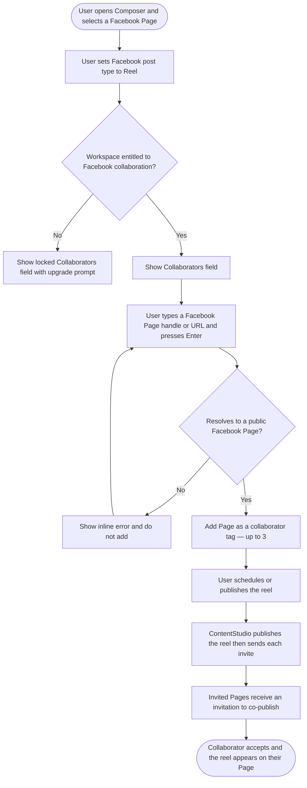
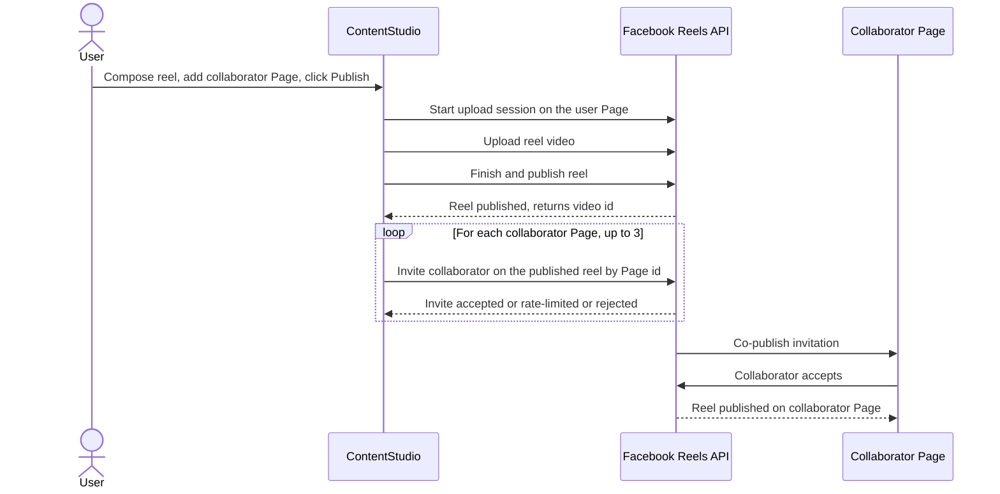

# 02 — Workflow Design: Facebook Reels Collaboration

> **Scope at a glance:** Facebook reel *publishing* already works in ContentStudio, and the composer already offers a "Reel" post type for Facebook. **This feature adds the collaborator invite** — letting a user invite another Facebook Page to co-publish their reel, mirroring the existing Instagram reel-collaboration UX but adapted to Facebook's API (separate invite call, Page-only collaborators, daily rate limit, accept-required).

---

## 1. Feature Placement

The collaborator field lives **inside the composer, in the Facebook channel options panel**, and only appears when the post is a Facebook **Reel** on a connected Facebook **Page**.

- **Entry point:** Publish → Composer → select a Facebook **Page** → Facebook options panel → set post type to **Reel** → a new **Collaborators** field appears (directly mirroring the Instagram options layout).
- **Component home (FE):** `contentstudio-frontend/src/modules/composer_v2/components/ChannelOptions/FacebookOptions.vue` (the Instagram equivalent lives in `InstagramOptions.vue`).
- **Settings (optional, mirrors Instagram):** saved/recent collaborator Pages persist per workspace so the user can reuse them, mirroring `workspace.social_settings.instagram.collaborators[]` with a Facebook equivalent.
- **Gating:** the field is entitlement-gated (lock icon + upgrade prompt) the same way Instagram collaboration is gated today via `insta_collab_post`.

The collaborator field is **only** shown when **all** of these are true: a Facebook **Page** is selected, the Facebook post type is **Reel**, and the workspace is **entitled** to Facebook collaboration. It is hidden for Facebook Groups/Profiles, for Feed/Story post types, and for non-entitled workspaces.

---

## 2. Workflow Diagram (Overview)

High-level user journey for inviting a collaborator on a Facebook reel:

The multi-system publish-then-invite flow — where Facebook diverges most from Instagram — is detailed as a sequence diagram in section 4.

---

## 3. User Flow (happy path)

1. User opens the Composer and selects a connected Facebook **Page**.
2. In the Facebook options panel, the user sets the post type to **Reel** and attaches a video.
3. A **Collaborators** field appears (it does not appear for Feed or Story, for Groups/Profiles, or if the workspace isn't entitled).
4. The user types a collaborator's Facebook **Page** — by @handle, vanity name, or Page URL — and presses Enter.
5. ContentStudio resolves it to a valid public Facebook Page and adds it as a removable tag. The user can add **up to 3** collaborator Pages. Previously used collaborator Pages appear as quick-pick suggestions.
6. The user finishes composing and clicks **Schedule** or **Publish**.
7. ContentStudio publishes the reel to the user's Page, then sends a co-publish invitation to each collaborator Page.
8. Each collaborator Page receives an invitation. When a collaborator **accepts**, the reel is published on their Page too. Until they accept, nothing appears on their Page.

---

## 4. Alternative & Edge Flows

**Multi-system publish-then-invite sequence (where Facebook differs from Instagram):**

**Edge cases and error states:**

- **Handle does not resolve to a Page** — inline error under the field: *"We couldn't find a public Facebook Page with that name. Collaborators must be Facebook Pages, not personal profiles."* The entry is not added.
- **Personal profile / non-Page entered** — same inline error (Facebook only allows Pages as reel collaborators).
- **Duplicate** — inline toast: *"This collaborator has already been added."* (mirrors Instagram).
- **More than 3** — inline toast: *"You can add up to 3 collaborators per reel."*
- **Post type changed away from Reel** (e.g. to Feed/Story) — the collaborators field hides and any added collaborators are cleared, because Facebook collaboration only applies to reels.
- **Non-Page Facebook account selected** (Group/Profile) — collaborators field is not shown.
- **Daily rate limit hit at publish time** (Meta allows 10 invites/Page/24h) — the **reel still publishes**; a non-blocking warning is recorded against the post: *"Reel published. Some collaborator invites couldn't be sent because the Page hit Facebook's daily invite limit (10 per day). Try inviting them again tomorrow."*
- **Invite fails for one collaborator but not others** — the reel and successful invites stand; failed invites surface as a non-blocking warning naming which Page(s) failed. Publishing is never rolled back for an invite failure.
- **Not entitled** — the field is shown locked with an upgrade prompt (mirrors Instagram's `insta_collab_post` gating).

---

## 5. Key Design Decisions

### Decision 1 — How the user specifies a collaborator Page
Facebook's API needs a **Page ID** (`target_id`), but users think in handles/URLs.

| Option | Pros | Cons |
|---|---|---|
| **A. Free-text handle / URL, resolved to a Page ID server-side** (recommended) | Matches the familiar Instagram "type a handle" UX, lowest friction | Requires a resolve+validate step, must clearly reject non-Pages |
| B. Require a raw numeric Page ID | Trivial to implement, unambiguous | Terrible UX — users rarely know Page IDs |
| C. Pick only from the user's own connected Pages | No resolution needed, always valid | Defeats the purpose — collaboration is usually with *other people's* Pages |

**Recommendation: A.** Accept an @handle, vanity name, or Page URL and resolve it to a Page ID on the backend, with a clear inline error when it isn't a public Page. This keeps the UX consistent with Instagram while honoring Facebook's Page-only constraint. (Open question for the PRD: confirm we can resolve arbitrary public Page handles → IDs with our app's permissions; if not, fall back to accepting a Page URL that contains the numeric ID.)

### Decision 2 — Max collaborators per reel
Instagram caps at 3 per post. Facebook's documented limit is a **rate** limit (10 invites/Page/24h), not a clearly documented per-reel cap.

**Recommendation:** Mirror Instagram with a **cap of 3 per reel** for UX consistency, and surface the **10/day** rate limit as a runtime error if a high-volume user hits it. (Open question: confirm Meta's actual per-reel collaborator maximum; adjust the cap if it differs.)

### Decision 3 — Invite delivery & failure handling
The invite is a **separate, post-publish** call that can partially fail.

**Recommendation:** Publish the reel first, then send invites **best-effort**. A failed or rate-limited invite **never** fails the reel — it surfaces as a non-blocking warning on the post. This matches Instagram's existing fire-and-forget collaborator behavior and avoids losing a published reel over an invite hiccup.

### Decision 4 — Acceptance tracking
Meta requires the collaborator to accept; ContentStudio has **no webhook infrastructure** for collaborator acceptance today (Instagram doesn't track it either).

**Recommendation:** **v1 is fire-and-forget** — we send the invite and stop. Showing accepted/pending/declined status (via webhooks or polling) is deferred to v2. Set user expectations in helper text: *"Collaborators must accept your invite before the reel appears on their Page."*

### Decision 5 — Entitlement / gating — ✅ DECIDED
Instagram collaboration is gated by `insta_collab_post`.

**Decision (PO, review gate):** Gate Facebook collaboration behind a **new `fb_collab_post` addon**, mirroring Instagram's lock-icon + upgrade-modal pattern. Not combined with the Instagram entitlement.

### Decision 6 — Surface coverage — ✅ DECIDED (scope expanded)
The composer is the primary surface, but ContentStudio creates/schedules posts from several surfaces. The PO confirmed at the review gate that collaboration should reach **all** of them, each as its own ticket:

- **Web composer** (`composer_v2`) — primary
- **Flutter (mobile) composer** — in v1, not deferred
- **Public API v1** (`routes/api/v1.php` → `Api/V1/PostController`) — the shared chokepoint for API/Zapier/Make/CLI
- **CLI** (`@contentstudio/cli`, npm) — thin TypeScript client over the public API (`posts create`)
- **Zapier** connector (Create Post action)
- **Make** connector (Create Post module)
- **MCP** (`app/Mcp/Tools/CreatePostTool.php`) — parallel Laravel tool path
- **Smart Scheduling** — collaborators must survive a smart-scheduled reel

**Dependency note:** the core backend (data model + publish-time invite) and the public API are foundational. CLI, Zapier, and Make sit on top of the public API, so they depend on the API story. MCP is independent. Smart scheduling is a time-only concern, so collaborators are expected to carry through automatically — the ticket covers verifying that and exposing the field if the smart-scheduling payload is separate.

---

## 6. Integration with Existing Features

- **Composer (`composer_v2`):** the collaborators field is added to the Facebook options panel, reusing the Instagram collaborator input/tag/dropdown UI almost verbatim.
- **Publishing pipeline:** reuses the existing `FacebookPlatform → processVideoPost` reel publish flow; the invite is a new post-publish step keyed off the returned `video_id`.
- **Plan / post model:** adds `facebook_collaborators` alongside the existing `facebook_options` and `instagram_collaborators`, so scheduled reels carry their collaborators through to publish time.
- **Saved collaborators / workspace settings:** mirrors `workspace.social_settings.instagram.collaborators[]` so previously used Facebook collaborator Pages are remembered.
- **Billing / entitlements:** reuses the addon-gating + upgrade-modal flow already used by Instagram collaboration.
- **Planner / calendar:** scheduled reels with collaborators behave like any scheduled reel; no change to the calendar beyond carrying the new field.

---

## 7. Trackable Actions (Usermaven candidates)

| Candidate event | Trigger | Why it matters |
|---|---|---|
| `facebook_collaborators_added` | A reel is published/scheduled with ≥1 Facebook collaborator | Adoption of the collaboration feature, avg collaborators per reel |
| `addon_purchased` (existing) | User upgrades to unlock Facebook collaboration from the locked field | Conversion from the gated field — reuse the existing event with `{ addon: 'fb_collab_post' }` |

Notes:
- Reuse the existing `addon_purchased` event for the upgrade path rather than inventing a new one (per guidelines §19 — search `userMaven.track(` first; confirm the exact `addon` value with billing).
- Before finalizing `facebook_collaborators_added`, check whether an analogous Instagram-collaborator event already exists and mirror its name/shape for consistency. The PRD §3.1 will lock the final names + payloads.
- Do **not** track field focus, typing, or tag removal — those are trivial UI interactions.

---

## 8. Scope Recommendation

**Core (in scope for v1):**
- **Backend (foundational):** persist `facebook_collaborators` on the plan/DTO/config/templates/share-links, resolve handles → Page IDs, send the post-publish `POST /{video-id}/collaborators` invites (best-effort), handle non-Page/duplicate/cap/rate-limit errors, add the `fb_collab_post` entitlement, and add saved-collaborator endpoints (mirror of the Instagram ones).
- **Web composer (FE):** collaborators field in the Facebook options panel, shown only for Facebook **Page** + **Reel** + entitled workspace. Add up to **3** collaborator Pages by handle/URL with inline errors, saved/recent suggestions, lock + upgrade gating, and Usermaven instrumentation per §7.
- **`[Design]`** story for the field/states (one per epic, per our design-story rule).

**Surface coverage (in scope for v1 — one ticket each, per §5 Decision 6):**
- **Flutter** composer collaborators field (mobile parity)
- **Public API v1** — accept `facebook_collaborators` on create/update post (foundational for CLI/Zapier/Make)
- **CLI** — `--facebook-collaborators` on `posts create` + TS client
- **Zapier** — Facebook Collaborators input on the Create Post action
- **Make** — Facebook Collaborators field on the Create Post module
- **MCP** — `facebook_collaborators` in the `CreatePostTool` input schema
- **Smart Scheduling** — verify collaborators carry through a smart-scheduled reel (expose the field if its payload is separate)

**Deferred to v2:**
- **Collaborator acceptance/decline status** (webhook or polling, status badges in planner/analytics).
- Bulk/managed list of saved collaborator Pages in a dedicated settings screen (beyond simple recents reuse).
- Collaboration on any Facebook surface other than reels (not supported by the API).

**Open question carried to the PRD (engineering):**
- Can our app resolve arbitrary public Page handles → IDs with current permissions, or must we require a Page URL/ID? *(Decision 1)*
