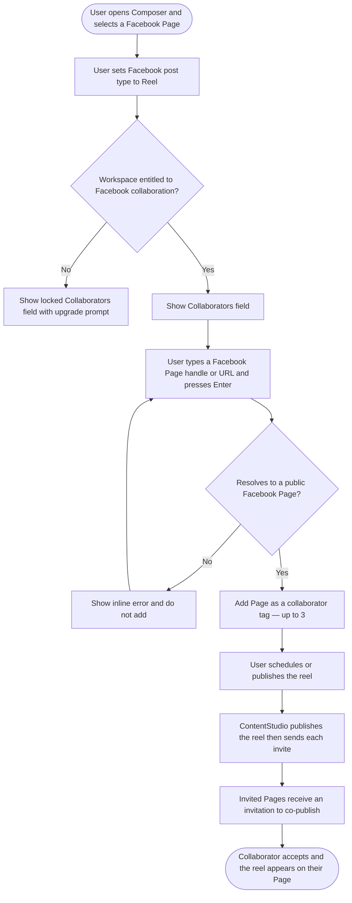

# **PRD: Facebook Reels Collaboration**

**Author:** Ghulam Jaffar
**Last Updated:** 2026-06-29
**Status:** Draft
**Target Release:** Q3 2026

---

## **1. Overview**

ContentStudio already publishes Facebook reels and already lets Instagram users invite collaborators on a reel. This feature closes the gap by bringing **collaborator invites to Facebook reels**: when a user composes a Facebook reel, they can invite up to three other Facebook **Pages** to co-publish it. The reel publishes to the user's Page as usual, and each invited Page receives a co-publish invitation — when they accept, the reel also appears on their Page, doubling reach with a shared piece of content. The collaborator field mirrors the familiar Instagram experience, and the capability is exposed across every surface that creates a post: the web composer, the Flutter mobile composer, the public API, the CLI, Zapier, Make, and MCP.

---

## **2. Problem Statement**

**What problem are we solving?**

Facebook Reels collaboration (Meta's "invite a collaborator" capability for reels) is a real Meta API feature, but ContentStudio users have no way to use it — they can publish a Facebook reel, but they cannot invite a partner Page to co-publish it. Meanwhile, the same users already enjoy collaborator invites for Instagram reels inside ContentStudio, so the absence on Facebook is a visible inconsistency. Agencies and creators who run joint campaigns (brand × creator, brand × brand) must currently publish the reel and then manually add a collaborator inside the native Facebook app — defeating the point of a scheduling tool.

**Who has this problem?**

Creators, brands, and agencies who run Facebook Page reels as part of co-marketing or creator partnerships — the same segment that already uses Instagram collaboration. It is felt most by agency and multi-brand workspaces that schedule reels in bulk and cannot break flow to finish the collaboration step natively. Automation users (API/CLI/Zapier/Make/MCP) who script their reel publishing have no field to pass a collaborator at all.

**What happens if we don't solve it?**

We cede a table-stakes capability to competitors who already surface Facebook reel collaboration, leave a confusing IG-has-it/FB-doesn't gap in our own product, and force partnership-driven users out of ContentStudio to finish a routine task — eroding the "publish everywhere from one place" value proposition and creating support questions about why Facebook behaves differently from Instagram.

---

## **3. Goals & Success Metrics**

| Goal | Metric | Target | How We'll Measure |
| ----- | ----- | ----- | ----- |
| Primary: drive adoption of Facebook reel collaboration | % of Facebook reels published with ≥1 collaborator | 15% of FB reels within 90 days | Usermaven `facebook_collaborators_added` ÷ FB reels published |
| Secondary: monetize via the new addon | `fb_collab_post` addon attach | 5% of eligible workspaces in 90 days | Usermaven `addon_purchased` with `addon: 'fb_collab_post'` |
| Secondary: parity across surfaces | Collaboration used on ≥3 non-composer surfaces (API/CLI/Zapier/Make/MCP/mobile) | ≥3 surfaces see usage in 90 days | `facebook_collaborators_added` sliced by `source` |
| Guard rail: publishing reliability unaffected | FB reel publish success rate delta | <1% regression | Posting success logs |
| Guard rail: invites don't break posts | Reels published but invite failed are still "published" | 100% (no post failure caused by invite) | Posting/log review |

### **3.1 Analytics Events (Usermaven)**

| Event Name | Trigger | Payload | What we measure with it |
| ----- | ----- | ----- | ----- |
| `facebook_collaborators_added` | A Facebook reel is published/scheduled with ≥1 collaborator. Fires **FE** for the web composer; fires **BE** (server-side) for API/CLI/Zapier/Make/MCP-originated posts. | `{ number_of_collaborators, source }` — `source` ∈ `composer`, `api`, `cli`, `zapier`, `make`, `mcp`, `mobile` | Feature adoption, avg collaborators per reel, which surfaces drive usage |
| `addon_purchased` *(existing — reuse)* | User completes checkout to unlock Facebook collaboration from the locked field's upgrade modal | `{ addon: 'fb_collab_post' }` | Conversion from the gated field, addon attach rate |

**Notes (per story guidelines §19):**
- `addon_purchased` already exists — reuse it; do not invent a new monetization event. Confirm the exact `addon` slug (`fb_collab_post`) with billing.
- Before implementation, search `contentstudio-frontend/src/` for `userMaven.track(` to confirm there is no existing Instagram-collaborator analog to align naming with; if one exists, match its shape.
- Do **not** track field focus, typing, tag add/remove, or post-type switching — those are trivial UI interactions.

---

## **4. Target Users**

**Primary Persona:**
*Partnership-driven creator / brand social manager* — runs Facebook Page reels as part of co-marketing or creator collaborations. Comfortable with the composer, already uses Instagram collaboration, expects Facebook to behave the same way. Cares about reach and not breaking flow.

**Secondary Persona:**
*Agency operator / automation user* — schedules reels in bulk or programmatically (API, CLI, Zapier, Make, MCP) for multiple clients. Wants to set collaborators as part of the same automated pipeline without manual native-app steps.

**Non-Users (explicitly out of scope):**
- Users publishing Facebook **feed** posts or **stories** — Meta only supports collaboration on reels.
- Users posting from Facebook **Groups** or personal **Profiles** — reels and reel collaboration are **Page-only**.
- Users wanting to invite a personal Facebook **profile** as a collaborator — Meta only allows **Pages**.
- Users wanting to see whether a collaborator **accepted** — acceptance status tracking is deferred to v2.

---

## **5. User Stories / Jobs to Be Done**

| ID | As a... | I want to... | So that... | Priority |
| ----- | ----- | ----- | ----- | ----- |
| US-1 | Brand social manager | invite a partner's Facebook Page to co-publish my reel | the reel reaches both audiences from one publish action | Must Have |
| US-2 | Creator | add up to 3 collaborator Pages by typing their handle | I don't need to know technical Page IDs | Must Have |
| US-3 | User on a non-eligible setup | only see the collaborators field when it's actually usable (Page + reel + entitled) | I'm not confused by an option I can't use | Must Have |
| US-4 | Agency operator | set Facebook collaborators when creating a post via the API/CLI | my automated reel pipeline can include collaborations | Must Have |
| US-5 | Zapier/Make user | choose Facebook collaborators in my Zap/scenario's Create Post step | no-code automations support collaboration | Should Have |
| US-6 | MCP / AI-assistant user | pass Facebook collaborators when an agent creates a reel | AI-driven publishing can include collaborations | Should Have |
| US-7 | Mobile user | add Facebook collaborators from the app | I can set up collaborations on the go | Should Have |
| US-8 | Returning user | reuse Pages I've collaborated with before | I don't retype the same partners every time | Should Have |
| US-9 | Workspace owner | unlock Facebook collaboration via an addon | I can access the capability when my plan doesn't include it | Must Have |

---

## **6. Requirements**

### **6.1 Must Have (P0)**

- The post/plan data model persists a `facebook_collaborators` array (alongside the existing `facebook_options` and `instagram_collaborators`), carried through to publish time including via post **templates** and approval **share-links**.
- At publish time, after the reel is published (existing `processVideoPost` flow returns the `video_id`), the system sends a **separate** `POST /{video-id}/collaborators` invite per collaborator (`target_id` = the collaborator's Page ID).
- The system resolves a user-entered Facebook **Page** handle / vanity / URL into a Page ID, and rejects anything that is not a resolvable public Page (e.g. a personal profile).
- Inviting is **best-effort**: a failed or rate-limited invite never fails the published reel; failures are logged and surfaced as a non-blocking warning on the post.
- Web composer: a Collaborators field in the Facebook options panel, shown **only** when a Facebook **Page** is selected **and** post type is **Reel** **and** the workspace is entitled. Add up to **3** Pages, with tag chips, inline validation, and saved/recent suggestions.
- Entitlement gating via a new **`fb_collab_post`** addon, reusing the Instagram lock-icon + upgrade-modal pattern.
- Saved-collaborator storage + management mirroring Instagram: `workspace.social_settings.facebook.collaborators`, with list/save/delete endpoints.
- Public **API v1** create/update post accepts and validates `facebook_collaborators`, and the field is published in the OpenAPI spec.
- `facebook_collaborators_added` and `addon_purchased` (`fb_collab_post`) analytics events per §3.1.
- A `[Design]` deliverable for the field and its states (one design story for the epic).

### **6.2 Should Have (P1)**

- **Flutter (mobile) composer:** the Collaborators field at parity with web (same eligibility rules, cap, validation).
- **CLI:** a `--facebook-collaborators` option on `posts create` (and the underlying TypeScript client), passed through to the public API.
- **MCP:** a `facebook_collaborators` parameter on the `create_post` tool — plus a `post_type` parameter (the tool currently has none and defaults to feed), so an agent can actually create a reel with collaborators.
- **Zapier:** a Facebook Collaborators input on the Create Post action (driven by the updated OpenAPI spec + connector definition).
- **Make:** a Facebook Collaborators field on the Create Post module (same mechanism as Zapier).
- **Smart Scheduling:** no separate ticket — smart scheduling only sets the publish time, so collaborators ride along on the post automatically. Covered as a smoke-test within the core BE and public API QA rather than its own story.

### **6.3 Nice to Have (P2)**

- Server-side `facebook_collaborators_added` emission for API/CLI/Zapier/Make/MCP-originated reels (so adoption can be sliced by `source` for non-composer surfaces).
- Helper UX that suggests the user's own *other* connected Facebook Pages as quick collaborator picks.

### **6.4 Explicitly Out of Scope**

- **Collaborator acceptance / decline status** (webhooks or polling, status badges in planner/analytics) — deferred to v2; ContentStudio has no webhook infra for this today and Instagram collaboration is also fire-and-forget.
- Collaboration on Facebook **feed**, **story**, or **carousel** — Meta supports it only on reels.
- Collaboration from Facebook **Groups** or personal **Profiles**.
- Inviting **personal profiles** as collaborators.
- A dedicated saved-collaborators management settings screen beyond simple recents reuse.

---

## **7. User Flow (High Level)**

1. User opens the Composer and selects a connected Facebook **Page**.
2. User sets the Facebook post type to **Reel** and attaches a video.
3. The **Collaborators** field appears (hidden for Feed/Story, Groups/Profiles, or non-entitled workspaces; shown locked with an upgrade prompt if the workspace isn't entitled).
4. User types a collaborator's Facebook **Page** (handle, vanity, or URL) and presses Enter; ContentStudio resolves and validates it, then adds it as a removable tag (up to 3). Recently used Pages appear as quick picks.
5. User schedules or publishes the reel.
6. ContentStudio publishes the reel to the user's Page, then sends a co-publish invite to each collaborator Page.
7. Each invited Page receives an invitation; when a collaborator **accepts**, the reel publishes on their Page too.

**Overview workflow diagram** (identical to `02-workflow.md`):

The multi-system publish-then-invite sequence diagram is in `02-workflow.md` §4.

---

## **8. Business Rules & Constraints**

| Rule ID | Rule | Rationale |
| ----- | ----- | ----- |
| BR-1 | Collaboration applies **only** to Facebook **reels** | Meta's collaborators edge exists only on `video_reels` |
| BR-2 | Both the publishing account and every collaborator must be a Facebook **Page** | Meta: "You can only publish Reels to other Facebook Pages" |
| BR-3 | A maximum of **3** collaborators per reel | Parity with Instagram for UX consistency (confirm Meta's per-reel max — see Open Questions) |
| BR-4 | The invite is sent **after** the reel is published, as a separate call keyed to the returned `video_id` | Meta's API requires a published video to attach collaborators to |
| BR-5 | Inviting is **best-effort** — an invite failure never fails the reel | Avoid losing a published reel over an invite hiccup; matches Instagram's fire-and-forget model |
| BR-6 | Respect Meta's limit of **10 collaborator invites per Page per 24 hours**; surface a clear error when exceeded | Hard Meta rate limit |
| BR-7 | Changing post type away from Reel clears any added collaborators | Collaborators are meaningless on non-reel types |
| BR-8 | The collaborators field/capability is gated behind the **`fb_collab_post`** addon | Monetization decision (PO) |
| BR-9 | A collaborator must **accept** before the reel appears on their Page; ContentStudio does not track acceptance in v1 | Meta requires acceptance; status tracking deferred to v2 |
| BR-10 | Saved collaborator Pages are stored per workspace (capped, mirroring Instagram's cap of 50) | Reuse without unbounded growth |

---

## **9. Open Questions**

| Question | Options | Owner | Due Date | Decision |
| ----- | ----- | ----- | ----- | ----- |
| Can our app resolve arbitrary public Page handles → Page IDs with current Graph permissions? | Yes (resolve server-side) / No (require Page URL or numeric ID) | Engineering | Before BE story start | Pending |
| What is Meta's actual maximum collaborators **per reel**? | Confirm vs. our assumed cap of 3 | Engineering | Before FE story start | Pending — assume 3 |
| Is the `fb_collab_post` addon a standalone purchase, or bundled with `insta_collab_post` into a "collaboration" addon? | Standalone / Bundled | PO + Billing | Before gating story | Pending — assume standalone `fb_collab_post` |
| Should server-side `facebook_collaborators_added` fire for API/CLI/MCP posts in v1, or is composer-only tracking enough? | v1 / defer to P2 | PO | Before API story | Pending |
| For Zapier/Make, do we own connector updates or does a partner/agency? | Internal / external | PO | Before connector stories | Pending |

---

## **10. Risks & Mitigations**

| Risk | Likelihood | Impact | Mitigation |
| ----- | ----- | ----- | ----- |
| Page-handle → Page-ID resolution isn't possible with our permissions | Medium | High | Confirm early (Open Questions); fall back to accepting a Page URL/ID; validate and show a clear inline error |
| Users try to add personal profiles or non-Pages | High | Medium | Inline validation + explicit copy that collaborators must be Pages; reject non-Pages at resolution time |
| Meta rate limit (10/Page/24h) hit by bulk schedulers | Medium | Medium | Best-effort invites, non-blocking warning, clear "try again tomorrow" message; never fail the reel |
| Invite succeeds but collaborator never accepts → user expects it live | Medium | Low | Helper copy sets expectation that collaborators must accept; status tracking is v2 |
| Surface drift — field exposed inconsistently across API/CLI/Zapier/Make/MCP | Medium | Medium | Single source of truth: public API + OpenAPI spec; connectors derive from it; shared core BE handling |
| MCP can't actually create reels (no `post_type` param today) | High | Medium | Add a `post_type` parameter to the MCP tool alongside collaborators, or document the limitation |
| Meta API/version changes break the collaborators edge | Low | High | Centralize in `FacebookPlatform`; pin Graph version via existing `FACEBOOK_GRAPH_VERSION` config |

---

## **11. Dependencies**

**Internal:**
- Existing Facebook reel publishing — `contentstudio-backend/app/Libraries/Integrations/Platforms/Social/Facebook/FacebookPlatform.php::processVideoPost()` (init → upload → poll → publish). The invite step hooks in after publish.
- Existing Instagram collaboration as the pattern to mirror — `InstagramPlatform::addCollaborators()`, `instagram_collaborators` plumbing across `PlanData`, `Plans`, `PlansRepository`, `config/socialPost.php`, `SocialPostingController`, `SocialPostTemplate`, `ShareLinkController`, and saved-collaborators via `SocialHelper` + `WorkspaceController`/`WorkspaceRepo`.
- Web composer — `contentstudio-frontend/src/modules/composer_v2/components/ChannelOptions/FacebookOptions.vue` (add field, mirroring `InstagramOptions.vue`) and `SocialModal.vue` state.
- Public API v1 — `app/Http/Controllers/Api/V1/PostController.php::store()` + `app/Http/Requests/Api/V1/PostStoreRequest.php` (which internally calls `SocialPostingController::processSocialShare`).
- MCP — `app/Mcp/Tools/CreatePostTool.php` (POSTs to the v1 API).
- Billing/entitlements — addon registration for `fb_collab_post`.
- CLI — `@contentstudio/cli` (TypeScript client over the public API; separate repo/package).

**External:**
- Meta Graph API: the `video_reels` collaborators edge — `POST /{video-id}/collaborators` with `target_id` = Page ID; 10 invites/Page/24h; acceptance required; Pages only. Graph version via `FACEBOOK_GRAPH_VERSION`.
- Zapier and Make connector platforms (external connector definitions auto-discover from the OpenAPI spec).

**Blockers:**
- Confirm Page-handle → Page-ID resolution feasibility (Open Questions) before the core BE story.
- `fb_collab_post` addon must exist in billing before gating can be enforced end-to-end.

---

## **12. Appendix**

- **Workflow & diagrams:** `docs/features/facebook-reels-collaboration/02-workflow.md`
- **Codebase + Meta API grounding:** `docs/features/facebook-reels-collaboration/01-research.md`
- **Meta reference:** [Publish a Reel — Meta Video API](https://developers.facebook.com/docs/video-api/guides/reels-publishing/)
- **Related prior pipeline work:** `docs/features/contentstudio-public-cli-agent-skills/`, `docs/features/public-webhooks/`, `docs/technical/public-cli-strategy-2026-04-08.md`
- **Instagram collaboration (pattern to mirror):** `InstagramOptions.vue` (FE), `InstagramPlatform::addCollaborators()` (BE)

---

## **Changelog**

| Date | Author | Changes |
| ----- | ----- | ----- |
| 2026-06-29 | Ghulam Jaffar | Initial draft. Scope reframed (FB reel publishing already exists; gap is the collaborator invite). Surface coverage expanded to web composer, Flutter, public API, CLI, Zapier, Make, MCP, and smart-scheduling per PO. Gating via new `fb_collab_post` addon. |
