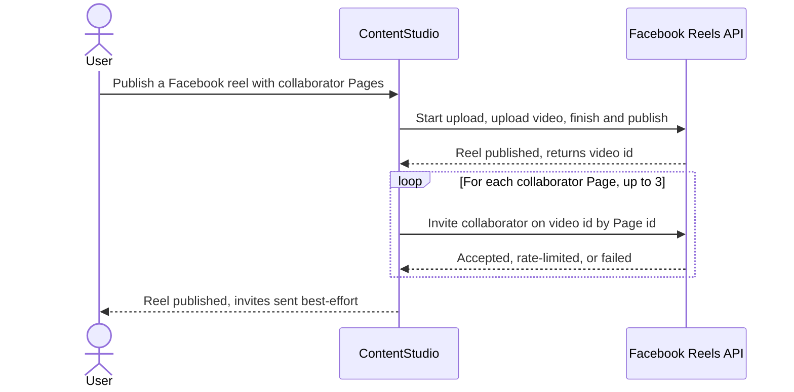
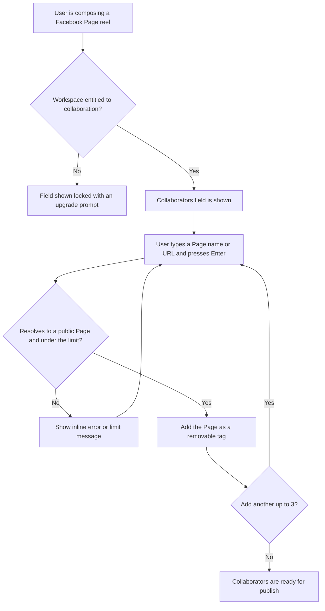

# 04 — Epic + Stories: Facebook Reels Collaboration

> Local deliverable for the Product Owner to create in Helpin manually. The pipeline does not push anywhere. Stories are ordered roughly by dependency; reference each other by full title.

---

## Epic: Facebook Reels Collaboration

**Description**

ContentStudio already publishes Facebook reels and already lets users invite collaborators on Instagram reels. This epic brings the **collaborator invite to Facebook reels**: when composing a Facebook Page reel, a user can invite up to three other Facebook **Pages** to co-publish it. The reel publishes to the user's own Page as it does today, and each invited Page receives a co-publish invitation — when they accept, the reel also appears on their Page.

Unlike Instagram (which passes collaborator usernames inline on a single publish call), Facebook requires a **separate** invite call after the reel is published: `POST /{video-id}/collaborators` with `target_id` set to the collaborator's **Page ID**. Only Pages can collaborate, Meta enforces a limit of 10 invites per Page per 24 hours, and the collaborator must accept before the reel appears on their Page. Inviting is therefore handled as a best-effort step after publish — a failed invite never fails the published reel.

The capability is exposed across every surface that creates a post: the web composer, the Flutter mobile composer, the public API, the CLI, Zapier, Make, and MCP. It is gated behind a new `fb_collab_post` add-on, mirroring the existing Instagram collaboration gate. Collaborator acceptance/decline status tracking is intentionally out of scope for this release (v2).

**Goals**
- Let users invite Facebook Page collaborators on reels from any post-creation surface.
- Mirror the familiar Instagram collaboration UX while honoring Facebook's Page-only, accept-required, rate-limited model.
- Monetize via the `fb_collab_post` add-on and measure adoption with Usermaven.

---

## Story 1 — [Design] Design the Facebook reel collaborators field and its states

### Description:
As a product designer, I want to define the Facebook reel collaborators field and all of its states so that frontend and Flutter engineers have a clear, consistent spec to build against — reusing the Instagram collaborators pattern but adapted for Facebook's Page-only collaboration.

### Workflow:
The designer produces the visual spec for the collaborators field that appears inside the Facebook options panel when a Facebook Page reel is being composed. The field mirrors the existing Instagram collaborators field but reflects Facebook-specific copy and constraints (Pages only, must accept). The same spec covers web and mobile (Flutter) so both reach parity.

### Acceptance criteria:
- [ ] Spec covers the collaborators field in the Facebook options panel: input, added-collaborator tags/chips, and the saved/recent suggestions list.
- [ ] All states are designed: empty (placeholder), focus (with "Press Enter to add" hint), one to three added collaborators, resolving/loading, inline error, duplicate, limit reached, and the locked/upgrade state for non-entitled workspaces.
- [ ] Spec specifies which `@contentstudio/ui` components map to each element and flags any gap (there is no dedicated Pill/Chip or Tooltip component in the library — see Mock-ups note).
- [ ] Spec uses CSS-variable theme classes (`text-primary-cs-*`, `bg-primary-cs-*`) for primary accents and neutral grays elsewhere — no hardcoded colors, so white-label theming works.
- [ ] Spec includes the info-icon tooltip content and the "collaborators must accept" expectation-setting note.
- [ ] Redlines/handoff cover both web composer and Flutter composer layouts.
- [ ] No dark-mode or RTL variants required (not supported).

### Mock-ups:
This story produces the mock-ups. Reference the Instagram collaborators field in `InstagramOptions.vue` as the visual baseline. Library gaps to call out for engineering: no dedicated Pill/Chip component (tags use `Badge` or a simple themed Tailwind pill) and no standalone Tooltip component (use `CstPopup` or a Tailwind-based approach).

### Impact on existing data:
None.

### Impact on other products:
Spec feeds both the web composer and the Flutter app so the field is consistent across products.

### Dependencies:
None — this story unblocks **[FE] Add the Facebook reel collaborators field to the web composer** and **[Flutter] Add the Facebook reel collaborators field to the mobile composer**.

### Global quality & compliance (wherever applicable)
- [ ] Mobile responsiveness (frontend only, N/A for backend-only stories)
- [ ] Multilingual support (frontend + backend, translations available or fallback handled)
- [ ] UI theming support (default + white-label, design library components are being used)
- [ ] White-label domains impact review
- [ ] Cross-product impact assessment (web, mobile apps, Chrome extension)

---

## Story 2 — [BE] Publish Facebook reel collaborator invites and persist the collaborators field

### Description:
As a user publishing a Facebook reel with collaborators, I want ContentStudio to publish my reel and then invite each collaborator Page to co-publish it, so that the reel can appear on my partners' Pages without me finishing the step manually in the Facebook app. This story adds the `facebook_collaborators` field to the post data model and the publish-time invite logic.

### Workflow:

When a Facebook reel that carries collaborators is published, the existing reel publish flow runs unchanged and returns the published reel's video id. The system then resolves each collaborator entry to a Facebook Page id and sends one collaborator invite per collaborator against that video id. The reel's published status is never affected by invite outcomes.

### Acceptance criteria:
- [ ] A `facebook_collaborators` array is persisted on the post/plan and carried from scheduling through to publish, including when the post originates from a saved post template or an approval share-link.
- [ ] Each collaborator value entered as a Page handle, vanity name, or Page URL is resolved to a Facebook Page id before the invite is sent.
- [ ] A value that does not resolve to a public Facebook Page (e.g. a personal profile) is rejected and not sent as an invite; the rejection is recorded against the post without failing the reel.
- [ ] After the reel is published, the system sends a separate collaborator invite per collaborator against the published reel's video id (target = the collaborator's Page id).
- [ ] At most 3 collaborators are processed per reel; any beyond 3 are ignored.
- [ ] If an invite fails (invalid target, Meta rate limit of 10 per Page per 24 hours, or any API error), the reel remains published and a non-blocking warning is recorded identifying which collaborator(s) failed and why.
- [ ] Collaborator invites are only attempted for Facebook **reel** posts on **Page** accounts — never for feed, story, carousel, group, or profile posts.
- [ ] Collaborator handles are normalized (leading `@` stripped, trimmed) before resolution, matching the Instagram normalization behavior.
- [ ] When a published reel includes at least one successfully processed collaborator and the post originated from a server-side surface (API/CLI/Zapier/Make/MCP), a `facebook_collaborators_added` Usermaven event fires server-side with `{ number_of_collaborators, source }` (the composer fires its own event client-side — see the web composer story).

### Mock-ups:
N/A — backend only.

### Impact on existing data:
Adds a new optional `facebook_collaborators` array to the post/plan documents (MongoDB, schema-less — no migration). Existing posts without the field are unaffected. The workspace `social_settings.facebook` document gains a `collaborators` list (see the entitlement/saved-collaborators story).

### Impact on other products:
The web composer, Flutter app, public API, MCP, CLI, Zapier, and Make all rely on this field being persisted and acted on at publish time. This is the foundational story for the epic.

### Dependencies:
None upstream. Unblocks **[FE] Add the Facebook reel collaborators field to the web composer**, **[Flutter] Add the Facebook reel collaborators field to the mobile composer**, and **[BE] Accept Facebook collaborators in the public API v1 and OpenAPI spec**.

### Global quality & compliance (wherever applicable)
- [ ] Mobile responsiveness — N/A, backend only
- [ ] Multilingual support (frontend + backend, translations available or fallback handled)
- [ ] UI theming support — N/A, backend only
- [ ] White-label domains impact review
- [ ] Cross-product impact assessment (web, mobile apps, Chrome extension)

### Implementation references
*Pointers from research — not a contract. Engineering may choose a different approach.*

**Primary entry points:**
- `contentstudio-backend/app/Libraries/Integrations/Platforms/Social/Facebook/FacebookPlatform.php` — `reelPost()` → `processVideoPost()` already does init → upload → poll → publish and has the published `video_id` after the `finish` call; the collaborator invite hooks in right after publish.
- `contentstudio-backend/app/Libraries/Integrations/Platforms/Social/InstagramPlatform.php::addCollaborators()` (~line 594) — the normalization pattern to mirror (`ltrim($collaborator, '@')`).
- `contentstudio-backend/app/Models/Publish/Planner/Plans.php` (fillable ~line 93), `app/Data/Planner/PlanData.php` (~line 113), `config/socialPost.php` (~line 527), `app/Repository/Publish/Planner/PlansRepository.php` (~line 317), `app/Models/SocialPostTemplate.php`, `app/Http/Controllers/Planner/ShareLinkController.php`, `app/Http/Controllers/Planner/SocialPostingController.php` (~line 719 safe-fields list) — every place `instagram_collaborators` appears today; add a `facebook_collaborators` sibling.
- Graph helper: `app/Libraries/Inbox/HelperClasses/FacebookHelper.php::fbHttpPostRequest()` (adds `appsecret_proof`); Graph version via `FACEBOOK_GRAPH_VERSION`.

**Meta API:**
- Invite edge: `POST /{video-id}/collaborators` with `target_id` = collaborator Page id. Pages only. 10 invites/Page/24h. Collaborator must accept. See `01-research.md`.

**Gotcha:**
- Instagram's invite is inline on the media container; Facebook's is a separate post-publish call — do not try to add a `collaborators` field to the `video_reels` `finish` payload (it is not supported there).

---

## Story 3 — [BE] Add the fb_collab_post entitlement and saved Facebook collaborator endpoints

### Description:
As a workspace owner, I want Facebook reel collaboration to be unlockable via an add-on and to have my previously used collaborator Pages remembered, so that I can access the capability on my plan and reuse partners without retyping them. This story adds the `fb_collab_post` entitlement and the saved-collaborator endpoints, mirroring the Instagram equivalents.

### Workflow:
The backend exposes a `fb_collab_post` entitlement that the frontend and mobile apps check to decide whether the collaborators field is unlocked. When a reel with collaborators is published, the collaborator Pages are saved to the workspace so they can be suggested next time. Endpoints allow listing and removing saved collaborators.

### Acceptance criteria:
- [ ] A `fb_collab_post` entitlement/feature flag exists and is reported in the workspace/feature-access payload the apps already consume for `insta_collab_post`.
- [ ] When a Facebook reel with at least one collaborator is published, the collaborator Pages are merged into the workspace's saved Facebook collaborators at `social_settings.facebook.collaborators` (de-duplicated, capped at 50 — matching the Instagram cap).
- [ ] An endpoint returns the workspace's saved Facebook collaborator Pages.
- [ ] An endpoint removes a saved Facebook collaborator Page from the workspace.
- [ ] Endpoints are workspace-scoped and respect the same authorization as the Instagram collaborator endpoints.
- [ ] Saving/removing saved collaborators never affects already-published posts.

### Mock-ups:
N/A — backend only.

### Impact on existing data:
Adds a `collaborators` array under the workspace `social_settings.facebook` document. No migration (schema-less). Adds a new entitlement key consumed by feature-access checks.

### Impact on other products:
The web composer and Flutter app use `fb_collab_post` to gate the field and the saved endpoints to power suggestions. Billing must register the `fb_collab_post` add-on for purchase.

### Dependencies:
Relates to **[BE] Publish Facebook reel collaborator invites and persist the collaborators field** (shares the publish path that triggers saving). Unblocks the gating/suggestions parts of **[FE] Add the Facebook reel collaborators field to the web composer** and **[Flutter] Add the Facebook reel collaborators field to the mobile composer**.

### Global quality & compliance (wherever applicable)
- [ ] Mobile responsiveness — N/A, backend only
- [ ] Multilingual support (frontend + backend, translations available or fallback handled)
- [ ] UI theming support — N/A, backend only
- [ ] White-label domains impact review
- [ ] Cross-product impact assessment (web, mobile apps, Chrome extension)

### Implementation references
*Pointers from research — not a contract. Engineering may choose a different approach.*

- Saved-collaborator save logic: `contentstudio-backend/app/Libraries/Publish/Helper/SocialHelper.php` (~line 1210) — the Instagram branch caps the list at 50 and de-dupes; mirror it for `facebook`.
- Endpoints + repo: `routes/api.php` (~line 156, "Instagram Collaborators Management"), `app/Http/Controllers/Settings/WorkspaceController::deleteInstagramCollaborator()` (~line 1279), `app/Repository/Settings/WorkspaceRepo::deleteInstagramCollaborator()` (~line 552) — add `facebook` equivalents.
- Entitlement: follow how `insta_collab_post` is defined and surfaced in the feature-access layer.

---

## Story 4 — [FE] Add the Facebook reel collaborators field to the web composer

### Description:
As a user composing a Facebook Page reel in the web composer, I want to invite up to three other Facebook Pages to co-publish my reel, so that it can reach my partners' audiences too. The field mirrors the Instagram collaborators experience and only appears when collaboration is actually possible.

### Workflow:

1. The user selects a Facebook **Page** in the composer and sets the Facebook post type to **Reel**.
2. A **Collaborators** field appears in the Facebook options panel. It is hidden for Feed/Story post types, for Facebook Groups/Profiles, and when no Facebook Page is selected.
3. If the workspace is not entitled, the field is shown locked with an upgrade prompt; clicking it opens the upgrade modal.
4. The user types a collaborator's Facebook Page (name, vanity, or URL) and presses Enter. While ContentStudio checks the Page, the input shows a brief loading state.
5. On success, the Page is added as a removable tag. The user can add up to 3. Previously used collaborator Pages appear as quick-pick suggestions in a dropdown.
6. The user finishes composing and schedules or publishes the reel.

### Acceptance criteria:
- [ ] The Collaborators field appears in the Facebook options panel only when a Facebook **Page** is selected **and** the post type is **Reel**.
- [ ] The field does not appear for Facebook Feed, Story, or carousel post types, nor for Facebook Group or Profile accounts.
- [ ] When the post type is switched away from Reel, any added collaborators are cleared.
- [ ] Field label: **"Collaborators"**.
- [ ] Input placeholder: **"Invite up to 3 Facebook Pages by name or URL. Only Pages can collaborate — personal profiles can't be added."**
- [ ] On focus, a hint shows: **"Press Enter to add"**.
- [ ] An info icon (`ℹ`) next to the label shows on hover: **"Invite another Facebook Page to co-publish your reel. When they accept, your reel appears on their Page too — great for brand and creator partnerships. Example: invite your agency's Page so the reel posts on both."**
- [ ] While a typed Page is being checked, the input shows a loading indicator and Enter is debounced so the same value isn't added twice.
- [ ] A resolved Page is added as a removable tag chip; clicking the chip's remove control (`×`) removes it.
- [ ] Adding a value that doesn't resolve to a public Page shows the inline error: **"We couldn't find a public Facebook Page with that name. Collaborators must be Facebook Pages, not personal profiles."** and does not add a tag.
- [ ] Adding a duplicate shows: **"This collaborator has already been added."** (case-insensitive) and does not add a second tag.
- [ ] Attempting to add a 4th collaborator shows: **"You can add up to 3 collaborators per reel."**
- [ ] Saved/recent collaborator Pages appear as suggestions in a dropdown as the user types; selecting one adds it as a tag.
- [ ] A short note under the field reads: **"Collaborators must accept your invite before the reel appears on their Page."**
- [ ] When the workspace is **not** entitled to `fb_collab_post`, the field shows a lock icon and the text **"Upgrade to invite collaborators"**; the input is disabled and clicking the locked area opens the existing upgrade modal. Lock/upgrade accents use `text-primary-cs-500` / `bg-primary-cs-50` (no hardcoded colors).
- [ ] When the user publishes or schedules a Facebook reel with at least one collaborator, a `facebook_collaborators_added` Usermaven event fires with `{ number_of_collaborators, source: 'composer' }`.
- [ ] When the user completes the upgrade from the locked field's upgrade modal, an `addon_purchased` Usermaven event fires with `{ addon: 'fb_collab_post' }`.
- [ ] All strings are added via i18n keys under the `composer` namespace and provided in every locale file (fallback to English where a translation is missing).

### Mock-ups:
See **[Design] Design the Facebook reel collaborators field and its states** and PRD §7. Build with `@contentstudio/ui` components: `Dropdown` + `DropdownItem` for the saved-collaborators suggestions, `Icon`/`ActionIcon` for the info and remove controls, `Loader` for the resolving state, and `Alert` for any inline notice. Tag chips: no dedicated Pill/Chip exists in `@contentstudio/ui` — use `Badge` or a themed Tailwind pill (flag confirmed in `docs/ui-components.md`). Mirror the layout of the Instagram collaborators field.

### Impact on existing data:
None new on the frontend beyond sending `facebook_collaborators` in the publish payload (persisted by the backend story).

### Impact on other products:
Establishes the canonical UX that the Flutter app mirrors. No Chrome-extension impact (composer is not in the extension).

### Dependencies:
- **[Design] Design the Facebook reel collaborators field and its states**
- **[BE] Publish Facebook reel collaborator invites and persist the collaborators field**
- **[BE] Add the fb_collab_post entitlement and saved Facebook collaborator endpoints**

### Global quality & compliance (wherever applicable)
- [ ] Mobile responsiveness (frontend only, N/A for backend-only stories)
- [ ] Multilingual support (frontend + backend, translations available or fallback handled)
- [ ] UI theming support (default + white-label, design library components are being used)
- [ ] White-label domains impact review
- [ ] Cross-product impact assessment (web, mobile apps, Chrome extension)

### Implementation references
*Pointers from research — not a contract. Engineering may choose a different approach.*

- Build into `contentstudio-frontend/src/modules/composer_v2/components/ChannelOptions/FacebookOptions.vue`, mirroring the collaborators block in `ChannelOptions/InstagramOptions.vue` (input, saved-suggestions `Dropdown`, tag list, add/remove/validation logic, `canAccess('insta_collab_post')` gating).
- State: add `facebookCollaborators: []` + a `setFacebookCollaborators` handler in `views/SocialModal.vue` (mirror `instagramCollaborators`), default in `views/composerInitialState.ts`, and include `facebook_collaborators` in the publish payload (cleared when post type isn't reel).
- Gating: reuse the lock + upgrade-modal pattern with a new `canAccess('fb_collab_post')` check.
- Saved collaborators: mirror the Instagram fetch/save/delete API calls (`src/api/composer.ts`, `src/config/api-utils.js`) against the new Facebook endpoints.
- i18n: add `composer.facebook_options.collaborators.*` keys to `src/locales/en/composer.json` and mirror to all other locales.
- Usermaven: dispatch via the existing `userMaven.track(` pattern; confirm there's no existing Instagram-collaborator event to align naming with first.

---

## Story 5 — [Flutter] Add the Facebook reel collaborators field to the mobile composer

### Description:
As a mobile user composing a Facebook Page reel, I want to invite up to three Facebook Pages as collaborators, so that I can set up reel collaborations on the go at parity with the web composer.

### Workflow:
1. In the mobile composer, the user selects a Facebook **Page** and sets the Facebook post type to **Reel**.
2. A **Collaborators** field appears with the same eligibility rules as web (Page + Reel + entitled).
3. The user adds up to 3 collaborator Pages by name/URL, sees them as removable chips, and can pick from previously used Pages.
4. The user schedules or publishes the reel; the app sends `facebook_collaborators` in the post payload.

### Acceptance criteria:
- [ ] The Collaborators field appears only for a Facebook Page reel and is hidden for Feed/Story, Groups, and Profiles.
- [ ] The user can add up to 3 collaborator Pages; the 4th attempt shows the limit message.
- [ ] Non-Page / unresolvable entries show the inline error that collaborators must be Pages; duplicates are blocked.
- [ ] When the workspace isn't entitled to `fb_collab_post`, the field is shown locked with an upgrade entry point.
- [ ] Previously used collaborator Pages are offered as suggestions.
- [ ] The same copy as web is used (label, placeholder, accept-note, errors), pulled from mobile localization with English fallback.
- [ ] Publishing a Facebook reel with ≥1 collaborator sends `facebook_collaborators` in the payload and fires `facebook_collaborators_added` with `{ number_of_collaborators, source: 'mobile' }`.
- [ ] Switching the post type away from Reel clears added collaborators.

### Mock-ups:
See **[Design] Design the Facebook reel collaborators field and its states** (Flutter layout) and the web story as the behavioral reference.

### Impact on existing data:
None beyond sending `facebook_collaborators` in the post payload.

### Impact on other products:
Brings mobile to parity with web. No AI involved, so no AI-on-mobile considerations.

### Dependencies:
- **[Design] Design the Facebook reel collaborators field and its states**
- **[BE] Publish Facebook reel collaborator invites and persist the collaborators field**
- **[BE] Add the fb_collab_post entitlement and saved Facebook collaborator endpoints**

### Global quality & compliance (wherever applicable)
- [ ] Mobile responsiveness (frontend only, N/A for backend-only stories)
- [ ] Multilingual support (frontend + backend, translations available or fallback handled)
- [ ] UI theming support (default + white-label, design library components are being used)
- [ ] White-label domains impact review
- [ ] Cross-product impact assessment (web, mobile apps, Chrome extension)

### Implementation references
*Pointers from research — not a contract. Engineering may choose a different approach.*

- Target the Flutter composer (the native iOS/Android apps are being consolidated into one Flutter app — use the `[Flutter]` codebase, not the legacy native composers).
- Reuse the same backend field (`facebook_collaborators`), entitlement (`fb_collab_post`), and saved-collaborator endpoints as web.

---

## Story 6 — [BE] Accept Facebook collaborators in the public API v1 and OpenAPI spec

### Description:
As a developer using ContentStudio's public API, I want to set Facebook collaborators when I create or update a reel post, so that my automated publishing can include collaborations. This also makes the field available to Zapier, Make, and the CLI, which build on the public API.

### Workflow:
A developer sends a create-post (or update-post) request to the v1 API with a `facebook_collaborators` array on a Facebook reel. The API validates the field, threads it into the internal post payload, and the existing publish pipeline handles the invites. The field is documented in the OpenAPI spec so connectors and the CLI can discover it.

### Acceptance criteria:
- [ ] The v1 create-post endpoint accepts an optional `facebook_collaborators` array of strings (Page handles or URLs).
- [ ] The v1 update-post endpoint (editing a scheduled post) accepts and updates `facebook_collaborators`.
- [ ] The field is validated (optional array of strings); invalid types return a clear validation error.
- [ ] The accepted field is threaded into the internal post payload so the publish pipeline acts on it (per **[BE] Publish Facebook reel collaborator invites and persist the collaborators field**).
- [ ] `facebook_collaborators` supplied for a non-reel Facebook post (or non-Facebook accounts) is accepted but ignored at publish, consistent with the publish-side rules — no request error.
- [ ] The OpenAPI spec is regenerated and includes `facebook_collaborators` on the create and update post request bodies with a description noting Pages-only and the 3-collaborator limit.
- [ ] When a reel created via the API publishes with ≥1 collaborator, a `facebook_collaborators_added` event fires server-side with `{ number_of_collaborators, source: 'api' }`.

### Mock-ups:
N/A — public API.

### Impact on existing data:
None — adds an optional request field; existing API clients are unaffected.

### Impact on other products:
The CLI, Zapier, and Make all rely on this field and its OpenAPI definition. MCP also posts through the v1 API.

### Dependencies:
- **[BE] Publish Facebook reel collaborator invites and persist the collaborators field**

Unblocks **[MCP] Support Facebook collaborators and post type in the create_post tool**, **[CLI] Add a Facebook collaborators option to posts create**, **[Zapier] Add Facebook Collaborators to the Create Post action**, and **[Make] Add Facebook Collaborators to the Create Post module**.

### Global quality & compliance (wherever applicable)
- [ ] Mobile responsiveness — N/A, public API
- [ ] Multilingual support (frontend + backend, translations available or fallback handled)
- [ ] UI theming support — N/A, public API
- [ ] White-label domains impact review
- [ ] Cross-product impact assessment (web, mobile apps, Chrome extension)

### Implementation references
*Pointers from research — not a contract. Engineering may choose a different approach.*

- `contentstudio-backend/app/Http/Requests/Api/V1/PostStoreRequest.php` — add the `facebook_collaborators` validation rule (the file already has an `instagram_collaborators` placeholder in the approval rules).
- `contentstudio-backend/app/Http/Controllers/Api/V1/PostController.php::store()` (~line 913) → `transformApiPayloadToInternal()` (~line 1309, where `facebook_options` is handled) — add the field to the internal payload. The controller then calls `SocialPostingController::processSocialShare`, so it shares the composer's pipeline.
- Regenerate the OpenAPI spec (`storage/api-docs/api-docs.json`) via `l5-swagger:generate`; update the OpenAPI annotations on the post endpoints. Zapier/Make auto-discover from this spec.

---

## Story 7 — [MCP] Support Facebook collaborators and post type in the create_post tool

### Description:
As an AI assistant or MCP client creating a post on a user's behalf, I want to specify the Facebook post type and Facebook collaborators, so that an agent can publish a Facebook reel with collaborators. Today the `create_post` tool can't select a reel post type at all, so this story adds both.

### Workflow:
An MCP client calls `create_post` with the post type set to reel and a list of Facebook collaborators. The tool forwards these to the public API, which handles validation and publishing.

### Acceptance criteria:
- [ ] The `create_post` tool accepts an optional `facebook_collaborators` parameter (comma-separated Page handles/URLs or a JSON array).
- [ ] The `create_post` tool accepts an optional `post_type` parameter so a caller can create a Facebook **reel** (today the tool has no post-type control and defaults to feed).
- [ ] Supplied collaborators are forwarded to the public API as `facebook_collaborators`.
- [ ] The tool's parameter descriptions state that collaborators must be Facebook Pages and that collaboration applies to reels only.
- [ ] Calling the tool without these parameters behaves exactly as today (no regression).

### Mock-ups:
N/A — MCP tool.

### Impact on existing data:
None.

### Impact on other products:
Depends on the public API accepting the field.

### Dependencies:
- **[BE] Accept Facebook collaborators in the public API v1 and OpenAPI spec**

### Global quality & compliance (wherever applicable)
- [ ] Mobile responsiveness — N/A, MCP tool
- [ ] Multilingual support — N/A, developer-facing tool
- [ ] UI theming support — N/A, MCP tool
- [ ] White-label domains impact review
- [ ] Cross-product impact assessment (web, mobile apps, Chrome extension)

### Implementation references
*Pointers from research — not a contract. Engineering may choose a different approach.*

- `contentstudio-backend/app/Mcp/Tools/CreatePostTool.php::__invoke()` — add `?string $facebook_collaborators = null` and `?string $post_type = null` parameters, then merge them into the payload it POSTs to `/api/v1/workspaces/{id}/posts`.

---

## Story 8 — [CLI] Add a Facebook collaborators option to posts create

### Description:
As a CLI user automating reel publishing, I want a `--facebook-collaborators` option on `posts create`, so that my terminal/automation workflows can include Facebook reel collaborations.

### Workflow:
The user runs `contentstudio posts create … --post-type reel --facebook-collaborators "@partnerpage,otherpage"`. The CLI passes the value through its TypeScript API client to the public API, which validates and publishes.

### Acceptance criteria:
- [ ] `posts create` accepts a `--facebook-collaborators` option taking a comma-separated list of Facebook Page handles/URLs.
- [ ] The value is sent to the public API as `facebook_collaborators`.
- [ ] Help text states collaborators must be Facebook Pages and that collaboration applies to Facebook reels only.
- [ ] Omitting the option behaves exactly as today.
- [ ] The reusable TypeScript client layer exposes the field so other commands/integrations can reuse it.

### Mock-ups:
N/A — CLI.

### Impact on existing data:
None.

### Impact on other products:
Builds on the public API; no backend changes beyond the API story.

### Dependencies:
- **[BE] Accept Facebook collaborators in the public API v1 and OpenAPI spec**

### Global quality & compliance (wherever applicable)
- [ ] Mobile responsiveness — N/A, CLI
- [ ] Multilingual support — N/A, CLI
- [ ] UI theming support — N/A, CLI
- [ ] White-label domains impact review
- [ ] Cross-product impact assessment (web, mobile apps, Chrome extension)

### Implementation references
*Pointers from research — not a contract. Engineering may choose a different approach.*

- The CLI is `@contentstudio/cli` (npm), a TypeScript client over the public REST API — see `docs/technical/public-cli-strategy-2026-04-08.md` and `docs/features/contentstudio-public-cli-agent-skills/`. Add the option to the `posts create` command and the shared client layer; no raw HTTP in the command.

---

## Story 9 — [Zapier] Add Facebook Collaborators to the Create Post action

### Description:
As a Zapier user, I want a Facebook Collaborators input on the ContentStudio Create Post action, so that my no-code automations can publish Facebook reels with collaborators.

### Workflow:
In the Zapier editor, the user configures the ContentStudio "Create Post" action and sees a Facebook Collaborators field where they enter one or more Facebook Pages. Zapier sends the value to the public API.

### Acceptance criteria:
- [ ] The ContentStudio Zapier "Create Post" action exposes a **Facebook Collaborators** input that accepts one or more Facebook Page handles/URLs.
- [ ] The field's help text states collaborators must be Facebook Pages and apply to Facebook reels only.
- [ ] The value is sent to the public API as `facebook_collaborators`.
- [ ] The field is optional; existing Zaps are unaffected.

### Mock-ups:
N/A — external Zapier connector.

### Impact on existing data:
None.

### Impact on other products:
Depends on the public API + OpenAPI field.

### Dependencies:
- **[BE] Accept Facebook collaborators in the public API v1 and OpenAPI spec**

### Global quality & compliance (wherever applicable)
- [ ] Mobile responsiveness — N/A, connector
- [ ] Multilingual support — N/A, connector
- [ ] UI theming support — N/A, connector
- [ ] White-label domains impact review
- [ ] Cross-product impact assessment (web, mobile apps, Chrome extension)

### Implementation references
*Pointers from research — not a contract. Engineering may choose a different approach.*

- The Zapier app is an external connector that calls the v1 API and derives fields from the OpenAPI spec. Confirm whether ContentStudio or a partner owns the Zapier connector definition (PRD §9 open question). Update the Create Post action's input schema to surface `facebook_collaborators`.

---

## Story 10 — [Make] Add Facebook Collaborators to the Create Post module

### Description:
As a Make (Integromat) user, I want a Facebook Collaborators field on the ContentStudio Create Post module, so that my Make scenarios can publish Facebook reels with collaborators.

### Workflow:
In a Make scenario, the user configures the ContentStudio Create Post module and sees a Facebook Collaborators field. Make sends the value to the public API.

### Acceptance criteria:
- [ ] The ContentStudio Make "Create Post" module exposes a **Facebook Collaborators** field accepting one or more Facebook Page handles/URLs.
- [ ] The field's help text states collaborators must be Facebook Pages and apply to Facebook reels only.
- [ ] The value is sent to the public API as `facebook_collaborators`.
- [ ] The field is optional; existing scenarios are unaffected.

### Mock-ups:
N/A — external Make connector.

### Impact on existing data:
None.

### Impact on other products:
Depends on the public API + OpenAPI field.

### Dependencies:
- **[BE] Accept Facebook collaborators in the public API v1 and OpenAPI spec**

### Global quality & compliance (wherever applicable)
- [ ] Mobile responsiveness — N/A, connector
- [ ] Multilingual support — N/A, connector
- [ ] UI theming support — N/A, connector
- [ ] White-label domains impact review
- [ ] Cross-product impact assessment (web, mobile apps, Chrome extension)

### Implementation references
*Pointers from research — not a contract. Engineering may choose a different approach.*

- The Make app is an external connector over the v1 API. Make's flat-parameter style is already accommodated by the API's prepare-for-validation handling. Update the Create Post module's field schema to surface `facebook_collaborators`.

---

## Story summary

| # | Story | Surface | Depends on |
|---|---|---|---|
| 1 | [Design] Design the Facebook reel collaborators field and its states | Design | — |
| 2 | [BE] Publish Facebook reel collaborator invites and persist the collaborators field | Backend (core) | — |
| 3 | [BE] Add the fb_collab_post entitlement and saved Facebook collaborator endpoints | Backend | relates to #2 |
| 4 | [FE] Add the Facebook reel collaborators field to the web composer | Web | #1, #2, #3 |
| 5 | [Flutter] Add the Facebook reel collaborators field to the mobile composer | Mobile | #1, #2, #3 |
| 6 | [BE] Accept Facebook collaborators in the public API v1 and OpenAPI spec | Public API | #2 |
| 7 | [MCP] Support Facebook collaborators and post type in the create_post tool | MCP | #6 |
| 8 | [CLI] Add a Facebook collaborators option to posts create | CLI | #6 |
| 9 | [Zapier] Add Facebook Collaborators to the Create Post action | Zapier | #6 |
| 10 | [Make] Add Facebook Collaborators to the Create Post module | Make | #6 |

> Smart scheduling is intentionally **not** a separate story — it only sets the publish time, so collaborators ride along on the post automatically (no change needed). Teams should still smoke-test a smart-scheduled reel with collaborators as part of Story 2 / Story 6 QA.
