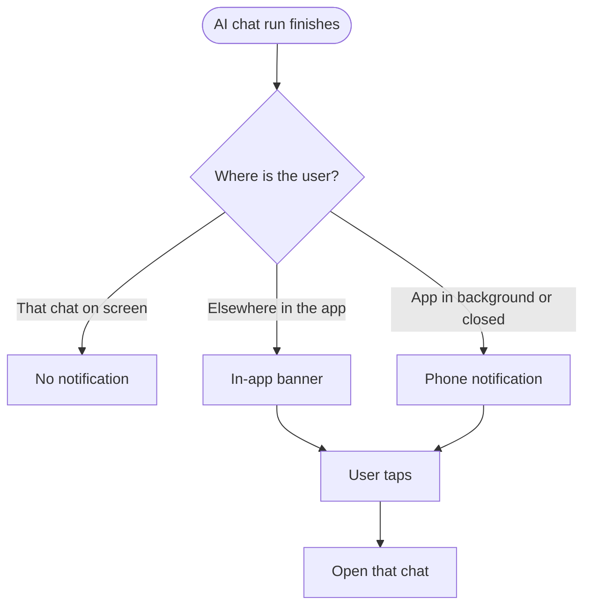
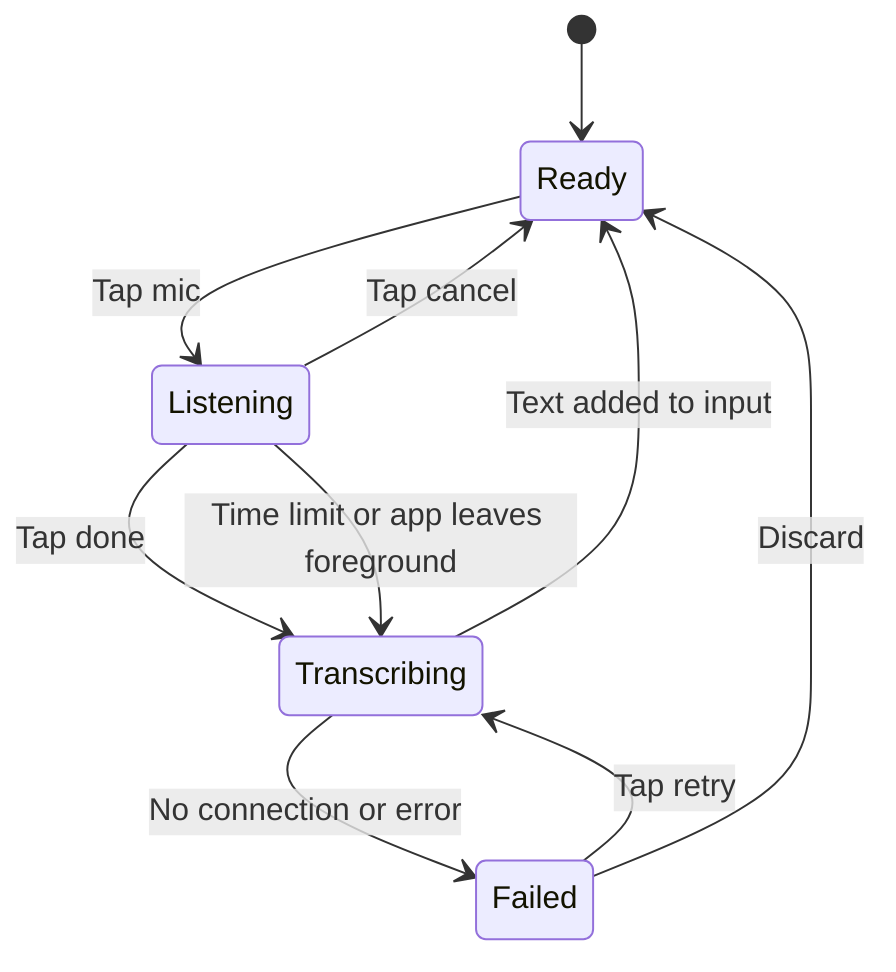

# Epic: Flutter AI chat, a full LLM-app experience on mobile

## Epic description

On a phone, people now expect AI chat to feel like Claude or ChatGPT: open it from anywhere, type without any lag, watch the answer flow in smoothly, attach a photo, and get a notification when a long task is done. ContentStudio's mobile AI chat is not there yet.

Today it only opens from inside the Composer, as a sheet on top of a post. It can't take attachments, `@` mentions or `/` skills, which web supports. Videos that are still generating don't show at all. There's no regenerate, no editing a sent message, no voice input and no home-screen widget. If the user leaves the app while the AI works, nothing tells them when it's done.

This epic turns mobile AI chat into a first-class part of the app:

- **Reachable from anywhere**, not only from the Composer
- **Rebuilt to feel like a native LLM app**: full screen, fast, with the conversation at the centre
- **Smooth typing and streaming**, with step durations kept when a chat is reopened
- **Parity with web** for attachments, `@` mentions, `/` skills and generating videos
- **The small things LLM apps get right**: speech-to-text dictation, regenerate, edit and resend, haptics and smooth motion, a home-screen widget
- **A notification when the AI finishes**, in the app and when the app is in the background, except when the user is already looking at that chat

**Status:** partly skeleton. The PO and team will discuss the experience in more detail. The design story and the rebuild story are the ones that will grow most.

Carousels on mobile are handled in the existing **AI Carousel post generation** epic, in **[Flutter] Generate, review and schedule AI chat carousels in the mobile app**.

### Scope

In:

- A global entry point to AI chat, with the Composer entry kept
- A redesigned, full-screen chat experience
- Step durations kept after reload (the live step timer comes with the web and backend work)
- Typing and streaming performance
- Attachments, `@` mentions and `/` skills in the chat input
- Generating videos shown and played in chat
- Regenerate, edit and resend
- Speech-to-text in the chat input
- Haptics and smooth motion
- A home-screen widget and app shortcuts
- "AI finished" notifications, in-app and push

Out:

- AI Studio tools on mobile (image, video and Carousel Maker panels)
- Carousels (their own story in the carousel epic)
- The web app

### Stories

1. `[Design] Design mobile AI chat to feel like a native LLM app`
2. `[Flutter] Open AI chat from anywhere in the app, not only the Composer`
3. `[Flutter] Rebuild the AI chat screen as a full-screen LLM-app experience`
4. `[BE] Save step durations with each AI chat turn so they survive a reload`
5. `[Flutter] Make typing and streaming in AI chat feel smooth`
6. `[Flutter] Add attachments, @ mentions and / skills to the AI chat input`
7. `[Flutter] Show videos in AI chat while they generate and play them when ready`
8. `[Flutter] Add regenerate and edit and resend to AI chat`
9. `[BE] Send a push notification when an AI chat run finishes`
10. `[Flutter] Notify the user when AI chat finishes, in the app and in the background`
11. `[Flutter] Turn speech into text in the AI chat input`
12. `[Flutter] Add haptics and smooth motion to AI chat`
13. `[Flutter] Add an AI chat home-screen widget and app shortcuts on iOS and Android`

---

# [Design] Design mobile AI chat to feel like a native LLM app

### Description

As a designer, I want to design ContentStudio's mobile AI chat so that it feels as natural as Claude or ChatGPT on a phone, so that the team builds one coherent experience instead of patching the current Composer sheet piece by piece.

This is the anchor story for the epic. The PO will add direction after the team discussion.

---

### Workflow

1. Designer reviews the current mobile AI chat (opened from the Composer), the web AI chat, and the Claude, ChatGPT and Grok mobile apps.
2. Designer defines the global entry point (for example a bottom-nav tab, a floating button or a header icon) and how the Composer entry still hands results back to the post.
3. Designer designs the full-screen chat: header, conversation, chat history and new chat, the input bar, and the keyboard behaviour.
4. Designer designs the input bar with attachments, `@` mentions, `/` skills, voice input and stop.
5. Designer designs message actions: copy, regenerate, edit and resend, and the Composer actions when opened from a post.
6. Designer designs step progress with the live timer, generating videos, and results (images, tables, charts, approvals with price).
7. Designer designs the in-app "AI finished" banner and the push notification text.
8. Designer designs the home-screen widget (small and medium) and the app-icon shortcuts.
9. Designer writes the motion spec used across AI chat.
10. Designer covers empty, loading, offline and error states, and both small and large phones.

---

### Acceptance criteria

- [ ] Designs cover the global entry point on every main screen, and the Composer entry
- [ ] The full-screen chat is designed: header, conversation, history, new chat, input bar and keyboard behaviour
- [ ] The input bar is designed with attachments, `@` mentions, `/` skills, voice and stop
- [ ] Message actions are designed: copy, regenerate, edit and resend, and the Composer-only actions
- [ ] Running steps with the live timer, generating videos, and each result type are designed
- [ ] The in-app "AI finished" banner and the push notification copy are designed
- [ ] The home-screen widget (small and medium) and the app-icon shortcuts are designed, for iOS and Android, including the white-label version
- [ ] A motion spec is provided: timings and curves for messages, the input bar, sheets and the history drawer, plus the reduced-motion fallback
- [ ] Empty, loading, offline and error states are designed for small and large phones, on iOS and Android
- [ ] Designs reference the app's own widget set, not the web component library
- [ ] Designs are handed off to every `[Flutter]` story in this epic

---

### Mock-ups:

To be attached by the designer.

---

### Impact on existing data:

None.

---

### Impact on other products:

Mobile app only. Where a pattern would also improve web AI chat, the designer should note it.

---

### Dependencies:

None. Blocks every `[Flutter]` story in this epic.

---

### Global quality & compliance (wherever applicable)

- [ ] Mobile responsiveness (frontend only, N/A for backend-only stories)
- [ ] Multilingual support (frontend + backend, translations available or fallback handled)
- [ ] UI theming support (default + white-label, design library components are being used)
- [ ] White-label domains impact review
- [ ] Cross-product impact assessment (web, mobile apps, Chrome extension)
- [ ] Developer surfaces coverage: N/A, design only, nothing API-facing changes

---

# [Flutter] Open AI chat from anywhere in the app, not only the Composer

### Description

As a ContentStudio mobile user, I want to open AI chat from any main screen of the app, so that I can ask for ideas, check my analytics or plan posts without first having to start writing a post.

Today the only way into AI chat on mobile is the AI button inside the Composer. This story adds a global entry point to the main screens (Planner, Inbox, Notifications, Menu) and keeps the Composer entry working as it does today.

---

### Workflow

1. User opens the app on the Planner.
2. User taps the AI chat entry (where the design places it) and AI chat opens, resuming their most recent chat in the current workspace.
3. User asks "Give me 5 post ideas for next week" and gets an answer.
4. User taps **Create post** on one idea. The Composer opens with the idea filled in.
5. Another time, the user is writing a post in the Composer and taps the AI button there. AI chat opens as today, and **Add to post** and **Replace in post** send the result back into that post.
6. User switches workspace. The AI chat entry opens that workspace's chat.

---

### Acceptance criteria

- [ ] AI chat can be opened in one tap from every main screen (Planner, Inbox, Notifications, Menu) through the entry the design defines
- [ ] Opened from anywhere, AI chat resumes the user's most recent chat in the current workspace, or starts a new one if there is none
- [ ] AI chat opened from outside the Composer doesn't show Add to post or Replace in post. It offers **Create post**, which opens the Composer prefilled with the text and media
- [ ] The Composer AI button keeps working exactly as today, including its writing options and sending results back into the open post
- [ ] Switching workspace switches AI chat to that workspace
- [ ] Users whose plan or role doesn't include AI chat see the same upgrade or no-access message they see in the Composer today, not a broken screen
- [ ] AI chat has its own route, so it can be opened from a notification or a link (used by **[Flutter] Notify the user when AI chat finishes, in the app and in the background**)
- [ ] Opening AI chat fires a Usermaven event `ai_chat_opened` with `{ source }` (`source` is `composer`, `planner`, `inbox`, `notifications`, `menu` or `notification_tap`)
- [ ] Works on iOS and Android, including on small phones and with large text settings

---

### Mock-ups:

From **[Design] Design mobile AI chat to feel like a native LLM app**.

---

### Impact on existing data:

None.

---

### Impact on other products:

- **Web:** none.
- **Chrome extension:** none.

---

### Dependencies:

**[Design] Design mobile AI chat to feel like a native LLM app**

---

### Global quality & compliance (wherever applicable)

- [ ] Mobile responsiveness (frontend only, N/A for backend-only stories)
- [ ] Multilingual support (frontend + backend, translations available or fallback handled)
- [ ] UI theming support (default + white-label, design library components are being used)
- [ ] White-label domains impact review
- [ ] Cross-product impact assessment (web, mobile apps, Chrome extension)
- [ ] Developer surfaces coverage: N/A, nothing API-facing changes

---

# [Flutter] Rebuild the AI chat screen as a full-screen LLM-app experience

### Description

As a ContentStudio mobile user, I want AI chat to look and feel like the AI apps I already use on my phone, so that it feels premium, familiar and fast, and I reach for it as my everyday assistant.

Today AI chat is a sheet that slides up over the Composer. This story rebuilds it as a full-screen experience following the design: the conversation at the centre, chat history one gesture away, an input bar that behaves perfectly with the keyboard, and results that feel native.

**Skeleton.** The PO and team will discuss the target experience. Scope and acceptance criteria will be filled in from the design.

---

### Workflow

1. User opens AI chat. It fills the screen, with the conversation and the input bar.
2. User swipes or taps to open chat history, searches it, and opens an older chat.
3. User starts a new chat from the header.
4. User types. The input grows with the message, and the conversation stays visible above the keyboard.
5. The answer streams in. Steps, images, tables, charts and approval cards appear inline, sized for a phone.
6. User scrolls up to reread while the answer streams, and the chat stays where they put it until they tap **Jump to latest**.

---

### Acceptance criteria

- [ ] AI chat opens full screen and follows the design for the header, conversation, history and input bar
- [ ] Chat history, search, rename, delete and new chat keep working as today, in the new layout
- [ ] The input bar never hides behind the keyboard, and the last message stays visible when the keyboard opens, on iOS and Android
- [ ] Every result type the chat supports today (text, steps, images, videos, tables, charts, stat tiles, approvals with price, questions, suggestions) renders in the new layout
- [ ] Scroll follows the answer only while the user is at the bottom, and **Jump to latest** appears otherwise
- [ ] Further criteria to be added from the design and the PO's discussion

---

### Mock-ups:

From **[Design] Design mobile AI chat to feel like a native LLM app**.

---

### Impact on existing data:

None.

---

### Impact on other products:

None outside the mobile app.

---

### Dependencies:

- **[Design] Design mobile AI chat to feel like a native LLM app**
- **[Flutter] Open AI chat from anywhere in the app, not only the Composer**

---

### Global quality & compliance (wherever applicable)

- [ ] Mobile responsiveness (frontend only, N/A for backend-only stories)
- [ ] Multilingual support (frontend + backend, translations available or fallback handled)
- [ ] UI theming support (default + white-label, design library components are being used)
- [ ] White-label domains impact review
- [ ] Cross-product impact assessment (web, mobile apps, Chrome extension)
- [ ] Developer surfaces coverage: N/A, nothing API-facing changes

---

# [BE] Save step durations with each AI chat turn so they survive a reload

### Description

As a ContentStudio user reopening an earlier AI chat, I want each step to still show how long it took, so that the chat looks the same as when it ran and I can see where the time went.

Step durations are sent live while the AI works, but they aren't saved with the turn. When a chat is reopened, on mobile or web, the durations are gone. This story saves them with the turn and returns them when the chat is loaded.

---

### Workflow

1. User runs a turn in AI chat. Each step shows its time as it finishes.
2. User closes the app and opens the same chat the next day.
3. Every step still shows the time it took, and the header still reads "Worked for 18.4s".

---

### Acceptance criteria

- [ ] Each finished step's duration and the turn's total duration are saved with the turn
- [ ] Loading a chat returns those durations with each turn, in the same shape the live stream uses
- [ ] Turns saved before this change still load without errors and simply show no durations
- [ ] Failed and stopped turns save the durations of the steps that ran
- [ ] Web and mobile both show saved durations when reopening a chat

---

### Mock-ups:

None. Backend.

---

### Impact on existing data:

Adds duration fields to saved chat turns. Older turns are left as they are.

---

### Impact on other products:

- **Web AI chat** also shows durations on reopened chats, including for **[FE] Show a live elapsed timer on the running step in AI chat**.
- **MCP server and public API:** chat history isn't exposed there today. N/A unless that changes.

---

### Dependencies:

None.

---

### Global quality & compliance (wherever applicable)

- [ ] Mobile responsiveness: N/A, backend only
- [ ] Multilingual support (frontend + backend, translations available or fallback handled)
- [ ] UI theming support: N/A, backend only
- [ ] White-label domains impact review
- [ ] Cross-product impact assessment (web, mobile apps, Chrome extension)
- [ ] Developer surfaces coverage (any new or changed API is reflected in the public API, CLI, MCP server and automation apps, N/A when nothing API-facing changes)

---

# [Flutter] Make typing and streaming in AI chat feel smooth

### Description

As a ContentStudio mobile user, I want typing a message and reading the AI's answer to feel instant and fluid, like in Claude or ChatGPT, so that the app feels premium rather than laggy.

A likely cause is already visible: every keystroke updates the chat's shared state, and the whole chat screen, including every past message, is rebuilt on each one. Long chats will feel it most. This story profiles typing and streaming on real devices, fixes the causes, and agrees the target feel with the PO. It mirrors **[FE] Make typing and streaming in AI chat feel smooth** on web.

---

### Workflow

1. User opens a long chat and types a message quickly.
2. Every character appears the instant the key is pressed, with no stutter.
3. User sends it. The answer streams in at a steady pace, without dropped frames, even when it's long and has lists and tables.
4. User scrolls up while it streams. The chat stays put until they tap **Jump to latest**.
5. When the answer finishes, nothing jumps.

---

### Acceptance criteria

- [ ] Profiling on a mid-range Android phone and an older supported iPhone identifies the top causes of typing lag and dropped frames, written up for the PO before fixes start
- [ ] Typing in a chat with 50 or more messages shows no visible delay, and past messages are not redrawn on each keystroke
- [ ] A long answer streams at a steady frame rate, and the work per update doesn't grow with the length of the answer
- [ ] Half-written formatting (lists, tables) never flashes raw symbols
- [ ] Opening and closing the keyboard is smooth and never hides the input or the last message
- [ ] Scroll follows the answer only while the user is at the bottom
- [ ] Before and after measurements (typing delay, frame rate while streaming) are attached to the pull request, on iOS and Android

---

### Mock-ups:

None, unless the research recommends a visible change.

---

### Impact on existing data:

None.

---

### Impact on other products:

Matches the web story **[FE] Make typing and streaming in AI chat feel smooth**.

---

### Dependencies:

None. Can start before the redesign. Fixes should carry over into **[Flutter] Rebuild the AI chat screen as a full-screen LLM-app experience**.

---

### Global quality & compliance (wherever applicable)

- [ ] Mobile responsiveness (frontend only, N/A for backend-only stories)
- [ ] Multilingual support (frontend + backend, translations available or fallback handled)
- [ ] UI theming support (default + white-label, design library components are being used)
- [ ] White-label domains impact review
- [ ] Cross-product impact assessment (web, mobile apps, Chrome extension)
- [ ] Developer surfaces coverage: N/A, nothing API-facing changes

---

# [Flutter] Add attachments, @ mentions and / skills to the AI chat input

### Description

As a ContentStudio mobile user, I want to attach photos from my phone, point the AI at a specific attachment with `@`, and use my saved Skills with `/`, so that I can do on my phone what I can already do in AI chat on the web.

Web AI chat supports all three. The mobile chat input is text only today.

---

### Workflow

1. User taps the attach button in the chat input and picks two photos from their camera roll (or takes a new one).
2. The photos appear as thumbnails above the input, each with a remove (X).
3. User types "@" and a list of the attached images appears. They pick "Photo 2" and type "use this as the cover".
4. User types "/" and their Skills list appears. They pick "Brand tone" and the skill shows as a chip in the message.
5. User sends. The AI uses the right image and the chosen skill, exactly as on web.

---

### Acceptance criteria

**Attachments**

- [ ] An attach button in the input opens options to choose photos, choose videos, or take a photo, using the app's existing media picker and permission prompts
- [ ] Attached files show as thumbnails above the input with upload progress and a remove (X)
- [ ] The same file types, file sizes and number of attachments as web are allowed, with the same error messages
- [ ] If an upload fails, the thumbnail shows "Upload failed. Tap to retry."

**@ mentions**

- [ ] Typing `@` opens a list of the chat's attachments. Choosing one inserts it as a mention chip
- [ ] The sent message shows mentions the same way web does, and the AI receives them the same way

**/ skills**

- [ ] Typing `/` at the start of a word opens the user's Skills list with search. Choosing one inserts it as a skill chip
- [ ] Only one skill can be used per message, matching web. Choosing another replaces it
- [ ] The sent message shows the skill chip as on web

**General**

- [ ] Messages sent from mobile with attachments, mentions and skills produce the same result as the same message on web
- [ ] Chats started on web with attachments, mentions or skills display correctly on mobile
- [ ] Works on iOS and Android, including permission-denied states ("Allow photo access in Settings to attach images.")
- [ ] All copy is translated in every supported language

---

### Mock-ups:

From **[Design] Design mobile AI chat to feel like a native LLM app**.

---

### Impact on existing data:

None. Uses the same upload and chat request shape as web.

---

### Impact on other products:

Parity with web. No web changes.

---

### Dependencies:

**[Design] Design mobile AI chat to feel like a native LLM app**

---

### Global quality & compliance (wherever applicable)

- [ ] Mobile responsiveness (frontend only, N/A for backend-only stories)
- [ ] Multilingual support (frontend + backend, translations available or fallback handled)
- [ ] UI theming support (default + white-label, design library components are being used)
- [ ] White-label domains impact review
- [ ] Cross-product impact assessment (web, mobile apps, Chrome extension)
- [ ] Developer surfaces coverage: N/A, nothing API-facing changes

---

# [Flutter] Show videos in AI chat while they generate and play them when ready

### Description

As a ContentStudio mobile user asking AI chat for a video, I want to see that the video is being made and watch it in the chat when it's ready, so that I don't get a "coming soon" message for something the AI is actually producing.

Today, when the AI starts generating a video, the mobile chat shows nothing for it and displays a "coming soon" alert. Only finished videos can be played.

---

### Workflow

1. User asks AI chat for a 10-second product video and confirms the price.
2. A video card appears in the answer with a placeholder and the text "Creating your video. This can take a few minutes."
3. User leaves the chat or the app. The video keeps generating.
4. When it's ready, the card shows the video's poster and a play button.
5. User taps play and watches it full screen, and can use it in a post.

---

### Acceptance criteria

- [ ] A video still being generated shows a card with a loading placeholder and "Creating your video. This can take a few minutes." instead of nothing
- [ ] The app checks for the finished video, and the card updates to the poster with a play button when it's ready, without the user refreshing
- [ ] If generation fails, the card shows "We couldn't create this video." with the same retry or refund behaviour as web
- [ ] Reopening a chat shows each video in its current state: generating, ready or failed
- [ ] The "coming soon" alert is removed
- [ ] Ready videos can be played full screen and used in a post, as today
- [ ] Works on iOS and Android

---

### Mock-ups:

From **[Design] Design mobile AI chat to feel like a native LLM app**.

---

### Impact on existing data:

None.

---

### Impact on other products:

Parity with web.

---

### Dependencies:

**[Design] Design mobile AI chat to feel like a native LLM app**

---

### Global quality & compliance (wherever applicable)

- [ ] Mobile responsiveness (frontend only, N/A for backend-only stories)
- [ ] Multilingual support (frontend + backend, translations available or fallback handled)
- [ ] UI theming support (default + white-label, design library components are being used)
- [ ] White-label domains impact review
- [ ] Cross-product impact assessment (web, mobile apps, Chrome extension)
- [ ] Developer surfaces coverage: N/A, nothing API-facing changes

---

# [Flutter] Add regenerate and edit and resend to AI chat

### Description

As a ContentStudio mobile user, I want to regenerate an answer I don't like and fix a message I've already sent, so that AI chat on my phone works the way other AI apps do.

**Skeleton.** Scope to be confirmed with the PO after the team discussion, including whether regenerate and edit also need server work. Voice input moved to its own story: **[Flutter] Turn speech into text in the AI chat input**.

---

### Workflow

1. User long-presses the AI's last answer and taps **Regenerate**. A new answer replaces it.
2. User long-presses their own last message, taps **Edit**, changes "Instagram" to "LinkedIn" and sends. The AI answers the edited message.

---

### Acceptance criteria

- [ ] **Regenerate** is available on the AI's latest answer and produces a new answer to the same message
- [ ] **Edit** is available on the user's latest message. Sending the edit replaces the later part of the conversation, matching how web handles it
- [ ] Further criteria to be added after the PO's discussion

---

### Mock-ups:

From **[Design] Design mobile AI chat to feel like a native LLM app**.

---

### Impact on existing data:

To be confirmed. Regenerate and edit may change how turns are stored.

---

### Impact on other products:

If regenerate or edit need server support, web AI chat should get the same actions.

---

### Dependencies:

**[Design] Design mobile AI chat to feel like a native LLM app**

---

### Global quality & compliance (wherever applicable)

- [ ] Mobile responsiveness (frontend only, N/A for backend-only stories)
- [ ] Multilingual support (frontend + backend, translations available or fallback handled)
- [ ] UI theming support (default + white-label, design library components are being used)
- [ ] White-label domains impact review
- [ ] Cross-product impact assessment (web, mobile apps, Chrome extension)
- [ ] Developer surfaces coverage: N/A, nothing API-facing changes

---

# [BE] Send a push notification when an AI chat run finishes

### Description

As a ContentStudio mobile user, I want my phone to tell me when the AI has finished what I asked, so that I can put the phone down or switch apps during a long task, like generating a week of posts or a video, and come back when it's ready.

The AI already keeps working on the server when the user leaves the app. Nothing tells them when it's done. This story sends a push notification to the user's phone when an AI chat run they started from the app finishes, carrying what the app needs to open that exact chat.

It should follow the notification design agreed in the **Notifications architecture** epic, not add a separate path.

---

### Workflow

1. User asks AI chat on their phone to plan a week of posts, then locks the phone.
2. The AI finishes two minutes later.
3. The user's phone shows: **"Your AI chat is ready"** / *"Plan a week of posts: 7 posts are ready to review."*
4. User taps it and lands on that chat.
5. If the run failed, the notification reads **"AI chat couldn't finish"** / *"Tap to see what happened and try again."*

---

### Acceptance criteria

- [ ] When an AI chat run started from the mobile app finishes, a push notification is sent to the devices where that user is signed in to the app
- [ ] The notification carries the chat and workspace it belongs to, so the app can open that exact chat
- [ ] The title and text come from the finished run: the chat's title and a short summary of the result, in the user's app language
- [ ] A failed run sends the "couldn't finish" version. A run the user stopped sends nothing
- [ ] Only one notification is sent per run, even if the run is retried or reconnected
- [ ] The notification tells the app it's an AI chat notification, so the app can hide it when that chat is already on screen (see **[Flutter] Notify the user when AI chat finishes, in the app and in the background**)
- [ ] A user can turn these notifications off in their notification settings, following the Notifications architecture
- [ ] Notification text never includes more of the user's content than the chat title and a short summary

---

### Mock-ups:

None. Backend. Notification copy from **[Design] Design mobile AI chat to feel like a native LLM app**.

---

### Impact on existing data:

Possibly a new notification type and a user setting for it, as defined by the Notifications architecture.

---

### Impact on other products:

- **Web:** runs started on web don't send a push in this story. Open question for the PO.
- **Notifications architecture:** this is one of the first new mobile notification types.

---

### Dependencies:

The **Notifications architecture** epic's research, for the delivery path and settings.

---

### Global quality & compliance (wherever applicable)

- [ ] Mobile responsiveness: N/A, backend only
- [ ] Multilingual support (frontend + backend, translations available or fallback handled)
- [ ] UI theming support: N/A, backend only
- [ ] White-label domains impact review
- [ ] Cross-product impact assessment (web, mobile apps, Chrome extension)
- [ ] Developer surfaces coverage (any new or changed API is reflected in the public API, CLI, MCP server and automation apps, N/A when nothing API-facing changes)

---

# [Flutter] Notify the user when AI chat finishes, in the app and in the background

### Description

As a ContentStudio mobile user, I want to be told when the AI finishes, whether I've switched to another screen in the app or left the app entirely, but not when I'm already watching that chat, so that I can multitask without missing results and without being pinged about something I can already see.

---

### Workflow

1. User asks AI chat to create a video, then goes to the Planner.
2. When the video is ready, a banner slides in at the top of the Planner: **"Your AI chat is ready"** / *"Product video: your video is ready to watch."*
3. User taps the banner and lands on that chat, scrolled to the result.
4. Another time, the user starts a task and switches to another app. When it's done, their phone shows the notification. Tapping it opens ContentStudio on that chat, switching workspace if needed.
5. Another time, the user stays in the chat and watches the answer arrive. No banner or notification appears.

---

### Acceptance criteria

- [ ] When a run finishes and the user has **that exact chat** on screen, no banner or notification is shown
- [ ] When the user is elsewhere in the app, including a different chat, an in-app banner shows the notification's title and text, stays for a few seconds, and can be swiped away
- [ ] When the app is in the background or closed, the phone shows the notification as usual on iOS and Android
- [ ] Tapping the banner or the notification opens that chat, scrolled to the latest answer, switching workspace first if needed
- [ ] Tapping works from a cold start and while signed out: the chat opens after sign-in
- [ ] Tapping the same notification twice doesn't open the chat twice
- [ ] Failed-run notifications open the chat showing the error and a retry
- [ ] The app asks for notification permission at a sensible moment (for example the first time the user starts a long task), if it hasn't already
- [ ] Tapping a notification fires a Usermaven event `ai_chat_notification_opened` with `{ outcome }` (`outcome` is `completed` or `failed`)
- [ ] Banner copy is translated in every supported language

---

### Mock-ups:

From **[Design] Design mobile AI chat to feel like a native LLM app**.

---

### Impact on existing data:

None.

---

### Impact on other products:

Adds a second kind of notification to the app alongside the manual-publish reminder. Should follow the **Notifications architecture** epic.

---

### Dependencies:

- **[BE] Send a push notification when an AI chat run finishes**
- **[Flutter] Open AI chat from anywhere in the app, not only the Composer** (so a notification can open AI chat directly)

---

### Global quality & compliance (wherever applicable)

- [ ] Mobile responsiveness (frontend only, N/A for backend-only stories)
- [ ] Multilingual support (frontend + backend, translations available or fallback handled)
- [ ] UI theming support (default + white-label, design library components are being used)
- [ ] White-label domains impact review
- [ ] Cross-product impact assessment (web, mobile apps, Chrome extension)
- [ ] Developer surfaces coverage: N/A, nothing API-facing changes

---

# [Flutter] Turn speech into text in the AI chat input

### Description

As a ContentStudio mobile user, I want to tap a mic in the AI chat input, say what I want, and see my words appear as text I can check and send, so that I can brief the AI on the go, faster than typing on a phone keyboard.

This is dictation, not a spoken conversation: the user talks, ContentStudio turns it into text in the input, and nothing is sent until the user taps send. It should feel exactly like dictation in the Claude and ChatGPT apps: one tap to start, a live waveform so the user knows they're being heard, one tap to finish, and accurate text with punctuation.

The web app already has voice input, and ContentStudio already has a high-accuracy transcription service behind it. The app uses the same service, so the quality is the same on both.

No separate design story: this follows the pattern Claude and ChatGPT use on mobile.

---

### Workflow

1. User opens AI chat and taps the **mic** in the input bar.
2. The first time, the phone asks for microphone permission with the message "ContentStudio uses your microphone to turn what you say into text in AI chat."
3. The input bar turns into a listening bar: a live waveform that moves with the user's voice, a timer ("0:07"), a **cancel** (X) and a **done** (✓) button. A light haptic confirms listening has started.
4. User says "Write three LinkedIn posts about our spring sale, friendly tone, and keep each under 100 words." A live preview of the words appears as they speak.
5. User taps **done**. A short "Transcribing..." state shows, then the finished text, with punctuation and capitals, lands in the input with the cursor at the end.
6. User fixes one word and taps send.
7. Another time, the user already has text in the input and dictates more. The new text is added after what's there, not replacing it.
8. Another time, the user taps **cancel**. Nothing is added and the input goes back to how it was.

---

### Acceptance criteria

**Starting**

- [ ] A mic button sits in the AI chat input bar at all times, including when opened from the Composer
- [ ] Tapping it starts listening within half a second, with a light haptic
- [ ] The first use asks for microphone permission with the copy: "ContentStudio uses your microphone to turn what you say into text in AI chat."
- [ ] If permission is denied, tapping the mic shows "Allow microphone access in Settings to talk to AI chat." with an **Open Settings** button

**Listening**

- [ ] The input bar shows a live waveform that moves with the user's voice, an elapsed timer, a cancel (X) and a done (✓) button
- [ ] A live preview of the words appears while the user speaks, where the phone supports on-device recognition. If it doesn't, the waveform and timer still show and the text arrives after done
- [ ] The user can dictate for up to 10 minutes. At 9 minutes a note says "1 minute left". At 10 minutes listening stops by itself and the text is transcribed
- [ ] If the app goes to the background, a call comes in, or the screen locks, listening stops and what was said so far is transcribed, not lost

**Finishing**

- [ ] Tapping done shows "Transcribing..." and then puts the final text in the input, with the cursor at the end, without sending
- [ ] The final text comes from the same transcription service the web app uses, so accuracy, punctuation and capitalisation match web
- [ ] New text is added after any text already in the input, separated by a space
- [ ] Short dictation (around 10 seconds) is in the input within 2 seconds of tapping done on a normal connection
- [ ] The user's spoken language is detected automatically, and every language ContentStudio supports works
- [ ] Tapping cancel discards the recording and leaves the input as it was, with a light haptic

**Errors**

- [ ] If transcription fails or there's no connection, the bar shows "We couldn't turn that into text." with **Retry** and **Discard**. Retry uses the same recording, so the user doesn't have to speak again
- [ ] If nothing was heard, it shows "We didn't catch that. Try again." and adds nothing
- [ ] Other apps' audio (music, podcasts) pauses while listening and resumes afterwards

**General**

- [ ] Works on iOS and Android, on small and large phones, and with screen readers ("Start voice input", "Stop and add text", "Cancel voice input")
- [ ] Recordings are only used to produce the text and are not kept in the chat or the media library
- [ ] Finishing a dictation fires a Usermaven event `ai_chat_voice_input_used` with `{ duration_seconds, outcome }` (`outcome` is `inserted`, `cancelled` or `failed`)
- [ ] All copy is translated in every supported language

---

### Mock-ups:

None. Follow the dictation pattern in the Claude and ChatGPT mobile apps.

---

### Impact on existing data:

None. Uses the existing transcription service. Audio isn't stored.

---

### Impact on other products:

- **Web:** already has voice input on the same service. No change.
- **Composer:** the Composer caption field is out of scope, but could reuse this later.

---

### Dependencies:

None. Can ship on today's AI chat and carries over into **[Flutter] Rebuild the AI chat screen as a full-screen LLM-app experience**.

---

### Global quality & compliance (wherever applicable)

- [ ] Mobile responsiveness (frontend only, N/A for backend-only stories)
- [ ] Multilingual support (frontend + backend, translations available or fallback handled)
- [ ] UI theming support (default + white-label, design library components are being used)
- [ ] White-label domains impact review
- [ ] Cross-product impact assessment (web, mobile apps, Chrome extension)
- [ ] Developer surfaces coverage: N/A, reuses an existing internal endpoint, nothing new API-facing

---

# [Flutter] Add haptics and smooth motion to AI chat

### Description

As a ContentStudio mobile user, I want AI chat to respond to my touch with subtle haptics and move smoothly as messages arrive, so that it feels polished and alive like the best AI apps, not like a static form.

The leading AI apps all use light haptics at key moments and fluid motion throughout. Our chat has neither. This story adds both, consistently, and respects the user's system settings for reduced motion and haptics.

---

### Workflow

1. User taps send. They feel a light tap, and their message slides smoothly into the conversation.
2. The answer streams in smoothly, and the chat scrolls with it without jumping.
3. When the answer finishes, they feel a soft tap.
4. User long-presses a message. The menu springs open with a light tap.
5. User opens chat history. The drawer slides in and follows their finger.
6. A user who has "Reduce motion" on in their phone settings gets simple fades instead of movement.

---

### Acceptance criteria

**Haptics**

- [ ] Light haptic on: send, answer finished, long-press menu opening, voice input start and stop, approving a paid task (Generate), pull to refresh
- [ ] No haptic while text streams or on every step update
- [ ] Haptics follow the phone's system haptics setting and are off when the user has turned them off

**Motion**

- [ ] New messages appear with a short slide and fade, never popping in
- [ ] Streaming text, step rows and result cards appear without layout jumps
- [ ] The input bar grows and shrinks smoothly as the user types multiple lines
- [ ] Sheets, the history drawer and full-screen image and video viewers open and close with interactive, finger-following transitions
- [ ] Loading states use the same shimmer everywhere in chat
- [ ] The "Jump to latest" button fades in and out rather than appearing suddenly
- [ ] All motion runs at a steady frame rate on a mid-range Android phone and an older supported iPhone
- [ ] With "Reduce motion" on, movement is replaced by simple fades

**Consistency**

- [ ] Timings and curves come from one shared set in the app, matching the design story's motion spec, not per-screen values

---

### Mock-ups:

Motion spec from **[Design] Design mobile AI chat to feel like a native LLM app**.

---

### Impact on existing data:

None.

---

### Impact on other products:

None outside the mobile app. The shared motion set can be reused by other screens later.

---

### Dependencies:

- **[Design] Design mobile AI chat to feel like a native LLM app** (motion spec)
- Best done alongside **[Flutter] Rebuild the AI chat screen as a full-screen LLM-app experience**

---

### Global quality & compliance (wherever applicable)

- [ ] Mobile responsiveness (frontend only, N/A for backend-only stories)
- [ ] Multilingual support (frontend + backend, translations available or fallback handled)
- [ ] UI theming support (default + white-label, design library components are being used)
- [ ] White-label domains impact review
- [ ] Cross-product impact assessment (web, mobile apps, Chrome extension)
- [ ] Developer surfaces coverage: N/A, nothing API-facing changes

---

# [Flutter] Add an AI chat home-screen widget and app shortcuts on iOS and Android

### Description

As a ContentStudio mobile user, I want to start an AI chat straight from my phone's home screen, or by long-pressing the app icon, so that I can capture an idea or ask for a post in one tap without navigating through the app.

Every leading AI app offers a home-screen widget and shortcuts that jump straight into a new chat or into voice input. This story adds an AI chat widget on iOS and Android, plus quick actions on the app icon.

---

### Workflow

1. User long-presses their home screen, adds the **ContentStudio AI** widget and picks a size.
2. The small widget shows the ContentStudio AI icon and "Ask AI". Tapping it opens a new AI chat with the keyboard up.
3. The medium widget shows an input-style bar ("Ask AI anything..."), a **mic** button and two starter suggestions, for example "Write a post" and "Plan my week".
4. User taps the mic on the widget. The app opens a new AI chat already listening for voice input.
5. User taps "Plan my week". The app opens a new chat with that prompt filled in, ready to send.
6. User long-presses the ContentStudio app icon and sees **New AI chat** and **Talk to AI**.
7. If the user is signed out, tapping the widget opens sign-in first, then the chat.

---

### Acceptance criteria

**Widget**

- [ ] An AI chat widget is available on iOS (home screen) and Android (home screen) in a small and a medium size
- [ ] Small: ContentStudio AI icon and "Ask AI". Tapping opens a new AI chat with the keyboard up
- [ ] Medium: an "Ask AI anything..." bar, a mic button and two starter suggestions from the app's starter prompts
- [ ] Tapping the bar opens a new AI chat with the keyboard up. Tapping the mic opens a new AI chat already listening (see **[Flutter] Turn speech into text in the AI chat input**). Tapping a suggestion opens a new chat with that prompt filled in, not sent
- [ ] Chats open in the workspace the user last used. The medium widget shows that workspace's name
- [ ] The widget follows the phone's light and dark widget appearance and the platform's widget styling
- [ ] On white-label apps, the widget shows the white-label name and icon, never ContentStudio's

**App icon shortcuts**

- [ ] Long-pressing the app icon shows **New AI chat** and **Talk to AI**, which behave like the widget's bar and mic

**General**

- [ ] Opening from the widget or a shortcut works from a cold start and while signed out (chat opens after sign-in)
- [ ] Users without access to AI chat on their plan or role see the widget open to the same upgrade or no-access message as in the app
- [ ] Opening from the widget or a shortcut fires `ai_chat_opened` with `{ source: 'widget' }` or `{ source: 'app_shortcut' }`
- [ ] Widget and shortcut labels are translated in every supported language

---

### Mock-ups:

Widget designs from **[Design] Design mobile AI chat to feel like a native LLM app**.

---

### Impact on existing data:

None.

---

### Impact on other products:

Mobile app only. White-label mobile builds must use their own name and icon.

---

### Dependencies:

- **[Flutter] Open AI chat from anywhere in the app, not only the Composer** (the AI chat route the widget opens)
- **[Flutter] Turn speech into text in the AI chat input** (for the mic)
- **[Flutter] Add feature pills and starter prompts to the mobile assistant** (for the suggestions)
- **[Design] Design mobile AI chat to feel like a native LLM app** (widget designs)

---

### Global quality & compliance (wherever applicable)

- [ ] Mobile responsiveness (frontend only, N/A for backend-only stories)
- [ ] Multilingual support (frontend + backend, translations available or fallback handled)
- [ ] UI theming support (default + white-label, design library components are being used)
- [ ] White-label domains impact review
- [ ] Cross-product impact assessment (web, mobile apps, Chrome extension)
- [ ] Developer surfaces coverage: N/A, nothing API-facing changes
