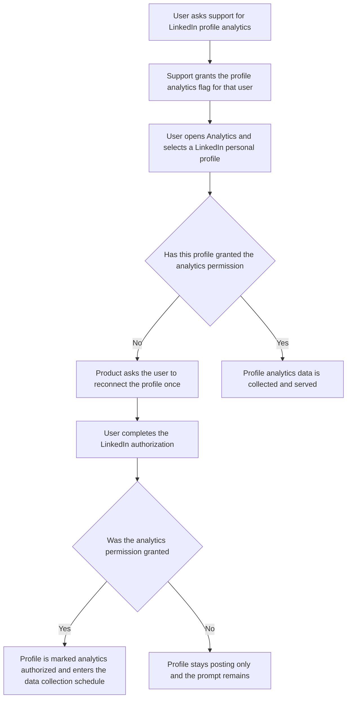
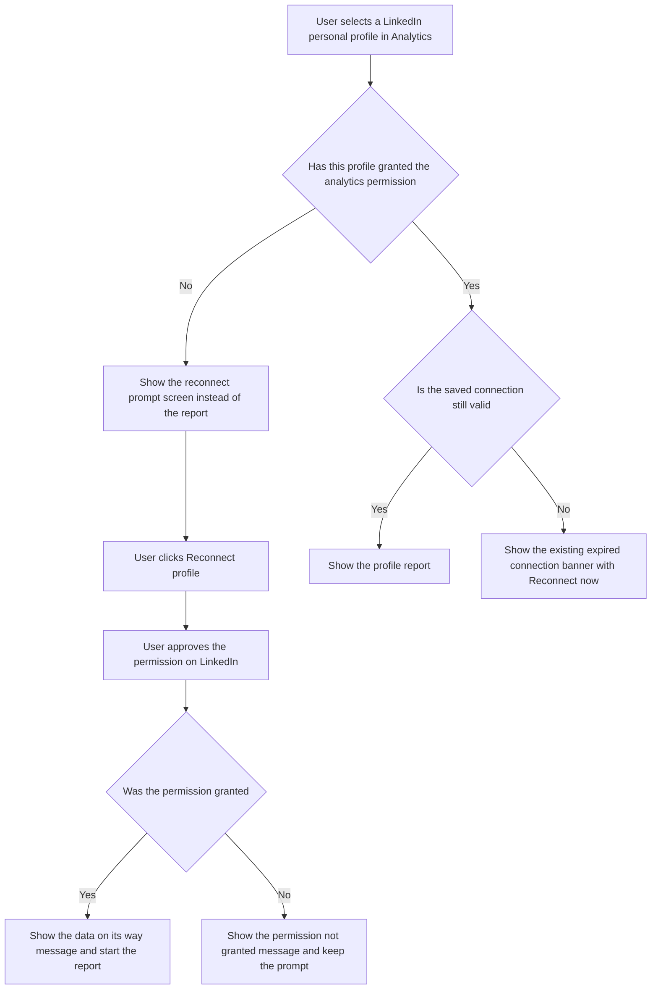

# Epic and Stories: LinkedIn Profile Analytics revival

**Date:** 2026-09-07

These stories are written to be added to the **existing LinkedIn Profile Analytics epic** in the tracker. They cover the revival and controlled production rollout only. The data pipeline, widget conditionals, AI insights and report export work already exist as stories in that epic and are referenced as dependencies where relevant.

---

## Epic

### Title

**Ship LinkedIn Profile Analytics to production behind a request-access feature flag**

### Goal

LinkedIn Profile Analytics was built and QA-deployed but never reached production, and it is currently unreachable from the frontend. Bring it back, ship it to production behind a per-user feature flag, and turn it on for individual users who ask for it. Because LinkedIn requires a separate permission before it will share personal profile statistics, the experience has to explain clearly that a one-time reconnect is needed, without changing anything about posting, the social accounts list, or workspace account limits.

### Scope

- A per-user feature flag that controls whether LinkedIn personal profiles appear anywhere in Analytics.
- LinkedIn personal profiles visible in the LinkedIn analytics account selector for flagged users.
- A per-account record of whether that profile has granted the analytics permission, so the product can tell a posting-only profile apart from an analytics-ready one.
- The LinkedIn authorization request updated in production so that reconnecting actually grants the analytics permission.
- A clear in-product prompt, with full copy, telling the user that this profile needs one reconnect before analytics can be collected, shown both on first connection and for profiles connected before this change.
- Confirmation that the existing expired-token reconnect banner and the existing account-removal cascade both behave correctly for profile accounts.

### Out of scope

- Making profile analytics available to everyone. The flag stays closed until we choose to open it.
- Any change to posting, queues, approval flows, the social accounts list, or workspace account limits.
- Any change to LinkedIn Company Page analytics.
- Profile-level post analytics. LinkedIn's member endpoints give profile-level aggregates only, so post-based widgets stay hidden per the existing epic story **Hide unsupported widgets in Profile Analytics**.
- Mobile. LinkedIn analytics is a web surface only, and this rollout does not add it to the Flutter app.

### Rollout

1. Ship all three stories to production with the flag off for everyone.
2. Verify with internal accounts, which pass the flag check automatically by email domain.
3. Turn the flag on per user as requests come in from support.

### Success measure

Flagged users can select a LinkedIn personal profile in Analytics, understand from the screen alone that one reconnect is required, complete that reconnect, and see profile data appear afterwards without any support follow-up.

### Stories in this batch

1. **[BE] Add LinkedIn profile analytics authorization and a request-access feature flag**
2. **[FE] Show LinkedIn personal profiles in Analytics behind the profile analytics feature flag**
3. **[FE] Add the LinkedIn profile analytics reconnect prompt and first-connection copy**

Optional fourth story, only if design assets are wanted before build: **[Design] Design the LinkedIn profile analytics reconnect prompt and account selector states**.

---

## Story 1

### Title

**[BE] Add LinkedIn profile analytics authorization and a request-access feature flag**

### Description

As a support and product team, we want a per-user feature flag for LinkedIn Profile Analytics and a reliable record of which LinkedIn personal profiles have granted the analytics permission, so that we can turn the feature on for individual users who ask for it and so the product can tell a posting-only profile apart from an analytics-ready one.

---

### Workflow

1. A user contacts support asking for LinkedIn Profile Analytics.
2. Support grants the profile analytics flag for that user's account. The user sees the feature on their next page load, with no redeploy and no plan change.
3. The user opens Analytics, picks LinkedIn, and selects one of their LinkedIn personal profiles.
4. If that profile has never granted LinkedIn's analytics permission, the product asks the user to reconnect it once. The user's scheduled posts, connected accounts and account limits are untouched while they decide.
5. The user completes the LinkedIn authorization for that profile.
6. When the analytics permission is granted, the profile is recorded as analytics authorized and starts being included in the regular data collection schedule.
7. When the user declines or LinkedIn does not return the analytics permission, the profile keeps working for posting exactly as before and the prompt remains, so the user can try again later.
8. Support can revoke the flag for a user at any time, and that user immediately stops seeing LinkedIn personal profiles anywhere in Analytics.

---

### Acceptance criteria

**Feature flag**

- [ ] A per-user feature flag named `linkedin_profile_analytics` is supported and is returned in the authenticated user's profile payload alongside the existing flags
- [ ] Support can grant the flag to a user identified by email address, and can revoke it, without a deployment
- [ ] Granting or revoking takes effect on the user's next profile load, with no cache staleness beyond that
- [ ] Users with an internal staff email domain continue to pass every feature-flag check automatically, matching existing flag behaviour
- [ ] Granting the flag does not change the user's plan, entitlements, account limits or billing in any way
- [ ] The flag is per user. A flagged user's unflagged teammates in the same workspace see no change

**Analytics authorization state**

- [ ] Each LinkedIn personal profile account carries a record of whether it has granted LinkedIn's analytics permission, plus the date it was granted
- [ ] That state is exposed on the social account data the Analytics screens already consume, so the frontend can branch on it without an extra request
- [ ] Every LinkedIn personal profile that exists today defaults to not authorized, since none of them were connected with the analytics permission
- [ ] A profile becomes authorized only when LinkedIn actually returns the analytics permission for it. A completed authorization that omits the permission leaves the profile not authorized
- [ ] LinkedIn Company Page accounts are unaffected and are never marked with this state

**Authorization request**

- [ ] Connecting or reconnecting a LinkedIn account in production requests the permissions needed for personal profile analytics, in addition to every permission requested today
- [ ] No permission currently requested in production is dropped. Ads reporting, organization posting, page administration and inbox flows keep working after the change
- [ ] Reconnecting an existing LinkedIn personal profile resolves to the same connected account rather than creating a second one, so the workspace's connected account count is unchanged
- [ ] Reconnecting does not change the account's posting capability, queue slots, queue times, team member access or approval settings
- [ ] If the user abandons or declines the LinkedIn authorization screen, the existing connected account is left exactly as it was and posting continues to work

**Data collection**

- [ ] LinkedIn personal profiles that are not analytics authorized are excluded from the analytics data collection schedule, so no requests are made to LinkedIn on their behalf
- [ ] A profile is picked up by the regular collection schedule within one collection cycle of becoming authorized
- [ ] When LinkedIn rejects an authorized profile's credential, that profile is flagged for reconnection through the same mechanism used for pages today
- [ ] Removing a LinkedIn personal profile from the workspace removes it from analytics collection and from every analytics surface, with no orphaned scheduling

**Tracking**

- [ ] When a profile becomes analytics authorized, a `linkedin_profile_analytics_authorized` event fires with `{ platform: 'linkedin', account_type: 'profile' }`

---

### Mock-ups

No user-facing interface in this story. All visible states are specified in **[FE] Add the LinkedIn profile analytics reconnect prompt and first-connection copy**.

---

### Impact on existing data

- LinkedIn personal profile accounts gain two new fields for analytics authorization state. Existing documents are treated as not authorized, which is correct, since no production profile has ever granted the analytics permission.
- User records gain an additional value in the existing feature flags list. No schema change, and no backfill required.
- No existing analytics data is modified, moved or deleted. Any profile rows already collected during the earlier QA deployment stay as they are.
- No change to LinkedIn Company Page data.

---

### Impact on other products

- **Web app:** none until the frontend stories ship. The flag alone changes nothing visible.
- **Mobile apps:** none. LinkedIn analytics is a web surface, and profile analytics is not being added to the app.
- **Chrome extension:** none.
- **Publishing and inbox:** none, provided the permission set only grows. This must be verified explicitly, since the LinkedIn authorization request is shared with posting, ads reporting and inbox features.
- **Reports and scheduled report emails:** none in this story. Report coverage is handled by the existing epic story **Enable Reports export/schedule/email for LinkedIn Profile Analytics**.

---

### Dependencies

- Depends on the existing epic story **Backend — LinkedIn profile analytics data support** for the query layer that serves profile metrics.
- A LinkedIn app with the personal profile analytics permission approved and available in production. If a separate app is used for analytics, its credentials and callback need to exist before this story can be verified end to end.
- Blocks **[FE] Show LinkedIn personal profiles in Analytics behind the profile analytics feature flag** and **[FE] Add the LinkedIn profile analytics reconnect prompt and first-connection copy**.

---

### Global quality & compliance (wherever applicable)

- [ ] Mobile responsiveness (frontend only, N/A for backend-only stories)
- [ ] Multilingual support (frontend + backend, translations available or fallback handled)
- [ ] UI theming support (default + white-label, design library components are being used) — N/A, no user-facing interface in this story
- [ ] White-label domains impact review
- [ ] Cross-product impact assessment (web, mobile apps, Chrome extension)

---

## Story 2

### Title

**[FE] Show LinkedIn personal profiles in Analytics behind the profile analytics feature flag**

### Description

As a ContentStudio user who manages a LinkedIn personal profile, I want to find that profile in the LinkedIn analytics account list so that I can view its performance in the same place I already check my LinkedIn pages.

---

### Workflow

1. User goes to Analytics and opens the LinkedIn report.
2. User opens the account selector at the top of the report.
3. User sees their LinkedIn Company Pages, and now also their LinkedIn personal profiles, in the same list.
4. Each account in the list shows its avatar, its name, and a type label of either "Page" or "Profile", so the user can tell them apart at a glance.
5. Profiles that have not yet granted LinkedIn's analytics permission are shown with a small badge reading "Analytics not connected", so the user knows before selecting one that there is a step outstanding.
6. User selects a LinkedIn personal profile and the report loads for that profile.
7. If the user's account does not have access to this feature, the account list looks exactly as it does today, with pages only.

---

### Acceptance criteria

**Visibility gating**

- [ ] When the profile analytics feature flag is enabled for the signed-in user, LinkedIn personal profiles appear in the LinkedIn analytics account selector alongside Company Pages
- [ ] When the flag is not enabled, LinkedIn personal profiles do not appear in the LinkedIn analytics account selector, the LinkedIn overview account list, the analytics overview report, report templates, scheduled report account pickers, or shared analytics links. Behaviour matches production today
- [ ] Internal staff accounts see profiles without the flag being set explicitly, matching existing feature-flag behaviour
- [ ] Turning the flag off for a user removes profiles from every one of those surfaces on their next load, and any saved report or shared link that referenced a profile falls back gracefully rather than erroring
- [ ] LinkedIn Company Page behaviour in Analytics is byte-for-byte unchanged whether the flag is on or off
- [ ] Facebook, Instagram, TikTok, YouTube, Pinterest, Bluesky, Google Business Profile and the ads reports are unaffected

**Account selector presentation**

- [ ] Each LinkedIn account in the selector shows its avatar, its name, and a type label of "Page" or "Profile"
- [ ] A LinkedIn personal profile that has not granted the analytics permission shows a `Badge` labelled "Analytics not connected"
- [ ] Hovering that badge shows the tooltip: "LinkedIn needs one extra permission before it will share stats for a personal profile. Reconnect this profile once to start collecting your impressions, reach and follower numbers. Your scheduled posts keep going out as normal."
- [ ] A LinkedIn personal profile that has granted the permission shows no badge
- [ ] Accounts are searchable and selectable in the selector in exactly the way pages are today
- [ ] Selecting a profile keeps the selection when the user changes the date range or switches report tabs

**Selection and state**

- [ ] Selecting a LinkedIn personal profile loads the LinkedIn report for that profile
- [ ] When the workspace has LinkedIn personal profiles but no Company Pages, and the flag is on, the report opens on a profile instead of showing the "connect an account" onboarding screen
- [ ] When the workspace has no LinkedIn accounts of any kind, the existing LinkedIn onboarding empty state is shown, unchanged
- [ ] Loading state while the report fetches uses the existing LinkedIn report skeleton, unchanged
- [ ] Removing a LinkedIn personal profile from the workspace removes it from the account selector without a page refresh, and if it was the selected account the report falls back to the first remaining LinkedIn account or to the onboarding empty state when none remain

**Copy**

- [ ] All new copy is added as translation keys with English values, and non-English locales fall back to English rather than showing a raw key

---

### Mock-ups

To be attached by design. Layout intent:

- The LinkedIn analytics account selector, unchanged in structure. Each row keeps its existing avatar, name and type label.
- One additional element only: a `Badge` reading "Analytics not connected", right-aligned on rows for personal profiles that have not granted the analytics permission.
- No new screens, no layout shifts, no changes to the report header or filter bar.

---

### Impact on existing data

None. This story only changes which of the already-loaded connected accounts are shown in the analytics account list. No stored data is created, changed or deleted, and no user preference or saved report is rewritten.

---

### Impact on other products

- **Web app:** LinkedIn analytics account selector and the LinkedIn analytics report gain personal profiles for flagged users. Every other analytics report is untouched.
- **Mobile apps:** none. Profile analytics is not being added to the app.
- **Chrome extension:** none.
- **Publishing:** none. The social accounts list, composer account picker, queues and account limits are not touched by this story.
- **Shared analytics links:** a shared link created by a flagged user must not expose a profile report to a recipient who should not see it. Verify shared link behaviour explicitly.

---

### Dependencies

- Depends on **[BE] Add LinkedIn profile analytics authorization and a request-access feature flag** for the feature flag and the per-account authorization state.
- Depends on the existing epic story **Conditional LinkedIn Analytics for Profile and Page accounts** and **Hide unsupported widgets in Profile Analytics** so that a selected profile renders only the sections it has data for.
- Pairs with **[FE] Add the LinkedIn profile analytics reconnect prompt and first-connection copy**, which owns what the user sees after selecting an unauthorized profile.

---

### Global quality & compliance (wherever applicable)

- [ ] Mobile responsiveness (frontend only, N/A for backend-only stories)
- [ ] Multilingual support (frontend + backend, translations available or fallback handled)
- [ ] UI theming support (default + white-label, design library components are being used)
- [ ] White-label domains impact review
- [ ] Cross-product impact assessment (web, mobile apps, Chrome extension)

---

## Story 3

### Title

**[FE] Add the LinkedIn profile analytics reconnect prompt and first-connection copy**

### Description

As a ContentStudio user who has just found my LinkedIn personal profile in Analytics, I want the screen to tell me plainly that LinkedIn needs one extra permission and that reconnecting takes one click, so that I understand why there is no data yet and can fix it myself without contacting support.

---

### Workflow

1. User selects a LinkedIn personal profile in the LinkedIn analytics account selector.
2. If the profile has not granted LinkedIn's analytics permission, the report area is replaced by a prompt explaining that one reconnect is needed, with a "Reconnect profile" button.
3. User clicks "Reconnect profile" and is taken through the LinkedIn authorization screen for that profile.
4. On returning to ContentStudio, if the permission was granted the user sees a confirmation that data collection has started and that the first numbers can take up to a day.
5. If the permission was not granted, the prompt stays on screen with a short message explaining that the permission is still missing, and the user can try again.
6. If the profile is authorized but its saved connection has since expired, the user sees the existing expired connection banner with "Reconnect now", the same as for LinkedIn pages today.
7. If the user connects a brand new LinkedIn personal profile while they have access to this feature, they land on the same prompt, so the extra step is explained the first time rather than discovered later.

---

### Acceptance criteria

**Reconnect prompt screen**

- [ ] Selecting a LinkedIn personal profile that has not granted the analytics permission replaces the report body with the reconnect prompt. The report header, account selector, date picker and tab bar stay visible and usable
- [ ] The prompt is built on the existing analytics onboarding empty state card rather than a new component, and uses `Button` for both calls to action and `Icon` for the illustration
- [ ] The prompt headline reads: "One more step to see this profile's analytics"
- [ ] The prompt body reads: "LinkedIn asks for a separate permission before it will share stats for a personal profile, so there is nothing for us to show yet. Reconnect [profile name] once and we will start collecting your impressions, reach, reactions and follower growth. Nothing else changes. Your scheduled posts keep going out, your connected accounts stay as they are, and this does not use up another account slot."
- [ ] `[profile name]` is replaced with the selected profile's name
- [ ] The primary button reads "Reconnect profile"
- [ ] A secondary text button reads "Learn more" and opens the LinkedIn analytics help article
- [ ] A supporting line below the buttons reads: "It can take up to 24 hours for your first numbers to appear after you reconnect."
- [ ] The prompt never appears for a LinkedIn Company Page
- [ ] The prompt never appears for a profile that has already granted the permission

**Reconnect outcome**

- [ ] Clicking "Reconnect profile" opens the existing social account connect flow, pre-targeted at LinkedIn
- [ ] When the user returns having granted the permission, a success message is shown reading: "Analytics connected for [profile name]. We have started collecting data and your first numbers should appear within 24 hours."
- [ ] After a successful reconnect the report area replaces the prompt without needing a page refresh, showing either the report or the standard no-data-yet state while collection is still running
- [ ] When the user returns without granting the permission, the prompt stays on screen and an inline `Alert` is shown reading: "LinkedIn did not share the analytics permission, so we still cannot collect stats for this profile. Your posting is unaffected. You can try reconnecting again whenever you are ready."
- [ ] When the user closes the LinkedIn authorization screen without finishing, nothing changes on screen and no error is shown
- [ ] If the reconnect request itself fails, an inline `Alert` is shown reading: "We could not start the reconnect just now. Please try again in a moment."

**First connection**

- [ ] A user with access to this feature who connects a brand new LinkedIn personal profile and then opens its analytics sees the same reconnect prompt, with the same copy
- [ ] Nothing about the social accounts list, the connect flow, or the account limit counters changes when a personal profile is connected. The extra permission is explained inside Analytics only

**Expired connection**

- [ ] An authorized profile whose saved connection has expired or become invalid shows the existing expired connection banner with the existing "Reconnect now" action, matching LinkedIn page behaviour today
- [ ] The expired connection banner and the reconnect prompt are never shown at the same time. Missing permission takes precedence over an expired connection
- [ ] After a successful reconnect from the expired connection banner, the profile's report loads without a page refresh

**Account removal**

- [ ] Removing a LinkedIn personal profile while its reconnect prompt is on screen returns the user to the first remaining LinkedIn account, or to the existing LinkedIn onboarding empty state when none remain

**States and copy**

- [ ] Loading state while the profile's authorization status resolves uses the existing report skeleton. The prompt does not flash before the status is known
- [ ] The prompt is readable and its buttons are reachable at 1280px, 1024px and 768px widths without horizontal scrolling
- [ ] All copy in this story is added as translation keys with English values, and non-English locales fall back to English rather than showing a raw key
- [ ] No hardcoded colour classes are used. Primary colour comes from the theme-aware classes so the prompt renders correctly on white-label domains

**Tracking**

- [ ] Clicking "Reconnect profile" fires a `linkedin_profile_analytics_reconnect_started` event with `{ platform: 'linkedin', account_type: 'profile' }`

---

### Mock-ups

To be attached by design. Layout intent:

**Reconnect prompt, replacing the report body**

- Centred card matching the existing analytics onboarding empty state.
- Top: LinkedIn logo mark with a small lock or key feature icon over it, signalling a permission rather than a missing account.
- Headline: "One more step to see this profile's analytics"
- Body paragraph as specified in the acceptance criteria, with the profile name inline.
- Button row: primary "Reconnect profile", secondary text "Learn more".
- Small muted line under the buttons: "It can take up to 24 hours for your first numbers to appear after you reconnect."
- Report header, account selector, date range picker and tab bar remain in place above the card.

**Permission not granted**

- Same card, with an inline `Alert` in warning style above the headline carrying the "LinkedIn did not share the analytics permission" copy.

**Expired connection**

- No new design. Existing expired connection banner above the report, unchanged.

---

### Impact on existing data

None. This story adds screens and copy. No stored data is created, changed or deleted. The reconnect itself is handled by the existing connect flow and by **[BE] Add LinkedIn profile analytics authorization and a request-access feature flag**.

---

### Impact on other products

- **Web app:** a new prompt inside the LinkedIn analytics report, shown only for personal profiles without the analytics permission, and only for users with access to the feature.
- **Mobile apps:** none.
- **Chrome extension:** none.
- **Publishing:** none. Posting, queues and account limits are untouched, and the copy states this explicitly so users are not worried that reconnecting will disrupt scheduled posts.
- **Shared analytics links:** a shared link recipient cannot reconnect an account, so the prompt must render without its calls to action on shared links, matching how the existing expired connection banner already behaves there.

---

### Dependencies

- Depends on **[BE] Add LinkedIn profile analytics authorization and a request-access feature flag** for the per-account authorization state and for the authorization request that actually grants the permission.
- Depends on **[FE] Show LinkedIn personal profiles in Analytics behind the profile analytics feature flag**, which makes profiles selectable in the first place.
- Needs a LinkedIn analytics help article for the "Learn more" link. If it does not exist yet, it must be written before release.

---

### Global quality & compliance (wherever applicable)

- [ ] Mobile responsiveness (frontend only, N/A for backend-only stories)
- [ ] Multilingual support (frontend + backend, translations available or fallback handled)
- [ ] UI theming support (default + white-label, design library components are being used)
- [ ] White-label domains impact review
- [ ] Cross-product impact assessment (web, mobile apps, Chrome extension)
