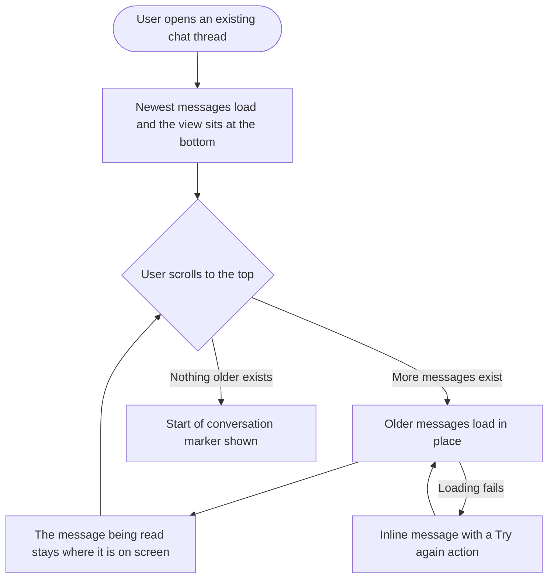

# Epic 1: AI chat conversation context

**Date:** 2026-09-11
**Stories:** 5
**Research:** `01-research.md` section 6

---

## Epic

### Title

**AI chat conversation context**

### Description

The AI assistant behaves as though it forgets. A user writes a detailed brief, works through a handful of exchanges, refers back to the brief, and finds the assistant no longer has it. The same user opens a conversation from last week and can only see the tail end of it, with no way to scroll back to what was actually said.

Both complaints come from the same place: what the assistant receives each turn is a narrow slice of the conversation, and what the user can see is a narrow slice too. This epic widens both. The assistant gets a fuller and richer picture of the conversation, kept affordable by a running summary of the older part rather than by sending everything forever. The user gets to scroll back through the whole thread the way they can in any other chat product.

### Scope

- A running summary of the conversation, updated as the conversation grows, so older context reaches the assistant without the prompt growing without limit.
- A wider and richer recent-message window: more messages, far less truncation, timestamps, and a record of what the assistant actually did rather than only what it said.
- Infinite scroll in the web chat thread, so opening an older conversation and scrolling up loads earlier messages.
- The same infinite scroll in the Flutter app.

### Out of scope

- Memory across separate conversations. This epic widens context inside one conversation only.
- Any change to the chat UI beyond the paging affordances.
- A backend pagination story. The message history endpoint already supports cursor paging and already reports whether more messages exist. The gap is entirely in the clients.

### Sequencing

The two backend stories can run in parallel with the two client stories, because the paging work needs nothing new from the backend. Within the backend, the widening story should land before the summary story, so the summary is written against the final shape of what gets sent.

### Decisions taken

- **Recent-window default of 40 messages, with the summary covering everything older.** This keeps the prompt bounded while making the practical experience feel like full recall. The window is configurable so it can be tuned without a release.
- **The summary is maintained incrementally, not regenerated from the whole conversation each turn.** Regenerating would make every turn slower and more expensive as the conversation grows, which is the problem this is meant to solve.

### Success measures

- A user can hold a 40-message conversation and have the assistant correctly answer a question about the opening message.
- A user can hold a 100-message conversation and have the assistant still recall the brief from the beginning, via the summary.
- A user can scroll to the very start of any conversation.

### Stories

1. **[BE] Widen and enrich the AI chat history sent to the model [Marketing Feedback]**
2. **[BE] Maintain a rolling conversation summary for AI chat context [Marketing Feedback]**
3. **[FE] Load older messages when scrolling back in an AI chat thread [Marketing Feedback]**
4. **[Flutter] Load older messages when scrolling back in an AI chat thread [Marketing Feedback]**
5. **[Design] Design the AI chat thread paging states [Marketing Feedback]**

---

## Story 1

### Title

**[BE] Widen and enrich the AI chat history sent to the model [Marketing Feedback]**

### Description

As someone having a longer conversation with the AI assistant, I want it to remember everything we have already covered in this chat, so that I do not have to repeat a brief I already gave it or re-explain something it already did for me.

The assistant does receive conversation history today, but that history is trimmed in several ways at once. Only the last 10 messages are included, every older turn is cut to roughly 800 characters with the remainder discarded, no timestamps are carried, and nothing about the actions the assistant actually performed is carried at all. There is also a defect where a turn that produces two blocks of assistant text keeps only the second, which corrupts every later turn's view of the conversation. The practical effect is an assistant that appears to forget, offers to redo work it has already done, and cannot reason about the order of events.

---

### Endpoints

No new endpoints. This story changes the request contract of the existing chat send endpoint and the internal contract between the application and the assistant service.

| Endpoint | Change |
|---|---|
| Chat send, the endpoint the web and mobile clients call to send a message and stream a reply | Request body unchanged for clients. What the application assembles and forwards to the assistant service changes: a larger message window, far less per-message truncation, a timestamp on each prior turn, and a summary of completed actions per prior turn. |
| Chat fetch, the endpoint that returns a conversation | Response gains nothing required by clients. Assistant messages that produced several blocks of text now return all of those blocks rather than only the last. |

---

### Workflow

1. User opens AI chat and writes a detailed brief, several paragraphs long, describing their brand, audience and campaign.
2. User works through a dozen or more exchanges: asking for captions, refining them, asking the assistant to check their posting schedule, asking follow-up questions.
3. Later in the same conversation, the user refers back to the brief without restating it, for example "use the same tone as I described at the start".
4. The assistant answers using the brief in full, not a truncated fragment of it.
5. User asks about something the assistant already did, for example "what did you find when you checked my accounts?".
6. The assistant answers from what it actually did, rather than re-running the action or claiming it has no record of it.
7. User asks a time-relative question, for example "what did I ask you at the beginning of this chat?".
8. The assistant distinguishes earlier turns from later ones and answers correctly.

---

### Acceptance criteria

- [ ] The number of recent messages sent with a chat request is configurable rather than fixed, with a default of 40
- [ ] In a conversation of 40 messages, the assistant can correctly answer a question whose only source is the first message
- [ ] A prior user message of 4000 characters is sent in full rather than cut to a few hundred characters
- [ ] When a message is long enough that it must still be shortened, it is marked as shortened, so the assistant can say it does not have the full earlier text instead of treating a fragment as complete
- [ ] Each prior message carries the time it was sent, and the assistant can correctly answer "what did I ask first in this chat"
- [ ] A summary of the actions the assistant completed in a prior turn is sent with that turn, so the assistant does not offer to repeat work it already finished
- [ ] When one turn produces more than one block of assistant text, every block is stored and every block is sent with later turns
- [ ] Regression check: a turn that produced three captions still displays and still replays all three, not only the final block of text
- [ ] Workspace context and analytics context reach the assistant without consuming a slot in the recent-message window, so widening the window is not cancelled out by context overhead
- [ ] Switching workspace still starts a fresh conversation, and no message from one workspace's chat is ever sent with another workspace's chat
- [ ] The contract handed to the assistant service is covered by tests that assert its exact shape, so a change on either side of that boundary fails a test
- [ ] When a chat turn completes, an `ai_chat_turn_completed` Usermaven event fires server-side with `{ workspace_id, history_message_count, had_tool_activity }`

---

### Mock-ups

N/A, backend only.

---

### Impact on existing data

No migration and no change to the shape of stored messages. Existing conversations benefit immediately, because history is assembled per request from messages already stored.

One behavior change does affect newly stored data: assistant turns that produce several blocks of text will store all of them rather than only the last. Conversations that already lost text to the old behavior cannot be recovered, and that should be stated plainly rather than presented as a backfill.

Larger histories mean larger requests to the assistant service and therefore higher token consumption per turn. The configurable window and the companion story **[BE] Maintain a rolling conversation summary for AI chat context [Marketing Feedback]** both exist to keep that bounded.

---

### Impact on other products

- **Mobile app:** benefits automatically. The Flutter assistant calls the same chat endpoint, so it inherits the wider context with no mobile change.
- **Chrome extension:** no impact, it has no AI chat surface.
- **Public API:** no impact. Chat is not a public API surface.
- **AI Studio:** the full-page AI Studio chat shares the same conversation engine and benefits identically.

---

### Dependencies

None. This story leads the epic.

**[BE] Persist quoted selections and forward them to the model as referenced text [Marketing Feedback]**, in the quote reply epic, depends on this story.

---

### Global quality & compliance (wherever applicable)

- [ ] Mobile responsiveness, N/A for this backend-only story
- [ ] Multilingual support (frontend + backend, translations available or fallback handled)
- [ ] UI theming support, N/A for this backend-only story
- [ ] White-label domains impact review
- [ ] Cross-product impact assessment (web, mobile apps, Chrome extension)

---

## Story 2

### Title

**[BE] Maintain a rolling conversation summary for AI chat context [Marketing Feedback]**

### Description

As someone whose conversation with the AI assistant runs to dozens of messages, I want it to still know what we established at the start, so that a long working session does not quietly lose the brief I gave it an hour ago.

Sending more recent messages fixes the short conversations. It cannot fix the long ones, because at some point sending everything becomes too slow and too expensive. The answer is to keep a running summary of the part of the conversation that has fallen outside the recent window, update that summary as the conversation grows, and send it alongside the recent messages. The assistant then has the gist of the whole conversation plus the detail of the recent part, at a cost that does not grow without limit.

---

### Endpoints

No new public endpoints. The summary is maintained internally and travels with the prompt.

| Endpoint | Change |
|---|---|
| Chat send | What the application forwards to the assistant service gains the conversation summary, clearly marked as a summary of earlier context and distinct from the verbatim recent messages. |
| Chat fetch | Response gains a read-only indication that a summary exists and how many earlier messages it covers, so support and QA can verify the feature is working without inspecting logs. Clients are not required to display it. |

---

### Workflow

1. User has a long working session with the AI assistant, well past the recent-message window.
2. As the conversation grows, the summary of the earlier part is kept up to date in the background. The user sees no indication of this and their chat is never interrupted.
3. User refers back to something established early in the session, for example "remember the three audience segments we agreed on".
4. The assistant answers from the summary, correctly naming what was agreed.
5. User asks for exact wording from an early message that has fallen outside the recent window.
6. The assistant answers from the summary and is explicit that it has the gist rather than the exact earlier wording, instead of inventing a quotation.

---

### Acceptance criteria

- [ ] A conversation summary is maintained for each chat and updated as the conversation grows past the recent-message window
- [ ] The summary is updated incrementally from the messages leaving the window, not regenerated from the entire conversation on every turn
- [ ] The summary is sent to the assistant clearly marked as a summary of earlier context, distinguishable from the verbatim recent messages
- [ ] In a conversation of 100 messages, the assistant can correctly answer a question whose only source is the first message
- [ ] When asked for exact wording that exists only in the summarized part, the assistant conveys the substance and does not present invented text as a direct quotation
- [ ] The summary has a size ceiling, so an extremely long conversation does not grow the prompt without limit
- [ ] Summary maintenance never blocks or slows the user's reply. A turn is answered even if the summary update has not finished
- [ ] If a summary update fails, the turn still succeeds using the recent messages, and the failure is logged and retried rather than surfaced to the user
- [ ] A conversation shorter than the recent-message window has no summary, and nothing about the summary is sent for it
- [ ] Existing conversations that already exceed the window build a summary the next time the user sends a message in them, so the feature applies retroactively without a migration
- [ ] Deleting a conversation deletes its summary
- [ ] The summary is scoped to its conversation and its workspace, and is never sent with a different conversation

---

### Mock-ups

N/A, backend only. The summary is deliberately invisible to the user.

---

### Impact on existing data

Adds a stored summary per conversation. No migration is needed: conversations without a summary simply do not have one, and build one on the next message. No existing field changes shape.

---

### Impact on other products

- **Mobile app:** benefits automatically, same endpoint.
- **Chrome extension:** no impact.
- **Public API:** no impact.
- **AI Studio:** in scope, same conversation engine.

---

### Dependencies

Depends on **[BE] Widen and enrich the AI chat history sent to the model [Marketing Feedback]**, because the summary covers whatever falls outside the recent window and that story defines the window.

---

### Global quality & compliance (wherever applicable)

- [ ] Mobile responsiveness, N/A for this backend-only story
- [ ] Multilingual support (frontend + backend, translations available or fallback handled)
- [ ] UI theming support, N/A for this backend-only story
- [ ] White-label domains impact review
- [ ] Cross-product impact assessment (web, mobile apps, Chrome extension)

---

## Story 3

### Title

**[FE] Load older messages when scrolling back in an AI chat thread [Marketing Feedback]**

### Description

As someone returning to an AI chat conversation, I want to scroll back and read what we discussed earlier, so that I can find a caption the assistant wrote for me last week without starting over.

Opening an existing conversation shows only its most recent messages, and there is no way to reach anything older. The messages are stored and the API can already serve them a page at a time, so the thread simply never asks for the next page. For a user who works in one long-running chat, most of their own history is currently unreachable.

The behavior should match what people expect from any chat product: newest messages first, and scrolling up loads what came before. A conversation the user started in this session is already fully loaded and needs no paging, so the affordance only does work when the user opens an older conversation.

---

### Workflow

1. User opens AI chat and selects an earlier conversation from their chat history.
2. The newest messages appear and the view sits at the newest message, as it does today.
3. User scrolls upward toward the top of the thread.
4. As they approach the top, a loading row appears and the previous page of older messages loads in place above it.
5. The message the user was reading stays exactly where it was on screen, so content does not jump under their cursor while older messages are inserted above.
6. User keeps scrolling up and further pages load the same way.
7. When nothing older remains, the user sees a marker telling them they have reached the start of the conversation.
8. If a page fails to load, the user sees an inline message with a "Try again" action and can retry without losing their place or reloading the app.
9. In a conversation the user started in this session, everything is already on screen, so scrolling up simply reaches the first message with no loading step.

---

### Acceptance criteria

- [ ] Scrolling to within roughly one screen of the top of a thread loads the previous page of older messages automatically, without the user clicking anything
- [ ] Loading a page does not move the message the user is currently reading, and the view does not jump to the top or the bottom
- [ ] While a page is loading, a loading row appears at the top of the thread using the `Loader` component
- [ ] No duplicate message ever appears after paging, and no message is skipped between pages
- [ ] Once the oldest message has loaded, the start-of-conversation marker is shown and no further requests are made on subsequent scrolls
- [ ] A conversation started in the current session shows its start-of-conversation marker without making any paging request
- [ ] When a page request fails, an inline error row with a "Try again" action appears in place of the loading row, and the already-loaded messages stay on screen
- [ ] Clicking "Try again" retries the same page and clears the error row on success
- [ ] Paging is not triggered while the newest message is still streaming, so a reply in progress is never interrupted
- [ ] Sending a new message while scrolled back returns the view to the newest message
- [ ] Switching to a different conversation resets paging, so the new thread starts from its newest messages
- [ ] The chat history list, which pages through conversations rather than messages, keeps working exactly as it does today
- [ ] Behaviour is identical in the AI chat modal, the AI chat widget and the full-page AI Studio chat

---

### UI copy

**Loading older messages**

A row at the top of the thread while a page loads, using the `Loader` component with the label beside it.

> Loading earlier messages...

**Start of conversation marker**

A centered divider row shown once the oldest message has loaded, in `text-gray-500`.

> This is the beginning of this conversation

**Error state**

An inline row at the top of the thread replacing the loading row, using the `Alert` component with a `Button` in `ghost` variant for the action.

> **Message:** We could not load your earlier messages. Check your connection and try again.
> **Action label:** Try again

**Empty state**

N/A. Paging only runs inside a conversation that already has messages, and a brand-new conversation keeps its existing opening state unchanged.

---

### Mock-ups

See **[Design] Design the AI chat thread paging states [Marketing Feedback]**.

---

### Impact on existing data

None. This story reads existing stored messages through an endpoint that already supports paging. No new fields, no migration.

---

### Impact on other products

- **Mobile app:** no impact from this story. The mobile equivalent is **[Flutter] Load older messages when scrolling back in an AI chat thread [Marketing Feedback]**.
- **Chrome extension:** no impact.
- **Public API:** no impact.
- **AI Studio:** in scope, same thread component.

---

### Dependencies

None. This story needs nothing from the backend stories in this epic and can ship first.

---

### Global quality & compliance (wherever applicable)

- [ ] Mobile responsiveness (frontend only, N/A for backend-only stories)
- [ ] Multilingual support (frontend + backend, translations available or fallback handled)
- [ ] UI theming support (default + white-label, design library components are being used)
- [ ] White-label domains impact review
- [ ] Cross-product impact assessment (web, mobile apps, Chrome extension)

---

## Story 4

### Title

**[Flutter] Load older messages when scrolling back in an AI chat thread [Marketing Feedback]**

### Description

As someone using the ContentStudio app on my phone, I want to scroll back through an AI chat conversation the same way I can on the web, so that a conversation I started on my laptop is fully readable on mobile.

The app shows conversations from the same stored history as the web app, so once the web thread pages back through older messages the mobile thread should too. Without this, a user switching between devices sees a different amount of their own conversation depending on which one they pick up.

---

### Workflow

1. User opens the AI assistant in the app and selects an earlier conversation from their chat history.
2. The newest messages appear and the view sits at the newest message.
3. User scrolls upward toward the top of the thread.
4. As they approach the top, a loading indicator appears and the previous page of older messages loads in place above it.
5. The message the user was reading stays in place on screen while older messages are inserted above it.
6. When nothing older remains, the user sees a marker telling them they have reached the start of the conversation.
7. If a page fails to load, the user sees an inline message with a "Try again" action and can retry without leaving the conversation.

---

### Acceptance criteria

- [ ] Scrolling near the top of a conversation loads the previous page of older messages automatically
- [ ] The message the user is reading does not move when older messages are inserted above it
- [ ] A loading indicator appears at the top of the thread while a page is loading
- [ ] No duplicate or skipped message appears after paging
- [ ] The start-of-conversation marker appears once the oldest message has loaded, and no further requests are made
- [ ] A conversation started in the current session shows its marker without making a paging request
- [ ] A failed page shows an inline message with a "Try again" action, and already-loaded messages stay on screen
- [ ] Paging does not trigger while the newest reply is still streaming
- [ ] Sending a new message returns the view to the newest message
- [ ] Opening a different conversation resets paging to that conversation's newest messages
- [ ] Behaviour is verified on both iOS and Android, including that the scroll-position hold works with each platform's overscroll behavior

---

### UI copy

Copy matches the web story so the two surfaces read the same.

> **Loading row:** Loading earlier messages...
> **Start of conversation marker:** This is the beginning of this conversation
> **Error message:** We could not load your earlier messages. Check your connection and try again.
> **Error action label:** Try again

---

### Mock-ups

N/A. This story mirrors an existing web behavior using the app's own message list and loading patterns, so no new mobile design is required.

---

### Impact on existing data

None. Reads existing stored messages through the same paging endpoint the web app uses.

---

### Impact on other products

- **Web:** no impact. The web behavior is delivered by **[FE] Load older messages when scrolling back in an AI chat thread [Marketing Feedback]**.
- **Chrome extension:** no impact.

---

### Dependencies

None. The paging endpoint already exists, so this story is not blocked and can be built in parallel with its web counterpart. The two should behave identically.

---

### Global quality & compliance (wherever applicable)

- [ ] Mobile responsiveness (frontend only, N/A for backend-only stories)
- [ ] Multilingual support (frontend + backend, translations available or fallback handled)
- [ ] UI theming support (default + white-label, design library components are being used)
- [ ] White-label domains impact review
- [ ] Cross-product impact assessment (web, mobile apps, Chrome extension)

---

## Story 5

### Title

**[Design] Design the AI chat thread paging states [Marketing Feedback]**

### Description

As the developers building the paging behavior on web and in the app, we want an agreed treatment for the three new rows that appear at the top of a thread, so that the web and mobile surfaces match and neither invents its own styling.

This is a small design story by design. The surfaces are three narrow rows inside an existing thread, and the point is consistency rather than exploration.

---

### Workflow

1. Designer reviews the copy specified in the web story, which is agreed and should be treated as the content to design around rather than placeholder text.
2. Designer produces the states listed below for web, and confirms the mobile treatment either matches or notes where a platform pattern should differ.
3. Designer reviews with product and frontend, and the agreed treatment becomes the reference for both client stories.

---

### Acceptance criteria

- [ ] The loading row at the top of a thread, showing spinner placement and spacing relative to the first message
- [ ] The start-of-conversation marker, as a centered divider row
- [ ] The inline error row with its retry action, shown in place of the loading row
- [ ] All three states shown at desktop width and at mobile width
- [ ] A note confirming whether the mobile app should use the same three rows or a platform-native loading pattern
- [ ] Every state uses components from the existing design system, and any genuine gap is called out explicitly rather than drawn as a one-off
- [ ] All colour use is theme-aware, with no hardcoded colours, so white-label customers with a non-blue primary colour render correctly

---

### Mock-ups

This story produces them.

---

### Impact on existing data

None.

---

### Impact on other products

- **Mobile app:** this story covers the mobile treatment as a note rather than a separate design, since the app reuses its own loading patterns.
- **Chrome extension:** no impact.

---

### Dependencies

None. Should start before **[FE] Load older messages when scrolling back in an AI chat thread [Marketing Feedback]** and **[Flutter] Load older messages when scrolling back in an AI chat thread [Marketing Feedback]**.

---

### Global quality & compliance (wherever applicable)

- [ ] Mobile responsiveness (frontend only, N/A for backend-only stories)
- [ ] Multilingual support (frontend + backend, translations available or fallback handled)
- [ ] UI theming support (default + white-label, design library components are being used)
- [ ] White-label domains impact review
- [ ] Cross-product impact assessment (web, mobile apps, Chrome extension)
