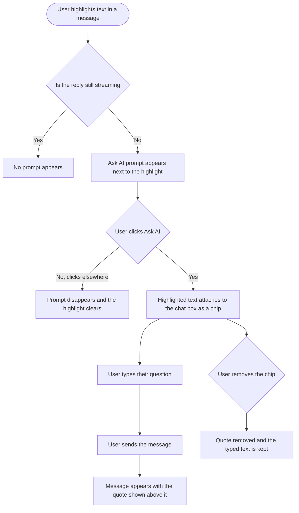

# Epic 2: Ask AI about a highlighted passage

**Date:** 2026-09-11
**Stories:** 3
**Research:** `01-research.md` section 10

---

## Epic

### Title

**Ask AI about a highlighted passage**

### Description

When the assistant writes a long reply, a user with a question about one sentence of it has no way to say which sentence. They either copy and paste it back, or describe it in words and hope the assistant works out what they mean. The same is true of their own earlier messages: there is no way to point back at one part of a brief they wrote.

This epic adds the pattern people already know from Claude and ChatGPT. Highlight some text, a small prompt appears, click it, and the highlighted passage is attached to the message box. The follow-up the user types is then understood to be about that passage, and the sent message keeps the quote visible in the conversation so the thread still reads correctly later.

### Scope

- Highlighting text in any AI chat message, the assistant's or the user's own, offers a way to ask about just that passage.
- The highlighted passage attaches to the chat box as a removable chip before sending.
- The sent message shows the quoted passage above what the user typed, so the conversation records what the question was about.
- The passage reaches the model as explicitly referenced text, so the answer is actually about the quote.
- The quote survives a page reload.

### Out of scope

- Quote reply on mobile. The app renders messages as non-selectable native text, so selection there means changing the message renderer, which is separate work.
- Selecting across a rendered chart, table, stat tile or confirmation card. A first release covers prose, with a message-level fallback for everything else.
- Quoting more than one passage in a single message.

### Sequencing

The backend story leads, because the frontend affordance would look correct and behave incorrectly without it: a quote that is rendered but never forwarded to the model produces answers that ignore the quote. The design story should start first.

### Decisions taken

- **The label is "Ask AI".** ChatGPT uses "Ask" and Claude uses "Reply". "Reply" reads like replying to a person, and ContentStudio's guidance is to write for someone who has never used a social media tool, so "Ask AI" says what will happen with no ambiguity. This is a copy decision and easy to change.
- **One quote at a time.** Quoting a second passage replaces the first, rather than building a list. Multi-quote can follow if users ask for it.

### Success measures

- A user can highlight a sentence, ask "make this shorter", and get an answer about that sentence rather than about the whole reply.
- The quote is still visible on the message after a reload.

### Stories

1. **[BE] Persist quoted selections and forward them to the model as referenced text [Marketing Feedback]**
2. **[FE] Let users highlight text in AI chat and ask about that passage [Marketing Feedback]**
3. **[Design] Design the Ask AI highlight popover, chip and in-thread quote block [Marketing Feedback]**

---

## Story 1

### Title

**[BE] Persist quoted selections and forward them to the model as referenced text [Marketing Feedback]**

### Description

As someone who has highlighted one sentence of an AI reply and asked a follow-up about it, I want the model to actually receive that sentence as the thing I am pointing at, and I want my quote to still be there when I reload the page, so that the feature is more than a visual decoration.

A quoted passage has to survive two journeys. It has to be stored with the message so the conversation still reads correctly after a reload, and it has to be handed to the model as clearly marked referenced text so the answer is about the quoted passage rather than a guess from surrounding context. Both are backend work.

---

### Endpoints

No new endpoints. Two existing endpoints change shape.

| Endpoint | Change |
|---|---|
| Chat send, the endpoint the client calls to send a message and stream a reply | Request body accepts an optional quoted passage carrying the quoted text, the identifier of the message it came from, and whether that message was the user's or the assistant's. Validated and rejected if the quote is too long or its source message belongs to another conversation. What is forwarded to the assistant service carries the passage as explicitly marked referenced text, separate from conversation history. |
| Chat fetch, the endpoint that returns a conversation | Response returns the stored quoted passage on any message that has one, so the client can rebuild the quote after a reload. Messages without a quote return no such field rather than an empty one. |

---

### Workflow

1. User highlights part of an earlier message in AI chat, attaches it, types a follow-up and sends it.
2. The message is stored together with the quoted text and a reference to the message the quote came from.
3. The model receives the user's question with the quoted passage clearly marked as the passage being referenced, distinct from the rest of the conversation.
4. The model answers about the quoted passage specifically.
5. User reloads the page and reopens the conversation.
6. Their message still shows the quote above it, attributed to where it came from.

---

### Acceptance criteria

- [ ] A chat message can be sent with a quoted passage attached, carrying the quoted text and the identifier and role of the message it was taken from
- [ ] The quoted passage is stored with the message and returned when the conversation is fetched, so the quote is rebuilt after a reload
- [ ] The quoted passage reaches the model as explicitly marked referenced text, separate from conversation history, so the model can tell it apart from an ordinary prior turn
- [ ] Asking "what does this mean" with a quote attached produces an answer about the quoted passage and not about the most recent topic of the conversation
- [ ] A quoted passage longer than 1000 characters is rejected with a clear validation error rather than silently truncated
- [ ] A quote whose source message belongs to a different conversation is rejected
- [ ] A quote whose source message has since been deleted is accepted, and the quoted text is still forwarded and still stored, so the user's question does not fail because of a deletion
- [ ] The quoted passage travels as part of its own message and does not consume an extra slot in the recent-message window
- [ ] A message sent without a quote behaves exactly as it does today, with no quote field present in what is stored or forwarded
- [ ] Deleting a message removes that message and its quote together
- [ ] A quote is scoped to its workspace and conversation, and is never returned with another conversation

---

### Mock-ups

N/A, backend only.

---

### Impact on existing data

Adds an optional quoted-passage field to stored chat messages. No migration: existing messages simply have no quote, and the field is absent rather than empty for them. No existing field changes shape, so a message stored before this ships reads identically afterwards.

---

### Impact on other products

- **Mobile app:** the app will receive the new field when it fetches a conversation and must ignore an unknown field gracefully. A conversation containing quotes opened on mobile shows the user's text without the quote block, which reads as a slightly incomplete message rather than an error. Worth confirming the app tolerates the new field during implementation.
- **Chrome extension:** no impact.
- **Public API:** no impact.
- **AI Studio:** in scope, same conversation engine.

---

### Dependencies

Depends on **[BE] Widen and enrich the AI chat history sent to the model [Marketing Feedback]** in the AI chat conversation context epic, because the quoted passage is delivered inside the same contract that story reshapes. Building against two versions of that contract would mean doing the integration twice.

---

### Global quality & compliance (wherever applicable)

- [ ] Mobile responsiveness, N/A for this backend-only story
- [ ] Multilingual support (frontend + backend, translations available or fallback handled)
- [ ] UI theming support, N/A for this backend-only story
- [ ] White-label domains impact review
- [ ] Cross-product impact assessment (web, mobile apps, Chrome extension)

---

## Story 2

### Title

**[FE] Let users highlight text in AI chat and ask about that passage [Marketing Feedback]**

### Description

As someone reading a long AI reply, I want to highlight the one sentence I have a question about and ask about just that, so that I do not have to copy and paste it or describe which part I mean.

Highlighting text shows a small "Ask AI" prompt next to the selection. Clicking it attaches the highlighted passage to the chat box as a chip, and whatever the user types next is understood to be about that passage. The sent message keeps the quote visible above it, so anyone reading the conversation later can see what the question referred to. It works on the assistant's replies and on the user's own earlier messages.

---

### Workflow

1. User highlights a passage inside an assistant reply, or inside one of their own earlier messages.
2. A small "Ask AI" prompt appears next to the highlighted text.
3. User clicks it. The highlighted passage attaches to the chat box as a chip, and the cursor moves into the chat box ready to type.
4. User types a question, for example "can you make this shorter", and sends it.
5. Their message appears in the conversation with the quoted passage shown above what they typed, labelled with where it came from.
6. The assistant's reply addresses the quoted passage.
7. At any point before sending, the user can remove the chip. Anything they have already typed is kept.
8. Clicking the quote on a sent message scrolls the conversation to the message it came from and briefly highlights it.

---

### Acceptance criteria

- [ ] Highlighting two or more characters inside an assistant message shows an "Ask AI" prompt positioned next to the highlight
- [ ] Highlighting text inside the user's own earlier message shows the same prompt
- [ ] No prompt appears while the reply is still streaming
- [ ] No prompt appears for a highlight of fewer than two characters, or one containing only whitespace
- [ ] The captured text matches what the user visually highlighted, with normal single spaces between words and no missing or doubled spaces
- [ ] Clicking "Ask AI" attaches a chip above the chat box showing the quoted text, truncated with an ellipsis beyond roughly 80 characters, and moves focus into the chat box
- [ ] Only one quote can be attached at a time, and highlighting a new passage replaces the existing chip
- [ ] Removing the chip clears the quote and leaves any typed text untouched
- [ ] Sending the message clears the chip, and the sent message renders the quoted passage above the user's text as a distinct quote block
- [ ] The quote block states whether the quote came from the assistant or from the user's own message
- [ ] Clicking a quote block scrolls the conversation to the source message and briefly highlights it
- [ ] Reloading the page and reopening the conversation still shows the quote block on the sent message
- [ ] A highlight longer than 1000 characters is accepted, the chip shows the first 1000 characters, and a note explains that only that much will be quoted
- [ ] Highlights falling inside a chart, table, stat tile or confirmation card do not show the prompt, and the user can use the message-level "Ask about this message" action instead
- [ ] Pressing Escape while a chip is attached removes the quote
- [ ] The feature works in the AI chat modal, the AI chat widget and the full-page AI Studio chat
- [ ] At mobile width, the prompt appears on a long-press selection and stays fully within the viewport
- [ ] When the user sends a message with a quote attached, an `ai_chat_quote_reply_sent` Usermaven event fires with `{ source_role, surface, quote_length }`, where `source_role` is `assistant` or `user` and `surface` is `modal`, `widget` or `studio`. The quoted text itself is never included in the payload.

---

### UI copy

**Highlight prompt**

A small floating button using the `ActionIcon` component with a quote icon and a visible label, appearing next to the highlight.

> **Label:** Ask AI
> **Tooltip:** Ask about just this part. The text you highlighted gets attached to your next message, so the assistant knows exactly which bit you mean.

**Chip above the chat box**

Styled to match the existing attachment chips above the chat box: rounded border, quote icon, truncated text, remove button on the right.

> **Prefix label:** Asking about
> **Body:** the quoted text, truncated to roughly 80 characters with an ellipsis
> **Remove button tooltip:** Remove
> **Note, only when the highlight was longer than 1000 characters:** Only the first 1000 characters of your highlight will be included.

**Quote block on a sent message**

A block above the user's text with a left border in `border-primary-cs-200` and a light background in `bg-primary-cs-50/50`, with a small attribution line above it in `text-gray-500`.

> **Attribution when quoting the assistant:** Asking about ContentStudio AI's reply
> **Attribution when quoting the user's own message:** Asking about your message

**Message-level fallback action**

Added to the row of actions that appears when hovering a message, for users who cannot make a highlight or whose highlight falls inside a chart or table.

> **Tooltip:** Ask about this message

**Error state**

> Shown as a toast if the message fails to send: We could not send your message. Your highlight and your text have been kept, so you can try again.

**Empty and loading states**

N/A. This story adds an affordance to existing messages and introduces no new view or list. The no-highlight state is simply the absence of the prompt, covered in the acceptance criteria.

**Component note**

> No new component is required. The design system has no standalone tooltip component, so tooltips here should follow the existing popover approach used elsewhere in the app.

---

### Mock-ups

See **[Design] Design the Ask AI highlight popover, chip and in-thread quote block [Marketing Feedback]**.

---

### Impact on existing data

None on the frontend. The quoted passage is stored by **[BE] Persist quoted selections and forward them to the model as referenced text [Marketing Feedback]**.

---

### Impact on other products

- **Mobile app:** out of scope. The app renders messages as non-selectable native text, so highlighting requires changing the message renderer. A conversation containing quotes opened on mobile shows the user's text without the quote block.
- **Chrome extension:** no impact.
- **Public API:** no impact.
- **AI Studio:** in scope, same components.

---

### Dependencies

Depends on **[BE] Persist quoted selections and forward them to the model as referenced text [Marketing Feedback]**.

Design input from **[Design] Design the Ask AI highlight popover, chip and in-thread quote block [Marketing Feedback]** should land before build starts.

---

### Global quality & compliance (wherever applicable)

- [ ] Mobile responsiveness (frontend only, N/A for backend-only stories)
- [ ] Multilingual support (frontend + backend, translations available or fallback handled)
- [ ] UI theming support (default + white-label, design library components are being used)
- [ ] White-label domains impact review
- [ ] Cross-product impact assessment (web, mobile apps, Chrome extension)

---

## Story 3

### Title

**[Design] Design the Ask AI highlight popover, chip and in-thread quote block [Marketing Feedback]**

### Description

As the developers building this, we want an agreed treatment for the three new surfaces, so that a feature that sits directly on top of a conversation the user is reading feels deliberate rather than bolted on.

The hardest part is restraint. The popover appears over live text, the chip competes with existing attachment chips above the chat box, and the quote block adds height to every message that has one. All three need to be quiet.

---

### Workflow

1. Designer reviews the copy specified in the frontend story, which is agreed and should be treated as the content to design around rather than placeholder text.
2. Designer produces the states listed below.
3. Designer reviews with product and frontend, and the agreed designs become the reference for the frontend story.

---

### Acceptance criteria

- [ ] The "Ask AI" popover over a highlight, including its position when the highlight is at the top edge, the bottom edge and the right edge of the chat area
- [ ] The popover shown over a highlight that spans several lines
- [ ] The chip above the chat box, in short-text, truncated and over-limit variants, shown alongside an existing attachment chip so the two can be compared
- [ ] The quote block on a sent message, in both attributions, for a one-line quote and for a quote of several lines
- [ ] The brief highlight applied to a source message when the user clicks a quote block
- [ ] The message-level fallback action in the hover action row
- [ ] The mobile-width treatment, where the highlight comes from a long press
- [ ] Every state uses components from the existing design system, and any genuine gap is called out explicitly rather than drawn as a one-off
- [ ] All colour use is theme-aware, with no hardcoded colours, and designs are delivered for both the default primary colour and a non-blue white-label primary colour

---

### Mock-ups

This story produces them.

---

### Impact on existing data

None.

---

### Impact on other products

- **Mobile app:** out of scope, since quote reply is not part of this epic on mobile.
- **Chrome extension:** no impact.

---

### Dependencies

None. Should start first in this epic, before **[FE] Let users highlight text in AI chat and ask about that passage [Marketing Feedback]**.

---

### Global quality & compliance (wherever applicable)

- [ ] Mobile responsiveness (frontend only, N/A for backend-only stories)
- [ ] Multilingual support (frontend + backend, translations available or fallback handled)
- [ ] UI theming support (default + white-label, design library components are being used)
- [ ] White-label domains impact review
- [ ] Cross-product impact assessment (web, mobile apps, Chrome extension)
