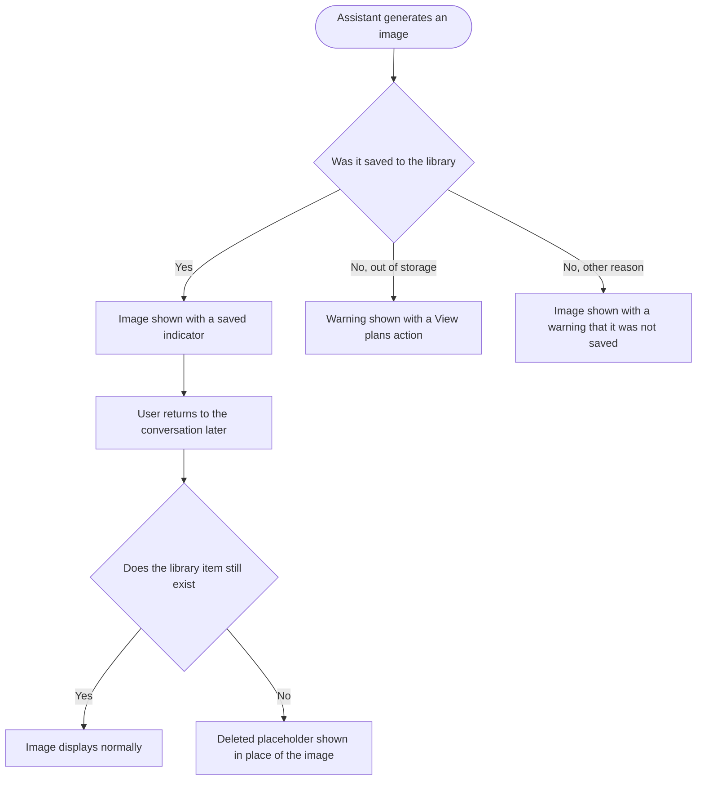

# Epic 3: AI chat images in the Content Library

**Date:** 2026-09-11
**Stories:** 4
**Research:** `01-research.md` section 8

---

## Epic

### Title

**AI chat images in the Content Library**

### Description

Images generated by AI Studio tools already save to the Content Library automatically. Images generated in AI chat do not. They are stored durably, but with no library record, which means they are invisible to the Content Library, to the AI section, to the composer's media picker, to search and to folders, and they do not count toward the storage the customer is paying for. If the conversation is deleted, the only route back to the image is gone.

There is a "Save to media library" button in chat today that papers over this, and it papers over it badly: it makes the browser download the image and upload it again, producing a second copy of the same file with a generic name and no record of where it came from. Once generation saves the image properly, that button has no reason to exist and is removed.

The other half of this epic is what happens afterwards. Once a chat image is a real library item, a user can delete it from the Content Library, and the conversation that produced it must handle that honestly rather than showing a broken image.

### Scope

- Images generated in AI chat save to the Content Library automatically, marked as AI generated and attributed to AI chat.
- Those images appear in the Content Library's AI section alongside AI Studio tool output.
- The "Save to media library" action is removed from AI chat, because it is no longer needed.
- A chat image whose library item has been deleted shows a clear deleted state in the conversation instead of a broken image.

### Out of scope

- Any change to what AI Studio tools generate or how their output is stored. That path already works and is left alone.
- Backfilling images generated in AI chat before this ships. See the note in the first backend story: this is a deliberate product decision, not an oversight.
- Video generated in AI chat. Async video output already reaches the library through its own path.
- Mobile. AI image generation is web-only.

### Sequencing

The two backend stories lead, in order: saving on generation comes first, then linking and deleted-state reporting. The frontend story depends on both. The design story should start first.

### Decisions taken

- **Chat images appear under the existing AI section of the Content Library rather than in a new one.** AI chat is part of AI Studio from the user's point of view, so a separate destination would be a distinction users do not make. This also finally makes that section positively definable, which the existing Content Library AI work could not do while chat images had no origin recorded.
- **Saving is best-effort and never fails a generation.** The user has already spent credits by the time saving happens. A storage failure surfaces as a warning, not as a failed generation.

### Success measures

- Every image generated in AI chat is findable in the Content Library afterwards, attributable to AI chat, and counted against workspace storage.
- No user ever sees a broken image in a conversation because they tidied up their library.

### Stories

1. **[BE] Save images generated in AI chat to the Content Library on generation [Marketing Feedback]**
2. **[BE] Link AI chat images to their Content Library item and report deleted media [Marketing Feedback]**
3. **[FE] Show AI chat images in the Content Library AI section and remove the save action [Marketing Feedback]**
4. **[Design] Design the AI chat saved-image and deleted-image states [Marketing Feedback]**

---

## Story 1

### Title

**[BE] Save images generated in AI chat to the Content Library on generation [Marketing Feedback]**

### Description

As someone who generates images while chatting with the AI assistant, I want those images to be in my Content Library automatically, so that I can find and reuse them later without having to remember which conversation produced them.

AI Studio tools already do this. AI chat does not, and the inconsistency is invisible to the user because the two surfaces look the same. This story makes chat follow the same path tools already use.

---

### Endpoints

No new public endpoints. One internal path is added and one existing endpoint is corrected.

| Endpoint | Change |
|---|---|
| Chat send, the endpoint that streams a generated image back to the client | After an image is generated, it is saved to the Content Library for the current workspace. The streamed result gains whether saving succeeded, the resulting library item identifier, and a reason if it failed, including a distinct reason for the workspace being out of storage. |
| Public media upload, the endpoint the assistant's own media import action posts to | Corrected to mark media it creates as AI generated, so an assistant-imported image appears in the AI section rather than only under all uploads. |

---

### Workflow

1. User asks the AI assistant to generate an image.
2. The assistant generates it and shows it in the conversation as it does today.
3. Behind the scenes the image is saved to the user's Content Library for the current workspace, marked as AI generated and attributed to AI chat.
4. User opens the Content Library later and finds the image in the AI section, with a meaningful name.
5. User selects it in the composer's media picker and uses it in a post.
6. If the workspace has no storage left, the image is still generated and still shown in the conversation, and the result says it could not be saved.

---

### Acceptance criteria

- [ ] An image generated in AI chat creates a Content Library item for the current workspace, without the user taking any action
- [ ] The item is marked as AI generated, so it appears in the Content Library's AI section
- [ ] The item records that AI chat created it, distinctly from items created by AI Studio tools
- [ ] The stored file name is meaningful rather than a bare timestamp, so the item is recognisable in a library list
- [ ] The AI-generated marker is part of the declared media response shape rather than an undeclared extra field, so it is reliably present in responses
- [ ] Images generated in AI chat count toward the workspace storage limit
- [ ] The stored file is organised per workspace, consistent with every other Content Library item, so one workspace's generated images are never stored outside that workspace's area
- [ ] Saving never fails the generation: if saving fails for any reason, the image is still returned and still shown in the conversation, and the result says saving did not succeed and why
- [ ] When the workspace is out of storage, the result carries a distinct out-of-storage reason, so the user can be told exactly that rather than a generic failure
- [ ] Generating an image creates exactly one Content Library item, never two
- [ ] Adding a generated image to the composer, or scheduling it, uses the library item rather than creating another copy
- [ ] An image imported by the assistant's own media import action is marked as AI generated
- [ ] AI Studio tool generation continues to behave exactly as it does today, with no change to its items
- [ ] When an image is saved from AI chat, an `ai_media_saved_to_library` Usermaven event fires server-side with `{ workspace_id, surface, media_type }`, where `surface` is `ai_chat`

---

### Mock-ups

N/A, backend only.

---

### Impact on existing data

New Content Library items are created from the point this ships. Because these images now count toward storage, a workspace that has generated many images in chat will see its used storage rise once they start being counted. That is correct rather than a regression, but it is customer-visible and support should know before release.

Images generated in AI chat **before** this ships still have no library item. A one-time backfill is technically possible, since each conversation retains the list of images it produced. It is deliberately **not** part of this story: backfilling would move a large number of historical files into workspaces that may already be near their storage limit, and whether to do that, and whether it should count against storage, is a product decision. Recommend shipping this story first and treating the backfill as separate, explicitly decided work.

---

### Impact on other products

- **Mobile app:** positive and automatic. The mobile Content Library reads the same items, so images generated in chat on the web become visible on mobile. AI image generation itself stays web-only.
- **Chrome extension:** no impact.
- **Public API:** images generated in AI chat become visible through the media endpoints, since they are now real library items. The public media upload path is also corrected to mark assistant-imported media as AI generated.
- **AI Studio:** unchanged for tools. The AI Studio chat surface shares the chat engine and gains the same behavior.
- **Billing and storage limits:** generated images now consume workspace storage.
- Related: the existing Content Library AI work could not positively define its AI section while chat images recorded no origin. This story supplies that origin.

---

### Dependencies

None. Independent of every other epic in this batch.

---

### Global quality & compliance (wherever applicable)

- [ ] Mobile responsiveness, N/A for this backend-only story
- [ ] Multilingual support (frontend + backend, translations available or fallback handled)
- [ ] UI theming support, N/A for this backend-only story
- [ ] White-label domains impact review
- [ ] Cross-product impact assessment (web, mobile apps, Chrome extension)

---

## Story 2

### Title

**[BE] Link AI chat images to their Content Library item and report deleted media [Marketing Feedback]**

### Description

As someone who tidies up my Content Library, I want conversations that used a deleted image to say so clearly, so that I am not left looking at a broken picture wondering whether the app is broken or I did something wrong.

Once chat images are real Content Library items, users can delete them. Today a chat message stores only the image address, so a deleted image would simply fail to load and show as broken. Storing the link between the chat message and the library item lets the conversation report the truth instead.

---

### Endpoints

| Endpoint | Change |
|---|---|
| Chat send | When a generated image is saved, the resulting library item identifier is stored on the chat message alongside the image, so the two stay associated. |
| Chat fetch, the endpoint that returns a conversation | For each image in the conversation, the response reports whether its library item still exists. An image whose item has been deleted, or archived, is returned flagged as unavailable with the reason, instead of returning an address that will fail to load. |

---

### Workflow

1. User generates an image in AI chat, and it is saved to their Content Library.
2. Later the user deletes that image from the Content Library, or archives it.
3. User reopens the conversation that produced it.
4. The conversation reports that image as no longer available, with the reason, rather than attempting to display it.
5. Everything else in the conversation, including the surrounding text and any other images, displays normally.

---

### Acceptance criteria

- [ ] When a generated image is saved to the Content Library, the resulting item is recorded on the chat message so the message and the library item stay associated
- [ ] Fetching a conversation reports, per image, whether its library item still exists
- [ ] An image whose library item has been deleted is returned flagged as unavailable, with a reason distinguishing deleted from archived
- [ ] An image whose library item still exists is returned normally, with no additional handling
- [ ] Images in conversations that predate this change have no associated library item and are returned as they are today, so older conversations are unaffected
- [ ] Restoring an archived library item makes the image available in its conversation again without the user taking any action in the chat
- [ ] Reporting availability does not require a separate request per image, so opening a conversation with many images does not become slow
- [ ] Deleting a conversation does not delete the Content Library items it produced, because the user may still be using them elsewhere
- [ ] Deleting a Content Library item does not delete or alter the chat message that produced it

---

### Mock-ups

N/A, backend only. The user-facing treatment is covered by the frontend story in this epic.

---

### Impact on existing data

Adds an optional library-item reference to stored chat messages. No migration: messages from before this ships have no reference and are treated as unlinked, which preserves their current behavior exactly.

---

### Impact on other products

- **Mobile app:** the app will receive the new availability information and must ignore unknown fields gracefully. A deleted image on mobile will still show as a failed image until a mobile story handles it, which is the current behavior and not a regression.
- **Chrome extension:** no impact.
- **Public API:** no impact.
- **AI Studio:** in scope, same conversation engine.

---

### Dependencies

Depends on **[BE] Save images generated in AI chat to the Content Library on generation [Marketing Feedback]**, because there is no library item to link to until that ships.

---

### Global quality & compliance (wherever applicable)

- [ ] Mobile responsiveness, N/A for this backend-only story
- [ ] Multilingual support (frontend + backend, translations available or fallback handled)
- [ ] UI theming support, N/A for this backend-only story
- [ ] White-label domains impact review
- [ ] Cross-product impact assessment (web, mobile apps, Chrome extension)

---

## Story 3

### Title

**[FE] Show AI chat images in the Content Library AI section and remove the save action [Marketing Feedback]**

### Description

As someone who generates images in AI chat, I want to find them in the AI section of my Content Library without having to save them myself, and I want the chat to tell me honestly when one of them has been deleted, so that the library and the conversation always agree with each other.

Two changes to the chat surface. The "Save to media library" action goes away, because saving now happens automatically and an action that invites the user to do something already done is worse than no action at all. And an image whose library item has been deleted shows a clear deleted state instead of a broken picture.

---

### Workflow

1. User asks the AI assistant for an image and it appears in the conversation with a small indicator confirming it is in their Content Library.
2. There is no "Save to media library" action anywhere on the image, because it is already saved.
3. User opens the Content Library and finds the image in the AI section, alongside images made with AI Studio tools.
4. Later, the user deletes that image from the Content Library.
5. User reopens the conversation. In place of the image there is a clear placeholder saying the image was deleted from the Content Library, and the surrounding conversation reads normally.
6. If the image could not be saved because the workspace is out of storage, the user sees a warning explaining that, with a link to view plans, and the download action still works.

---

### Acceptance criteria

- [ ] Images generated in AI chat appear in the Content Library's AI section, alongside AI Studio tool output
- [ ] Filtering the Content Library to its AI section includes AI chat images, and switching away from that section excludes them correctly
- [ ] An image that was saved shows a saved indicator on the image in the conversation
- [ ] The "Save to media library" action no longer appears on any generated image in AI chat
- [ ] The download action remains available on every generated image
- [ ] Adding a generated image to the composer, and scheduling it, both still work and never produce a duplicate in the library
- [ ] An image whose library item has been deleted shows a deleted placeholder in place of the image, sized like the image it replaces so the conversation does not jump
- [ ] An image whose library item has been archived shows the archived variant of that placeholder
- [ ] The deleted placeholder offers no download or composer action, because there is nothing left to act on
- [ ] Text and other images in a conversation containing a deleted image render normally
- [ ] Images in conversations that predate automatic saving render as they do today, with no saved indicator and no deleted placeholder
- [ ] When the workspace is out of storage, a warning with the out-of-storage copy is shown beneath the image, with an action that opens the plan page
- [ ] When saving failed for any other reason, a warning is shown beneath the image explaining it was not saved and that it can still be downloaded
- [ ] While a conversation is loading, images show a placeholder of the correct size rather than collapsing the layout
- [ ] Behaviour is identical in the AI chat modal, the AI chat widget and the full-page AI Studio chat
- [ ] At mobile width the saved indicator does not obscure the image and the deleted placeholder stays within the viewport

---

### UI copy

**Saved indicator on the image**

A small `Badge` in the corner of the image, with an icon and short label.

> **Label:** Saved
> **Tooltip:** This image is in your Content Library, so you can reuse it any time.

**Deleted placeholder, replacing the image**

A bordered block the same size as the image would have been, in `bg-primary-cs-50/50` with `border-primary-cs-200`, containing an icon, a headline and a subtext.

> **Headline:** This image was deleted
> **Subtext:** It was removed from your Content Library, so it is no longer available here. You can ask for a new one any time.

**Archived placeholder, replacing the image**

> **Headline:** This image is archived
> **Subtext:** It is in your Content Library archive. Restore it there to see it here again.

**Out-of-storage warning**

An `Alert` beneath the image in its warning variant.

> **Message:** Your Content Library is full, so we could not save this image. You can still download it, or free up space or upgrade to keep it in your library.
> **Action label:** View plans

**Generic save-failure warning**

An `Alert` beneath the image in its warning variant.

> **Message:** We could not save this image to your Content Library, but you can still download it.

**Loading state**

While a conversation loads, each image shows a neutral placeholder block of the same dimensions, using the existing skeleton treatment, so the conversation does not reflow as images arrive.

**Empty state**

N/A. This story changes how existing images in a conversation are presented and introduces no new view or list. The Content Library's own empty states are unchanged.

**Component note**

> No new component is required. Uses `Badge` for the saved indicator and `Alert` for the warnings. The deleted and archived placeholders are simple bordered blocks, not a new library component, but their treatment should come from the design story so both variants match.

---

### Mock-ups

See **[Design] Design the AI chat saved-image and deleted-image states [Marketing Feedback]**.

---

### Impact on existing data

None. This story reflects state produced by the two backend stories in this epic.

---

### Impact on other products

- **Mobile app:** no impact. AI image generation is web-only, so there is no mobile equivalent of this surface. A deleted image in a conversation viewed on mobile still shows as a failed image, which is the current behavior.
- **Chrome extension:** no impact.
- **Public API:** no impact.
- **AI Studio:** in scope, same components.

---

### Dependencies

Depends on **[BE] Save images generated in AI chat to the Content Library on generation [Marketing Feedback]** and **[BE] Link AI chat images to their Content Library item and report deleted media [Marketing Feedback]**.

Design input from **[Design] Design the AI chat saved-image and deleted-image states [Marketing Feedback]** should land before build starts.

Note for planning: the existing Content Library AI section work covers how that section filters and counts its items. If that work is in flight at the same time, the two should be coordinated so AI chat images are included in its filtering from the start rather than added afterwards.

---

### Global quality & compliance (wherever applicable)

- [ ] Mobile responsiveness (frontend only, N/A for backend-only stories)
- [ ] Multilingual support (frontend + backend, translations available or fallback handled)
- [ ] UI theming support (default + white-label, design library components are being used)
- [ ] White-label domains impact review
- [ ] Cross-product impact assessment (web, mobile apps, Chrome extension)

---

## Story 4

### Title

**[Design] Design the AI chat saved-image and deleted-image states [Marketing Feedback]**

### Description

As the developers building this, we want agreed treatments for the saved indicator, the deleted and archived placeholders and the two warnings, so that a generated image in a conversation communicates its state clearly without shouting.

The deleted placeholder is the one that matters most. It replaces an image inside a conversation the user is re-reading, so it has to explain itself in a glance and must not make the user think something has gone wrong with the app.

---

### Workflow

1. Designer reviews the copy specified in the frontend story, which is agreed and should be treated as the content to design around rather than placeholder text.
2. Designer produces the states listed below.
3. Designer reviews with product and frontend, and the agreed designs become the reference for the frontend story.

---

### Acceptance criteria

- [ ] The saved indicator on a generated image, shown on a light image and on a dark image so contrast holds in both
- [ ] The image hover action row in its saved state, with the save action removed, so the remaining actions are correctly balanced
- [ ] The deleted placeholder, at the size of a single generated image and at the size of a multi-image result, so a grid with one deleted item does not break its layout
- [ ] The archived placeholder as a variant of the deleted placeholder
- [ ] The out-of-storage warning and the generic save-failure warning beneath an image
- [ ] The image loading placeholder used while a conversation loads
- [ ] All states shown at desktop width and at mobile width
- [ ] Every state uses components from the existing design system, and any genuine gap is called out explicitly rather than drawn as a one-off
- [ ] All colour use is theme-aware, with no hardcoded colours, and designs are delivered for both the default primary colour and a non-blue white-label primary colour

---

### Mock-ups

This story produces them.

---

### Impact on existing data

None.

---

### Impact on other products

- **Mobile app:** out of scope, since AI image generation is web-only.
- **Chrome extension:** no impact.

---

### Dependencies

None. Should start first in this epic, before **[FE] Show AI chat images in the Content Library AI section and remove the save action [Marketing Feedback]**.

---

### Global quality & compliance (wherever applicable)

- [ ] Mobile responsiveness (frontend only, N/A for backend-only stories)
- [ ] Multilingual support (frontend + backend, translations available or fallback handled)
- [ ] UI theming support (default + white-label, design library components are being used)
- [ ] White-label domains impact review
- [ ] Cross-product impact assessment (web, mobile apps, Chrome extension)
