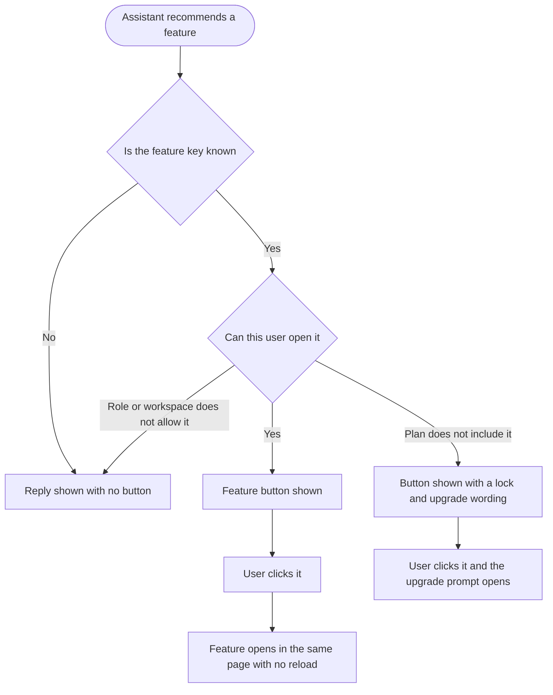

# Epic 4: Feature CTAs in AI chat

**Date:** 2026-09-11
**Stories:** 3
**Research:** `01-research.md` section 11

---

## Epic

### Title

**Feature CTAs in AI chat**

### Description

When the AI assistant tells a user that a ContentStudio feature would solve their problem, the recommendation currently dead-ends. The user has to go and find the feature themselves, which is exactly the friction the assistant was supposed to remove. The assistant should hand them a button that takes them straight there.

For that to work, the assistant needs to know what features exist and where they live. It does not today, and the one mechanism that comes close is unsafe: a reply can already carry a navigation action, and the app navigates to whatever address the model produced, without checking that the address is real or that the user's plan and role allow them in. So a recommendation can produce a dead link, or drop a user onto a screen that immediately bounces them out.

This epic gives the product a registry of its own features, has the assistant refer to them from that registry, and makes the resulting button behave properly: it opens the feature in the same page, with no reload and no new tab, and it is never offered for something the user cannot reach.

### Scope

- A registry of ContentStudio features that the assistant can draw on, so it knows which features exist and where each one lives.
- The assistant referring to features from that registry rather than inventing addresses.
- A CTA beneath a reply that opens the named feature.
- Opening the feature **in the same page, without a reload, and not in a new tab**.
- Never offering a CTA for a feature the user's plan, role or workspace does not allow.

### Out of scope

- Feature CTAs on mobile. The app already renders follow-up chips and already handles deep links, so this becomes a small follow-up once the registry exists, but it is not in this epic.
- Deep-linking into a specific record, for example one particular post or one particular report. This epic covers getting the user to the right feature.
- Changing what the assistant chooses to recommend. This epic only changes how a recommendation is delivered.

### Sequencing

The backend story leads. The frontend story cannot be built against a registry that does not exist. The design story should start first.

### Decisions taken

- **The registry lives on the backend, not in the model.** A feature that moves, gets renamed, or gets added should not require a model or prompt change to stay correct.
- **Each registry entry carries both an in-app route reference and a full URL.** The in-app route is what the CTA uses, so the feature opens without a reload. The full URL exists for any context where only a complete address works. The default user experience is always the in-app route.
- **The navigation approach is deliberately left to the engineer.** The requirement is the outcome: same page, no reload, no new tab. How to achieve that cleanly is for the implementing engineer to research and propose.

### Success measures

- No feature CTA in AI chat ever leads to a dead route.
- No feature CTA is offered for a feature the user cannot open.
- Clicking a CTA never reloads the page and never opens a new tab.

### Stories

1. **[BE] Build a feature registry so the assistant knows where to send users [Marketing Feedback]**
2. **[FE] Show feature CTAs in AI chat that open the feature without leaving the page [Marketing Feedback]**
3. **[Design] Design the AI chat feature CTA states [Marketing Feedback]**

---

## Story 1

### Title

**[BE] Build a feature registry so the assistant knows where to send users [Marketing Feedback]**

### Description

As a user who has just been told by the AI assistant that a ContentStudio feature would help, I want the assistant to be able to send me there reliably, so that the recommendation becomes something I can act on rather than something I have to go and find.

The assistant needs to know what features ContentStudio actually has and where each one lives. That knowledge should belong to the product, not to the model, so it stays correct as the product changes. This story builds that registry and makes it available both to the assistant and to the web app.

---

### Endpoints

| Endpoint | Description |
|---|---|
| **Feature registry, read** | Returns the full set of ContentStudio features the assistant may point users at. Each entry carries a stable key, the display name to show a user, the in-app route reference for opening the feature without leaving the page, the full URL for contexts where only a complete address works, and the name of the plan feature it is gated by where one exists. Consumed by the web app to render CTAs. |
| **Feature registry, for the assistant service** | The same set, in whatever form the assistant service needs in order to refer to features by key rather than inventing addresses. Exists so the list of valid keys comes from the product and not from the model. |
| **Chat send / chat fetch** | A reply may carry one or more feature keys. A key that is not in the registry is treated as absent, so a mistaken key produces a reply with no button rather than a broken one. Replies already stored that carry a raw address continue to be returned as they are today. |

---

### Workflow

The user here is a developer consuming the registry, so developer terms are used deliberately.

1. The assistant composes a reply that recommends a ContentStudio feature.
2. Instead of an address, it attaches that feature's key.
3. The registry supplies, for that key, the display name and both forms of destination: the in-app route reference and the full URL.
4. The web app resolves the key and decides whether to show a CTA, based on whether the user can actually open that feature.
5. A key that is not in the registry is ignored.

---

### Acceptance criteria

- [ ] A registry of ContentStudio features exists, owned by the product, where each entry carries a stable key, a display name, an in-app route reference, a full URL and the plan feature it is gated by where one exists
- [ ] The registry covers at least: create a post, planner, analytics overview, per-platform analytics, competitor analytics, reports, social inbox, evergreen automation, RSS automation, bulk CSV automation, Content Library, AI Content Library, content discovery, social listening, AI Studio, brand knowledge, social accounts, team, billing, content categories, approval workflows and hashtags
- [ ] The registry contains no entry for link in bio, which does not exist in the product
- [ ] Best time to post resolves to the composer rather than a destination of its own, because it is a widget inside scheduling and not a standalone screen
- [ ] Hashtags resolves to the settings screen that contains the hashtags section, since hashtags has no destination of its own
- [ ] Every entry's in-app route reference corresponds to a destination that actually exists in the web app, verified by a test that fails if an entry points at something unregistered
- [ ] Every entry's full URL resolves to the same destination as its in-app route reference
- [ ] The registry is available to the assistant service, so the assistant can be told which keys are valid rather than inventing them
- [ ] A reply carrying a feature key that is not in the registry is returned with that key treated as absent
- [ ] Adding, renaming or repointing a feature entry requires no change to the assistant's model or prompt
- [ ] Replies already stored that carry a raw address continue to be returned unchanged, so existing conversations do not break

---

### Mock-ups

N/A, backend only.

---

### Impact on existing data

None. The registry is product configuration rather than stored user data. Conversations already stored that contain raw-address navigation actions are unaffected.

---

### Impact on other products

- **Mobile app:** the registry is deliberately built so the app can consume the same keys later. Not in this epic.
- **Chrome extension:** no impact.
- **Public API:** no impact.
- **AI Studio:** in scope, same conversation engine.

---

### Dependencies

None. Independent of every other epic in this batch.

---

### Global quality & compliance (wherever applicable)

- [ ] Mobile responsiveness, N/A for this backend-only story
- [ ] Multilingual support (frontend + backend, translations available or fallback handled)
- [ ] UI theming support, N/A for this backend-only story
- [ ] White-label domains impact review
- [ ] Cross-product impact assessment (web, mobile apps, Chrome extension)

---

## Story 2

### Title

**[FE] Show feature CTAs in AI chat that open the feature without leaving the page [Marketing Feedback]**

### Description

As someone who has just been told a ContentStudio feature would help, I want a button that takes me straight there, so that I can act on the suggestion in one click instead of hunting for it.

Two things matter about how that button behaves. It must open the feature **in the same page, without a reload and without opening a new tab**, so the user keeps their place and the app does not restart around them. And it must never be offered for a feature the user cannot actually open, because a button that bounces the user straight back is worse than no button at all.

The approach for achieving in-app navigation is deliberately not specified here. The requirement is the outcome, and the implementing engineer should research and propose how best to achieve it.

---

### Workflow

1. User asks the assistant something, for example "how do I reply to comments from my customers".
2. The assistant answers and names Social Inbox as the place to do it.
3. A button labelled with the feature name appears beneath the reply.
4. User clicks it. The chat closes and Social Inbox opens in the same page, in the workspace they are already in. The page does not reload and no new tab opens.
5. If the user's plan does not include Social Inbox, the button appears with a lock and wording that makes the upgrade explicit, and clicking it opens the upgrade prompt instead of navigating.
6. If the user's role or workspace type means the feature is not available to them at all, no button appears and the reply reads as ordinary prose.

---

### Acceptance criteria

- [ ] When a reply carries a known feature key, a button for that feature appears beneath the reply
- [ ] The button label uses the feature's display name as the product defines it, so the wording matches the app's own navigation
- [ ] Clicking an available feature button opens that feature **in the same page**, with no full page reload
- [ ] Clicking an available feature button **never opens a new tab or window**
- [ ] The chat closes as the feature opens, so the destination is not obscured
- [ ] The destination always opens in the user's current workspace, and never in another workspace
- [ ] After navigating, using the browser back button returns the user to where they were, with the app still running
- [ ] A feature key that is not known produces no button, and the reply is still shown in full
- [ ] A destination that does not resolve produces no button, verified by attempting a key whose destination has been removed
- [ ] When the user's plan does not include the feature, the button is shown with a lock icon and upgrade wording, and clicking it opens the upgrade prompt rather than navigating
- [ ] When the user's role does not permit the feature, no button is shown
- [ ] When the workspace is a sample or demo workspace and the feature is not available there, no button is shown
- [ ] Whether a feature reads as available, locked or hidden matches what the app's own navigation shows for that same feature, so the chat never contradicts the sidebar
- [ ] Existing navigation actions in replies that carry a raw address are validated the same way before navigating, and one that does not resolve is not shown as a button
- [ ] A reply shows at most two feature buttons, and further keys are ignored, so a reply never becomes a wall of buttons
- [ ] Buttons appear only once the reply has finished streaming
- [ ] At mobile width buttons wrap rather than overflow, and each stays fully tappable
- [ ] Buttons render in the AI chat modal, the AI chat widget and the full-page AI Studio chat
- [ ] When the user clicks an available feature button, an `ai_chat_feature_cta_clicked` Usermaven event fires with `{ feature_key, cta_placement, allowed: true }`
- [ ] When the user clicks a locked feature button, the same `ai_chat_feature_cta_clicked` event fires with `{ feature_key, cta_placement, allowed: false }`, so the gap between what users are recommended and what their plan includes is measurable

---

### UI copy

**Available feature button**

Uses the `Button` component in its secondary variant, with the feature icon on the left and an arrow icon on the right.

> **Label:** Open [feature name], for example "Open Social Inbox"
> **Tooltip:** Go straight to [feature name].

**Locked feature button**

Uses the `Button` component in its secondary variant with a lock `Icon` on the left.

> **Label:** Unlock [feature name], for example "Unlock Social Inbox"
> **Tooltip:** [feature name] is not part of your current plan. See what is included in the higher plans.

**Group label, shown above the buttons when at least one is present**

A small label in `text-gray-500`.

> Jump to

**Error state**

> Shown as a toast if opening the feature does not work: We could not open that just now. You can find it in the sidebar under [feature name].

**Empty and loading states**

N/A. Buttons are an optional addition to an existing reply, so their absence is the normal state. While a reply is still streaming no buttons are shown, which covers the loading case.

**Component note**

> No new component is required. The locked state uses the `Button` component with an `Icon`, matching how the navigation sidebar already shows locked items. The design system has no standalone tooltip component, so tooltips here should follow the existing popover approach used elsewhere in the app.

---

### Mock-ups

See **[Design] Design the AI chat feature CTA states [Marketing Feedback]**.

---

### Impact on existing data

None. Buttons are derived at render time from the reply and the user's current access, and nothing about them is stored.

---

### Impact on other products

- **Mobile app:** out of scope for this epic and a natural follow-up, since the app already renders follow-up chips and already handles deep links.
- **Chrome extension:** no impact.
- **Public API:** no impact.
- **AI Studio:** in scope, same components.

---

### Dependencies

Depends on **[BE] Build a feature registry so the assistant knows where to send users [Marketing Feedback]**.

Design input from **[Design] Design the AI chat feature CTA states [Marketing Feedback]** should land before build starts.

---

### Global quality & compliance (wherever applicable)

- [ ] Mobile responsiveness (frontend only, N/A for backend-only stories)
- [ ] Multilingual support (frontend + backend, translations available or fallback handled)
- [ ] UI theming support (default + white-label, design library components are being used)
- [ ] White-label domains impact review
- [ ] Cross-product impact assessment (web, mobile apps, Chrome extension)

---

## Story 3

### Title

**[Design] Design the AI chat feature CTA states [Marketing Feedback]**

### Description

As the developers building this, we want an agreed treatment for the available and locked feature buttons, so that a reply carrying a CTA still reads as a conversation rather than a landing page.

The risk here is accumulation. A reply can already carry follow-up suggestion pills, and feature buttons sit in the same area. Designed separately, the two will compete. Designed together, the reply stays readable.

---

### Workflow

1. Designer reviews the copy specified in the frontend story, which is agreed and should be treated as the content to design around rather than placeholder text.
2. Designer produces the states listed below.
3. Designer reviews with product and frontend, and the agreed designs become the reference for the frontend story.

---

### Acceptance criteria

- [ ] The available feature button, shown singly and as a pair beneath a reply
- [ ] The locked feature button, and an available and a locked button shown side by side so the difference is unmistakable at a glance
- [ ] The "Jump to" group label, and the spacing between the reply text, the buttons and any follow-up suggestion pills already present, so a reply carrying both does not look crowded
- [ ] A worked example of a reply that carries prose, two feature buttons and follow-up pills together, to confirm the whole thing still reads as a conversation
- [ ] The mobile-width treatment where two buttons must wrap
- [ ] Every state uses components from the existing design system, and any genuine gap is called out explicitly rather than drawn as a one-off
- [ ] All colour use is theme-aware, with no hardcoded colours, and designs are delivered for both the default primary colour and a non-blue white-label primary colour

---

### Mock-ups

This story produces them.

---

### Impact on existing data

None.

---

### Impact on other products

- **Mobile app:** out of scope, since feature CTAs are not part of this epic on mobile.
- **Chrome extension:** no impact.

---

### Dependencies

None. Should start first in this epic, before **[FE] Show feature CTAs in AI chat that open the feature without leaving the page [Marketing Feedback]**.

---

### Global quality & compliance (wherever applicable)

- [ ] Mobile responsiveness (frontend only, N/A for backend-only stories)
- [ ] Multilingual support (frontend + backend, translations available or fallback handled)
- [ ] UI theming support (default + white-label, design library components are being used)
- [ ] White-label domains impact review
- [ ] Cross-product impact assessment (web, mobile apps, Chrome extension)
