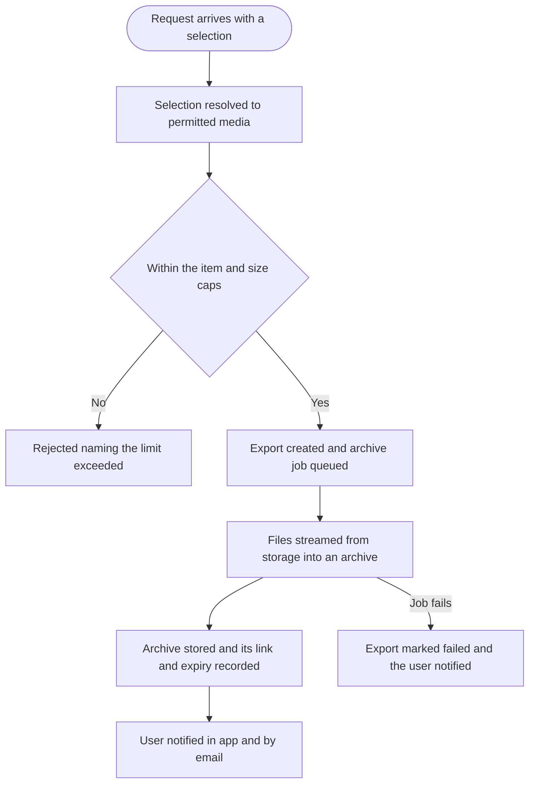
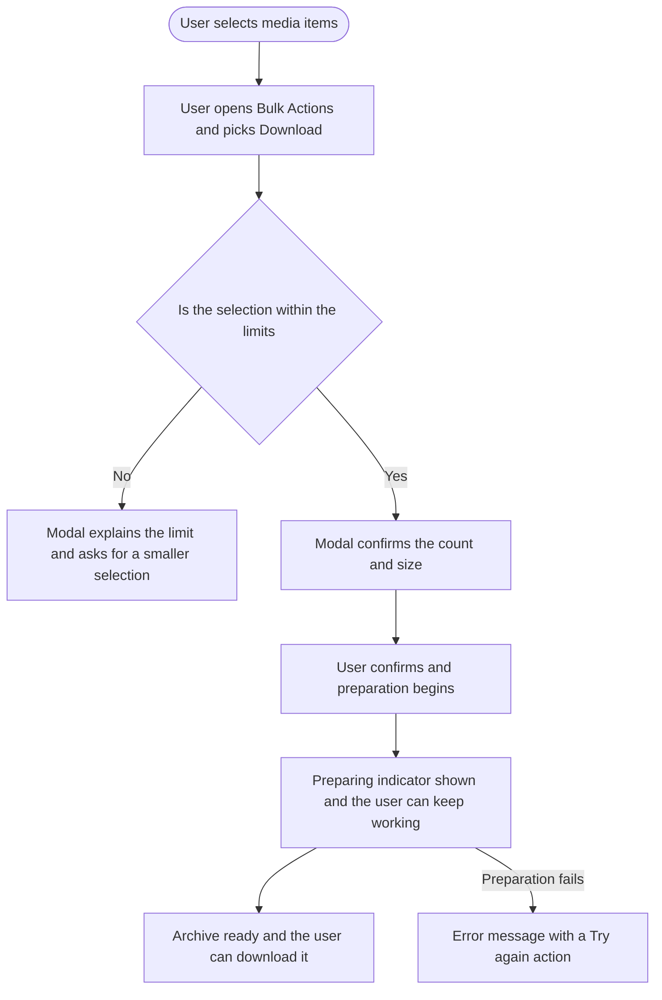

# Epic 5: Bulk media download

**Date:** 2026-09-11
**Stories:** 3
**Research:** `01-research.md` section 9

---

## Epic

### Title

**Bulk media download from the Content Library**

### Description

A user with hundreds of assets in the Content Library has no way to get them back out in bulk. They can select many items and delete, archive, move or compose with them, but the only way to download a file is to open its preview and download it on its own. For an agency handing a client their assets, that is hundreds of clicks.

The Content Library already has multi-select, a selection bar with a bulk actions menu, and select-all across pages. This epic adds Download to that menu. Because a selection can be very large and individual files can be hundreds of megabytes, the archive is assembled in the background and the user is handed a link when it is ready, rather than waiting on a request that would time out.

### Scope

- A Download option in the Content Library bulk actions menu.
- A background job that assembles the selected media into a single archive.
- Progress feedback while the archive is prepared, and a link when it is ready.
- The link also delivered by notification and email, so closing the tab does not lose it.
- Explicit item and size caps, with clear copy when a selection exceeds them.

### Out of scope

- A downloads history panel for the Content Library. The link is delivered by notification and email, matching how the existing CSV metadata export already works.
- A public API bulk export endpoint. A reasonable later addition, not part of this epic.
- Mobile. The app has no Content Library bulk selection surface, and downloading an archive is not a mobile-shaped action.
- Auditing who downloaded what. Worth considering separately, since no equivalent auditing exists today.

### Sequencing

The backend story leads. The design story is small and can run alongside it.

### Decisions taken

- **Caps of 500 items and 5 GB per archive.** Selections are resolved server-side up to a large ceiling and individual files can be very large, so without caps a single request could produce an unbounded archive. The caps are stated to the user rather than silently applied.
- **Always queued, never synchronous.** A small selection will be ready in seconds, so the user experience is still good, and there is only one code path to maintain and reason about.
- **The link expires after 7 days.** This keeps archive storage bounded rather than growing forever.

### Success measures

- A user can retrieve a multi-item selection from the Content Library in one action.
- A user who closes the tab still gets their archive.

### Stories

1. **[BE] Add a queued bulk media download export for the Content Library [Marketing Feedback]**
2. **[FE] Add Download to the Content Library bulk actions [Marketing Feedback]**
3. **[Design] Design the Content Library bulk download states [Marketing Feedback]**

---

## Story 1

### Title

**[BE] Add a queued bulk media download export for the Content Library [Marketing Feedback]**

### Description

As someone with hundreds of assets in my Content Library, I want to download a selection of them in one go, so that I can hand a client their assets or move a campaign's media without saving files one at a time.

Because a selection can run to hundreds of items and several gigabytes, this has to be a background job that assembles an archive and hands the user a link when it is ready, with caps so a single request cannot produce an unbounded archive.

---

### Endpoints

| Endpoint | Description |
|---|---|
| **Request a bulk download** | Accepts either an explicit list of media identifiers, or a select-all instruction together with the folder and filter context that was on screen, matching the shape the existing bulk remove and move actions already accept. Resolves the selection to the media the requesting user is permitted to see, applies the item and size caps, and rejects the request naming the cap and the actual selection if either is exceeded. On success, creates a pending export, queues the archive job, and returns the export identifier immediately without waiting for the archive. |
| **Get an export's status** | Returns the current state of one export by its identifier: pending, preparing, ready or failed, plus the item count, how many items were skipped, the archive link and its expiry once ready, and the failure reason if it failed. Lets the client show progress without waiting on a notification. |
| **List a user's recent exports** | Returns the user's recent bulk downloads with their state and links, so a user returning to the app can pick up an archive they requested earlier. Kept deliberately simple, since this epic builds no history panel. |
| **Completion notification and email** | On completion the user receives an in-app notification linking to the archive, and an email with the same link and its expiry. On failure the user is notified that it failed. Real-time completion follows the same channel pattern the Content Library's media import already uses, including an equivalent polling fallback, so a user whose connection drops still learns the archive is ready. |

---

### Workflow

The user here is a developer, so developer terms are used deliberately.

1. A request arrives carrying either an explicit list of media identifiers, or a select-all instruction with the folder and filter that were on screen.
2. The selection is resolved to the media items the requesting user is actually allowed to see, applying the same workspace and shared-folder rules the library listing applies.
3. Items still being processed, which have no file yet, are skipped.
4. If the resolved selection exceeds the item cap or the size cap, the request is rejected and states which limit was hit and what the selection actually was.
5. Otherwise a pending export is created, the archive job is queued, and the request returns immediately with the export identifier.
6. The job streams each file from storage into an archive, preserving folder names as directories inside it.
7. The finished archive is stored, and its link and expiry are recorded on the export.
8. The user is notified in the app and by email that the archive is ready.
9. If the job fails, the export is marked failed and the user is notified.

---

### Acceptance criteria

- [ ] A request can specify either an explicit list of media identifiers or a select-all instruction with folder and filter context, matching the shape the existing bulk remove and move actions accept
- [ ] The resolved selection contains only items the requesting user is permitted to see, applying the same workspace scoping and shared-folder permission rules as the Content Library listing
- [ ] Items in shared or global folders are excluded for a user who does not hold the shared-folder permission
- [ ] Items still processing, with no file yet, are skipped, and the number skipped is recorded on the export
- [ ] A selection of more than 500 items is rejected, and the response states the cap and the actual count
- [ ] A selection whose total size exceeds 5 GB is rejected, and the response states the cap and the actual total size
- [ ] A valid request returns immediately with an export identifier, without waiting for the archive to be built
- [ ] The archive is assembled by streaming files rather than loading them into memory, so a selection of large videos does not exhaust memory
- [ ] Folder names are preserved as directories inside the archive, and items not in a folder sit at the archive root
- [ ] Two items with the same file name do not overwrite each other inside the archive
- [ ] The archive file name identifies the workspace and the date it was created
- [ ] An export's status can be polled by its identifier and reports pending, preparing, ready or failed, with the item count, skipped count, link and expiry where applicable
- [ ] A user's recent exports can be listed with their state and links
- [ ] When the archive is ready, an in-app notification is created linking to it, and an email is sent with the same link and its expiry
- [ ] The archive link expires after 7 days, and the expiry is stated on the export, in the notification and in the email
- [ ] When the job fails, the export is marked failed and the user is notified, with no partial archive left behind
- [ ] A job retried after a failure does not produce a second archive for the same export
- [ ] The job has a timeout appropriate to a 5 GB archive and does not hold a worker indefinitely
- [ ] Requesting an export never modifies, archives or deletes any media
- [ ] A user cannot request or poll an export for a workspace they do not have access to
- [ ] When an export is requested, a `media_bulk_download_requested` Usermaven event fires server-side with `{ workspace_id, item_count, total_size_mb, scope }`, where `scope` is `selection` or `all`

---

### Mock-ups

N/A, backend only.

---

### Impact on existing data

No change to media items. Adds a new kind of export record, following the pattern already used for the library's CSV metadata export. Archives are stored alongside existing exports and removed when they expire, so storage growth is bounded by the expiry window rather than growing indefinitely.

Note that bulk reads pull files from the storage tier the Content Library uses, which carries a retrieval cost per read. A workspace repeatedly exporting large selections generates real cost, which is part of why the caps exist and is worth monitoring after release.

---

### Impact on other products

- **Mobile app:** no impact.
- **Chrome extension:** no impact.
- **Public API:** no impact in this story.
- **White-label:** the archive link is served from the storage host rather than a customer domain, so a white-label customer's users will see a non-branded link. The notification and the email follow the existing white-label branding rules. This is the one visible seam and should be confirmed as acceptable before release.

---

### Dependencies

None. Independent of every other epic in this batch.

---

### Global quality & compliance (wherever applicable)

- [ ] Mobile responsiveness, N/A for this backend-only story
- [ ] Multilingual support (frontend + backend, translations available or fallback handled)
- [ ] UI theming support, N/A for this backend-only story
- [ ] White-label domains impact review
- [ ] Cross-product impact assessment (web, mobile apps, Chrome extension)

---

## Story 2

### Title

**[FE] Add Download to the Content Library bulk actions [Marketing Feedback]**

### Description

As someone who has selected a set of assets in the Content Library, I want a Download option in the bulk actions menu, so that I can get all of them at once instead of opening each one.

Multi-select, the selection bar and select-all across pages already exist. This story adds Download to that menu, tells the user what is about to happen, and keeps them informed while the archive is prepared, because for a large selection it will not be instant.

---

### Workflow

1. User selects several assets in the Content Library, or uses select-all.
2. User opens "Bulk Actions" in the selection bar and chooses "Download".
3. A modal confirms how many items and roughly how much data will be downloaded.
4. If the selection is over the limits, the modal explains which limit was hit and asks the user to select fewer items, and offers no confirm action.
5. User confirms. The modal closes and a preparing indicator appears. The user can keep working in the app.
6. When the archive is ready the user is told and can download it. The link is also in their notifications and in an email, so closing the tab does not lose it.
7. If preparation fails, the user sees an error with a "Try again" action.

---

### Acceptance criteria

- [ ] "Download" appears in the Content Library bulk actions menu whenever at least one item is selected
- [ ] Choosing it opens a confirmation modal stating the number of selected items and their approximate total size
- [ ] When the selection exceeds 500 items or 5 GB, the modal states the limit that was hit and the actual selection, and offers no confirm action
- [ ] Confirming starts preparation, closes the modal and shows a preparing indicator
- [ ] The user can navigate elsewhere in the app while preparation runs, and is still told when the archive is ready
- [ ] When the archive is ready the user is told and can download it in one click
- [ ] The archive link also appears in the notification centre, and clicking that notification starts the download
- [ ] When preparation fails, an error message with a "Try again" action is shown, and retrying starts a fresh preparation
- [ ] Items skipped because they were still uploading are reported in the ready message, with the count
- [ ] Selecting items, downloading, and then changing section or folder does not leave a stale preparing indicator behind
- [ ] Requesting a download never changes, archives or deletes the selected media
- [ ] Select-all across pages downloads the same scope the other bulk actions apply it to, including the current folder and filters
- [ ] The existing bulk actions continue to behave exactly as they do today
- [ ] At mobile width the selection bar, the Download item and the modal are all usable, and the modal does not overflow the viewport
- [ ] When the user confirms a download, a `media_bulk_download_requested` Usermaven event fires with `{ item_count, total_size_mb, scope }`, where `scope` is `selection` or `all`, matching the spec in **[BE] Add a queued bulk media download export for the Content Library [Marketing Feedback]**

---

### UI copy

**Bulk actions menu item**

A `DropdownItem` in the existing Bulk Actions dropdown, with a download icon.

> **Label:** Download

**Confirmation modal, selection within the limits**

Uses the `Modal` component.

> **Title:** Download selected media
> **Description:** We will bundle your 128 selected files into one zip, which takes a minute or two for large selections. We will let you know here and by email as soon as it is ready.
> **Learn more:** a `?` icon next to the title, linking to the Content Library help article
> **Primary CTA:** Start download
> **Secondary CTA:** Cancel

**Confirmation modal, selection over the limits**

> **Title:** That is too much to download at once
> **Description, when the item limit is exceeded:** You have selected 640 files, and we can bundle up to 500 at a time. Select fewer files and try again.
> **Description, when the size limit is exceeded:** Your selection comes to 7.2 GB, and we can bundle up to 5 GB at a time. Select fewer files and try again.
> **Primary CTA:** not shown
> **Secondary CTA:** Close

**Preparing indicator**

Shown in the selection bar area, using the `Loader` component.

> Preparing your download...

**Ready message**

Shown as a toast with an action, and mirrored as a notification.

> **Message:** Your download is ready.
> **Action label:** Download zip
> **Message, when some items were skipped:** Your download is ready. 3 files were still uploading and are not included.
> **Notification text:** Your Content Library download is ready. The link works for the next 7 days.

**Error state**

> **Message:** We could not prepare your download. Nothing in your library has changed, so you can try again.
> **Action label:** Try again

**Empty state**

N/A. The Download action only exists while items are selected, so there is no empty variant of this surface. The Content Library's own empty states are unchanged.

**Component note**

> No new component is required. Uses `DropdownItem` in the existing bulk actions dropdown, `Modal` for confirmation, `Loader` for the preparing indicator and `Button` for the modal actions.

---

### Mock-ups

See **[Design] Design the Content Library bulk download states [Marketing Feedback]**.

---

### Impact on existing data

None. This story only reads media and requests an export.

---

### Impact on other products

- **Mobile app:** no impact.
- **Chrome extension:** no impact.
- **Public API:** no impact.

---

### Dependencies

Depends on **[BE] Add a queued bulk media download export for the Content Library [Marketing Feedback]**.

Design input from **[Design] Design the Content Library bulk download states [Marketing Feedback]** should land before build starts.

---

### Global quality & compliance (wherever applicable)

- [ ] Mobile responsiveness (frontend only, N/A for backend-only stories)
- [ ] Multilingual support (frontend + backend, translations available or fallback handled)
- [ ] UI theming support (default + white-label, design library components are being used)
- [ ] White-label domains impact review
- [ ] Cross-product impact assessment (web, mobile apps, Chrome extension)

---

## Story 3

### Title

**[Design] Design the Content Library bulk download states [Marketing Feedback]**

### Description

As the developers building this, we want an agreed treatment for the confirmation modal and the progress states, so that a user who has just selected 400 files understands what is about to happen and what to do if it is too many.

The over-limit modal is the one worth care. It is the only place in this feature where the user is told no, and it should read as helpful guidance rather than a wall.

---

### Workflow

1. Designer reviews the copy specified in the frontend story, which is agreed and should be treated as the content to design around rather than placeholder text.
2. Designer produces the states listed below.
3. Designer reviews with product and frontend, and the agreed designs become the reference for the frontend story.

---

### Acceptance criteria

- [ ] The confirmation modal in its within-limits variant, showing where the count and size appear
- [ ] The confirmation modal in both over-limit variants, item count and total size, with no confirm action
- [ ] The Download item shown in place in the existing bulk actions menu, so its position among the existing actions is deliberate
- [ ] The preparing indicator in the selection bar
- [ ] The ready message, including the variant that reports skipped items, and the failed message with its retry action
- [ ] The notification-centre entry for a ready archive
- [ ] All states shown at desktop width and at mobile width
- [ ] Every state uses components from the existing design system, and any genuine gap is called out explicitly rather than drawn as a one-off
- [ ] All colour use is theme-aware, with no hardcoded colours, and designs are delivered for both the default primary colour and a non-blue white-label primary colour

---

### Mock-ups

This story produces them.

---

### Impact on existing data

None.

---

### Impact on other products

- **Mobile app:** out of scope, since the app has no Content Library bulk selection surface.
- **Chrome extension:** no impact.

---

### Dependencies

None. Should start before **[FE] Add Download to the Content Library bulk actions [Marketing Feedback]**.

---

### Global quality & compliance (wherever applicable)

- [ ] Mobile responsiveness (frontend only, N/A for backend-only stories)
- [ ] Multilingual support (frontend + backend, translations available or fallback handled)
- [ ] UI theming support (default + white-label, design library components are being used)
- [ ] White-label domains impact review
- [ ] Cross-product impact assessment (web, mobile apps, Chrome extension)
