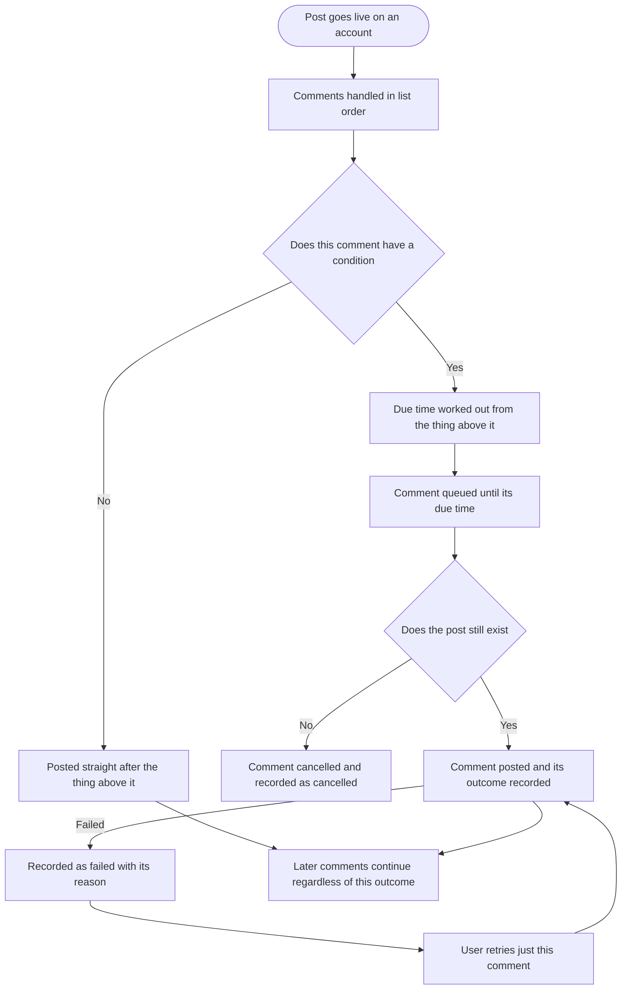
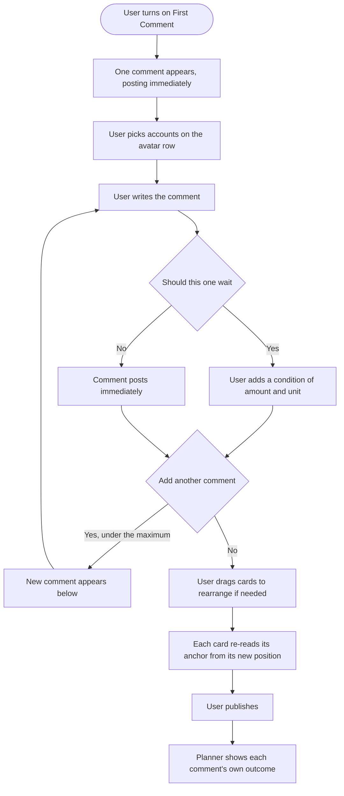

# Epic 6: Multiple first comments with scheduling

**Date:** 2026-09-11
**Stories:** 4
**Research:** `01-research.md` section 7
**Prototype:** interactive composer prototype, reviewed and approved

---

## Epic

### Title

**Multiple first comments with scheduling**

### Description

A first comment today is a single message. A user who wants to put a link in one comment and a call to action in another, or who wants a follow-up comment to land a few hours after the post while it still has momentum, cannot do either. They get one comment, posted immediately, with the same text on every account they picked.

This epic makes a post carry several comments, each with its own text and its own condition. A comment with no condition posts immediately, as it does today. A comment with a condition waits, and that condition is always measured against the thing directly above it: the post itself for the first comment, the comment above for every other one. Because the timing is relative to position rather than absolute, reordering the list can never make it contradict itself, and the list is always the order things actually happen in.

The waiting is the part that does not exist in any form today. Every first comment in ContentStudio, and every threaded post chain, fires back to back inside a single synchronous publish call. Delayed comments need a queued job, a status per comment rather than one status for the whole post, and, for the first time, a way to retry one comment on its own without republishing the post.

### Scope

- A post can carry several first comments, each with its own text.
- Each comment optionally carries a condition, expressed as an operator, a value and a unit, measured from the post for the first comment and from the comment above for the rest.
- A comment with no condition posts immediately after the thing above it.
- One account selection applies to every comment on the post, using the avatar row that already exists.
- Reordering by dragging. When a comment moves, its own value and unit travel with it and its anchor is re-read from its new position.
- Duplicating a comment, copying its text and its condition.
- A status per comment, surfaced in the planner and in post previews, with a retry that reposts only the failed comment.
- The five platforms that already support first comments: Facebook Pages, Instagram when posting through the API, LinkedIn, YouTube for public non-kids videos, and Telegram.
- Full parity in the Flutter app, including fixing the account-selection gap that exists there today.

### Out of scope

- **Per-platform or per-account comment text.** Decided against. One account selection covers all comments.
- **Engagement-triggered conditions**, for example a comment that posts once the post reaches 100 likes. Nothing in ContentStudio polls post engagement for publishing decisions, so this is a separate subsystem. The condition operator is built as a dropdown so such an operator could be added later without a redesign.
- **New platforms.** X, Threads and Bluesky have no first-comment support at all, and their threaded replies are a different user concept.
- **Multi-comment in automations.** Evergreen, RSS and bulk CSV automations keep a single comment in this release. The stored shape stays backward compatible so they keep working untouched.
- **Move-up and move-down controls.** Reordering is drag only.

### Decisions taken

- **Conditions are relative to the thing above.** Comment one is measured from the post. Every other comment is measured from the comment above it. A worked example: comment one set to 10 minutes, comment two set to 10 hours. Swap them and the first now reads 10 hours after the post, the second 10 minutes after the previous comment. The value stays with its comment, the anchor comes from the position.
- **No condition means immediately.** Removing a condition is how a user says "post this right away", which keeps today's behavior available and makes it the default for a new comment.
- **The condition is an operator, a value and a unit**, matching the condition pattern used elsewhere in the product, with a remove control. The only operator in this release is "is older than". Units are minutes, hours and days.
- **Each comment is an independent top-level comment on the post**, not a reply to the comment above it. The comment above is only the timing anchor. So a comment that fails does not stop the ones after it, unlike threaded posting where a broken link stops the chain.
- **A delay is measured from when the post actually went live** on that account, not from its scheduled time. The two diverge whenever publishing runs late or is retried.
- **Reordering is drag only.** No move-up and move-down buttons.
- **Duplicating copies the text and the condition**, and places the copy directly below the original.
- **No warning banners in the section.** Specifically: no banner listing which accounts will receive the comments, no banner explaining which platform is setting the character limit, and no ordering warning. The character counter on each comment carries the limit on its own.
- **The cap is configuration, not a constant**, so it can move without a release.

### Open for confirmation

- **The cap: 3 is committed, 5 is wanted if nothing technical blocks it.** Three needs no sign-off and covers a link, a call to action and one later bump. Five is preferred if it is safe. This needs a technical lead's read, because the cap multiplies by selected accounts: a workspace with 17 accounts connected means 51 comment calls behind one publish at three, and 85 at five. The specific questions to answer:
  1. Do any of the five networks rate limit comment creation tightly enough that five per account per post risks throttling, and does that change when one publish fans out across 17 accounts?
  2. With a queued job per pending comment per account, does the job count become the constraint before the API does?
  3. Is there a per-post storage or payload limit that five comments plus per-account per-comment status would push against?
  4. Does anything treat a published post as finished in a way that breaks when it has up to five pending comments against it?

  If all four come back clear, ship five. Either way the cap stays configuration.
- **Whether the days unit should be capped.** Because conditions are relative, delays accumulate: three chained comments at a day each puts the last one three days out. A user could push a comment much further than they intended.
- **Whether a duplicated comment should reset to immediately** rather than inheriting the original's condition. Inheriting is specced, because that is what duplicate means everywhere else.
- **The proposed mobile scope and workflow**, written into the Flutter story.
- **Whether automations get multi-comment** in a later release.

### Sequencing

The backend story leads and everything depends on it. The design story should start first, in parallel with backend work. The frontend and Flutter stories follow, with the frontend one ideally slightly ahead so the two surfaces can be compared.

One ordering note that matters: the Flutter story contains a data-loss fix that exists today, independent of this feature. The mobile composer drops the first comment account selection when it loads a saved post, so once web users can build multi-comment setups, a user editing that post in the app destroys them. Either ship the Flutter story alongside the frontend one, or pull its account-selection and post-loading fixes forward on their own.

### Success measures

- A user can add three comments to a post, have the first land immediately and the third land hours later, and see each one's outcome separately.
- A user can drag a comment to a new position and the timing reads correctly without any warning or corrective action.
- A user whose second comment failed can retry that comment without republishing the post.
- A user who sets comments up on web and then opens the post in the app does not lose them.

### Stories

1. **[BE] Store, schedule and publish multiple first comments per post [Marketing Feedback]**
2. **[FE] Build the multiple first comments experience across composer, previews and planner [Marketing Feedback]**
3. **[Flutter] Bring multiple first comments to the mobile composer [Marketing Feedback]**
4. **[Design] Design the multiple first comments surfaces [Marketing Feedback]**

---

## Story 1

### Title

**[BE] Store, schedule and publish multiple first comments per post [Marketing Feedback]**

### Description

As someone who wants more than one comment under my post, and wants one of them to arrive later rather than immediately, I want ContentStudio to store all of them, post each one at the right moment, and tell me what happened to each, so that a single failed or pending comment neither disappears silently nor forces me to republish the post.

This story covers the whole backend of the feature: the stored shape, the relative condition model, publishing immediate comments inline as today, queueing the ones that wait, recording an outcome per comment, letting a single comment be retried, cancelling pending comments when their post goes away, and exposing all of it through the public API.

It also consolidates the existing first comment logic first. The same normalization currently exists in five separate copies, one per supported platform, and one of those copies has already drifted and carries settings the others do not. Extending five divergent copies to handle a list and a schedule would multiply both the work and the drift, so the consolidation is the first piece of work inside this story rather than an afterthought.

---

### Endpoints

| Endpoint | Description |
|---|---|
| **Post create and post update**, internal | Accept an ordered list of comments, each with its text and an optional condition of operator, value and unit. Accept at most the configured maximum and reject more, naming the limit. Reject an empty or whitespace-only comment, and reject a condition value below one or a unit outside minutes, hours and days. Continue to accept today's single-comment shape unchanged, so older clients and the automation paths keep working. |
| **Post read**, internal | Return the ordered list of comments with, for each, its text, its condition, its state, the time it is due, the time it was actually posted, and its failure reason where it failed. A post saved with today's single-comment shape is returned as a list of one, so clients handle a single shape. |
| **Retry a single comment** | Takes a post, an account and a comment, and reposts only that comment. Leaves the post and every other comment untouched. Rejects a retry for a comment that is already published, and rejects a retry on a post that is not published. |
| **Cancel pending comments**, internal | When a published post is deleted, or a comment is removed from it by an edit, any of its comments not yet posted are cancelled so they never fire against a post that is gone. |
| **Create and update a post**, public API | In addition to today's single-comment object, accept a list of comments with the same text and condition shape and the same validation. Reject a request that supplies both forms. |
| **Read a post**, public API | Return comments as a list with text, condition, state, posted time and failure reason. A post created with the single-comment object form is returned as a list of one. |
| **Retry a comment**, public API | Reposts a single failed comment on a published post, for parity with the app. |

---

### Workflow

1. A post goes live on one of the selected accounts.
2. Comments are handled in list order. A comment with no condition is posted straight away, after whatever sits above it.
3. A comment with a condition has its due time worked out from the thing above it: from the moment the post went live for the first comment, and from the moment the comment above it was posted for the rest.
4. Comments that must wait are queued until their due time.
5. When a comment's due time arrives it is posted and its outcome recorded against that account.
6. If the post has been deleted in the meantime, the comment is cancelled rather than posted.
7. If a comment fails, the failure and its reason are recorded, every later comment continues regardless, and the user can retry that one comment.
8. Retrying reposts only that comment, leaving the post and all other comments untouched.

---

### Acceptance criteria

**Consolidation, first**

- [ ] There is one path that reads a post's first comment settings and decides, per account, which comments that account gets and what text each carries, used by all five supported platforms
- [ ] The extra settings currently supported by only one platform are either supported everywhere or removed, and which was chosen is recorded in the pull request
- [ ] Per-platform eligibility is unchanged: Facebook Pages only with Groups excluded, Instagram only when posting through the API, YouTube only for public non-kids videos, LinkedIn and Telegram unconditional
- [ ] Publishing a post with a single immediate comment produces an identical result on all five platforms before and after this story, verified by tests covering each platform

**Storage and shape**

- [ ] A post stores an ordered list of first comments, each with its own text and an optional condition of operator, value and unit
- [ ] The only operator accepted in this release is "is older than", and the accepted units are minutes, hours and days
- [ ] A condition value below one is rejected, and a value or unit outside the accepted set is rejected
- [ ] A comment with no condition is stored as having none, and means "post immediately after the thing above it"
- [ ] The account selection is stored once for the post and applies to every comment
- [ ] More than the configured maximum number of comments is rejected, naming the limit and the number supplied
- [ ] An empty or whitespace-only comment is rejected
- [ ] The maximum is configuration rather than a constant, and changing it does not require a release
- [ ] A post saved with today's single-comment shape publishes correctly with no migration, and is returned as a list of one when read

**Relative conditions**

- [ ] A comment's condition is measured against the item directly above it in the list: the post for the first comment, the comment above for every other
- [ ] Reordering the list changes no stored value or unit, only positions, so each comment's anchor is re-derived from where it now sits
- [ ] Worked example, as a test: comment one at 10 minutes and comment two at 10 hours, reordered, results in the first being due 10 hours after the post and the second 10 minutes after the comment above it
- [ ] Due times accumulate down the list, so a comment's absolute due time is the sum of every condition above it plus its own
- [ ] A delayed comment's due time is calculated from when the post actually went live on that account, not from the post's scheduled time, verified by a test with a deliberately late publish

**Publishing and state**

- [ ] Comments are posted in list order on every selected account
- [ ] Every comment attaches to the post itself, not as a reply to the comment above it
- [ ] Each comment carries its own state per account: pending, scheduled, published, failed or cancelled, with the time it was posted and its failure reason where applicable
- [ ] A comment that fails does not prevent any later comment from being posted
- [ ] A comment that fails does not fail the post, which stays published, matching today's behavior
- [ ] A queued comment is posted exactly once, even if its job runs more than once
- [ ] A comment that cannot be posted within 24 hours of its due time is marked failed with a timeout reason, so nothing stays queued indefinitely
- [ ] Deleting a published post cancels its not-yet-posted comments, recorded as cancelled rather than failed
- [ ] Removing a comment from a post by editing it cancels that comment if it has not yet been posted
- [ ] Editing a scheduled post's comments before it publishes updates what will be used, with no orphaned schedule left behind
- [ ] The existing aggregated post-level comment status still reflects the whole set so existing planner filters keep working, and accounts for comments that are still scheduled so a post with one pending is neither fully published nor failed

**Retry**

- [ ] A single comment can be retried on its own, reposting only that comment
- [ ] Retrying a comment that is already published is rejected
- [ ] Retrying a comment on a post that is not published is rejected

**Validation that spans the post**

- [ ] Instagram's limit of 30 unique hashtags counts the caption and every comment together, and a post exceeding it is rejected with a message naming the count
- [ ] The comment character limit applied is the lowest across the selected accounts, matching what the composer applies, so the same content is accepted in both places

**Public API**

- [ ] Creating or updating a post accepts a list of comments with the same shape and validation as the internal path
- [ ] Today's single-comment object form still works with identical behavior and no change required of existing integrations
- [ ] A request supplying both the object form and the list form is rejected, explaining that only one may be used
- [ ] Reading a post returns comments as a list, and a post created with the object form is returned as a list of one
- [ ] A single failed comment can be retried through the API
- [ ] The API reference documents the list form, the condition shape, the maximum and the per-comment states
- [ ] Existing API integration tests for the single-comment form pass unchanged

**Automations and events**

- [ ] Evergreen, RSS and bulk CSV automations continue to publish their single comment correctly, unchanged
- [ ] When a post with more than one comment publishes, a `first_comments_published` Usermaven event fires server-side with `{ workspace_id, comment_count, platform_count }`
- [ ] When a delayed comment is posted, a `first_comment_delayed_published` Usermaven event fires server-side with `{ workspace_id, delay_minutes, platform }`
- [ ] When a single comment is retried, a `first_comment_retried` Usermaven event fires server-side with `{ workspace_id, platform, outcome }`

---

### Mock-ups

N/A, backend only.

---

### Impact on existing data

The stored shape changes from a single comment message to an ordered list, and gains an optional condition and a per-comment state. **No migration is required**, and that is deliberate: reads accept both shapes and normalize the old one to a list of one on the way out, so scheduled posts already sitting in the queue publish correctly without being touched. Per-comment outcomes are added alongside the existing aggregated status rather than replacing it, so existing planner filters and counts keep working.

One behavior change does affect newly stored data. Assistant-side aside, this feature introduces the first case in ContentStudio where a post is fully published but still has work pending against it. Anything that treats a published post as finished needs checking against that, in particular post deletion, which now has to cancel pending comments, and any reporting that counts a post as complete.

---

### Impact on other products

- **Mobile app:** the app will receive a list where it currently expects a single message, plus conditions and per-comment state, and must tolerate all of it. Until the Flutter story lands, a user editing a multi-comment post in the app could save it back with only one comment. This is the most important cross-product risk in the epic.
- **Chrome extension:** no impact, it does not set first comments.
- **Public API:** additive only. Every existing integration keeps working with no change.
- **Public CLI, agent skills and MCP tools:** these sit on the public API, so multiple comments become available to them once this ships. Worth checking whether any of them describe first comment as a single message.
- **Automations:** unchanged, single comment preserved.
- **Analytics:** a delayed comment posts after the post's own analytics collection has begun. Worth confirming nothing assumes a post's engagement is settled at publish time.

---

### Dependencies

None. This story leads the epic and the other three depend on it.

---

### Global quality & compliance (wherever applicable)

- [ ] Mobile responsiveness, N/A for this backend-only story
- [ ] Multilingual support (frontend + backend, translations available or fallback handled)
- [ ] UI theming support, N/A for this backend-only story
- [ ] White-label domains impact review
- [ ] Cross-product impact assessment (web, mobile apps, Chrome extension)

---

## Story 2

### Title

**[FE] Build the multiple first comments experience across composer, previews and planner [Marketing Feedback]**

### Description

As someone writing a post, I want to add more than one comment, choose when each one goes out, rearrange them by dragging, and afterwards see what happened to each one, so that I can put a link in one comment and a call to action in another, have a follow-up land later, and know it all worked.

This story covers every web surface the feature touches. In the **composer**, the First Comment section becomes a list of comments, each with its own text and its own optional condition. In the **post previews**, the comments appear beneath the post with their timing. In the **planner**, each comment reports its own outcome and a failed one can be retried on its own, which the product has never been able to do.

The condition on each comment is measured against the thing directly above it: the post for the first comment, the comment above for every other. That is what makes dragging safe. When a comment moves, its value and unit travel with it and its label re-reads itself, so the list can never end up claiming an order that is not what will happen. There is no ordering warning to show, because there is no contradiction to have.

---

### Workflow

1. User writes a post and turns on "First Comment". One empty comment appears, set to post immediately.
2. User picks which of their eligible accounts should receive the comments, on the avatar row that already exists.
3. User writes the first comment. A counter shows characters used and the limit that applies.
4. User clicks "Add another comment". A second card appears below, also set to post immediately.
5. User writes the second comment and adds a condition to it: is older than, 2, hours. The card now says it will post if the previous comment is older than two hours.
6. User drags the second card above the first. Its label changes to read against the post instead of the previous comment, and the first card now reads against the previous comment. Nothing else changes and no warning appears.
7. User duplicates a comment to write a near-identical one, then edits a detail.
8. User checks the post preview and sees the comments beneath the post, each with its timing.
9. User publishes. Later, in the planner, they open the post and see each comment's outcome separately.
10. One comment failed. The user clicks "Retry" on that comment and only that comment is reposted.

---

### Acceptance criteria

**The comment list in the composer**

- [ ] Turning on First Comment shows one comment card, with no condition, matching today's starting state
- [ ] "Add another comment" adds a card below the last one, up to the configured maximum
- [ ] At the maximum the add action is disabled and explains why on hover
- [ ] Each card shows its position, a pill summarising its timing, and its own text field
- [ ] The pill reads "Immediately" when the comment has no condition, and the amount and unit when it does
- [ ] A card can be collapsed to a single row showing its position, its timing pill and the start of its text
- [ ] A card can be removed, and removing the last remaining card turns the section off
- [ ] Duplicating a card copies its text and its condition and places the copy directly below the original
- [ ] Duplicating is disabled at the maximum, with the same wording as the add action
- [ ] The account avatar row keeps its current position and behaviour, including "Select all" and "None", and applies to every comment
- [ ] Facebook Groups are not offered in the avatar row, since comments only work on Pages
- [ ] Each card shows a character counter with characters used and the limit that applies, and the limit is the lowest across the selected accounts
- [ ] The counter shows an over-limit state when the text is too long
- [ ] Changing the selected accounts recalculates the limit on every card immediately
- [ ] **No banner is shown listing which accounts will receive the comments**
- [ ] **No banner is shown explaining which platform is setting the character limit**
- [ ] The per-comment toolbar actions that exist today, being emoji, link shortening and hashtags, work on each comment independently

**Conditions**

- [ ] A comment with no condition shows that it posts immediately after the thing above it, plus an action to add a condition
- [ ] Adding a condition shows a row containing an operator control, an amount field and a unit control, plus a control to remove the condition
- [ ] The operator control offers "Is older than"
- [ ] The unit control offers Minutes, Hours and Days
- [ ] The amount field accepts whole numbers of one or more, and a value below one or a non-numeric entry is rejected and reverts rather than being saved
- [ ] The label above the condition row names the anchor: the post for the first comment, the previous comment for every other
- [ ] Removing a condition returns that comment to posting immediately, and the pill updates
- [ ] A new comment is created with no condition

**Dragging and anchors**

- [ ] Comments can be reordered by dragging a handle on the card
- [ ] **There are no move-up or move-down buttons**
- [ ] Dragging shows which position the card will land in before the drop
- [ ] When a card moves, its own amount and unit are unchanged and only its anchor label changes
- [ ] Worked example: comment one at 10 minutes and comment two at 10 hours, dragged to swap, results in the top card reading 10 hours after the post and the second reading 10 minutes after the previous comment
- [ ] **No ordering warning and no sort action appear at any point**, because the list is always the order comments will post in
- [ ] Dragging is usable at mobile width, and reordering remains possible there by some means

**Validation on publish**

- [ ] Publishing with an empty or whitespace-only comment is blocked, naming which comment is empty
- [ ] Publishing with a comment over the character limit is blocked, naming which comment and by how much
- [ ] Publishing with comments turned on but no accounts selected is blocked
- [ ] When the selected accounts include Instagram, the hashtag count combines the caption and every comment, and publishing is blocked when the combined unique count exceeds 30, naming the count
- [ ] Deselecting every eligible account turns the section off, matching today's behavior
- [ ] The section is gated by the existing first comment plan feature, with the existing upgrade treatment

**Post previews**

- [ ] The preview shows each comment beneath the post, in list order
- [ ] A comment with a condition is labelled in the preview with its timing
- [ ] A post with one immediate comment previews exactly as it does today

**Planner**

- [ ] A published post's details list each comment in order, with its text
- [ ] Each comment shows its outcome per account: posted, waiting to post, failed or cancelled
- [ ] A posted comment shows the time it was posted, and a waiting comment shows when it is due
- [ ] A failed comment shows its reason in plain language and offers a "Retry" action
- [ ] Retrying reposts only that comment, never the post and never another comment
- [ ] While a retry is in flight the action shows a loading state and cannot be triggered twice
- [ ] A successful retry updates that comment to posted without a page reload, and a failed retry shows the new reason
- [ ] A published post with a failed comment still reads as published
- [ ] A post with a comment still waiting is not shown as fully complete
- [ ] The existing planner comment-status filter keeps working, and its label distinguishes first comment failures from threaded post failures rather than combining them as it does today
- [ ] Posts published before this epic show their existing combined status with no error and no empty list

**Loading, saving and events**

- [ ] Opening a saved post loads every comment in order with its condition intact
- [ ] Opening a post with one comment shows a single comment with no visual change from today
- [ ] While a saved post loads, the comment list shows the existing composer skeleton treatment sized to the number of comments
- [ ] When a post is submitted with comments configured, a `first_comments_configured` Usermaven event fires with `{ comment_count, has_condition, platform_count }`
- [ ] When a user retries a comment, a `first_comment_retried` Usermaven event fires with `{ platform, outcome }`, matching the server-side spec in **[BE] Store, schedule and publish multiple first comments per post [Marketing Feedback]**

---

### UI copy

**Section header**, unchanged from today apart from the info text

> **Label:** First Comment
> **Info icon content:** Add comments that post on your post automatically. Great for links, credits, or a call to action you do not want in the caption. Available for Facebook Pages, Instagram, LinkedIn, YouTube and Telegram.

**Comment card**

> **Position label:** Comment 1, Comment 2, and so on, renumbering when a comment is moved, duplicated or removed
> **Timing pill, no condition:** Immediately
> **Timing pill, with a condition:** +10m, +2h, +1d, following the amount and unit
> **Text field placeholder, first comment:** Add your comment. For example: Full recipe is on our site, link below!
> **Text field placeholder, later comments:** Add another comment
> **Drag handle tooltip:** Drag to reorder
> **Duplicate tooltip:** Duplicate this comment
> **Duplicate tooltip when at the maximum:** You can add up to 3 comments to a post.
> **Collapse tooltip:** Collapse
> **Expand tooltip:** Expand
> **Remove tooltip:** Remove this comment

**Character counter**

> **Normal:** 1,180 / 1,250
> **Over the limit:** the same figures with the count highlighted. No explanatory banner.

**Condition, when none is set**

> **Text, first comment:** Posts immediately after the post
> **Text, later comments:** Posts immediately after the previous comment
> **Action:** + Add condition

**Condition, when one is set**

> **Label above the row, first comment:** Add comment if the **post**
> **Label above the row, later comments:** Add comment if the **previous comment**
> **Operator control:** Is older than
> **Amount field:** a whole number, for example 10
> **Unit control:** Minutes, Hours, Days
> **Remove control tooltip:** Remove condition and post immediately
> **Helper text beside the row:** counted from when the post actually goes live

**Add another comment**

> **Label:** Add another comment
> **Label at the maximum:** Maximum of 3 comments reached
> **Tooltip at the maximum:** You can add up to 3 comments to a post.
> **Count beneath the action:** 2 of 3 comments used

**Validation messages, shown when the user tries to publish**

> **Empty comment:** Comment 2 is empty. Add some text or remove it.
> **Over the limit:** Comment 2 is too long. Shorten it by 60 characters.
> **No accounts selected:** Choose at least one account to post your comments to.
> **Instagram hashtag limit:** Instagram allows 30 hashtags per post. Your caption and comments use 34 together, so remove 4.

**Post preview timing label**

> Posts 2 hours after the post
> Posts 2 hours after the previous comment

**Planner, comment outcomes**

> **Section heading:** Comments
> **Posted:** Posted at 10:42
> **Waiting:** Posts at 12:15
> **Failed:** Failed
> **Cancelled:** Not posted, the post was deleted

**Planner, failure reasons in plain language**

> **Permission or token problem:** We could not post this comment because ContentStudio no longer has permission to comment on this account. Reconnect the account and try again.
> **Rate limited:** [Platform name] is temporarily limiting how often we can comment. Try again in a few minutes.
> **Content rejected:** [Platform name] rejected this comment. Check for anything that might breach their rules, then edit and try again.
> **Timed out:** We could not post this comment in time. You can try again now.
> **Anything else:** We could not post this comment. Try again, and contact support if it keeps failing.

**Planner, retry**

> **Label:** Retry
> **Tooltip:** Post just this comment again. Your post and your other comments are not affected.
> **In flight:** Retrying...
> **Success toast:** Comment posted.
> **Failure toast:** We still could not post that comment.

**Planner, empty and error states**

> **No comments on the post:** No comments were added to this post.
> **Comments could not be loaded:** We could not load this post's comments. Refresh to try again.

**Composer error state**

> Shown as a toast if the post fails to save: We could not save your post. Your comments have been kept, so you can try again.

**Component notes**

> Uses `Textarea` for each comment, `Dropdown` with `DropdownItem` for the operator and unit controls, `TextInput` for the amount, `Button` in `ghost` variant for "Add another comment", `ActionIcon` for the drag handle, duplicate, collapse and remove controls, and `Badge` for the planner status labels.
>
> **Flagged gap:** there is no drag-and-drop list primitive in `@contentstudio/ui`. Reordering is drag only, by decision, so this needs either a small addition to the library or a self-contained implementation in the composer. Either way it should be agreed before build rather than improvised, and at mobile width it needs a reordering path that does not depend on a mouse drag.
>
> The design system has no standalone tooltip component, so tooltips here should follow the existing popover approach used elsewhere in the app.

---

### Mock-ups

See **[Design] Design the multiple first comments surfaces [Marketing Feedback]**. An approved interactive prototype of the composer section exists and is the reference for the list, the condition row, the drag behaviour and the copy above.

---

### Impact on existing data

None from the frontend. The stored shape is handled by **[BE] Store, schedule and publish multiple first comments per post [Marketing Feedback]**.

---

### Impact on other products

- **Mobile app:** a user who builds a multi-comment setup here and then edits the post in the app must not lose it. That is covered by **[Flutter] Bring multiple first comments to the mobile composer [Marketing Feedback]**, which should ship alongside this story or have its account-selection and post-loading fixes pulled forward.
- **Chrome extension:** no impact.
- **Public API:** no impact from this story.
- **Automations:** the evergreen, RSS and bulk CSV composers keep their existing single-comment interface in this release and should be confirmed visually unaffected.

---

### Dependencies

Depends on **[BE] Store, schedule and publish multiple first comments per post [Marketing Feedback]**.

Design input from **[Design] Design the multiple first comments surfaces [Marketing Feedback]** should land before build starts.

---

### Global quality & compliance (wherever applicable)

- [ ] Mobile responsiveness (frontend only, N/A for backend-only stories)
- [ ] Multilingual support (frontend + backend, translations available or fallback handled)
- [ ] UI theming support (default + white-label, design library components are being used)
- [ ] White-label domains impact review
- [ ] Cross-product impact assessment (web, mobile apps, Chrome extension)

---

## Story 3

### Title

**[Flutter] Bring multiple first comments to the mobile composer [Marketing Feedback]**

### Description

As someone who composes posts on my phone, I want to add more than one comment and choose when each goes out, so that I can do on mobile what I can do on the web. And as someone who sets a post up on my laptop and then opens it in the app, I want my comment setup kept exactly as I left it.

The second half of that is the urgent part, and it is a defect that exists today. The mobile composer has no first comment account picker, so it sends the comment to every eligible account regardless of what was chosen on web. And when it loads a saved post it drops the account selection entirely, so saving that post back overwrites the user's choice. Once a post can carry several comments with conditions, a user who opens that post on their phone to fix a typo destroys the whole setup.

**Proposed scope and workflow, for sign-off.** Mobile is a small screen and first comment there is a bottom sheet, so this is not a direct copy of the web layout:

- Fix the account selection and post loading first, as a self-contained piece that can ship on its own merit. Until the list editor exists, a post with several comments is loaded and shown read-only, and saving the post leaves it intact.
- Bring eligibility in line with web: add YouTube and Telegram, which the app does not offer today, and stop offering Facebook Groups, which it incorrectly does.
- The comment list lives in the existing bottom sheet as a vertical list of cards, one per comment, with the account picker at the top above the list so it reads as applying to everything below.
- Conditions use the same operator, amount and unit controls as web, with the platform's native pickers for the unit.
- Reordering is drag within the sheet. If drag inside a scrolling sheet proves unreliable on either platform, that is the one place where an explicit reorder affordance may differ from web, and it should be raised rather than worked around silently.
- A summary row on the composer screen shows how many comments are set and whether any of them wait, so the state is visible without opening the sheet.

---

### Workflow

1. User opens a post they created on the web, which has three comments and a condition on the third.
2. The app shows all three comments, in order, with their conditions and the accounts they are set to go to.
3. User edits the caption and saves. Every comment, condition and account selection is untouched.
4. In a new post, the user opens first comment. The sheet opens with the account picker at the top and one empty comment below, set to post immediately.
5. User picks the accounts, writes the comment, and taps "Add another comment".
6. User writes the second comment and adds a condition to it: is older than, 2, hours.
7. User drags the second card above the first. Its label re-reads against the post, and the other card re-reads against the previous comment.
8. User closes the sheet. The composer screen shows that three comments are set and one waits.
9. User publishes. The comments go out on the selected accounts, in order, each at its own time.

---

### Acceptance criteria

**The existing gaps, fixed first**

- [ ] The mobile composer offers an account picker for first comment, so the user chooses which eligible accounts receive the comments
- [ ] A new post sends only the accounts the user picked, not every eligible account
- [ ] Loading a saved post preserves its account selection and shows it in the picker
- [ ] Saving a loaded post does not change its account selection unless the user changed it
- [ ] Regression check: a post set up on web for two of five accounts, opened in the app, edited and saved, still has exactly those two accounts
- [ ] Regression check: a post with three comments and a condition, opened in the app, edited and saved, still has all three comments and the condition
- [ ] Eligibility matches web: Facebook Pages with Groups excluded, Instagram only when posting through the API, LinkedIn, YouTube for public non-kids videos, and Telegram
- [ ] YouTube and Telegram accounts, which the app does not offer today, are offered where eligible
- [ ] Facebook Groups, which the app incorrectly offers today, are no longer offered
- [ ] Before the list editor exists, a post with several comments is shown read-only with a note, and saving leaves it intact

**The comment list**

- [ ] The sheet supports a list of comments up to the configured maximum, each with its own text field
- [ ] At the maximum the add action is disabled and explains why
- [ ] Each card shows its position and a pill summarising its timing
- [ ] A new comment is created with no condition, posting immediately
- [ ] A card can be duplicated, copying its text and its condition, with the copy placed directly below
- [ ] A card can be removed, and removing the last one turns first comment off
- [ ] Cards can be reordered by dragging, and the list is the order comments post in
- [ ] When a card moves, its amount and unit are unchanged and only its anchor label changes
- [ ] The account picker sits above the list and applies to every comment
- [ ] Each card shows a character counter with the limit that applies, being the lowest across the selected accounts, with no explanatory banner

**Conditions**

- [ ] A comment with no condition shows that it posts immediately after the thing above it, plus an action to add a condition
- [ ] A condition is entered as an operator, an amount and a unit, using the platform's native pickers for the unit
- [ ] The operator offers "Is older than" and the unit offers Minutes, Hours and Days
- [ ] The amount accepts whole numbers of one or more, and an invalid entry reverts rather than being saved
- [ ] The label names the anchor: the post for the first comment, the previous comment for every other
- [ ] Removing a condition returns the comment to posting immediately

**Composer screen and validation**

- [ ] The composer screen shows a summary of how many comments are set and whether any of them wait
- [ ] Saving the sheet is blocked when a comment is empty, naming which one
- [ ] Saving the sheet is blocked when a comment is over its limit, naming which one and by how much
- [ ] Publishing is blocked when comments are on but no accounts are selected
- [ ] When the selected accounts include Instagram, the combined hashtag count across the caption and all comments is enforced at 30, naming the count
- [ ] The existing first comment plan gate still applies

**Platform behaviour**

- [ ] The sheet stays usable on a small phone screen with the keyboard open, and the list scrolls without the account picker or the action buttons becoming unreachable
- [ ] Behaviour is verified on both iOS and Android, including the native unit pickers and the drag interaction inside the scrolling sheet on each
- [ ] When a post is submitted with comments configured, a `first_comments_configured` Usermaven event fires with `{ comment_count, has_condition, platform_count }`, matching the web spec

---

### UI copy

Copy matches the web story wherever the two surfaces show the same thing.

> **Sheet title:** First Comment
> **Account picker label:** Post comments to
> **Account picker helper text:** Choose which accounts should get these comments. Only accounts that support comments are listed.
> **No eligible accounts:** None of the accounts on this post support comments.
> **Comment card position label:** Comment 1, Comment 2, and so on
> **Timing pill:** Immediately, or +10m, +2h, +1d
> **Text field placeholder, first comment:** Add your comment. For example: Full recipe is on our site, link below!
> **Text field placeholder, later comments:** Add another comment
> **No condition, first comment:** Posts immediately after the post
> **No condition, later comments:** Posts immediately after the previous comment
> **Add condition action:** Add condition
> **Condition label, first comment:** Add comment if the post
> **Condition label, later comments:** Add comment if the previous comment
> **Operator:** Is older than
> **Units:** Minutes, Hours, Days
> **Remove condition action:** Remove condition and post immediately
> **Add action:** Add another comment
> **Add action at the maximum:** You can add up to 3 comments to a post.
> **Duplicate action:** Duplicate this comment
> **Remove action:** Remove this comment
> **Composer summary row, off:** First comment: Off
> **Composer summary row, all immediate:** First comment: 3 comments
> **Composer summary row, one or more waiting:** First comment: 3 comments, 1 scheduled
> **Read-only note, before the list editor exists:** This post has multiple comments set up on the web. You can still edit and save your post, and your comments will be kept.
> **Empty comment error:** Comment 2 is empty. Add some text or remove it.
> **Over the limit error:** Comment 2 is too long. Shorten it by 60 characters.
> **No accounts error:** Choose at least one account to post your comments to.
> **Instagram hashtag error:** Instagram allows 30 hashtags per post. Your caption and comments use 34 together, so remove 4.

---

### Mock-ups

See **[Design] Design the multiple first comments surfaces [Marketing Feedback]**, which covers the mobile sheet. The proposed scope and workflow above need sign-off before build.

---

### Impact on existing data

No schema change. The effect on data is to stop the app discarding things it should have preserved.

---

### Impact on other products

- **Web:** no impact, but this story is what makes the web feature safe for anyone who also uses the app. The two surfaces should behave identically, which is what the shared copy and shared condition model are for.
- **Chrome extension:** no impact.
- **Public API:** no impact.

---

### Dependencies

Depends on **[BE] Store, schedule and publish multiple first comments per post [Marketing Feedback]**.

Should ship alongside **[FE] Build the multiple first comments experience across composer, previews and planner [Marketing Feedback]**, or have its account-selection and post-loading fixes pulled forward, to avoid a window where web users can create setups the app destroys.

---

### Global quality & compliance (wherever applicable)

- [ ] Mobile responsiveness (frontend only, N/A for backend-only stories)
- [ ] Multilingual support (frontend + backend, translations available or fallback handled)
- [ ] UI theming support (default + white-label, design library components are being used)
- [ ] White-label domains impact review
- [ ] Cross-product impact assessment (web, mobile apps, Chrome extension)

---

## Story 4

### Title

**[Design] Design the multiple first comments surfaces [Marketing Feedback]**

### Description

As the developers building this across the composer, the previews, the planner and the mobile sheet, we want agreed designs for the comment list and its states, so that one feature reads the same way on every surface.

An approved interactive prototype of the composer section already exists and settles the list layout, the condition row, the drag behaviour and the copy. This story takes that to the surfaces the prototype does not cover, and resolves the one component question it raised.

Two things need particular care. The **condition row** has to make its anchor obvious at a glance, because "if the post is older than 2 hours" and "if the previous comment is older than 2 hours" look nearly identical and mean different things. And the **drag affordance** has to work in a bottom sheet that also scrolls, which is the hardest interaction in the epic.

---

### Workflow

1. Designer reviews the approved composer prototype and the copy specified in the frontend and Flutter stories, which is agreed and should be treated as the content to design around rather than placeholder text.
2. Designer reviews the decisions recorded at the top of this epic, in particular that conditions are relative to the item above, that reordering is drag only, and that no account banner, character-limit banner or ordering warning is shown.
3. Designer produces the states listed below.
4. Designer reviews with product, frontend and mobile, and the agreed designs become the reference for the two implementation stories.

---

### Acceptance criteria

**Composer, confirming the prototype**

- [ ] The comment list with one, two and the maximum number of cards, showing position labels, timing pills and the drag handle
- [ ] A card in its collapsed state, and the list with one card collapsed and others expanded
- [ ] The condition row, with the anchor label treated so the difference between the post and the previous comment is unmistakable
- [ ] A card with no condition, showing the immediate wording and the add-condition action
- [ ] The drag state: the card being dragged, and the indication of where it will land
- [ ] The character counter in its normal and over-limit states, with no accompanying banner
- [ ] Validation messaging on a publish attempt, showing how the user is pointed at the specific comment that needs fixing

**Post previews**

- [ ] Several comments beneath a post, in order, with timing labels on the ones that wait
- [ ] A post with one immediate comment, confirming it is visually unchanged from today
- [ ] The treatment across the platform previews that support comments, so a Facebook preview and an Instagram preview handle the list consistently

**Planner**

- [ ] A published post's comment list with a mix of outcomes: posted, waiting, failed and cancelled
- [ ] The failed state with its reason and retry action, and the retry in its loading state
- [ ] A post with a single comment, confirming it does not read as an awkward list of one
- [ ] A post published before this epic, with only a combined status and no per-comment detail

**Mobile**

- [ ] The bottom sheet with the account picker above a list of three cards
- [ ] The sheet with the keyboard open, confirming the list scrolls and the picker and action buttons stay reachable
- [ ] The condition row using native pickers
- [ ] The drag affordance inside the scrolling sheet, and a recommendation on what to do if drag proves unreliable there
- [ ] The composer summary row in its three states, and the read-only note for a multi-comment post

**Resolving the component question**

- [ ] A recommendation on the drag-and-drop list: whether it becomes a design system component or stays a composer-local implementation, given there is no such primitive today
- [ ] Every other state uses components from the existing design system, and any further gap is called out explicitly rather than drawn as a one-off
- [ ] All colour use is theme-aware, with no hardcoded colours, and designs are delivered for both the default primary colour and a non-blue white-label primary colour

---

### Mock-ups

This story produces them, building on the approved composer prototype.

---

### Impact on existing data

None.

---

### Impact on other products

- **Mobile app:** in scope, covered above.
- **Chrome extension:** no impact.

---

### Dependencies

None. Should start first, before **[FE] Build the multiple first comments experience across composer, previews and planner [Marketing Feedback]** and **[Flutter] Bring multiple first comments to the mobile composer [Marketing Feedback]**.

---

### Global quality & compliance (wherever applicable)

- [ ] Mobile responsiveness (frontend only, N/A for backend-only stories)
- [ ] Multilingual support (frontend + backend, translations available or fallback handled)
- [ ] UI theming support (default + white-label, design library components are being used)
- [ ] White-label domains impact review
- [ ] Cross-product impact assessment (web, mobile apps, Chrome extension)
