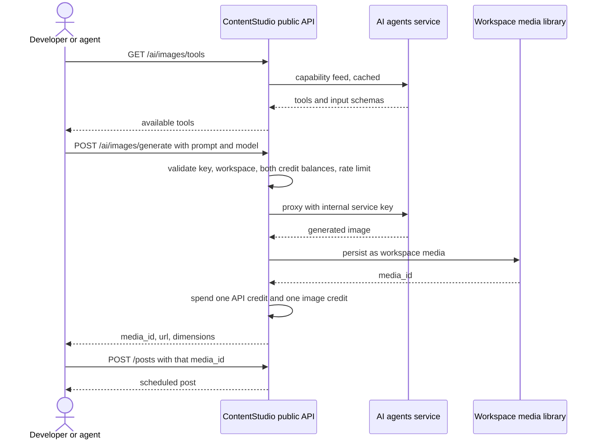

# **PRD: AI Image Generation in the Public API**

**Author:** Product
**Last Updated:** 2026-08-03
**Status:** Draft
**Target Release:** Q3 2026

---

## **1. Overview**

ContentStudio has 8 AI image tools powering AI Studio in the web app, backed by 20 image models. None of them are reachable programmatically. This feature exposes all 8 through the public REST API, and then through every downstream developer surface: the CLI and agent skill, the MCP server and Claude Desktop bundle, and the Zapier, Make, and n8n connectors.

The generation engine already exists and is production proven. This is a public contract in front of it: API key auth, workspace scoping, credit metering, a tighter rate limit, normalised errors, brand-knowledge conditioning to match the web app's per-prompt brand toggle, and persistence of results into the workspace media library so a generated image can be published in the very next call.

Video generation is deliberately excluded and ships as a separate epic, because it is asynchronous and needs a job and webhook contract that image does not.

---

## **2. Problem Statement**

**What problem are we solving?**

ContentStudio's public API can schedule and publish a post, but it cannot produce the image that goes in it. Every API-driven or agent-driven workflow stalls at the same point: the caller has to leave ContentStudio, generate an image somewhere else, upload it back through `POST /media`, and only then create the post. The most valuable half of the product is locked behind the web UI.

This is sharpest for AI agents. An agent using our MCP server or CLI can already decide what to post and when, but it has to outsource the visual to a different vendor. We built the agent surface and then gave it an incomplete toolbox.

**Who has this problem?**

- **Agencies and power users on the API** who run bulk or templated content operations and want generation in the same pipeline as scheduling.
- **AI agent users** on Claude, the CLI skill, or MCP-capable chat apps, currently the fastest growing segment of our developer surface.
- **No-code automators** on Zapier, Make, and n8n building content pipelines that today have to bolt on a third-party image step.
- **Integration partners** evaluating ContentStudio against tools that ship generation in their API.

**What happens if we don't solve it?**

Every automated ContentStudio workflow routes image spend to a competitor, and image generation is a metered, revenue-bearing capability we already pay for. We also weaken the CLI, skill, and MCP investment we just shipped, because the headline agent use case ("write and schedule a week of posts with visuals") cannot complete without leaving our surface. Each additional month makes a third-party image step the default habit in our integrators' pipelines, which is far harder to displace later than to win now.

---

## **3. Goals & Success Metrics**

| Goal | Metric | Target | How We'll Measure |
|---|---|---|---|
| Make generation reachable programmatically | Workspaces making at least one API image call | 15% of API-active workspaces in 90 days | API request logs |
| Complete the generate-then-publish loop | Share of API-generated images attached to a post within 24h | 50% | Media library + post join |
| Grow metered generation revenue | Image generation credits spent via API | 10% of total image credit spend in 90 days | Billing data |
| Strengthen the agent surface | API image calls originating from CLI, MCP, or connector user agents | 40% of API image calls | User-agent breakdown in request logs |
| Guard rail: no degradation of the existing API | p95 latency on non-AI v1 endpoints | No regression | API monitoring |
| Guard rail: no runaway spend | Workspaces hitting the image rate limit | <2% of API-active workspaces | Throttle rejections |

### **3.1 Analytics Events (Usermaven)**

Usermaven is frontend-dispatched and this feature has no frontend. Adoption is measured server side from `api.request.log` and billing data, broken down by user agent to separate raw API, CLI, MCP, and connector traffic.

*None — this feature introduces no frontend user action.*

---

## **4. Target Users**

| Segment | What they need | Surface they use |
|---|---|---|
| Agency developer | Bulk generation feeding scheduled posts | REST API |
| AI agent operator | Generation as a tool the agent can call mid-conversation | MCP, Claude Desktop, CLI skill |
| No-code automator | A generation step between a trigger and a post action | Zapier, Make, n8n |
| Terminal-first marketer | One-shot generation from the shell | CLI |
| Integration partner | Documented, stable contract to build against | REST API + docs |

---

## **5. User Stories / Jobs to Be Done**

- As a developer, I want to generate an image from a prompt and get back a media ID I can pass straight into `POST /posts`, so that generation and publishing are one pipeline.
- As a developer, I want to discover which tools and models are available and what inputs each takes, so that I do not hardcode a list that goes stale.
- As an AI agent, I want image generation as a callable tool with a clear schema, so that I can complete a content request without a third-party service.
- As a no-code automator, I want a "Generate image" action that returns a usable asset, so that I can wire it between any trigger and a ContentStudio post action.
- As a developer, I want to know before I call how much a generation costs me in credits, and to get a clear, distinct error when I run out.
- As a developer, I want a content policy refusal to look different from a server error, so that I do not page someone at 3am over a rejected prompt.
- As a developer, I want my generations conditioned on my workspace's brand knowledge, the same way the web app's brand toggle does it, so that API output is not visibly off-brand next to UI output.
- As a developer, I want to check whether brand knowledge is even set up before I ask for it, so that turning it on is not a silent no-op.

---

## **6. Requirements**

### 6.1 Endpoints

Five public paths cover all 8 tools, under the existing workspace-scoped v1 group.

| Method | Path | Purpose |
|---|---|---|
| `GET` | `/workspaces/{workspace_id}/ai/images/tools` | List available image tools with their input schema |
| `GET` | `/workspaces/{workspace_id}/ai/images/models` | List available models and supported dimensions |
| `GET` | `/workspaces/{workspace_id}/ai/brand` | Read-only: is brand knowledge set up, and is it enabled |
| `POST` | `/workspaces/{workspace_id}/ai/images/generate` | `text-to-image` and `image-to-image` |
| `POST` | `/workspaces/{workspace_id}/ai/images/tools/{tool_key}` | The 6 dedicated tools |

`{tool_key}` accepts `product-image`, `headshot`, `face-swap`, `outfit-swap`, `upscale`, `remove-background`.

The two discovery endpoints proxy the AI service's existing capability feed rather than hardcoding a list, so tools and models added to the service appear on the API without a Laravel release.

**`image-to-image` is handled by `/generate`, not `/tools/{tool_key}`.** It takes free-text prompt, model selection, and multiple attachments, which is the `/generate` shape, not the uniform dedicated-tool shape.

### 6.2 Output must land in the workspace

Every successful generation persists the result into the workspace media library and returns a media object including `media_id`, `url`, `width`, `height`, and `mime_type`.

This is the requirement that makes the feature worth shipping. It means the whole loop is two calls:

```
POST /workspaces/{ws}/ai/images/generate   → { media_id }
POST /workspaces/{ws}/posts                → uses that media_id
```

Generated assets are indistinguishable from uploaded ones to every downstream consumer, and are subject to the same workspace media storage limits.

### 6.3 Brand knowledge

In the web app, every AI generation surface carries a brand on/off toggle. When it is on, generation is conditioned on the workspace's brand knowledge (voice, style, and brand profile). The API must offer the same control, or API generations will be systematically off-brand while UI generations are on-brand, which undermines the whole point of exposing generation.

**Request parameter:** generate and tool endpoints accept an optional `use_brand` boolean.

**Response field:** every successful generation returns `brand_applied` as a boolean, so a caller can tell whether the brand was actually used rather than assuming it.

**Default: match the app.** When `use_brand` is omitted, the API honours the workspace's stored `brand_enabled` flag, which the backend defaults to **true**. This is not a new rule, it is the existing app behaviour: `brand_enabled` is the v2 on/off flag that already gates brand application in generation and chat. An API caller with brand knowledge set up in the web app therefore gets on-brand output by default, exactly as they would in the UI. Passing `use_brand` explicitly overrides the stored flag for that one request, which is what the web app's per-prompt toggle does.

**A boolean, not a brand ID.** This is deliberate and forward-compatible:

- The existing internal contract already works this way. `contentstudio-frontend/src/api/composer.ts` carries `use_brand_voice?: boolean` alongside `brand_voice_id?: string | null` annotated *"unused — backend uses the workspace default"*.
- The **Brand Knowledge Revamp** has shipped. There is now exactly **one brand per workspace**, selected by an on/off toggle rather than a dropdown, so there is no ID for a caller to pass.

So a boolean is the only shape that survives the revamp. Accepting a brand ID now would publish a public contract that the revamp breaks in the same quarter.

**Read-only status endpoint:** `GET /workspaces/{workspace_id}/ai/brand` returns whether brand knowledge is set up for the workspace and whether it is currently enabled. Without it a caller cannot tell whether `use_brand: true` will do anything, and setting the flag against an empty brand profile is a silent no-op. This is read-only by design, see 6.4.

### 6.4 Brand knowledge is set up in the web app, and the API must behave identically

**The governing principle for this section: brand knowledge is created and maintained in the web app. When a user then calls the API with their key, generation behaves exactly as it does in the app.** No separate configuration, no divergent defaults, no second source of truth for what the brand is.

Concretely, parity means:

- The same single brand per workspace resolves for API calls as for UI calls.
- The stored `brand_enabled` flag governs both surfaces identically.
- The same brand voice, style, brand profile, and source-derived content condition the generation.
- Identical inputs through the API and the UI produce equivalently on-brand output.

The Brand Knowledge Revamp has **shipped**, so this is well-defined: one brand per workspace, a single `brand_enabled` on/off flag, and the five-section structure (Brand Style, Brand Profile, Brand Voice, Source Materials, Brand Assets). There is no multi-brand ambiguity for the API to resolve and no ID for a caller to choose between.

**CRUD is out of scope by product decision.** Creating or editing brand voice, style, and profile, and adding, syncing, or removing source materials stays in the web app. This is a deliberate choice about where brand setup belongs, not a sequencing constraint: brand definition is a considered, human activity with async source ingestion behind it, and it is better served by the UI that already does it well. The API's job is to *consume* the brand, not to define it.

If a public write surface is ever wanted, it becomes its own epic. Nothing in this epic forecloses that, because read-only status and a boolean toggle are both additive.

### 6.5 Credits and billing

An API image generation spends **both**:

- **1 API credit**, via the existing `ApiKeyMiddleware` path, same as any other v1 request.
- **1 image generation credit**, from the workspace's `image_generation_credit` balance, same pool AI Studio spends from.

This is the deliberate choice. The API credit pays for the request, the image credit pays for the generation, and a customer cannot get metered AI capacity for free by routing through the API instead of the UI. Batch requests spend one image credit per image returned.

Exhausting either balance returns `403` with a distinct machine-readable error code so the caller can tell which quota ran out. Credits are only spent on success. A failed or policy-refused generation does not consume an image credit.

### 6.6 Rate limiting

Image endpoints get their own throttle bucket, separate from `throttle:api-v1`. The general v1 limit of 100 requests per minute is far too permissive for a call that costs real money per invocation and takes tens of seconds. The image bucket is workspace-scoped, and exceeding it returns `429` with `Retry-After`.

### 6.7 Latency contract

Generation takes roughly 5 to 60 seconds depending on model. The API must:

- Set a route-level timeout above the slowest realistic model, within the AI service's existing 300s ceiling.
- Document a recommended client timeout, prominently, on every surface.
- Return a distinct timeout error code rather than a generic gateway error.

Zapier, Make, and n8n each impose their own request timeouts that may be shorter than a slow model. The connector story must pin a fast default model and document which models are unsafe to select there.

### 6.8 Errors

Distinct, documented, machine-readable codes. A policy refusal is not a server error and must never be reported as one.

| Condition | Status | Meaning |
|---|---|---|
| Unknown `tool_key` | 404 | Tool does not exist |
| Invalid or missing input for the tool | 422 | Fails the tool's declared input schema |
| Content policy refusal | 422 | Prompt or image rejected by safety |
| API credits exhausted | 403 | Existing API quota behaviour |
| Image credits exhausted | 403 | Distinct code from the above |
| Image rate limit exceeded | 429 | With `Retry-After` |
| Model or provider failure | 502 | Upstream generation failed, safe to retry |
| Generation timeout | 504 | Exceeded route timeout |

### 6.9 Surface parity

The same 8 tools ship on every surface. A tool available in the API but missing from MCP is a bug, not a phase.

| Surface | Delivery |
|---|---|
| REST API | 4 endpoints above |
| CLI | `images:generate`, `images:tools`, `images:models`, plus one command per dedicated tool. `--json` envelope and `--dry-run` consistent with existing commands |
| Agent skill | Image generation documented in `SKILL.md` with the generate-then-publish recipe |
| MCP server | One MCP tool per image tool, plus discovery, with schemas derived from the capability feed |
| Claude Desktop | Inherited via the MCPB bundle, no separate build |
| Zapier / Make / n8n | A "Generate image" action per connector, returning a media ID usable by the existing post action |

---

## **7. User Flow (High Level)**



---

## **8. Business Rules & Constraints**

1. The AI agents service is never exposed publicly. All access is proxied through Laravel with the internal service key.
2. Both an API credit and an image generation credit are spent per generated image, on success only.
3. Generated media counts against workspace media storage limits like any upload.
4. Image endpoints are workspace-scoped and respect the same permission model as the rest of v1.
5. Discovery endpoints are proxied from the live capability feed, not hardcoded, so the API does not drift from the service.
6. Brand conditioning is controlled by a boolean, never a brand ID, because the Brand Knowledge Revamp unifies to one brand per workspace.
7. Brand knowledge is read-only on the public API. It is created and maintained in the web app, and API generation must behave identically to app generation for the same workspace.
8. No dark mode, RTL, or UI considerations apply. This feature has no interface.
9. Video generation is out of scope and ships separately.
10. Caption, hashtag, post generation, bulk schedule, and smart scheduling are explicitly out of scope. Text generation is something API consumers can already do with their own model, and the bulk and scheduling tools are mid-rework.

---

## **9. Open Questions**

| # | Question | Owner | Needed by |
|---|---|---|---|
| 1 | Is 1 API credit + 1 image credit the right charge, or should API generation spend image credits only? | Product + Billing | Before S-1 build |
| 2 | What is the image rate limit per workspace per minute? Suggest starting conservative at 10. | Product + Infra | Before S-1 build |
| 3 | Do we expose all 20 models, or a curated subset? Exposing all means documenting 20 cost and latency profiles. | Product | Before S-1 docs |
| 4 | Which model is the connector default, given Zapier, Make, and n8n timeouts? | Eng | Before S-4 |
| 5 | Do generated images need a provenance marker in the media library, to distinguish AI-generated assets from uploads? | Product + Legal | Before S-1 build |

---

## **10. Risks & Mitigations**

| Risk | Impact | Mitigation |
|---|---|---|
| Long generation exceeds connector timeouts | Zapier, Make, n8n calls fail intermittently and look like our bug | Pin a fast default model per connector, document unsafe model choices, return a distinct timeout code |
| Cost blowout from automated callers | Unbudgeted spend on image providers | Dedicated per-workspace throttle, hard stop on image credit exhaustion, monitoring on spend per key |
| Policy refusals read as outages | Support load, integrator distrust | Distinct 422 code, documented, with the refusal reason surfaced |
| Contract drift between API and MCP or CLI | Tools present on one surface, missing on another | Discovery endpoints derive from the capability feed, and surface parity is an acceptance criterion |
| Media storage growth | Workspaces hit storage limits unexpectedly | Generated media counts against existing limits and is documented as doing so |
| AI service outage takes down part of the public API | Perceived API instability | Image endpoints fail in isolation with 502, never affecting other v1 domains |

---

## **11. Dependencies**

- `contentstudio-ai-agents` image routes and capability feed, already live.
- `AiAgentService` and `AiToolCapabilityService` in the Laravel backend, already live.
- `POST /workspaces/{workspace_id}/media` for persistence, already live.
- The CLI, agent skill, and MCP server shipped by the public CLI and agent skills epic.
- Zapier, Make, and n8n connector codebases, each with an independent release and review cycle. n8n and Make reviews are the long pole and should start early.
- **Brand Knowledge Revamp** has shipped, so the brand model this epic reads is already stable: one brand per workspace, a single `brand_enabled` flag, five sections. No dependency, no migration risk.

---

## **12. Appendix**

**In scope, 8 tools:** `text-to-image`, `image-to-image`, `product-image`, `headshot`, `face-swap`, `outfit-swap`, `upscale`, `remove-background`.

**Out of scope:** all video tools (separate epic), caption, hashtag, post generation, bulk schedule, smart scheduling, smart insights, and brand knowledge CRUD (stays in the web app by product decision).

**Reference:** 20 image models in `contentstudio-ai-agents/src/utils/model_registry.py`, default `nano-banana-pro`.

---

## **Changelog**

| Date | Change |
|---|---|
| 2026-08-03 | Initial draft. Image only, video split into a separate epic. |
