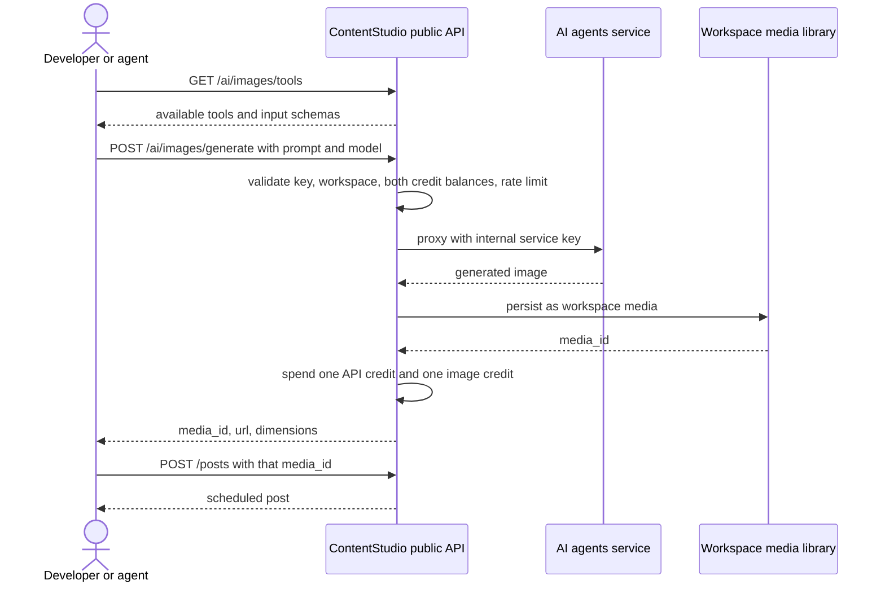

# Epic + Stories — AI Image Generation in the Public API

---

## Epic

**Title:** AI Image Generation in the Public API

**Description:**

Expose ContentStudio's 8 AI image tools through the public REST API, then through every downstream developer surface: the CLI and agent skill, the MCP server and Claude Desktop bundle, and the Zapier, Make, and n8n connectors.

The generation engine already runs in production behind AI Studio. This epic builds the public contract in front of it: API key auth, workspace scoping, credit metering against both the API and image quotas, a dedicated rate limit, normalised errors, and persistence of every result into the workspace media library so a generated image can be published in the very next call.

The outcome is that generate-then-publish becomes two API calls, and an AI agent using our MCP server or CLI can complete a content request without leaving ContentStudio for its visuals.

**Tools in scope (8):** `text-to-image`, `image-to-image`, `product-image`, `headshot`, `face-swap`, `outfit-swap`, `upscale`, `remove-background`.

**Out of scope:** all video generation, which ships as a separate epic because it is asynchronous and needs a job and webhook contract. Also out: caption, hashtag, and post generation, bulk schedule, and smart scheduling.

| # | Story | Priority |
|---|---|---|
| S-1 | [BE] Add AI image generation endpoints to the public API | High |
| S-2 | [BE] Add image generation commands to the CLI and agent skill | High |
| S-3 | [BE] Expose image generation tools in the MCP server and Claude Desktop bundle | High |
| S-4 | [BE] Add image generation actions to Zapier, Make, and n8n | Medium |
| S-5 | [BE] Publish public documentation and quickstarts for image generation | Medium |

S-1 gates everything else. S-2, S-3, S-4, and S-5 can run in parallel once it lands.

---

## S-1 · [BE] Add AI image generation endpoints to the public API
**Project:** Web App · **Group:** Backend · **Skill:** Backend · **Product area:** Public API · **Priority:** High · **Type:** Feature

### Description

As a developer or AI agent using the ContentStudio API, I want to generate images with the same AI tools available in AI Studio and get back a media ID I can publish immediately, so that generation and publishing are a single pipeline instead of a detour through a third-party service.

The public API can schedule and publish a post but cannot produce the image that goes in it. Today every API-driven workflow has to generate elsewhere, upload through `POST /media`, and then create the post. This story adds the image domain to the public API.

The generation itself already works. The AI agents service exposes all 8 tools and Laravel already talks to it server to server through `AiAgentService`. This story builds the public contract: authentication, workspace scoping, credit metering, rate limiting, error normalisation, and persistence into the workspace media library.

**Four endpoints cover all 8 tools:**

| Method | Path | Covers |
|---|---|---|
| `GET` | `/workspaces/{workspace_id}/ai/images/tools` | Discovery: tools and their input schemas |
| `GET` | `/workspaces/{workspace_id}/ai/images/models` | Discovery: models and supported dimensions |
| `POST` | `/workspaces/{workspace_id}/ai/images/generate` | `text-to-image`, `image-to-image` |
| `POST` | `/workspaces/{workspace_id}/ai/images/tools/{tool_key}` | `product-image`, `headshot`, `face-swap`, `outfit-swap`, `upscale`, `remove-background` |

Both discovery endpoints proxy the AI service's live capability feed rather than hardcoding a list, so a tool or model added to the service appears on the public API without a Laravel release.

### Workflow

1. A developer calls the tools endpoint to see which image tools are available and what inputs each one takes.
2. They call the generate endpoint with a prompt, optionally choosing a model.
3. The request is authenticated with their API key, scoped to the workspace, and checked against both their API credit balance and their image generation credit balance, plus the image rate limit.
4. The image is generated and saved into the workspace media library.
5. They receive a media ID, a URL, and the image dimensions.
6. They pass that media ID straight into the create-post endpoint and the image is attached to a scheduled post.
7. If their prompt is refused by content policy, they get a clear validation error explaining the refusal, not a server error.
8. If either credit balance is exhausted, they get an error that tells them specifically which one ran out.

### Acceptance criteria

**Endpoints and tool coverage**
- [ ] `GET /api/v1/workspaces/{workspace_id}/ai/images/tools` returns the available image tools with, for each, its key, name, description, and input schema.
- [ ] `GET /api/v1/workspaces/{workspace_id}/ai/images/models` returns the available image models and the output dimensions each supports.
- [ ] Both discovery endpoints derive from the AI service's live capability feed. Adding a tool or model to the service surfaces it on the public API with no Laravel code change.
- [ ] `POST /api/v1/workspaces/{workspace_id}/ai/images/generate` generates an image from a text prompt.
- [ ] The same endpoint accepts one or more input images and performs image-to-image transformation.
- [ ] `POST /api/v1/workspaces/{workspace_id}/ai/images/tools/{tool_key}` executes each of `product-image`, `headshot`, `face-swap`, `outfit-swap`, `upscale`, and `remove-background`.
- [ ] Each dedicated tool validates its inputs against that tool's declared input schema from the capability feed.
- [ ] An unknown `tool_key` returns `404` with a machine-readable error code.

**Model selection**
- [ ] The generate endpoint accepts an optional model parameter and uses the configured default when it is omitted.
- [ ] Requesting a model that does not exist or is not permitted returns `422` naming the invalid model.

**Output and media persistence**
- [ ] Every successful generation persists the image into the workspace media library.
- [ ] The response includes at minimum a media ID, URL, width, height, and MIME type.
- [ ] The returned media ID is accepted by `POST /api/v1/workspaces/{workspace_id}/posts` and the image attaches to the created post.
- [ ] Generated media appears in `GET /api/v1/workspaces/{workspace_id}/media` alongside uploaded media.
- [ ] Generated media counts against the workspace's media storage limit, and a workspace at its storage limit gets a clear error rather than a silent failure.

**Credits**
- [ ] A successful generation spends one API credit through the existing API key middleware path.
- [ ] A successful generation also spends one image generation credit from the workspace's image credit balance, the same pool AI Studio spends from.
- [ ] A batch request spends one image generation credit per image returned.
- [ ] No image generation credit is spent when generation fails or is refused by content policy.
- [ ] Exhausted API credits return `403` with the existing API credit error code.
- [ ] Exhausted image generation credits return `403` with a **different** machine-readable error code, so the caller can tell which quota ran out.

**Rate limiting**
- [ ] Image endpoints use their own throttle bucket, separate from the general v1 throttle.
- [ ] The limit is applied per workspace.
- [ ] Exceeding it returns `429` with a `Retry-After` header.
- [ ] Image throttling does not consume or affect the general v1 request budget for other endpoints.

**Errors**
- [ ] A content policy refusal returns `422` with a distinct error code and a reason, and is never reported as a server error.
- [ ] Invalid or missing tool inputs return `422` identifying the offending field.
- [ ] An upstream model or provider failure returns `502` with a code indicating the request is safe to retry.
- [ ] A generation that exceeds the route timeout returns `504` with a distinct code.
- [ ] Every error response follows the same top-level shape as the rest of the v1 API, so existing clients need no special-casing.

**Isolation and security**
- [ ] The AI agents service is never reachable from the public internet. All access is proxied through Laravel using the internal service key.
- [ ] The internal service key is never present in any public API response, error body, or log line.
- [ ] Image endpoints are scoped to the workspace in the path and reject keys without access to that workspace.
- [ ] An AI service outage causes image endpoints to fail with `502` and leaves every other v1 domain unaffected.

**Latency**
- [ ] Image routes have a timeout above the slowest supported model, within the AI service's existing ceiling.
- [ ] The route timeout is configurable without a code change.

**Documentation**
- [ ] The OpenAPI specification is updated with all four endpoints, every tool, request and response schemas, and the full error code table.
- [ ] The interactive API reference at `/guide` renders the new endpoints.

### Impact on existing data

Adds generated images to the workspace media library, where they are indistinguishable from uploads to every downstream consumer. Spends against the existing `image_generation_credit` balance, which no API path has touched before. No schema migration.

### Impact on other products

None directly. The web app, mobile apps, and Chrome extension are unchanged. Everything downstream in this epic depends on these endpoints.

### Dependencies

- None. This story gates S-2, S-3, S-4, and S-5.
- Open questions 1, 2, 3, and 5 in the PRD need answers before build starts: the credit charging model, the rate limit value, whether all 20 models are exposed, and whether generated media needs a provenance marker.

### Global quality & compliance (wherever applicable)
- [ ] Mobile responsiveness — N/A, backend-only story
- [ ] Multilingual support (frontend + backend, translations available or fallback handled)
- [ ] UI theming support — N/A, no interface
- [ ] White-label domains impact review
- [ ] Cross-product impact assessment (web, mobile apps, Chrome extension)

### Implementation references
*Pointers from research — not a contract. Engineering may choose a different approach.*

**Existing pieces this builds on, all live:**
- `contentstudio-backend/routes/api/v1.php` — the v1 route group and its `['force.json', 'api.key', 'api.request.log', 'throttle:api-v1']` middleware stack. Image routes likely want the same stack with the throttle swapped for a dedicated bucket.
- `contentstudio-backend/app/Services/AI/AiAgentService.php` — the server-to-server client. `request()`, `requestOrFail()`, `getRequest()` already handle base URL, the internal key, and timeouts.
- `contentstudio-backend/app/Services/AI/AiToolCapabilityService.php` — `list()` and `show($toolKey)` over the capability feed, already cached with a 300s TTL. This is what the two discovery endpoints should proxy.
- `contentstudio-backend/config/ai_agents.php` — `base_url`, `api_key`, `timeout` (300s), `default_image_model` (`nano-banana-pro`), capability cache TTL.
- `contentstudio-backend/app/Http/Middleware/ApiKeyMiddleware.php:88-108` — where API credits are checked and incremented. Note line 108 already skips the increment for internal `ai_creation` keys, which may be the right precedent for how internal versus public AI calls are distinguished.
- `contentstudio-backend/app/Libraries/Settings/SubscriptionLimits.php:49,75` — where `image_generation_credit` lives.

**AI service routes to proxy:**
- `POST /api/v1/image/generate` — text-to-image, and image-to-image via input images
- `POST /api/v1/tools/{key}` — the 6 dedicated tools, uniform contract via `make_tool_route`
- `GET /api/v1/image/models`, `GET /api/v1/image/dimensions`, `GET /api/v1/tools`, `GET /api/v1/tools/{key}`
- `POST /api/v1/image/batch` for batch generation

**Gotchas:**
- **`image-to-image` is not a uniform dedicated tool.** Its route comment in `contentstudio-ai-agents/src/api/routers/dedicated_tools_router.py` says it is *"bespoke — exposes model selection / free-text prompt / N attachments / mentions / logo, so it delegates to the chat core, not the ToolSpec engine."* That is why the PRD routes it through `/generate` rather than `/tools/{tool_key}`. Mapping it generically will not work.
- The other 6 dedicated tools are declared as `ToolSpec` entries in `src/tools/dedicated/specs.py` and registered with one `make_tool_route` line each, so a generic proxy handles all 6.
- `src/agents/image/safety.py` and `brand_intent_classifier.py` mean generation can be refused. Refusals must map to the documented `422`, not a `500`.
- The AI service base URL in config currently points at staging. Confirm production configuration before launch.

---

## S-2 · [BE] Add image generation commands to the CLI and agent skill
**Project:** Web App · **Group:** Backend · **Skill:** Backend · **Product area:** Public API · **Priority:** High · **Type:** Feature

### Description
As a terminal user or shell-capable AI agent, I want image generation commands in the ContentStudio CLI so that I can generate and publish without leaving the shell.

Adds an `images` command group to `contentstudio-cli`, consuming the endpoints from S-1, and documents the generate-then-publish recipe in the bundled agent skill.

### Workflow
1. The user runs a command to list available image tools and models.
2. They run a generate command with a prompt and receive a media ID.
3. They pass that media ID into the existing post creation command.
4. An agent reading the skill file follows the same two-step recipe unprompted.

### Acceptance criteria
- [ ] An `images` command group exists with `images:generate`, `images:tools`, and `images:models`.
- [ ] One command exists per dedicated tool: `product-image`, `headshot`, `face-swap`, `outfit-swap`, `upscale`, `remove-background`.
- [ ] All 8 tools from S-1 are reachable from the CLI. A tool available in the API but missing from the CLI fails this story.
- [ ] Commands follow the existing colon syntax, `--json` envelope, and `--dry-run` conventions.
- [ ] `--json` output includes the media ID in a form that pipes directly into the post creation command.
- [ ] The client timeout accommodates slow models and is documented.
- [ ] Credit exhaustion, policy refusal, and rate limit errors each render a distinct, readable message rather than a raw HTTP error.
- [ ] `SKILL.md` documents image generation and includes the generate-then-publish recipe.

### Impact on existing data
None.

### Impact on other products
CLI package release. No web, mobile, or extension change.

### Dependencies
- Depends on: **[BE] Add AI image generation endpoints to the public API**

### Global quality & compliance (wherever applicable)
- [ ] Mobile responsiveness — N/A, CLI story
- [ ] Multilingual support (frontend + backend, translations available or fallback handled)
- [ ] UI theming support — N/A, no interface
- [ ] White-label domains impact review
- [ ] Cross-product impact assessment (web, mobile apps, Chrome extension)

---

## S-3 · [BE] Expose image generation tools in the MCP server and Claude Desktop bundle
**Project:** Web App · **Group:** Backend · **Skill:** Backend · **Product area:** Public API · **Priority:** High · **Type:** Feature

### Description
As an AI agent operator using Claude or another MCP-capable chat app, I want ContentStudio's image tools available as callable MCP tools so that the agent can produce a visual and schedule the post in one conversation.

Adds image tools to `contentstudio-mcp`. The Claude Desktop MCPB bundle ships the same server, so it inherits them without a separate build.

### Workflow
1. The user connects the ContentStudio MCP server in Claude or another MCP-capable app.
2. They ask for a post with an image.
3. The agent calls the generation tool, receives a media ID, and calls the existing post tool with it.
4. The user gets a scheduled post with a generated image without leaving the conversation.

### Acceptance criteria
- [ ] One MCP tool exists per image tool from S-1, all 8.
- [ ] A discovery tool exposes available models and their dimensions.
- [ ] Tool schemas derive from the API's capability feed rather than being hardcoded, so they do not drift from the service.
- [ ] Each tool description states what it does and what it costs in credits, so an agent can reason about spend before calling.
- [ ] Generation tools return a media ID in a form the existing post creation tool accepts.
- [ ] Policy refusals and credit exhaustion return messages an agent can act on, not raw HTTP errors.
- [ ] The MCP client timeout accommodates slow models.
- [ ] The Claude Desktop MCPB bundle exposes the new tools with no separate build step.
- [ ] Verified working end to end in Claude Desktop and in at least one other MCP-capable client.

### Impact on existing data
None.

### Impact on other products
MCP package release, which propagates to Claude Desktop, Zapier, Make, and n8n where they consume MCP.

### Dependencies
- Depends on: **[BE] Add AI image generation endpoints to the public API**

### Global quality & compliance (wherever applicable)
- [ ] Mobile responsiveness — N/A, backend-only story
- [ ] Multilingual support (frontend + backend, translations available or fallback handled)
- [ ] UI theming support — N/A, no interface
- [ ] White-label domains impact review
- [ ] Cross-product impact assessment (web, mobile apps, Chrome extension)

---

## S-4 · [BE] Add image generation actions to Zapier, Make, and n8n
**Project:** Web App · **Group:** Backend · **Skill:** Backend · **Product area:** Public API · **Priority:** Medium · **Type:** Feature

### Description
As a no-code automator, I want a "Generate image" action in Zapier, Make, and n8n so that I can wire generation between any trigger and a ContentStudio post action without a third-party image step.

### Workflow
1. The user adds a ContentStudio "Generate image" action to a scenario.
2. They pick a tool, enter a prompt, and optionally map an input image from a previous step.
3. The action returns a media ID.
4. They map that media ID into the existing ContentStudio post action.

### Acceptance criteria
- [ ] A "Generate image" action exists in all three connectors.
- [ ] Tool selection is offered as a picker rather than a free-text field.
- [ ] Input images can be mapped from a previous step in the scenario.
- [ ] The action output includes a media ID that maps into the existing post creation action.
- [ ] Each connector pins a fast default model chosen to stay inside that platform's request timeout.
- [ ] Models known to exceed a platform's timeout are either excluded from that connector's picker or documented as unsafe there.
- [ ] Credit exhaustion, policy refusal, and rate limit errors surface as readable messages in each platform's error UI.
- [ ] Each connector passes its platform's review and is published.

### Impact on existing data
None.

### Impact on other products
Three independent connector releases, each with its own review cycle.

### Dependencies
- Depends on: **[BE] Add AI image generation endpoints to the public API**
- PRD open question 4, the connector default model, must be answered first.
- Marketplace review for n8n and Make is the long pole in this epic. Submit early.

### Global quality & compliance (wherever applicable)
- [ ] Mobile responsiveness — N/A, backend-only story
- [ ] Multilingual support (frontend + backend, translations available or fallback handled)
- [ ] UI theming support — N/A, no interface
- [ ] White-label domains impact review
- [ ] Cross-product impact assessment (web, mobile apps, Chrome extension)

---

## S-5 · [BE] Publish public documentation and quickstarts for image generation
**Project:** Web App · **Group:** Backend · **Skill:** Backend · **Product area:** Public API · **Priority:** Medium · **Type:** Chore

### Description
As a developer evaluating or integrating ContentStudio, I want documentation covering image generation on every surface so that I can get from API key to a published post with a generated image without reading source code.

### Acceptance criteria
- [ ] The API reference documents all four endpoints, all 8 tools, request and response schemas, and the full error code table.
- [ ] A quickstart shows the generate-then-publish flow end to end as two calls.
- [ ] Credit consumption is documented explicitly: one API credit plus one image generation credit per generated image, spent on success only.
- [ ] Recommended client timeouts are documented prominently on every surface, given generation can take up to a minute.
- [ ] The available models are documented with their relative speed, so integrators can choose appropriately for timeout-constrained environments.
- [ ] Rate limits for image endpoints are documented, separately from the general v1 limit.
- [ ] CLI, MCP, Zapier, Make, and n8n each have setup and usage docs for image generation.
- [ ] A help centre article covers image generation for non-developer users of the connectors.
- [ ] Documentation states that generated media lands in the workspace media library and counts against storage limits.

### Impact on existing data
None.

### Impact on other products
Public docs site and help centre.

### Dependencies
- Depends on: **[BE] Add AI image generation endpoints to the public API**
- Best written alongside S-2, S-3, and S-4 rather than after, so each surface's docs land with its release.

### Global quality & compliance (wherever applicable)
- [ ] Mobile responsiveness — N/A, documentation story
- [ ] Multilingual support (frontend + backend, translations available or fallback handled)
- [ ] UI theming support — N/A, no interface
- [ ] White-label domains impact review
- [ ] Cross-product impact assessment (web, mobile apps, Chrome extension)
