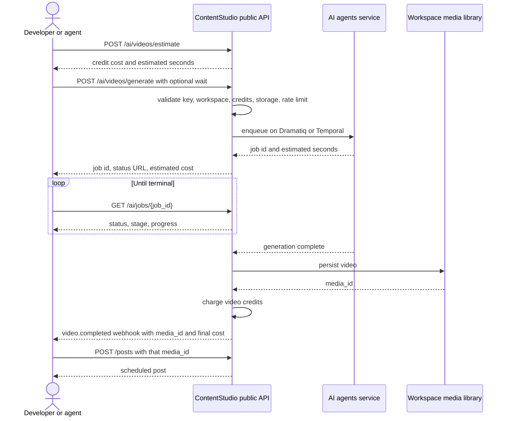

# **PRD: AI Video Generation in the Public API**

**Author:** Product
**Last Updated:** 2026-08-03
**Status:** Draft
**Target Release:** Q3 2026

---

## **1. Overview**

ContentStudio has 5 AI video tools powering AI Studio, backed by 25 video models. None are reachable programmatically. This feature exposes all 5 through the public REST API and every downstream developer surface: the CLI and agent skill, the MCP server and Claude Desktop bundle, and the Zapier, Make, and n8n connectors.

Video generation takes minutes, not seconds, so this epic's real deliverable is an **asynchronous job contract**: submit returns a job handle, callers poll for status, and integrators who prefer push get signed webhooks on completion. Both mechanisms ship together rather than webhooks arriving in a later phase.

It also unifies two internal async engines, Dramatiq and Temporal, behind a single public job resource, and introduces cost estimation, because unlike image generation video credit cost varies by model, duration, resolution, and audio.

The sibling image generation epic covers the synchronous half of AI Studio and shares this epic's surfaces and proxy architecture.

---

## **2. Problem Statement**

**What problem are we solving?**

Video is the highest-value, highest-cost content type our AI produces, and it is completely unreachable outside the web UI. An API consumer or AI agent can schedule a post but cannot produce a video for it. The workaround is to generate on a competitor's API, download, upload through `POST /media`, then create the post.

Video also makes the gap worse than image does, because video is where our pricing is genuinely competitive: we already run 25 models behind one interface with per-model cost calculation. That aggregation is valuable to exactly the developer audience that cannot currently reach it.

**Who has this problem?**

- **Agencies running volume video production** who want generation in the same pipeline as scheduling, and who feel the manual round trip most because video files are large.
- **AI agent operators** on Claude, MCP-capable chat apps, and the CLI skill. Video is the capability they most often ask an agent for and the one it most often has to decline.
- **No-code automators** on Zapier, Make, and n8n wiring content pipelines.
- **Integration partners** comparing us against vendors who ship video generation in their API. Higgsfield, for one, ships an agent-facing video MCP today.

**What happens if we don't solve it?**

Video generation spend, our most expensive and highest-margin metered capability, routes to competitors from every automated workflow. We also leave the agent surface we just built unable to do the thing agents are most asked to do. Every month the third-party video step becomes more entrenched in integrators' pipelines, and displacing an established step is much harder than winning an empty slot.

---

## **3. Goals & Success Metrics**

| Goal | Metric | Target | How We'll Measure |
|---|---|---|---|
| Make video generation reachable programmatically | Workspaces submitting at least one API video job | 10% of API-active workspaces in 90 days | API request logs |
| Complete the generate-then-publish loop | Share of API-generated videos attached to a post within 7 days | 40% | Media library + post join |
| Grow metered video revenue | Video credits spent via API | 8% of total video credit spend in 90 days | Billing data |
| Prove webhooks reduce polling load | Share of video jobs whose result is collected via webhook rather than polling | 30% of jobs from webhook-registered workspaces | Delivery records + request logs |
| Guard rail: no wasted spend | Video jobs failing after upstream billing | <2% of submitted jobs | Job records |
| Guard rail: async contract is usable | Share of submitted jobs whose result is never collected | <5% | Job records |

The last guard rail matters most. A job nobody collects means the async contract is too hard to use, and it is the earliest signal that polling or webhooks are not working in practice.

### **3.1 Analytics Events (Usermaven)**

Usermaven is frontend-dispatched and this feature has no frontend. Adoption is measured server side from request logs, job records, and billing, split by user agent to separate raw API, CLI, MCP, and connector traffic.

*None — this feature introduces no frontend user action.*

---

## **4. Target Users**

| Segment | What they need | Surface |
|---|---|---|
| Agency developer | Bulk video generation feeding a schedule | REST API + webhooks |
| AI agent operator | Video as a tool the agent can call without stalling the conversation | MCP, Claude Desktop, CLI skill |
| No-code automator | A submit step and a resume step | Zapier, Make, n8n |
| Terminal-first marketer | One command that waits and shows progress | CLI |
| Integration partner | A stable, documented async contract | REST API + docs |

---

## **5. User Stories / Jobs to Be Done**

- As a developer, I want to submit a video generation request and get a job handle back immediately, so my request does not hang for minutes.
- As a developer, I want to know what a video will cost me in credits **before** I submit it, so an automated pipeline cannot silently drain my balance.
- As a developer, I want to poll one endpoint for job status regardless of which tool I used, so I do not write different handling per tool.
- As a developer, I want a signed webhook when my video finishes, so I do not have to poll at all.
- As an AI agent, I want short generations to return inline and long ones to give me a handle I can check later, so I neither stall the conversation nor burn context on polling.
- As a no-code automator, I want a submit step and a separate resume step, because my platform will time out if I wait inline.
- As a developer, I want a failed or cancelled job not to cost me credits.
- As a developer, I want the finished video in my workspace media library so I can publish it in the next call.

---

## **6. Requirements**

### 6.1 Endpoints

| Method | Path | Purpose |
|---|---|---|
| `GET` | `/workspaces/{workspace_id}/ai/videos/tools` | Discovery: tools, supported modes, input schemas |
| `GET` | `/workspaces/{workspace_id}/ai/videos/models` | Discovery: models with supported modes, resolutions, durations |
| `POST` | `/workspaces/{workspace_id}/ai/videos/estimate` | Credit cost and time estimate for a given request, without submitting |
| `POST` | `/workspaces/{workspace_id}/ai/videos/generate` | `text-to-video`, `image-to-video`, `reference-to-video` |
| `POST` | `/workspaces/{workspace_id}/ai/videos/tools/{tool_key}` | `motion-control`, `lip-sync`, `video-clips-highlights` |
| `GET` | `/workspaces/{workspace_id}/ai/jobs/{job_id}` | Job status, progress, result |
| `GET` | `/workspaces/{workspace_id}/ai/jobs` | List jobs, filterable by status |
| `DELETE` | `/workspaces/{workspace_id}/ai/jobs/{job_id}` | Cancel a running job |

The job resource is deliberately `/ai/jobs`, not `/ai/videos/jobs`. It is a generic async job resource so that any future async AI work, including batch image, uses the same contract rather than growing a parallel one.

### 6.2 One job contract over two internal engines

Four of the five tools run on Dramatiq. `video-clips-highlights` runs on Temporal, with a different identifier, different status routes, a separate result route, and different status casing.

**The public API must present one job resource and normalise both.** A caller must not be able to tell which internal queue ran their job. Exposing `workflow_id` for one tool and `job_id` for the other four would leak implementation into a contract we then cannot change.

### 6.3 Job state machine

**Public, stable, safe to branch on:**

`queued` · `processing` · `completed` · `failed` · `cancelled`

**Informational, display only, explicitly documented as subject to change without notice:**

- `stage` — the granular pipeline stage (`starting`, `enhancing`, `optimizing`, `generating`, and others)
- `progress` — 0 to 100
- `message` — human-readable status text

The internal stream emits seven active stages, several of which are pipeline internals. Committing those to a public contract means integrator code breaks whenever the pipeline changes. The coarse set is the contract; the granular stage is a display detail.

### 6.4 Bounded wait

Submit accepts an optional `wait` parameter, capped at a value to be confirmed against gateway and load-balancer timeouts, provisionally 90 seconds.

- If the job completes inside the window, the response returns the finished result directly.
- If it does not, the response returns the job handle exactly as if `wait` had been omitted.

This lets fast jobs collapse into a single call and makes the documented quickstart one request instead of three. It is never the only mechanism: polling and webhooks both remain available regardless.

### 6.5 Webhooks

Two new events on the existing webhooks delivery stack:

| Event | Fires when |
|---|---|
| `video.completed` | A job reaches `completed`, carrying the media ID and final charged credit cost |
| `video.failed` | A job reaches `failed`, carrying the failure reason |

These inherit HMAC signing, at-least-once delivery, exponential-backoff retries into a dead-letter queue, delivery logs, and the test-event button from the public webhooks epic. No new delivery machinery is built.

Cancellation does not emit an event. The caller initiated it and already knows.

### 6.6 Cost estimation and credits

Video credit cost is computed from model, duration, resolution, and audio, against a per-model, per-resolution cost matrix. It is not a flat rate.

- `POST /ai/videos/estimate` returns the credit cost and an estimated completion time for a request, **without** submitting it or spending anything.
- The submit response includes the estimated cost and `estimated_seconds`.
- The completed job carries the **final charged** cost, which is authoritative.
- Credits are checked at submit and charged on completion.
- A **failed** job charges nothing. If credits were reserved at submit, they are released.
- A **cancelled** job charges nothing, including for partial work.
- Insufficient credits at submit returns `403` with a distinct code, and the response states the required and available amounts.

An API request also spends one API credit at submit, consistent with every other v1 endpoint and with the image epic.

### 6.7 Output

Every completed job persists the video into the workspace media library and the result carries a media ID usable directly by `POST /workspaces/{workspace_id}/posts`.

Video files are far larger than images, so this interacts hard with workspace storage limits. A workspace at its storage limit must fail at **submit** with a clear error, not after spending minutes of generation.

### 6.8 Rate limiting and concurrency

- Video submit endpoints get their own throttle bucket, separate from the general v1 throttle and separate from image.
- A concurrent running-job cap per workspace, so one automated caller cannot occupy the queue.
- Job status polling gets a more permissive limit than submit, since polling is the mechanism we are telling people to use. Throttling polling defeats the design.
- Exceeding either returns `429` with `Retry-After`.

### 6.9 Job retention

Completed and failed jobs stay queryable for a documented retention window. After it, `GET /ai/jobs/{job_id}` returns `410`, distinct from a `404` for an ID that never existed. The generated media in the library is unaffected by job pruning.

### 6.10 Errors

| Condition | Status |
|---|---|
| Unknown `tool_key` | 404 |
| Unknown job ID | 404 |
| Job pruned past retention | 410 |
| Invalid input for the tool | 422 |
| Model does not support the requested mode, resolution, or duration | 422 |
| Content policy refusal | 422 |
| Insufficient video credits | 403 |
| API credits exhausted | 403 |
| Workspace storage limit reached | 403 |
| Rate limit or concurrency cap exceeded | 429 |
| Upstream model or provider failure | 502 |
| Cancel attempted on an already-terminal job | 409 |

Every error uses the same top-level shape as the rest of v1.

### 6.11 SSE stays internal

The service exposes `GET /jobs/{job_id}/events`. It is **not** exposed publicly in this epic. Our own web app polls and does not use it, so we have no production evidence it works well, and a public streaming contract is expensive to support and hard to withdraw. Revisit if an integrator asks.

### 6.12 Surface parity and behaviour

All 5 tools ship on every surface.

| Surface | Behaviour |
|---|---|
| REST API | Submit plus poll, optional bounded wait, webhooks if registered |
| CLI | Blocks with a progress indicator by default. `--no-wait` returns the job ID. `videos:job` checks status |
| MCP / Claude | Tool waits server-side up to the bounded-wait cap. Returns the video if done, otherwise a job handle plus a separate check-status tool. Tool descriptions state credit cost |
| Zapier / Make / n8n | Never blocks. A submit action plus the platform's native resume mechanism |

**On the MCP behaviour:** making an agent poll burns context on every status call and makes the conversation look stalled. Waiting server-side means short jobs feel instant and long ones degrade to a handle. This is the deliberate difference from Higgsfield, which has agents poll.

**On the connectors:** unlike image, where pinning a fast model kept calls inside platform timeouts, **no video model is fast enough**. These connectors must use n8n's `Wait` node, Make's incomplete-execution handling, and Zapier's polling triggers.

---

## **7. User Flow (High Level)**

---

## **8. Business Rules & Constraints**

1. The AI agents service is never publicly reachable. All access is proxied through Laravel with the internal service key.
2. One public job resource covers both internal async engines. Callers cannot tell which ran their job.
3. The public state machine is five values. Granular stages are informational only.
4. Credits are checked at submit and charged on completion. Failed and cancelled jobs charge nothing.
5. An API credit is spent at submit, like any other v1 request.
6. Generated video counts against workspace media storage limits, and storage is checked at submit.
7. SSE is not part of the public contract in this epic.
8. Webhooks ship in this epic, not a later phase, and reuse the webhooks epic's delivery stack.
9. No UI, so no dark mode, RTL, or theming considerations.
10. Image generation is a separate epic. Caption, hashtag, and post generation, bulk schedule, and smart scheduling remain out of scope.

---

## **9. Open Questions**

| # | Question | Owner | Needed by |
|---|---|---|---|
| 1 | What is the bounded-wait cap, given our gateway and load-balancer timeouts? Provisionally 90s. | Eng + Infra | Before S-1 build |
| 2 | Are credits **reserved** at submit or only checked? Reserving prevents oversubscription but needs a release path on failure. | Product + Billing | Before S-1 build |
| 3 | What is the concurrent running-job cap per workspace? | Product + Infra | Before S-1 build |
| 4 | What is the job retention window? | Eng | Before S-1 build |
| 5 | Do we expose all 25 models, or curate? Exposing all means documenting 25 cost, mode, and duration profiles. | Product | Before S-1 docs |
| 6 | If a job fails **after** the upstream provider has billed us, do we absorb it or pass it on? | Product + Billing | Before S-1 build |
| 7 | Are batch video jobs in scope for v1, or single jobs only? | Product | Before S-1 build |
| 8 | Do generated videos need a provenance marker in the media library? | Product + Legal | Before S-1 build |

---

## **10. Risks & Mitigations**

| Risk | Impact | Mitigation |
|---|---|---|
| Connector timeouts make video look broken | Zapier, Make, n8n users see intermittent failures | No blocking on those surfaces. Use each platform's native resume mechanism. Documented explicitly |
| Cost blowout from automated callers | Large unbudgeted spend, far worse than image | Estimate endpoint, credit check at submit, concurrency cap, dedicated throttle, spend monitoring per key |
| Uncollected results | Customers charged for videos they never fetch | Webhooks reduce it structurally. Tracked as a launch guard-rail metric |
| Two async engines leak into the contract | A contract we cannot change without breaking integrators | Single normalised job resource is an acceptance criterion, not a nice-to-have |
| Granular stages committed by accident | Integrator code breaks on any pipeline change | Coarse state machine is contractual, `stage` documented as unstable |
| Storage limits hit mid-pipeline | Minutes of generation wasted, credits disputed | Storage checked at submit, not on completion |
| Webhooks epic slips | Video ships polling-only, missing a stated goal | Polling is independently complete. Webhooks are a separable story that can land after, at the cost of one goal |
| AI service outage | Perceived API instability | Video endpoints fail in isolation with 502, other v1 domains unaffected |

---

## **11. Dependencies**

- **`public-webhooks` epic**, status *In Review*. Hard dependency for S-2. Should land before or alongside this epic. Its PRD already scopes non-publishing events as a future phase, which this fills.
- `contentstudio-ai-agents` Dramatiq job routes and Temporal reel workflow, both live.
- `AiAgentService` and `AiToolCapabilityService` in the Laravel backend, both live.
- `POST /workspaces/{workspace_id}/media` for persistence, live.
- The CLI, agent skill, and MCP server from the public CLI and agent skills epic.
- Zapier, Make, and n8n connector codebases. Marketplace review for n8n and Make is the schedule long pole.
- The sibling image generation epic. Not a blocker, but shipping image first establishes the `/ai/*` namespace, error shapes, and credit-metering pattern that this epic extends.

---

## **12. Appendix**

**In scope, 5 tools:** `text-to-video`, `image-to-video`, `video-clips-highlights`, `motion-control`, `lip-sync`. Plus `reference-to-video` as a third mode on the generate endpoint.

**Out of scope:** image generation (separate epic), caption, hashtag, and post generation, bulk schedule, smart scheduling, smart insights, public SSE.

**Reference:** 25 video models in `contentstudio-ai-agents/src/utils/model_registry.py`. Mode support is per model.

**Design basis:** the async pattern recommendation dated 2026-08-03, which surveyed Higgsfield's agent-facing video MCP (polling only, no webhooks) and our own internal evidence that polling is the proven path.

---

## **Changelog**

| Date | Change |
|---|---|
| 2026-08-03 | Initial draft. Polling plus webhooks both in scope. Split from the image epic. |
