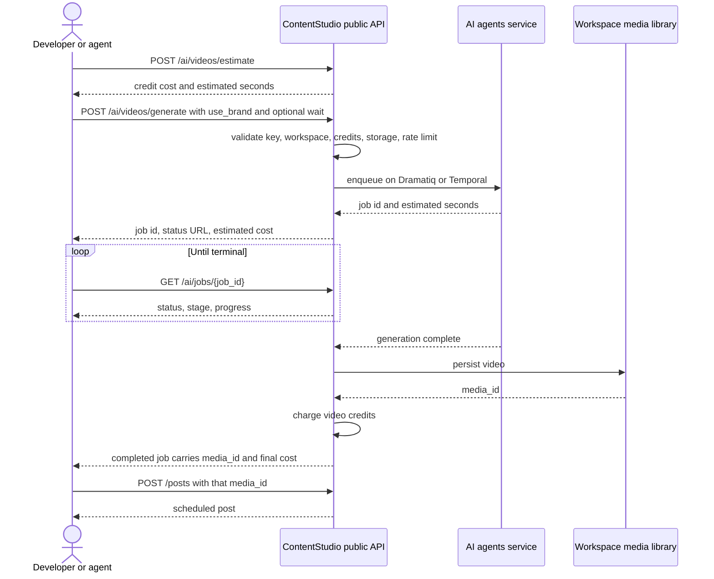

# Epic + Stories — AI Video Generation in the Public API

---

## Epic

**Title:** AI Video Generation in the Public API

**Description:**

Expose ContentStudio's 5 AI video tools through the public REST API and every downstream developer surface: the CLI and agent skill, the MCP server and Claude Desktop bundle, and the Zapier, Make, and n8n connectors.

Video generation takes minutes, so the real deliverable is an **asynchronous job contract**. Submit returns a job handle immediately, callers poll one status endpoint regardless of which tool they used, and integrators who prefer push receive signed `video.completed` and `video.failed` webhooks. Both mechanisms ship in this epic.

The epic also unifies two internal async engines behind one public job resource, and adds cost estimation, because video credit cost varies by model, duration, resolution, and audio rather than being a flat rate.

Generation accepts a brand on/off boolean matching the web app's per-prompt brand toggle, plus a read-only brand status endpoint, so API video is not systematically off-brand next to UI video.

**Tools in scope (5):** `text-to-video`, `image-to-video`, `video-clips-highlights`, `motion-control`, `lip-sync`. Plus `reference-to-video` as a third mode on the generate endpoint.

**Out of scope:** image generation, which is the sibling epic and is synchronous. Also out: caption, hashtag, and post generation, bulk schedule, smart scheduling, and public SSE streaming.

**Brand knowledge is set up in the web app, and the API must behave identically.** With brand knowledge configured in the app, an API call using that user's key produces the same on-brand video the app produces. **CRUD is out of scope by product decision** — creating and editing brand voice, style, profile, and source materials stays in the web app. The API consumes the brand, it does not define it.

| # | Story | Priority |
|---|---|---|
| S-1 | [BE] Add AI video generation endpoints and the async job contract to the public API | High |
| S-2 | [BE] Add video job events to the public webhooks system | High |
| S-3 | [BE] Add video generation commands to the CLI and agent skill | High |
| S-4 | [BE] Expose video generation tools in the MCP server and Claude Desktop bundle | High |
| S-5 | [BE] Add video generation actions to Zapier, Make, and n8n | Medium |
| S-6 | [BE] Publish public documentation and quickstarts for video generation | Medium |
| S-7 | [BE] Give API-centric plans video generation credits and an addon | High |

S-1 gates everything. S-2 through S-6 can run in parallel once S-1 is done. S-2 is small: the webhooks system is already live with 7 post events, so adding two video events is additive. S-7 is independent of S-1 and should start early, because without it the feature is unreachable for the plan most likely to use it.

---

## S-1 · [BE] Add AI video generation endpoints and the async job contract to the public API
**Project:** Web App · **Group:** Backend · **Skill:** Backend · **Product area:** Public API · **Priority:** High · **Type:** Feature

### Description

As a developer or AI agent using the ContentStudio API, I want to submit a video generation request, get a job handle back immediately, and poll one endpoint for the result, so that I can generate video programmatically without my request hanging for minutes.

Video is the highest-value AI capability we have and it is entirely unreachable outside the web UI. An API consumer can schedule a post but cannot produce the video for it.

The generation already works. This story builds the public contract in front of it: the async job resource, cost estimation, credit metering, storage checks, rate limiting, error normalisation, and persistence into the workspace media library.

**Two things make this materially different from the image epic:**

**It is asynchronous.** Generation takes minutes. Submit returns a handle, and the caller polls. An optional bounded wait lets fast jobs return inline so the documented quickstart is one call rather than three.

**There are two internal async engines.** Four tools run on Dramatiq (`job_id`, `GET /jobs/{id}`). `video-clips-highlights` runs on Temporal (`workflow_id`, `GET /workflows/{id}/status`, plus a separate result route and different status casing). The public API must present **one** job resource and normalise both. A caller must not be able to tell which queue ran their job.

**Endpoints:**

| Method | Path | Purpose |
|---|---|---|
| `GET` | `/workspaces/{workspace_id}/ai/videos/tools` | Tools, supported modes, input schemas |
| `GET` | `/workspaces/{workspace_id}/ai/videos/models` | Models with supported modes, resolutions, durations |
| `GET` | `/workspaces/{workspace_id}/ai/brand` | Read-only: is brand knowledge set up and enabled |
| `POST` | `/workspaces/{workspace_id}/ai/videos/estimate` | Credit cost and time estimate, without submitting |
| `POST` | `/workspaces/{workspace_id}/ai/videos/generate` | `text-to-video`, `image-to-video`, `reference-to-video` |
| `POST` | `/workspaces/{workspace_id}/ai/videos/tools/{tool_key}` | `motion-control`, `lip-sync`, `video-clips-highlights` |
| `GET` | `/workspaces/{workspace_id}/ai/jobs/{job_id}` | Status, stage, progress, result |
| `GET` | `/workspaces/{workspace_id}/ai/jobs` | List jobs, filterable by status |
| `DELETE` | `/workspaces/{workspace_id}/ai/jobs/{job_id}` | Cancel |

The job resource is `/ai/jobs`, not `/ai/videos/jobs`, so any future async AI work reuses it rather than growing a parallel contract.

### Workflow

1. A developer calls the models endpoint to see which models exist and which modes, resolutions, and durations each supports.
2. They call the estimate endpoint with their intended request and get back what it will cost in credits and roughly how long it will take. Nothing is submitted and nothing is charged.
3. They submit the generation request and immediately receive a job ID, a status URL, and the estimated cost.
4. They poll the job status endpoint and see the state move from queued to processing, with a progress percentage and a human-readable stage.
5. When the job completes, the response carries the finished video's media ID and the final charged credit cost.
6. They pass that media ID into the create-post endpoint and the video is attached to a scheduled post.
7. If they had asked for a bounded wait and the job finished inside it, they get the finished result on the submit call and never poll at all.
8. If the job fails, they are charged nothing and the response explains why.
9. If they cancel a running job, they are charged nothing, including for partial work.
10. They can ask for generation with their workspace brand applied, so the output matches what the web app produces with its brand toggle on, and the completed job tells them whether the brand was actually used.

### Acceptance criteria

**Tool coverage and discovery**
- [ ] `GET /ai/videos/tools` returns the available video tools with, for each, its key, name, description, supported modes, and input schema.
- [ ] `GET /ai/videos/models` returns the available models, and for each one the generation modes, resolutions, and durations it supports.
- [ ] Mode support is reported **per model**, not as a global list, because models differ in which modes they support.
- [ ] Both discovery endpoints derive from the AI service's live capability feed, so a tool or model added to the service appears without a Laravel release.
- [ ] `POST /ai/videos/generate` supports `text-to-video`, `image-to-video`, and `reference-to-video`.
- [ ] `POST /ai/videos/tools/{tool_key}` executes `motion-control`, `lip-sync`, and `video-clips-highlights`.
- [ ] Requesting a mode, resolution, or duration the chosen model does not support returns `422` naming the unsupported combination.
- [ ] An unknown `tool_key` returns `404`.

**Brand knowledge**
- [ ] `GET /ai/brand` returns whether brand knowledge is set up for the workspace and whether it is currently enabled.
- [ ] The generate and tool endpoints accept an optional `use_brand` boolean.
- [ ] When `use_brand` is true and the workspace has brand knowledge, generation is conditioned on it.
- [ ] The completed job includes `brand_applied` as a boolean, so a caller can tell whether the brand was actually used.
- [ ] Requesting `use_brand: true` on a workspace with no brand knowledge succeeds, generates without brand conditioning, and returns `brand_applied: false`. It does not error.
- [ ] The endpoints accept **no** brand ID parameter.
- [ ] The endpoints accept **no** caller-supplied `brand_guidelines` object, even though the internal `VideoJobRequest` has that field. Brand guidelines are resolved server side from the workspace brand.
- [ ] Omitting `use_brand` honours the workspace's stored `brand_enabled` flag, which the backend defaults to true, so a workspace with brand knowledge set up in the app gets on-brand API video by default.
- [ ] Passing `use_brand` explicitly overrides the stored flag for that request only, without changing the stored preference.
- [ ] **Parity:** for the same workspace and the same inputs, an API video generation and a web app video generation apply brand knowledge identically. There is no API-specific brand configuration, default, or source of truth.
- [ ] `use_brand` semantics and the `GET /ai/brand` response are **identical** to the image epic. A caller cannot observe a difference between the two domains.
- [ ] No endpoint in this story creates, updates, or deletes brand knowledge. Brand setup remains a web app activity.

**One job contract over two engines**
- [ ] All five tools return a job handle in the **same** response shape, whichever internal engine runs them.
- [ ] `GET /ai/jobs/{job_id}` returns the same response shape for all five tools.
- [ ] A caller cannot determine from any public response or identifier which internal async engine ran their job.
- [ ] `video-clips-highlights`, which runs on Temporal, is reachable through the same job ID, status endpoint, and cancel endpoint as the four Dramatiq tools.
- [ ] The result shape is normalised across tools. Dedicated-tool jobs and generation jobs return the finished video in the same field, despite differing internally.

**Job state machine**
- [ ] The public `status` field only ever returns `queued`, `processing`, `completed`, `failed`, or `cancelled`.
- [ ] Granular pipeline stages are exposed in a separate `stage` field, never in `status`.
- [ ] `progress` is returned as an integer 0 to 100.
- [ ] `message` carries human-readable status text.
- [ ] The documentation marks `stage`, `progress`, and `message` as informational and subject to change without notice, and marks `status` as the stable contract.

**Bounded wait**
- [ ] Submit accepts an optional `wait` parameter, capped at a configurable maximum.
- [ ] If the job completes inside the window, the submit response returns the finished result including the media ID.
- [ ] If it does not complete, the submit response returns the job handle exactly as if `wait` had been omitted.
- [ ] A request exceeding the cap is rejected with `422` rather than being silently clamped.
- [ ] Polling and cancellation work identically whether or not `wait` was used.

**Cost estimation and credits**
- [ ] `POST /ai/videos/estimate` returns the credit cost and estimated completion time for a request without submitting it or spending anything.
- [ ] The estimate accounts for model, duration, resolution, and whether audio is enabled.
- [ ] The submit response includes the estimated credit cost and the estimated seconds to completion.
- [ ] A completed job carries the **final charged** credit cost, which is authoritative over the estimate.
- [ ] Video credits are checked at submit and charged on completion.
- [ ] A **failed** job charges no video credits. Any credits reserved at submit are released.
- [ ] A **cancelled** job charges no video credits, including for partial work already done.
- [ ] Submitting with insufficient video credits returns `403` with a distinct code, stating the required and available amounts.
- [ ] One API credit is spent at submit, consistent with every other v1 endpoint.

**Output and storage**
- [ ] Every completed job persists the video into the workspace media library.
- [ ] The completed job result includes a media ID, URL, duration, resolution, and MIME type.
- [ ] The returned media ID is accepted by `POST /workspaces/{workspace_id}/posts` and the video attaches to the created post.
- [ ] Generated video appears in `GET /workspaces/{workspace_id}/media` alongside uploaded media.
- [ ] Workspace storage limits are checked **at submit**. A workspace at its limit is rejected before generation starts, never after minutes of work.

**Rate limiting and concurrency**
- [ ] Video submit endpoints use their own throttle bucket, separate from the general v1 throttle and from image.
- [ ] A per-workspace cap limits concurrently running jobs, and exceeding it returns `429`.
- [ ] Job status polling has a more permissive limit than submit, since polling is the mechanism we document.
- [ ] `429` responses include `Retry-After`.

**Job lifecycle**
- [ ] `DELETE /ai/jobs/{job_id}` cancels a queued or running job and moves it to `cancelled`.
- [ ] Cancelling an already-terminal job returns `409`.
- [ ] `GET /ai/jobs` lists the workspace's jobs and can be filtered by status.
- [ ] Completed and failed jobs remain queryable for a documented retention window.
- [ ] A job pruned past retention returns `410`, distinct from `404` for an ID that never existed.
- [ ] Pruning a job does not affect the generated media in the library.

**Errors**
- [ ] A content policy refusal returns `422` with a distinct code and a reason, never a server error.
- [ ] An upstream model or provider failure returns `502` with a code indicating the request is safe to retry.
- [ ] Every error response follows the same top-level shape as the rest of the v1 API.

**Isolation and security**
- [ ] The AI agents service is never reachable from the public internet. All access is proxied through Laravel with the internal service key.
- [ ] The internal service key never appears in any public response, error body, or log line.
- [ ] Job endpoints are workspace-scoped and reject keys without access to that workspace.
- [ ] A caller cannot read or cancel a job belonging to a workspace they do not have access to.
- [ ] An AI service outage causes video endpoints to fail with `502` and leaves every other v1 domain unaffected.

**Not in scope**
- [ ] The SSE event stream is **not** exposed publicly.

**Documentation**
- [ ] The OpenAPI specification covers all eight endpoints, all five tools, the job state machine, and the full error code table.
- [ ] The interactive API reference at `/guide` renders the new endpoints.

### Impact on existing data

Adds generated videos to the workspace media library, where they are indistinguishable from uploads to downstream consumers. Introduces a public job record with a retention policy. Spends against the video credit balance, which no API path has touched before. Video files are much larger than images and will grow workspace storage consumption faster.

### Impact on other products

None directly. Web app, mobile apps, and Chrome extension unchanged. Everything else in this epic depends on these endpoints.

### Dependencies

- None blocking, but shipping the sibling image epic first establishes the `/ai/*` namespace, error shapes, and credit-metering pattern this extends.
- PRD open questions 1, 2, 3, 4, 6, 7, and 8 need answers before build: the bounded-wait cap, whether credits are reserved or only checked, the concurrency cap, the retention window, who absorbs upstream cost on late failure, whether batch is in v1, and whether generated media needs a provenance marker.
- The `GET /ai/brand` shape and `use_brand` semantics must match the image epic exactly. Build one, reuse it.

### Global quality & compliance (wherever applicable)
- [ ] Mobile responsiveness — N/A, backend-only story
- [ ] Multilingual support (frontend + backend, translations available or fallback handled)
- [ ] UI theming support — N/A, no interface
- [ ] White-label domains impact review
- [ ] Cross-product impact assessment (web, mobile apps, Chrome extension)

### Implementation references
*Pointers from research — not a contract. Engineering may choose a different approach.*

**Dramatiq job routes to proxy** (`contentstudio-ai-agents/src/api/routers/jobs/jobs_router_dramatiq.py`):
- `POST /api/v1/jobs/video`, `POST /api/v1/jobs/video/batch`
- `GET /api/v1/jobs/{job_id}`, `DELETE /api/v1/jobs/{job_id}`, `GET /api/v1/jobs/`
- `VideoJobRequest` already carries `model_preference`, `concept`, `generation_mode`, `source_image_url`, `reference_image_urls`, `style`, `aspect_ratio`, `duration_seconds`, `resolution`, `brand_guidelines`, `enhance_prompt`, `enable_audio`, `seed`, `video_context`.
- `JobEnqueueResponse` already returns `job_id`, `status_url`, `events_url`, `estimated_seconds`, `status`. **`estimated_seconds` is exactly what the bounded wait and the submit response need, and it is free.**
- `JobInfo` returns `id`, `status`, `progress`, `message`, `error`, `result`.

**Temporal workflow routes** (`contentstudio-ai-agents/src/api/routers/workflows/workflow_router.py`):
- `POST /api/v1/workflows/generate-reel` for `video-clips-highlights`
- `GET /api/v1/workflows/{workflow_id}/status`, `GET /api/v1/workflows/{workflow_id}/result`
- `POST /api/v1/workflows/{workflow_id}/cancel`, `POST /api/v1/workflows/{workflow_id}/terminate`

**Laravel pieces, all live:**
- `contentstudio-backend/routes/api/v1.php` — the v1 group and its `['force.json', 'api.key', 'api.request.log', 'throttle:api-v1']` stack.
- `contentstudio-backend/app/Services/AI/AiAgentService.php` — the server-to-server client.
- `contentstudio-backend/app/Services/AI/AiToolCapabilityService.php` — capability feed, cached at 300s.
- `contentstudio-backend/app/Http/Middleware/ApiKeyMiddleware.php:88-108` — API credit check and increment.
- `contentstudio-backend/config/kafka.php:67-70` — `ai-agents.video.job.lifecycle`, `.batch.`, `.transform.`, `.reels.` topics. These are how completion is learned without polling the service ourselves, and are the natural trigger for the webhook events in S-2.

**Brand knowledge:**
- `contentstudio-frontend/src/api/composer.ts:428-429` — the existing internal pattern: `use_brand_voice?: boolean` with `brand_voice_id` annotated *"unused — backend uses the workspace default"*, and `brand_voice_applied: boolean` in the response.
- `contentstudio-frontend/src/modules/publisher/ai-content-library/types/index.ts:137-146` — the shipped v2 model. `brand_enabled?: boolean` is commented *"v2 on/off flag; backend defaults true and gates brand application in generation/chat"*, with `brand_style`, `brand_profile`, `brand_voice`, `brand_topics` all singular and the legacy arrays marked removed. This is the source of the "honour the stored flag" default.
- `contentstudio-frontend/src/modules/AI-tools/components/BrandVoiceSelector.vue` — the web app toggle. It sets the session voice and style **and** persists `brand_enabled`, so it is both a per-request override and a stored preference. The API mirrors both halves.
- `contentstudio-frontend/src/modules/publisher/ai-content-library/composables/useBrandKnowledgePresence.ts` — the existing "is brand knowledge set up" determination the status endpoint should reuse.
- **`VideoJobRequest.brand_guidelines` is a free-form `dict[str, Any]`.** Do not plumb this to the public API. Accepting caller-supplied guidelines forks brand definition away from Brand Knowledge and publicly commits us to a dict shape the Brand Knowledge Revamp is actively restructuring. Resolve guidelines server side from the workspace brand.

**Gotchas:**
- **Two async engines.** Four tools on Dramatiq, `video-clips-highlights` on Temporal. Different identifier names, different status routes, a separate result route, and status values in caps (`RUNNING`, `COMPLETED`). Normalising these is the core of this story, not an afterthought.
- **Result shapes differ by origin.** Per the comment in `contentstudio-frontend/src/modules/AI-tools/composables/useVideoJobPolling.ts`, dedicated-tool jobs (`motion-control`, `lip-sync`) return a **flat** result with a direct `url` and `tool` key, while chat-originated generation returns a `content[]` array. The status endpoint carries no top-level `source`, so `tool` is the only signal telling them apart. The public API has to normalise this.
- **Seven granular stages, not four.** `src/api/models.py` declares a four-value `JobStatus`, but `ACTIVE_VIDEO_JOB_STATUSES` in the frontend polling composable lists `unknown`, `queued`, `starting`, `enhancing`, `optimizing`, `generating`, `processing`. Do not put these in the public `status`.
- **Credit cost is dynamic.** `contentstudio-frontend/src/composables/useVideoCreditCalculation.ts` holds `VIDEO_PRICING_MATRIX` with per-model, per-resolution API costs, `PRICING_MARKUP = 1.5`, and `CREDIT_COST_PER_SECOND = 0.05`. The estimate endpoint should share this logic rather than reimplementing it, or the two will drift and customers will be quoted one price and charged another.
- The AI service base URL in `config/ai_agents.php` currently points at staging. Confirm production config before launch.

---

## S-2 · [BE] Add video job events to the public webhooks system
**Project:** Web App · **Group:** Backend · **Skill:** Backend · **Product area:** Public API · **Priority:** High · **Type:** Feature

### Description
As an API developer, I want a signed webhook when my video finishes so that I do not have to poll at all.

Adds `video.completed` and `video.failed` to the **already live** webhooks system. Per the `WebhookEmitter` docblock, adding an event is *"one enum case + a payload builder + an emit() call — no plumbing changes"*. This is a small story, not a second delivery system.

### Workflow
1. The user registers a webhook and subscribes to the video events.
2. They send a test event to confirm their endpoint before going live.
3. They submit a video generation request through the API.
4. When it finishes, ContentStudio posts a signed payload to their URL carrying the media ID and final credit cost.
5. If their endpoint is down, delivery retries with backoff and the attempts appear in the delivery log.

### Acceptance criteria
- [ ] `video.completed` and `video.failed` are available as subscribable events.
- [ ] `video.completed` carries the job ID, media ID, media URL, duration, resolution, and the final charged credit cost.
- [ ] `video.failed` carries the job ID and the failure reason.
- [ ] Cancellation emits no event, since the caller initiated it.
- [ ] Both events are added as `WebhookEventType` enum cases with payload builders, following the 7 existing post events rather than introducing a parallel mechanism.
- [ ] Both events inherit HMAC signing, at-least-once delivery, exponential-backoff retries into the dead-letter queue, and delivery logs from the existing webhooks system, with no changes to that plumbing.
- [ ] Both events are available through the existing test-event flow.
- [ ] Delivery metering follows the existing rule of one API request per successful delivery.
- [ ] A workspace with no webhook registered is unaffected, and polling continues to work identically.
- [ ] Webhook delivery is triggered from the existing video lifecycle Kafka events rather than by polling the AI service.

### Impact on existing data
Adds two event types to the webhooks system. No schema change beyond whatever the events table already supports.

### Impact on other products
None.

### Dependencies
- Depends on: **[BE] Add AI video generation endpoints and the async job contract to the public API**
- The public webhooks system is **already shipped**, so there is no epic dependency here.

**Implementation references**
*Pointers from research — not a contract. Engineering may choose a different approach.*
- `contentstudio-backend/app/Data/Webhooks/Enums/WebhookEventType.php` — the 7 live event cases to follow. Its comment documents the extension recipe: one enum case, one payload builder, one `emit()` call.
- `contentstudio-backend/app/Services/Webhooks/WebhookEmitter.php` — the single internal entry point. Publishes a domain-event envelope to the cross-service Kafka ingress topic; the `WebhookEventHandler` consumer resolves recipients and delivers. Note its `recipientUserIds` parameter: post events workspace-broadcast to owner plus admins, so decide whether video events broadcast the same way or go only to the submitting key's owner.
- `contentstudio-backend/app/Services/Webhooks/WebhookSigner.php`, `WebhookDeliverer.php`, `app/Repository/Webhooks/WebhookRepo.php` — signing, delivery, and persistence, all reused unchanged.
- `contentstudio-backend/config/kafka.php` — the video lifecycle topics are the natural trigger for `emit()`.

### Global quality & compliance (wherever applicable)
- [ ] Mobile responsiveness — N/A, backend-only story
- [ ] Multilingual support (frontend + backend, translations available or fallback handled)
- [ ] UI theming support — N/A, no interface
- [ ] White-label domains impact review
- [ ] Cross-product impact assessment (web, mobile apps, Chrome extension)

---

## S-3 · [BE] Add video generation commands to the CLI and agent skill
**Project:** Web App · **Group:** Backend · **Skill:** Backend · **Product area:** Public API · **Priority:** High · **Type:** Feature

### Description
As a terminal user or shell-capable agent, I want video generation commands in the CLI, so that I can generate and publish without leaving the shell.

Terminal users expect to wait and watch, so the CLI blocks with a progress indicator by default rather than handing back a job ID.

### Workflow
1. The user lists available video tools and models.
2. They run an estimate command to see what a generation will cost before committing.
3. They run the generate command. It blocks, showing progress, and prints the media ID when done.
4. Or they pass a no-wait flag, get a job ID immediately, and check it later.
5. They pass the media ID into the existing post creation command.

### Acceptance criteria
- [ ] A `videos` command group exists with `videos:generate`, `videos:tools`, `videos:models`, `videos:estimate`, and `videos:job`.
- [ ] Generate accepts a brand on/off flag, and the output reports whether the brand was applied.
- [ ] One command exists per dedicated tool: `motion-control`, `lip-sync`, and clips extraction.
- [ ] All 5 tools from S-1 are reachable from the CLI. A tool in the API but missing from the CLI fails this story.
- [ ] Generate blocks by default, rendering progress and stage from the polling response.
- [ ] `--no-wait` returns the job ID immediately without polling.
- [ ] `videos:job <id>` reports status and, when complete, the media ID.
- [ ] Ctrl-C during a blocking generate leaves the job running and prints how to check it later, rather than silently orphaning it.
- [ ] `--json` output includes the media ID in a form that pipes into the post creation command.
- [ ] Commands follow the existing colon syntax, `--json` envelope, and `--dry-run` conventions.
- [ ] Insufficient credits, policy refusal, and rate limit errors each render a readable message rather than a raw HTTP error.
- [ ] `SKILL.md` documents video generation, the estimate-then-generate habit, and the generate-then-publish recipe.

### Impact on existing data
None.

### Impact on other products
CLI package release.

### Dependencies
- Depends on: **[BE] Add AI video generation endpoints and the async job contract to the public API**

### Global quality & compliance (wherever applicable)
- [ ] Mobile responsiveness — N/A, CLI story
- [ ] Multilingual support (frontend + backend, translations available or fallback handled)
- [ ] UI theming support — N/A, no interface
- [ ] White-label domains impact review
- [ ] Cross-product impact assessment (web, mobile apps, Chrome extension)

---

## S-4 · [BE] Expose video generation tools in the MCP server and Claude Desktop bundle
**Project:** Web App · **Group:** Backend · **Skill:** Backend · **Product area:** Public API · **Priority:** High · **Type:** Feature

### Description
As an AI agent operator, I want ContentStudio's video tools available as callable MCP tools that do not stall the conversation, so the agent can produce a video and schedule the post in one exchange.

**The key design decision:** the MCP server waits server-side rather than making the agent poll. Making an agent poll burns context on every status call and makes the conversation look stalled to the user. Short jobs return inline and feel instant; long ones degrade to a handle the agent can check later. This is the deliberate difference from Higgsfield, whose agent-facing video MCP has agents poll.

### Workflow
1. The user connects the ContentStudio MCP server in Claude or another MCP-capable app.
2. They ask for a post with a video.
3. The agent calls the generation tool. The server waits internally.
4. If the video finishes inside the wait, the agent gets it directly and continues.
5. If not, the agent gets a job handle and checks it with a separate tool once the estimated time has passed.
6. The agent calls the existing post tool with the media ID.

### Acceptance criteria
- [ ] One MCP tool exists per video tool from S-1, all 5.
- [ ] A discovery tool exposes available models with their supported modes, resolutions, and durations.
- [ ] An estimate tool returns credit cost before generation, so an agent can check cost before spending.
- [ ] Generation tools expose the brand on/off option, and a discovery or status tool reports whether brand knowledge is set up.
- [ ] A check-status tool retrieves a job by ID.
- [ ] Generation tools wait server-side up to the bounded-wait cap and return the finished video directly when it completes in time.
- [ ] When the wait elapses, the tool returns a job handle plus the estimated remaining time, so the agent knows when to check rather than polling blindly.
- [ ] Tool descriptions state the credit cost model, so an agent can reason about spend before invoking.
- [ ] Tool schemas derive from the API's capability feed rather than being hardcoded.
- [ ] Generation tools return a media ID in a form the existing post creation tool accepts.
- [ ] Insufficient credits and policy refusals return messages an agent can act on, not raw HTTP errors.
- [ ] The Claude Desktop MCPB bundle exposes the new tools with no separate build step.
- [ ] Verified end to end in Claude Desktop and at least one other MCP-capable client.

### Impact on existing data
None.

### Impact on other products
MCP package release, propagating to Claude Desktop and anywhere else the MCP server is consumed.

### Dependencies
- Depends on: **[BE] Add AI video generation endpoints and the async job contract to the public API**

### Global quality & compliance (wherever applicable)
- [ ] Mobile responsiveness — N/A, backend-only story
- [ ] Multilingual support (frontend + backend, translations available or fallback handled)
- [ ] UI theming support — N/A, no interface
- [ ] White-label domains impact review
- [ ] Cross-product impact assessment (web, mobile apps, Chrome extension)

---

## S-5 · [BE] Add video generation actions to Zapier, Make, and n8n
**Project:** Web App · **Group:** Backend · **Skill:** Backend · **Product area:** Public API · **Priority:** Medium · **Type:** Feature

### Description
As a no-code automator, I want video generation steps in Zapier, Make, and n8n so that I can wire generation between a trigger and a ContentStudio post action.

**These connectors must never block.** Unlike image, where pinning a fast model kept calls inside platform timeouts, no video model is fast enough. Each connector uses its platform's native resume mechanism instead.

### Workflow
1. The user adds a ContentStudio "Generate video" action to a scenario.
2. They pick a tool and model, enter a prompt, and optionally map an input image.
3. The action returns a job ID immediately.
4. The scenario resumes via the platform's own mechanism, then a check step returns the media ID.
5. They map that media ID into the existing post action.

### Acceptance criteria
- [ ] A "Generate video" submit action and a "Check video job" action exist in all three connectors.
- [ ] No connector action blocks waiting for generation.
- [ ] Each connector uses its platform's idiomatic resume mechanism: n8n's `Wait` node, Make's incomplete-execution handling, and Zapier's polling trigger.
- [ ] Documented example scenarios show the full submit, wait, check, publish chain on each platform.
- [ ] Tool and model selection are pickers rather than free-text fields.
- [ ] Input images can be mapped from a previous step.
- [ ] The check action output includes a media ID that maps into the existing post creation action.
- [ ] The submit action surfaces the estimated credit cost so users see cost before running a scenario at volume.
- [ ] Insufficient credits, policy refusal, and rate limit errors surface as readable messages in each platform's error UI.
- [ ] Each connector passes its platform's review and is published.

### Impact on existing data
None.

### Impact on other products
Three independent connector releases.

### Dependencies
- Depends on: **[BE] Add AI video generation endpoints and the async job contract to the public API**
- Benefits from **[BE] Add video job events to the public webhooks system**, since a webhook-driven trigger is a cleaner resume path than polling on platforms that support it. That story is small, because the webhooks system is already live.
- Marketplace review for n8n and Make is the schedule long pole for this epic. Submit early.

### Global quality & compliance (wherever applicable)
- [ ] Mobile responsiveness — N/A, backend-only story
- [ ] Multilingual support (frontend + backend, translations available or fallback handled)
- [ ] UI theming support — N/A, no interface
- [ ] White-label domains impact review
- [ ] Cross-product impact assessment (web, mobile apps, Chrome extension)

---

## S-6 · [BE] Publish public documentation and quickstarts for video generation
**Project:** Web App · **Group:** Backend · **Skill:** Backend · **Product area:** Public API · **Priority:** Medium · **Type:** Chore

### Description
As a developer integrating ContentStudio, I want documentation for the async video contract on every surface, so that I can get from API key to a published post with a generated video without reading source code.

The async contract is the part most likely to be misused, so the documentation carries more weight here than it did for image.

### Acceptance criteria
- [ ] The API reference documents all eight endpoints, all five tools, request and response schemas, and the full error code table.
- [ ] The job state machine is documented with the five stable statuses, and `stage`, `progress`, and `message` are explicitly marked informational and subject to change.
- [ ] A quickstart shows the full loop: estimate, submit, poll, publish.
- [ ] A second quickstart shows the webhook path as an alternative to polling.
- [ ] Recommended polling intervals are documented, with guidance to use `estimated_seconds` rather than a fixed interval.
- [ ] Credit behaviour is documented explicitly: cost varies by model, duration, resolution, and audio; credits are checked at submit and charged on completion; failed and cancelled jobs are not charged.
- [ ] The available models are documented with supported modes, resolutions, durations, and relative cost and speed.
- [ ] Rate limits and the concurrent job cap are documented.
- [ ] The job retention window is documented, including the distinction between a pruned job and an unknown one.
- [ ] It is documented that generated video lands in the workspace media library and counts against storage limits, and that storage is checked at submit.
- [ ] CLI, MCP, Zapier, Make, and n8n each have setup and usage docs for video generation.
- [ ] Connector docs state plainly that video generation cannot complete inside a single blocking step and show the platform's resume pattern.
- [ ] A help centre article covers video generation for non-developer connector users.

### Impact on existing data
None.

### Impact on other products
Public docs site and help centre.

### Dependencies
- Depends on: **[BE] Add AI video generation endpoints and the async job contract to the public API**
- Best written alongside S-2 through S-5 so each surface's docs land with its release.

### Global quality & compliance (wherever applicable)
- [ ] Mobile responsiveness — N/A, documentation story
- [ ] Multilingual support (frontend + backend, translations available or fallback handled)
- [ ] UI theming support — N/A, no interface
- [ ] White-label domains impact review
- [ ] Cross-product impact assessment (web, mobile apps, Chrome extension)

---

## S-7 · [BE] Give API-centric plans video generation credits and an addon
**Project:** Billing · **Group:** Backend · **Skill:** Backend · **Product area:** Public API · **Priority:** High · **Type:** Feature

### Description

As a customer on an API-centric plan, I want video generation credits included in my plan and the ability to buy more, so that I can actually use the video generation endpoints instead of being rejected at submit.

Same gap as the image epic's equivalent story. The `api-centric` and `api-centric-annual` plans hide AI Studio entirely, so they have never carried video generation credits and the video credit addon has never been offered to them. Once the video endpoints ship, the plan most likely to call them is the one plan that cannot.

**Video makes this sharper than image does, for two reasons:**

**The rejection happens at submit.** Per S-1, video credits are checked before a job is enqueued. So an API-plan customer does not get a partial or degraded experience, they get a hard `403` on every single call with nothing to show for it.

**Video cost is dynamic, so a flat allocation is harder to reason about.** Credit cost varies by model, duration, resolution, and audio. "You get N video credits" does not tell a customer how many videos they can make. Whatever allocation Business sets should be expressed to customers in terms they can act on, ideally alongside the cost estimate endpoint from S-1 so they can work out their own budget.

### Workflow
1. A customer on an API-centric plan looks at their plan and sees a video generation credit allowance.
2. They call the estimate endpoint to see what a given video will cost against that allowance.
3. They submit generations, which draw down the allowance on completion.
4. When they run low, they buy more through the same Increase Limits flow other plans use.
5. Existing API-plan customers receive the new allowance without contacting support.

### Acceptance criteria
- [ ] The `api-centric` and `api-centric-annual` plans include a non-zero default video generation credit allocation in their plan limits.
- [ ] The video generation credit addon is purchasable on API-centric plans, using the existing addon mechanism rather than a new one.
- [ ] The addon appears in the Increase Limits surface for API-centric plans alongside the API credit addon.
- [ ] Purchasing the addon increases available video credits, and generation draws down the combined plan plus addon balance.
- [ ] **Existing** API-plan subscribers receive the new default allocation, not only new subscriptions. The migration path is defined and applied.
- [ ] An API-centric workspace with credits remaining can submit and complete jobs through every endpoint in this epic.
- [ ] An API-centric workspace with insufficient credits receives the same distinct `403` at submit as any other plan, with no plan-specific behaviour.
- [ ] The cost estimate endpoint from S-1 works on API-centric plans and reports cost against that plan's balance, so a customer can budget before submitting.
- [ ] Failed and cancelled jobs do not consume the allocation, consistent with S-1.
- [ ] Credit consumption and remaining balance are visible to the customer through the same surfaces other plans use.
- [ ] Annual and monthly variants both carry the allocation, and renewal resets it on the same cycle as other credit types.
- [ ] If video clip extraction meters against a separate credit type from generation, both are allocated. A plan that can generate video but cannot extract clips from it is a half-shipped feature.

### Impact on existing data
Changes the plan limits objects for two plan types and applies a new allocation to existing subscriptions. No change to how video credits are metered or consumed.

### Impact on other products
Billing. Verify the addon renders for API plans in the Increase Limits surface and stays hidden where it should be.

### Dependencies
- Independent of S-1. Start early.
- **Blocked on a Business decision:** default allocation and addon pricing for API-centric plans. Harder than the image equivalent because video cost is variable, so the allocation needs framing customers can act on.
- The sibling image epic has an equivalent story. Decide both allocations together.

### Global quality & compliance (wherever applicable)
- [ ] Mobile responsiveness — N/A, backend and billing story
- [ ] Multilingual support (frontend + backend, translations available or fallback handled)
- [ ] UI theming support — N/A, no new interface
- [ ] White-label domains impact review
- [ ] Cross-product impact assessment (web, mobile apps, Chrome extension)

### Implementation references
*Pointers from research — not a contract. Engineering may choose a different approach.*

- `contentstudio-backend/app/Libraries/Account/IncreaseLimitsAddon.php` — `VIDEO_GENERATION_LIMIT` is the per-unit constant and `video_generation_credits` is the addon key. There is a separate `VIDEO_CLIP_LIMIT` constant, which is why the clip-credit acceptance criterion above exists: confirm whether `video-clips-highlights` meters against generation credits or clip credits, and allocate whichever applies.
- `contentstudio-backend/app/Libraries/Settings/SubscriptionLimits.php` — reads `used_video_credits` and `used_video_clip_credits` from the workspace, confirming the two are tracked separately.
- `contentstudio-backend/app/Repository/Settings/WorkspaceRepo.php:484` — where the video credit value is written per workspace.
- `contentstudio-backend/app/Models/Account/Subscription.php` — plan model with `features` and `limits`. API plan slugs are `api-centric` and `api-centric-annual`.
- **Gotcha:** API-centric plans hide AI Studio, so these customers never see the in-app credit meters. Combined with dynamic per-video pricing, they have the least visibility of any segment into what they are spending. The estimate endpoint from S-1 is doing more work for this audience than for anyone else.
